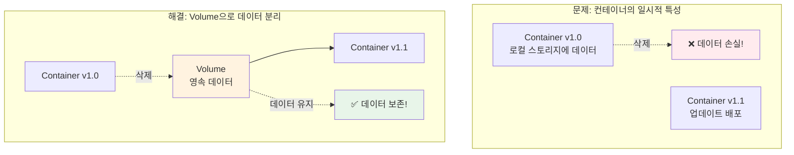
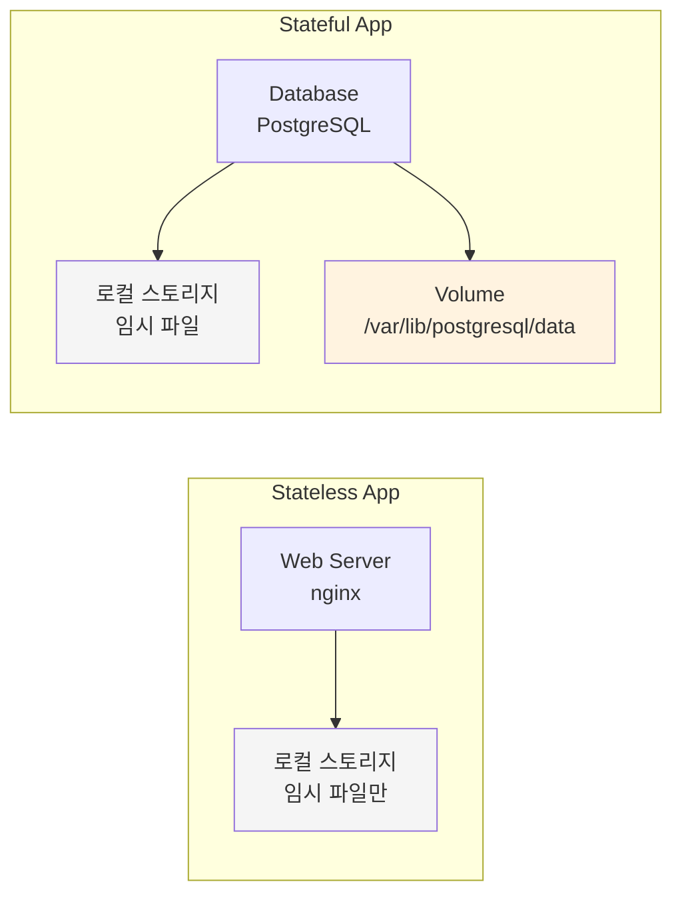
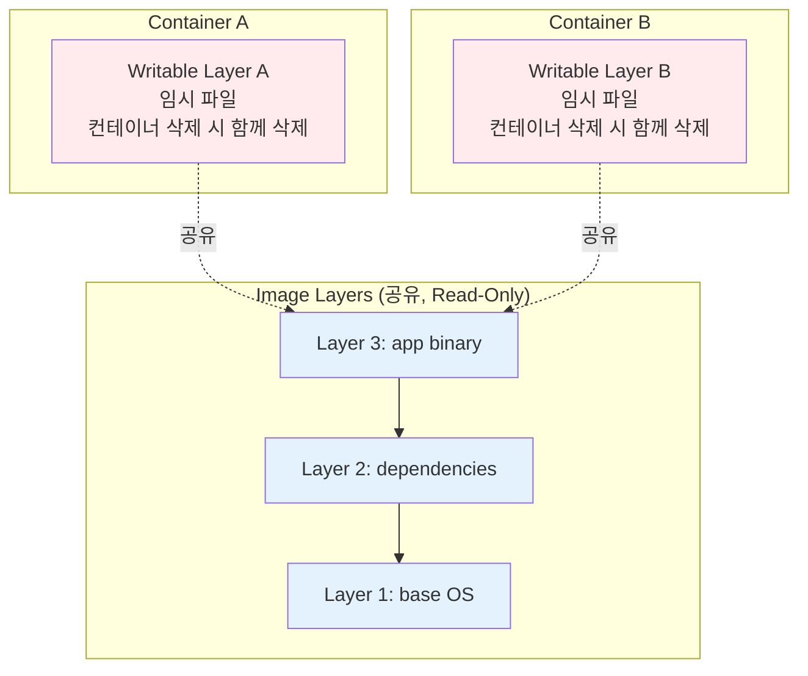
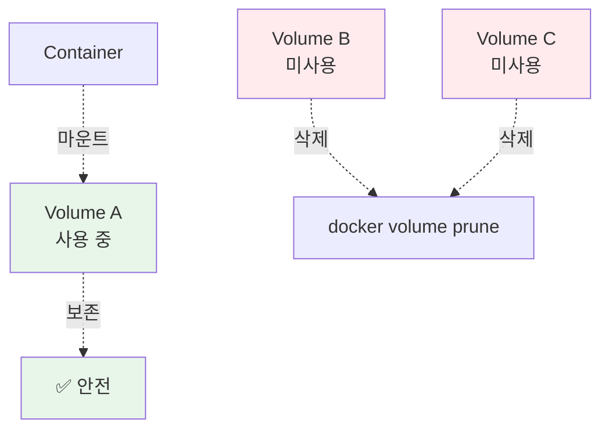
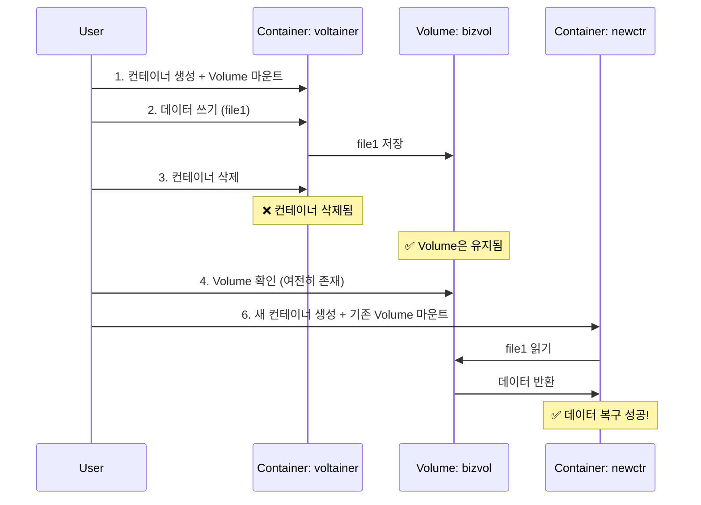
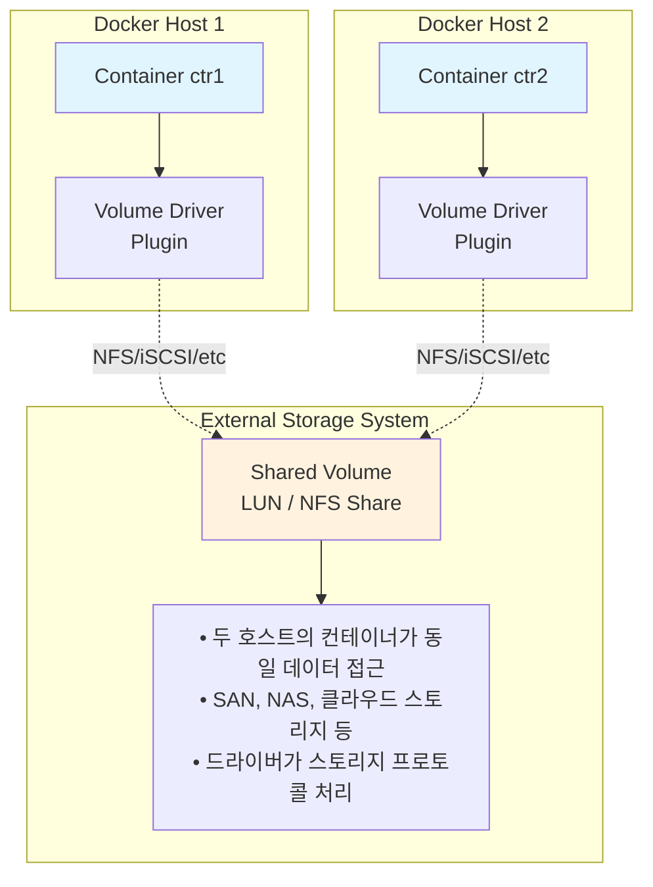
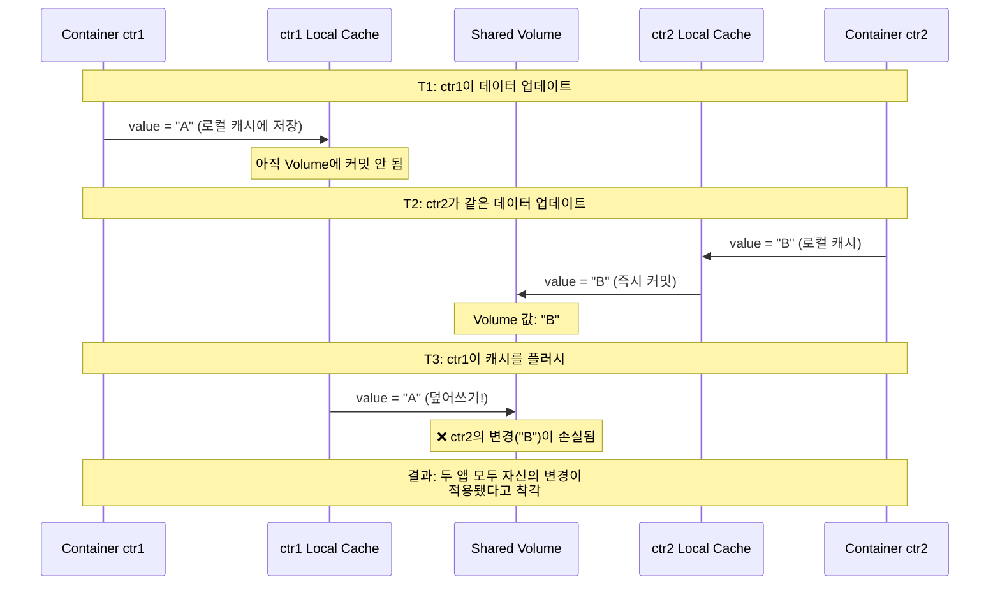

# Ch09. Volumes & Persistent Data

> 📌 **핵심 요약**
> Docker는 **비영속 데이터**를 위해 컨테이너 수명과 연결된 **로컬 스토리지 레이어**를, **영속 데이터**를 위해 컨테이너와 독립적인 수명 주기를 가진 **Volume**을 제공한다. Volume은 Docker의 **1급 객체(first-class object)**로, 컨테이너 삭제 후에도 데이터가 유지되며 다른 컨테이너에 마운트할 수 있다. 이는 컨테이너의 **일시적 특성**에도 불구하고 중요한 데이터를 영속화할 수 있게 한다.

## 🎯 학습 목표
1. 영속 데이터(Persistent)와 비영속 데이터(Non-persistent) 구분
2. Stateful 앱과 Stateless 앱의 차이 이해 및 데이터 관리 전략
3. 컨테이너의 로컬 스토리지 레이어(Writable Layer) 동작 파악
4. Docker Volume 생성, 검사, 삭제 명령어 숙달
5. Volume을 컨테이너에 마운트하는 방법 및 데이터 영속성 확인
6. 클러스터 노드 간 공유 스토리지 구성 및 데이터 손상 주의사항 이해

---

## 1. 컨테이너의 일시적 특성과 데이터 영속화

### 1.1 왜 Volume이 필요한가?

컨테이너는 **불변 인프라(Immutable Infrastructure)** 패러다임을 따른다. 설정 변경이 필요하면 기존 컨테이너를 수정하지 않고 새 컨테이너로 교체한다. 그러나 데이터베이스, 로그, 사용자 업로드 파일 같은 **중요한 데이터**는 컨테이너가 삭제되어도 보존되어야 한다. 이 모순을 해결하는 것이 **Volume**이다.



### 1.2 비유로 이해하기

Volume은 **외장 하드**와 같다. 노트북(컨테이너)을 교체해도 외장 하드의 데이터는 그대로 남아있다. 반면 노트북 내장 SSD(로컬 스토리지)의 임시 파일은 노트북을 버리면 함께 사라진다.

---

## 2. 데이터 유형과 애플리케이션 분류

### 2.1 데이터 유형

| 유형 | 설명 | 예시 | Docker 솔루션 | 컨테이너 삭제 시 |
|------|------|------|---------------|-----------------|
| **Persistent** | 보관해야 하는 중요한 데이터 | • 고객 기록<br/>• 금융 거래 데이터<br/>• 감사 로그<br/>• 사용자 업로드 파일 | **Volume** | 데이터 유지 |
| **Non-persistent** | 보관 불필요한 임시 데이터 | • 스크래치 파일<br/>• 세션 캐시<br/>• 임시 처리 데이터 | 로컬 스토리지 | 함께 삭제 |

### 2.2 애플리케이션 분류

| 유형 | 설명 | 예시 | 데이터 관리 전략 |
|------|------|------|-----------------|
| **Stateful** | 영속 데이터를 생성/관리하는 앱 | • MySQL, PostgreSQL<br/>• Redis (RDB/AOF 모드)<br/>• Kafka<br/>• Jenkins | Volume **필수**<br/>데이터 디렉토리 마운트 |
| **Stateless** | 영속 데이터를 생성하지 않는 앱 | • 정적 웹 서버<br/>• API Gateway<br/>• 순수 계산 서비스 | 로컬 스토리지로 충분<br/>필요시 로그만 Volume |



---

## 3. Volume 없는 컨테이너 (Ephemeral Storage)

### 3.1 로컬 스토리지 레이어 구조

모든 컨테이너는 **Writable Layer(쓰기 가능 레이어)**를 가진다. 왜 레이어가 필요한가? 여러 컨테이너가 동일한 읽기 전용 이미지 레이어를 **공유**하면서도 각자 독립적으로 파일을 수정할 수 있게 하기 위함이다.



### 3.2 로컬 스토리지 위치

| 플랫폼 | 경로 | 스토리지 드라이버 |
|--------|------|------------------|
| **Linux** | `/var/lib/docker/<storage-driver>/...` | overlay2 (권장)<br/>devicemapper (legacy) |
| **Windows** | `C:\ProgramData\Docker\windowsfilter\...` | windowsfilter |
| **macOS** | VM 내부 (`/var/lib/docker/...`) | overlay2 |

```bash
# 스토리지 드라이버 확인
docker info | grep "Storage Driver"
# Storage Driver: overlay2

# 컨테이너 실제 디렉토리 확인
docker inspect <container-id> | grep UpperDir
# "UpperDir": "/var/lib/docker/overlay2/abc123.../diff"
```

### 3.3 로컬 스토리지의 별칭들

Docker 문서와 커뮤니티에서 사용하는 다양한 용어들:
- **Thin writable layer**: 가볍게 추가되는 쓰기 레이어
- **Ephemeral storage**: 일시적 저장소
- **Read-write storage**: 읽기-쓰기 저장소
- **Graphdriver storage**: 스토리지 드라이버가 관리하는 영역

### 3.4 불변 객체(Immutable Object) 원칙

컨테이너는 **불변 객체**로 취급해야 한다. 왜 이것이 중요한가?

| 원칙 | 설명 | 권장 방법 | 피해야 할 방법 |
|------|------|-----------|----------------|
| **설정 변경 금지** | 라이브 컨테이너의 설정 직접 수정 지양 | 새 이미지 → 새 컨테이너 | `docker exec`로 설정 변경 |
| **재현 가능성** | 같은 이미지로 동일한 컨테이너 생성 | Dockerfile + IaC | 수동 설정 |
| **버전 관리** | 모든 변경사항은 Git에 기록 | Dockerfile 커밋 | 컨테이너 내부 수정 |

> ⚠️ **예외**: 데이터베이스 앱이 데이터를 변경하는 것은 정상 동작이다. 금지하는 것은 **사용자나 도구가 컨테이너 구성을 변경**하는 것이다.

---

## 4. Volume이 있는 컨테이너

### 4.1 Volume 사용의 세 가지 이유

| 이유 | 설명 | 사용 사례 |
|------|------|----------|
| **독립적 수명 주기** | 컨테이너 삭제 시에도<br/>Volume과 데이터 유지 | • 데이터베이스 업그레이드<br/>• 컨테이너 재배포<br/>• 롤백 시나리오 |
| **외부 스토리지 연결** | 클라우드/전용 스토리지<br/>시스템 통합 가능 | • AWS EBS, Azure Disk<br/>• NAS, SAN<br/>• Ceph, GlusterFS |
| **데이터 공유** | 여러 호스트의 컨테이너가<br/>동일 데이터 접근 | • 공유 설정 파일<br/>• 분산 로그 수집<br/>• 멀티 인스턴스 앱 |

### 4.2 Volume 마운트 구조

```mermaid
graph TB
    subgraph Container
        FS[Container Filesystem]
        APP[/app → Writable Layer<br/>임시]
        TMP[/tmp → Writable Layer<br/>임시]
        DATA[/data → Volume<br/>영속]

        FS --> APP
        FS --> TMP
        FS --> DATA
    end

    subgraph "Docker Volume"
        VOL[Volume: bizvol<br/>Driver: local<br/>Mountpoint: /var/lib/docker/volumes/bizvol/_data]
        VOL_DATA[실제 데이터 파일들<br/>• 컨테이너 삭제 후에도 유지<br/>• 다른 컨테이너에 마운트 가능<br/>• 외부 스토리지로 백엔드 변경 가능]

        VOL --> VOL_DATA
    end

    DATA -.마운트.-> VOL

    subgraph "External Storage (Optional)"
        EXT[AWS EBS<br/>Azure Disk<br/>NAS<br/>SAN]
    end

    VOL -.드라이버 연동.-> EXT

    style DATA fill:#fff3e0
    style VOL fill:#fff3e0
    style APP fill:#f5f5f5
    style TMP fill:#f5f5f5
```

### 4.3 Volume vs 로컬 스토리지 비교

| 특성 | 로컬 스토리지 | Volume |
|------|--------------|--------|
| **위치** | 컨테이너 레이어 내부 | Docker 관리 영역 |
| **수명 주기** | 컨테이너와 동일 | 컨테이너와 독립적 |
| **관리** | 스토리지 드라이버 자동 | `docker volume` 명령어 |
| **공유** | 불가능 | 여러 컨테이너 마운트 가능 |
| **백업** | 어려움 | `docker volume inspect`로 경로 확인 |
| **성능** | 드라이버 의존 | 호스트 파일시스템과 유사 |
| **이식성** | 낮음 | 높음 (드라이버 교체 가능) |

---

## 5. Docker Volume 생성 및 관리

### 5.1 Volume 생성

```bash
# 기본 로컬 드라이버로 Volume 생성
docker volume create myvol

# 다른 드라이버 지정 (플러그인 설치 필요)
docker volume create -d <driver-name> myvol

# 옵션과 함께 생성
docker volume create \
  --driver local \
  --opt type=nfs \
  --opt o=addr=192.168.1.100,rw \
  --opt device=:/path/to/dir \
  nfs-vol
```

### 5.2 Volume 목록 및 상세 정보

```bash
# Volume 목록 확인
docker volume ls
# DRIVER              VOLUME NAME
# local               myvol
# local               postgres-data

# Volume 상세 정보
docker volume inspect myvol
```

**inspect 출력 예시**:
```json
[
    {
        "CreatedAt": "2024-05-15T12:23:14Z",
        "Driver": "local",
        "Labels": null,
        "Mountpoint": "/var/lib/docker/volumes/myvol/_data",
        "Name": "myvol",
        "Options": null,
        "Scope": "local"
    }
]
```

**필드 설명**:
| 필드 | 설명 | 활용 |
|------|------|------|
| `Driver` | 사용 중인 드라이버 | local, 외부 드라이버 등 |
| `Scope` | 범위 | local (단일 호스트)<br/>global (클러스터) |
| `Mountpoint` | Docker 호스트 파일시스템 내<br/>실제 경로 | 백업 시 직접 접근<br/>(프로덕션에서는 비권장) |
| `Labels` | 메타데이터 태그 | 조직화, 자동화 |
| `Options` | 드라이버별 설정 | NFS 옵션, 암호화 등 |

### 5.3 Volume 삭제

```bash
# 특정 Volume 삭제
docker volume rm myvol

# 사용되지 않는 모든 Volume 삭제 (주의!)
docker volume prune

# 모든 Volume 삭제 (더욱 위험!)
docker volume prune --all

# 필터링하여 삭제
docker volume prune --filter "label=temporary=true"
```



> ⚠️ **주의**: 컨테이너에서 사용 중인 Volume은 삭제할 수 없다!

---

## 6. Volume을 컨테이너에 마운트하기

### 6.1 컨테이너 생성과 Volume 마운트

```bash
# Volume을 마운트하며 컨테이너 생성
docker run -it --name voltainer \
    --mount source=bizvol,target=/vol \
    alpine

# 짧은 형식 (-v 플래그, legacy)
docker run -it --name voltainer \
    -v bizvol:/vol \
    alpine
```

**--mount vs -v 비교**:
| 특성 | --mount | -v |
|------|---------|-----|
| 문법 | 명시적 키=값 | 콜론 구분 |
| 가독성 | 높음 | 낮음 (복잡한 옵션 시) |
| 권장도 | **권장** (Docker 17.06+) | 레거시 |
| Volume 자동 생성 | 예 | 예 |

### 6.2 --mount 플래그 동작

| 상황 | 동작 | 예시 |
|------|------|------|
| Volume이 이미 존재 | 기존 Volume 사용 | `--mount source=existing,target=/data` |
| Volume이 존재하지 않음 | **자동 생성** 후 마운트 | `--mount source=newvol,target=/data` |
| 읽기 전용 마운트 | `readonly` 옵션 추가 | `--mount source=vol,target=/data,readonly` |

```bash
# 읽기 전용 마운트
docker run -it --name ro-container \
    --mount source=config-vol,target=/config,readonly \
    alpine

# 컨테이너 내부에서 쓰기 시도
# echo "test" > /config/file
# sh: can't create /config/file: Read-only file system
```

### 6.3 실습: Volume 데이터 영속성 테스트

**목표**: 컨테이너를 삭제해도 Volume 데이터가 유지되는지 확인

```bash
# 1단계: 컨테이너 생성 및 Volume 마운트
docker run -it --name voltainer \
    --mount source=bizvol,target=/vol \
    alpine

# 2단계: Volume에 데이터 쓰기
docker exec -it voltainer sh
# echo "I promise to write a book review on Amazon" > /vol/file1
# cat /vol/file1
# I promise to write a book review on Amazon
# exit

# 3단계: 컨테이너 삭제
docker rm voltainer -f
# voltainer

# 4단계: Volume 확인 (여전히 존재!)
docker volume ls
# DRIVER              VOLUME NAME
# local               bizvol

# 5단계: 호스트에서 직접 데이터 확인 (비권장, 교육용)
sudo cat /var/lib/docker/volumes/bizvol/_data/file1
# I promise to write a book review on Amazon

# 6단계: 새 컨테이너에 기존 Volume 마운트
docker run -it --name newctr \
    --mount source=bizvol,target=/vol \
    alpine sh

# cat /vol/file1
# I promise to write a book review on Amazon  ← 데이터 복구 성공!
```



### 6.4 Dockerfile에서 Volume 정의

```dockerfile
# Dockerfile
FROM alpine
VOLUME /data    # 마운트 포인트만 지정
```

**제약사항**:
- Dockerfile에서는 **호스트 디렉토리를 지정할 수 없다**
- 왜? 호스트 OS마다 경로가 다르기 때문 (Linux: `/var`, Windows: `C:\`)
- **마운트 포인트만 선언**하고, 실제 Volume은 `docker run` 시점에 지정

```bash
# Dockerfile의 VOLUME 지시어 효과
docker build -t myapp .

# 실행 시 익명 Volume 자동 생성
docker run -d --name app1 myapp
# 익명 Volume: f3e2... (UUID 형태)

# 명시적 Volume 지정으로 덮어쓰기
docker run -d --name app2 \
    --mount source=named-vol,target=/data \
    myapp
```

---

## 7. 클러스터 노드 간 공유 스토리지

### 7.1 외부 스토리지 시스템 연동

단일 호스트의 로컬 Volume은 **멀티 호스트 환경**에서 한계가 있다. 왜 한계가 있는가? 컨테이너가 다른 노드로 재배치되면 데이터에 접근할 수 없기 때문이다.



### 7.2 공유 스토리지 구성 요구사항

| 요구사항 | 설명 | 예시 |
|----------|------|------|
| **전용 스토리지 시스템** | 네트워크 스토리지 필요 | • SAN (Fibre Channel, iSCSI)<br/>• NAS (NFS, CIFS/SMB)<br/>• 클라우드 스토리지 (EBS, Azure Disk, GCS Persistent Disk) |
| **Volume Driver/Plugin** | 외부 시스템과 Docker 연결 | • REX-Ray<br/>• Portworx<br/>• Longhorn<br/>• CSI 드라이버 |
| **애플리케이션 설계** | 동시 쓰기로 인한<br/>데이터 손상 방지 | • 분산 락<br/>• 조율 로직<br/>• 단일 Writer 패턴 |

### 7.3 Volume Driver 예시

```bash
# REX-Ray 드라이버 설치 (AWS EBS)
docker plugin install rexray/ebs \
    EBS_REGION=us-east-1

# EBS Volume 생성
docker volume create -d rexray/ebs \
    --opt size=20 \
    aws-vol

# 컨테이너에 마운트
docker run -d --name db \
    --mount source=aws-vol,target=/var/lib/mysql \
    mysql:8.0

# 다른 호스트에서 같은 Volume 마운트 가능
# (EBS는 Single-Attach이므로 동시 마운트 불가, 순차적으로만)
```

---

## 8. 데이터 손상(Corruption) 주의사항

### 8.1 공유 Volume의 위험성

여러 컨테이너가 동시에 같은 Volume에 **쓰기를 수행**하면 데이터 손상이 발생할 수 있다. 왜 손상되는가? 애플리케이션 레벨에서 **동시성 제어**가 없으면 캐시와 실제 스토리지 간 불일치가 발생하기 때문이다.

### 8.2 데이터 손상 시나리오



### 8.3 해결 방안

| 방법 | 설명 | 구현 예시 |
|------|------|----------|
| **분산 락** | 쓰기 전에 락 획득 | • Redis SETNX<br/>• etcd Lock API<br/>• ZooKeeper |
| **쓰기 작업 조율** | 단일 Writer 패턴 | • Leader Election<br/>• Active-Passive HA |
| **트랜잭션 로그** | Write-Ahead Log (WAL) | • PostgreSQL WAL<br/>• Kafka Log |
| **애플리케이션 설계** | 동시 쓰기 금지 | • Read-only replicas<br/>• Eventual consistency |

```bash
# Redis를 이용한 분산 락 예시 (의사 코드)
# 1. 락 획득 시도
SET lock:shared-data "ctr1" NX EX 30
# 성공하면 OK, 실패하면 다른 컨테이너가 이미 락 보유

# 2. 크리티컬 섹션 (데이터 쓰기)
echo "data" > /vol/shared-file

# 3. 락 해제
DEL lock:shared-data
```

### 8.4 안전한 공유 스토리지 사용 패턴

| 패턴 | 설명 | 권장 사용 |
|------|------|----------|
| **Read-Only 공유** | 모든 컨테이너가 읽기만 수행 | 설정 파일, 정적 리소스 |
| **Single Writer** | 1개 컨테이너만 쓰기 권한 | 로그 수집기, 백업 에이전트 |
| **Partitioned Data** | 각 컨테이너가 다른 파일/디렉토리 사용 | 멀티 테넌트 앱 |
| **Write-Once** | 초기화 시에만 쓰기, 이후 읽기만 | 부트스트랩 데이터 |

---

## 9. Bind Mount vs Volume

### 9.1 Bind Mount란?

**Bind Mount**는 호스트 파일시스템의 특정 경로를 컨테이너로 직접 마운트한다. Volume과 무엇이 다른가?

| 특성 | Bind Mount | Volume |
|------|------------|--------|
| **관리 주체** | 사용자가 직접 관리 | Docker가 관리 |
| **경로** | 호스트 임의 경로 | `/var/lib/docker/volumes/` |
| **이식성** | **낮음** (호스트 경로 의존) | 높음 |
| **백업** | 수동 | `docker volume` 명령어 |
| **성능** | 호스트와 동일 | 호스트와 유사 |
| **권장 용도** | 개발 환경 (코드 공유) | 프로덕션 데이터 영속화 |

### 9.2 Bind Mount 사용 예시

```bash
# Bind Mount (호스트 경로 직접 지정)
docker run -d --name dev-app \
    --mount type=bind,source=/Users/dev/myapp,target=/app \
    node:18

# 짧은 형식 (-v)
docker run -d --name dev-app \
    -v /Users/dev/myapp:/app \
    node:18

# 읽기 전용 Bind Mount
docker run -d --name readonly-app \
    --mount type=bind,source=/etc/config,target=/config,readonly \
    alpine
```

**Bind Mount의 장점** (개발 환경):
- 호스트에서 코드 편집 → 즉시 컨테이너에 반영
- IDE와 컨테이너 간 실시간 동기화

**Bind Mount의 단점** (프로덕션):
- 호스트 경로 의존 (이식성 낮음)
- 호스트 파일시스템 변경 시 위험
- 백업/복구 복잡

---

## 10. tmpfs Mount (메모리 기반 임시 스토리지)

### 10.1 tmpfs Mount란?

**tmpfs**는 **메모리에만 존재**하는 임시 파일시스템이다. 왜 사용하는가? 디스크 I/O를 피하고 보안(민감 데이터 자동 삭제)을 강화하기 위함이다.

| 특성 | 설명 |
|------|------|
| **위치** | 호스트 메모리 (RAM) |
| **영속성** | ❌ 컨테이너 정지 시 삭제 |
| **성능** | 🚀 매우 빠름 (메모리 속도) |
| **사용 사례** | • 민감 정보 임시 저장<br/>• 고속 캐시<br/>• 빌드 아티팩트 임시 저장 |

```bash
# tmpfs 마운트
docker run -d --name cache-app \
    --mount type=tmpfs,target=/cache,tmpfs-size=100m \
    redis:alpine

# 컨테이너 내부
# df -h
# Filesystem      Size  Used Avail Use% Mounted on
# tmpfs           100M     0  100M   0% /cache
```

---

## 11. 주요 명령어 정리

| 명령어 | 설명 | 예시 |
|--------|------|------|
| `docker volume create <name>` | Volume 생성 | `docker volume create mydata` |
| `docker volume create -d <driver>` | 특정 드라이버로 생성 | `docker volume create -d rexray/ebs aws-vol` |
| `docker volume ls` | 모든 Volume 목록 | `docker volume ls` |
| `docker volume inspect <name>` | Volume 상세 정보 | `docker volume inspect mydata` |
| `docker volume rm <name>` | 특정 Volume 삭제 | `docker volume rm mydata` |
| `docker volume prune` | 미사용 Volume 삭제 | `docker volume prune` |
| `--mount source=<vol>,target=<path>` | 컨테이너에 Volume 마운트 | `--mount source=db-vol,target=/var/lib/mysql` |
| `--mount type=bind,source=<host>,target=<ctr>` | Bind Mount | `--mount type=bind,source=/code,target=/app` |
| `--mount type=tmpfs,target=<path>` | tmpfs Mount | `--mount type=tmpfs,target=/cache` |

---

## 12. 정리

### 12.1 핵심 포인트

Docker 스토리지 전략은 **데이터 특성**에 따라 달라진다:

1. **일시적 데이터**: 컨테이너 로컬 스토리지 (Writable Layer)
2. **영속 데이터**: Docker Volume (1급 객체, 독립적 수명 주기)
3. **개발 환경**: Bind Mount (코드 실시간 공유)
4. **고속 임시 저장**: tmpfs Mount (메모리 기반)
5. **클러스터 환경**: 외부 스토리지 + Volume Driver

### 12.2 실무 권장사항

| 상황 | 권장 방법 | 이유 |
|------|----------|------|
| 데이터베이스 | Volume | 데이터 영속성 필수 |
| 로그 수집 | Volume (공유) | 중앙 집중식 로그 관리 |
| 로컬 개발 | Bind Mount | 코드 실시간 반영 |
| 설정 파일 | Volume (읽기 전용) | 불변 설정 공유 |
| 임시 캐시 | tmpfs | 성능 + 보안 |
| 프로덕션 | Volume + 외부 스토리지 | 고가용성 + 백업 |

### 12.3 다음 챕터 연결

Ch10에서는 **Docker Compose**를 다룬다:
- 멀티 컨테이너 애플리케이션 정의
- `docker-compose.yml`에서 Volume 선언
- 네트워크 + Volume 통합 관리
- 개발/테스트 환경 자동화

---

## ✅ 체크리스트

### 개념 이해
- [ ] Persistent vs Non-persistent 데이터 구분
- [ ] Stateful vs Stateless 애플리케이션 이해
- [ ] 컨테이너의 Writable Layer와 Volume의 차이
- [ ] Volume이 1급 객체인 이유
- [ ] 불변 객체 원칙의 중요성

### Volume 관리
- [ ] `docker volume create`: Volume 생성
- [ ] `docker volume ls`: Volume 목록
- [ ] `docker volume inspect`: 상세 정보 (Mountpoint 확인)
- [ ] `docker volume rm`: 특정 Volume 삭제
- [ ] `docker volume prune`: 미사용 Volume 일괄 삭제 (주의)

### 컨테이너와 Volume 연결
- [ ] `--mount source=<vol>,target=<path>`: Volume 마운트
- [ ] Volume 미존재 시 자동 생성 동작 이해
- [ ] 컨테이너 삭제 후 Volume 존속 확인
- [ ] 기존 Volume을 새 컨테이너에 마운트
- [ ] 읽기 전용 마운트 (`readonly` 옵션)

### 스토리지 유형
- [ ] Volume vs Bind Mount vs tmpfs 비교
- [ ] Bind Mount 사용 시나리오 (개발 환경)
- [ ] tmpfs의 성능 이점과 한계

### 고급 개념
- [ ] 외부 스토리지 시스템 연동 구조 이해
- [ ] Volume Driver/Plugin 역할
- [ ] 공유 스토리지의 데이터 손상 위험
- [ ] 분산 락, 쓰기 조율 해결 방안
- [ ] Dockerfile VOLUME 명령어 제약사항

### 운영 원칙
- [ ] 컨테이너는 불변 객체로 취급
- [ ] 프로덕션에서 호스트 파일시스템 직접 접근 지양
- [ ] 공유 Volume 사용 시 동시성 제어 설계
- [ ] 백업/복구 전략 수립

---

## 🔗 참고 자료

- [Docker Volumes 공식 문서](https://docs.docker.com/storage/volumes/)
- [Manage data in Docker](https://docs.docker.com/storage/)
- [Bind mounts](https://docs.docker.com/storage/bind-mounts/)
- [tmpfs mounts](https://docs.docker.com/storage/tmpfs/)
- [Storage drivers](https://docs.docker.com/storage/storagedriver/)
- [Volume plugins](https://docs.docker.com/engine/extend/plugins_volume/)
- [REX-Ray Documentation](https://rexray.readthedocs.io/)
- 도서: *Docker Deep Dive* - Nigel Poulton, Chapter 15
