# Ch10. Docker Security

> 📌 **핵심 요약**
> Docker 보안은 다층 방어(Defense in Depth) 원칙을 따른다. Linux 커널 보안 기술(Namespaces, Cgroups, Capabilities, MAC, seccomp)을 기반으로 하고, Docker 고유 기술(Swarm TLS, Docker Scout, Content Trust, Secrets)을 추가한다. 대부분 합리적인 기본값이 적용되어 별도 설정 없이도 적절한 보안이 제공되지만, 프로덕션 환경에서는 커스터마이징이 필요하다.

## 🎯 학습 목표
1. Docker의 다층 보안 아키텍처를 이해하고 각 레이어의 역할을 설명할 수 있다
2. Linux 보안 기술(Namespaces, Cgroups, Capabilities, MAC, seccomp)의 동작 원리를 파악한다
3. Swarm의 자동 보안 설정(TLS, Join Token, CA)을 활용할 수 있다
4. Docker Scout로 이미지 취약점을 스캔하고 해결 방안을 찾는다
5. Docker Content Trust(DCT)로 이미지 무결성과 게시자를 검증한다
6. Docker Secrets로 민감 데이터를 안전하게 관리한다

---

## 1. Docker 보안 개요

### 1.1 왜 다층 방어인가?

Docker 보안은 단일 방어선에 의존하지 않는다. 여러 겹의 보안 레이어가 있어 한 겹이 뚫려도 다른 겹들이 보호한다. 이는 실제 공격 시나리오에서 공격자가 여러 단계를 돌파해야 하므로, 공격 난이도를 기하급수적으로 높인다.

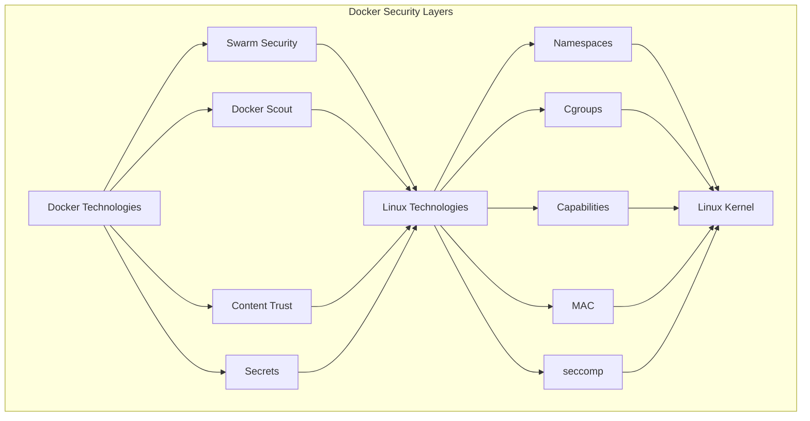

### 1.2 보안 레이어 구성

Docker 보안은 크게 두 가지 계층으로 나뉜다.

**Linux 보안 기술 (기반층)**:
- Namespaces: 프로세스 격리
- Cgroups: 리소스 제한
- Capabilities: 권한 최소화
- MAC (Mandatory Access Control): 접근 제어
- seccomp: 시스템 콜 필터링

**Docker 보안 기술 (응용층)**:
- Swarm Security: 클러스터 노드 간 보안
- Docker Scout: 이미지 취약점 스캔
- Content Trust: 이미지 서명/검증
- Secrets: 민감 데이터 관리

이러한 계층화는 왜 중요한가? 각 레이어가 특정 보안 목표를 담당하므로, 한 레이어의 취약점이 전체 시스템을 무너뜨리지 않는다. 또한 각 레이어는 독립적으로 강화할 수 있어 보안 요구사항에 따라 선택적으로 적용할 수 있다.

---

## 2. Linux 보안 기술

### 2.1 Kernel Namespaces: 격리의 핵심

#### 왜 Namespace가 필요한가?

전통적인 운영체제에서는 모든 프로세스가 동일한 환경을 공유한다. 이는 한 프로세스가 다른 프로세스의 리소스를 볼 수 있고, 잠재적으로 접근할 수 있다는 의미다. Namespace는 이 문제를 해결하기 위해 각 컨테이너에게 독립적인 OS 구조를 제공한다.

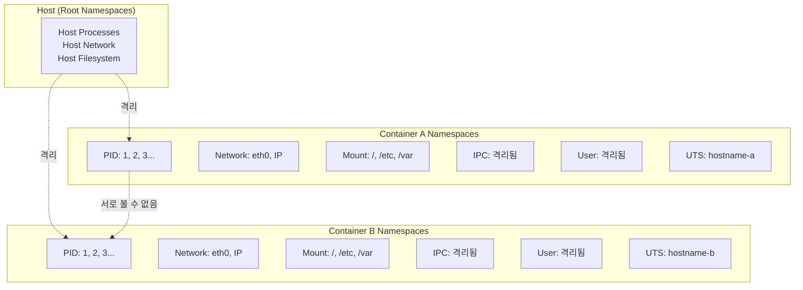

#### 6가지 Namespace 상세

| Namespace | 약어 | 격리 대상 | 왜 필요한가? |
|-----------|------|-----------|--------------|
| **Process ID** | pid | 프로세스 트리 | 각 컨테이너가 고유한 PID 1을 가지고, 다른 컨테이너의 프로세스를 볼 수 없도록 한다 |
| **Network** | net | 네트워크 스택 | 고유한 IP, 포트, 라우팅 테이블을 제공하여 네트워크 충돌을 방지한다 |
| **Mount** | mnt | 파일시스템 | 각 컨테이너가 독립적인 루트(/) 파일시스템을 가져 파일 충돌을 방지한다 |
| **IPC** | ipc | 공유 메모리 | 컨테이너 내 프로세스 간 공유 메모리를 격리하여 정보 유출을 방지한다 |
| **User** | user | 사용자 ID | 컨테이너 내 root를 호스트의 일반 사용자로 매핑하여 권한 상승을 방지한다 |
| **UTS** | uts | 호스트명 | 각 컨테이너가 고유한 hostname을 가져 식별 및 로깅이 용이하다 |

#### Namespace vs Hypervisor

이 두 가지는 근본적으로 다른 접근 방식이다. Hypervisor는 물리적 자원(CPU, 메모리, 디스크)을 가상화하여 완전한 가상 머신을 만든다. 반면 Namespace는 OS 구조(프로세스 트리, 파일시스템)를 가상화하여 경량 컨테이너를 만든다.

**왜 Namespace가 효율적인가?**
- 호스트 커널을 공유하므로 오버헤드가 낮다
- 빠른 시작 시간 (VM: 분 단위, 컨테이너: 초 단위)
- 높은 밀도 (동일 호스트에서 더 많은 컨테이너 실행 가능)

**왜 추가 보안 기술이 필요한가?**
- 커널 공유로 인한 격리 강도가 VM보다 약하다
- 커널 취약점이 모든 컨테이너에 영향을 미칠 수 있다
- 따라서 Cgroups, Capabilities, seccomp 등 추가 레이어가 필수적이다

### 2.2 Control Groups (Cgroups): 리소스 제한

#### 왜 격리만으로는 부족한가?

Namespace는 프로세스를 "보지 못하게" 격리하지만, 공유 자원(CPU, RAM, I/O)에 대한 제한은 제공하지 않는다. 한 컨테이너가 모든 CPU를 소비하면 다른 컨테이너가 굶주릴 수 있다. Cgroups는 이 문제를 해결한다.

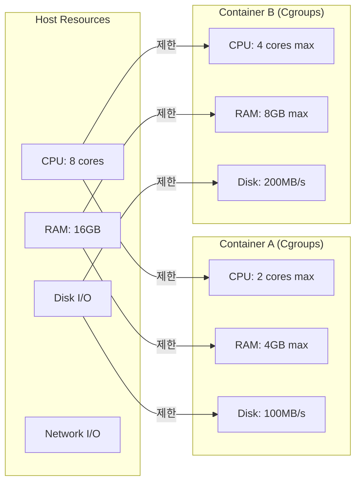

#### Cgroups가 제한하는 공유 자원

- **CPU**: 컨테이너가 사용할 수 있는 CPU 코어 수 또는 시간 제한
- **RAM**: 메모리 사용량 제한, 초과 시 OOM Killer 발동
- **Network I/O**: 네트워크 대역폭 제한
- **Disk I/O**: 디스크 읽기/쓰기 속도 제한

**DoS 공격 방지 시나리오**:
1. 악의적인 컨테이너가 무한 루프로 CPU 100% 소비 시도
2. Cgroups가 해당 컨테이너의 CPU를 설정된 제한(예: 2 코어)으로 제한
3. 다른 컨테이너는 정상적으로 나머지 CPU 사용 가능

이는 왜 중요한가? 멀티테넌시 환경(여러 사용자가 동일 호스트 공유)에서 한 사용자의 자원 독점을 방지하고, 공정한 자원 배분을 보장한다.

### 2.3 Capabilities: 권한의 세밀한 제어

#### 전통적인 권한 모델의 문제점

전통적인 Unix에서는 사용자가 두 가지 중 하나였다.
- **root (UID 0)**: 모든 권한 보유
- **일반 사용자**: 제한된 권한

이는 너무 이분법적이다. 예를 들어, 웹 서버가 80번 포트에 바인딩하려면 root 권한이 필요하지만, 시스템 재부팅 권한까지 필요하지는 않다.

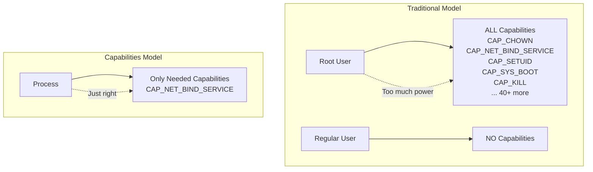

#### Docker의 Capabilities 활용

Docker는 최소 권한 원칙(Principle of Least Privilege)을 구현한다.

**동작 방식**:
1. 컨테이너를 root로 시작
2. 모든 Capabilities 제거
3. 필요한 Capabilities만 선택적으로 추가
4. 결과: root이지만 제한된 권한만 보유

**주요 Capabilities 예시**:

| Capability | 기능 | 사용 예시 |
|-----------|------|----------|
| `CAP_CHOWN` | 파일 소유권 변경 | 설치 스크립트 |
| `CAP_NET_BIND_SERVICE` | 1-1024번 포트 바인딩 | 웹 서버 (80, 443) |
| `CAP_SETUID` | 프로세스 UID 변경 | sudo, su |
| `CAP_SYS_BOOT` | 시스템 재부팅 | 컨테이너에서 거의 불필요 |
| `CAP_KILL` | 프로세스 종료 | 프로세스 관리자 |
| `CAP_NET_ADMIN` | 네트워크 설정 변경 | VPN, 방화벽 |

**왜 이것이 보안을 강화하는가?**
- 컨테이너가 침해되어도 공격자가 할 수 있는 행동이 제한된다
- 예: `CAP_SYS_BOOT`이 없으면 호스트 재부팅 불가능
- 침해된 컨테이너에서 다른 컨테이너로의 pivot 공격을 어렵게 만든다

**Docker 기본 Capabilities**:
Docker는 합리적인 기본 capabilities 세트를 제공하지만, 프로덕션에서는 애플리케이션 요구사항에 맞게 커스터마이징을 권장한다.

```bash
# Capability 추가
docker run --cap-add NET_ADMIN myimage

# Capability 제거
docker run --cap-drop CHOWN myimage

# 모든 Capability 제거
docker run --cap-drop ALL myimage
```

### 2.4 Mandatory Access Control (MAC)

#### DAC의 한계와 MAC의 필요성

전통적인 Unix 권한 모델은 DAC (Discretionary Access Control)이다. 파일 소유자가 권한을 "임의로" 설정할 수 있다. 이는 유연하지만, 소유자가 실수하거나 침해당하면 보안이 무너진다.

MAC (Mandatory Access Control)은 시스템 관리자가 정의한 정책을 강제한다. 파일 소유자라도 정책을 위반할 수 없다.

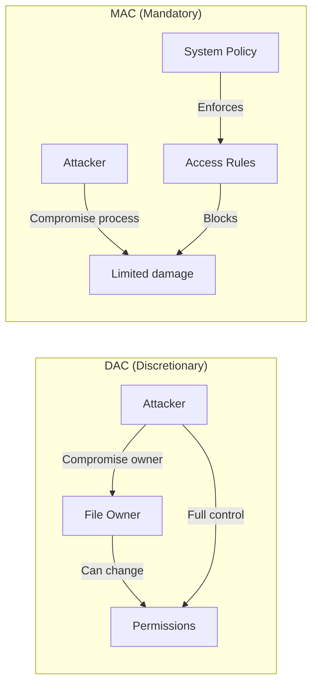

#### Docker에서의 MAC 지원

Docker는 Linux 배포판에 따라 자동으로 MAC 시스템을 활용한다.

**지원 기술**:
- **AppArmor**: Debian/Ubuntu 계열
- **SELinux**: RHEL/CentOS/Fedora 계열

**기본 프로파일 철학**:
- 중간 수준 보호: 대부분의 공격 차단
- 높은 앱 호환성: 대부분의 애플리케이션이 수정 없이 작동
- 합리적인 기본값: 별도 설정 없이 적절한 보안 제공

**왜 커스텀 프로파일이 복잡한가?**
- 애플리케이션의 모든 파일 접근, 네트워크 연결, IPC 통신을 정의해야 한다
- 정책이 너무 엄격하면 앱이 작동하지 않는다
- 정책이 너무 느슨하면 보안 효과가 없다
- 광범위한 테스트가 필요하다

**권장 접근 방식**:
1. 개발/테스트 환경에서는 기본 프로파일 사용
2. 프로덕션에서는 앱별로 커스텀 프로파일 작성
3. Audit 모드로 앱 동작을 관찰하여 필요한 권한 파악
4. 점진적으로 정책을 강화

### 2.5 seccomp: 시스템 콜 필터링

#### 왜 syscall을 제한해야 하는가?

컨테이너 내 프로세스는 호스트 커널에 직접 시스템 콜(syscall)을 요청한다. Linux 커널은 300개 이상의 syscall을 제공하지만, 대부분의 애플리케이션은 이 중 일부만 사용한다. 사용하지 않는 syscall은 공격 표면(attack surface)이 된다.

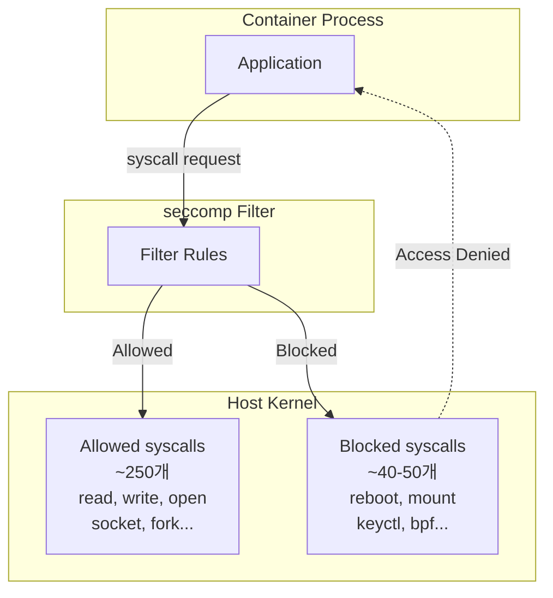

#### Docker 기본 seccomp 프로파일

Docker는 기본적으로 약 40-50개의 syscall을 차단한다. 차단되는 syscall의 예시:

**차단 대상 syscall**:
- `reboot`: 시스템 재부팅
- `mount`/`umount`: 파일시스템 마운트
- `keyctl`: 커널 키링 조작
- `bpf`: BPF 프로그램 로드
- `perf_event_open`: 성능 모니터링

**왜 이 syscall들이 위험한가?**
- 호스트 시스템에 직접적인 영향을 미칠 수 있다
- 컨테이너 격리를 우회할 수 있다
- 커널 취약점 익스플로잇에 자주 사용된다

**보안과 호환성의 균형**:
Docker의 기본 프로파일은 보안과 애플리케이션 호환성을 균형있게 고려한다. 너무 많은 syscall을 차단하면 정상 애플리케이션도 작동하지 않기 때문이다.

**커스텀 프로파일 사용 시나리오**:
- 고도로 민감한 애플리케이션
- 특정 규제 요구사항 (PCI-DSS, HIPAA 등)
- 알려진 공격 벡터에 대한 추가 방어

```bash
# 커스텀 seccomp 프로파일 적용
docker run --security-opt seccomp=/path/to/seccomp.json myimage

# seccomp 비활성화 (비권장, 테스트용)
docker run --security-opt seccomp=unconfined myimage
```

---

## 3. Docker 보안 기술

### 3.1 Swarm 보안: 자동화된 클러스터 보안

#### 왜 Swarm 보안이 중요한가?

분산 시스템에서 가장 큰 보안 과제는 노드 간 신뢰 관계 구축이다. 어떻게 새 노드가 정당한 노드인지 확인하고, 노드 간 통신을 안전하게 보호할 것인가? Swarm은 이를 자동화한다.

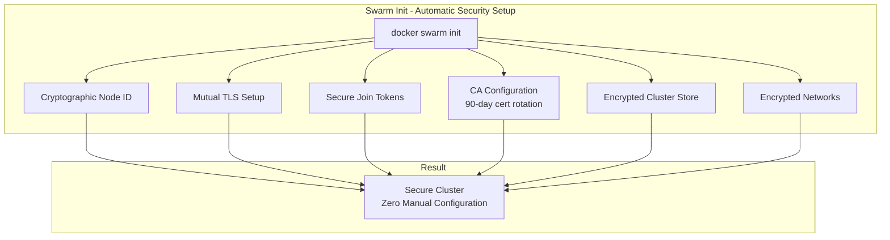

#### 자동 설정되는 보안 기능

| 기능 | 설명 | 왜 중요한가? |
|------|------|--------------|
| **Cryptographic Node ID** | 각 노드 고유 암호화 ID | 노드 식별 및 인증 기반 |
| **Mutual TLS** | 노드 간 상호 인증 | 중간자 공격(MITM) 방지 |
| **Secure Join Tokens** | Manager/Worker 토큰 분리 | 역할별 접근 제어 |
| **CA 자동 구성** | 90일 인증서 자동 로테이션 | 인증서 만료 방지, 관리 부담 감소 |
| **Encrypted Cluster Store** | etcd 기반 암호화 저장소 | 클러스터 상태 보호 |
| **Encrypted Networks** | 네트워크 트래픽 암호화 | 데이터 도청 방지 |

#### Join Token 구조와 보안

```
SWMTKN-1-<cluster-certificate-hash>-<manager-or-worker-token>
```

**구성 요소**:
- `SWMTKN`: 접두사, 유출 시 자동 탐지 도구가 패턴 매칭에 사용
- `1`: 버전 번호
- `cluster-certificate-hash`: Swarm 클러스터 고유 인증서 해시
- `manager-or-worker-token`: 역할별 고유 토큰

**왜 Manager와 Worker 토큰을 분리하는가?**
- Manager는 클러스터를 제어할 수 있으므로 더 높은 권한을 가진다
- Worker 토큰이 유출되어도 공격자는 Manager가 될 수 없다
- 최소 권한 원칙의 실제 적용 사례

**토큰 유출 시 대응**:
```bash
# Manager 토큰 무효화 및 새 토큰 발급
docker swarm join-token --rotate manager

# 기존 Manager는 영향 없음
# 새로운 Manager 조인 시에만 새 토큰 필요
```

이는 왜 안전한가? 토큰 로테이션은 기존 노드의 인증서를 무효화하지 않는다. 단지 새로운 노드가 조인할 때 사용하는 토큰만 변경한다. 따라서 서비스 중단 없이 보안 사고에 대응할 수 있다.

#### TLS 인증서와 CA 관리

**자동 인증서 발급 프로세스**:
1. `docker swarm init` 실행 시 자체 CA 생성
2. 각 노드에 TLS 인증서 발급
3. 인증서에 노드 ID, 역할, Swarm ID 포함
4. 90일 후 자동으로 인증서 로테이션

```bash
# 노드 인증서 확인
sudo openssl x509 \
  -in /var/lib/docker/swarm/certificates/swarm-node.crt \
  -text

# 출력 예시:
# Subject: O = tcz3w1t7yu0s4wacovn1rtgp4,    # Swarm ID
#          OU = swarm-manager,                 # 노드 역할
#          CN = 2gxz2h1f0rnmc3atm35qcd1zw     # 노드 ID
#
# Validity:
#   Not Before: May 23 08:23:00 2024 GMT
#   Not After : Aug 21 09:23:00 2024 GMT     # 90일 후 만료
```

**왜 90일인가?**
- 침해된 인증서의 유효 기간을 제한
- 자동 로테이션으로 관리 부담 최소화
- 업계 권장 사항 (Let's Encrypt도 90일 사용)

**CA 설정 커스터마이징**:
```bash
# 인증서 로테이션 주기 변경 (30일로)
docker swarm update --cert-expiry 720h

# 외부 CA 사용
docker swarm ca --external-ca protocol=cfssl,url=https://ca.example.com
```

### 3.2 Docker Scout: 이미지 취약점 스캐닝

#### 왜 이미지 스캐닝이 필요한가?

컨테이너 이미지는 OS 패키지, 라이브러리, 애플리케이션 의존성을 포함한다. 이들 중 하나라도 알려진 취약점을 가지고 있으면 공격 대상이 된다. Docker Scout는 이미지를 분석하여 취약점을 찾아낸다.

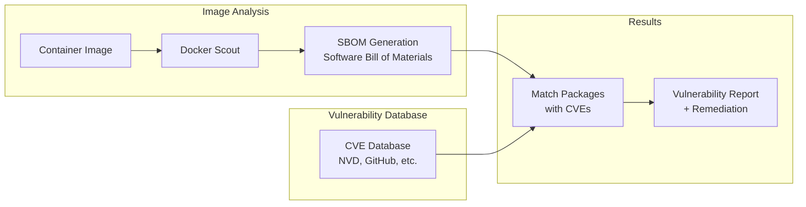

#### SBOM (Software Bill of Materials)

SBOM은 이미지에 포함된 모든 소프트웨어 구성 요소의 목록이다. 이는 왜 중요한가?
- 이미지에 무엇이 들어있는지 투명하게 공개
- 새로운 취약점 발견 시 영향받는 이미지 즉시 파악
- 규제 요구사항 충족 (예: SBOM 제출 의무화)

**Scout 사용 예시**:

```bash
# 빠른 취약점 개요
docker scout quickview nigelpoulton/tu-demo:latest

    ✓ Indexed 66 packages

  Target             │  nigelpoulton/tu-demo:latest
    digest           │  b4210d0aa52f
  Base image         │  python:3-alpine        │  0C  2H  1M  0L
  Updated base image │  python:3.11-alpine     │  0C  1H  1M  0L
```

**취약점 등급 이해**:

| 등급 | 약자 | CVSS 점수 | 대응 우선순위 |
|------|------|-----------|---------------|
| Critical | C | 9.0-10.0 | 즉시 조치 필수 |
| High | H | 7.0-8.9 | 높은 우선순위 |
| Medium | M | 4.0-6.9 | 중간 우선순위 |
| Low | L | 0.1-3.9 | 낮은 우선순위 |

**상세 취약점 정보**:

```bash
# CVE 상세 정보 및 해결책
docker scout cves nigelpoulton/tu-demo:latest

## Packages and Vulnerabilities
   0C     1H     1M     0L  expat 2.5.0-r2

    ✗ HIGH CVE-2023-52425
      https://scout.docker.com/v/CVE-2023-52425
      Affected range : <2.6.0-r0
      Fixed version  : 2.6.0-r0        ← 해결 버전 제안!
```

**왜 Fixed version이 중요한가?**
- 수동으로 CVE를 검색하지 않아도 됨
- 베이스 이미지 업데이트 또는 패키지 버전 업그레이드로 즉시 해결 가능
- 자동화된 이미지 빌드 파이프라인에 통합 가능

**한계 인식**:
Docker Scout는 이미지 내부만 스캔한다. 다음은 감지하지 못한다.
- 네트워크 설정 오류
- 노드 보안 문제
- 오케스트레이터 설정 오류
- 런타임 동작 기반 공격

따라서 Scout는 보안 전략의 일부이지 전부가 아니다.

### 3.3 Docker Content Trust (DCT): 이미지 무결성 검증

#### 왜 이미지 서명이 필요한가?

이미지를 Registry에서 Pull할 때 두 가지 위험이 있다.
1. **무결성**: 이미지가 전송 중 변조되지 않았는가?
2. **출처**: 이미지가 신뢰할 수 있는 게시자로부터 온 것인가?

DCT는 암호화 서명을 사용하여 이 두 가지를 보장한다.

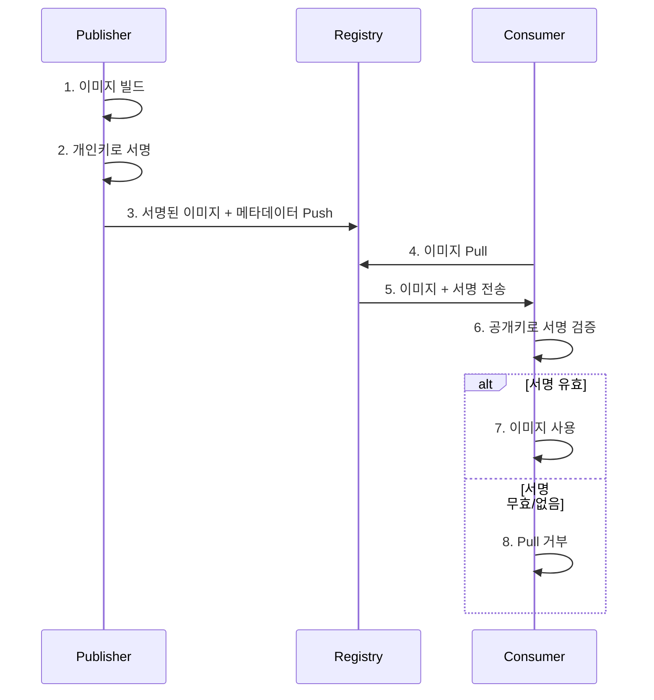

#### DCT 설정 및 워크플로우

**키 생성 및 설정**:

```bash
# 1단계: 키 페어 생성
docker trust key generate nigel
Enter passphrase for new nigel key with ID 1f78609:
Successfully generated and loaded private key...

# 개인키: ~/.docker/trust/private/1f78609.key (안전하게 보관!)
# 공개키: nigel.pub (배포 가능)
```

**왜 passphrase가 필요한가?**
- 개인키 파일이 유출되어도 passphrase 없이는 사용 불가
- 다층 방어의 또 다른 예시

**키를 레포지토리에 연결**:

```bash
# 2단계: 공개키를 레포지토리에 등록
docker trust signer add --key nigel.pub nigel nigelpoulton/ddd-trust
Adding signer "nigel" to nigelpoulton/ddd-trust...
Successfully added signer: nigel to nigelpoulton/ddd-trust
```

**이미지 서명 및 푸시**:

```bash
# 3단계: 이미지 서명 및 푸시
docker trust sign nigelpoulton/ddd-trust:signed
Signing and pushing trust data...
Successfully signed docker.io/nigelpoulton/ddd-trust:signed
```

**서명 정보 확인**:

```bash
# 4단계: 서명 검증
docker trust inspect nigelpoulton/ddd-trust:signed --pretty
Signatures for nigelpoulton/ddd-trust:signed
  SIGNED TAG   DIGEST                    SIGNERS
  signed       30e6d35703c578ee...       nigel
```

#### DCT 강제 활성화

**왜 환경변수로 제어하는가?**
- 개발 환경에서는 유연성이 필요 (서명 없는 테스트 이미지 사용)
- 프로덕션 환경에서는 엄격한 검증 필요
- 환경별로 다른 정책 적용 가능

```bash
# DCT 강제 활성화
export DOCKER_CONTENT_TRUST=1

# 서명 없는 이미지 Pull 시도 → 실패!
docker pull nigelpoulton/ddd-book:web0.2
Error: remote trust data does not exist...

# 서명된 이미지 Pull → 성공!
docker pull nigelpoulton/ddd-trust:signed
Pull (1 of 1): nigelpoulton/ddd-trust:signed@sha256:30e6...
```

**CI/CD 파이프라인 통합**:
1. 빌드 서버에서 이미지 빌드
2. 빌드 서버의 개인키로 이미지 서명
3. Registry에 푸시
4. 프로덕션 환경에서 `DOCKER_CONTENT_TRUST=1` 설정
5. 서명된 이미지만 배포 가능

이는 왜 공급망 공격을 방지하는가? 공격자가 Registry를 침해하여 이미지를 변조하더라도, 개인키 없이는 유효한 서명을 생성할 수 없다. 따라서 변조된 이미지는 검증 단계에서 거부된다.

### 3.4 Docker Secrets: 민감 데이터 관리

#### 왜 환경변수로 시크릿을 전달하면 안 되는가?

전통적으로 많은 애플리케이션이 환경변수로 비밀번호, API 키 등을 받는다. 하지만 이는 여러 문제가 있다.
- `docker inspect`로 환경변수가 노출된다
- 로그에 환경변수가 기록될 수 있다
- 프로세스 목록(`ps`)에서 보일 수 있다
- 디스크에 저장되어 삭제 후에도 복구 가능

Docker Secrets는 이 문제를 해결한다.

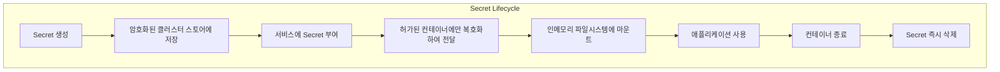

#### Docker Secrets의 보안 특성

**암호화 at rest (저장 중 암호화)**:
- 클러스터 스토어(etcd)에 암호화되어 저장
- 디스크에서 Secret을 읽어도 복호화 키 없이는 사용 불가

**암호화 in flight (전송 중 암호화)**:
- Manager에서 Worker로 Secret 전송 시 TLS로 암호화
- 네트워크 도청으로도 Secret 탈취 불가능

**인메모리 파일시스템 마운트**:
- `/run/secrets/` 경로는 tmpfs (RAM 기반)
- 디스크에 저장되지 않아 재부팅 후 복구 불가능
- 컨테이너 종료 시 즉시 삭제

**최소 권한 모델**:
- 명시적으로 허가된 서비스만 Secret 접근 가능
- 같은 호스트의 다른 컨테이너도 접근 불가

#### Secrets 사용 예시

**Secret 생성**:

```bash
# 파일에서 Secret 생성
echo "mypassword" | docker secret create db_password -

# 또는 파일에서 직접
docker secret create db_cert ./server.crt
```

**서비스에 Secret 연결**:

```bash
# 서비스 생성 시 Secret 연결
docker service create --name myapp \
    --secret db_password \
    --secret db_cert \
    myimage

# 컨테이너 내부에서 Secret 접근
# /run/secrets/db_password
# /run/secrets/db_cert
```

**애플리케이션 코드에서 사용**:

```python
# Python 예시
with open('/run/secrets/db_password', 'r') as f:
    db_password = f.read().strip()

# 환경변수보다 안전한 이유:
# 1. docker inspect에 노출 안 됨
# 2. 프로세스 목록에 노출 안 됨
# 3. 디스크에 저장 안 됨
```

**Swarm 모드 필수 이유**:
- Secrets는 암호화된 클러스터 스토어(etcd)에 저장
- 단일 Docker 엔진에는 클러스터 스토어가 없음
- Swarm 모드로 전환하면 단일 노드 클러스터도 Secrets 사용 가능

```bash
# 단일 노드에서 Secrets 사용
docker swarm init
docker secret create my_secret ./secret.txt
```

---

## 4. 보안 베스트 프랙티스

### 4.1 이미지 보안

**최소한의 베이스 이미지 사용**:
```dockerfile
# 나쁜 예: 불필요한 패키지 다수 포함
FROM ubuntu:latest

# 좋은 예: 최소한의 패키지만 포함
FROM alpine:3.19

# 더 좋은 예: Distroless (OS 패키지 없음)
FROM gcr.io/distroless/python3
```

왜 Alpine/Distroless인가?
- 공격 표면 최소화 (패키지 수 감소)
- 이미지 크기 감소 (빠른 배포)
- 취약점 수 감소 (Scout 스캔 결과 개선)

**Multi-stage 빌드로 빌드 도구 제거**:
```dockerfile
# 빌드 스테이지: 컴파일러, 빌드 도구 포함
FROM golang:1.21 AS builder
WORKDIR /app
COPY . .
RUN go build -o myapp

# 런타임 스테이지: 실행 파일만 복사
FROM alpine:3.19
COPY --from=builder /app/myapp /myapp
CMD ["/myapp"]
```

왜 이것이 안전한가?
- 최종 이미지에 컴파일러, 디버거 등이 없어 공격자가 악용 불가
- 이미지 크기 대폭 감소 (GB → MB)

### 4.2 런타임 보안

**rootless 컨테이너 실행**:
```dockerfile
# Dockerfile에서 비특권 사용자 생성
RUN addgroup -g 1001 appgroup && \
    adduser -u 1001 -G appgroup -s /bin/sh -D appuser

USER appuser
```

왜 중요한가?
- 컨테이너가 침해되어도 호스트에서 일반 사용자 권한만 획득
- Namespace 탈출 공격의 영향 최소화

**읽기 전용 루트 파일시스템**:
```bash
docker run --read-only --tmpfs /tmp myimage
```

왜 효과적인가?
- 공격자가 악성 파일을 저장할 수 없음
- 일시적인 데이터는 tmpfs에 저장 (재부팅 시 삭제)

**리소스 제한 설정**:
```bash
docker run --memory="512m" --cpus="1.0" myimage
```

DoS 공격 시나리오:
1. 공격자가 컨테이너 침해
2. 무한 루프 또는 fork bomb 실행 시도
3. Cgroups가 리소스 사용을 제한
4. 다른 컨테이너는 정상 작동 유지

### 4.3 네트워크 보안

**최소 권한 네트워크 정책**:
```yaml
# Compose 파일에서 서비스별 네트워크 분리
networks:
  frontend:
  backend:

services:
  web:
    networks:
      - frontend
  api:
    networks:
      - frontend
      - backend
  db:
    networks:
      - backend  # frontend에서 접근 불가!
```

왜 이것이 방어 깊이를 강화하는가?
- web 서비스가 침해되어도 db에 직접 접근 불가
- api 서비스를 거쳐야만 db 접근 가능 (추가 인증/로깅 계층)

---

## 5. 정리

### 5.1 보안 레이어 요약

Docker 보안은 단일 기술이 아닌 다층 방어 전략이다. 각 레이어는 특정 위협을 방어한다.

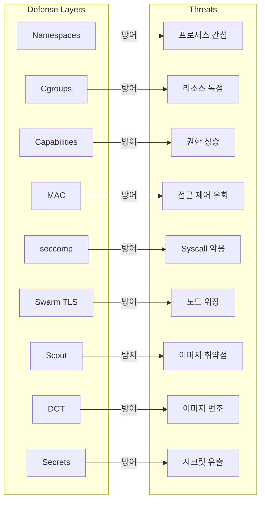

### 5.2 핵심 원칙

1. **다층 방어**: 한 레이어가 뚫려도 다른 레이어가 보호
2. **최소 권한**: 필요한 최소한의 권한만 부여
3. **기본 보안**: Docker의 합리적인 기본값 활용
4. **자동화**: Swarm의 자동 보안 설정 활용
5. **투명성**: Scout/SBOM으로 이미지 구성 요소 공개
6. **검증**: DCT로 이미지 무결성 및 출처 검증
7. **격리**: Secrets로 민감 데이터를 환경변수와 분리

### 5.3 다음 단계

- **Ch11**: Docker Swarm vs Kubernetes에서 오케스트레이션 플랫폼 선택 기준 학습
- **추가 학습**: Kubernetes의 Pod Security Standards, Network Policies, RBAC 등

Docker 보안은 완벽한 방어를 제공하지 않는다. 하지만 적절히 구성하면 대부분의 공격을 방어하고, 침해 시 피해를 최소화할 수 있다. 보안은 일회성 설정이 아닌 지속적인 프로세스다.

---

## 💡 실무 적용 포인트

### 면접 대비 Q&A

**Q1: Docker 컨테이너가 VM보다 보안이 약하다고 하는 이유는?**

A: 컨테이너는 Namespace로 격리되지만 호스트 커널을 공유한다. 반면 VM은 하이퍼바이저가 하드웨어 레벨에서 격리하여 더 강한 격리를 제공한다. 하지만 Docker는 Cgroups(리소스 제한), Capabilities(권한 최소화), MAC(접근 제어), seccomp(syscall 필터링) 등 추가 보안 레이어로 이 차이를 보완한다. 프로덕션 환경에서는 이러한 기술을 적절히 구성하여 충분한 보안 수준을 달성할 수 있다.

**Q2: Docker Swarm이 기본 제공하는 보안 기능은?**

A: `docker swarm init` 한 번으로 다음이 자동 구성된다. (1) 암호화된 노드 ID로 노드 식별, (2) 상호 TLS 인증으로 노드 간 신뢰 관계 구축, (3) Manager/Worker 분리된 보안 Join Token, (4) 자체 CA 및 90일 인증서 자동 로테이션, (5) 암호화된 클러스터 스토어(etcd), (6) 암호화된 오버레이 네트워크. 수동 설정 없이 대부분의 보안 기능이 활성화되어 운영 부담이 낮다.

**Q3: Capabilities가 보안에 어떻게 기여하는가?**

A: Linux root 권한을 세분화된 capabilities로 분리한다. Docker는 컨테이너를 root로 시작하되 불필요한 capabilities를 제거하고 필요한 것만 추가하는 최소 권한 원칙을 구현한다. 예를 들어, 웹 서버가 80번 포트 바인딩만 필요하면 `CAP_NET_BIND_SERVICE`만 부여하고, `CAP_SYS_BOOT`(재부팅 권한)는 제거한다. 컨테이너가 침해되어도 공격자가 할 수 있는 행동이 제한되어 피해를 최소화한다.

**Q4: Docker Content Trust(DCT)와 Docker Scout의 차이점은?**

A: Docker Scout는 이미지 내 소프트웨어 패키지의 알려진 취약점을 SBOM 생성 후 CVE 데이터베이스와 비교하여 스캔한다. "이미지에 취약점이 있는가?"에 답한다. 반면 DCT는 이미지의 무결성과 게시자를 암호화 서명으로 검증한다. "이미지가 변조되지 않았고 신뢰할 수 있는 출처인가?"에 답한다. Scout는 공급망의 취약점 관리, DCT는 공급망 공격 방지에 초점을 맞춘다.

**Q5: Docker Secrets가 환경변수보다 안전한 이유는?**

A: (1) 클러스터 스토어에 암호화되어 저장(at rest), (2) TLS로 전송 중 암호화(in flight), (3) 인메모리 파일시스템(/run/secrets)에 마운트되어 디스크에 저장되지 않음, (4) 컨테이너 종료 시 즉시 삭제, (5) 최소 권한 모델로 명시적으로 허가된 서비스만 접근 가능. 반면 환경변수는 `docker inspect`로 노출되고, 로그에 기록되며, 프로세스 목록에서 보일 수 있다.

**Q6: seccomp의 역할과 효과는?**

A: seccomp은 컨테이너가 호스트 커널에 요청할 수 있는 시스템 콜을 필터링한다. Docker는 기본적으로 Linux의 300개 이상 syscall 중 약 40-50개를 차단한다. 차단되는 syscall은 주로 시스템 재부팅(reboot), 파일시스템 마운트(mount), 커널 키링 조작(keyctl) 등 컨테이너 격리를 우회하거나 호스트에 영향을 미칠 수 있는 것들이다. 이를 통해 커널 취약점 익스플로잇 공격 표면을 줄인다.

---

## ✅ 체크리스트

### Linux 보안 기술
- [ ] 6가지 Namespace (pid, net, mnt, ipc, user, uts) 역할 및 격리 대상 이해
- [ ] Namespace와 Hypervisor의 차이점 (가상화 대상, 격리 강도)
- [ ] Cgroups의 리소스 제한 목적 (DoS 방지)
- [ ] Cgroups가 제한하는 공유 자원 (CPU, RAM, Network I/O, Disk I/O)
- [ ] Capabilities와 최소 권한 원칙 이해
- [ ] 주요 Capabilities 예시 (CAP_NET_BIND_SERVICE, CAP_SYS_BOOT 등)
- [ ] MAC (AppArmor/SELinux) 기본 프로파일 동작 이해
- [ ] DAC와 MAC의 차이점 및 MAC의 필요성
- [ ] seccomp의 syscall 필터링 (~40-50개 차단) 이해
- [ ] Docker 기본 seccomp 프로파일의 보안과 호환성 균형

### Swarm 보안
- [ ] `docker swarm init`의 자동 보안 설정 6가지 항목
- [ ] Join Token 구조 이해 (SWMTKN-1-<hash>-<token>)
- [ ] Manager/Worker 토큰 분리 이유 및 최소 권한 원칙
- [ ] `docker swarm join-token --rotate`: 토큰 무효화 방법
- [ ] TLS 인증서 확인 명령어 및 정보 해석
- [ ] CA 설정 변경 (인증서 로테이션 주기)
- [ ] 90일 인증서 로테이션 이유 이해
- [ ] 클러스터 스토어 암호화 개념

### Docker Scout
- [ ] `docker scout quickview`: 빠른 취약점 개요 확인
- [ ] `docker scout cves`: 상세 CVE 정보 및 해결책 확인
- [ ] SBOM (Software Bill of Materials) 개념 및 중요성
- [ ] 취약점 등급 (Critical/High/Medium/Low) 및 CVSS 점수
- [ ] Fixed version 제안 활용 방법
- [ ] Scout의 한계 인식 (이미지만 스캔)

### Docker Content Trust
- [ ] DCT의 두 가지 보장 (무결성, 출처)
- [ ] `docker trust key generate`: 키 페어 생성
- [ ] `docker trust signer add`: 키를 레포지토리에 연결
- [ ] `docker trust sign`: 이미지 서명 및 푸시
- [ ] `docker trust inspect --pretty`: 서명 정보 확인
- [ ] `DOCKER_CONTENT_TRUST=1`: 강제 검증 활성화
- [ ] 서명 없는 이미지 Pull 차단 동작 확인
- [ ] CI/CD 파이프라인 통합 시나리오

### Docker Secrets
- [ ] Swarm 모드 필수 요구사항 이해
- [ ] 암호화 저장(at rest) + 전송 중 암호화(in flight)
- [ ] 인메모리 파일시스템 마운트 (/run/secrets)
- [ ] 컨테이너 종료 시 즉시 삭제 메커니즘
- [ ] 최소 권한 모델 (명시적 허가)
- [ ] `docker secret create`, `--secret` 플래그 사용
- [ ] 환경변수 대비 Secrets의 보안 이점

### 베스트 프랙티스
- [ ] Alpine/Distroless 이미지 사용 이유
- [ ] Multi-stage 빌드로 빌드 도구 제거
- [ ] rootless 컨테이너 실행 방법
- [ ] 읽기 전용 루트 파일시스템 설정
- [ ] 리소스 제한 설정 (DoS 방지)
- [ ] 네트워크 분리를 통한 최소 권한 네트워크 정책

---

## 🔗 참고 자료

- [Docker Security 공식 문서](https://docs.docker.com/engine/security/)
- [Docker Scout](https://docs.docker.com/scout/)
- [Docker Content Trust](https://docs.docker.com/engine/security/trust/)
- [Docker Secrets](https://docs.docker.com/engine/swarm/secrets/)
- [Linux Capabilities](https://man7.org/linux/man-pages/man7/capabilities.7.html)
- [seccomp 보안 프로파일](https://docs.docker.com/engine/security/seccomp/)
- [OWASP Container Security](https://cheatsheetseries.owasp.org/cheatsheets/Docker_Security_Cheat_Sheet.html)
- 도서: *Docker Deep Dive* - Nigel Poulton, Chapter 16
