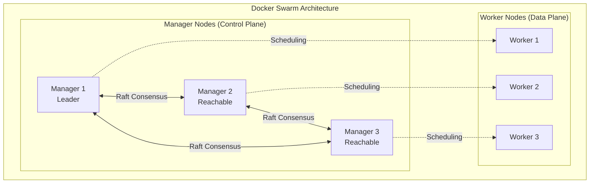
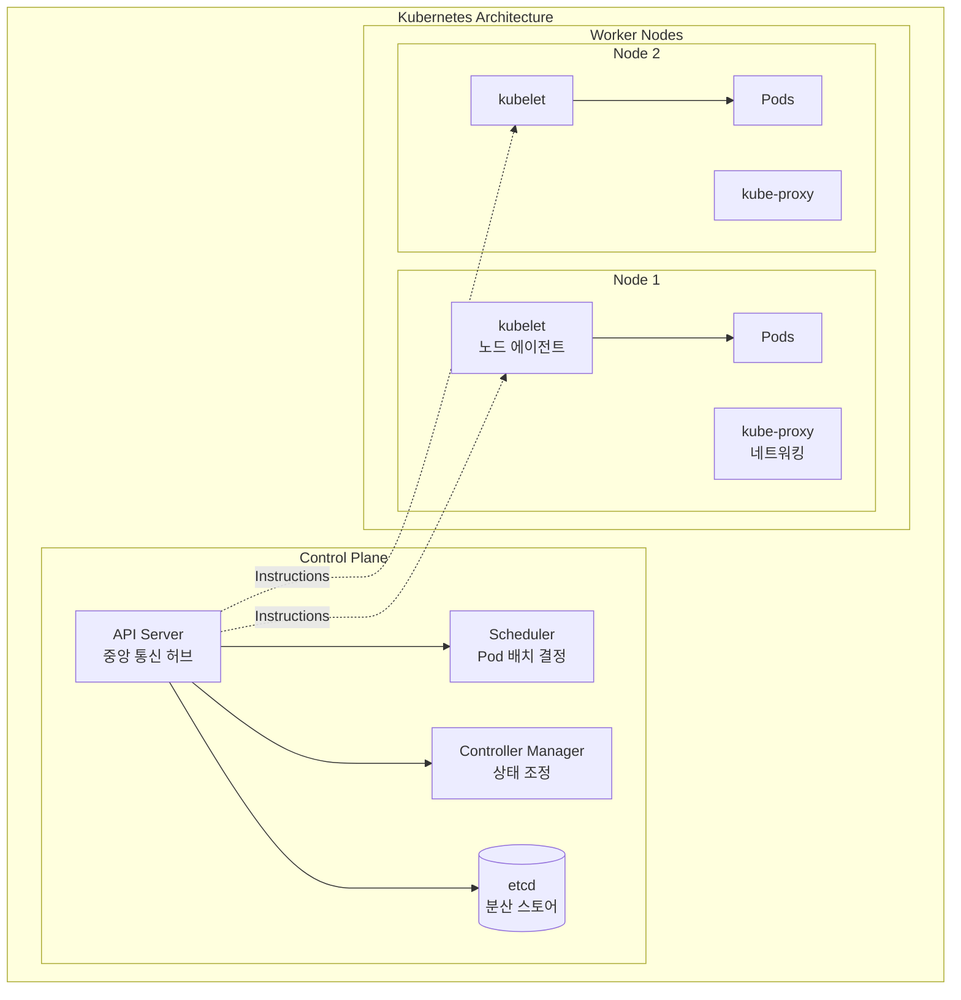
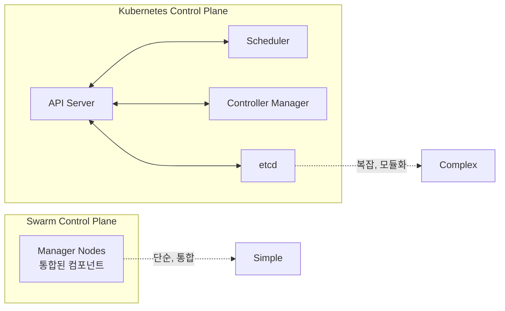
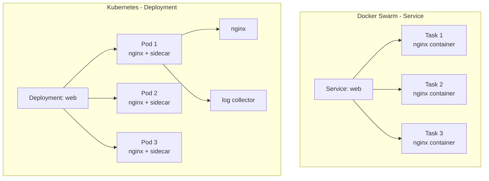
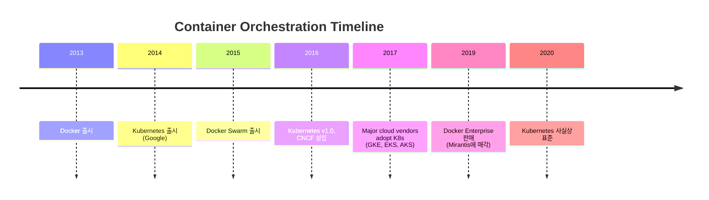
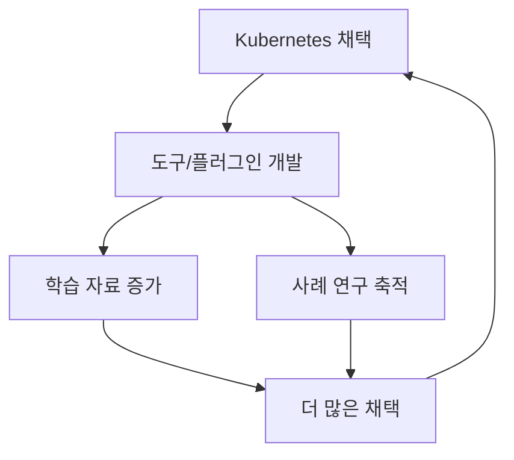
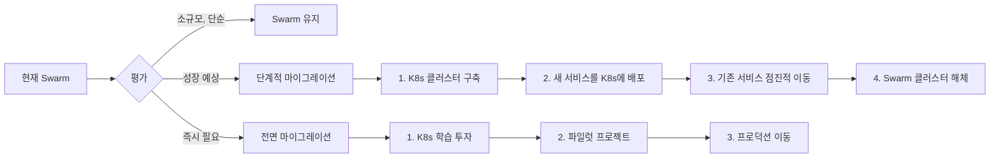
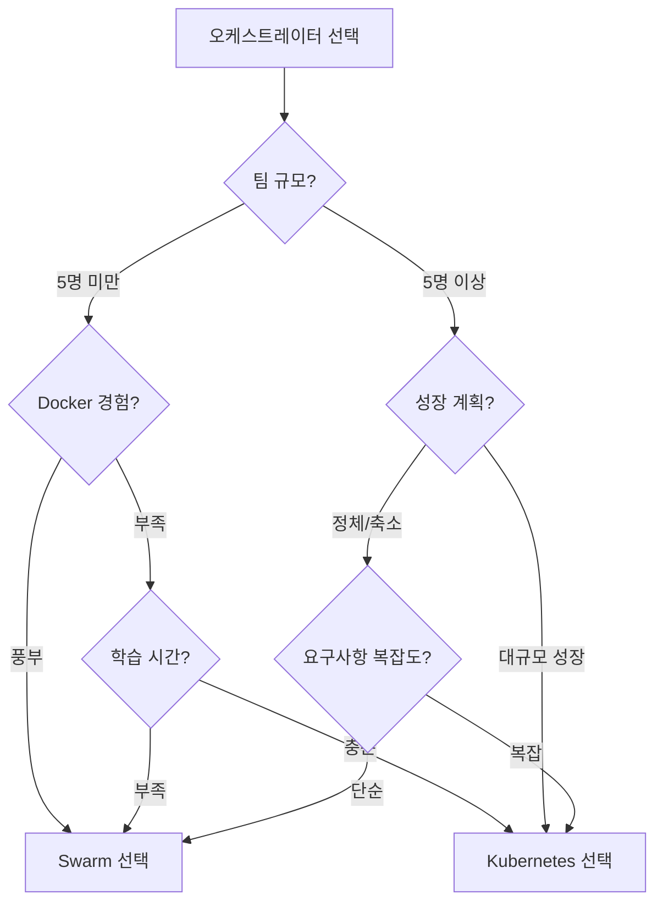

# Ch11. Docker Swarm vs Kubernetes

> 📌 **핵심 요약**
> Docker Swarm은 학습 곡선이 낮고 설정이 간단하지만, Kubernetes는 대규모 생태계, 확장성, 엔터프라이즈 기능을 제공한다. Kubernetes가 업계 표준이 된 이유는 단순히 기술적 우월성이 아니라, 강력한 커뮤니티, 벤더 지원, 확장 가능한 아키텍처 때문이다. Swarm은 소규모 환경과 간단한 요구사항에 여전히 유효한 선택지다.

## 🎯 학습 목표
1. Docker Swarm과 Kubernetes의 아키텍처 차이를 이해한다
2. 두 오케스트레이터의 장단점을 비교하고 선택 기준을 파악한다
3. Kubernetes가 업계 표준이 된 역사적, 기술적 배경을 이해한다
4. Swarm이 여전히 유효한 사용 사례를 파악한다
5. 오케스트레이터 선택 시 고려해야 할 요소를 정리한다
6. 다음 학습 단계(02-kubernetes 프로젝트)로의 연결 고리를 이해한다

---

## 1. Docker Swarm 개요

### 1.1 Swarm의 핵심 특징

Docker Swarm은 "Docker를 이미 알고 있다면 쉽게 배울 수 있다"는 철학을 따른다. Docker CLI와 Compose 파일에 익숙하다면 추가 학습 없이 클러스터를 구성하고 앱을 배포할 수 있다.



**Swarm의 장점**:
- **낮은 진입 장벽**: Docker 명령어와 거의 동일
- **간단한 설정**: `docker swarm init` 한 줄로 클러스터 구성
- **Compose 파일 재사용**: 기존 Compose 파일을 약간만 수정하여 사용
- **자동 보안**: TLS, CA, Join Token 등 자동 구성 (Ch10 참조)
- **빠른 학습**: 하루 안에 기본 개념 습득 가능

**Swarm의 한계**:
- **생태계 규모**: Kubernetes 대비 작은 커뮤니티
- **확장성**: 대규모 클러스터(수천 노드)에서 성능 저하
- **엔터프라이즈 기능**: 세밀한 RBAC, 고급 네트워킹 정책 부족
- **벤더 지원**: 주요 클라우드 제공자의 관리형 서비스 없음
- **발전 속도**: Kubernetes 대비 느린 기능 추가

### 1.2 Swarm 기본 워크플로우

```bash
# 1. 클러스터 초기화 (1분 소요)
docker swarm init

# 2. 노드 추가 (각 노드에서 1분 소요)
docker swarm join --token SWMTKN-1-... 192.168.1.1:2377

# 3. 앱 배포 (Compose 파일 사용)
docker stack deploy -c compose.yaml myapp

# 4. 상태 확인
docker stack ps myapp
docker stack services myapp

# 5. 스케일링 (Compose 파일 수정 후 재배포)
# compose.yaml: replicas: 4 → 10
docker stack deploy -c compose.yaml myapp
```

**왜 이것이 간단한가?**
- 새로운 CLI 명령어를 배울 필요가 없다
- YAML 문법이 Compose와 거의 동일하다
- 설치할 추가 도구가 없다 (Docker만 있으면 됨)

---

## 2. Kubernetes 개요

### 2.1 Kubernetes의 핵심 특징

Kubernetes(k8s)는 "대규모 컨테이너 오케스트레이션을 위한 프로덕션급 플랫폼"을 목표로 한다. Google의 내부 시스템 Borg에서 영감을 받아 설계되었으며, 확장성과 유연성을 최우선으로 한다.



**Kubernetes의 장점**:
- **대규모 생태계**: CNCF 산하 수천 개 프로젝트
- **엔터프라이즈 기능**: RBAC, Network Policies, PodSecurityPolicies
- **확장성**: 수천 노드, 수만 Pod 관리 가능
- **벤더 지원**: GKE, EKS, AKS 등 관리형 서비스
- **활발한 커뮤니티**: 빠른 버그 수정, 기능 추가
- **표준화**: 사실상의 업계 표준

**Kubernetes의 단점**:
- **높은 학습 곡선**: Pod, Service, Ingress, ConfigMap, StatefulSet 등 수십 개 개념
- **복잡한 설정**: 최소 구성에도 수백 줄의 YAML
- **운영 부담**: 업그레이드, 보안 패치, 모니터링 복잡
- **리소스 소비**: Control Plane 자체가 상당한 리소스 요구

### 2.2 Kubernetes 기본 워크플로우

```bash
# 1. 클러스터 설정 (수십 분 소요, 여러 도구 필요)
# kubeadm, kubectl, kubelet 설치
# Master 노드 초기화
# CNI 플러그인 설치 (네트워킹)
# Worker 노드 조인

# 2. 앱 배포 (YAML 매니페스트 작성)
kubectl apply -f deployment.yaml
kubectl apply -f service.yaml

# 3. 상태 확인
kubectl get pods
kubectl get services
kubectl describe pod myapp-xyz

# 4. 스케일링
kubectl scale deployment myapp --replicas=10
```

**왜 이것이 복잡한가?**
- Deployment, Service, ConfigMap 등 여러 리소스를 별도로 정의
- 네트워킹(CNI), 스토리지(CSI) 플러그인 선택 및 설정 필요
- kubectl, kubeadm 등 추가 도구 학습 필요

---

## 3. 아키텍처 비교

### 3.1 컨트롤 플레인 구조

| 구분 | Docker Swarm | Kubernetes |
|------|--------------|------------|
| **합의 알고리즘** | Raft | Raft (etcd) |
| **리더 선출** | 자동, 투명 | etcd 레벨에서 처리 |
| **API 서버** | Docker API (기존 API 확장) | kube-apiserver (전용 API) |
| **스케줄러** | 내장 (커스터마이징 제한적) | kube-scheduler (확장 가능) |
| **컨트롤러** | 내장 | Controller Manager (다수 컨트롤러) |



**왜 Kubernetes가 더 모듈화되어 있는가?**
- 각 컴포넌트를 독립적으로 확장 가능
- 커스텀 스케줄러, 컨트롤러 추가 가능
- 장애 격리: 한 컴포넌트 장애가 전체 시스템에 영향 최소화

**왜 Swarm이 더 간단한가?**
- 모든 기능이 Docker 엔진에 통합
- 별도 설치/구성할 컴포넌트 없음
- 학습 및 운영 부담 낮음

### 3.2 배포 단위

| 구분 | Docker Swarm | Kubernetes |
|------|--------------|------------|
| **최소 배포 단위** | Task (단일 컨테이너) | Pod (1개 이상 컨테이너) |
| **고수준 추상화** | Service | Deployment, StatefulSet, DaemonSet |
| **네트워킹** | Overlay 네트워크 | CNI 플러그인 (Calico, Flannel 등) |
| **로드밸런싱** | 내장 (routing mesh) | Service (ClusterIP, NodePort, LoadBalancer) |

**Pod vs Task**:



**왜 Pod가 여러 컨테이너를 포함하는가?**
- 밀접하게 결합된 컨테이너를 함께 배치 (사이드카 패턴)
- 예: 메인 앱 + 로그 수집기 + 메트릭 익스포터
- 공유 네트워크, 스토리지 제공

**Swarm은 왜 단일 컨테이너만 지원하는가?**
- 간단한 사용 사례에 초점
- 복잡한 패턴은 여러 Service로 해결

### 3.3 설정 관리

| 구분 | Docker Swarm | Kubernetes |
|------|--------------|------------|
| **민감 데이터** | Secrets | Secrets |
| **일반 설정** | Configs | ConfigMaps |
| **선언적 파일** | Compose YAML | Manifests (Deployment, Service 등) |
| **파일 형식** | 친숙한 Compose 문법 | Kubernetes-specific YAML |

**Compose vs Manifest 예시**:

```yaml
# Docker Swarm - Compose
services:
  web:
    image: nginx
    deploy:
      replicas: 3
    ports:
      - "80:80"
    secrets:
      - db_password

secrets:
  db_password:
    external: true
```

```yaml
# Kubernetes - Deployment
apiVersion: apps/v1
kind: Deployment
metadata:
  name: web
spec:
  replicas: 3
  selector:
    matchLabels:
      app: web
  template:
    metadata:
      labels:
        app: web
    spec:
      containers:
      - name: nginx
        image: nginx
        volumeMounts:
        - name: secret-volume
          mountPath: /run/secrets
      volumes:
      - name: secret-volume
        secret:
          secretName: db-password
---
apiVersion: v1
kind: Service
metadata:
  name: web
spec:
  type: LoadBalancer
  ports:
  - port: 80
  selector:
    app: web
```

**왜 Kubernetes YAML이 더 장황한가?**
- 세밀한 제어 가능 (selector, labels, resource limits 등)
- 여러 리소스를 독립적으로 관리
- 확장 가능한 구조 (Custom Resource Definitions)

**왜 Compose가 더 간결한가?**
- 일반적인 사용 사례에 최적화
- Docker CLI와 일관된 개념
- 학습 곡선 최소화

---

## 4. 왜 Kubernetes가 표준이 되었는가?

### 4.1 역사적 배경



**전환점 이벤트**:

1. **CNCF 설립 (2016)**: Kubernetes를 중립적 재단에 기부하여 벤더 락인 우려 해소
2. **클라우드 벤더 지원**: Google, AWS, Azure가 관리형 K8s 서비스 출시
3. **생태계 성장**: Helm, Prometheus, Istio 등 K8s 중심 도구 생태계 형성
4. **엔터프라이즈 채택**: Netflix, Spotify, Airbnb 등 대기업 사례 공개

### 4.2 기술적 우위

**확장성과 유연성**:

| 기능 | Swarm | Kubernetes |
|------|-------|------------|
| **최대 노드 수** | ~수백 (공식 제한 없음) | 5,000+ (검증됨) |
| **커스텀 리소스** | 불가능 | CRD로 확장 가능 |
| **멀티테넌시** | 제한적 | Namespace + RBAC + Network Policies |
| **스토리지 오케스트레이션** | 볼륨 플러그인 | CSI (Container Storage Interface) |
| **네트워크 정책** | 제한적 | NetworkPolicy로 세밀한 제어 |

**왜 이것이 중요한가?**

대규모 조직에서는 다음이 필수적이다.
- **멀티테넌시**: 여러 팀이 동일 클러스터를 안전하게 공유
- **확장성**: 수천 개 마이크로서비스 관리
- **커스터마이징**: 조직 특화 요구사항 구현

Kubernetes는 이를 모두 제공하지만, Swarm은 일부만 지원한다.

### 4.3 생태계 효과

**네트워크 효과**:


**생태계 규모 비교**:

| 영역 | Swarm | Kubernetes |
|------|-------|------------|
| **CNCF 프로젝트** | 없음 | 100+ (Prometheus, Envoy, Helm 등) |
| **관리형 서비스** | 없음 | GKE, EKS, AKS, 기타 다수 |
| **서적** | 소수 | 수백 권 |
| **교육 과정** | 제한적 | CKA, CKAD, CKS 인증 |
| **컨퍼런스** | 없음 | KubeCon (연 수천 명 참석) |

**왜 이것이 선택을 좌우하는가?**
- 문제 발생 시 해결책을 쉽게 찾을 수 있다
- 숙련된 인력 채용이 용이하다
- 도구/플러그인 선택지가 풍부하다
- 커리어 관점에서 K8s 경험이 더 가치있다

---

## 5. Swarm이 여전히 유효한 경우

### 5.1 Swarm 선택 시나리오

**적합한 경우**:

1. **소규모 팀/프로젝트**
   - 5-20개 노드 규모
   - 단순한 마이크로서비스 아키텍처
   - 빠른 프로토타이핑 필요

2. **Docker 전문성 보유**
   - 팀이 Docker에 이미 익숙
   - Kubernetes 학습에 투자할 시간/예산 부족
   - 기존 Compose 파일 재사용 가능

3. **간단한 요구사항**
   - 고급 RBAC, Network Policies 불필요
   - 단일 클러스터로 충분
   - 온프레미스 환경

4. **빠른 구축 필요**
   - POC (Proof of Concept) 단계
   - 마이그레이션 전 임시 솔루션
   - 학습/교육 목적

**실제 사례**:

```bash
# 시나리오: 5노드 개발 환경, 10개 마이크로서비스
# Swarm 구축 시간: 30분
# Kubernetes 구축 시간: 4시간+

# Swarm 접근
docker swarm init
# 4개 노드 조인
docker stack deploy -c compose.yaml dev-env
# 완료!

# 장점: 팀이 이미 아는 도구, 빠른 구축
# 단점: 프로덕션 이동 시 K8s로 마이그레이션 필요
```

### 5.2 Kubernetes 선택 시나리오

**필수인 경우**:

1. **엔터프라이즈 환경**
   - 수백 개 이상 마이크로서비스
   - 멀티테넌시 필수
   - 엄격한 보안/규제 요구사항

2. **클라우드 네이티브**
   - AWS, GCP, Azure 활용
   - 관리형 K8s 서비스(EKS, GKE, AKS) 사용
   - Auto-scaling, 고급 네트워킹 필요

3. **장기 투자**
   - 5년 이상 운영 계획
   - 지속적인 성장 예상
   - 업계 표준 준수 필요

4. **고급 기능 필요**
   - StatefulSet (상태 저장 앱)
   - Custom Resource Definitions
   - Service Mesh (Istio, Linkerd)
   - GitOps (ArgoCD, Flux)

**실제 사례**:

```bash
# 시나리오: 100+ 마이크로서비스, 멀티팀
# 요구사항: Namespace별 격리, RBAC, Network Policies

# Kubernetes가 필수인 이유:
# 1. Swarm은 Namespace 개념 없음
# 2. 세밀한 RBAC 불가능
# 3. Network Policies 미지원
# 4. 대규모 관리 도구(Helm, Kustomize) 없음
```

---

## 6. 마이그레이션 고려사항

### 6.1 Swarm → Kubernetes 마이그레이션

**주요 변경 사항**:

| Swarm 개념 | Kubernetes 개념 |
|------------|-----------------|
| Service | Deployment + Service |
| Task | Pod |
| Stack | Namespace |
| Secret | Secret |
| Config | ConfigMap |
| Network | NetworkPolicy + CNI |
| Volume | PersistentVolume + PersistentVolumeClaim |

**마이그레이션 도구**:
- **Kompose**: Compose 파일을 K8s Manifest로 자동 변환
- **한계**: 고급 기능은 수동 수정 필요

```bash
# Kompose 사용 예시
kompose convert -f compose.yaml

# 생성된 파일:
# - web-deployment.yaml
# - web-service.yaml
# - redis-deployment.yaml
# - redis-service.yaml
```

**왜 완벽한 자동 변환이 불가능한가?**
- Swarm과 K8s의 아키텍처 차이
- K8s의 고급 기능(Resource Limits, Health Checks 등)은 Compose에 없음
- 네트워킹, 스토리지 모델 차이

### 6.2 마이그레이션 전략



**권장 접근**:
1. **평가**: 현재/미래 요구사항 분석
2. **학습**: 팀에 K8s 교육 제공
3. **파일럿**: 비중요 서비스로 K8s 테스트
4. **이중 운영**: Swarm과 K8s 병행
5. **마이그레이션**: 검증 후 점진적 이동

---

## 7. 선택 가이드

### 7.1 의사결정 트리



### 7.2 체크리스트

**Swarm 선택 시 확인사항**:
- [ ] 노드 수 50개 미만 예상
- [ ] 멀티테넌시 불필요
- [ ] 팀이 Docker에 익숙
- [ ] 빠른 구축 필요
- [ ] 온프레미스 환경
- [ ] 관리형 서비스 불필요

**Kubernetes 선택 시 확인사항**:
- [ ] 엔터프라이즈 요구사항
- [ ] 대규모 확장 예상
- [ ] 클라우드 환경 활용
- [ ] 고급 RBAC, Network Policies 필요
- [ ] 업계 표준 준수 필요
- [ ] 장기 투자 계획

### 7.3 하이브리드 접근

**양쪽 모두 학습하는 전략**:

1. **1단계**: Swarm으로 오케스트레이션 기본 개념 학습
   - 서비스, 레플리카, 스케일링
   - 선언적 배포
   - 고가용성

2. **2단계**: Swarm으로 간단한 프로젝트 배포
   - 실전 경험 축적
   - 문제 해결 능력 향상

3. **3단계**: Kubernetes 학습 시작
   - Swarm에서 배운 개념이 기반이 됨
   - Pod, Service, Deployment 등 유사 개념 이해 용이

4. **4단계**: Kubernetes로 전환
   - 프로덕션 이동 또는 병행 운영

**왜 이 접근이 효과적인가?**
- Swarm의 낮은 진입 장벽 활용
- 오케스트레이션 기본 개념을 먼저 습득
- K8s 학습 시 개념적 기반 제공
- 실무 경험 기반 학습

---

## 8. 정리

### 8.1 핵심 비교 요약

| 기준 | Docker Swarm | Kubernetes |
|------|--------------|------------|
| **학습 곡선** | 낮음 (1주일) | 높음 (1-3개월) |
| **설정 복잡도** | 간단 (분 단위) | 복잡 (시간 단위) |
| **확장성** | 중소 규모 | 대규모 |
| **생태계** | 작음 | 매우 큼 |
| **벤더 지원** | 없음 | 다수 (GKE, EKS, AKS) |
| **적합 대상** | 소규모, 간단한 요구사항 | 엔터프라이즈, 복잡한 요구사항 |
| **시장 점유율** | 감소 | 업계 표준 |
| **커리어 가치** | 제한적 | 높음 |
| **장기 전망** | 유지 모드 | 지속 성장 |

### 8.2 왜 Kubernetes를 학습해야 하는가?

**기술적 이유**:
- 대규모 시스템 운영 능력 습득
- 클라우드 네이티브 아키텍처 이해
- 마이크로서비스 패턴 실전 적용
- 선언적 인프라 관리 경험

**커리어 이유**:
- 대부분의 기업이 K8s 사용 또는 마이그레이션 중
- CKA, CKAD 인증 취득 가능
- 높은 연봉 및 수요
- 클라우드 엔지니어 필수 스킬

**학습 전략**:
1. Swarm으로 기본 개념 익히기 (1-2주)
2. K8s 공식 튜토리얼 진행 (2-4주)
3. Minikube/Kind로 로컬 환경 구축 (1주)
4. 실제 프로젝트 배포 경험 (지속)
5. CKA 인증 준비 (선택)

### 8.3 다음 단계

**02-kubernetes 프로젝트에서 학습할 내용**:
- Kubernetes 아키텍처 심화
- Pod, Deployment, Service, Ingress
- ConfigMap, Secret, PersistentVolume
- Namespace, RBAC, Network Policies
- Helm을 통한 패키지 관리
- 모니터링 (Prometheus, Grafana)
- 로깅 (EFK Stack)
- GitOps (ArgoCD)

**학습 로드맵**:


Docker Swarm은 "컨테이너 오케스트레이션이 무엇인지" 이해하는 데 훌륭한 시작점이다. Kubernetes는 "프로덕션급 대규모 시스템을 어떻게 운영하는지" 배우는 다음 단계다. 두 기술 모두 선언적 배포, 서비스 디스커버리, 로드 밸런싱 등 공통 개념을 공유하므로, Swarm 경험은 K8s 학습에 도움이 된다.

---

## 💡 실무 적용 포인트

### 면접 대비 Q&A

**Q1: Docker Swarm과 Kubernetes의 주요 차이점은?**

A: Swarm은 Docker에 내장되어 학습 곡선이 낮고 설정이 간단하다. Compose 파일을 재사용하여 빠르게 클러스터를 구성할 수 있다. 반면 Kubernetes는 대규모 생태계, 확장성, 엔터프라이즈 기능(세밀한 RBAC, Network Policies, CRD)을 제공한다. Swarm은 소규모 환경과 간단한 요구사항에 적합하고, Kubernetes는 대규모 엔터프라이즈 환경에 적합하다. 시장에서는 Kubernetes가 사실상 표준이 되었다.

**Q2: 왜 Kubernetes가 업계 표준이 되었는가?**

A: 여러 요인이 복합적으로 작용했다. (1) CNCF에 기부하여 벤더 중립성을 확보했고, (2) Google, AWS, Azure가 관리형 서비스를 출시하여 접근성을 높였으며, (3) Helm, Prometheus, Istio 등 풍부한 생태계가 형성되었다. (4) 기술적으로도 수천 노드 확장성, CRD를 통한 확장 가능성, 세밀한 멀티테넌시 지원 등 엔터프라이즈 요구사항을 충족했다. (5) 네트워크 효과로 더 많은 채택이 더 많은 도구와 사례를 낳는 선순환 구조가 만들어졌다.

**Q3: Swarm이 여전히 유효한 사용 사례는?**

A: (1) 소규모 팀/프로젝트 (5-20개 노드)로 빠른 프로토타이핑이 필요한 경우, (2) 팀이 Docker에 이미 익숙하고 Kubernetes 학습에 투자할 시간/예산이 부족한 경우, (3) 고급 RBAC이나 Network Policies가 불필요한 간단한 요구사항인 경우, (4) POC 또는 교육 목적으로 오케스트레이션 개념을 빠르게 이해하려는 경우. Swarm의 장점은 30분 안에 클러스터를 구성하고 앱을 배포할 수 있다는 점이다.

**Q4: Swarm에서 Kubernetes로 마이그레이션 시 주요 도전 과제는?**

A: (1) 아키텍처 차이: Swarm의 Service는 K8s의 Deployment + Service로 분리되고, Task는 Pod로 매핑된다. (2) 네트워킹 모델: Swarm의 Overlay 네트워크와 K8s의 CNI 플러그인 차이를 이해해야 한다. (3) 설정 복잡도: Compose 파일보다 K8s Manifest가 훨씬 장황하다. (4) 도구 학습: kubectl, Helm 등 새로운 도구 습득이 필요하다. Kompose로 자동 변환이 가능하지만 고급 기능은 수동 수정이 필요하다. 권장 전략은 단계적 마이그레이션으로 새 서비스는 K8s에 배포하고 기존 서비스는 점진적으로 이동하는 것이다.

**Q5: Swarm과 Kubernetes 중 어떤 것을 먼저 학습해야 하는가?**

A: 하이브리드 접근을 권장한다. (1) Swarm으로 오케스트레이션 기본 개념(서비스, 레플리카, 선언적 배포)을 1-2주간 학습하고, (2) 간단한 프로젝트로 실전 경험을 쌓은 후, (3) Kubernetes 학습을 시작한다. Swarm에서 배운 개념이 K8s의 Pod, Service, Deployment 이해에 도움이 된다. 궁극적으로는 Kubernetes가 커리어 관점에서 더 가치있고 대부분 기업이 요구하는 스킬이므로, Swarm은 학습 도구로 활용하고 K8s로 전환하는 것이 효과적이다.

---

## ✅ 체크리스트

### Docker Swarm 이해
- [ ] Swarm의 Manager/Worker 노드 역할 이해
- [ ] Raft 합의 알고리즘과 Leader 선출 개념
- [ ] `docker swarm init`의 자동 보안 설정 이해
- [ ] Compose 파일을 Swarm에서 사용하는 방법 (deploy 섹션)
- [ ] `docker stack deploy`, `docker stack ps` 명령어 사용
- [ ] Swarm의 장점 (낮은 학습 곡선, 간단한 설정) 이해
- [ ] Swarm의 한계 (생태계 규모, 확장성) 인식

### Kubernetes 이해
- [ ] K8s Control Plane 구성 요소 (API Server, Scheduler, etcd)
- [ ] Pod vs Task 개념 차이 이해
- [ ] Deployment, Service, ConfigMap, Secret 기본 개념
- [ ] K8s의 장점 (생태계, 확장성, 엔터프라이즈 기능) 이해
- [ ] K8s의 단점 (높은 학습 곡선, 복잡한 설정) 인식
- [ ] 관리형 K8s 서비스 (GKE, EKS, AKS) 개념

### 비교 및 선택
- [ ] Swarm vs K8s 아키텍처 차이 이해
- [ ] 배포 단위 비교 (Task vs Pod)
- [ ] 설정 파일 비교 (Compose vs Manifest)
- [ ] 네트워킹 모델 차이 (Overlay vs CNI)
- [ ] Swarm 선택 시나리오 (소규모, 간단한 요구사항)
- [ ] K8s 선택 시나리오 (엔터프라이즈, 대규모)
- [ ] 의사결정 트리 활용 능력

### 마이그레이션
- [ ] Swarm → K8s 개념 매핑 (Service → Deployment + Service)
- [ ] Kompose 도구 이해 및 한계 인식
- [ ] 단계적 마이그레이션 전략 이해
- [ ] 이중 운영 시 고려사항

### 학습 로드맵
- [ ] Swarm을 통한 오케스트레이션 기본 개념 습득
- [ ] K8s 학습 필요성 인식 (커리어, 기술적 이유)
- [ ] 02-kubernetes 프로젝트 학습 계획 수립
- [ ] 하이브리드 학습 전략 이해

---

## 🔗 참고 자료

- [Docker Swarm 공식 문서](https://docs.docker.com/engine/swarm/)
- [Kubernetes 공식 문서](https://kubernetes.io/docs/)
- [Kompose (Compose → K8s 변환)](https://kompose.io/)
- [CNCF Landscape](https://landscape.cncf.io/)
- [Kubernetes vs Docker Swarm 비교](https://www.docker.com/blog/kubernetes-vs-docker-swarm/)
- 도서: *Docker Deep Dive* - Nigel Poulton, Chapter 12
- 도서: *The Kubernetes Book* - Nigel Poulton
- 도서: *Kubernetes in Action* - Marko Lukša

**다음 단계**: 02-kubernetes 프로젝트에서 Kubernetes를 본격적으로 학습한다.
