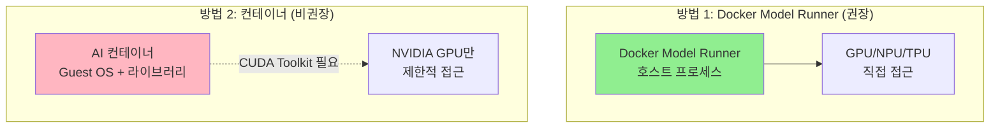
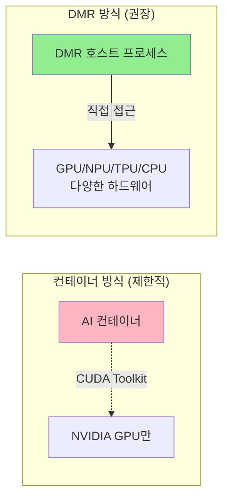
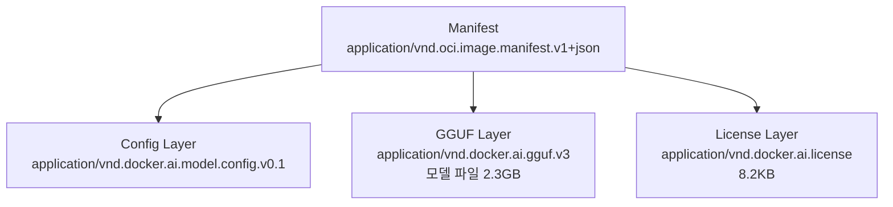
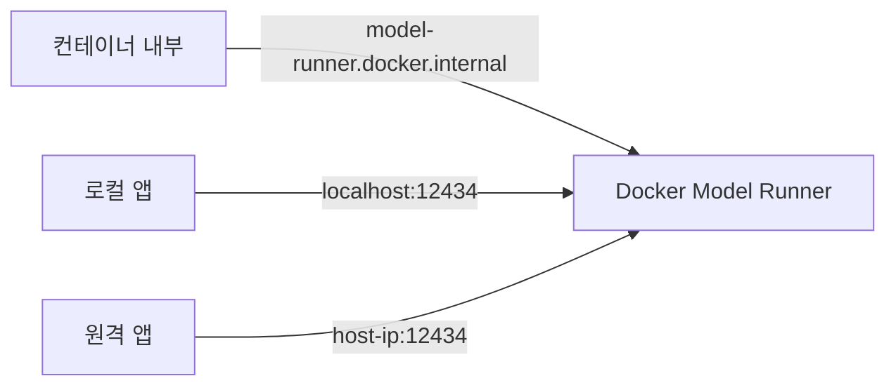
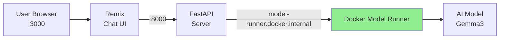
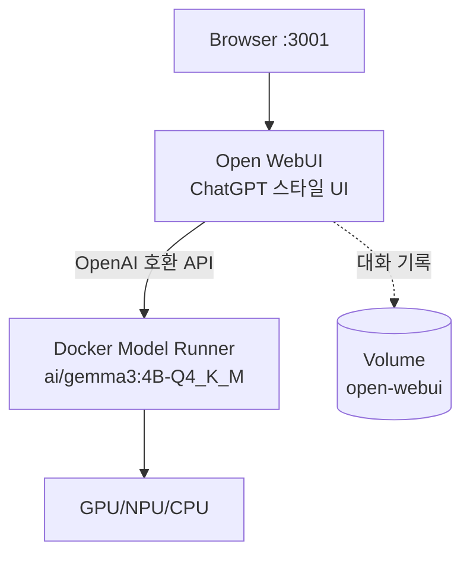
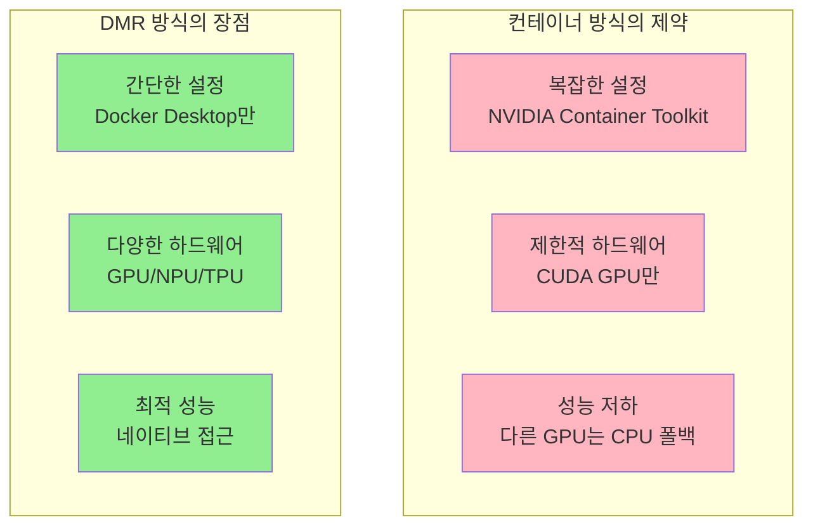

# Ch12. Docker & AI

> 📌 **핵심 요약**
> Docker Model Runner(DMR)는 AI 모델을 호스트 하드웨어에서 직접 실행하면서도 Docker 생태계와 완벽히 통합하는 기술이다. GPU, NPU, TPU 등 AI 가속 하드웨어에 쉽게 접근하고, OpenAI 호환 API를 제공하며, Docker Hub에서 모델을 관리할 수 있다. 컨테이너 내부 실행의 하드웨어 접근 제약을 우회하면서도 익숙한 Docker 도구를 그대로 사용한다.

## 🎯 학습 목표
1. Docker에서 AI 모델을 실행하는 두 가지 방법 비교
2. DMR이 컨테이너 외부에서 실행되는 이유와 아키텍처 이해
3. `docker model` 명령어로 모델 관리 실습
4. OpenAI 호환 API 엔드포인트 활용
5. Docker Compose와 DMR 통합
6. 로컬 AI 실행의 실무적 장점 파악

---

## 1. Docker에서 AI 모델 실행 방법

### 1.1 왜 로컬 AI인가?

클라우드 AI API(OpenAI, Anthropic 등)는 편리하지만, 다음 상황에서는 로컬 실행이 필수적이다.

| 요구사항 | 클라우드 AI | 로컬 AI |
|----------|-------------|---------|
| **프라이버시** | 데이터 외부 전송 | 데이터 호스트 내 유지 |
| **비용** | 사용량 기반 과금 (예측 불가) | 하드웨어 비용 (고정) |
| **지연시간** | 네트워크 왕복 | 로컬 처리 |
| **커스터마이징** | 제한적 | 파인튜닝/프롬프트 제어 |

로컬 AI 실행이 필요한 구체적 사례는 다음과 같다.
- 의료/금융 데이터 처리 (규제 준수)
- 실시간 추론이 필요한 IoT/엣지 디바이스
- 프롬프트 최적화 및 모델 파인튜닝 실험
- 클라우드 비용 예측이 어려운 대규모 서비스

### 1.2 두 가지 실행 방법 비교



**DMR 선택 권장 이유**:
- 다양한 하드웨어 지원 (Apple Silicon, NVIDIA, NPU 등)
- Docker 도구 및 클라우드 네이티브 생태계 통합
- 동적 모델 로드/언로드 (메모리 효율적)

**컨테이너 방식의 한계**:
- NVIDIA Container Toolkit 설치 필요 (복잡도 증가)
- CUDA 지원 NVIDIA GPU만 가속 가능
- 다른 하드웨어는 CPU 폴백 (성능 저하)

---

## 2. Docker Model Runner 아키텍처

### 2.1 전체 구조

```mermaid
graph TB
    subgraph Apps["애플리케이션 레이어"]
        C1[컨테이너<br/>model-runner.docker.internal]
        C2[로컬 앱<br/>localhost:12434]
        C3[원격 앱<br/>&lt;host-ip&gt;:12434]
    end

    subgraph API["OpenAI 호환 API"]
        E1[/engines/v1/chat/completions]
        E2[/engines/v1/completions]
        E3[/engines/v1/embeddings]
        E4[/engines/v1/models]
    end

    subgraph DMR["Docker Model Runner (호스트 프로세스)"]
        Runtime[플러그형 런타임]
        Llama[llama.cpp<br/>기본]
        MLX[MLX<br/>예정]
        Runtime --> Llama
        Runtime --> MLX
    end

    subgraph HW["호스트 하드웨어"]
        GPU[GPU<br/>NVIDIA, Apple M]
        NPU[NPU<br/>Neural Engine]
        CPU[CPU]
    end

    C1 & C2 & C3 --> E1 & E2 & E3 & E4
    E1 & E2 & E3 & E4 --> Runtime
    Runtime --> GPU & NPU & CPU
```

### 2.2 핵심 구성 요소

| 구성 요소 | 설명 | 역할 |
|-----------|------|------|
| **DMR 프로세스** | Docker Engine과 별개의 호스트 프로세스 | AI 모델 실행 엔진 |
| **플러그형 런타임** | 추론 엔진 (기본: llama.cpp, 향후 MLX 등) | 실제 모델 추론 수행 |
| **로컬 모델 저장소** | `~/.docker/models/blobs/sha256/` | OCI Artifact 형태로 저장 |
| **OpenAI 호환 API** | 표준 엔드포인트 제공 | 기존 OpenAI 클라이언트 재사용 가능 |
| **Docker CLI 플러그인** | `docker model` 명령어 | Docker 도구 체인 통합 |

### 2.3 컨테이너 외부 실행의 이유

AI 가속 하드웨어는 독점적 드라이버와 SDK를 사용하기 때문에, 컨테이너 내부에서 모든 하드웨어를 지원하는 것은 현실적으로 불가능하다.



**DMR의 장점**:
- Docker 생태계 통합 유지 (CLI, Compose, Hub)
- AI 가속 하드웨어에 쉬운 접근 (OS 레벨)
- 온디맨드 모델 로드/언로드 (메모리 최적화)

---

## 3. DMR 설치 및 설정

### 3.1 시스템 요구사항

| 항목 | 요구사항 | 비고 |
|------|----------|------|
| **플랫폼** | Mac 또는 Windows | Linux는 아직 미지원 |
| **Docker Desktop** | v4.41 이상 | Features in development 메뉴 필요 |
| **권장 하드웨어** | Apple Silicon 또는 NVIDIA GPU | CPU만으로도 실행 가능 (느림) |

### 3.2 활성화 방법

```
Docker Desktop → Settings
├── Features in development
│   ├── ☑ Enable Docker Model Runner
│   └── ☑ Enable host-side TCP support (Port: 12434)
└── Apply & restart
```

### 3.3 상태 확인

```bash
$ docker model status
Docker Model Runner is running

Status:
llama.cpp: running llama.cpp latest-metal (sha256:ad58230f548...)
```

`latest-metal`은 Apple Silicon의 Metal API를 사용하는 llama.cpp 버전을 의미한다. NVIDIA GPU에서는 `latest-cuda`가 표시된다.

---

## 4. 모델 관리 명령어

### 4.1 모델 Pull 및 List

```bash
# Docker Hub에서 모델 다운로드
$ docker model pull ai/gemma3:4B-Q4_K_M
Model pulled successfully

# 로컬 모델 목록 확인
$ docker model ls
MODEL NAME            PARAMS   QUANTIZATION     ARCH     SIZE
ai/gemma3:4B-Q4_K_M   3.88 B   IQ2_XXS/Q4_K_M   gemma3   2.31G
ai/qwen3:0.6B-Q4_K_M  751.63 M IQ2_XXS/Q4_K_M   qwen3    456.11 MiB
```

**태그 명명 규칙**: `ai/{모델명}:{파라미터수}-{양자화방식}`
- `4B`: 40억 개 파라미터
- `Q4_K_M`: 4비트 양자화 (K_M은 Medium 품질)

양자화는 모델 크기를 줄여 메모리와 추론 속도를 최적화하는 기법이다. `Q4_K_M`은 정확도와 성능의 균형을 맞춘 일반적 선택이다.

### 4.2 모델 저장 구조 (OCI Artifact)

```
~/.docker/models/blobs/sha256/
├── 09b370de51ad3...  (GGUF 모델 파일, ~2.3GB)
├── 22273fd2f4e6d...  (모델 설정 JSON, 372B)
└── a4b03d96571f0...  (라이선스, 8.2KB)
```

DMR은 모델을 **OCI Artifact**로 저장한다. 이는 컨테이너 이미지와 동일한 형식이므로, 기존 레지스트리와 클라우드 네이티브 도구를 그대로 사용할 수 있다.



**GGUF (GPT-Generated Unified Format)**는 llama.cpp에서 사용하는 모델 파일 형식으로, 단일 파일에 모든 가중치와 메타데이터를 포함한다.

### 4.3 모델 Inspect

```bash
$ docker model inspect ai/gemma3:4B-Q4_K_M
{
  "name": "ai/gemma3:4B-Q4_K_M",
  "architecture": "gemma3",
  "parameters": "3.88B",
  "quantization": "IQ2_XXS/Q4_K_M",
  "size": "2.31G",
  "license": "Apache 2.0"
}
```

---

## 5. 모델 테스트

### 5.1 CLI 인터랙티브 모드

```bash
$ docker model run ai/gemma3:4B-Q4_K_M

Interactive chat mode started. Type '/bye' to exit.

> How long is a day on Mars?
A day on Mars, also known as a "sol," is approximately 24 hours,
39 minutes, and 35 seconds long. This is slightly longer than
an Earth day.

> What about a year on Mars?
A Martian year is about 687 Earth days, or roughly 1.88 Earth years.

> /bye
```

`docker model run`은 대화 세션을 유지하므로, 이전 질문의 컨텍스트를 기억한다.

### 5.2 Docker Desktop UI 테스트

Docker Desktop의 **Models 탭**에서 GUI 기반 테스트가 가능하다.
- 모델 선택 → Chat 인터페이스
- 대화 기록 유지 (CLI보다 나은 UX)
- 시스템 프롬프트 커스터마이징 가능

---

## 6. DMR API 엔드포인트

### 6.1 엔드포인트 종류

| 카테고리 | 엔드포인트 | 메서드 | 설명 |
|----------|-----------|--------|------|
| **모델 관리** | `/models` | GET | 모델 목록 조회 |
| | `/models/create` | POST | 모델 생성/import |
| | `/models/{ns}/{name}` | GET/DELETE | 모델 조회/삭제 |
| **OpenAI 호환** | `/engines/v1/models` | GET | OpenAI 형식 모델 목록 |
| | `/engines/v1/chat/completions` | POST | 채팅 완성 |
| | `/engines/v1/completions` | POST | 텍스트 완성 |
| | `/engines/v1/embeddings` | POST | 임베딩 생성 |

### 6.2 접근 방법별 호스트명



**호스트명 선택 규칙**:
- 컨테이너 내부: `model-runner.docker.internal` (포트 생략, Docker 네트워크 사용)
- 로컬 앱: `localhost:12434` (127.0.0.1도 가능)
- 원격 앱: `<host-ip>:12434` (방화벽 설정 필요)

### 6.3 API 호출 예시

```bash
# 모델 목록 조회
$ curl -s localhost:12434/engines/v1/models | jq
{
  "data": [{
    "id": "ai/gemma3:4B-Q4_K_M",
    "object": "model",
    "owned_by": "docker"
  }]
}

# 채팅 완성 요청
$ curl -s http://localhost:12434/engines/v1/chat/completions \
  -H "Content-Type: application/json" \
  -d '{
    "model": "ai/gemma3:4B-Q4_K_M",
    "messages": [
      {"role": "system", "content": "Keep responses to one sentence."},
      {"role": "user", "content": "How long is a day on Mars?"}
    ],
    "temperature": 0.7,
    "max_tokens": 500
  }' | jq -r '.choices[0].message.content'

A day on Mars, also known as a sol, is approximately 24.6 hours long.
```

**파라미터 설명**:
- `temperature`: 0.0~1.0, 높을수록 창의적/랜덤 (0.7은 균형)
- `max_tokens`: 응답 최대 길이 (토큰 단위)
- `system` role: 모델 행동 지침 (응답 스타일 제어)

---

## 7. Docker Compose와 DMR 통합

### 7.1 챗봇 앱 아키텍처



**데이터 흐름**:
1. 사용자가 프론트엔드에 질문 입력
2. 프론트엔드 → 백엔드로 HTTP 요청
3. 백엔드 → DMR로 OpenAI 호환 API 호출
4. DMR이 모델 추론 실행 후 스트리밍 응답
5. 백엔드 → 프론트엔드로 스트리밍 전달

### 7.2 Compose 파일 (provider 확장)

```yaml
services:
  frontend:
    build: ./frontend
    ports:
      - "3000:3000"
    env_file:
      - .env
    depends_on:
      - backend

  backend:
    build: ./backend
    ports:
      - "8000:8000"
    env_file:
      - .env
    depends_on:
      - dmr

  dmr:                           # DMR 서비스 선언
    provider:                    # provider 확장 (Compose v2.23+)
      type: model                # 타입: model (DMR)
      options:
        model: ${LLM_MODEL_NAME} # 사용할 모델 지정
```

**.env 파일**:
```env
MODEL_HOST=http://model-runner.docker.internal/engines/v1
LLM_MODEL_NAME=ai/gemma3:4B-Q4_K_M
```

**provider 확장의 이점**:
- 선언적 모델 의존성 관리 (Compose가 자동 시작)
- `depends_on`으로 서비스 순서 제어
- 환경 변수로 모델 교체 용이

### 7.3 배포 및 실행

```bash
$ docker compose up --build --detach

[+] Building 3.3s (25/25) FINISHED
[+] Running 6/6
 - Network dmr_default         Created
 - dmr                         Created    # DMR 서비스
 - Container dmr-backend-1     Started
 - Container dmr-frontend-1    Started

# 서비스 상태 확인
$ docker compose ps
NAME               STATUS    PORTS
dmr                Running
dmr-backend-1      Up        0.0.0.0:8000->8000/tcp
dmr-frontend-1     Up        0.0.0.0:3000->3000/tcp

# 브라우저에서 http://localhost:3000 접속
```

---

## 8. Open WebUI와 DMR 통합

### 8.1 Open WebUI란?

Open WebUI는 **ChatGPT 스타일의 오픈소스 웹 UI**로, OpenAI 호환 API를 백엔드로 사용한다. DMR과 조합하면 완전히 로컬에서 작동하는 ChatGPT 대안을 구축할 수 있다.

### 8.2 Compose 파일

```yaml
volumes:
  open-webui:

services:
  open-webui:
    image: ghcr.io/open-webui/open-webui:main
    environment:
      - DEFAULT_MODELS=${MODEL_NAME}
      - WEBUI_AUTH=False                     # 로컬 사용 시 인증 비활성화
      - OPENAI_API_KEY=${OPENAI_KEY}         # DMR은 키 불필요 ("na")
      - OPENAI_API_BASE_URL=${MODEL_HOST}    # DMR 엔드포인트
    volumes:
      - open-webui:/app/backend/data         # 대화 기록 영속화
    ports:
      - "3001:8080"
    depends_on:
      - dmr

  dmr:
    provider:
      type: model
      options:
        model: ${MODEL_NAME}
```

**.env 파일**:
```env
MODEL_HOST=http://model-runner.docker.internal/engines/v1
MODEL_NAME=ai/qwen3:0.6B-Q4_K_M
OPENAI_KEY=na
```

`OPENAI_KEY=na`는 DMR이 인증을 요구하지 않기 때문에 더미 값으로 설정한다.

### 8.3 통합 아키텍처



**장점**:
- 완전히 로컬 (데이터 외부 전송 없음)
- ChatGPT와 유사한 UX
- 대화 기록 영속화 (Volume)
- 여러 모델 전환 가능

---

## 9. DMR vs Ollama vs LM Studio

### 9.1 기능 비교

| 기능 | DMR | Ollama | LM Studio |
|------|-----|--------|-----------|
| **추론 엔진** | llama.cpp | llama.cpp | llama.cpp |
| **OpenAI 호환 API** | ✅ | ✅ | ✅ |
| **Docker CLI 통합** | ✅ **네이티브** | ❌ | ❌ |
| **Docker Compose** | ✅ **provider** | 컨테이너로 가능 | ❌ |
| **Docker Hub 연동** | ✅ `docker model pull` | ❌ | ❌ |
| **GUI** | Docker Desktop | ❌ | ✅ |
| **플랫폼** | Mac, Windows | Mac, Windows, Linux | Mac, Windows |

### 9.2 선택 가이드

**DMR 선택 권장 상황**:
- 이미 Docker 사용 중 + 로컬 모델 도입 예정
- Docker 워크플로우에 AI 통합 필요
- Compose로 AI 앱 배포 관리

**Ollama 선택 상황**:
- Linux 서버에서 실행 (DMR은 Desktop만 지원)
- CLI 위주 단순 사용

**LM Studio 선택 상황**:
- 비개발자 사용 (GUI 중심)
- Docker 없는 환경

---

## 10. 컨테이너에서 모델 실행 (비권장)

### 10.1 왜 비권장인가?



### 10.2 Ollama 컨테이너 예시 (참고용)

```yaml
services:
  ollama:
    image: nigelpoulton/gsd-book:chat-model
    volumes:
      - ollama_data:/root/.ollama
    deploy:
      resources:
        limits:
          memory: 8G
        reservations:                    # GPU 사용 시
          devices:
            - driver: nvidia
              count: all
              capabilities: [gpu]
```

**문제점**:
- NVIDIA Container Toolkit 설치 필요 (복잡)
- Apple Silicon, AMD GPU, NPU 등은 CPU로 폴백 (느림)
- 메모리 제한 설정 필요 (OOM 위험)

---

## 11. 정리

### 11.1 핵심 포인트 요약

- **DMR은 호스트에서 실행**되어 다양한 AI 가속 하드웨어에 쉽게 접근한다
- **OpenAI 호환 API**로 기존 클라이언트 코드 재사용 가능
- **OCI Artifact** 형식으로 모델을 저장하여 Docker Hub와 클라우드 네이티브 도구 활용
- **Compose provider 확장**으로 선언적 AI 앱 배포
- **Ollama/LM Studio와 차별점**은 Docker 생태계 네이티브 통합

### 11.2 다음 단계

Ch13에서는 **Docker & WebAssembly**를 학습한다. Wasm은 컨테이너보다 더 작고 빠른 "클라우드 컴퓨팅의 세 번째 물결"로, DMR처럼 Docker 도구와 통합되면서도 다른 장점을 제공한다. AI 워크로드는 Wasm의 주요 사용 사례 중 하나이므로, DMR과 Wasm의 조합도 고려할 수 있다.

---

## 💡 실무 적용 포인트

### 면접 대비 질문

**Q1: Docker Model Runner가 컨테이너 외부에서 실행되는 이유는?**
> **A**: AI 가속 하드웨어(GPU, NPU, TPU)는 독점적 드라이버와 SDK를 사용하여 컨테이너 내부에서 모든 하드웨어를 지원하기 어렵다. DMR은 호스트에서 직접 실행되어 다양한 AI 가속 하드웨어에 쉽게 접근하면서도, OpenAI 호환 API와 Docker 도구 체인 통합으로 개발자 경험을 유지한다.

**Q2: DMR의 OpenAI 호환 엔드포인트에 컨테이너가 접근하는 방법은?**
> **A**: 컨테이너는 `http://model-runner.docker.internal/engines/v1` 특수 호스트명을 통해 DMR에 접근한다. 이는 Docker 내부 네트워크에서 호스트의 DMR 프로세스를 가리키는 DNS 이름이다. 로컬 앱은 `localhost:12434`, 원격 앱은 `<host-ip>:12434`를 사용한다.

**Q3: Compose에서 DMR을 통합하는 방법은?**
> **A**: Compose v2.23+의 `provider` 확장을 사용한다. `type: model`과 `options.model`로 사용할 모델을 지정하면, Compose가 DMR을 자동으로 설정하고 `depends_on`으로 서비스 의존성을 관리한다. 이를 통해 AI 모델을 다른 서비스처럼 선언적으로 관리할 수 있다.

**Q4: DMR vs Ollama vs LM Studio의 차이점과 선택 기준은?**
> **A**: 세 도구 모두 llama.cpp 기반 추론과 OpenAI 호환 API를 제공한다. 핵심 차이는 DMR이 Docker CLI, Compose, Hub와 네이티브 통합되어 기존 Docker 워크플로우에 AI를 쉽게 추가할 수 있다는 점이다. Ollama는 Linux 서버 지원, LM Studio는 GUI 중심 사용에 적합하다.

**Q5: OCI Artifact로 모델을 저장하는 이유와 장점은?**
> **A**: OCI Artifact는 컨테이너 이미지와 동일한 형식으로, 기존 레지스트리(Docker Hub, GHCR 등)와 클라우드 네이티브 도구(Trivy, Harbor 등)를 그대로 사용할 수 있다. 이는 레지스트리 스프롤을 줄이고, 이미지와 모델을 통합 관리할 수 있어 운영 복잡도를 낮춘다.

---

## ✅ 체크리스트

### 개념 이해
- [ ] DMR의 목적과 로컬 AI 실행 장점 설명 가능
- [ ] DMR이 컨테이너 외부에서 실행되는 이유 이해
- [ ] 플러그형 런타임 레이어(llama.cpp 등) 개념 파악
- [ ] OCI Artifact로서의 AI 모델 저장 방식 이해
- [ ] DMR vs Ollama vs LM Studio 차이점 구분

### DMR 설정 및 관리
- [ ] Docker Desktop에서 DMR 활성화
- [ ] `docker model status`: DMR 상태 확인
- [ ] `docker model pull`: Docker Hub에서 모델 다운로드
- [ ] `docker model ls`: 로컬 모델 목록 확인
- [ ] `docker model inspect`: 모델 상세 정보 조회
- [ ] `docker model run`: CLI에서 모델 대화형 테스트
- [ ] `docker model rm`: 모델 삭제

### API 활용
- [ ] OpenAI 호환 엔드포인트 구조 이해
- [ ] `/engines/v1/chat/completions` API 호출
- [ ] 컨테이너/로컬/원격 접근 방법 구분
- [ ] `temperature`, `max_tokens` 파라미터 의미 파악
- [ ] 시스템 프롬프트로 모델 행동 제어

### Compose 통합
- [ ] `provider` 확장으로 DMR 서비스 선언
- [ ] `depends_on`으로 서비스 의존성 설정
- [ ] 환경 변수로 모델 및 엔드포인트 설정
- [ ] Open WebUI와 DMR 통합 실습

### 실무 적용
- [ ] 프라이버시/비용/지연시간 요구사항에 따른 로컬 AI 선택 기준 수립
- [ ] 기존 OpenAI 클라이언트 코드를 DMR로 전환
- [ ] 모델 양자화 방식(Q4_K_M 등) 선택 기준 이해

---

## 🔗 참고 자료

- [Docker Model Runner 공식 문서](https://docs.docker.com/model-runner/)
- [Docker Hub AI Models Catalog](https://hub.docker.com/catalogs/models)
- [Open WebUI GitHub](https://github.com/open-webui/open-webui)
- [llama.cpp GitHub](https://github.com/ggerganov/llama.cpp)
- [GGUF Format Specification](https://github.com/ggerganov/ggml/blob/master/docs/gguf.md)
- 도서: *Docker Deep Dive* - Nigel Poulton, Chapter 10
