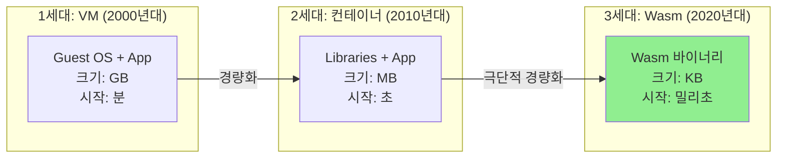
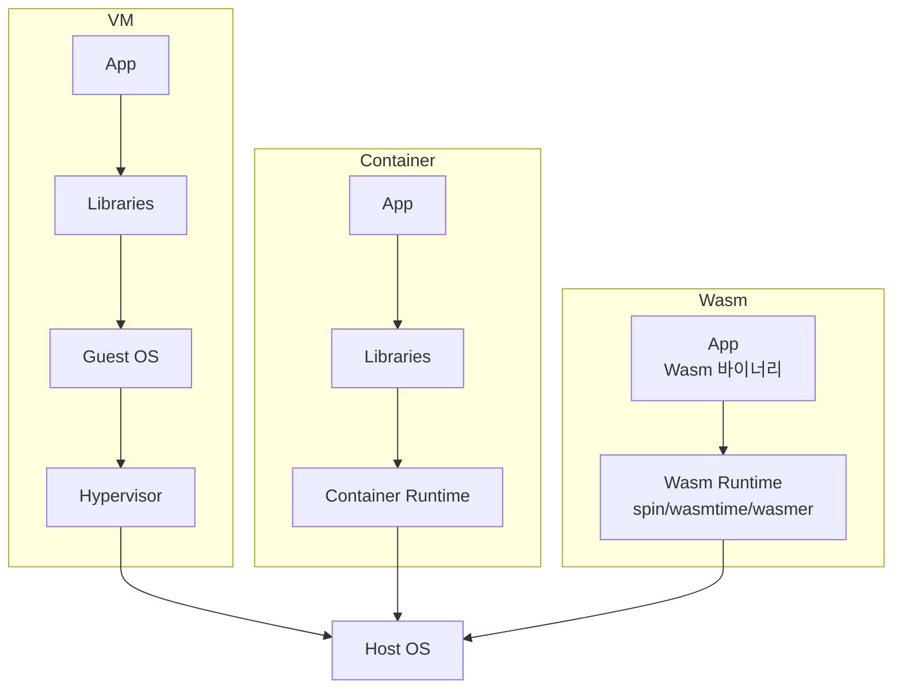
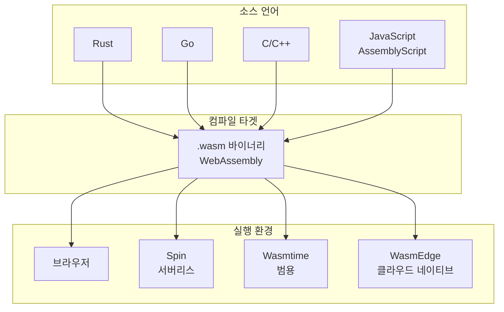
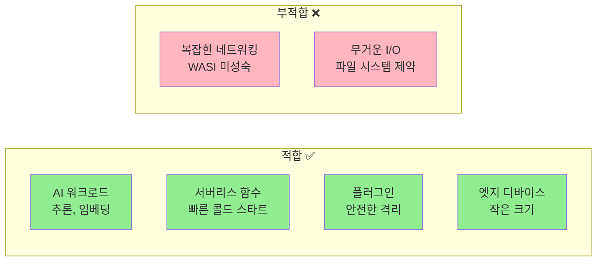
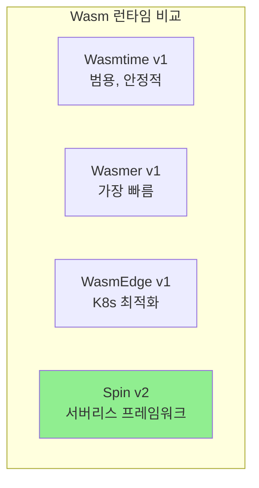
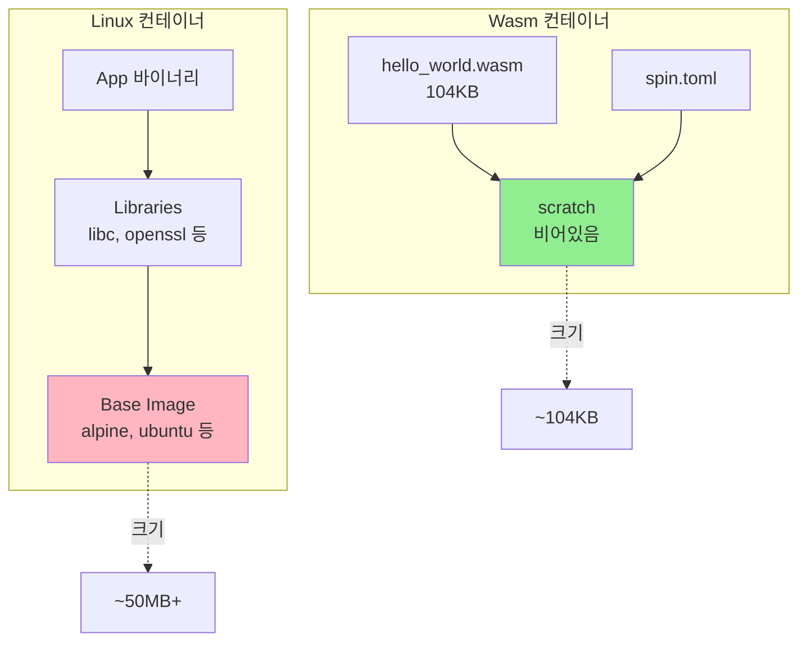
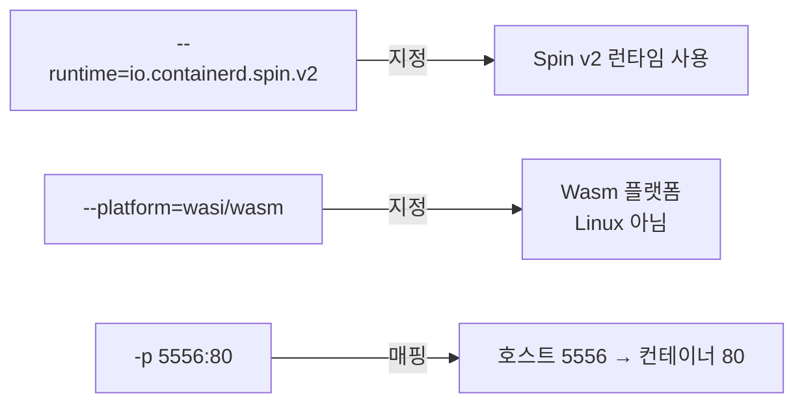
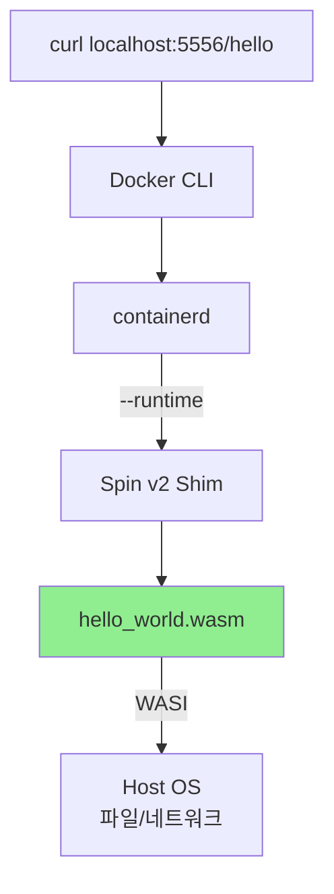
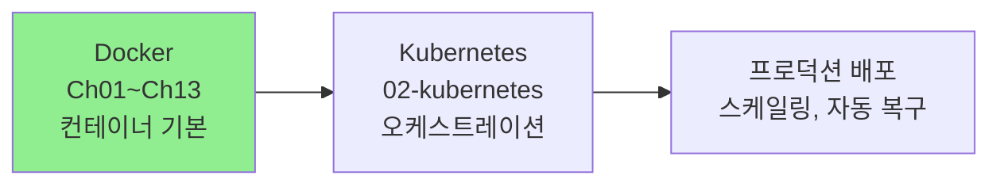

# Ch13. Docker & WebAssembly

> 📌 **핵심 요약**
> WebAssembly(Wasm)은 클라우드 컴퓨팅의 "세 번째 물결"로, 컨테이너보다 더 작고(KB 단위), 빠르고(밀리초 시작), 안전하며(샌드박스 격리), 이식성이 높다(어디서나 실행). Docker Desktop은 여러 Wasm 런타임을 내장하여, 익숙한 Docker 도구(`docker build`, `docker run`)로 Wasm 앱을 컨테이너화하고 실행할 수 있다.

## 🎯 학습 목표
1. 클라우드 컴퓨팅 세대(VM → 컨테이너 → Wasm) 비교
2. Wasm의 개념과 컴파일 타겟으로서의 특징 이해
3. Docker Desktop의 Wasm 런타임 설정
4. Spin 프레임워크로 Wasm 앱 작성 및 빌드
5. Wasm 앱 컨테이너화 및 실행
6. Wasm의 적합/부적합 워크로드 파악

---

## 1. 클라우드 컴퓨팅의 세 가지 물결

### 1.1 세대별 진화



각 세대는 **더 가볍고, 빠르고, 이식성이 높은 방향**으로 진화했다. VM은 전체 OS를 포함하고, 컨테이너는 라이브러리만 포함하며, Wasm은 바이너리만 포함한다.

### 1.2 세대별 특징 비교

| 특성 | VM | 컨테이너 | Wasm |
|------|-----|----------|------|
| **크기** | GB 단위 | MB 단위 | KB 단위 |
| **시작 시간** | 분 | 초 | 밀리초 |
| **이식성** | 하이퍼바이저 의존 | OS 커널 의존 | **완전한 이식성** |
| **보안** | 하드웨어 격리 | 프로세스 격리 | 샌드박스 격리 |
| **유연성** | 매우 높음 | 높음 | 제한적 |
| **격리 수준** | 강함 | 중간 | 중간 |

**왜 이식성이 다른가?**
- VM: 하이퍼바이저(VMware, Hyper-V 등)마다 다른 형식
- 컨테이너: Linux 커널 기능 의존 (Windows는 WSL 필요)
- Wasm: **Wasm 런타임만 있으면 어디서나 실행** (OS/아키텍처 무관)

### 1.3 아키텍처 비교



Wasm은 **Guest OS와 라이브러리가 불필요**하기 때문에 극도로 작고 빠르다. 이는 "한 번 컴파일, 어디서나 실행"의 진정한 구현이다.

---

## 2. WebAssembly란?

### 2.1 Wasm의 정의

WebAssembly는 **새로운 가상 머신 아키텍처**로, 다양한 언어를 동일한 바이너리 형식으로 컴파일할 수 있는 타겟이다. 원래 브라우저에서 네이티브 성능을 위해 설계되었지만, 현재는 **서버, 엣지, 플러그인** 등으로 확장되었다.



**핵심 특징**:
- **언어 독립적**: Rust, Go, C/C++ 등 다양한 언어 지원
- **바이너리 형식**: 텍스트가 아닌 효율적인 바이너리
- **샌드박스 보안**: 기본적으로 파일 시스템/네트워크 접근 불가
- **WASI**: 시스템 인터페이스 표준 (파일/네트워크 접근 허용)

### 2.2 현재 적합한 워크로드



**왜 서버리스에 적합한가?**
- 밀리초 단위 콜드 스타트 (컨테이너는 초 단위)
- 작은 크기로 네트워크 전송 빠름
- 메모리 효율적 (동시 실행 인스턴스 증가)

**왜 복잡한 네트워킹이 어려운가?**
- WASI(WebAssembly System Interface)가 아직 발전 중
- 고급 네트워킹 기능(mTLS, 복잡한 프로토콜)은 제한적
- 향후 개선 예정

---

## 3. 사전 요구사항

### 3.1 필요한 도구

| 도구 | 최소 버전 | 설치 확인 | 용도 |
|------|----------|----------|------|
| **Docker Desktop** | 4.37+ | `docker version` | Wasm 컨테이너 실행 |
| **Rust** | 1.82+ | `rustc --version` | Wasm 앱 개발 |
| **Spin** | 3.1+ | `spin --version` | Wasm 프레임워크 |

### 3.2 Docker Desktop Wasm 설정

```
Docker Desktop → Settings
├── General
│   └── ☑ Use containerd for pulling and storing images
└── Features in development
    └── ☑ Enable Wasm
    → Apply & restart
```

**containerd가 필요한 이유**:
Docker Desktop은 기본적으로 자체 이미지 스토어를 사용하지만, Wasm은 **OCI Artifact**로 저장되므로 containerd의 확장 기능이 필요하다.

### 3.3 Rust Wasm 타겟 설치

```bash
# Wasm 타겟 추가
$ rustup target add wasm32-wasip1
info: downloading component 'rust-std' for 'wasm32-wasip1'
info: installing component 'rust-std' for 'wasm32-wasip1'

# 설치 확인
$ rustup target list | grep wasm
wasm32-unknown-unknown
wasm32-wasip1 (installed)
wasm32-wasip2
```

**타겟 설명**:
- `wasm32-unknown-unknown`: 브라우저용 (시스템 접근 불가)
- `wasm32-wasip1`: WASI Preview 1 (파일/네트워크 접근 가능)
- `wasm32-wasip2`: WASI Preview 2 (Component Model 지원, 실험적)

---

## 4. Docker Desktop의 Wasm 런타임

### 4.1 설치된 런타임 확인

```bash
$ docker run --rm -i --privileged --pid=host \
  jorgeprendes420/docker-desktop-shim-manager:latest

io.containerd.wasmtime.v1      # Bytecode Alliance 공식
io.containerd.wws.v1           # WebAssembly Workers
io.containerd.slight.v1        # SpiderLightning
io.containerd.wasmer.v1        # Wasmer 런타임
io.containerd.spin.v2          # ← 이 장에서 사용
io.containerd.lunatic.v1       # Lunatic 런타임
io.containerd.wasmedge.v1      # WasmEdge 런타임
```

### 4.2 주요 런타임 비교



| 런타임 | 특징 | 적합 워크로드 |
|--------|------|---------------|
| **Wasmtime** | Bytecode Alliance 공식, 안정적 | 범용 |
| **Wasmer** | 가장 빠른 실행 속도 | 성능 중시 |
| **WasmEdge** | 클라우드 네이티브 최적화 | K8s, 서버리스 |
| **Spin** | 서버리스 프레임워크 (HTTP, KV 내장) | 마이크로서비스 |

**Spin을 선택한 이유**:
- HTTP 서버 기능 내장 (별도 웹 프레임워크 불필요)
- Key-Value Store, SQL 등 서버리스 기능 제공
- 개발 → 테스트 → 배포 워크플로우 통합

---

## 5. Wasm 앱 작성 (Spin 사용)

### 5.1 프로젝트 생성

```bash
# 새 Wasm 앱 생성
$ spin new hello-world -t http-rust
Description: Wasm app
HTTP path: /hello

# 디렉토리 구조
$ cd hello-world && tree
.
├── Cargo.toml      # Rust 패키지 설정
├── spin.toml       # Spin 앱 설정 (라우팅, 컴포넌트)
└── src
    └── lib.rs      # 앱 소스 코드
```

**파일 역할**:
- `spin.toml`: Spin 앱의 메타데이터 및 라우팅 설정
- `Cargo.toml`: Rust 의존성 및 빌드 설정
- `src/lib.rs`: HTTP 핸들러 로직

### 5.2 소스 코드 구조 (src/lib.rs)

```rust
use spin_sdk::http::{IntoResponse, Request, Response};
use spin_sdk::http_component;

/// A simple Spin HTTP component.
#[http_component]
fn handle_hello_world(req: Request) -> anyhow::Result<impl IntoResponse> {
    Ok(http::Response::builder()
        .status(200)
        .header("content-type", "text/plain")
        .body("Docker loves Wasm")?)  // ← 응답 메시지 수정
}
```

**코드 설명**:
- `#[http_component]`: Spin HTTP 컴포넌트 매크로
- `Request`: HTTP 요청 (헤더, 바디 등)
- `IntoResponse`: HTTP 응답으로 변환 가능한 타입
- `anyhow::Result`: 에러 핸들링 (Rust 관용구)

### 5.3 빌드 및 로컬 테스트

```bash
# Wasm 바이너리로 컴파일
$ spin build
Building component hello-world with `cargo build --target wasm32-wasip1 --release`
   Compiling hello-world v0.1.0
    Finished `release` profile [optimized] target(s) in 2.34s
Finished building all Spin components

# 빌드 결과 확인
$ tree target/wasm32-wasip1/release/
target/wasm32-wasip1/release/
└── hello_world.wasm    # ← Wasm 바이너리 (104KB)

# 로컬 실행 테스트
$ spin up
Logging component stdio to ".spin/logs/"
Serving http://127.0.0.1:3000
Available Routes:
  hello-world: http://127.0.0.1:3000/hello (wildcard)

# 다른 터미널에서 테스트
$ curl http://127.0.0.1:3000/hello
Docker loves Wasm
```

**104KB의 의미**:
일반적인 Go HTTP 서버 바이너리는 ~7MB, Node.js 앱은 수십 MB이다. Wasm은 **100배 이상 작다**.

---

## 6. Wasm 앱 컨테이너화

### 6.1 Dockerfile 작성

```dockerfile
FROM scratch                                        # 빈 베이스 이미지 (OS 불필요)
COPY /target/wasm32-wasip1/release/hello_world.wasm .  # Wasm 바이너리 복사
COPY spin.toml .                                    # Spin 설정 파일 복사
```

**scratch의 의미**:
`scratch`는 **완전히 빈 이미지**로, 파일 시스템도 없다. Wasm은 OS 커널 기능에 의존하지 않으므로 `scratch`만으로 충분하다.

### 6.2 spin.toml 수정

```toml
# 변경 전 (로컬 경로)
[component.hello-world]
source = "target/wasm32-wasip1/release/hello_world.wasm"

# 변경 후 (이미지 내 경로)
[component.hello-world]
source = "hello_world.wasm"
```

이미지 내부에서는 파일이 루트 디렉토리에 복사되므로, 상대 경로를 수정해야 한다.

### 6.3 이미지 빌드

```bash
# Wasm 이미지 빌드
$ docker build \
  --platform wasi/wasm \           # Wasm 플랫폼 지정
  --provenance=false \             # Provenance 메타데이터 비활성화 (크기 절약)
  -t myuser/ddd-book:wasm .

[+] Building 0.3s (7/7) FINISHED
 => [internal] load build definition from Dockerfile
 => => transferring dockerfile: 154B
 => [internal] load metadata for scratch
 => [internal] load build context
 => => transferring context: 106.5kB
 => CACHED [1/2] FROM scratch
 => [2/2] COPY /target/wasm32-wasip1/release/hello_world.wasm .
 => [3/3] COPY spin.toml .
 => exporting to image
 => => exporting layers
 => => writing image sha256:abc123...
 => => naming to docker.io/myuser/ddd-book:wasm

# 이미지 확인
$ docker images
REPOSITORY       TAG    CREATED         SIZE
myuser/ddd-book  wasm   10 seconds ago  104kB    # ← 매우 작은 크기!
```

**플래그 설명**:
- `--platform wasi/wasm`: Wasm 플랫폼 지정 (Linux/amd64와 구분)
- `--provenance=false`: BuildKit provenance 메타데이터 비활성화 (크기 절약, 선택적)

### 6.4 일반 Linux 컨테이너 vs Wasm 컨테이너



**차이점 요약**:
- Linux 컨테이너: Guest OS, 라이브러리, 의존성 포함
- Wasm 컨테이너: Wasm 바이너리와 설정 파일만 포함
- 취약점 스캔: Linux는 가능, Wasm은 아직 도구 미성숙

### 6.5 Docker Hub에 푸시

```bash
# Docker Hub 로그인
$ docker login
Username: myuser
Password: ********

# 이미지 푸시
$ docker push myuser/ddd-book:wasm
The push refers to repository [docker.io/myuser/ddd-book]
abc123...: Pushed
def456...: Pushed
wasm: digest: sha256:789... size: 527
```

---

## 7. Wasm 컨테이너 실행

### 7.1 컨테이너 실행

```bash
# Wasm 컨테이너 실행
$ docker run -d --name wasm-ctr \
  --runtime=io.containerd.spin.v2 \   # Spin Wasm 런타임 지정
  --platform=wasi/wasm \              # Wasm 플랫폼 지정
  -p 5556:80 \                        # 포트 매핑
  myuser/ddd-book:wasm /

# 컨테이너 상태 확인
$ docker ps
CONTAINER ID   IMAGE                  STATUS    PORTS
abc123...      myuser/ddd-book:wasm   Up        0.0.0.0:5556->80/tcp

# 로그 확인
$ docker logs wasm-ctr
Serving http://0.0.0.0:80
Available Routes:
  hello-world: http://0.0.0.0:80/hello

# 테스트
$ curl http://localhost:5556/hello
Docker loves Wasm
```

### 7.2 명령어 플래그 설명



**왜 --runtime이 필요한가?**
Docker Desktop은 여러 Wasm 런타임을 지원하므로, 어떤 런타임을 사용할지 명시해야 한다. Spin v2는 HTTP 서버 기능을 제공하므로 `--runtime=io.containerd.spin.v2`를 사용한다.

**왜 --platform이 필요한가?**
Docker는 기본적으로 Linux 컨테이너를 가정한다. `--platform=wasi/wasm`으로 Wasm 플랫폼임을 명시해야 containerd가 올바른 런타임을 선택한다.

### 7.3 실행 아키텍처



**Shim의 역할**:
containerd는 Wasm 런타임을 직접 실행하지 않고, **shim**이라는 중간 프로세스를 통해 실행한다. shim은 containerd API를 Wasm 런타임 API로 변환한다.

---

## 8. 정리 및 정리 작업

### 8.1 컨테이너 및 이미지 삭제

```bash
# 컨테이너 삭제
$ docker rm wasm-ctr -f
wasm-ctr

# 로컬 이미지 삭제
$ docker rmi myuser/ddd-book:wasm
Untagged: myuser/ddd-book:wasm
Deleted: sha256:abc123...
```

### 8.2 전체 Docker 학습의 마무리

Docker PoC 학습(Ch01~Ch13)을 완료했다. 다음 단계는 **Kubernetes**로 넘어가서 컨테이너 오케스트레이션을 학습한다.



**Docker에서 배운 핵심 개념**:
- 컨테이너 이미지 빌드 및 레이어 최적화
- Multi-stage 빌드 및 BuildKit
- 네트워킹 (bridge, overlay, ingress)
- 영속성 (Volume, Bind Mount)
- Compose를 통한 멀티 컨테이너 관리
- AI 모델(DMR)과 Wasm 통합

**Kubernetes로의 전환**:
Docker는 **단일 호스트**에서 컨테이너를 관리하지만, Kubernetes는 **다중 호스트 클러스터**에서 컨테이너를 오케스트레이션한다. Docker Swarm도 오케스트레이션을 제공하지만, Kubernetes가 사실상 표준이 되었다.

---

## 💡 실무 적용 포인트

### 면접 대비 질문

**Q1: Wasm이 클라우드 컴퓨팅의 '세 번째 물결'이라 불리는 이유는?**
> **A**: 첫 번째 물결(VM)은 하드웨어 가상화로 서버 통합을 가능하게 했고, 두 번째 물결(컨테이너)은 OS 수준 가상화로 경량화를 달성했다. Wasm은 더 작고(KB 단위), 빠르고(밀리초 시작), 진정한 "한 번 컴파일, 어디서나 실행" 이식성을 제공하는 세 번째 진화이다. 샌드박스 보안으로 멀티테넌트 환경에서도 안전하다.

**Q2: Wasm 컨테이너가 일반 Linux 컨테이너보다 작은 이유는?**
> **A**: Wasm 컨테이너는 `scratch`(빈) 베이스 이미지를 사용하고, Guest OS, libc, 기타 라이브러리가 필요 없다. Wasm 바이너리와 설정 파일만 포함하므로 KB 단위의 매우 작은 크기를 유지한다. 이는 Wasm 런타임이 모든 시스템 추상화를 제공하기 때문이다.

**Q3: Docker에서 Wasm 컨테이너를 실행할 때 `--runtime` 플래그가 필요한 이유는?**
> **A**: Docker Desktop은 여러 Wasm 런타임(spin, wasmtime, wasmer, wasmedge 등)을 지원한다. `--runtime` 플래그로 어떤 Wasm 런타임을 사용할지 지정해야 하며, 각 런타임은 다른 기능과 성능 특성을 가진다. 예를 들어, Spin은 HTTP 서버 기능을 내장하고, WasmEdge는 AI 추론에 최적화되어 있다.

**Q4: 현재 Wasm이 적합한/부적합한 워크로드는?**
> **A**: Wasm은 AI 워크로드(추론, 임베딩), 서버리스 함수(빠른 콜드 스타트), 플러그인(안전한 격리), 엣지 디바이스(작은 크기)에 적합하다. 하지만 복잡한 네트워킹(mTLS, 고급 프로토콜)이나 무거운 I/O 작업에는 아직 제한적이다. 이는 WASI(WebAssembly System Interface) 표준이 계속 발전하면서 개선될 예정이다.

**Q5: Wasm과 컨테이너는 경쟁 관계인가, 보완 관계인가?**
> **A**: **보완 관계**이다. Wasm은 특정 워크로드(서버리스, 엣지, AI)에서 컨테이너를 대체할 수 있지만, 복잡한 애플리케이션이나 기존 생태계는 컨테이너가 여전히 우위이다. Docker Desktop이 Wasm을 통합한 것은 "적합한 도구를 적합한 작업에" 사용하도록 하기 위함이다. 예를 들어, 메인 앱은 컨테이너로, AI 추론은 Wasm으로 실행할 수 있다.

---

## ✅ 체크리스트

### 개념 이해
- [ ] 클라우드 컴퓨팅 세대(VM → 컨테이너 → Wasm) 비교 설명 가능
- [ ] Wasm이 언어 독립적인 컴파일 타겟인 이유 이해
- [ ] Wasm 컨테이너와 일반 Linux 컨테이너 차이점 파악
- [ ] Wasm의 적합/부적합 워크로드 구분
- [ ] WASI(WebAssembly System Interface)의 역할 이해

### 환경 설정
- [ ] Docker Desktop에서 containerd 및 Wasm 활성화
- [ ] Rust `wasm32-wasip1` 타겟 설치
- [ ] Spin 프레임워크 설치 및 버전 확인
- [ ] Docker Desktop의 Wasm 런타임 목록 확인

### Wasm 앱 개발
- [ ] `spin new`로 프로젝트 생성
- [ ] `spin build`로 Wasm 바이너리 컴파일
- [ ] `spin up`으로 로컬 테스트
- [ ] HTTP 핸들러 코드 작성 및 수정

### 컨테이너화 및 실행
- [ ] `FROM scratch` 기반 Dockerfile 작성
- [ ] `--platform wasi/wasm` 플래그로 이미지 빌드
- [ ] Docker Hub에 Wasm 이미지 푸시
- [ ] `--runtime=io.containerd.spin.v2`로 컨테이너 실행
- [ ] 포트 매핑 및 접근 테스트

### 실무 적용
- [ ] 서버리스/엣지 워크로드에 Wasm 적용 검토
- [ ] 기존 컨테이너 vs Wasm 컨테이너 선택 기준 수립
- [ ] Wasm과 컨테이너의 하이브리드 아키텍처 설계

---

## 🔗 참고 자료

- [Docker Desktop Wasm 공식 문서](https://docs.docker.com/desktop/wasm/)
- [Fermyon Spin](https://developer.fermyon.com/spin)
- [WebAssembly.org](https://webassembly.org/)
- [WASI (WebAssembly System Interface)](https://wasi.dev/)
- [Bytecode Alliance](https://bytecodealliance.org/)
- [Wasmtime GitHub](https://github.com/bytecodealliance/wasmtime)
- [WasmEdge GitHub](https://github.com/WasmEdge/WasmEdge)
- 도서: *Docker Deep Dive* - Nigel Poulton, Chapter 11
