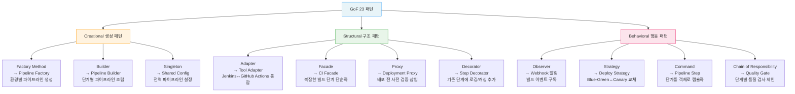

# Ch01. CI/CD 디자인 패턴 기초

**핵심 질문**: "GoF 패턴을 CI/CD에 어떻게 적용하는가?"

---

## 🎯 학습 목표

이 챕터를 마치면 다음을 할 수 있다.

- GoF 23개 패턴을 Creational/Structural/Behavioral로 분류하고 CI/CD 대응 개념을 설명할 수 있다
- Test Pyramid과 Test Diamond의 차이를 이해하고 프로젝트 맥락에 맞는 전략을 선택할 수 있다
- Pipeline as Software 관점에서 DRY, SRP, OCP 원칙을 파이프라인 코드에 적용할 수 있다
- 파이프라인 코드 중복이 초래하는 기술 부채를 Factory 패턴으로 해결하는 방법을 설명할 수 있다
- 문제 유형별로 적합한 GoF 패턴을 매핑하는 의사결정 프레임워크를 활용할 수 있다
- 향후 챕터에서 다룰 주요 안티패턴의 증상과 원인을 미리 인식할 수 있다

---

## 1. 왜 CI/CD에 디자인 패턴이 필요한가

파이프라인도 소프트웨어다. 이 명제는 단순해 보이지만, CI/CD 실무에서는 자주 잊힌다. 개발팀이 애플리케이션 코드에는 리뷰, 테스트, 리팩터링을 꼼꼼히 적용하면서도, 그 코드를 빌드하고 배포하는 파이프라인 코드에는 "동작하면 된다"는 기준을 적용하는 모습은 흔하다. 그 결과는 예측 가능하다. 환경이 하나에서 셋으로 늘어나는 순간 `.github/workflows/deploy-dev.yml`, `.github/workflows/deploy-staging.yml`, `.github/workflows/deploy-prod.yml` 세 파일이 만들어지고, 배포 로직 하나를 바꾸려면 세 군데를 동시에 수정해야 한다.

소프트웨어 공학에서 GoF 디자인 패턴이 등장한 배경도 같은 이유였다. 반복되는 구조적 문제에 매번 새로운 해결책을 발명하는 것은 비효율적이다. "환경별로 조금씩 다른 파이프라인을 만들어야 한다"는 문제는 애플리케이션 코드에서 "조건에 따라 다른 객체를 생성해야 한다"는 문제와 본질적으로 같다. 전자에는 Factory 패턴이, 후자에도 Factory 패턴이 답이 된다. 문제의 형태가 같으면 해결책의 형태도 같다.

패턴이 주는 또 다른 가치는 공통 언어다. "이 파이프라인은 Strategy 패턴으로 배포 전략을 주입받습니다"라고 말하는 순간, 팀원은 배포 로직이 교체 가능한 형태로 분리되어 있음을 즉각 이해한다. 코드를 열어보지 않아도 구조가 전달된다. 이것이 패턴 기반 설계가 소통 비용을 줄이는 방식이다.

---

## 2. GoF 패턴 분류와 CI/CD 매핑

GoF 패턴은 Creational(생성), Structural(구조), Behavioral(행동) 세 범주로 나뉜다. 각 범주가 CI/CD에서 어떤 문제를 해결하는지 먼저 이해하면 개별 패턴을 훨씬 빠르게 흡수할 수 있다.

Creational 패턴은 "무엇을 만들 것인가"를 결정하는 로직을 캡슐화한다. CI/CD에서는 환경(dev/staging/prod)별로 파이프라인 구성 요소를 다르게 조합해야 할 때 이 범주의 패턴이 적합하다. Structural 패턴은 기존 인터페이스를 변경하지 않고 시스템을 확장하거나 통합하는 문제를 다룬다. 서로 다른 CI 도구(Jenkins, GitHub Actions, GitLab CI)를 통일된 방식으로 다루어야 할 때 Adapter가 등장한다. Behavioral 패턴은 객체 간 책임 분배와 협력 방식을 정의한다. 빌드 완료 후 알림을 여러 채널로 보내야 한다면 Observer가 자연스럽게 적용된다.



### 2-1. 패턴별 CI/CD 적용 상세 설명

**Factory Method — 환경별 파이프라인 분기를 한 곳으로**

Factory Method가 CI/CD에서 가장 먼저 등장하는 이유는 멀티 환경 요구사항이 거의 모든 프로젝트에 공통으로 존재하기 때문이다. 배포 클러스터 주소, 레플리카 수, 승인 단계 유무 같은 차이는 환경마다 다르지만 배포 절차 자체는 동일하다. Factory Method는 이 공통 절차를 상위 클래스(또는 공유 워크플로우)에 정의하고, 환경별 세부 설정은 팩토리 메서드가 생성한 객체로 주입하는 방식으로 중복을 제거한다. 새 환경(예: canary)이 생겨도 기존 코드를 수정하지 않고 팩토리에 분기만 추가한다. 이것이 OCP(개방-폐쇄 원칙)와 맞닿는 지점이다.

**Strategy — 배포 전략을 런타임에 교체**

소프트웨어가 성숙할수록 배포 전략은 진화한다. 초기에 단순 Rolling 배포로 시작했다가, 트래픽이 늘면 Blue-Green으로, 세밀한 카나리 테스트가 필요해지면 Canary 방식으로 전환된다. Strategy 패턴 없이 이 진화를 수용하면 파이프라인 파일 안에 `if environment == "prod" and strategy == "blue-green"` 같은 조건 분기가 쌓인다. Strategy 패턴은 배포 로직 자체를 인터페이스 뒤에 두고, 파이프라인은 인터페이스만 알도록 설계한다. 전략 교체는 어떤 전략 구현체를 주입하느냐의 문제가 된다.

**Observer — 알림 채널 추가를 코드 변경 없이**

"배포 완료 시 Slack에 알림을 보내 주세요"라는 요구사항은 세 달 후 "PagerDuty에도 보내 주세요", 여섯 달 후 "Teams 채널에도 추가해 주세요"로 반드시 확장된다. Observer 없이 이를 구현하면 파이프라인 끝부분에 알림 로직이 줄줄이 추가된다. Observer 패턴은 파이프라인 엔진(Subject)과 알림 채널(Observer)을 분리하여, 새 채널은 구독 등록만으로 추가되고 파이프라인 핵심 로직은 변경되지 않는다.

**Chain of Responsibility — 품질 게이트를 직렬 체인으로**

린트 → 단위 테스트 → 통합 테스트 → 보안 스캔 → 성능 테스트로 이어지는 품질 게이트는 각 단계가 통과/차단 결정을 내리고 다음 단계로 전달하는 Chain of Responsibility 구조다. 왜 이 패턴이 필요한가? 각 게이트의 판단 기준이 서로 다르고, 게이트를 추가하거나 순서를 바꿀 때 기존 게이트 로직을 건드리지 않아야 하기 때문이다. 또한 체인의 어느 지점에서든 "이 커밋은 기준 미달"이라고 결정하면 이후 단계는 실행하지 않아 불필요한 자원 낭비를 막는다.

**Command — 파이프라인 단계를 객체로**

Command 패턴은 파이프라인 단계를 실행 가능한 객체로 캡슐화한다. 이 접근의 장점은 실행 취소(rollback), 재실행(retry), 큐잉(queue)이 모두 가능해진다는 것이다. 단순 셸 스크립트 호출 방식에서는 실패한 단계만 재실행하는 것이 어렵지만, Command 패턴에서는 실패한 Command 객체를 큐에 다시 넣거나 보상 Command를 실행하는 것이 자연스럽다.

---

## 3. Test Pyramid vs Test Diamond

테스트 전략은 패턴 선택의 선행 조건이다. 어떤 테스트 비율을 목표로 삼는지에 따라 파이프라인 단계 구성이 달라지기 때문이다.

**Test Pyramid**는 마이크 콘이 제안한 모델로, 단위 테스트가 가장 많고 통합 테스트가 그다음, E2E 테스트가 가장 적은 형태다. 단위 테스트는 빠르고 독립적이며 비용이 낮다. 반면 E2E 테스트는 느리고 불안정하며 유지 비용이 높다. 그러므로 피라미드 꼭대기로 올라갈수록 테스트 수가 줄어야 한다. 이 모델은 마이크로서비스처럼 서비스 경계가 명확하고 단위 테스트로 커버 가능한 비즈니스 로직이 풍부한 시스템에 잘 맞는다.

**Test Diamond**는 통합 테스트가 중심이 되는 모델이다. 서비스 간 계약(contract)이 복잡하거나, 단위 테스트만으로는 실제 통합 오류를 잡기 어려운 환경에서 등장했다. API 게이트웨이, 이벤트 기반 시스템, 레거시 시스템과의 통합 지점이 많은 경우에 선택된다. 단위 테스트가 적고 E2E도 적은 대신 통합 테스트가 두터운 형태다.

두 모델을 선택하는 핵심 기준은 "비즈니스 로직이 어디에 있는가"다. 순수 함수 형태로 분리된 도메인 로직이 풍부하다면 Pyramid가 적합하고, 로직의 대부분이 서비스 간 데이터 흐름과 변환에 존재한다면 Diamond가 더 많은 버그를 잡는다.

```python
# Test Pyramid — pytest 예시 (단위 70%, 통합 20%, E2E 10%)
# 왜 pytest인가: 마커(marker)로 테스트 계층을 명시적으로 분류할 수 있어서
# 파이프라인이 계층별로 다른 단계에서 실행하도록 구성하기 좋다

# ====== UNIT TESTS (70%) ======
# 빠르고 격리됨 — 외부 의존 없음, 수천 개도 수 초 안에 실행 가능
# tests/unit/test_payment_calculator.py
def test_calculate_discount_when_vip():
    calc = PaymentCalculator()
    # 외부 DB/API 없이 순수 로직만 검증 — 가장 빠른 피드백
    assert calc.discount(user_tier="VIP", amount=10000) == 1000

def test_calculate_discount_when_standard():
    calc = PaymentCalculator()
    assert calc.discount(user_tier="STANDARD", amount=10000) == 0

def test_calculate_discount_when_amount_zero():
    calc = PaymentCalculator()
    # 경계값 테스트 — 단위 테스트가 가장 잘 커버하는 영역
    assert calc.discount(user_tier="VIP", amount=0) == 0


# ====== INTEGRATION TESTS (20%) ======
# 실제 DB/메시지큐와 연결 — 컨테이너 사용, 단위보다 느리지만 계약 검증에 필수
# tests/integration/test_order_repository.py
@pytest.mark.integration
def test_save_and_find_order(db_session):
    # db_session fixture가 테스트 컨테이너(PostgreSQL)에 연결
    repo = OrderRepository(db_session)
    order = Order(id="ORD-001", amount=5000)
    repo.save(order)
    found = repo.find_by_id("ORD-001")
    assert found.amount == 5000

@pytest.mark.integration
def test_order_not_found_returns_none(db_session):
    repo = OrderRepository(db_session)
    # 실제 DB에서 None 반환 동작 확인 — 단위 테스트에서 목(mock)으로 가정했던 것을 실제로 검증
    assert repo.find_by_id("NONEXISTENT") is None


# ====== E2E TESTS (10%) ======
# 전체 흐름 검증 — 느리지만 신뢰도 최고, 핵심 해피패스만 선별
# tests/e2e/test_checkout_flow.py
@pytest.mark.e2e
@pytest.mark.slow
def test_full_checkout_flow(live_server):
    # 실제 서버 + 실제 결제 sandbox 연동 — 환경이 복잡할수록 불안정해지므로 최소화
    response = requests.post(f"{live_server}/checkout", json={"item_id": "A1"})
    assert response.status_code == 200
    assert response.json()["status"] == "CONFIRMED"
```

```javascript
// Test Diamond — Jest 예시 (단위 20%, 통합 60%, E2E 20%)
// API 게이트웨이처럼 통합 지점이 핵심인 시스템에서 선택
// 왜 Jest인가: describe/beforeAll로 컨테이너 수명주기를 테스트 스위트에 묶기 편리해서

// ====== UNIT TESTS (20%) ======
// 순수 변환 로직만 — 서비스 간 흐름은 단위 테스트로 검증하기 어려움
// __tests__/unit/mapper.test.js
test('maps external API response to internal DTO', () => {
  const raw = { user_id: 'u1', full_name: 'Alice' };
  const dto = UserMapper.fromExternal(raw);
  // 단순 변환 — DB/네트워크 불필요, 여기서 비중을 높이면 통합 오류를 못 잡음
  expect(dto.userId).toBe('u1');
  expect(dto.name).toBe('Alice');
});

// ====== INTEGRATION TESTS (60%) ======
// 서비스 간 계약 검증이 핵심 — Diamond에서는 대부분의 테스트가 여기 집중
// 왜 60%인가: 버그의 대부분이 서비스 경계에서 발생하기 때문
// __tests__/integration/order-payment.test.js
describe('Order → Payment service contract', () => {
  // beforeAll로 두 서비스 컨테이너를 함께 시작 — 실제 통신 검증
  beforeAll(() => startContainers(['order-service', 'payment-service']));
  afterAll(() => stopContainers());

  test('payment completes when order confirmed', async () => {
    const order = await OrderService.create({ amount: 3000 });
    const payment = await PaymentService.process(order.id);
    // 두 서비스 간 데이터 흐름 검증 — 이 레벨에서 계약 깨짐을 조기 발견
    expect(payment.orderId).toBe(order.id);
    expect(payment.status).toBe('SUCCESS');
  });

  test('payment fails gracefully when order does not exist', async () => {
    // 실패 경로도 통합 레벨에서 검증 — 단위 테스트 목(mock)에서 가정한 동작을 실제로 확인
    await expect(PaymentService.process('INVALID-ID'))
      .rejects.toThrow('Order not found');
  });
});

// ====== E2E TESTS (20%) ======
// Diamond는 Pyramid보다 E2E 비중이 높지만, 여전히 핵심 시나리오만 선별
// e2e/checkout.spec.js
test('checkout happy path from cart to confirmation', async ({ page }) => {
  await page.goto('/cart');
  await page.click('[data-testid="checkout-btn"]');
  // 사용자가 실제로 경험하는 최종 결과만 검증 — 내부 구현은 관심 없음
  await expect(page.locator('.confirmation-msg')).toBeVisible();
});
```

두 모델 중 어느 쪽도 "항상 옳은" 정답은 없다. 시스템의 특성과 팀의 역량, 파이프라인 속도 목표를 함께 고려해야 한다. 단위 테스트가 의미 있으려면 비즈니스 로직이 순수 함수 형태로 분리되어 있어야 하고, 통합 테스트가 실용적이려면 테스트 컨테이너 기반 인프라가 갖춰져야 한다.

---

## 4. Pipeline as Software — DRY, SRP, OCP 적용

파이프라인 코드를 소프트웨어로 대우한다는 것은 구체적으로 세 원칙을 적용하는 것을 의미한다.

**DRY(Don't Repeat Yourself)**는 가장 먼저 위반되고 가장 빠르게 부채가 쌓이는 원칙이다. 환경별로 파이프라인 파일을 복사하는 순간 DRY가 깨진다. 왜 DRY가 중요한가? 레지스트리 주소 하나를 바꾸는 작업이 세 파일을 동시에 수정해야 하는 작업이 되고, 하나라도 놓치면 환경 간 불일치가 생기기 때문이다. YAML 앵커, 재사용 가능한 워크플로우(`workflow_call`), GitHub Actions Composite Action, Jenkins Shared Library가 이 원칙을 지키는 도구들이다.

**SRP(Single Responsibility Principle)**는 파이프라인 단계 설계에 직접 적용된다. 빌드, 테스트, 보안 스캔, 배포가 하나의 스크립트 안에 뒤섞여 있다면 SRP 위반이다. 각 단계는 하나의 책임만 가져야 하고, 실패 시 원인 추적이 명확해야 한다. SRP를 지키면 병렬 실행이라는 부산물도 얻는다. 단위 테스트와 린트는 서로 의존하지 않으므로 동시에 실행할 수 있고, 파이프라인 전체 소요 시간이 줄어든다.

**OCP(Open/Closed Principle)**는 파이프라인 확장 시 기존 코드를 수정하지 않고 새 기능을 추가할 수 있어야 한다는 원칙이다. Strategy 패턴으로 배포 전략을 분리해 두면, 새로운 배포 방식(Canary)을 추가할 때 기존 Blue-Green 로직을 건드리지 않아도 된다. Observer 패턴으로 알림을 분리해 두면, 새 채널 추가 시 파이프라인 핵심 코드는 변하지 않는다.

---

## 5. 패턴 선택 의사결정 프레임워크

어떤 패턴을 적용해야 할지 막막할 때, 문제의 형태를 먼저 진단하면 선택이 명확해진다. 패턴은 목적이 아니라 수단이다. "Factory 패턴을 써야 하니까 구조를 맞추자"가 아니라, "이 중복 문제를 해결하는 데 Factory가 적합하다"는 순서여야 한다.

| 문제 유형 | 증상 | 적합한 패턴 | 왜 이 패턴인가 |
|-----------|------|-------------|----------------|
| 환경별 파이프라인 중복 | dev/staging/prod YAML이 90% 동일 | Factory Method | 공통 인터페이스로 환경별 인스턴스 생성, 변경 지점을 팩토리 하나로 집중 |
| 복잡한 파이프라인 조립 | 단계 조합이 유동적, 순서가 자주 바뀜 | Builder | 플루언트 인터페이스로 단계를 순서대로 조립, 선택적 단계 처리 용이 |
| 다른 CI 도구 통합 | Jenkins 스크립트를 GitHub Actions에서도 써야 함 | Adapter | 기존 인터페이스를 변환하여 재사용, 도구 교체 시 어댑터만 교체 |
| 알림 채널 확장 | Slack 외에 Teams, PagerDuty도 알려야 함 | Observer | 이벤트 발행-구독으로 채널 추가 시 핵심 로직 불변 |
| 배포 전략 교체 | Blue-Green → Canary로 전환 필요 | Strategy | 전략을 인터페이스로 분리, 런타임 교체 가능, 기존 전략 코드 불변 |
| 빌드 단계 재실행 | 실패한 단계만 재시도, 롤백 필요 | Command | 단계를 객체로 만들어 큐잉/실행/취소 구현 |
| 품질 게이트 체인 | 린트 → 테스트 → 보안 스캔 순서로 통과 필요 | Chain of Responsibility | 각 게이트가 통과/차단 결정 후 다음으로 전달, 게이트 추가 시 체인만 확장 |
| 환경 전체 구성 일관성 | 빌드+배포+모니터링 설정을 환경별로 묶어야 함 | Abstract Factory | 관련 객체 군(family)을 일관되게 생성, 환경 간 불일치 방지 |

---

## 6. GoF→CI/CD 전체 매핑 테이블

| 패턴 | 범주 | CI/CD 대응 | 사용 시점 |
|------|------|-----------|-----------|
| Factory Method | Creational | Pipeline Factory | 환경별(dev/prod) 파이프라인 구성 객체 생성 시 |
| Abstract Factory | Creational | Environment Factory | 환경 전체(빌드+배포+모니터링) 조합을 일괄 생성 시 |
| Builder | Creational | Pipeline Builder | 단계 조합이 유동적이고 복잡한 파이프라인 조립 시 |
| Prototype | Creational | Pipeline Template Clone | 기존 파이프라인을 복제해 새 프로젝트에 빠르게 적용 시 |
| Singleton | Creational | Global Config | 파이프라인 전체에서 공유하는 설정/시크릿 관리 시 |
| Adapter | Structural | Tool Adapter | Jenkins↔GitHub Actions 등 도구 인터페이스 통일 시 |
| Bridge | Structural | CI/CD Bridge | 파이프라인 추상과 구현(도구)을 독립적으로 확장 시 |
| Composite | Structural | Pipeline Tree | 단계를 중첩 구조로 조합(step → stage → pipeline) 시 |
| Decorator | Structural | Step Decorator | 기존 단계에 로깅, 캐싱, 재시도 로직 추가 시 |
| Facade | Structural | CI Facade | 복잡한 빌드 도구 조합을 단일 진입점으로 노출 시 |
| Proxy | Structural | Deployment Proxy | 배포 전 사전 검증(헬스체크, 권한 확인) 삽입 시 |
| Chain of Responsibility | Behavioral | Quality Gate Chain | 린트→테스트→보안→성능 순서의 게이트 체인 구성 시 |
| Command | Behavioral | Pipeline Step Command | 단계를 객체로 만들어 큐잉, 취소, 재실행 구현 시 |
| Observer | Behavioral | Webhook/Event Notification | 빌드 이벤트를 다수의 채널에 비동기 알림 시 |
| Strategy | Behavioral | Deploy Strategy | Blue-Green↔Canary↔Rolling 배포 전략 런타임 교체 시 |
| Template Method | Behavioral | Pipeline Template | 파이프라인 골격은 고정, 특정 단계만 서브클래스가 구현 시 |
| State | Behavioral | Pipeline State Machine | 대기→실행→성공/실패 상태 전이 관리 시 |

---

## 7. Bad vs Good: 파이프라인 중복

파이프라인 코드 중복이 어떻게 시작되고, Factory 패턴이 어떻게 해결하는지 비교한다.

```yaml
# BAD: 환경별 파이프라인 복사-붙여넣기
# 문제: 레지스트리 주소 하나 바꾸면 3개 파일 동시 수정, 누락 가능성 있음
# .github/workflows/deploy-dev.yml
name: Deploy to Dev
on:
  push:
    branches: [develop]
jobs:
  deploy:
    runs-on: ubuntu-latest
    steps:
      - uses: actions/checkout@v3
      - name: Build
        run: docker build -t app:${{ github.sha }} .
      - name: Push
        run: docker push registry.io/app:${{ github.sha }}
      - name: Deploy
        # dev 전용 클러스터 주소 하드코딩 — 수정 시 3개 파일 모두 변경 필요
        run: kubectl set image deployment/app app=registry.io/app:${{ github.sha }} --namespace=dev

# .github/workflows/deploy-staging.yml — 90% 동일, namespace만 다름
# .github/workflows/deploy-prod.yml  — 90% 동일, namespace + 승인 단계만 다름
# 기술 부채: 파이프라인이 커질수록 동기화 누락 위험도 선형으로 증가
```

```yaml
# GOOD: Reusable Workflow + Factory 패턴 적용
# 이유: 공통 로직을 한 곳에, 환경별 차이는 입력값으로 분리
# .github/workflows/_deploy-template.yml (Factory: 공통 파이프라인 정의)
name: Deploy Template
on:
  workflow_call:
    inputs:
      environment:
        required: true
        type: string
      namespace:
        required: true
        type: string
    secrets:
      REGISTRY_TOKEN:
        required: true

jobs:
  deploy:
    runs-on: ubuntu-latest
    environment: ${{ inputs.environment }}  # 환경별 승인 정책 자동 적용
    steps:
      - uses: actions/checkout@v3
      - name: Build
        # 레지스트리 주소 한 곳에서 관리 — 수정 시 이 파일만 변경
        run: docker build -t ${{ vars.REGISTRY }}/app:${{ github.sha }} .
      - name: Push
        run: docker push ${{ vars.REGISTRY }}/app:${{ github.sha }}
      - name: Deploy
        run: |
          kubectl set image deployment/app \
            app=${{ vars.REGISTRY }}/app:${{ github.sha }} \
            --namespace=${{ inputs.namespace }}

# .github/workflows/deploy-dev.yml (단 6줄로 줄어듦)
# 이제 환경 추가 = 이 형식의 파일 하나 더 추가, 템플릿은 수정 없음(OCP)
name: Deploy to Dev
on:
  push:
    branches: [develop]
jobs:
  deploy:
    uses: ./.github/workflows/_deploy-template.yml
    with:
      environment: dev
      namespace: dev
    secrets: inherit
```

```python
# GOOD: Python Factory 패턴으로 파이프라인 구성 생성
# 왜 Python Factory인가: 환경별 설정이 코드로 표현되므로 타입 검사, 테스트, 리뷰가 가능해진다
# YAML보다 조건 분기, 유효성 검사, 테스트 작성이 훨씬 용이하다
# pipeline_factory.py

from dataclasses import dataclass, field
from typing import Protocol, List
from enum import Enum


class ApprovalPolicy(Enum):
    """배포 승인 정책 — 환경마다 다른 정책을 명시적 타입으로 표현"""
    AUTO = "auto"        # 자동 배포 (dev, staging)
    MANUAL = "manual"    # 수동 승인 필요 (prod)


@dataclass
class PipelineConfig:
    """
    환경별 파이프라인 구성을 표현하는 데이터 클래스.
    불변(frozen=True)으로 설정해 실수로 구성이 변경되는 것을 방지한다.
    """
    registry: str
    namespace: str
    replicas: int
    approval_policy: ApprovalPolicy
    # 환경별 추가 태그 — 모니터링 시스템에 전달되는 메타데이터
    tags: List[str] = field(default_factory=list)

    @property
    def requires_approval(self) -> bool:
        """승인 필요 여부를 명시적 속성으로 노출 — 호출자가 정책 내부를 알 필요 없음"""
        return self.approval_policy == ApprovalPolicy.MANUAL


class PipelineFactory:
    """
    Factory Method 패턴 — 환경 이름으로 적합한 파이프라인 구성을 생성한다.
    새 환경 추가 시 기존 코드를 수정하지 않고 _configs에 분기만 추가하면 된다(OCP).
    왜 클래스 메서드(classmethod)인가: 팩토리 자체를 인스턴스화할 이유가 없고,
    환경 설정은 프로세스 전체에서 공유되는 정보이기 때문이다.
    """
    _configs = {
        "dev": PipelineConfig(
            registry="registry.io/dev",
            namespace="dev",
            replicas=1,
            approval_policy=ApprovalPolicy.AUTO,
            tags=["env:dev", "tier:backend"],
        ),
        "staging": PipelineConfig(
            registry="registry.io/staging",
            namespace="staging",
            replicas=2,
            approval_policy=ApprovalPolicy.AUTO,
            tags=["env:staging", "tier:backend"],
        ),
        "prod": PipelineConfig(
            registry="registry.io/prod",
            namespace="prod",
            replicas=5,
            approval_policy=ApprovalPolicy.MANUAL,  # prod는 수동 승인 필수
            tags=["env:prod", "tier:backend", "sla:99.9"],
        ),
    }

    @classmethod
    def create(cls, environment: str) -> PipelineConfig:
        """
        환경 이름으로 구성을 반환한다. 알 수 없는 환경명은 즉시 실패(Fail Fast).
        왜 Fail Fast인가: 잘못된 환경으로 배포가 진행되면 나중에 더 큰 비용이 발생한다.
        """
        config = cls._configs.get(environment)
        if config is None:
            valid = list(cls._configs.keys())
            raise ValueError(
                f"Unknown environment: '{environment}'. "
                f"Valid options: {valid}. "
                f"새 환경을 추가하려면 PipelineFactory._configs에 항목을 추가하세요."
            )
        return config

    @classmethod
    def environments(cls) -> List[str]:
        """등록된 환경 목록 반환 — 외부에서 지원 환경을 조회할 때 사용"""
        return list(cls._configs.keys())


# 사용 예시 — 파이프라인 실행 스크립트
if __name__ == "__main__":
    target_env = "prod"  # CI 시스템이 환경 변수로 주입
    cfg = PipelineFactory.create(target_env)

    print(f"[{target_env}] 배포 구성:")
    print(f"  레지스트리: {cfg.registry}")
    print(f"  네임스페이스: {cfg.namespace}")
    print(f"  레플리카 수: {cfg.replicas}")
    print(f"  승인 필요: {cfg.requires_approval}")
    print(f"  태그: {cfg.tags}")

    if cfg.requires_approval:
        print("  → 수동 승인 대기 중...")
    else:
        print("  → 자동 배포 진행")
```

---

## 8. Anti-pattern 미리보기

이후 챕터에서 다루게 될 주요 안티패턴을 미리 인식해 두면 실무에서 조기 발견이 가능하다. 자세한 내용은 Ch10에서 다루지만, 증상만 알아도 진단에 도움이 된다.

**Snowflake Pipeline**은 환경마다 설정이 달라서 재현이 불가능한 파이프라인이다. "dev에서는 됐는데 prod에서 안 된다"는 말이 반복된다면 이 패턴의 징후다. Factory 패턴으로 환경별 구성을 코드로 명시하는 것이 해결책이다.

**Spaghetti Pipeline**은 모든 로직이 하나의 파이프라인 파일에 얽혀 있는 형태다. 단계 추가 시 전체 파일을 이해해야 하고, 실패 원인 추적이 어렵다. SRP를 적용해 단계를 분리하는 것이 출발점이다.

**Brittle E2E Overreliance**는 Test Pyramid 없이 E2E 테스트에 모든 검증을 집중시키는 안티패턴이다. 파이프라인이 느리고 불안정해지며, 작은 변경에도 전체 E2E가 실패한다. Test Pyramid로 검증 책임을 분산해야 한다.

**God Pipeline**은 하나의 파이프라인이 빌드, 테스트, 보안, 배포, 알림, 모니터링 연동까지 모든 것을 담당하는 형태다. Facade 패턴으로 진입점은 단순하게 유지하되, 내부는 책임별로 분리된 구조로 전환해야 한다.

---

## 9. 핵심 정리

CI/CD 파이프라인은 소프트웨어다. 이 관점에서 GoF 패턴은 파이프라인 설계의 어휘가 된다. 문제를 먼저 정확히 진단하고, 그 문제 형태에 맞는 패턴을 선택하는 순서가 중요하다. 패턴을 먼저 정하고 문제를 끼워 맞추는 역순은 오히려 복잡도를 높인다.

테스트 전략(Pyramid vs Diamond)은 파이프라인 속도와 안정성에 직접 영향을 미치므로, 패턴 선택 이전에 먼저 합의해야 할 기반이다. DRY, SRP, OCP 세 원칙을 파이프라인 코드에 적용하는 것은 선택이 아니라 기술 부채 방지의 필수 조건이다.

다음 챕터부터는 각 패턴을 실제 Jenkins, GitHub Actions, GitLab CI 코드와 함께 구체적으로 살펴본다.

---

## 10. 패턴 적용 체크리스트

새 파이프라인을 설계하거나 기존 파이프라인을 리팩터링할 때 아래 질문에 순서대로 답하면 어떤 패턴이 필요한지 좁힐 수 있다. 체크리스트는 처방전이 아니라 진단 도구다. 모든 항목에 패턴을 적용해야 한다는 의미가 아니라, 문제가 있는 항목에 집중하라는 안내다.

**1단계 — 중복 진단**
- [ ] 환경별 파이프라인 파일이 90% 이상 동일한가? → **Factory Method** 적용 검토
- [ ] 두 개 이상의 프로젝트가 거의 같은 파이프라인을 사용하는가? → **Prototype** 또는 공유 템플릿 검토
- [ ] 파이프라인 내 같은 스크립트가 여러 단계에서 반복되는가? → YAML 앵커 또는 Composite Action으로 DRY 적용

**2단계 — 확장성 진단**
- [ ] 배포 전략이 앞으로 바뀔 가능성이 있는가? → **Strategy** 패턴으로 분리
- [ ] 알림 채널이 증가할 가능성이 있는가? → **Observer** 패턴으로 이벤트-구독 분리
- [ ] 품질 게이트 종류가 늘어날 가능성이 있는가? → **Chain of Responsibility** 검토

**3단계 — 복잡도 진단**
- [ ] 하나의 파이프라인 파일이 300줄을 넘는가? → SRP 위반 가능성, 단계 분리 검토
- [ ] 단계 이름에 "and"가 포함되어 있는가? → SRP 위반 신호, 단계 분할
- [ ] 실패한 단계만 재실행하거나 롤백이 필요한가? → **Command** 패턴 검토

**4단계 — 테스트 전략 진단**
- [ ] 파이프라인 실행 시간이 30분을 넘는가? → 테스트 전략 재검토 (E2E 과다 여부 확인)
- [ ] 단위 테스트 비율이 50% 미만인가? → Test Pyramid 목표 설정
- [ ] 통합 테스트가 가장 많은 비중을 차지하는가? → Test Diamond 전략 명시적으로 채택

---

## 참고 자료

- GoF, *Design Patterns: Elements of Reusable Object-Oriented Software* (1994)
- Mike Cohn, *Succeeding with Agile* — Test Pyramid 원형
- Jez Humble & David Farley, *Continuous Delivery* (2010)
- Martin Fowler, [TestPyramid](https://martinfowler.com/bliki/TestPyramid.html)
- **Ch10 교차참조**: Anti-pattern 상세 — `10-cicd-anti-patterns/LEARN.md`
