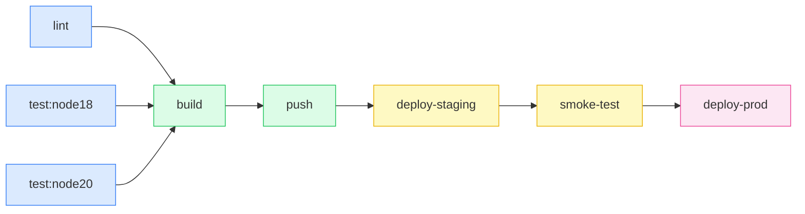

# Ch02. Pipeline as Code와 실행 모델

**핵심 질문**: "파이프라인을 코드로 정의하면 왜 수동 설정보다 나은가?"

---

## 🎯 학습 목표

1. Pipeline as Code의 핵심 원칙과 수동 설정 대비 이점을 설명할 수 있다
2. Declarative, Scripted, Hybrid 실행 모델의 트레이드오프를 판단할 수 있다
3. GitHub Actions로 멀티잡 CI/CD 파이프라인을 작성할 수 있다
4. GitLab CI로 동등한 파이프라인을 stages/rules 기반으로 구성할 수 있다
5. Argo CD ApplicationSet으로 멀티 클러스터 배포를 선언적으로 관리할 수 있다
6. DAG 실행 모델이 순차 실행보다 빠른 이유를 의존성 그래프로 설명할 수 있다

---

## 1. Pipeline as Code의 원칙

### 왜 수동 설정이 문제인가

Jenkins 초기 시대에는 파이프라인을 UI 클릭으로 구성했다. 빌드 단계를 GUI에서 하나씩 추가하고, 환경변수를 텍스트 박스에 입력하며, 빌드 순서를 드래그로 조정했다. 이 방식의 문제는 단순하다. **설정이 서버 내부에 저장되어 버전 관리가 불가능하다.** 파이프라인이 어떻게 변경되었는지 추적할 수 없고, 실수로 설정을 덮어써도 되돌릴 방법이 없다.

더 심각한 것은 **재현 불가능성**이다. Jenkins 서버가 죽으면 파이프라인 설정도 사라진다. 새 팀원이 "파이프라인이 어떻게 동작해요?"라고 물으면 "서버 들어가서 보세요"라고 답할 수밖에 없다. 파이프라인 설정을 이해하려면 시스템 접근 권한이 필요하고, 변경 이력은 누군가의 기억에만 존재한다.

```yaml
# BAD: UI로 파이프라인 설정 (재현 불가, 버전 관리 불가)
# Jenkins Web UI에서 마우스 클릭으로:
# 1. "새 Item" → "Freestyle project"
# 2. "Build" 탭 → "Execute shell" 추가
# 3. 스크립트 직접 입력
# 4. "Post-build Actions" → 체크박스 클릭
# → 이 설정은 Jenkins DB에만 존재. Git에 없음.

# GOOD: Pipeline as Code (버전 관리, 코드 리뷰, 재현 가능)
# 파일: .github/workflows/ci.yml (또는 Jenkinsfile)
# Git에 체크인 → PR로 리뷰 → 히스토리 추적 → 어느 환경에서도 재현
```

### Pipeline as Code의 세 가지 원칙

**첫째, 버전 관리(Version Control).** 파이프라인 정의 파일을 애플리케이션 코드와 같은 저장소에 보관한다. 코드가 변경될 때 파이프라인도 함께 변경되고, 두 변경이 동일한 커밋에 묶인다. "v2.3.0 릴리스 당시 파이프라인이 어떠했는가?"라는 질문에 `git checkout v2.3.0`으로 즉시 답할 수 있다.

**둘째, 코드 리뷰(Code Review).** 파이프라인 변경도 Pull Request를 거친다. 새 배포 단계를 추가하거나 환경변수를 변경할 때 팀원의 검토가 필수다. "이 시크릿 노출 위험 없어요?"나 "프로덕션 배포에 수동 승인 추가해야 하지 않나요?" 같은 피드백이 PR 리뷰에서 이루어진다.

**셋째, 테스트 가능성(Testability).** 파이프라인 코드도 테스트할 수 있다. GitLab CI는 `gitlab-ci-local`로 로컬 실행을, GitHub Actions는 `act`로 로컬 검증을 지원한다. 프로덕션 환경에 적용하기 전에 파이프라인 로직이 올바른지 확인할 수 있다는 뜻이다.

---

## 2. 실행 모델 비교: Declarative vs Scripted vs Hybrid

### Declarative 모델

선언형 모델은 **"무엇을(What)"** 에 집중한다. 사용자는 원하는 결과를 선언하고, 실행 방법은 도구가 결정한다. GitHub Actions의 YAML과 GitLab CI의 `.gitlab-ci.yml`이 대표적이다.

장점은 진입 장벽이 낮고, 검증과 자동 완성이 쉽다는 점이다. 단점은 복잡한 조건 분기나 동적 파이프라인 생성이 어렵다. GitHub Actions의 `if` 조건이나 GitLab CI의 `rules`로 기본적인 분기는 처리하지만, 고도로 동적인 워크플로는 한계에 부딪힌다.

### Scripted 모델

스크립트형 모델은 **"어떻게(How)"** 에 집중한다. Jenkins의 Scripted Pipeline(Groovy 코드)이 대표 사례다. Groovy의 모든 기능을 사용할 수 있어 복잡한 조건, 반복, 동적 스테이지 생성이 가능하다.

장점은 표현력이 높다는 점이다. 동적으로 스테이지를 생성하거나, 외부 시스템에서 설정을 읽어 파이프라인을 구성할 수 있다. 단점은 잘못 작성하면 안전하지 않은 코드가 될 수 있고, 러닝 커브가 가파르다. Jenkins Ch03에서 Scripted Pipeline을 상세히 다룬다.

### Hybrid 모델

Jenkins Declarative Pipeline은 구조화된 선언형 문법을 기반으로 하되, `script {}` 블록으로 Groovy를 혼용할 수 있다. 일반적인 경우는 선언형으로 처리하고, 예외적인 복잡성만 스크립트 블록으로 처리한다. Jenkins Ch04에서 Declarative Pipeline 패턴을 상세히 다룬다.

| 모델 | 대표 도구 | 장점 | 단점 |
|------|----------|------|------|
| Declarative | GitHub Actions, GitLab CI | 간결, 검증 용이 | 동적 파이프라인 제한 |
| Scripted | Jenkins Groovy | 표현력 높음 | 안전성, 러닝 커브 |
| Hybrid | Jenkins Declarative+script | 균형 | 복잡성 관리 필요 |

---

## 3. GitHub Actions 전체 워크플로

GitHub Actions는 이벤트 기반 워크플로 시스템이다. `.github/workflows/` 디렉토리에 YAML 파일을 배치하면 GitHub이 자동으로 인식한다. 각 워크플로는 하나 이상의 job으로 구성되고, job은 기본적으로 병렬 실행되며 `needs` 키워드로 의존성을 선언해 순서를 제어한다.

아래는 실무에서 자주 사용하는 멀티잡 CI/CD 파이프라인이다. lint → test(matrix) → build → push → deploy-staging → smoke-test → deploy-prod 순서로 진행하며, 각 단계의 설계 이유를 주석으로 설명한다.

```yaml
# .github/workflows/ci-cd.yml
# 목적: PR 시 CI 전체 실행, main 병합 시 프로덕션까지 자동 배포

name: CI/CD Pipeline

on:
  pull_request:
    branches: [main]
  push:
    branches: [main]

# 동시에 같은 브랜치로 워크플로가 여러 개 실행되면 이전 것을 취소
# PR 빠른 재푸시 시 낭비되는 러너를 방지하기 위한 설정
concurrency:
  group: ${{ github.workflow }}-${{ github.ref }}
  cancel-in-progress: true

env:
  REGISTRY: ghcr.io
  IMAGE_NAME: ${{ github.repository }}

jobs:
  # ─── 1단계: Lint ──────────────────────────────────────────
  lint:
    name: Lint & Static Analysis
    runs-on: ubuntu-latest
    steps:
      - uses: actions/checkout@v4

      # Node 버전 고정: 팀원 로컬과 CI 환경 동기화
      - uses: actions/setup-node@v4
        with:
          node-version: '20'
          cache: 'npm'  # package-lock.json 해시 기반 캐시

      - run: npm ci
      - run: npm run lint
      - run: npm run type-check

  # ─── 2단계: Test (Matrix) ─────────────────────────────────
  test:
    name: Test (Node ${{ matrix.node-version }}, ${{ matrix.os }})
    runs-on: ${{ matrix.os }}
    # lint가 실패하면 테스트도 불필요 — 빠른 피드백을 위한 의존성
    needs: lint
    strategy:
      fail-fast: false  # 하나 실패해도 다른 matrix는 계속 (결과 전체 수집)
      matrix:
        node-version: ['18', '20']
        os: [ubuntu-latest, windows-latest]
    steps:
      - uses: actions/checkout@v4
      - uses: actions/setup-node@v4
        with:
          node-version: ${{ matrix.node-version }}
          cache: 'npm'

      - run: npm ci
      - run: npm test -- --coverage

      # 테스트 결과를 GitHub UI에서 직접 확인할 수 있게 리포트 업로드
      - uses: actions/upload-artifact@v4
        if: always()  # 테스트 실패 시에도 리포트는 업로드
        with:
          name: test-results-${{ matrix.node-version }}-${{ matrix.os }}
          path: coverage/

  # ─── 3단계: Build ─────────────────────────────────────────
  build:
    name: Build Docker Image
    runs-on: ubuntu-latest
    needs: test
    outputs:
      # 이후 job에서 이미지 태그를 재사용하기 위한 output 선언
      image-tag: ${{ steps.meta.outputs.tags }}
      image-digest: ${{ steps.build.outputs.digest }}
    steps:
      - uses: actions/checkout@v4

      # QEMU: 멀티 아키텍처 빌드를 위한 에뮬레이터
      - uses: docker/setup-qemu-action@v3
      - uses: docker/setup-buildx-action@v3

      # OIDC 기반 인증: 시크릿 없이 GitHub → GHCR 인증
      # Actions ID 토큰으로 단기 자격증명 발급 → 장기 시크릿 불필요
      - uses: docker/login-action@v3
        with:
          registry: ${{ env.REGISTRY }}
          username: ${{ github.actor }}
          password: ${{ secrets.GITHUB_TOKEN }}

      # 이미지 태그와 레이블 자동 생성 (semver, sha 등)
      - id: meta
        uses: docker/metadata-action@v5
        with:
          images: ${{ env.REGISTRY }}/${{ env.IMAGE_NAME }}
          tags: |
            type=sha,prefix=sha-
            type=semver,pattern={{version}}

      - id: build
        uses: docker/build-push-action@v5
        with:
          context: .
          platforms: linux/amd64,linux/arm64
          push: false  # PR 시에는 push 안 함, main 병합 후에만
          tags: ${{ steps.meta.outputs.tags }}
          labels: ${{ steps.meta.outputs.labels }}
          # Buildx 레이어 캐시: 동일 레이어 재빌드 방지
          cache-from: type=gha
          cache-to: type=gha,mode=max

  # ─── 4단계: Push (main 브랜치만) ──────────────────────────
  push:
    name: Push Docker Image
    runs-on: ubuntu-latest
    needs: build
    # main에 병합될 때만 레지스트리에 푸시
    if: github.ref == 'refs/heads/main' && github.event_name == 'push'
    steps:
      - uses: actions/checkout@v4
      - uses: docker/setup-buildx-action@v3
      - uses: docker/login-action@v3
        with:
          registry: ${{ env.REGISTRY }}
          username: ${{ github.actor }}
          password: ${{ secrets.GITHUB_TOKEN }}

      - uses: docker/build-push-action@v5
        with:
          context: .
          push: true  # 이번에는 실제 push
          tags: ${{ needs.build.outputs.image-tag }}
          cache-from: type=gha

  # ─── 5단계: Deploy Staging ────────────────────────────────
  deploy-staging:
    name: Deploy to Staging
    runs-on: ubuntu-latest
    needs: push
    environment:
      name: staging
      url: https://staging.example.com
    steps:
      - uses: actions/checkout@v4

      # OIDC로 AWS/GCP/Azure 인증: 장기 클라우드 시크릿 불필요
      - uses: aws-actions/configure-aws-credentials@v4
        with:
          role-to-assume: arn:aws:iam::123456789:role/github-actions-staging
          aws-region: ap-northeast-2

      - name: Deploy to ECS Staging
        run: |
          aws ecs update-service \
            --cluster staging \
            --service my-app \
            --force-new-deployment

  # ─── 6단계: Smoke Test ────────────────────────────────────
  smoke-test:
    name: Smoke Test (Staging)
    runs-on: ubuntu-latest
    needs: deploy-staging
    steps:
      - uses: actions/checkout@v4
      - name: Wait for deployment
        run: sleep 30
      - name: Run smoke tests
        run: |
          npm run test:smoke -- --base-url=https://staging.example.com

  # ─── 7단계: Deploy Prod (수동 승인) ──────────────────────
  deploy-prod:
    name: Deploy to Production
    runs-on: ubuntu-latest
    needs: smoke-test
    # GitHub Environments의 required reviewers 설정으로 수동 승인 구현
    environment:
      name: production
      url: https://example.com
    steps:
      - uses: actions/checkout@v4
      - uses: aws-actions/configure-aws-credentials@v4
        with:
          role-to-assume: arn:aws:iam::123456789:role/github-actions-prod
          aws-region: ap-northeast-2

      - name: Deploy to ECS Production
        run: |
          aws ecs update-service \
            --cluster production \
            --service my-app \
            --force-new-deployment
```

---

## 4. GitLab CI 전체 파이프라인

GitLab CI는 stages 기반으로 실행 순서를 제어한다. 같은 stage 안의 job은 병렬 실행되고, 이전 stage가 모두 완료되어야 다음 stage로 넘어간다. GitHub Actions의 `needs`와 달리 stage 선언만으로 순서가 결정되는 것이 특징이다.

```yaml
# .gitlab-ci.yml
# 목적: GitHub Actions 워크플로와 동등한 CI/CD 파이프라인

stages:
  - lint
  - test
  - build
  - push
  - deploy-staging
  - smoke-test
  - deploy-prod

# 전역 캐시 설정: 모든 job이 공유하는 node_modules 캐시
cache:
  key:
    files:
      - package-lock.json  # lock 파일 변경 시 캐시 무효화
  paths:
    - node_modules/

variables:
  REGISTRY: registry.gitlab.com
  IMAGE_NAME: $CI_REGISTRY_IMAGE

# ─── Lint ─────────────────────────────────────────────────
lint:
  stage: lint
  image: node:20-alpine
  script:
    - npm ci
    - npm run lint
    - npm run type-check
  # MR과 main 브랜치에서만 실행
  rules:
    - if: $CI_PIPELINE_SOURCE == 'merge_request_event'
    - if: $CI_COMMIT_BRANCH == $CI_DEFAULT_BRANCH

# ─── Test (Parallel) ──────────────────────────────────────
test:node18:
  stage: test
  image: node:18-alpine
  script:
    - npm ci
    - npm test -- --coverage
  coverage: '/Lines\s*:\s*(\d+\.?\d*)%/'  # 커버리지 파싱 정규식
  artifacts:
    # 테스트 결과를 GitLab Test Reports로 통합
    reports:
      junit: junit.xml
      coverage_report:
        coverage_format: cobertura
        path: coverage/cobertura-coverage.xml
    when: always  # 실패 시에도 아티팩트 보존
    expire_in: 1 week
  rules:
    - if: $CI_PIPELINE_SOURCE == 'merge_request_event'
    - if: $CI_COMMIT_BRANCH == $CI_DEFAULT_BRANCH

test:node20:
  extends: test:node18  # 공통 설정 상속으로 중복 제거
  image: node:20-alpine

# ─── Build Docker Image ───────────────────────────────────
build:
  stage: build
  image: docker:24
  services:
    - docker:24-dind  # Docker-in-Docker: CI 환경에서 Docker 빌드
  variables:
    DOCKER_TLS_CERTDIR: '/certs'
  before_script:
    - docker login -u $CI_REGISTRY_USER -p $CI_REGISTRY_PASSWORD $CI_REGISTRY
  script:
    - |
      docker buildx build \
        --cache-from type=registry,ref=$IMAGE_NAME:cache \
        --cache-to type=registry,ref=$IMAGE_NAME:cache,mode=max \
        --tag $IMAGE_NAME:$CI_COMMIT_SHA \
        --tag $IMAGE_NAME:latest \
        .
  rules:
    - if: $CI_COMMIT_BRANCH == $CI_DEFAULT_BRANCH

# ─── Push (main만) ────────────────────────────────────────
push:
  stage: push
  image: docker:24
  services:
    - docker:24-dind
  before_script:
    - docker login -u $CI_REGISTRY_USER -p $CI_REGISTRY_PASSWORD $CI_REGISTRY
  script:
    - docker push $IMAGE_NAME:$CI_COMMIT_SHA
    - docker push $IMAGE_NAME:latest
  rules:
    - if: $CI_COMMIT_BRANCH == $CI_DEFAULT_BRANCH

# ─── Deploy Staging ───────────────────────────────────────
deploy-staging:
  stage: deploy-staging
  image: bitnami/kubectl:latest
  environment:
    name: staging
    url: https://staging.example.com
    # GitLab Environments: 배포 이력과 롤백 UI 자동 제공
  script:
    - kubectl config use-context staging-cluster
    - kubectl set image deployment/my-app app=$IMAGE_NAME:$CI_COMMIT_SHA -n staging
    - kubectl rollout status deployment/my-app -n staging --timeout=5m
  rules:
    - if: $CI_COMMIT_BRANCH == $CI_DEFAULT_BRANCH

# ─── Smoke Test ───────────────────────────────────────────
smoke-test:
  stage: smoke-test
  image: node:20-alpine
  script:
    - npm ci
    - npm run test:smoke -- --base-url=https://staging.example.com
  rules:
    - if: $CI_COMMIT_BRANCH == $CI_DEFAULT_BRANCH

# ─── Deploy Production (수동 승인) ────────────────────────
deploy-prod:
  stage: deploy-prod
  image: bitnami/kubectl:latest
  environment:
    name: production
    url: https://example.com
  # when: manual → GitLab UI에서 "▶ 실행" 버튼 클릭으로 수동 트리거
  # allow_failure: false → 수동 승인 없이 파이프라인 완료 불가
  when: manual
  allow_failure: false
  script:
    - kubectl config use-context prod-cluster
    - kubectl set image deployment/my-app app=$IMAGE_NAME:$CI_COMMIT_SHA -n production
    - kubectl rollout status deployment/my-app -n production --timeout=10m
  rules:
    - if: $CI_COMMIT_BRANCH == $CI_DEFAULT_BRANCH
```

---

## 5. Argo CD ApplicationSet으로 멀티 클러스터 배포

Argo CD는 GitOps 방식의 CD 도구다. Git 저장소를 "진실의 원천(Source of Truth)"으로 삼아, 저장소 상태와 클러스터 상태를 지속적으로 동기화한다. ApplicationSet은 하나의 템플릿으로 여러 환경(개발/스테이징/프로덕션)에 동시에 Application을 생성하는 패턴이다.

```yaml
# argocd/applicationset.yaml
# 목적: dev/staging/prod 세 환경에 동일한 앱을 배포하되, 환경별 설정 분리

apiVersion: argoproj.io/v1alpha1
kind: ApplicationSet
metadata:
  name: my-app
  namespace: argocd
spec:
  # Generator: ApplicationSet이 Application을 어떻게 생성할지 정의
  # List Generator: 정적으로 환경 목록을 나열 (단순하고 명시적)
  generators:
    - list:
        elements:
          - env: dev
            cluster: dev-cluster
            namespace: my-app-dev
            replicaCount: '1'
            autoSync: 'true'
          - env: staging
            cluster: staging-cluster
            namespace: my-app-staging
            replicaCount: '2'
            autoSync: 'true'
          - env: prod
            cluster: prod-cluster
            namespace: my-app-prod
            replicaCount: '5'
            autoSync: 'false'  # 프로덕션은 자동 동기화 비활성화 (수동 승인)

  template:
    metadata:
      # {{env}}는 generator의 elements 값으로 치환됨
      name: my-app-{{env}}
      labels:
        app.kubernetes.io/name: my-app
        environment: '{{env}}'
    spec:
      project: default
      source:
        repoURL: https://github.com/org/my-app
        targetRevision: HEAD
        path: k8s/overlays/{{env}}  # 환경별 Kustomize 오버레이

      destination:
        server: https://{{cluster}}.example.com
        namespace: '{{namespace}}'

      syncPolicy:
        automated:
          prune: true     # Git에서 삭제된 리소스를 클러스터에서도 삭제
          selfHeal: true  # 클러스터 상태가 Git과 다르면 자동 복구
        syncOptions:
          - CreateNamespace=true
```

---

## 6. 도구 비교: GitHub Actions vs GitLab CI vs Jenkins

세 도구는 모두 Pipeline as Code를 지원하지만 설계 철학이 다르다. GitHub Actions는 GitHub 생태계 통합에 최적화되어 있고, GitLab CI는 DevSecOps 올인원 플랫폼의 일부이며, Jenkins는 플러그인 기반의 최고 유연성을 제공한다.

| 항목 | GitHub Actions | GitLab CI | Jenkins |
|------|---------------|-----------|---------|
| 문법 | YAML (jobs/steps) | YAML (stages/jobs) | Groovy DSL |
| 실행 환경 | GitHub-hosted/self-hosted runners | GitLab Runners (shared/specific) | Agents (controller-agent) |
| 병렬 실행 | `needs` 의존성 그래프 | stages 내 자동 병렬 | `parallel {}` 블록 |
| 비밀 관리 | GitHub Secrets + OIDC | GitLab CI/CD Variables + Vault | Credentials Plugin |
| 확장성 | Marketplace Actions | include + templates | 2000+ 플러그인 |
| 멀티 클러스터 | 별도 Argo CD 필요 | GitLab Environments | 플러그인 조합 |
| 학습 곡선 | 낮음 | 낮음 | 높음 |
| 비용 | 공용 저장소 무료 | Self-managed 무료 | 인프라 자체 관리 |

---

## 7. DAG 실행 모델

파이프라인을 DAG(Directed Acyclic Graph, 방향성 비순환 그래프)로 모델링하면 병렬 실행 가능한 job을 자동으로 식별할 수 있다. 순차 실행에서는 모든 단계가 직렬로 연결되어 전체 실행 시간이 각 단계의 합이 된다. DAG 모델에서는 의존성 없는 job이 동시에 실행되어 전체 시간이 크리티컬 패스(critical path)의 합으로 줄어든다.



위 그래프에서 `lint`, `test:node18`, `test:node20`은 서로 의존성이 없어 병렬 실행된다. 세 job이 각각 3분씩 걸려도 병렬 실행 시 전체 소요는 3분이다. 순차 실행이었다면 9분이 걸렸을 것이다. `build`는 세 job 모두 완료된 후 시작하는 합류 지점(join point)이다.

이 구조에서 크리티컬 패스는 `lint(3분) → build(5분) → push(2분) → deploy-staging(3분) → smoke-test(5분) → deploy-prod(3분) = 21분`이다. test job이 아무리 많이 추가되어도, lint보다 짧게 걸린다면 크리티컬 패스에 영향을 주지 않는다.

---

## 8. Jenkins 교차참조

Jenkins의 Pipeline as Code 구현은 별도 챕터에서 상세히 다룬다.

- **Jenkins Ch03**: Declarative Pipeline 문법, stages/steps/post 구조, 환경변수 관리
- **Jenkins Ch04**: Scripted Pipeline vs Declarative 선택 기준, `script {}` 블록 활용, 공유 라이브러리(Shared Libraries)

Jenkins를 사용하는 환경에서는 Jenkinsfile을 저장소 루트에 배치하고, Jenkins Multibranch Pipeline 또는 GitHub Organization 스캔으로 자동 발견하는 패턴이 표준이다. Pipeline as Code의 원칙은 동일하지만, Groovy DSL의 표현력 덕분에 더 복잡한 조건 처리가 가능하다.

---

## 핵심 요약

Pipeline as Code는 단순히 파일 형식의 변경이 아니다. 파이프라인을 **소프트웨어 산출물**로 취급하는 관점의 전환이다. 버전 관리, 코드 리뷰, 테스트라는 소프트웨어 개발의 좋은 실천이 파이프라인 정의에도 그대로 적용된다.

GitHub Actions는 event-driven 트리거와 Marketplace 생태계가 강점이고, GitLab CI는 stages 선언으로 병렬성을 자연스럽게 표현하며, Argo CD는 GitOps 원칙으로 클러스터 상태를 선언적으로 관리한다. 세 도구를 조합하면 코드 변경부터 프로덕션 배포까지 전 과정을 코드로 표현하고 추적할 수 있다.

---

## 체크포인트

- [ ] GitHub Actions `needs` 키워드로 job 의존성을 정의할 수 있다
- [ ] GitLab CI stages와 rules의 차이를 설명할 수 있다
- [ ] OIDC 기반 클라우드 인증이 장기 시크릿보다 안전한 이유를 설명할 수 있다
- [ ] DAG에서 크리티컬 패스를 식별하고 병렬화 기회를 찾을 수 있다
- [ ] Argo CD ApplicationSet의 List Generator로 멀티 환경 배포를 구성할 수 있다

**다음**: Ch03 - 테스트 자동화 패턴 (Test Pyramid, Contract Testing, Test Doubles)
