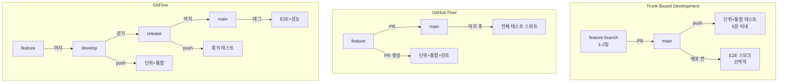

# Ch03. 테스트 자동화 패턴과 브랜칭

**핵심 질문**: "CI/CD에서 테스트 자동화를 어떤 패턴으로 설계하는가?"

---

## 🎯 학습 목표

1. 테스트 자동화가 CI/CD 파이프라인의 어느 단계에 위치해야 하는지 이해한다
2. Data-Driven Testing 패턴으로 테스트 데이터를 코드에서 분리하는 방법을 익힌다
3. Page Object Model로 UI 테스트의 유지보수성을 높이는 구조를 설계할 수 있다
4. Trunk-Based Development, GitHub Flow, GitFlow 등 5가지 브랜칭 전략의 특성과 트레이드오프를 비교한다
5. 브랜칭 전략에 따라 어떤 브랜치에서 어떤 테스트를 실행해야 하는지 매핑할 수 있다
6. Shift-Left Testing 원칙을 이해하고 파이프라인에 적용할 수 있다

---

## 1. 테스트 자동화의 CI/CD 내 위치

테스트는 "언제 실행하느냐"에 따라 비용과 피드백 속도가 크게 달라진다. 코드 커밋 직후에 실행하는 단위 테스트와, 프로덕션 배포 직전에 실행하는 E2E 테스트는 같은 "테스트"지만 목적과 실행 시점이 전혀 다르다.

```
파이프라인 단계별 테스트 위치:

코드 커밋
  │
  ▼
[Commit Stage]       ← 단위 테스트, 정적 분석, 코드 린트
  │                     목표: 5분 이내 빠른 피드백
  ▼
[Build Stage]        ← 컴파일, 빌드 검증
  │
  ▼
[Integration Stage]  ← 통합 테스트, 컨트랙트 테스트
  │                     목표: 서비스 간 인터페이스 검증
  ▼
[Acceptance Stage]   ← E2E 테스트, 성능 테스트
  │                     목표: 비즈니스 요구사항 검증
  ▼
[Production]         ← 스모크 테스트, 카나리 검증
```

각 단계에서 실패하면 이후 단계로 진행하지 않는다. 이 "빠른 실패(Fail Fast)" 원칙이 중요한 이유는, 늦게 발견된 버그일수록 수정 비용이 기하급수적으로 증가하기 때문이다. 단위 테스트에서 잡을 수 있는 버그를 E2E 테스트에서 발견하면 디버깅 시간이 10배 이상 늘어난다.

**테스트 피라미드**: 단위 테스트가 가장 많고(70%), 통합 테스트가 중간(20%), E2E 테스트가 가장 적어야(10%) 한다. 피라미드를 역삼각형으로 구성하면 — E2E 테스트 위주 — 실행 시간이 수 시간에 달하고, 환경 의존성으로 flaky test가 급증한다.

---

## 2. Data-Driven Testing

같은 로직을 다양한 입력값으로 검증할 때 테스트 코드를 반복 작성하는 방식은 유지보수 악몽이다. Data-Driven Testing은 테스트 로직과 테스트 데이터를 분리해서 로직 변경 없이 케이스를 추가할 수 있게 한다.

### 2.1 pytest parametrize 기본

```python
# tests/test_pricing.py
import pytest
import json
from pathlib import Path
from app.pricing import calculate_discount

# WHY: 테스트 데이터를 JSON으로 외부화하면 QA가 코드 없이 케이스를 추가할 수 있다
def load_test_cases(filename: str) -> list[dict]:
    fixtures_dir = Path(__file__).parent / "fixtures"
    with open(fixtures_dir / filename) as f:
        return json.load(f)


# WHY: @pytest.mark.parametrize는 하나의 테스트 함수로 N개의 독립 테스트를 생성한다
# 각 케이스는 별도로 통과/실패하므로 실패 원인을 케이스 단위로 특정할 수 있다
@pytest.mark.parametrize("case", load_test_cases("discount_cases.json"))
def test_calculate_discount(case):
    """
    케이스 구조:
    {
        "id": "premium_user_over_100",
        "description": "프리미엄 사용자가 100달러 이상 구매 시 20% 할인",
        "input": {"user_tier": "premium", "amount": 150.0},
        "expected": 120.0
    }
    """
    result = calculate_discount(
        user_tier=case["input"]["user_tier"],
        amount=case["input"]["amount"]
    )
    assert result == pytest.approx(case["expected"], rel=1e-2), (
        f"[{case['id']}] {case['description']}: "
        f"expected {case['expected']}, got {result}"
    )
```

```json
// tests/fixtures/discount_cases.json
// WHY: 테스트 데이터를 JSON으로 관리하면 Git diff에서 케이스 변경이 명확히 보인다
[
  {
    "id": "standard_under_50",
    "description": "일반 사용자 50달러 미만 - 할인 없음",
    "input": {"user_tier": "standard", "amount": 30.0},
    "expected": 30.0
  },
  {
    "id": "standard_over_50",
    "description": "일반 사용자 50달러 이상 - 5% 할인",
    "input": {"user_tier": "standard", "amount": 60.0},
    "expected": 57.0
  },
  {
    "id": "premium_under_100",
    "description": "프리미엄 사용자 100달러 미만 - 10% 할인",
    "input": {"user_tier": "premium", "amount": 80.0},
    "expected": 72.0
  },
  {
    "id": "premium_over_100",
    "description": "프리미엄 사용자 100달러 이상 - 20% 할인",
    "input": {"user_tier": "premium", "amount": 150.0},
    "expected": 120.0
  },
  {
    "id": "vip_any_amount",
    "description": "VIP 사용자는 금액 무관 30% 할인",
    "input": {"user_tier": "vip", "amount": 50.0},
    "expected": 35.0
  },
  {
    "id": "zero_amount_edge",
    "description": "0원 구매는 할인 계산에서 제외",
    "input": {"user_tier": "premium", "amount": 0.0},
    "expected": 0.0
  }
]
```

### 2.2 CSV fixture를 활용한 경계값 테스트

```python
# tests/test_age_validation.py
import pytest
import csv
from io import StringIO

# WHY: CSV는 스프레드시트로 관리 가능하므로 비개발자도 테스트 케이스를 작성할 수 있다
AGE_TEST_CASES = """age,expected_group,should_raise
-1,,True
0,child,False
5,child,False
17,child,False
18,adult,False
64,adult,False
65,senior,False
130,senior,False
131,,True
"""

def parse_csv_cases(csv_str: str) -> list[dict]:
    reader = csv.DictReader(StringIO(csv_str.strip()))
    return list(reader)

@pytest.mark.parametrize("row", parse_csv_cases(AGE_TEST_CASES))
def test_age_group_classification(row, age_classifier):
    age = int(row["age"])
    should_raise = row["should_raise"] == "True"

    if should_raise:
        with pytest.raises(ValueError):
            age_classifier.classify(age)
    else:
        result = age_classifier.classify(age)
        assert result == row["expected_group"]
```

---

## 3. Page Object Model (POM)

UI 테스트는 DOM 구조에 강하게 결합되기 쉽다. 버튼 하나의 CSS 선택자가 바뀌면 그 버튼을 사용하는 테스트 수십 개가 한꺼번에 깨진다. Page Object Model은 UI 요소와 상호작용 로직을 별도 클래스로 캡슐화해서 이 문제를 해결한다.

### 3.1 BasePage 추상 클래스

```python
# tests/pages/base_page.py
from selenium.webdriver.remote.webdriver import WebDriver
from selenium.webdriver.support.ui import WebDriverWait
from selenium.webdriver.support import expected_conditions as EC
from selenium.webdriver.common.by import By

class BasePage:
    """
    모든 페이지 객체의 공통 인터페이스.
    WHY: 공통 대기 로직을 여기에 모아두면 각 페이지 객체에서 중복을 제거할 수 있다.
    """
    # WHY: 10초는 경험적으로 네트워크 지연을 커버하면서도 테스트를 느리게 만들지 않는 값이다
    DEFAULT_TIMEOUT = 10

    def __init__(self, driver: WebDriver):
        self.driver = driver
        self.wait = WebDriverWait(driver, self.DEFAULT_TIMEOUT)

    def find(self, locator: tuple):
        """요소가 나타날 때까지 대기 후 반환."""
        return self.wait.until(EC.presence_of_element_located(locator))

    def click(self, locator: tuple):
        """클릭 가능할 때까지 대기 후 클릭."""
        element = self.wait.until(EC.element_to_be_clickable(locator))
        element.click()

    def type_text(self, locator: tuple, text: str):
        """입력 필드에 텍스트 입력. 기존 값을 먼저 지운다."""
        element = self.find(locator)
        element.clear()
        element.send_keys(text)

    def get_text(self, locator: tuple) -> str:
        return self.find(locator).text

    @property
    def current_url(self) -> str:
        return self.driver.current_url
```

### 3.2 LoginPage 구현

```python
# tests/pages/login_page.py
from selenium.webdriver.common.by import By
from .base_page import BasePage

class LoginPage(BasePage):
    """
    로그인 페이지의 모든 UI 상호작용을 캡슐화.
    WHY: 선택자(locator)를 여기에만 정의하면 DOM 변경 시 한 곳만 수정하면 된다.
    """
    URL = "/login"

    # WHY: 클래스 변수로 locator를 모아두면 유지보수가 쉽고 IDE 자동완성이 동작한다
    EMAIL_INPUT    = (By.ID, "email")
    PASSWORD_INPUT = (By.ID, "password")
    SUBMIT_BUTTON  = (By.CSS_SELECTOR, "button[type='submit']")
    ERROR_MESSAGE  = (By.CLASS_NAME, "error-message")
    REMEMBER_ME    = (By.ID, "remember-me")

    def open(self):
        self.driver.get(f"{self.driver.base_url}{self.URL}")
        return self

    def login(self, email: str, password: str, remember: bool = False):
        self.type_text(self.EMAIL_INPUT, email)
        self.type_text(self.PASSWORD_INPUT, password)
        if remember:
            self.click(self.REMEMBER_ME)
        self.click(self.SUBMIT_BUTTON)
        return self

    def get_error_message(self) -> str:
        return self.get_text(self.ERROR_MESSAGE)

    def is_logged_in(self) -> bool:
        # WHY: 로그인 성공 여부는 URL 변경으로 판단한다 (요소 존재 여부보다 신뢰성이 높다)
        return "/dashboard" in self.current_url
```

### 3.3 POM을 활용한 테스트 코드

```python
# tests/test_login.py
import pytest
from pages.login_page import LoginPage
from pages.dashboard_page import DashboardPage

# WHY: 테스트 코드에는 선택자가 전혀 없다 — "무엇을 하는가"만 기술한다
class TestLogin:
    def test_successful_login(self, driver, valid_user):
        login_page = LoginPage(driver).open()
        login_page.login(valid_user.email, valid_user.password)

        assert login_page.is_logged_in(), "로그인 후 대시보드로 이동해야 한다"

    def test_invalid_password_shows_error(self, driver, valid_user):
        login_page = LoginPage(driver).open()
        login_page.login(valid_user.email, "wrong-password")

        error = login_page.get_error_message()
        assert "이메일 또는 비밀번호가 올바르지 않습니다" in error

    @pytest.mark.parametrize("email", ["notanemail", "", "a@", "@b.com"])
    def test_invalid_email_format(self, driver, email):
        login_page = LoginPage(driver).open()
        login_page.login(email, "anypassword")

        # 이메일 형식 오류는 서버 요청 전에 클라이언트에서 잡아야 한다
        assert login_page.get_error_message() != ""
```

---

## 4. 브랜칭 전략 5가지

브랜칭 전략은 "어떻게 코드를 통합하는가"를 결정한다. 전략마다 릴리즈 주기, 팀 규모, 배포 복잡도에 따른 적합성이 다르다.

### 4.1 Trunk-Based Development

```bash
# 트렁크 기반 개발 — 모든 개발자가 main에 직접 또는 수명이 짧은 feature 브랜치를 통해 통합
# WHY: 장기 브랜치가 없으므로 merge conflict와 통합 지옥이 발생하지 않는다

# feature 브랜치는 1-2일 이내 수명
git checkout -b feature/add-payment-button
# ... 작업 ...
git push origin feature/add-payment-button
# PR 생성 → 리뷰 → main 머지 (1-2일 내)

# main에 직접 커밋하는 경우 (소규모 팀)
git checkout main
git pull origin main
git add .
git commit -m "feat: add payment button"
git push origin main
```

핵심은 **feature flag**다. 완성되지 않은 기능도 main에 머지하되, 플래그로 비활성화한다. 이렇게 해야 통합이 지속적으로 일어나고 "big bang merge"를 피할 수 있다.

### 4.2 GitHub Flow

```bash
# GitHub Flow — feature 브랜치 → PR → main
# WHY: 단순하고 이해하기 쉬워 소규모 팀과 지속 배포 환경에 적합하다

git checkout -b feature/user-profile-page
# ... 여러 커밋 ...
git push -u origin feature/user-profile-page
# GitHub에서 PR 생성 → CI 통과 → 리뷰 승인 → main 머지 → 자동 배포
git checkout main
git pull origin main
git branch -d feature/user-profile-page
```

### 4.3 GitFlow

```bash
# GitFlow — develop, release, hotfix 브랜치를 체계적으로 관리
# WHY: 정해진 릴리즈 주기가 있고 여러 버전을 동시에 지원해야 할 때 적합하다

# 기능 개발
git checkout -b feature/payment-gateway develop
# ... 작업 ...
git checkout develop
git merge --no-ff feature/payment-gateway
git branch -d feature/payment-gateway

# 릴리즈 준비
git checkout -b release/1.2.0 develop
# 버그 수정, 버전 번호 업데이트만 허용
git checkout main
git merge --no-ff release/1.2.0
git tag -a v1.2.0

# 핫픽스
git checkout -b hotfix/1.2.1 main
# ... 수정 ...
git checkout main
git merge --no-ff hotfix/1.2.1
git checkout develop
git merge --no-ff hotfix/1.2.1
```

### 4.4 GitLab Flow

```bash
# GitLab Flow — 환경 브랜치(staging, production)로 배포 상태를 추적
# WHY: "main에 머지했는데 프로덕션에는 언제 반영되나?"라는 질문에 브랜치 구조로 답한다

git checkout -b feature/new-dashboard
# ... 작업 ...
git checkout main
git merge feature/new-dashboard   # CI 통과 → staging 자동 배포

# staging 검증 완료 후
git checkout staging
git merge main                     # staging 브랜치 = staging 환경과 동기화

# 프로덕션 배포 결정 후
git checkout production
git merge staging                  # production 브랜치 = 프로덕션 환경과 동기화
```

### 4.5 Release Flow (Microsoft 방식)

```bash
# Release Flow — main에서 release 브랜치를 분기, cherry-pick으로 핫픽스 적용
# WHY: 릴리즈 브랜치가 안정화 기간을 가지면서도 main 개발이 멈추지 않는다

# 릴리즈 브랜치 생성
git checkout -b release/2026-03 main

# main에서 계속 개발
git checkout main
git commit -m "feat: next sprint features"

# 릴리즈 브랜치에 버그픽스가 필요한 경우
git checkout main
git commit -m "fix: critical payment bug"
git checkout release/2026-03
git cherry-pick <commit-hash>      # main의 수정을 릴리즈 브랜치에만 선택 적용
```

---

## 5. 브랜칭 전략별 테스트 매핑



브랜치 유형별 테스트 실행 전략을 정리하면 다음과 같다.

| 브랜치 | 단위 테스트 | 통합 테스트 | E2E | 성능 |
|--------|------------|------------|-----|------|
| feature/PR | ✅ 항상 | ✅ 항상 | ❌ 생략 | ❌ 생략 |
| develop | ✅ | ✅ | ✅ 야간 | ❌ |
| release | ✅ | ✅ | ✅ 전체 | ✅ 선택 |
| main/master | ✅ | ✅ | ✅ 전체 | ✅ 전체 |
| hotfix | ✅ | ✅ 관련 모듈 | ✅ 스모크 | ❌ |

feature 브랜치에서 E2E를 실행하지 않는 이유는 실행 시간 때문이다. E2E 테스트 스위트가 30분이라면 개발자는 PR 하나 올릴 때마다 30분을 기다려야 한다. 이는 피드백 루프를 끊고 개발 흐름을 방해한다.

### GitHub Actions 브랜치별 테스트 매트릭스

```yaml
# .github/workflows/ci.yml
# WHY: 브랜치 패턴으로 테스트 범위를 제어하면 비용과 피드백 속도를 균형 있게 맞출 수 있다
name: CI

on:
  push:
    branches: ["**"]
  pull_request:
    branches: [main, develop]

jobs:
  unit-test:
    # WHY: 모든 브랜치에서 단위 테스트는 항상 실행 — 가장 빠르고 가장 가치 있다
    runs-on: ubuntu-latest
    steps:
      - uses: actions/checkout@v4
      - name: Run unit tests
        run: pytest tests/unit/ -v --tb=short

  integration-test:
    runs-on: ubuntu-latest
    steps:
      - uses: actions/checkout@v4
      - name: Run integration tests
        run: pytest tests/integration/ -v

  e2e-test:
    # WHY: E2E는 main과 release 브랜치에서만 실행 — 시간이 오래 걸리기 때문이다
    if: |
      github.ref == 'refs/heads/main' ||
      startsWith(github.ref, 'refs/heads/release/') ||
      github.ref == 'refs/heads/develop'
    runs-on: ubuntu-latest
    steps:
      - uses: actions/checkout@v4
      - name: Run E2E tests
        run: pytest tests/e2e/ -v --timeout=300

  performance-test:
    # WHY: 성능 테스트는 main 머지 시에만 — 결과를 베이스라인과 비교한다
    if: github.ref == 'refs/heads/main'
    runs-on: ubuntu-latest
    steps:
      - uses: actions/checkout@v4
      - name: Run performance tests
        run: k6 run tests/performance/load_test.js
```

### Bad vs Good: 테스트 전략 비교

```yaml
# ❌ Bad: 모든 브랜치에서 전체 테스트 실행
# 문제: feature 브랜치 하나에서도 E2E(30분) + 성능(20분) 실행
# 결과: 개발자들이 PR 올리기를 꺼리고, CI를 무시하거나 우회한다
on:
  push:
    branches: ["**"]
jobs:
  all-tests:
    steps:
      - run: pytest tests/unit/ tests/integration/ tests/e2e/
      - run: k6 run tests/performance/load_test.js
```

```yaml
# ✅ Good: 브랜치별 차등 테스트 — 빠른 피드백 + 충분한 커버리지
# feature/*  → 단위 + 통합 (5분)
# develop    → 단위 + 통합 + E2E 야간 스케줄 (30분)
# main       → 전체 (50분) — 배포 전 최종 관문
jobs:
  fast-feedback:
    if: startsWith(github.ref, 'refs/heads/feature/')
    steps:
      - run: pytest tests/unit/ tests/integration/ --timeout=60

  full-suite:
    if: github.ref == 'refs/heads/main'
    steps:
      - run: pytest tests/ --timeout=300
      - run: k6 run tests/performance/load_test.js
```

---

## 6. Shift-Left Testing

"Shift-Left"는 테스트를 개발 프로세스의 왼쪽(초기)으로 옮긴다는 의미다. 전통적인 방식에서 테스트는 개발이 완료된 후 시작됐지만, Shift-Left에서는 코드를 작성하기 전에 테스트를 먼저 정의한다.

```
전통적 방식:
설계 → 개발 → [테스트] → 배포
                 ↑
              버그 발견이 늦을수록 수정 비용 증가

Shift-Left 방식:
[테스트 설계] → 개발 → [테스트 실행] → 배포
      ↑
   요구사항 단계에서 검증 기준을 먼저 정의
```

실천 방법은 세 가지로 나뉜다. 첫째, **TDD(Test-Driven Development)**는 실패하는 테스트를 먼저 작성하고 테스트를 통과시키는 최소한의 코드를 구현한다. 둘째, **BDD(Behavior-Driven Development)**는 비즈니스 언어로 시나리오를 작성하고(Given-When-Then), 개발자·QA·기획자가 같은 명세를 공유한다. 셋째, **Contract Testing**은 서비스 간 API 계약을 소비자 측에서 먼저 정의하고 제공자가 이를 검증한다.

```python
# BDD with pytest-bdd 예시
# WHY: 비개발자가 읽을 수 있는 시나리오가 실행 가능한 테스트가 된다

# features/checkout.feature
"""
Feature: 장바구니 결제
  Scenario: 쿠폰 적용 결제
    Given 사용자가 장바구니에 50,000원 상품을 담았다
    And 유효한 10% 할인 쿠폰을 가지고 있다
    When 쿠폰을 적용하고 결제를 진행한다
    Then 결제 금액은 45,000원이어야 한다
"""

from pytest_bdd import given, when, then, scenario

@scenario("checkout.feature", "쿠폰 적용 결제")
def test_checkout_with_coupon():
    pass

@given("사용자가 장바구니에 50,000원 상품을 담았다")
def cart_with_item(cart):
    cart.add_item(price=50000)

@given("유효한 10% 할인 쿠폰을 가지고 있다")
def valid_coupon(user):
    user.coupons.append(Coupon(discount_rate=0.10, valid=True))
```

Shift-Left가 효과를 내려면 개발자가 테스트 작성을 "추가 업무"가 아닌 "설계의 일부"로 인식해야 한다. 코드 리뷰에서 테스트 커버리지를 함께 검토하고, CI 파이프라인에서 커버리지 임계값(예: 80% 미만 시 실패)을 강제하는 것이 이 인식을 정착시키는 데 도움이 된다.

---

## 7. Flaky Test 관리

Flaky test는 같은 코드에서 어떤 때는 통과하고 어떤 때는 실패하는 테스트다. CI/CD 파이프라인에서 flaky test는 "늑대가 나타났다"를 계속 외치는 양치기 소년과 같다. 개발자들이 실패를 무시하기 시작하면 진짜 버그도 놓치게 된다.

주요 원인과 해결책은 다음과 같다.

| 원인 | 증상 | 해결 |
|------|------|------|
| 비동기 대기 부족 | 간헐적 ElementNotFound | explicit wait 사용, 하드코딩된 sleep 제거 |
| 테스트 간 상태 공유 | 실행 순서 의존 | 각 테스트마다 독립적인 데이터 셋업/정리 |
| 시간 의존 로직 | 자정 전후 실패 | 시스템 시간 모킹 (`freezegun`, `clock.tick`) |
| 외부 서비스 의존 | 네트워크 오류 | 테스트 더블(mock/stub)로 대체 |
| 리소스 경합 | 병렬 실행 시 실패 | 테스트 격리, 포트/DB 분리 |

```python
# ❌ Bad: 하드코딩된 sleep은 환경에 따라 너무 짧거나 너무 길다
import time
def test_async_operation():
    trigger_async_job()
    time.sleep(3)  # 환경마다 다른 실행 시간 → flaky
    assert get_result() == "done"

# ✅ Good: 조건이 만족될 때까지 폴링
from tenacity import retry, stop_after_delay, wait_fixed

@retry(stop=stop_after_delay(10), wait=wait_fixed(0.5))
def wait_for_result():
    result = get_result()
    assert result == "done"
    return result

def test_async_operation():
    trigger_async_job()
    wait_for_result()  # 조건 충족 시 즉시 통과, 최대 10초 대기
```

---

## 8. 정리

테스트 자동화 패턴의 핵심은 세 가지다. 첫째, 테스트를 파이프라인의 적절한 단계에 배치해서 빠른 피드백과 충분한 커버리지를 균형 있게 유지한다. 둘째, Data-Driven Testing과 POM으로 테스트 코드의 유지보수성을 높인다. 셋째, 브랜칭 전략과 테스트 전략을 맞춰 설계해서 개발 흐름을 방해하지 않으면서 품질 관문을 지킨다.

브랜칭 전략 선택 기준을 정리하면 다음과 같다.

- **Trunk-Based**: 팀 10명 이하, 하루 여러 번 배포, 강한 테스트 문화 필요
- **GitHub Flow**: SaaS 제품, 단일 프로덕션 버전, CI/CD 성숙 팀
- **GitFlow**: 계획된 릴리즈 주기, 다중 버전 지원, 모바일/데스크톱 앱
- **GitLab Flow**: 여러 환경(staging/production) 명시적 관리가 필요한 팀
- **Release Flow**: 대형 조직, 릴리즈 트레인, 핫픽스 cherry-pick 이 빈번한 경우

---

## 📚 다음 챕터 미리보기

Ch04에서는 구조적 CI/CD 패턴을 다룬다. 파이프라인 자체를 어떻게 설계하는가 — 모노레포 빌드 최적화, 캐싱 전략, 병렬화 패턴을 살펴본다.

**체크포인트**:
- [ ] pytest parametrize로 기존 테스트를 data-driven으로 리팩토링할 수 있다
- [ ] Selenium 테스트에서 POM 구조를 식별하고 적용할 수 있다
- [ ] 팀 상황에 맞는 브랜칭 전략을 선택하고 근거를 설명할 수 있다
- [ ] GitHub Actions에서 브랜치별 차등 테스트 워크플로우를 작성할 수 있다
