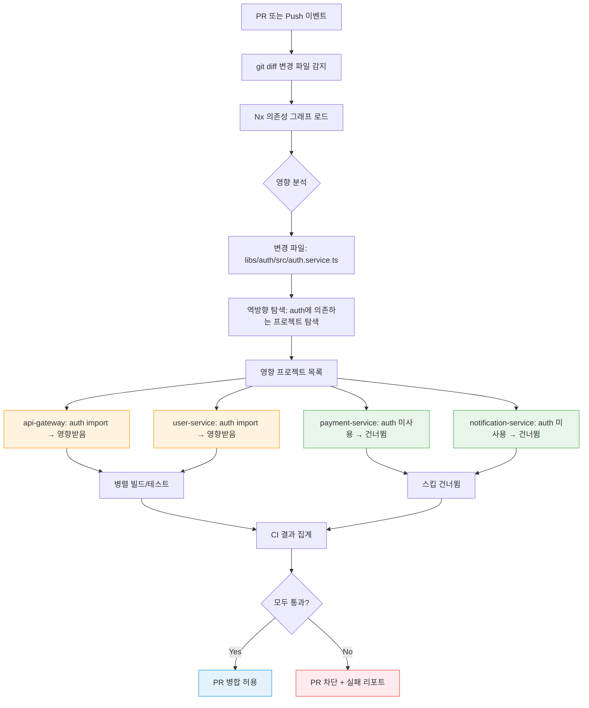

# Ch04. 구조적 CI/CD 패턴

**핵심 질문**: "Monorepo와 Polyrepo에서 파이프라인을 어떻게 다르게 설계하는가?"

---

## 🎯 학습 목표

1. Monorepo와 Polyrepo의 구조적 차이와 팀 규모별 적합성을 판단할 수 있다
2. Nx의 affected 빌드 원리를 이해하고 변경된 프로젝트만 선택적으로 빌드하는 파이프라인을 작성할 수 있다
3. GitHub Actions Reusable Workflow로 파이프라인 로직을 컴포넌트화하여 중복을 제거할 수 있다
4. RBAC 기반 파이프라인 설계로 역할별 배포 권한을 명시적으로 통제할 수 있다
5. Adapter 패턴으로 CI 도구 교체 비용을 최소화하는 추상화 레이어를 설계할 수 있다
6. Facade 패턴(Taskfile)으로 복잡한 파이프라인 명령어를 팀이 사용하기 쉬운 단일 인터페이스로 단순화할 수 있다

---

## 1. Monorepo vs Polyrepo 아키텍처

저장소 구조는 팀의 협업 방식과 빌드 파이프라인 설계에 근본적인 영향을 준다. Monorepo는 모든 서비스와 라이브러리를 하나의 저장소에 두는 방식이고, Polyrepo는 서비스마다 독립된 저장소를 사용하는 방식이다.

### Monorepo의 장단점

Monorepo의 핵심 강점은 **원자적(atomic) 변경**이다. 공유 라이브러리와 그것을 사용하는 서비스를 동시에 수정하고 하나의 커밋으로 일관성을 보장할 수 있다. Polyrepo 환경에서는 `shared-lib v2.0`을 배포한 뒤 각 서비스 저장소를 하나씩 업데이트해야 하므로 과도기적 불일치가 발생한다.

반면 Monorepo의 최대 과제는 **빌드 범위 제어**다. 저장소가 커질수록 "어떤 서비스를 빌드해야 하는가"를 정확히 파악하지 않으면, 작은 변경 하나에 수십 개 서비스 전체를 빌드하게 된다. Nx와 같은 도구가 이 문제를 풀기 위해 등장한 배경이다.

| 관점 | Monorepo | Polyrepo |
|------|----------|----------|
| 코드 공유 | 즉각적 (로컬 import) | 패키지 버전 관리 필요 |
| 원자적 변경 | 가능 | 불가 (다중 PR) |
| 빌드 격리 | 도구 필요 (Nx, Bazel) | 기본 제공 |
| 팀 자율성 | 낮음 (공통 설정 강제) | 높음 |
| 저장소 크기 | 대용량 (Git 성능 저하) | 소규모 유지 |
| 적합한 팀 | 긴밀히 협업하는 10~100인 팀 | 독립 서비스를 운영하는 팀 |

### 팀 규모별 선택 기준

5인 이하 팀은 Polyrepo의 오버헤드(다중 저장소 관리, 버전 조율)가 오히려 불필요하다. Monorepo 하나로 모든 것을 관리하면 인지 비용이 낮다. 10~50인 팀은 Monorepo가 빛을 발한다. 서비스 간 의존성이 복잡해질수록 원자적 변경의 가치가 커지기 때문이다. 100인 이상 팀은 Monorepo의 빌드 성능 문제와 소유권 충돌이 심해지므로, Nx나 Bazel 같은 전문 도구 없이는 유지하기 어렵다.

---

## 2. Nx Monorepo 설정과 Affected 파이프라인

Nx는 프로젝트 간 의존성 그래프를 분석하여 변경된 코드에 영향을 받는 프로젝트만 빌드·테스트하는 **증분 빌드(incremental build)** 를 제공한다. `git diff`로 변경 파일을 탐지하고, 의존성 그래프를 역방향으로 탐색하여 영향을 받는 프로젝트 목록을 계산하는 방식이다.

### nx.json 전체 설정

```json
// nx.json — Nx 프로젝트 경계와 캐시 설정
{
  "$schema": "./node_modules/nx/schemas/nx-schema.json",
  "npmScope": "myorg",
  "affected": {
    // PR 기준: main 브랜치와 비교하여 변경 범위를 계산
    "defaultBase": "main"
  },
  "tasksRunnerOptions": {
    "default": {
      "runner": "nx/tasks-runners/default",
      "options": {
        // 로컬 캐시: 동일 입력이면 빌드를 건너뜀
        "cacheableOperations": ["build", "test", "lint", "e2e"],
        "cacheDirectory": ".nx/cache"
      }
    }
  },
  "targetDefaults": {
    "build": {
      // build는 자신이 의존하는 프로젝트의 build가 먼저 실행되어야 함
      "dependsOn": ["^build"],
      "inputs": ["production", "^production"]
    },
    "test": {
      "inputs": ["default", "^production", "{workspaceRoot}/jest.preset.js"]
    },
    "lint": {
      "inputs": ["default", "{workspaceRoot}/.eslintrc.json"]
    }
  },
  "namedInputs": {
    // 프로덕션 파일: 테스트·스토리 제외 (테스트만 바뀌어도 build 캐시 유지)
    "production": [
      "default",
      "!{projectRoot}/**/?(*.)+(spec|test).[jt]s?(x)",
      "!{projectRoot}/tsconfig.spec.json",
      "!{projectRoot}/jest.config.[jt]s"
    ],
    "default": [
      "{projectRoot}/**/*",
      "sharedGlobals"
    ],
    "sharedGlobals": [
      "{workspaceRoot}/babel.config.json"
    ]
  },
  // 프로젝트 경계: api는 ui를 import할 수 없음 (순환 의존 방지)
  "plugins": [
    {
      "plugin": "@nx/eslint/plugin",
      "options": {
        "targetName": "lint"
      }
    }
  ]
}
```

### Nx Affected GitHub Actions 워크플로우

```yaml
# .github/workflows/ci-affected.yml
# 변경된 프로젝트만 빌드·테스트하는 Monorepo CI 파이프라인
name: CI — Affected Only

on:
  push:
    branches: [main]
  pull_request:
    branches: [main]

env:
  # Nx Cloud 토큰: 분산 캐시로 팀 전체 빌드 시간을 단축
  NX_CLOUD_AUTH_TOKEN: ${{ secrets.NX_CLOUD_AUTH_TOKEN }}

jobs:
  # 1단계: 어떤 프로젝트가 영향을 받는지 계산
  detect-affected:
    runs-on: ubuntu-latest
    outputs:
      affected-apps: ${{ steps.nx-affected.outputs.apps }}
      affected-libs: ${{ steps.nx-affected.outputs.libs }}
      has-changes: ${{ steps.nx-affected.outputs.has-changes }}
    steps:
      - uses: actions/checkout@v4
        with:
          # affected 계산을 위해 main 브랜치 히스토리도 필요
          fetch-depth: 0

      - name: Setup Node.js
        uses: actions/setup-node@v4
        with:
          node-version: '20'
          cache: 'npm'

      - run: npm ci

      - name: Compute affected projects
        id: nx-affected
        run: |
          # PR이면 base를 origin/main, push면 HEAD~1과 비교
          if [ "${{ github.event_name }}" == "pull_request" ]; then
            BASE=${{ github.event.pull_request.base.sha }}
          else
            BASE=HEAD~1
          fi

          # affected 앱 목록 추출
          APPS=$(npx nx show projects --affected --base=$BASE --type=app --json)
          LIBS=$(npx nx show projects --affected --base=$BASE --type=lib --json)
          HAS_CHANGES=$([ "$APPS" == "[]" ] && [ "$LIBS" == "[]" ] && echo "false" || echo "true")

          echo "apps=$APPS" >> $GITHUB_OUTPUT
          echo "libs=$LIBS" >> $GITHUB_OUTPUT
          echo "has-changes=$HAS_CHANGES" >> $GITHUB_OUTPUT

          echo "Affected apps: $APPS"
          echo "Affected libs: $LIBS"

  # 2단계: 영향받는 프로젝트만 테스트
  test-affected:
    runs-on: ubuntu-latest
    needs: detect-affected
    # 변경사항이 없으면 건너뜀
    if: needs.detect-affected.outputs.has-changes == 'true'
    steps:
      - uses: actions/checkout@v4
        with:
          fetch-depth: 0

      - uses: actions/setup-node@v4
        with:
          node-version: '20'
          cache: 'npm'

      - run: npm ci

      - name: Run lint for affected
        run: npx nx affected --target=lint --parallel=3

      - name: Run tests for affected
        run: npx nx affected --target=test --parallel=3 --ci --coverage

      - name: Build affected
        # 빌드는 순차적으로 (의존성 순서 보장)
        run: npx nx affected --target=build --parallel=3

  # 3단계: 변경이 없으면 이전 결과를 그대로 통과
  skip-unchanged:
    runs-on: ubuntu-latest
    needs: detect-affected
    if: needs.detect-affected.outputs.has-changes == 'false'
    steps:
      - run: echo "No affected projects. Skipping CI."
```

---

## 3. GitHub Actions Reusable Workflows

파이프라인 로직을 복사·붙여넣기하면 한 곳을 수정할 때 모든 워크플로우를 찾아 동일하게 수정해야 한다. Reusable Workflow는 워크플로우를 함수처럼 재사용할 수 있게 만든다. `inputs`, `outputs`, `secrets`를 통해 호출자(caller)와 피호출자(called) 간 명확한 인터페이스를 정의한다.

### Reusable Workflow — 피호출자 (called workflow)

```yaml
# .github/workflows/reusable-docker-build.yml
# 재사용 가능한 Docker 빌드·푸시 워크플로우
# 어떤 서비스 워크플로우에서도 호출 가능
name: Reusable — Docker Build & Push

on:
  workflow_call:
    inputs:
      image-name:
        description: 'Docker 이미지 이름 (예: myorg/api-gateway)'
        required: true
        type: string
      dockerfile-path:
        description: 'Dockerfile 경로'
        required: false
        type: string
        default: './Dockerfile'
      build-context:
        description: 'Docker 빌드 컨텍스트 경로'
        required: false
        type: string
        default: '.'
      push-to-registry:
        description: '레지스트리에 푸시할지 여부'
        required: false
        type: boolean
        default: true
      environment:
        description: '배포 환경 (dev/staging/prod)'
        required: true
        type: string
    outputs:
      image-tag:
        description: '빌드된 이미지의 전체 태그 (digest 포함)'
        value: ${{ jobs.build.outputs.image-tag }}
      image-digest:
        description: '이미지 digest (불변 참조용)'
        value: ${{ jobs.build.outputs.image-digest }}
    secrets:
      registry-username:
        required: true
      registry-password:
        required: true

jobs:
  build:
    runs-on: ubuntu-latest
    outputs:
      image-tag: ${{ steps.meta.outputs.tags }}
      image-digest: ${{ steps.build-push.outputs.digest }}
    steps:
      - uses: actions/checkout@v4

      - name: Set up Docker Buildx
        uses: docker/setup-buildx-action@v3

      - name: Login to Container Registry
        uses: docker/login-action@v3
        with:
          username: ${{ secrets.registry-username }}
          password: ${{ secrets.registry-password }}

      - name: Extract metadata (tags, labels)
        id: meta
        uses: docker/metadata-action@v5
        with:
          images: ${{ inputs.image-name }}
          tags: |
            # Git SHA를 태그로 사용 (불변성 보장)
            type=sha,prefix=${{ inputs.environment }}-
            # main 브랜치에는 latest 태그 추가
            type=raw,value=latest,enable=${{ github.ref == 'refs/heads/main' }}

      - name: Build and push Docker image
        id: build-push
        uses: docker/build-push-action@v5
        with:
          context: ${{ inputs.build-context }}
          file: ${{ inputs.dockerfile-path }}
          push: ${{ inputs.push-to-registry }}
          tags: ${{ steps.meta.outputs.tags }}
          labels: ${{ steps.meta.outputs.labels }}
          # 레이어 캐시로 빌드 시간 단축
          cache-from: type=gha
          cache-to: type=gha,mode=max
```

### Reusable Workflow — 호출자 (caller workflow)

```yaml
# .github/workflows/api-gateway-deploy.yml
# api-gateway 서비스의 배포 파이프라인
name: API Gateway — Deploy

on:
  push:
    branches: [main]
    paths:
      - 'services/api-gateway/**'
      - '.github/workflows/api-gateway-deploy.yml'

jobs:
  build:
    # 재사용 워크플로우 호출 — 로직은 여기 없고 인터페이스만 정의
    uses: ./.github/workflows/reusable-docker-build.yml
    with:
      image-name: myorg/api-gateway
      dockerfile-path: services/api-gateway/Dockerfile
      build-context: services/api-gateway
      environment: prod
      push-to-registry: true
    secrets:
      registry-username: ${{ secrets.REGISTRY_USERNAME }}
      registry-password: ${{ secrets.REGISTRY_PASSWORD }}

  deploy:
    needs: build
    runs-on: ubuntu-latest
    steps:
      - name: Deploy with immutable image digest
        run: |
          # digest를 사용하면 태그가 덮어써져도 동일 이미지를 보장
          echo "Deploying ${{ needs.build.outputs.image-digest }}"
          kubectl set image deployment/api-gateway \
            api-gateway=myorg/api-gateway@${{ needs.build.outputs.image-digest }}
```

---

## 4. RBAC 파이프라인 — 역할 기반 배포 접근 제어

프로덕션 배포는 누구나 실행할 수 있어서는 안 된다. RBAC(Role-Based Access Control) 파이프라인은 역할별로 실행 가능한 파이프라인 단계를 명시적으로 정의한다. "암묵적 허용" 대신 "명시적 허용"을 원칙으로 삼는다.

```yaml
# .github/workflows/rbac-deploy.yml
# 역할 기반 배포 제어: 환경별로 다른 승인자 그룹을 요구
name: RBAC Controlled Deployment

on:
  workflow_dispatch:
    inputs:
      environment:
        description: '배포 환경'
        required: true
        type: choice
        options: [dev, staging, prod]
      version:
        description: '배포할 이미지 태그'
        required: true
        type: string

# RBAC 권한 매트릭스 (주석으로 명시)
# ┌─────────────┬────────┬─────────┬──────────────────┐
# │ 역할         │ dev    │ staging │ prod             │
# ├─────────────┼────────┼─────────┼──────────────────┤
# │ Developer   │ 자동   │ 요청가능 │ 불가             │
# │ Tech Lead   │ 자동   │ 승인가능 │ 요청가능         │
# │ SRE         │ 자동   │ 승인가능 │ 승인가능         │
# │ CTO         │ 자동   │ 승인가능 │ 승인가능(긴급)   │
# └─────────────┴────────┴─────────┴──────────────────┘

jobs:
  # 1단계: 요청자 역할 검증
  validate-requester:
    runs-on: ubuntu-latest
    outputs:
      requester-role: ${{ steps.get-role.outputs.role }}
    steps:
      - name: Get requester role from org membership
        id: get-role
        uses: actions/github-script@v7
        with:
          script: |
            const requester = context.actor;
            const org = context.repo.owner;

            // GitHub 팀 멤버십으로 역할 조회
            const teams = ['sre-team', 'tech-leads', 'developers'];
            for (const team of teams) {
              try {
                await github.rest.teams.getMembershipForUserInOrg({
                  org, team_slug: team, username: requester
                });
                // 첫 번째 매칭된 팀이 역할 (우선순위 순)
                const roleMap = {
                  'sre-team': 'sre',
                  'tech-leads': 'tech-lead',
                  'developers': 'developer'
                };
                core.setOutput('role', roleMap[team]);
                return;
              } catch {}
            }
            core.setFailed(`User ${requester} has no deployment role`);

  # 2단계: 환경별 승인 게이트
  approval-gate:
    needs: validate-requester
    runs-on: ubuntu-latest
    environment:
      # GitHub Environment에 Required Reviewers 설정
      # dev: 승인 없이 진행, staging: tech-lead 또는 sre, prod: sre + tech-lead 모두
      name: ${{ github.event.inputs.environment }}-approval
    steps:
      - name: Approval gate passed
        run: |
          echo "Environment: ${{ github.event.inputs.environment }}"
          echo "Requester role: ${{ needs.validate-requester.outputs.requester-role }}"
          echo "Approved. Proceeding with deployment."

  # 3단계: 역할에 따라 다른 배포 절차 실행
  deploy:
    needs: [validate-requester, approval-gate]
    runs-on: ubuntu-latest
    env:
      ENVIRONMENT: ${{ github.event.inputs.environment }}
      VERSION: ${{ github.event.inputs.version }}
      REQUESTER_ROLE: ${{ needs.validate-requester.outputs.requester-role }}
    steps:
      - uses: actions/checkout@v4

      - name: Deploy to environment
        run: |
          echo "Deploying version $VERSION to $ENVIRONMENT"
          echo "Deployed by role: $REQUESTER_ROLE"

          # 프로덕션 배포 시 추가 안전장치
          if [ "$ENVIRONMENT" == "prod" ]; then
            echo "Production deployment: enabling canary rollout"
            ./scripts/deploy.sh --env=$ENVIRONMENT --version=$VERSION --strategy=canary
          else
            ./scripts/deploy.sh --env=$ENVIRONMENT --version=$VERSION --strategy=rolling
          fi

      - name: Notify deployment result
        if: always()
        uses: slackapi/slack-github-action@v1
        with:
          channel-id: 'deployments'
          slack-message: |
            *[${{ env.ENVIRONMENT }}] 배포 ${{ job.status }}*
            버전: `${{ env.VERSION }}`
            배포자: ${{ github.actor }} (${{ env.REQUESTER_ROLE }})
        env:
          SLACK_BOT_TOKEN: ${{ secrets.SLACK_BOT_TOKEN }}
```

---

## 5. Adapter 패턴 — CI 도구 교체 비용 최소화

파이프라인 로직이 특정 CI 도구(Jenkins, GitHub Actions, GitLab CI)에 직접 의존하면, 도구를 교체할 때 모든 파이프라인을 재작성해야 한다. Adapter 패턴은 빌드·테스트·배포 로직을 쉘 스크립트나 Makefile로 추상화하여, CI 도구는 단순히 "트리거 역할"만 담당하게 만든다.

**나쁜 예**: CI 도구에 직접 의존
```yaml
# GitHub Actions에 빌드 로직이 묶여 있어 Jenkins로 이전 시 재작성 필요
- name: Build
  run: |
    npm install
    npm run compile
    npm run bundle -- --output-path=dist/
    npm run generate-manifest -- --version=${{ github.sha }}
```

**좋은 예**: 스크립트로 추상화 (CI 도구 독립적)
```yaml
# CI 도구는 단순히 스크립트를 호출하는 트리거 역할만 수행
- name: Build
  run: ./scripts/build.sh
  env:
    BUILD_VERSION: ${{ github.sha }}
```

```bash
#!/usr/bin/env bash
# scripts/build.sh — CI 도구와 무관한 빌드 로직
# Jenkins, GitHub Actions, GitLab CI 어디서나 동일하게 동작
set -euo pipefail

BUILD_VERSION="${BUILD_VERSION:-$(git rev-parse --short HEAD)}"

echo "Building version: $BUILD_VERSION"
npm install
npm run compile
npm run bundle -- --output-path=dist/
npm run generate-manifest -- --version="$BUILD_VERSION"

echo "Build complete: dist/"
```

이 구조에서 GitHub Actions → GitLab CI로 전환하면 `.gitlab-ci.yml`에 동일한 `./scripts/build.sh` 호출 한 줄만 작성하면 된다. 비즈니스 로직은 그대로 유지된다.

---

## 6. Facade 패턴 — Taskfile로 파이프라인 명령어 통합

CI 파이프라인에서 실행하는 명령어가 복잡해질수록, 개발자가 로컬에서 동일한 작업을 재현하기 어려워진다. Facade 패턴은 복잡한 하위 시스템(빌드, 테스트, 린트, 배포)을 단순한 단일 인터페이스 뒤에 숨긴다. Taskfile은 Makefile보다 현대적인 문법으로 같은 역할을 수행한다.

```yaml
# Taskfile.yml — 파이프라인 명령어의 단일 진입점
# CI와 로컬 개발 환경 모두 동일한 명령어 사용
version: '3'

vars:
  # 기본값: 로컬에서는 짧은 SHA, CI에서는 전체 SHA
  BUILD_VERSION:
    sh: git rev-parse --short HEAD
  REGISTRY: ghcr.io/myorg

tasks:
  # 개발자가 기억해야 할 것은 이것뿐: task ci
  ci:
    desc: "전체 CI 파이프라인 로컬 실행"
    deps: [lint, test, build]
    cmds:
      - echo "CI pipeline passed for version {{.BUILD_VERSION}}"

  lint:
    desc: "코드 품질 검사"
    cmds:
      # 복잡한 eslint 옵션을 여기서 캡슐화
      - npx eslint . --ext .ts,.tsx --max-warnings 0
      - npx tsc --noEmit

  test:
    desc: "단위 테스트 + 커버리지"
    cmds:
      - npx jest --coverage --coverageThreshold='{"global":{"lines":80}}'

  build:
    desc: "프로덕션 빌드"
    cmds:
      - ./scripts/build.sh
    env:
      BUILD_VERSION: "{{.BUILD_VERSION}}"

  # 환경별 배포 (CI에서 동일하게 호출)
  deploy:
    desc: "지정 환경에 배포 (env=dev|staging|prod)"
    vars:
      ENV: '{{.env | default "dev"}}'
    cmds:
      - echo "Deploying to {{.ENV}}"
      - ./scripts/deploy.sh --env={{.ENV}} --version={{.BUILD_VERSION}}

  # Docker 관련 작업 그룹
  docker:build:
    desc: "Docker 이미지 빌드"
    cmds:
      - docker build -t {{.REGISTRY}}/app:{{.BUILD_VERSION}} .

  docker:push:
    desc: "Docker 이미지 레지스트리에 푸시"
    deps: [docker:build]
    cmds:
      - docker push {{.REGISTRY}}/app:{{.BUILD_VERSION}}
```

이제 CI 워크플로우는 도구 명령어 대신 task 명령어만 호출한다. Jenkins에서 GitHub Actions로 이전해도 `task ci` 한 줄은 변하지 않는다.

---

## 7. Affected 빌드 흐름 다이어그램



---

## 8. Jenkins 교차참조

Nx affected와 Reusable Workflow 개념은 Jenkins에서도 동일한 문제를 다른 방식으로 푼다. Jenkins Ch05 Shared Libraries는 Groovy 코드를 `vars/` 디렉토리에 공유 함수로 정의하여 여러 Jenkinsfile에서 재사용하는 구조다. GitHub Actions의 Reusable Workflow가 YAML 수준의 재사용이라면, Jenkins Shared Library는 코드 수준의 재사용이다.

Nx affected에 해당하는 Jenkins 구현은 `changeset()` 조건이나 파일 경로 필터를 활용하여 특정 디렉토리가 변경된 경우에만 해당 stage를 실행하는 방식으로 구현한다. 상세 내용은 Ch05에서 다룬다.

---

## 핵심 정리

구조적 CI/CD 패턴은 **"파이프라인도 코드다"** 라는 관점에서 소프트웨어 설계 원칙을 적용한다.

- **Monorepo + Nx**: 변경된 코드의 영향 범위를 정확히 계산하여 불필요한 빌드를 제거한다. 팀이 커질수록 효과가 크다.
- **Reusable Workflow**: 파이프라인 로직의 DRY 원칙. 한 곳을 수정하면 모든 서비스에 반영된다.
- **RBAC 파이프라인**: 배포 권한을 코드로 명시한다. "누가 어디에 배포할 수 있는가"가 파일에 기록된다.
- **Adapter 패턴**: 빌드 로직을 CI 도구에서 분리한다. 도구는 교체되어도 로직은 남는다.
- **Facade 패턴(Taskfile)**: 복잡한 파이프라인 명령어를 단순한 인터페이스로 감싼다. `task ci` 하나로 로컬과 CI가 동일하게 동작한다.
