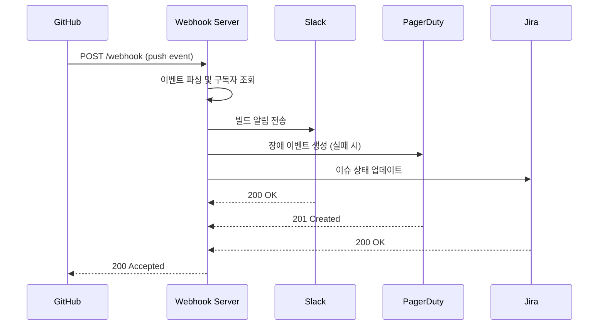

# Ch06. 행동 디자인 패턴

**핵심 질문**: "Observer/Strategy/Command가 파이프라인 설계에 왜 필요한가?"

---

## 🎯 학습 목표

1. Observer 패턴이 파이프라인 이벤트와 알림 시스템을 어떻게 분리하는지 설명할 수 있다
2. Strategy 패턴으로 배포 방식(Rolling/BlueGreen/Canary)을 런타임에 교체하는 코드를 작성할 수 있다
3. Command 패턴으로 파이프라인 단계를 캡슐화하여 undo/retry를 구현하는 원리를 이해한다
4. GitHub Actions matrix strategy로 다차원 테스트 환경을 효율적으로 구성할 수 있다
5. Chain of Responsibility로 위험도 기반 배포 승인 체인을 설계할 수 있다
6. 행동 패턴을 조합하여 결합도 낮은 파이프라인 아키텍처를 구성할 수 있다

---

## 행동 패턴이 CI/CD에서 해결하는 문제

파이프라인은 단계와 단계 사이에서 지속적으로 결정을 내린다. "이 빌드가 실패하면 누구에게 알릴 것인가?", "이 환경에는 어떤 배포 방식을 쓸 것인가?", "이 변경의 위험도에 따라 누가 승인해야 하는가?" 이런 질문들은 모두 행동(behavior)에 관한 것이다.

행동 패턴 없이 파이프라인을 구성하면 세 가지 문제가 나타난다.

첫째, **알림 결합도**다. 빌드 스크립트가 Slack API를 직접 호출하는 코드를 품고 있으면, Slack을 PagerDuty로 바꾸거나 Jira 티켓 생성을 추가할 때마다 스크립트 자체를 수정해야 한다. Observer 패턴은 "이벤트를 발행하는 쪽"과 "이벤트를 수신하는 쪽"을 분리하여 이 문제를 해결한다.

둘째, **전략 하드코딩**이다. `if env == "prod": blue_green_deploy() elif env == "staging": rolling_deploy()` 형태의 코드는 배포 전략이 늘어날수록 분기가 쌓이고, 새 환경이 추가될 때마다 이 if-else 블록을 찾아 수정해야 한다. Strategy 패턴은 전략 자체를 객체로 만들어 교체 가능하게 한다.

셋째, **단계 원자성 부재**다. 파이프라인 단계가 단순 함수 호출로 구성되면 실패 시 어디까지 되돌릴 것인지, 어느 단계를 재시도할 것인지 파악하기 어렵다. Command 패턴은 각 단계를 `execute()`와 `undo()`를 가진 객체로 캡슐화하여 이 문제를 해결한다.

---

## Observer 패턴: Webhook 기반 알림 분리

Observer 패턴의 핵심은 발행자(Publisher)가 구독자(Subscriber)의 존재를 모른다는 점이다. GitHub가 push 이벤트를 webhook으로 내보낼 때, GitHub는 Slack이나 PagerDuty가 있는지 알지 못한다. 중간의 webhook 서버가 이벤트를 받아 등록된 구독자들에게 브로드캐스트한다.

아래 다이어그램은 전형적인 CI/CD webhook observer 흐름이다.



실제 webhook observer 서버 구현은 다음과 같다. GitHub에서 push 이벤트가 오면 Slack과 PagerDuty에 동시에 알리며, 구독자 목록은 런타임에 추가하거나 제거할 수 있다.

```javascript
// webhook-observer.js
// Observer 패턴: GitHub webhook을 받아 여러 알림 채널에 브로드캐스트
const express = require('express');
const crypto = require('crypto');
const axios = require('axios');

const app = express();
app.use(express.json());

// 구독자 레지스트리 — 발행자(GitHub webhook 수신부)는 이 목록을 모른다
const observers = [];

function registerObserver(name, handler) {
  observers.push({ name, handler });
  console.log(`Observer registered: ${name}`);
}

// GitHub webhook 서명 검증 — 위조 요청 차단
function verifySignature(payload, signature, secret) {
  const hmac = crypto.createHmac('sha256', secret);
  const digest = 'sha256=' + hmac.update(payload).digest('hex');
  return crypto.timingSafeEqual(Buffer.from(digest), Buffer.from(signature));
}

// 이벤트 발행 — 등록된 모든 구독자에게 순차 또는 병렬 전달
async function notifyAll(event) {
  const results = await Promise.allSettled(
    observers.map(({ name, handler }) =>
      handler(event).catch(err => {
        // 한 구독자의 실패가 다른 구독자 알림을 막아서는 안 된다
        console.error(`Observer ${name} failed:`, err.message);
        throw err;
      })
    )
  );
  const failed = results.filter(r => r.status === 'rejected');
  if (failed.length > 0) {
    console.warn(`${failed.length}/${observers.length} observers failed`);
  }
}

// Slack 구독자
registerObserver('slack', async (event) => {
  const color = event.status === 'success' ? '#36a64f' : '#ff0000';
  await axios.post(process.env.SLACK_WEBHOOK_URL, {
    attachments: [{
      color,
      title: `[${event.repo}] ${event.status.toUpperCase()}`,
      text: `Branch: ${event.branch} | Commit: ${event.sha.slice(0, 7)}`,
      footer: `Triggered by ${event.pusher}`,
      ts: Math.floor(Date.now() / 1000),
    }],
  });
});

// PagerDuty 구독자 — 실패 이벤트만 처리
registerObserver('pagerduty', async (event) => {
  if (event.status !== 'failure') return; // 성공 이벤트는 무시

  await axios.post('https://events.pagerduty.com/v2/enqueue', {
    routing_key: process.env.PAGERDUTY_ROUTING_KEY,
    event_action: 'trigger',
    payload: {
      summary: `CI Failure: ${event.repo}@${event.branch}`,
      severity: event.branch === 'main' ? 'critical' : 'warning',
      source: 'github-webhook-observer',
      custom_details: { sha: event.sha, pusher: event.pusher },
    },
  }, { headers: { 'Content-Type': 'application/json' } });
});

// GitHub webhook 수신 엔드포인트
app.post('/webhook', async (req, res) => {
  const signature = req.headers['x-hub-signature-256'];
  const rawBody = JSON.stringify(req.body);

  if (!verifySignature(rawBody, signature, process.env.GITHUB_WEBHOOK_SECRET)) {
    return res.status(401).json({ error: 'Invalid signature' });
  }

  // GitHub push 이벤트를 내부 이벤트 형식으로 정규화
  const event = {
    repo: req.body.repository?.full_name,
    branch: req.body.ref?.replace('refs/heads/', ''),
    sha: req.body.after,
    pusher: req.body.pusher?.name,
    status: req.headers['x-build-status'] || 'unknown', // CI 시스템이 추가하는 커스텀 헤더
  };

  // 즉시 응답 후 비동기 알림 (GitHub는 10초 타임아웃)
  res.status(202).json({ message: 'Accepted' });
  await notifyAll(event);
});

app.listen(3000, () => console.log('Webhook observer listening on :3000'));
```

새 알림 채널(예: Jira 티켓 생성)을 추가하려면 `registerObserver('jira', handler)`만 호출하면 된다. 기존 코드는 전혀 수정하지 않아도 된다. 이것이 Open/Closed Principle이 실제로 동작하는 모습이다.

---

## Strategy 패턴: 배포 전략 선택기

배포 전략은 환경, 트래픽 수준, 서비스 특성에 따라 달라진다. 이 선택 로직을 if-else로 구현하면 전략이 늘어날수록 조건 블록이 길어지고, 각 전략의 세부 구현이 한 파일에 뒤섞인다.

**Bad: if-else로 전략 선택**

```python
# 안티패턴 — 전략 추가마다 이 함수를 수정해야 한다
def deploy(env, service, version):
    if env == "production":
        if service.traffic > 10000:
            # 카나리 배포 로직 (50줄)
            ...
        else:
            # 블루-그린 배포 로직 (60줄)
            ...
    elif env == "staging":
        # 롤링 배포 로직 (40줄)
        ...
    else:
        raise ValueError(f"Unknown env: {env}")
```

**Good: Strategy 패턴**

```python
# deployment_strategies.py
# Strategy 패턴: 배포 전략을 독립 클래스로 캡슐화하여 교체 가능하게 만든다
from abc import ABC, abstractmethod
from dataclasses import dataclass
import time

@dataclass
class DeploymentContext:
    service: str
    version: str
    replicas: int
    environment: str
    traffic_rps: int  # 초당 요청 수 — 전략 선택 기준


class DeploymentStrategy(ABC):
    """모든 배포 전략의 공통 인터페이스 — 클라이언트는 이 인터페이스만 안다"""

    @abstractmethod
    def deploy(self, ctx: DeploymentContext) -> bool:
        pass

    @abstractmethod
    def rollback(self, ctx: DeploymentContext) -> bool:
        pass

    @abstractmethod
    def health_check(self, ctx: DeploymentContext) -> bool:
        pass


class RollingStrategy(DeploymentStrategy):
    """롤링 배포: 파드를 순차적으로 교체. 낮은 트래픽 환경에 적합"""

    def __init__(self, batch_size: int = 1, wait_seconds: int = 30):
        self.batch_size = batch_size
        self.wait_seconds = wait_seconds

    def deploy(self, ctx: DeploymentContext) -> bool:
        print(f"[Rolling] {ctx.service} → {ctx.version} ({ctx.replicas} replicas, batch={self.batch_size})")
        for batch_start in range(0, ctx.replicas, self.batch_size):
            batch_end = min(batch_start + self.batch_size, ctx.replicas)
            print(f"  Updating replicas {batch_start+1}~{batch_end}...")
            time.sleep(self.wait_seconds)  # 실제로는 kubectl rollout status
            if not self.health_check(ctx):
                return False
        return True

    def rollback(self, ctx: DeploymentContext) -> bool:
        print(f"[Rolling] Rollback {ctx.service}")
        return True  # kubectl rollout undo

    def health_check(self, ctx: DeploymentContext) -> bool:
        # 실제로는 HTTP GET /health 또는 readinessProbe 확인
        return True


class BlueGreenStrategy(DeploymentStrategy):
    """블루-그린: 동일 용량의 새 환경 구성 후 트래픽 전환. 즉각 롤백 가능"""

    def deploy(self, ctx: DeploymentContext) -> bool:
        print(f"[BlueGreen] Spinning up GREEN for {ctx.service}:{ctx.version}")
        # 1. GREEN 환경 생성
        print(f"  Creating green deployment with {ctx.replicas} replicas...")
        time.sleep(10)

        # 2. 헬스체크 통과 후 트래픽 전환
        if not self.health_check(ctx):
            print("  Health check failed — aborting switch")
            return False

        print("  Switching load balancer: BLUE → GREEN")
        return True

    def rollback(self, ctx: DeploymentContext) -> bool:
        print(f"[BlueGreen] Switching back to BLUE for {ctx.service}")
        return True  # 로드밸런서를 BLUE로 되돌리면 즉각 완료

    def health_check(self, ctx: DeploymentContext) -> bool:
        return True


class CanaryStrategy(DeploymentStrategy):
    """카나리: 소량 트래픽으로 신버전 검증 후 점진적 확대. 고트래픽 환경에 필수"""

    def __init__(self, canary_weight: int = 5, increment: int = 20, interval_minutes: int = 10):
        self.canary_weight = canary_weight  # 초기 카나리 트래픽 비율 (%)
        self.increment = increment
        self.interval_minutes = interval_minutes

    def deploy(self, ctx: DeploymentContext) -> bool:
        print(f"[Canary] {ctx.service}:{ctx.version} — starting at {self.canary_weight}% traffic")
        weight = self.canary_weight
        while weight <= 100:
            print(f"  Traffic weight: {weight}% → new version")
            # 실제로는 Istio VirtualService weight 조정 또는 Argo Rollouts
            if not self.health_check(ctx):
                print(f"  Error rate exceeded at {weight}% — rolling back")
                return self.rollback(ctx)
            weight += self.increment
            if weight <= 100:
                time.sleep(self.interval_minutes * 60)
        print("  Canary promotion complete: 100% traffic on new version")
        return True

    def rollback(self, ctx: DeploymentContext) -> bool:
        print(f"[Canary] Resetting traffic to 0% for {ctx.service}:{ctx.version}")
        return True

    def health_check(self, ctx: DeploymentContext) -> bool:
        return True


# 전략 선택기 — if-else 대신 규칙 테이블로 전략을 결정한다
def select_strategy(ctx: DeploymentContext) -> DeploymentStrategy:
    """환경과 트래픽 수준에 따라 최적 전략을 자동 선택"""
    if ctx.environment == "production":
        if ctx.traffic_rps > 5000:
            # 고트래픽 프로덕션: 에러 파급을 최소화하는 카나리
            return CanaryStrategy(canary_weight=5, increment=10, interval_minutes=15)
        else:
            # 저트래픽 프로덕션: 즉각 롤백이 가능한 블루-그린
            return BlueGreenStrategy()
    elif ctx.environment == "staging":
        # 스테이징: 빠른 피드백을 위한 롤링
        return RollingStrategy(batch_size=2, wait_seconds=10)
    else:
        # 개발/피처 환경: 가장 단순한 롤링
        return RollingStrategy(batch_size=ctx.replicas, wait_seconds=5)


# 사용 예시
if __name__ == "__main__":
    ctx = DeploymentContext(
        service="payment-api",
        version="v2.3.1",
        replicas=10,
        environment="production",
        traffic_rps=8000,
    )
    strategy = select_strategy(ctx)
    print(f"Selected: {strategy.__class__.__name__}")
    success = strategy.deploy(ctx)
    if not success:
        strategy.rollback(ctx)
```

새 전략(예: A/B Testing 전략)을 추가할 때 `DeploymentStrategy`를 상속한 클래스를 만들고 `select_strategy`에 조건 한 줄을 추가하면 된다. 기존 전략 코드는 변경하지 않는다.

---

## Command 패턴: 파이프라인 단계 추상화

Command 패턴은 "수행할 행동"을 객체로 만든다. 파이프라인의 각 단계(빌드, 테스트, 배포, 알림)를 Command 객체로 캡슐화하면 세 가지 능력이 생긴다. 실행 취소(undo), 재시도(retry), 큐잉(queue)이다.

```python
# pipeline_command.py
# Command 패턴: 파이프라인 단계를 execute/undo를 가진 객체로 추상화
from abc import ABC, abstractmethod
from typing import List
import logging

logger = logging.getLogger(__name__)


class PipelineCommand(ABC):
    """파이프라인 단계의 인터페이스 — 실행과 취소가 대칭으로 정의된다"""

    @abstractmethod
    def execute(self) -> bool:
        """단계 실행. True = 성공, False = 실패"""
        pass

    @abstractmethod
    def undo(self) -> None:
        """execute()의 효과를 되돌린다. 파이프라인 롤백 시 호출된다"""
        pass

    @property
    @abstractmethod
    def name(self) -> str:
        pass


class DeployCommand(PipelineCommand):
    def __init__(self, service: str, version: str, namespace: str):
        self.service = service
        self.version = version
        self.namespace = namespace
        self._previous_version = None

    def execute(self) -> bool:
        logger.info(f"Deploying {self.service}:{self.version} → {self.namespace}")
        self._previous_version = "v1.2.0"  # 실제로는 kubectl get deployment로 조회
        return True

    def undo(self) -> None:
        if self._previous_version:
            logger.info(f"Rolling back {self.service} to {self._previous_version}")
            # kubectl rollout undo deployment/{self.service}

    @property
    def name(self) -> str:
        return f"deploy({self.service}:{self.version})"


class Pipeline:
    """Invoker: Command 객체들을 순서대로 실행하고, 실패 시 역순으로 undo한다"""

    def __init__(self):
        self._commands: List[PipelineCommand] = []
        self._executed: List[PipelineCommand] = []

    def add_step(self, command: PipelineCommand) -> 'Pipeline':
        self._commands.append(command)
        return self  # 메서드 체이닝 지원

    def run(self) -> bool:
        for command in self._commands:
            logger.info(f"Executing: {command.name}")
            if not command.execute():
                logger.error(f"Step failed: {command.name} — initiating rollback")
                self._rollback()
                return False
            self._executed.append(command)
        return True

    def _rollback(self) -> None:
        """실행된 단계를 역순으로 undo — 커밋 순서의 반대 방향으로 되돌린다"""
        for command in reversed(self._executed):
            logger.info(f"Undoing: {command.name}")
            command.undo()
        self._executed.clear()
```

Command 패턴의 진가는 `Pipeline._rollback()`에 있다. 실행된 단계들을 역순으로 순회하면서 각각의 `undo()`를 호출한다. 새 단계가 추가되어도 Pipeline 코드는 변경하지 않는다.

---

## GitHub Actions Matrix Strategy

Matrix strategy는 Strategy 패턴의 선언적 구현이다. "이 조합들에 대해 동일한 작업을 병렬로 실행하라"는 전략을 YAML로 선언한다.

```yaml
# .github/workflows/matrix-test.yml
name: Matrix Test Suite

on:
  push:
    branches: [main, develop]
  pull_request:
    branches: [main]

jobs:
  test:
    name: Test (${{ matrix.os }} / ${{ matrix.python }} / ${{ matrix.db }})
    runs-on: ${{ matrix.os }}

    strategy:
      # fail-fast: false — 한 조합 실패가 다른 조합을 중단시키지 않는다
      # 전체 호환성 매트릭스를 파악하려면 false가 필수
      fail-fast: false
      max-parallel: 6  # 동시 실행 수 제한 — 비용과 속도의 균형점

      matrix:
        os: [ubuntu-22.04, windows-2022, macos-13]
        python: ["3.10", "3.11", "3.12"]
        db: [postgres, mysql]

        # exclude: 지원하지 않는 조합을 명시적으로 제외
        exclude:
          - os: windows-2022
            db: mysql      # Windows + MySQL 조합은 테스트하지 않는다
          - os: macos-13
            python: "3.10" # macOS에서는 최신 Python만 지원

        # include: matrix에 없는 특수 조합을 추가
        include:
          - os: ubuntu-22.04
            python: "3.12"
            db: postgres
            coverage: true  # 이 조합에서만 커버리지 리포트 생성

    services:
      # db matrix 값에 따라 서비스 컨테이너를 조건부로 구성
      postgres:
        image: ${{ matrix.db == 'postgres' && 'postgres:16' || '' }}
        env:
          POSTGRES_PASSWORD: test
        options: >-
          --health-cmd pg_isready
          --health-interval 10s
          --health-timeout 5s
          --health-retries 5
        ports:
          - 5432:5432

    steps:
      - uses: actions/checkout@v4

      - name: Set up Python ${{ matrix.python }}
        uses: actions/setup-python@v5
        with:
          python-version: ${{ matrix.python }}
          cache: pip

      - name: Install dependencies
        run: pip install -r requirements.txt

      - name: Run tests
        env:
          DB_TYPE: ${{ matrix.db }}
          DB_HOST: localhost
        run: |
          pytest tests/ \
            --tb=short \
            ${{ matrix.coverage && '--cov=src --cov-report=xml' || '' }}

      - name: Upload coverage
        # coverage: true인 조합에서만 업로드
        if: ${{ matrix.coverage }}
        uses: codecov/codecov-action@v4
        with:
          file: coverage.xml
```

3 OS × 3 Python × 2 DB = 18개 조합에서 exclude로 3개 제외하면 15개 조합이 병렬 실행된다. 단일 순차 실행 대비 15배 빠르게 호환성을 검증할 수 있다. `max-parallel: 6`은 GitHub Actions 과금 단위인 병렬 실행 수를 제어하여 비용을 관리한다.

---

## Chain of Responsibility: 배포 승인 체인

Chain of Responsibility는 요청을 처리할 수 있는 핸들러를 체인으로 연결한다. 배포 승인에서 이 패턴은 위험도에 따라 자동 승인, 시니어 검토, 리드 승인, 전원 동의로 에스컬레이션한다.

```python
# approval_chain.py
# Chain of Responsibility: 위험도 점수에 따라 적합한 승인자가 자동 결정된다
from abc import ABC, abstractmethod
from dataclasses import dataclass
from typing import Optional


@dataclass
class DeploymentRequest:
    service: str
    environment: str
    risk_score: int  # 0-100 (변경 크기, 영향 범위, 이전 장애 이력 기반)
    requester: str


class ApprovalHandler(ABC):
    def __init__(self, name: str, max_risk: int):
        self.name = name
        self.max_risk = max_risk  # 이 핸들러가 처리할 수 있는 최대 위험도
        self._next: Optional['ApprovalHandler'] = None

    def set_next(self, handler: 'ApprovalHandler') -> 'ApprovalHandler':
        self._next = handler
        return handler  # 체이닝: handler1.set_next(handler2).set_next(handler3)

    def handle(self, request: DeploymentRequest) -> str:
        if request.risk_score <= self.max_risk:
            return self.approve(request)
        elif self._next:
            print(f"{self.name}: risk={request.risk_score} > {self.max_risk}, escalating...")
            return self._next.handle(request)
        else:
            return f"REJECTED: No handler for risk score {request.risk_score}"

    @abstractmethod
    def approve(self, request: DeploymentRequest) -> str:
        pass


class AutoApprover(ApprovalHandler):
    """위험도 20 이하: 자동 승인 (단순 설정 변경, 문서 업데이트)"""
    def __init__(self):
        super().__init__("AutoApprover", max_risk=20)

    def approve(self, request: DeploymentRequest) -> str:
        return f"AUTO-APPROVED: {request.service} → {request.environment}"


class SeniorReviewer(ApprovalHandler):
    """위험도 50 이하: 시니어 엔지니어 검토 (기능 변경, 의존성 업데이트)"""
    def __init__(self):
        super().__init__("SeniorReviewer", max_risk=50)

    def approve(self, request: DeploymentRequest) -> str:
        # 실제로는 Slack DM 또는 PagerDuty 호출로 승인 요청
        return f"APPROVED by Senior: {request.service} (risk={request.risk_score})"


class LeadApprover(ApprovalHandler):
    """위험도 80 이하: 팀 리드 승인 (아키텍처 변경, 데이터베이스 마이그레이션)"""
    def __init__(self):
        super().__init__("LeadApprover", max_risk=80)

    def approve(self, request: DeploymentRequest) -> str:
        return f"APPROVED by Lead: {request.service} (risk={request.risk_score})"


class EmergencyCommittee(ApprovalHandler):
    """위험도 81-100: 전원 동의 (핵심 결제 시스템, 인증 서비스 등)"""
    def __init__(self):
        super().__init__("EmergencyCommittee", max_risk=100)

    def approve(self, request: DeploymentRequest) -> str:
        return f"APPROVED by Committee: {request.service} (CRITICAL risk={request.risk_score})"


# 체인 구성 — 순서가 곧 정책이다
auto = AutoApprover()
senior = SeniorReviewer()
lead = LeadApprover()
committee = EmergencyCommittee()

auto.set_next(senior).set_next(lead).set_next(committee)

# 사용 예시
requests = [
    DeploymentRequest("config-service", "production", 15, "alice"),
    DeploymentRequest("user-api", "production", 45, "bob"),
    DeploymentRequest("auth-service", "production", 92, "carol"),
]

for req in requests:
    result = auto.handle(req)
    print(result)
```

체인 구성만 바꾸면 승인 정책이 변경된다. 예를 들어 주말에는 `senior` 다음에 `lead`를 건너뛰고 `committee`로 직접 연결하는 비상 정책을 쉽게 구현할 수 있다.

---

## 행동 패턴 조합: Observer + Strategy

실제 파이프라인은 단일 패턴이 아닌 여러 패턴의 조합으로 구성된다. Observer가 배포 완료 이벤트를 발행하고, 그 이벤트를 수신한 핸들러가 Strategy를 선택하여 알림 방식을 결정하는 구조가 전형적이다. 프로덕션 배포 실패는 PagerDuty로, 스테이징 배포 실패는 Slack으로만 알리는 정책을 구현할 때, Observer가 이벤트를 수신하고 Strategy가 채널을 결정한다. 이 두 패턴이 함께 작동하면 "어떤 이벤트에 반응할지"와 "어떻게 반응할지"가 독립적으로 변화한다.

---

## 핵심 정리

| 패턴 | CI/CD 적용 | 핵심 이점 |
|------|-----------|----------|
| Observer | Webhook 알림 브로드캐스트 | 알림 채널 추가/제거 시 발행자 코드 무변경 |
| Strategy | 배포 방식 선택 (Rolling/BlueGreen/Canary) | 전략 교체가 클라이언트에 투명 |
| Command | 파이프라인 단계 캡슐화 | execute/undo 대칭으로 롤백 자동화 |
| Matrix | 다차원 테스트 환경 | N × M 조합을 선언적으로 병렬 실행 |
| Chain of Responsibility | 위험도 기반 승인 에스컬레이션 | 승인 정책을 체인 구성으로 표현 |

행동 패턴의 공통 목표는 **"변화하는 것을 변화하지 않는 것으로부터 분리"**하는 데 있다. 어떤 알림 채널을 쓸지(Observer), 어떤 전략으로 배포할지(Strategy), 어떤 단계를 수행할지(Command)는 런타임에 결정되거나 교체되어야 하는 것들이다. 패턴은 그 교체 지점을 명시적으로 만든다.

---

## 참고 자료

- Gang of Four, *Design Patterns* — Observer(p.293), Strategy(p.315), Command(p.233), Chain of Responsibility(p.223)
- GitHub Actions: [Matrix Strategy](https://docs.github.com/en/actions/using-jobs/using-a-matrix-for-your-jobs)
- Argo Rollouts: [Canary Deployments](https://argoproj.github.io/argo-rollouts/features/canary/)
- PagerDuty Events API v2: [Integration Guide](https://developer.pagerduty.com/docs/events-api-v2/overview/)
