# Ch07. 도메인 주도 CI/CD와 규제 준수

**핵심 질문**: "규제 산업에서 파이프라인에 컴플라이언스를 어떻게 통합하는가?"

---

## 🎯 학습 목표

1. Bounded Context별 독립 파이프라인이 왜 모놀리식 파이프라인보다 운영 비용을 낮추는지 설명할 수 있다
2. ABAC(Attribute-Based Access Control)와 RBAC의 차이를 이해하고, 규제 환경에서 ABAC를 선택하는 근거를 제시할 수 있다
3. SOX, PCI-DSS, HIPAA, FedRAMP 각각이 파이프라인에 요구하는 통제 항목을 구체적으로 나열할 수 있다
4. Compliance Gate를 코드로 구현하여 수동 체크리스트를 자동화할 수 있다
5. Separation of Duties(직무 분리)를 파이프라인 설정으로 강제하는 방법을 설명할 수 있다
6. 감사 추적(Audit Trail)을 불변 저장소에 자동 기록하는 아키텍처를 설계할 수 있다

---

## 1. DDD와 CI/CD의 교차점

도메인 주도 설계(DDD)는 소프트웨어를 비즈니스 경계에 따라 분리하라고 말한다. 이 경계를 Bounded Context라고 부른다. 문제는 대부분의 팀이 코드는 Bounded Context로 나누면서 파이프라인은 단일 거대 파이프라인으로 유지한다는 점이다.

단일 파이프라인의 부작용은 명확하다. 결제 도메인의 변경 사항이 배송 도메인의 배포를 차단한다. 의료 기록 서비스에 필요한 HIPAA 준수 검사가 내부 관리 도구에도 적용된다. 규제 요구사항이 전혀 다른 두 도메인이 같은 승인 프로세스를 거쳐야 한다.

Bounded Context별 독립 파이프라인은 이 문제를 해결한다. 각 도메인이 자신의 기술 스택, 규제 요구사항, 배포 빈도에 맞는 파이프라인을 소유한다. 결제 도메인은 PCI-DSS 준수 검사를 포함하고, 분석 도메인은 빠른 이터레이션을 위해 가벼운 파이프라인을 유지할 수 있다.

```mermaid
graph TD
    subgraph "Bounded Context: 결제"
        A[결제 코드 변경] --> B[결제 파이프라인]
        B --> C[PCI-DSS 검사]
        C --> D[이중 승인]
        D --> E[결제 프로덕션]
    end

    subgraph "Bounded Context: 배송"
        F[배송 코드 변경] --> G[배송 파이프라인]
        G --> H[기본 품질 검사]
        H --> I[단일 승인]
        I --> J[배송 프로덕션]
    end

    subgraph "Bounded Context: 분석"
        K[분석 코드 변경] --> L[분석 파이프라인]
        L --> M[린트 + 테스트]
        M --> N[자동 배포]
    end
```



파이프라인 분리의 핵심 원칙은 "도메인 전문가가 파이프라인 규칙을 읽을 수 있어야 한다"는 것이다. 결제 도메인 책임자가 파이프라인 YAML을 보고 "이 파이프라인은 PCI-DSS 요구사항을 충족한다"고 판단할 수 있어야 한다.

---

## 2. Bounded Context별 파이프라인 분리

도메인별 독립 파이프라인을 구현할 때 가장 먼저 결정해야 할 것은 파이프라인 코드의 위치다. 두 가지 접근 방식이 있다.

**모노레포 내 경로 기반 트리거**: 단일 저장소에 모든 서비스가 있고, 변경된 경로에 따라 해당 도메인의 파이프라인만 실행한다. GitHub Actions의 `paths` 필터가 대표적인 구현 방법이다.

**서비스별 독립 저장소**: 각 Bounded Context가 자체 저장소를 가지므로 파이프라인도 자연스럽게 분리된다. 이 경우 공통 컴플라이언스 스텝을 재사용 가능한 워크플로우로 추출하는 것이 중요하다.

```yaml
# .github/workflows/payment-pipeline.yml
# 결제 Bounded Context 전용 파이프라인
# WHY: 결제 도메인은 PCI-DSS 요구사항으로 별도 승인 게이트 필요

name: Payment Service Pipeline

on:
  push:
    paths:
      - 'services/payment/**'
      - '.github/workflows/payment-pipeline.yml'
  pull_request:
    paths:
      - 'services/payment/**'

jobs:
  build-and-test:
    runs-on: ubuntu-latest
    steps:
      - uses: actions/checkout@v4

      - name: Run unit tests
        run: |
          cd services/payment
          make test

      - name: Run integration tests
        run: |
          cd services/payment
          make test-integration

  compliance-gate:
    needs: build-and-test
    uses: ./.github/workflows/reusable-compliance-gate.yml
    with:
      service-name: payment
      compliance-profile: pci-dss  # WHY: 결제 도메인은 PCI-DSS 프로파일 적용
      sensitivity-level: high
    secrets: inherit

  deploy-staging:
    needs: compliance-gate
    environment:
      name: payment-staging
      url: https://payment-staging.example.com
    runs-on: ubuntu-latest
    steps:
      - name: Deploy to staging
        run: echo "Deploy payment service to staging"

  deploy-production:
    needs: deploy-staging
    if: github.ref == 'refs/heads/main'
    environment:
      name: payment-production  # WHY: GitHub Environment Protection으로 필수 리뷰어 강제
      url: https://payment.example.com
    runs-on: ubuntu-latest
    steps:
      - name: Deploy to production
        run: echo "Deploy payment service to production"
```

---

## 3. 규제 산업의 CI/CD 요구사항

규제 준수는 추상적인 개념이 아니라 파이프라인에 구체적인 스텝으로 번역되어야 한다. 각 규제마다 요구하는 통제 항목이 다르다.

### SOX (사베인스-옥슬리법) — 금융 보고

SOX는 금융 데이터의 무결성을 보장하기 위한 법이다. 파이프라인 관점에서 SOX가 요구하는 것은 변경 관리 추적과 승인 증적이다. 누가 코드를 변경했는지, 누가 승인했는지, 언제 배포되었는지를 변경 불가능한 방식으로 기록해야 한다. 코드 작성자와 승인자가 동일인이어서는 안 된다(Separation of Duties).

### PCI-DSS — 카드 결제 데이터

PCI-DSS는 카드 소지자 데이터를 처리하는 시스템에 적용된다. 파이프라인에서는 의존성 취약점 스캔과 코드 보안 검사가 핵심이다. 알려진 취약점(CVE)이 있는 라이브러리를 포함한 빌드는 배포가 차단되어야 한다. CVSS 점수 기준(보통 7.0 이상)을 파이프라인이 자동으로 강제한다.

### HIPAA — 의료 정보

HIPAA는 개인 건강 정보(PHI)를 보호하는 법이다. 파이프라인 관점에서 HIPAA는 접근 로그의 완전성을 요구한다. PHI를 처리하는 서비스에 배포가 일어날 때마다 누가 어떤 변경을 배포했는지 기록해야 한다. 또한 암호화 설정 검증(저장 데이터 암호화, 전송 암호화)이 배포 전 자동으로 확인되어야 한다.

### FedRAMP — 미국 연방 정부 클라우드

FedRAMP는 미국 정부 기관이 사용하는 클라우드 서비스에 대한 보안 인증이다. 파이프라인에서는 FIPS 140-2 준수 암호화 모듈 사용 여부, 접근 통제 정책의 YAML 선언적 관리가 요구된다. 모든 변경사항은 승인된 변경 관리 티켓과 연결되어야 한다.

| 규제 | 핵심 파이프라인 통제 | 자동화 가능 여부 |
|------|----------------------|-----------------|
| SOX | 변경 승인 증적, SoD | 승인 워크플로우로 90% 자동화 |
| PCI-DSS | 취약점 스캔, 코드 보안 검사 | 100% 자동화 가능 |
| HIPAA | 접근 로그, 암호화 검증 | 80% 자동화, 20%는 수동 확인 |
| FedRAMP | FIPS 준수, 변경 티켓 연결 | 70% 자동화, 정기 감사 필요 |

---

## 4. ABAC 정책 설계

RBAC(Role-Based Access Control)는 역할에 권한을 부여한다. 개발자는 스테이징에 배포할 수 있고, 시니어 개발자는 프로덕션에 배포할 수 있다는 식이다. 규제 환경에서 RBAC의 한계는 역할이 단순하지 않다는 점이다. 같은 "시니어 개발자"라도 결제 도메인 소속인지, 결제 시스템 담당자인지, 야간 근무 중인지에 따라 허용 범위가 달라져야 한다.

ABAC(Attribute-Based Access Control)는 사용자, 리소스, 환경의 속성을 조합하여 접근 결정을 내린다. "결제 도메인 소속(department=payment) + 시니어(role=senior) + 근무 시간 중(time=business_hours)"인 사람만 프로덕션 배포를 승인할 수 있다는 정책이 가능해진다.

```yaml
# abac-policy.yml
# WHY: RBAC의 역할 폭발(role explosion) 문제를 속성 조합으로 해결
# 규제 요구사항: 배포 승인자는 해당 도메인 소속 + 특정 등급 이상이어야 함

version: "1.0"
policy_name: "cicd-deployment-control"
description: "CI/CD 파이프라인 배포 접근 제어 정책"

# 속성 정의
attribute_schemas:
  subject:  # 행위자 속성
    role:
      type: enum
      values: [developer, senior_developer, tech_lead, security_officer, release_manager]
    department:
      type: enum
      values: [payment, logistics, analytics, platform, security]
    clearance_level:
      type: integer
      range: [1, 5]  # 1=기본, 5=최고 기밀 접근 가능
    employment_type:
      type: enum
      values: [full_time, contractor, vendor]

  resource:  # 리소스 속성
    environment:
      type: enum
      values: [development, staging, production, dr]
    domain:
      type: enum
      values: [payment, logistics, analytics, platform]
    sensitivity:
      type: enum
      values: [low, medium, high, critical]  # critical = 카드 데이터, PHI 등
    compliance_profile:
      type: enum
      values: [standard, pci_dss, hipaa, sox, fedramp]

  action:  # 허용 액션
    type: enum
    values: [deploy, rollback, approve, view_logs, modify_pipeline]

# 정책 규칙
policies:
  # 규칙 1: 개발 환경 배포 — 동일 도메인 개발자 이상
  - id: "DEV_DEPLOY"
    effect: allow
    conditions:
      subject:
        role: [developer, senior_developer, tech_lead]
        employment_type: [full_time, contractor]
      resource:
        environment: [development]
      action: [deploy, rollback]
    # WHY: 개발 환경은 신속한 이터레이션이 중요하므로 조건을 최소화
    note: "도메인 소속 불문, 개발 환경 자유 배포"

  # 규칙 2: 스테이징 배포 — 동일 도메인 소속 필수
  - id: "STAGING_DEPLOY_SAME_DOMAIN"
    effect: allow
    conditions:
      subject:
        role: [developer, senior_developer, tech_lead]
        employment_type: [full_time]
      resource:
        environment: [staging]
        sensitivity: [low, medium]
      action: [deploy]
    constraint:
      # 동일 도메인 소속 강제 (subject.department == resource.domain)
      attribute_match: "subject.department == resource.domain"

  # 규칙 3: 고감도 스테이징 — 시니어 이상 + 동일 도메인
  - id: "STAGING_DEPLOY_HIGH_SENSITIVITY"
    effect: allow
    conditions:
      subject:
        role: [senior_developer, tech_lead]
        clearance_level:
          minimum: 3
        employment_type: [full_time]
      resource:
        environment: [staging]
        sensitivity: [high, critical]
        compliance_profile: [pci_dss, hipaa]
      action: [deploy]
    constraint:
      attribute_match: "subject.department == resource.domain"

  # 규칙 4: 프로덕션 승인 — 릴리즈 매니저 또는 테크 리드 (SoD 강제)
  - id: "PRODUCTION_APPROVE"
    effect: allow
    conditions:
      subject:
        role: [tech_lead, release_manager]
        clearance_level:
          minimum: 4
        employment_type: [full_time]
      resource:
        environment: [production]
      action: [approve]
    constraint:
      # WHY: 코드 작성자와 승인자 분리 (SOX SoD 요구사항)
      not_equal: "subject.id != resource.last_committer_id"

  # 규칙 5: 규제 대상 프로덕션 배포 — 보안 책임자 동시 승인
  - id: "REGULATED_PRODUCTION_DEPLOY"
    effect: allow
    conditions:
      subject:
        role: [release_manager]
        clearance_level:
          minimum: 5
      resource:
        environment: [production]
        compliance_profile: [pci_dss, hipaa, fedramp]
        sensitivity: [critical]
      action: [deploy]
    requires_additional_approvers:
      - role: security_officer
        minimum: 1
    # WHY: 규제 프로파일 적용 시스템은 보안 책임자 동시 승인 필수

  # 규칙 6: 파이프라인 수정 — 플랫폼 팀 전용
  - id: "PIPELINE_MODIFY"
    effect: allow
    conditions:
      subject:
        department: [platform, security]
        role: [senior_developer, tech_lead]
      action: [modify_pipeline]
    # WHY: 파이프라인 자체를 수정하는 것은 모든 컴플라이언스 게이트를 우회할 수 있으므로 엄격히 제한

  # 기본 거부 규칙 — 위 규칙에 매칭되지 않으면 거부
  - id: "DEFAULT_DENY"
    effect: deny
    conditions: {}
    note: "명시적으로 허용되지 않은 모든 액션은 거부"

# 감사 설정
audit:
  log_all_decisions: true  # 허용/거부 모두 기록
  log_format: json
  retention_days: 2557  # 7년 (SOX 요구사항)
  immutable_storage: true
```

---

## 5. Compliance Gate 구현

Compliance Gate는 파이프라인에서 규제 요구사항을 자동으로 검증하는 스텝이다. 수동 체크리스트를 코드로 변환함으로써 검사 누락을 방지하고, 검사 결과를 감사 로그에 자동 기록한다.

```bash
#!/bin/bash
# compliance-gate.sh
# WHY: 수동 컴플라이언스 체크리스트를 자동화하여 인적 오류 제거
# 입력 환경변수: SERVICE_NAME, COMPLIANCE_PROFILE, BUILD_ID, COMMIT_SHA

set -euo pipefail

SERVICE_NAME="${SERVICE_NAME:-unknown}"
COMPLIANCE_PROFILE="${COMPLIANCE_PROFILE:-standard}"
BUILD_ID="${BUILD_ID:-$(date +%s)}"
COMMIT_SHA="${COMMIT_SHA:-$(git rev-parse HEAD 2>/dev/null || echo 'unknown')}"
AUDIT_LOG_FILE="/tmp/compliance-audit-${BUILD_ID}.ndjson"
GATE_PASSED=true
FAILURES=()

# WHY: 모든 검사 결과를 NDJSON으로 기록 — 감사 시 증적 제출용
log_audit() {
    jq -cn \
        --arg ts "$(date -u +%Y-%m-%dT%H:%M:%SZ)" \
        --arg svc "$SERVICE_NAME" \
        --arg profile "$COMPLIANCE_PROFILE" \
        --arg build "$BUILD_ID" \
        --arg sha "$COMMIT_SHA" \
        --arg check "$1" --arg status "$2" --arg detail "$3" \
        '{timestamp:$ts,service:$svc,compliance_profile:$profile,
          build_id:$build,commit_sha:$sha,check:$check,status:$status,detail:$detail}' \
        >> "$AUDIT_LOG_FILE"
    echo "[$(date -u +%H:%M:%S)] [$2] $1: $3"
}

fail() { GATE_PASSED=false; FAILURES+=("$1: $2"); log_audit "$1" "FAIL" "$2"; }
pass() { log_audit "$1" "PASS" "$2"; }

# ── 검사 1: 라이선스 (상업 배포 금지 라이선스 차단) ────────────────────────
check_licenses() {
    local result; result=$(license-checker --json --production 2>/dev/null || echo "{}")
    for lic in "GPL-3.0" "AGPL-3.0" "SSPL-1.0"; do
        if echo "$result" | jq -r '.[].licenses' | grep -q "$lic"; then
            fail "license_check" "금지 라이선스 감지: $lic"; return
        fi
    done
    pass "license_check" "$(echo "$result" | jq 'keys|length')개 패키지, 금지 라이선스 없음"
}

# ── 검사 2: 취약점 스캔 (PCI-DSS는 CVSS 4.0+ 차단) ───────────────────────
check_vulnerabilities() {
    local out; out=$(trivy fs . --format json --severity HIGH,CRITICAL --exit-code 0 2>/dev/null \
                     || echo '{"Results":[]}')
    local crit high
    crit=$(echo "$out" | jq '[.Results[].Vulnerabilities//[]|.[]|select(.Severity=="CRITICAL")]|length' || echo 0)
    high=$(echo "$out" | jq '[.Results[].Vulnerabilities//[]|.[]|select(.Severity=="HIGH")]|length'     || echo 0)

    if [ "$crit" -gt 0 ]; then
        fail "vuln_scan" "CRITICAL 취약점 ${crit}건 (즉시 차단)"
    elif [ "$high" -gt 0 ] && [ "$COMPLIANCE_PROFILE" = "pci_dss" ]; then
        # WHY: PCI-DSS는 HIGH도 허용하지 않음 — 카드 데이터 노출 위험
        fail "vuln_scan" "HIGH 취약점 ${high}건 (PCI-DSS 프로파일 차단)"
    else
        pass "vuln_scan" "CRITICAL=${crit}, HIGH=${high} — 임계값 이하"
    fi
}

# ── 검사 3: 시크릿 노출 검사 ──────────────────────────────────────────────
check_secrets() {
    if gitleaks detect --source . --no-git -q 2>/dev/null; then
        pass "secret_scan" "하드코딩된 시크릿 없음"
    else
        fail "secret_scan" "코드에서 시크릿/자격증명 패턴 감지"
    fi
}

# ── 검사 4: SOX/HIPAA — 변경 티켓 연결 확인 ──────────────────────────────
check_change_ticket() {
    [[ "$COMPLIANCE_PROFILE" =~ ^(sox|hipaa)$ ]] || return 0
    local msg; msg=$(git log -1 --pretty=%B 2>/dev/null || echo "")
    # WHY: 모든 변경은 추적 가능한 티켓과 연결되어야 함 (SOX Change Management)
    if echo "$msg" | grep -qE '[A-Z]+-[0-9]+|#[0-9]+'; then
        pass "change_ticket" "변경 티켓 참조 확인됨"
    else
        fail "change_ticket" "커밋 메시지에 티켓 번호 없음 (SOX/HIPAA 필수)"
    fi
}

# ── 검사 5: 코드 리뷰 승인 수 확인 ───────────────────────────────────────
check_code_review() {
    [ -z "${GITHUB_TOKEN:-}" ] && { log_audit "code_review" "SKIP" "PR 환경 아님"; return; }
    local approved; approved=$(curl -sf \
        -H "Authorization: token $GITHUB_TOKEN" \
        "https://api.github.com/repos/${GITHUB_REPOSITORY}/pulls/${PR_NUMBER:-0}/reviews" \
        2>/dev/null | jq '[.[]|select(.state=="APPROVED")]|length' || echo 0)
    # WHY: PCI-DSS·SOX는 이중 승인 필수 (코드 작성자 ≠ 승인자 × 2)
    local required=1
    [[ "$COMPLIANCE_PROFILE" =~ ^(pci_dss|sox)$ ]] && required=2
    if [ "$approved" -ge "$required" ]; then
        pass "code_review" "승인 ${approved}/${required} 완료"
    else
        fail "code_review" "승인 부족: ${approved}/${required}"
    fi
}

# ── 메인 ──────────────────────────────────────────────────────────────────
echo "=== Compliance Gate | $SERVICE_NAME | Profile: $COMPLIANCE_PROFILE ==="
check_licenses; check_vulnerabilities; check_secrets
check_change_ticket; check_code_review

if [ "$GATE_PASSED" = "true" ]; then
    log_audit "gate_summary" "PASS" "모든 검사 통과"
    # WHY: KMS 암호화로 감사 로그 서버측 무결성 보장, Object Lock으로 변경 불가
    [ -n "${AUDIT_BUCKET:-}" ] && aws s3 cp "$AUDIT_LOG_FILE" \
        "s3://${AUDIT_BUCKET}/audit/${SERVICE_NAME}/${BUILD_ID}.ndjson" --sse aws:kms
    echo "COMPLIANCE GATE: PASSED"; exit 0
else
    log_audit "gate_summary" "FAIL" "실패: ${FAILURES[*]}"
    printf "COMPLIANCE GATE: FAILED\n실패 항목:\n"; printf "  - %s\n" "${FAILURES[@]}"
    exit 1
fi
```

---

## 6. Audit Trail 자동화

감사 추적의 핵심 요구사항은 불변성이다. 일단 기록된 감사 로그는 수정되거나 삭제되어서는 안 된다. 이를 기술적으로 보장하는 방법이 몇 가지 있다.

**AWS S3 Object Lock**: `COMPLIANCE` 모드로 설정된 S3 버킷은 보존 기간 동안 루트 계정을 포함한 누구도 객체를 삭제하거나 수정할 수 없다. SOX의 7년 보존 요구사항을 버킷 정책 하나로 충족한다.

**불변 감사 로그 JSON 형식**:

```json
{
  "schema_version": "1.0",
  "event_type": "deployment",
  "timestamp": "2026-03-05T09:15:32Z",
  "service": {
    "name": "payment-service",
    "version": "2.4.1",
    "commit_sha": "a3f8c2d1e4b5f6a7b8c9d0e1f2a3b4c5",
    "repository": "github.com/example/payment-service"
  },
  "pipeline": {
    "build_id": "GH-12345",
    "workflow": "payment-pipeline.yml",
    "triggered_by": "push",
    "branch": "main"
  },
  "actor": {
    "user_id": "jsmith@example.com",
    "role": "release_manager",
    "department": "payment",
    "clearance_level": 4
  },
  "approval": {
    "approvers": [
      {
        "user_id": "ktanaka@example.com",
        "role": "tech_lead",
        "approved_at": "2026-03-05T09:10:15Z"
      },
      {
        "user_id": "msec@example.com",
        "role": "security_officer",
        "approved_at": "2026-03-05T09:12:44Z"
      }
    ],
    "required_count": 2,
    "actual_count": 2
  },
  "compliance": {
    "profile": "pci_dss",
    "gate_status": "PASSED",
    "checks": [
      { "name": "license_check", "status": "PASS", "detail": "47개 패키지, 금지 라이선스 없음" },
      { "name": "vulnerability_scan", "status": "PASS", "detail": "CRITICAL=0, HIGH=0" },
      { "name": "secret_scan", "status": "PASS", "detail": "하드코딩된 시크릿 없음" },
      { "name": "code_review", "status": "PASS", "detail": "승인 2/2 완료" }
    ]
  },
  "target": {
    "environment": "production",
    "region": "ap-northeast-2",
    "cluster": "payment-prod-k8s"
  },
  "outcome": {
    "status": "SUCCESS",
    "started_at": "2026-03-05T09:15:32Z",
    "completed_at": "2026-03-05T09:18:45Z",
    "duration_seconds": 193
  },
  "checksum": "sha256:e3b0c44298fc1c149afbf4c8996fb92427ae41e4649b934ca495991b7852b855"
}
```

`checksum` 필드는 레코드 자체의 해시값이다. 누군가 로그를 수정하면 해시가 맞지 않아 변조를 탐지할 수 있다.

---

## 7. Separation of Duties 강제

Separation of Duties(SoD, 직무 분리)는 코드를 작성한 사람이 그 코드를 프로덕션에 배포하는 것을 스스로 승인할 수 없다는 원칙이다. 은행에서 송금을 요청한 직원과 승인하는 직원이 달라야 하는 것과 같은 이치다.

GitHub Actions에서 SoD를 기술적으로 강제하는 방법은 Environment Protection Rules다.

```yaml
# .github/workflows/reusable-compliance-gate.yml
# WHY: 재사용 가능한 워크플로우로 모든 도메인 파이프라인에서 동일한 컴플라이언스 검사 적용

name: Reusable Compliance Gate

on:
  workflow_call:
    inputs:
      service-name:
        required: true
        type: string
      compliance-profile:
        required: true
        type: string
        description: "standard | pci_dss | hipaa | sox | fedramp"
      sensitivity-level:
        required: false
        type: string
        default: "medium"

jobs:
  compliance-checks:
    runs-on: ubuntu-latest
    # WHY: 컴플라이언스 게이트는 보호된 환경에서 실행 (환경 변수 격리)
    environment: compliance-gate-env
    steps:
      - uses: actions/checkout@v4

      - name: Install compliance tools
        run: |
          # license-checker
          npm install -g license-checker 2>/dev/null || true
          # trivy (취약점 스캐너)
          curl -sfL https://raw.githubusercontent.com/aquasecurity/trivy/main/contrib/install.sh | \
            sh -s -- -b /usr/local/bin v0.50.0
          # gitleaks (시크릿 검사)
          wget -q https://github.com/zricethezav/gitleaks/releases/download/v8.18.0/gitleaks_8.18.0_linux_x64.tar.gz \
            -O /tmp/gitleaks.tar.gz && tar xzf /tmp/gitleaks.tar.gz -C /usr/local/bin gitleaks

      - name: Run compliance gate
        env:
          SERVICE_NAME: ${{ inputs.service-name }}
          COMPLIANCE_PROFILE: ${{ inputs.compliance-profile }}
          BUILD_ID: ${{ github.run_id }}
          COMMIT_SHA: ${{ github.sha }}
          GITHUB_TOKEN: ${{ secrets.GITHUB_TOKEN }}
          PR_NUMBER: ${{ github.event.pull_request.number }}
          AUDIT_BUCKET: ${{ secrets.AUDIT_LOG_BUCKET }}
        run: |
          chmod +x .github/scripts/compliance-gate.sh
          .github/scripts/compliance-gate.sh

      - name: Upload compliance report
        if: always()  # WHY: 성공/실패 관계없이 보고서 보존 (감사 추적)
        uses: actions/upload-artifact@v4
        with:
          name: compliance-report-${{ github.run_id }}
          path: /tmp/compliance-audit-*.json
          retention-days: 2557  # 7년
```

GitHub Repository Settings에서 다음을 설정하면 SoD가 기술적으로 강제된다:
- **Environment Protection Rules** → `payment-production` 환경에 필수 리뷰어 지정
- **Required reviewers**: 코드 작성자가 아닌 별도 팀원이어야 함 (GitHub가 자동으로 자기 승인을 차단)
- **Wait timer**: 48시간 대기 (긴급 배포 시 별도 절차 필요함을 명시)

---

## 8. 수동 체크리스트 vs 자동화된 Compliance Gate

**Bad: 수동 컴플라이언스 체크리스트**

```markdown
# 배포 전 체크리스트 (수동)
- [ ] 라이선스 검토 완료
- [ ] 보안 취약점 검토 완료
- [ ] 코드 리뷰 완료
- [ ] 담당자 승인 받음
- [ ] 변경 티켓 생성함
```

수동 체크리스트의 문제는 세 가지다. 첫째, 사람이 빠뜨릴 수 있다. 둘째, 체크한 사람이 실제로 검토했는지 증명할 방법이 없다. 셋째, 감사 시 각 배포마다 체크리스트 문서를 찾아 제출해야 한다.

**Good: 자동화된 Compliance Gate**

```yaml
# 파이프라인에 컴플라이언스 검사 내장
# WHY: 검사 결과가 코드 형태로 버전 관리되고, 실행 결과가 자동으로 감사 로그에 기록됨

jobs:
  compliance-gate:
    uses: ./.github/workflows/reusable-compliance-gate.yml
    with:
      service-name: payment
      compliance-profile: pci_dss
    # 이 스텝이 실패하면 이후 모든 배포 스텝이 자동 차단
    # 모든 검사 결과는 S3 불변 버킷에 JSON으로 자동 기록
    # 감사 시 build_id로 즉시 검색 가능
```

자동화된 게이트는 "실행 자체가 증적"이다. 파이프라인이 통과했다는 사실이 곧 모든 체크리스트를 충족했다는 증거다.

---

## 요약

도메인 주도 CI/CD와 규제 준수의 핵심은 "컴플라이언스를 사후 감사가 아닌 파이프라인의 일부"로 만드는 것이다. Bounded Context별 파이프라인 분리는 각 도메인에 맞는 규제 요구사항을 독립적으로 적용할 수 있게 한다. ABAC는 복잡한 규제 접근 제어를 코드로 선언하게 해준다. Compliance Gate는 수동 체크리스트를 자동화하고, 그 결과를 불변 감사 로그로 남긴다. Separation of Duties는 환경 보호 규칙으로 기술적으로 강제된다.

규제 산업의 CI/CD 성숙도는 "얼마나 많은 검사를 하는가"가 아니라 "모든 검사 결과가 자동으로 감사 추적에 기록되는가"로 측정한다.

---

## 참고 자료

- [PCI Security Standards Council](https://www.pcisecuritystandards.org/)
- [NIST SP 800-53 — Security and Privacy Controls](https://csrc.nist.gov/publications/detail/sp/800-53/rev-5/final)
- [Open Policy Agent (OPA) — ABAC 구현](https://www.openpolicyagent.org/)
- [AWS S3 Object Lock — 불변 스토리지](https://docs.aws.amazon.com/AmazonS3/latest/userguide/object-lock.html)
- [GitHub Environment Protection Rules](https://docs.github.com/en/actions/deployment/targeting-different-environments)
