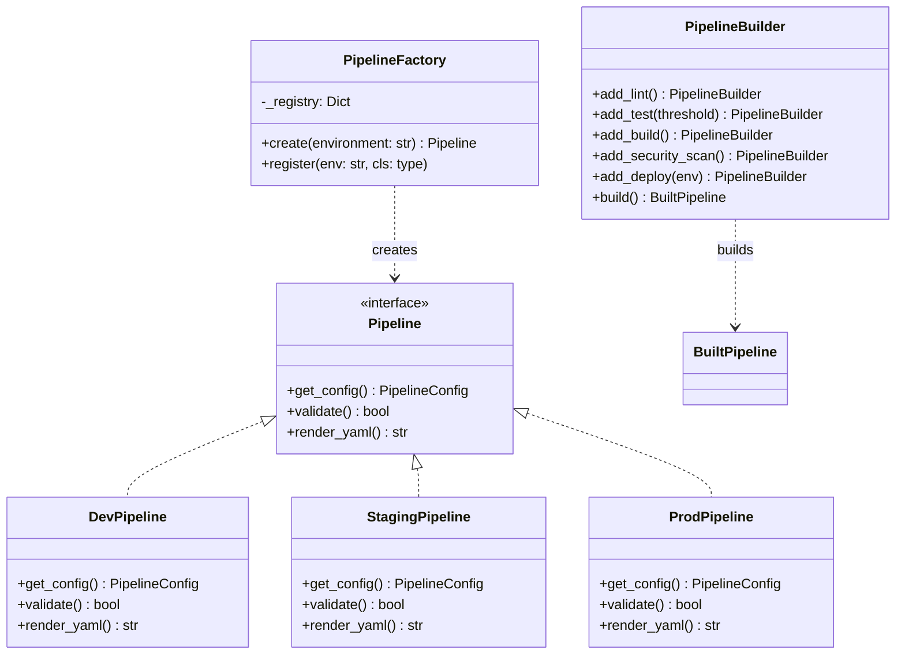

# Ch08. 생성 패턴과 클라우드 네이티브

**핵심 질문**: "Factory/Builder로 클라우드 파이프라인을 어떻게 구성하는가?"

---

## 🎯 학습 목표

1. 생성 패턴(Factory, Builder, Singleton, Prototype)이 클라우드 CI/CD에서 해결하는 문제를 설명할 수 있다
2. Factory 패턴으로 환경(dev/staging/prod)별 파이프라인을 동적으로 생성하는 코드를 작성할 수 있다
3. Builder 패턴으로 단계별로 파이프라인을 조립하는 Fluent API를 구현할 수 있다
4. AWS CodePipeline을 Terraform으로 프로비저닝하는 전체 구성을 이해한다
5. GitHub Actions matrix 전략으로 멀티클라우드 파이프라인을 병렬 실행할 수 있다
6. Singleton과 Prototype 패턴이 클라우드 리소스 재사용에서 어떤 역할을 하는지 설명할 수 있다

---

## 1. 생성 패턴이 클라우드 CI/CD에서 해결하는 문제

클라우드 CI/CD 파이프라인은 환경이 많아질수록 관리 부담이 기하급수적으로 증가한다. dev, staging, prod 세 환경만 있어도, 각각 다른 계정, 다른 보안 정책, 다른 승인 게이트가 필요하다. 여기에 AWS, GCP, Azure 같은 멀티클라우드 전략까지 더하면 파이프라인 정의 파일이 수십 개로 늘어난다.

전통적인 접근법은 환경마다 YAML 파일을 복사하고 값을 바꾸는 방식이다. 이 방식의 문제는 명확하다. 한 곳에서 버그를 고치면 다른 모든 파일에도 동일한 수정을 해야 한다. 생성 패턴은 이 문제를 "파이프라인을 어떻게 만드는지"를 코드로 캡슐화하여 해결한다.

생성 패턴이 클라우드 CI/CD에서 실질적으로 해결하는 문제는 세 가지다. 첫째는 환경별 파이프라인 생성의 일관성이다. Factory가 공통 로직을 품고 환경별 차이만 주입하므로, 모든 환경이 동일한 구조적 품질을 보장한다. 둘째는 인프라 프로비저닝의 반복 제거다. Builder가 Terraform 모듈이나 CloudFormation 스택을 단계적으로 조립하므로, 팀이 자신만의 파이프라인을 조합할 수 있다. 셋째는 공유 리소스의 올바른 관리다. Singleton이 ECR 레지스트리나 Artifact Bucket처럼 팀 전체가 공유하는 인프라를 단 하나의 인스턴스로 관리하게 한다.

---

## 2. Factory 패턴: Pipeline Factory

### 문제: 환경별 별도 파이프라인 파일

아래 코드는 안티패턴이다. 환경이 늘어날수록 중복 파일이 증가하고, 하나를 수정하면 나머지도 모두 수정해야 한다.

```yaml
# BAD: 환경마다 별도 파일 — 중복이 고착화된다
# pipeline-dev.yml, pipeline-staging.yml, pipeline-prod.yml 이 세 파일은
# 거의 동일한 내용이지만 승인 단계, 알림 설정, 리소스 크기만 다르다.
# 한 곳의 버그가 다른 파일로 퍼지지 않는다는 보장이 없다.
name: Deploy Dev
on: [push]
jobs:
  deploy:
    runs-on: ubuntu-latest
    steps:
      - name: Deploy to dev
        run: aws deploy dev
```

### 해결: Pipeline Factory

Factory 패턴은 "어떤 파이프라인을 생성할지"와 "어떻게 생성하는지"를 분리한다. 호출자는 환경 이름만 전달하고, Factory가 나머지 세부사항을 결정한다.

```python
# GOOD: Pipeline Factory — 환경 이름만 받아 완전한 파이프라인을 반환한다
# 왜 Factory인가? 환경마다 생성 로직이 달라도 호출 인터페이스는 동일해야 하기 때문이다.
from dataclasses import dataclass, field
from typing import Protocol, List, Dict, Any

@dataclass
class PipelineConfig:
    """파이프라인 설정 — 환경별로 다른 값을 품는다."""
    environment: str
    region: str
    approval_required: bool
    notification_channel: str
    compute_size: str          # "small" | "medium" | "large"
    artifact_retention_days: int
    extra_steps: List[str] = field(default_factory=list)

class Pipeline(Protocol):
    """모든 파이프라인이 따르는 인터페이스."""
    def get_config(self) -> PipelineConfig: ...
    def validate(self) -> bool: ...
    def render_yaml(self) -> str: ...

class DevPipeline:
    """개발 환경 파이프라인 — 빠른 피드백을 최우선으로 한다."""
    def __init__(self):
        self._config = PipelineConfig(
            environment="dev",
            region="ap-northeast-2",
            approval_required=False,    # 개발은 수동 승인 없이 자동 배포
            notification_channel="#dev-alerts",
            compute_size="small",       # 비용 절감
            artifact_retention_days=7,
        )

    def get_config(self) -> PipelineConfig:
        return self._config

    def validate(self) -> bool:
        return self._config.region != ""

    def render_yaml(self) -> str:
        return f"# Dev pipeline for {self._config.environment}"

class StagingPipeline:
    """스테이징 환경 파이프라인 — 프로덕션을 최대한 모방한다."""
    def __init__(self):
        self._config = PipelineConfig(
            environment="staging",
            region="ap-northeast-2",
            approval_required=False,    # QA 자동화가 승인을 대신한다
            notification_channel="#staging-alerts",
            compute_size="medium",
            artifact_retention_days=14,
            extra_steps=["integration-test", "performance-test"],
        )

    def get_config(self) -> PipelineConfig:
        return self._config

    def validate(self) -> bool:
        return len(self._config.extra_steps) > 0  # 스테이징은 통합 테스트 필수

    def render_yaml(self) -> str:
        return f"# Staging pipeline for {self._config.environment}"

class ProdPipeline:
    """프로덕션 환경 파이프라인 — 안전과 추적성을 최우선으로 한다."""
    def __init__(self):
        self._config = PipelineConfig(
            environment="prod",
            region="ap-northeast-2",
            approval_required=True,     # 프로덕션은 반드시 사람이 승인한다
            notification_channel="#prod-deploy",
            compute_size="large",
            artifact_retention_days=90, # 규정 준수를 위해 장기 보관
            extra_steps=["smoke-test", "canary-deploy", "rollback-check"],
        )

    def get_config(self) -> PipelineConfig:
        return self._config

    def validate(self) -> bool:
        return (self._config.approval_required and
                "smoke-test" in self._config.extra_steps)

    def render_yaml(self) -> str:
        return f"# Prod pipeline for {self._config.environment}"

class PipelineFactory:
    """환경 이름을 받아 적절한 파이프라인을 반환한다.

    새로운 환경이 추가되면 이 클래스만 수정하면 된다.
    호출 코드는 변경할 필요가 없다 — 이것이 Factory 패턴의 핵심 가치다.
    """
    _registry: Dict[str, type] = {
        "dev": DevPipeline,
        "staging": StagingPipeline,
        "prod": ProdPipeline,
    }

    @classmethod
    def create(cls, environment: str) -> Pipeline:
        pipeline_class = cls._registry.get(environment)
        if pipeline_class is None:
            available = list(cls._registry.keys())
            raise ValueError(f"Unknown environment '{environment}'. Available: {available}")
        return pipeline_class()

    @classmethod
    def register(cls, environment: str, pipeline_class: type) -> None:
        """런타임에 새 환경을 동적으로 등록한다 — 플러그인 확장에 활용한다."""
        cls._registry[environment] = pipeline_class

# 사용 예시
pipeline = PipelineFactory.create("prod")
config = pipeline.get_config()
assert config.approval_required is True   # 프로덕션은 항상 승인 필요
```

---

## 3. Builder 패턴: Pipeline Builder

Factory는 완성된 파이프라인을 반환하지만, Builder는 파이프라인을 단계별로 조립한다. 팀마다 필요한 단계가 다를 때 Builder가 빛을 발한다. Fluent API 스타일로 구현하면 파이프라인 정의가 자연어처럼 읽힌다.

```python
# Pipeline Builder — Fluent API로 파이프라인을 조립한다
# 왜 Builder인가? 선택적 단계가 많고 조합이 다양할 때 생성자 인자가 폭발하는 문제를 막기 위해서다.
from typing import Optional, List, Callable

class PipelineStep:
    def __init__(self, name: str, runner: str, commands: List[str],
                 condition: Optional[str] = None):
        self.name = name
        self.runner = runner
        self.commands = commands
        self.condition = condition  # 조건부 실행 — None이면 항상 실행

class BuiltPipeline:
    def __init__(self, name: str, steps: List[PipelineStep],
                 on_failure: Optional[Callable] = None):
        self.name = name
        self.steps = steps
        self.on_failure = on_failure

    def step_count(self) -> int:
        return len(self.steps)

class PipelineBuilder:
    """단계를 메서드 체인으로 추가하여 파이프라인을 조립한다."""

    def __init__(self, name: str):
        self._name = name
        self._steps: List[PipelineStep] = []
        self._on_failure: Optional[Callable] = None

    def add_lint(self, runner: str = "ubuntu-latest") -> "PipelineBuilder":
        """코드 품질 검사 — 빌드 전에 반드시 실행해야 빠른 실패를 보장한다."""
        self._steps.append(PipelineStep(
            name="lint",
            runner=runner,
            commands=["pip install flake8", "flake8 src/"],
        ))
        return self  # 자신을 반환하여 메서드 체인을 가능하게 한다

    def add_test(self, coverage_threshold: int = 80) -> "PipelineBuilder":
        """테스트 실행 — 커버리지 임계값을 Builder 레벨에서 주입한다."""
        self._steps.append(PipelineStep(
            name="test",
            runner="ubuntu-latest",
            commands=[
                "pip install pytest pytest-cov",
                f"pytest --cov=src --cov-fail-under={coverage_threshold}",
            ],
        ))
        return self

    def add_build(self, dockerfile: str = "Dockerfile") -> "PipelineBuilder":
        self._steps.append(PipelineStep(
            name="build",
            runner="ubuntu-latest",
            commands=[f"docker build -f {dockerfile} -t app:latest ."],
        ))
        return self

    def add_security_scan(self) -> "PipelineBuilder":
        """보안 스캔 — 선택적 단계이므로 Builder로 조건부 추가한다."""
        self._steps.append(PipelineStep(
            name="security-scan",
            runner="ubuntu-latest",
            commands=["trivy image app:latest --exit-code 1 --severity HIGH,CRITICAL"],
        ))
        return self

    def add_deploy(self, environment: str,
                   requires_approval: bool = False) -> "PipelineBuilder":
        condition = f"environment == '{environment}' && approved" if requires_approval else None
        self._steps.append(PipelineStep(
            name=f"deploy-{environment}",
            runner="ubuntu-latest",
            commands=[f"./deploy.sh {environment}"],
            condition=condition,
        ))
        return self

    def on_failure(self, callback: Callable) -> "PipelineBuilder":
        self._on_failure = callback
        return self

    def build(self) -> BuiltPipeline:
        """조립된 모든 단계를 하나의 파이프라인으로 확정한다."""
        if not self._steps:
            raise ValueError("파이프라인에 단계가 없다 — 최소 하나의 단계가 필요하다")
        return BuiltPipeline(
            name=self._name,
            steps=self._steps,
            on_failure=self._on_failure,
        )

# 사용 예시 — Fluent API는 의도를 코드 그 자체로 표현한다
prod_pipeline = (
    PipelineBuilder("production-deploy")
    .add_lint()
    .add_test(coverage_threshold=90)  # 프로덕션은 커버리지 기준을 높인다
    .add_build()
    .add_security_scan()              # 프로덕션에만 보안 스캔 추가
    .add_deploy("prod", requires_approval=True)
    .build()
)

assert prod_pipeline.step_count() == 5
```

---

## 4. AWS CodePipeline Terraform 전체 구성

AWS CodePipeline은 S3 → CodeBuild → ECS 배포까지 클라우드 네이티브 파이프라인을 완전 관리형으로 제공한다. Terraform으로 이를 코드화하면 파이프라인 자체가 버전 관리되는 인프라가 된다.

```hcl
# AWS CodePipeline 전체 구성 — S3 아티팩트 버킷, IAM 역할, CodeBuild, CodePipeline을 모두 포함한다
# 왜 모두 한 파일에? 이 리소스들은 함께 생성·삭제되는 생명주기를 공유하기 때문이다.

terraform {
  required_providers {
    aws = { source = "hashicorp/aws", version = "~> 5.0" }
  }
}

variable "app_name"    { default = "my-app" }
variable "environment" { default = "prod" }
variable "region"      { default = "ap-northeast-2" }

locals {
  name_prefix = "${var.app_name}-${var.environment}"
}

# ─── S3: 파이프라인 아티팩트 저장소 ───────────────────────────────────────
# 파이프라인 단계 간 아티팩트를 전달하는 공유 버킷이다.
# versioning은 파이프라인 실패 시 이전 아티팩트로 롤백을 가능하게 한다.
resource "aws_s3_bucket" "artifacts" {
  bucket        = "${local.name_prefix}-pipeline-artifacts"
  force_destroy = var.environment != "prod"  # 프로덕션 버킷은 실수로 삭제되지 않도록
}

resource "aws_s3_bucket_versioning" "artifacts" {
  bucket = aws_s3_bucket.artifacts.id
  versioning_configuration { status = "Enabled" }
}

resource "aws_s3_bucket_lifecycle_configuration" "artifacts" {
  bucket = aws_s3_bucket.artifacts.id
  rule {
    id     = "expire-old-artifacts"
    status = "Enabled"
    expiration { days = 30 }  # 30일 지난 아티팩트는 자동 삭제 — 비용 제어
  }
}

# ─── IAM: CodePipeline 서비스 역할 ────────────────────────────────────────
# CodePipeline이 S3, CodeBuild, ECS에 접근하기 위한 최소 권한 역할이다.
resource "aws_iam_role" "codepipeline" {
  name = "${local.name_prefix}-codepipeline-role"
  assume_role_policy = jsonencode({
    Version = "2012-10-17"
    Statement = [{
      Effect    = "Allow"
      Principal = { Service = "codepipeline.amazonaws.com" }
      Action    = "sts:AssumeRole"
    }]
  })
}

resource "aws_iam_role_policy" "codepipeline" {
  role = aws_iam_role.codepipeline.id
  policy = jsonencode({
    Version = "2012-10-17"
    Statement = [
      {
        Effect   = "Allow"
        Action   = ["s3:GetObject", "s3:PutObject", "s3:GetBucketVersioning"]
        Resource = ["${aws_s3_bucket.artifacts.arn}/*", aws_s3_bucket.artifacts.arn]
      },
      {
        Effect   = "Allow"
        Action   = ["codebuild:BatchGetBuilds", "codebuild:StartBuild"]
        Resource = aws_codebuild_project.build.arn
      },
      {
        Effect   = "Allow"
        Action   = ["ecs:DescribeServices", "ecs:UpdateService"]
        Resource = "*"
      }
    ]
  })
}

# ─── IAM: CodeBuild 서비스 역할 ────────────────────────────────────────────
resource "aws_iam_role" "codebuild" {
  name = "${local.name_prefix}-codebuild-role"
  assume_role_policy = jsonencode({
    Version = "2012-10-17"
    Statement = [{
      Effect    = "Allow"
      Principal = { Service = "codebuild.amazonaws.com" }
      Action    = "sts:AssumeRole"
    }]
  })
}

resource "aws_iam_role_policy_attachment" "codebuild_ecr" {
  role       = aws_iam_role.codebuild.name
  policy_arn = "arn:aws:iam::aws:policy/AmazonEC2ContainerRegistryPowerUser"
}

# ─── CodeBuild: 빌드 프로젝트 ──────────────────────────────────────────────
# buildspec.yml에 정의된 빌드 단계를 실행하는 관리형 빌드 환경이다.
resource "aws_codebuild_project" "build" {
  name          = "${local.name_prefix}-build"
  service_role  = aws_iam_role.codebuild.arn
  build_timeout = 20  # 분 단위 — 느린 빌드를 조기에 실패시켜 비용을 아낀다

  source {
    type      = "CODEPIPELINE"
    buildspec = "buildspec.yml"
  }

  artifacts {
    type = "CODEPIPELINE"  # 결과물을 파이프라인 아티팩트 버킷으로 자동 업로드
  }

  environment {
    type            = "LINUX_CONTAINER"
    compute_type    = "BUILD_GENERAL1_SMALL"   # dev/staging은 SMALL, prod는 MEDIUM 권장
    image           = "aws/codebuild/standard:7.0"
    privileged_mode = true  # Docker 빌드에 필요 — 프로덕션 환경에서는 보안 검토 필수

    environment_variable {
      name  = "ENVIRONMENT"
      value = var.environment
    }
    environment_variable {
      name  = "ECR_REPOSITORY"
      value = aws_ecr_repository.app.repository_url
    }
  }
}

# ─── ECR: 컨테이너 이미지 레지스트리 (Singleton 역할) ──────────────────────
# 모든 환경의 파이프라인이 이 하나의 레지스트리를 공유한다 — Singleton 패턴이다.
resource "aws_ecr_repository" "app" {
  name                 = var.app_name
  image_tag_mutability = "IMMUTABLE"  # 같은 태그로 이미지를 덮어쓰는 사고를 방지

  image_scanning_configuration { scan_on_push = true }  # 푸시마다 취약점 자동 스캔
}

# ─── CodePipeline: 파이프라인 오케스트레이션 ──────────────────────────────
resource "aws_codepipeline" "main" {
  name     = "${local.name_prefix}-pipeline"
  role_arn = aws_iam_role.codepipeline.arn

  artifact_store {
    location = aws_s3_bucket.artifacts.bucket
    type     = "S3"
  }

  # 1단계: 소스 — GitHub에서 코드를 가져온다
  stage {
    name = "Source"
    action {
      name             = "GitHub-Source"
      category         = "Source"
      owner            = "ThirdParty"
      provider         = "GitHub"
      version          = "1"
      output_artifacts = ["source_output"]
      configuration = {
        Owner      = "my-org"
        Repo       = var.app_name
        Branch     = var.environment == "prod" ? "main" : var.environment
        OAuthToken = "{{resolve:secretsmanager:github-token}}"  # Secrets Manager에서 주입
      }
    }
  }

  # 2단계: 빌드 — CodeBuild로 Docker 이미지를 만들고 ECR에 푸시한다
  stage {
    name = "Build"
    action {
      name             = "CodeBuild"
      category         = "Build"
      owner            = "AWS"
      provider         = "CodeBuild"
      version          = "1"
      input_artifacts  = ["source_output"]
      output_artifacts = ["build_output"]
      configuration = {
        ProjectName = aws_codebuild_project.build.name
      }
    }
  }

  # 3단계: 배포 — ECS 서비스를 새 이미지로 업데이트한다
  stage {
    name = "Deploy"
    action {
      name            = "ECS-Deploy"
      category        = "Deploy"
      owner           = "AWS"
      provider        = "ECS"
      version         = "1"
      input_artifacts = ["build_output"]
      configuration = {
        ClusterName = "${local.name_prefix}-cluster"
        ServiceName = "${local.name_prefix}-service"
        FileName    = "imagedefinitions.json"  # CodeBuild가 생성하는 ECS 배포 명세
      }
    }
  }
}

output "pipeline_arn"        { value = aws_codepipeline.main.arn }
output "ecr_repository_url"  { value = aws_ecr_repository.app.repository_url }
output "artifact_bucket_name" { value = aws_s3_bucket.artifacts.bucket }
```

---

## 5. 멀티클라우드 Matrix 워크플로우

GitHub Actions의 matrix 전략은 Factory 패턴의 선언적 버전이다. Python 코드 대신 YAML 선언으로 "어떤 조합으로 파이프라인을 실행할지"를 표현한다. cloud와 env 두 축의 조합을 정의하면, GitHub Actions가 나머지 조합을 자동으로 생성한다.

```yaml
# 멀티클라우드 병렬 배포 — matrix가 Factory 패턴을 선언적으로 표현한다
# 왜 matrix인가? 6개 조합(3 clouds × 2 envs)을 별도 job으로 작성하면
# 변경 시 모든 job을 수정해야 하지만, matrix는 한 곳만 수정하면 된다.
name: Multi-Cloud Deploy

on:
  push:
    branches: [main, staging]

jobs:
  deploy:
    name: Deploy to ${{ matrix.cloud }}/${{ matrix.env }}
    runs-on: ubuntu-latest

    strategy:
      fail-fast: false    # 한 클라우드 실패가 다른 클라우드 배포를 막지 않는다
      matrix:
        cloud: [aws, gcp, azure]
        env:   [dev, prod]
        # prod는 main 브랜치에서만, dev는 staging 브랜치에서만 실행
        exclude:
          - { cloud: aws,   env: prod, branch: staging }
          - { cloud: gcp,   env: dev,  branch: main    }
          - { cloud: azure, env: dev,  branch: main    }

    steps:
      - uses: actions/checkout@v4

      - name: Configure cloud credentials
        # 클라우드별 인증 방식이 다르므로 분기 처리한다
        run: |
          case "${{ matrix.cloud }}" in
            aws)   echo "AWS_REGION=ap-northeast-2" >> $GITHUB_ENV ;;
            gcp)   echo "GCP_PROJECT=${{ secrets.GCP_PROJECT }}" >> $GITHUB_ENV ;;
            azure) echo "AZURE_RG=my-resource-group" >> $GITHUB_ENV ;;
          esac

      - name: Deploy
        env:
          CLOUD:       ${{ matrix.cloud }}
          ENVIRONMENT: ${{ matrix.env }}
        run: ./scripts/deploy.sh ${{ matrix.cloud }} ${{ matrix.env }}
```

---

## 6. Singleton 패턴: 공유 인프라 관리

Singleton은 단 하나의 인스턴스를 보장하는 패턴이다. 클라우드 CI/CD에서 ECR 레지스트리, 아티팩트 S3 버킷, 공통 VPC 같은 리소스는 팀 전체가 공유한다. 이런 리소스를 각 파이프라인이 독립적으로 생성하면 비용이 중복되고 거버넌스가 무너진다.

```hcl
# Singleton 패턴: 공유 레지스트리 — 모든 파이프라인이 하나의 ECR을 참조한다
# 왜 Singleton인가? 컨테이너 이미지는 한 레지스트리에서 관리되어야
# 이미지 스캔, 보존 정책, 접근 제어를 일관되게 적용할 수 있기 때문이다.

# shared-infra/ecr.tf — 이 파일은 한 번만 apply된다
resource "aws_ecr_repository" "shared" {
  for_each = toset(["api", "worker", "scheduler"])  # 서비스별로 하나씩

  name                 = "shared/${each.key}"
  image_tag_mutability = "IMMUTABLE"

  lifecycle_policy {
    policy = jsonencode({
      rules = [{
        rulePriority = 1
        description  = "최근 20개 이미지만 보관 — 레지스트리 비용 제어"
        action       = { type = "expire" }
        selection    = { tagStatus = "any", countType = "imageCountMoreThan", countNumber = 20 }
      }]
    })
  }
}

# 각 팀의 파이프라인은 데이터 소스로 이 레지스트리를 참조한다 (생성하지 않는다)
data "aws_ecr_repository" "api" {
  name = "shared/api"  # 이미 존재하는 Singleton 레지스트리를 참조
}
```

---

## 7. Prototype 패턴: 파이프라인 템플릿 복제

Prototype은 기존 객체를 복사하여 새 객체를 만드는 패턴이다. 기본 파이프라인 템플릿을 정의하고, 각 팀이 이를 복제하여 자신만의 커스터마이징을 더하는 방식으로 활용한다.

```python
# Prototype 패턴: 기본 템플릿에서 팀별 파이프라인을 파생시킨다
import copy
from dataclasses import dataclass, field
from typing import List, Dict, Any

@dataclass
class PipelineTemplate:
    """복제의 기반이 되는 기본 파이프라인 템플릿."""
    stages: List[str] = field(default_factory=lambda: ["lint", "test", "build"])
    env_vars: Dict[str, str] = field(default_factory=dict)
    notifications: List[str] = field(default_factory=lambda: ["#general-alerts"])

    def clone(self) -> "PipelineTemplate":
        """깊은 복사로 독립적인 복제본을 반환한다.

        얕은 복사(copy.copy)는 리스트 참조를 공유하므로
        한 팀의 수정이 다른 팀 템플릿을 오염시킨다.
        """
        return copy.deepcopy(self)

# 기본 템플릿 정의
base_template = PipelineTemplate(
    stages=["lint", "test", "build", "push"],
    env_vars={"REGISTRY": "123456789.dkr.ecr.ap-northeast-2.amazonaws.com"},
)

# 팀 A: 기본 템플릿을 복제하고 보안 스캔 추가
team_a_pipeline = base_template.clone()
team_a_pipeline.stages.append("security-scan")
team_a_pipeline.notifications = ["#team-a-deploys"]

# 팀 B: 같은 기본 템플릿을 복제하고 성능 테스트 추가
team_b_pipeline = base_template.clone()
team_b_pipeline.stages.append("perf-test")
team_b_pipeline.env_vars["LOAD_TEST_TARGET"] = "https://staging.example.com"

# 기본 템플릿은 변경되지 않았다 — 복제본만 수정되었다
assert "security-scan" not in base_template.stages
assert "perf-test" not in base_template.stages
assert len(team_a_pipeline.stages) == 5
assert len(team_b_pipeline.stages) == 5
```

---

## 8. 패턴 선택 가이드



| 패턴 | 사용 시점 | 클라우드 CI/CD 예시 |
|------|-----------|---------------------|
| Factory | 환경마다 파이프라인 종류가 다를 때 | dev/staging/prod 파이프라인 자동 생성 |
| Builder | 선택적 단계 조합이 많을 때 | lint/test/scan/deploy 단계 선택 조립 |
| Singleton | 팀 전체가 공유하는 인프라 | ECR 레지스트리, S3 아티팩트 버킷 |
| Prototype | 기본 템플릿에서 팀별로 파생할 때 | 공통 파이프라인 템플릿 → 팀 커스터마이징 |

---

## 핵심 요약

생성 패턴은 "파이프라인을 어떻게 만드는지"를 코드로 캡슐화한다. Factory는 환경 이름만으로 완전한 파이프라인을 반환하고, Builder는 단계를 하나씩 쌓아 유연한 조합을 만들며, Singleton은 공유 인프라를 단 하나의 진실된 원본으로 관리하고, Prototype은 기존 템플릿을 안전하게 복제하여 팀별 변형을 허용한다.

AWS CodePipeline과 Terraform의 조합은 이 패턴들을 인프라 코드 수준에서 실현한다. 파이프라인 자체가 버전 관리되는 인프라가 되면, 파이프라인의 변경 이력을 추적하고, 실패 시 이전 상태로 되돌리고, 코드 리뷰를 통해 파이프라인 변경을 승인하는 것이 가능해진다.

---

*다음 챕터*: Ch09 측정·감사·성숙도 — 파이프라인 품질을 어떻게 수치로 측정하는가
