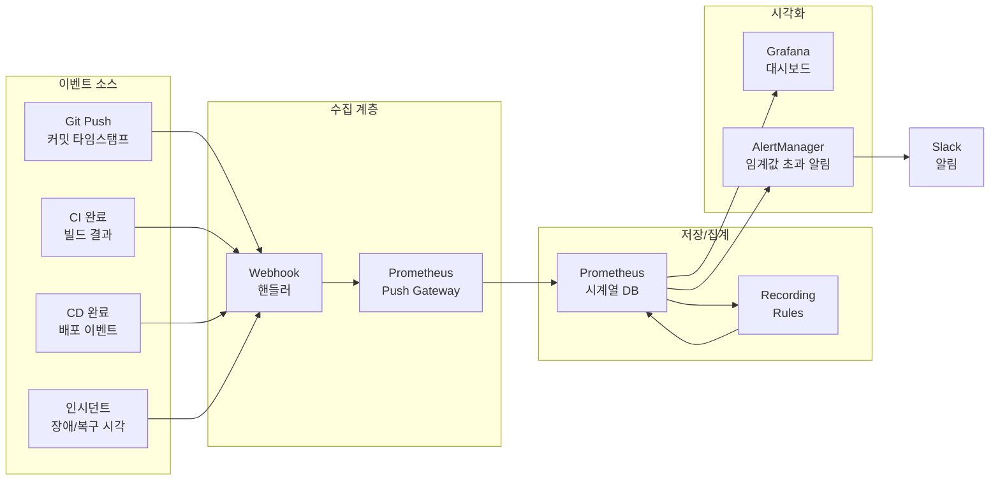

# Ch09. 측정, 감사, 성숙도 모델

**핵심 질문**: "CI/CD 성과를 어떻게 측정하고 조직 성숙도를 평가하는가?"

---

## 🎯 학습 목표

1. DORA 4대 메트릭의 계산 방법과 수집 전략을 설명할 수 있다.
2. Grafana 대시보드를 JSON 설정으로 구성하고 DORA 메트릭을 시각화할 수 있다.
3. SonarQube Quality Gate를 설정하고 파이프라인과 연동할 수 있다.
4. CI/CD 성숙도 5단계 모델로 현재 조직 수준을 진단할 수 있다.
5. 파이프라인 감사(Audit) 자동화로 컴플라이언스 요구사항을 충족할 수 있다.
6. 성숙도 평가 체크리스트를 활용해 개선 우선순위를 도출할 수 있다.

---

## 1. DORA 4대 메트릭 심화

Google의 DevOps Research and Assessment(DORA) 팀은 수년간의 연구를 통해 소프트웨어 전달 성과를 대표하는 4가지 메트릭을 정립했다. 이 메트릭들이 중요한 이유는 단순히 속도만이 아니라 안정성과의 균형을 함께 측정하기 때문이다. 배포 빈도와 리드 타임은 속도를, 변경 실패율과 MTTR은 안정성을 나타낸다.

### 1.1 Deployment Frequency (배포 빈도)

배포 빈도는 프로덕션에 코드를 얼마나 자주 배포하는지를 측정한다. 빈번한 배포는 배치 크기를 줄여 위험을 분산시키고, 피드백 루프를 단축시킨다.

**계산 방법**: 특정 기간(일/주/월) 동안의 프로덕션 배포 횟수

| 수준 | 기준 | 특징 |
|------|------|------|
| Elite | 하루 여러 번 | 배포가 일상적인 이벤트 |
| High | 주 1회 ~ 월 1회 | 계획된 릴리스 사이클 |
| Medium | 월 1회 ~ 6개월 1회 | 분기별 릴리스 |
| Low | 6개월 미만 | 대규모 빅뱅 릴리스 |

**수집 방법**: CI/CD 플랫폼(Jenkins, GitHub Actions)의 성공한 프로덕션 배포 이벤트를 Prometheus 푸시 게이트웨이로 전송하거나, 배포 로그를 파싱해 집계한다.

### 1.2 Lead Time for Changes (변경 리드 타임)

코드가 커밋된 시점부터 프로덕션에서 실행되는 시점까지의 시간이다. 이 수치가 클수록 피드백 주기가 길고 위험이 누적된다.

**계산 방법**: `프로덕션 배포 타임스탬프 - 최초 커밋 타임스탬프`

| 수준 | 기준 |
|------|------|
| Elite | 1시간 미만 |
| High | 1일 ~ 1주 |
| Medium | 1주 ~ 1개월 |
| Low | 1개월 이상 |

**수집 방법**: Git 커밋 SHA와 배포 이벤트를 연결한다. 배포 시점에 해당 배포에 포함된 커밋 목록을 조회하고, 가장 오래된 커밋의 타임스탬프를 기준으로 삼는다.

### 1.3 Change Failure Rate (변경 실패율)

배포된 변경 중 프로덕션 장애나 롤백을 유발한 비율이다. 낮을수록 변경이 안정적으로 전달되고 있다는 의미다.

**계산 방법**: `장애를 유발한 배포 수 / 전체 배포 수 × 100`

| 수준 | 기준 |
|------|------|
| Elite | 0~15% |
| High | 16~30% |
| Medium | 16~30% |
| Low | 46~60% |

### 1.4 MTTR (Mean Time to Restore — 복구 평균 시간)

프로덕션 장애 발생부터 서비스가 복구될 때까지 걸리는 평균 시간이다. MTTR이 짧다는 것은 장애 탐지, 진단, 수정, 배포 전 과정이 효율적임을 뜻한다.

**계산 방법**: `서비스 복구 타임스탬프 - 장애 감지 타임스탬프`의 평균

| 수준 | 기준 |
|------|------|
| Elite | 1시간 미만 |
| High | 1일 미만 |
| Medium | 1일 ~ 1주 |
| Low | 1주 이상 |

---

## 2. Grafana 대시보드 구성

DORA 메트릭을 시각화하려면 데이터 소스(Prometheus)와 대시보드(Grafana)를 연결해야 한다. 아래는 4개 패널을 포함하는 완전한 대시보드 JSON이다. 이 설정을 Grafana의 Import 기능에 붙여넣으면 즉시 대시보드를 구성할 수 있다.

```json
{
  "__inputs": [
    {
      "name": "DS_PROMETHEUS",
      "label": "Prometheus",
      "description": "DORA 메트릭을 수집하는 Prometheus 데이터 소스",
      "type": "datasource",
      "pluginId": "prometheus",
      "pluginName": "Prometheus"
    }
  ],
  "title": "DORA Metrics Dashboard",
  "uid": "dora-metrics-v1",
  "schemaVersion": 38,
  "version": 1,
  "refresh": "5m",
  "time": { "from": "now-30d", "to": "now" },
  "templating": {
    "list": [
      {
        "name": "environment",
        "type": "query",
        "datasource": { "type": "prometheus", "uid": "${DS_PROMETHEUS}" },
        "query": "label_values(deployment_total, environment)",
        "label": "환경",
        "current": { "value": "production" }
      }
    ]
  },
  "panels": [
    {
      "id": 1,
      "title": "배포 빈도 (일별)",
      "type": "gauge",
      "gridPos": { "h": 8, "w": 6, "x": 0, "y": 0 },
      "datasource": { "type": "prometheus", "uid": "${DS_PROMETHEUS}" },
      "targets": [
        {
          "expr": "sum(increase(deployment_total{environment=\"$environment\", status=\"success\"}[1d]))",
          "legendFormat": "배포 횟수/일",
          "refId": "A"
        }
      ],
      "options": {
        "reduceOptions": { "calcs": ["lastNotNull"] },
        "orientation": "auto",
        "showThresholdLabels": true
      },
      "fieldConfig": {
        "defaults": {
          "unit": "short",
          "thresholds": {
            "mode": "absolute",
            "steps": [
              { "color": "red", "value": null },
              { "color": "yellow", "value": 1 },
              { "color": "green", "value": 3 }
            ]
          },
          "mappings": []
        }
      }
    },
    {
      "id": 2,
      "title": "변경 리드 타임 (시간)",
      "type": "timeseries",
      "gridPos": { "h": 8, "w": 10, "x": 6, "y": 0 },
      "datasource": { "type": "prometheus", "uid": "${DS_PROMETHEUS}" },
      "targets": [
        {
          "expr": "histogram_quantile(0.50, rate(lead_time_seconds_bucket{environment=\"$environment\"}[7d])) / 3600",
          "legendFormat": "p50 리드 타임 (h)",
          "refId": "A"
        },
        {
          "expr": "histogram_quantile(0.95, rate(lead_time_seconds_bucket{environment=\"$environment\"}[7d])) / 3600",
          "legendFormat": "p95 리드 타임 (h)",
          "refId": "B"
        }
      ],
      "fieldConfig": {
        "defaults": {
          "unit": "h",
          "custom": { "lineWidth": 2, "fillOpacity": 10 }
        }
      }
    },
    {
      "id": 3,
      "title": "변경 실패율 (%)",
      "type": "stat",
      "gridPos": { "h": 8, "w": 4, "x": 16, "y": 0 },
      "datasource": { "type": "prometheus", "uid": "${DS_PROMETHEUS}" },
      "targets": [
        {
          "expr": "sum(increase(deployment_total{environment=\"$environment\", status=\"failure\"}[30d])) / sum(increase(deployment_total{environment=\"$environment\"}[30d])) * 100",
          "legendFormat": "CFR",
          "refId": "A"
        }
      ],
      "options": { "reduceOptions": { "calcs": ["lastNotNull"] }, "colorMode": "background" },
      "fieldConfig": {
        "defaults": {
          "unit": "percent",
          "thresholds": {
            "mode": "absolute",
            "steps": [
              { "color": "green", "value": null },
              { "color": "yellow", "value": 15 },
              { "color": "red", "value": 30 }
            ]
          }
        }
      }
    },
    {
      "id": 4,
      "title": "MTTR (시간)",
      "type": "stat",
      "gridPos": { "h": 8, "w": 4, "x": 20, "y": 0 },
      "datasource": { "type": "prometheus", "uid": "${DS_PROMETHEUS}" },
      "targets": [
        {
          "expr": "avg(incident_recovery_seconds{environment=\"$environment\"}) / 3600",
          "legendFormat": "평균 복구 시간",
          "refId": "A"
        }
      ],
      "options": { "reduceOptions": { "calcs": ["lastNotNull"] }, "colorMode": "background" },
      "fieldConfig": {
        "defaults": {
          "unit": "h",
          "thresholds": {
            "mode": "absolute",
            "steps": [
              { "color": "green", "value": null },
              { "color": "yellow", "value": 1 },
              { "color": "red", "value": 24 }
            ]
          }
        }
      }
    }
  ]
}
```

---

## 3. Prometheus Recording Rules — DORA 메트릭

Recording Rule은 쿼리 결과를 미리 계산해 저장하는 방식이다. DORA 메트릭처럼 매번 집계가 필요한 쿼리는 recording rule로 사전 계산해두면 대시보드 응답 속도가 크게 개선된다.

```yaml
# prometheus/rules/dora-metrics.yml
groups:
  - name: dora_metrics
    interval: 5m
    rules:
      # 배포 빈도: 지난 24시간 성공 배포 횟수
      - record: dora:deployment_frequency:daily
        expr: |
          sum by (environment, service) (
            increase(deployment_total{status="success"}[24h])
          )

      # 변경 실패율: 최근 30일 기준
      - record: dora:change_failure_rate:30d
        expr: |
          sum by (environment) (
            increase(deployment_total{status="failure"}[30d])
          )
          /
          sum by (environment) (
            increase(deployment_total[30d])
          ) * 100

      # MTTR p50: 중앙값 복구 시간 (초 → 시간 변환은 대시보드에서)
      - record: dora:mttr_seconds:p50
        expr: |
          histogram_quantile(0.50,
            sum by (le, environment) (
              rate(incident_recovery_seconds_bucket[30d])
            )
          )

      # 리드 타임 p95: 상위 5% 극단값 모니터링
      - record: dora:lead_time_seconds:p95
        expr: |
          histogram_quantile(0.95,
            sum by (le, environment) (
              rate(lead_time_seconds_bucket[7d])
            )
          )
```

---

## 4. SonarQube Quality Gate

Quality Gate는 코드 품질 기준을 정의하고, 기준 미달 시 파이프라인을 실패로 처리하는 게이트키핑 메커니즘이다. 단순히 빌드가 통과했다는 것만으로는 충분하지 않다. 코드 커버리지, 중복, 보안 취약점 등 품질 지표가 기준을 충족해야만 배포를 허용하는 것이 목적이다.

```properties
# sonar-project.properties
sonar.projectKey=my-service
sonar.projectName=My Service
sonar.sources=src/main
sonar.tests=src/test
sonar.language=java
sonar.java.binaries=target/classes

# Quality Gate 조건 (SonarQube UI에서 설정 — 여기서는 참조용)
# condition: coverage > 80%           — 신규 코드 커버리지 최소 기준
# condition: duplicated_lines < 3%    — 중복 코드 비율 상한
# condition: blocker_violations = 0   — 블로커 이슈 0 필수 (보안/치명적 버그)
# condition: critical_violations = 0  — 크리티컬 이슈도 허용하지 않음
# condition: security_hotspots_reviewed = 100%  — 보안 핫스팟 전체 검토 필수

sonar.qualitygate.wait=true   # 파이프라인이 Quality Gate 결과를 기다림
```

파이프라인에서의 연동 방법은 다음과 같다:

```yaml
# GitHub Actions — SonarQube 스캔 및 Quality Gate 검증
- name: SonarQube Scan
  uses: SonarSource/sonarqube-scan-action@master
  env:
    SONAR_TOKEN: ${{ secrets.SONAR_TOKEN }}
    SONAR_HOST_URL: ${{ secrets.SONAR_HOST_URL }}
  with:
    args: >
      -Dsonar.qualitygate.wait=true
      # wait=true 옵션: 스캔 완료 후 Quality Gate 결과를 폴링해
      # 실패 시 파이프라인 스텝을 non-zero exit으로 종료시킨다.
```

---

## 5. CI/CD 성숙도 5단계 모델

성숙도 모델은 조직이 현재 어느 수준에 있는지 파악하고, 다음 단계로 이행하기 위한 로드맵을 제시한다. 중요한 점은 모든 조직이 Elite 수준을 목표로 해야 한다는 의미가 아니라는 것이다. 비즈니스 특성과 리스크 허용 범위에 맞는 수준을 설정하는 것이 올바른 접근이다.

### Level 1 — Ad-hoc (임시방편)
- 배포 프로세스가 문서화되지 않고 사람에 따라 다르다.
- 빌드 환경이 개발자 로컬 머신에 의존한다.
- 테스트는 있을 수도, 없을 수도 있다.
- 체크리스트: `[ ]` CI 서버 존재 `[ ]` 버전 관리 사용 `[ ]` 빌드 스크립트 존재

### Level 2 — Managed (관리됨)
- CI 서버(Jenkins 등)가 있고 자동 빌드가 실행된다.
- 기본적인 단위 테스트가 파이프라인에 포함된다.
- 배포는 여전히 수동이지만 절차가 문서화되어 있다.
- 체크리스트: `[ ]` 모든 커밋에 자동 빌드 `[ ]` 테스트 커버리지 > 30% `[ ]` 배포 절차 문서화

### Level 3 — Defined (정의됨)
- 스테이징 환경 자동 배포가 구성된다.
- 코드 품질 게이트(SonarQube 등)가 파이프라인에 통합된다.
- Infrastructure as Code로 환경 일관성이 보장된다.
- 체크리스트: `[ ]` 스테이징 자동 배포 `[ ]` Quality Gate 통합 `[ ]` IaC 사용 `[ ]` 피처 플래그 사용

### Level 4 — Measured (측정됨)
- DORA 메트릭을 수집하고 대시보드에서 모니터링한다.
- 파이프라인 실행 데이터를 기반으로 병목을 식별한다.
- SLA/SLO가 정의되고 측정된다.
- 체크리스트: `[ ]` DORA 메트릭 수집 `[ ]` 알림 임계값 설정 `[ ]` SLO 정의 `[ ]` 포스트모템 프로세스

### Level 5 — Optimizing (최적화)
- 메트릭을 기반으로 파이프라인을 지속적으로 개선한다.
- 카오스 엔지니어링으로 장애 내성을 검증한다.
- 배포가 완전 자동화되고 피드백 루프가 1시간 이내다.
- 체크리스트: `[ ]` 자동 롤백 `[ ]` 카오스 엔지니어링 실행 `[ ]` 리드 타임 < 1h `[ ]` CFR < 15%

---

## 6. 감사(Audit) 자동화

규제 환경(금융, 의료)에서는 "누가, 언제, 무엇을 배포했는가"를 증명할 수 있어야 한다. 이를 수동으로 관리하면 감사 대응에 많은 시간이 소요되고 누락이 발생하기 쉽다. 파이프라인 메타데이터를 자동으로 수집하고 리포트를 생성하면 이 부담을 크게 줄일 수 있다.

```yaml
# .github/workflows/audit-report.yml
name: Audit Report Generator

on:
  # 매주 금요일 18시 — 주간 컴플라이언스 리포트 자동 생성
  schedule:
    - cron: '0 9 * * 5'
  # 수동 실행도 허용 (감사 요청 시 즉시 생성)
  workflow_dispatch:
    inputs:
      start_date:
        description: '리포트 시작일 (YYYY-MM-DD)'
        required: true
      end_date:
        description: '리포트 종료일 (YYYY-MM-DD)'
        required: true

jobs:
  generate-audit-report:
    runs-on: ubuntu-latest
    permissions:
      actions: read       # 워크플로우 실행 이력 조회
      contents: write     # 리포트 파일 커밋
      issues: write       # 리포트를 이슈로 생성 (선택)

    steps:
      - uses: actions/checkout@v4

      - name: Collect Deployment Metadata
        id: collect
        env:
          GH_TOKEN: ${{ secrets.GITHUB_TOKEN }}
        run: |
          # 지정 기간의 배포 워크플로우 실행 목록 수집
          START="${{ github.event.inputs.start_date || '7 days ago' }}"
          END="${{ github.event.inputs.end_date || 'now' }}"

          gh run list \
            --workflow=deploy.yml \
            --created ">$START" \
            --json databaseId,status,conclusion,createdAt,actor,headBranch,headSha \
            --limit 200 \
            > deployment_runs.json

          echo "collected=$(cat deployment_runs.json | jq length)" >> $GITHUB_OUTPUT

      - name: Generate Markdown Report
        run: |
          python3 scripts/generate_audit_report.py \
            --input deployment_runs.json \
            --output "audit-reports/audit-$(date +%Y-%m-%d).md" \
            --format markdown
          # 리포트 포함 항목:
          # - 총 배포 횟수, 성공/실패 분류
          # - 배포자별 통계 (책임 추적)
          # - 브랜치별 배포 분포
          # - 실패한 배포의 커밋 SHA 및 원인

      - name: Commit Report
        run: |
          git config user.name "audit-bot"
          git config user.email "audit@company.com"
          git add audit-reports/
          git commit -m "audit: weekly compliance report $(date +%Y-%m-%d)" || exit 0
          git push
```

---

## 7. 성숙도 평가 체크리스트

아래 체크리스트는 현재 CI/CD 성숙도를 정량적으로 평가하기 위한 도구다. 각 항목을 충족하면 1점, 부분적으로 충족하면 0.5점, 미충족이면 0점으로 계산한다. 총점을 항목 수로 나누면 성숙도 지수(0~1)가 나온다.

| # | 카테고리 | 항목 | 충족 여부 |
|---|----------|------|-----------|
| 1 | **소스 제어** | 모든 코드가 버전 관리 시스템에 있다 | `[ ]` |
| 2 | **소스 제어** | 피처 브랜치 전략이 정의되고 준수된다 | `[ ]` |
| 3 | **소스 제어** | main 브랜치에 직접 push가 금지된다 | `[ ]` |
| 4 | **소스 제어** | IaC(Terraform/Ansible)가 소스 제어에 포함된다 | `[ ]` |
| 5 | **빌드** | 모든 커밋에 자동 빌드가 트리거된다 | `[ ]` |
| 6 | **빌드** | 빌드는 재현 가능하다 (동일 입력 → 동일 출력) | `[ ]` |
| 7 | **빌드** | 빌드 시간이 10분 이내다 | `[ ]` |
| 8 | **빌드** | 의존성이 고정(pinned)되고 취약점을 스캔한다 | `[ ]` |
| 9 | **테스트** | 단위 테스트 커버리지가 80% 이상이다 | `[ ]` |
| 10 | **테스트** | 통합 테스트가 파이프라인에 포함된다 | `[ ]` |
| 11 | **테스트** | E2E 테스트가 스테이징에서 자동 실행된다 | `[ ]` |
| 12 | **테스트** | 보안 취약점 스캔(SAST/DAST)이 포함된다 | `[ ]` |
| 13 | **배포** | 스테이징 배포가 완전 자동화된다 | `[ ]` |
| 14 | **배포** | 프로덕션 배포에 승인 게이트가 있다 | `[ ]` |
| 15 | **배포** | 롤백 절차가 문서화되고 테스트된다 | `[ ]` |
| 16 | **배포** | Blue-Green 또는 Canary 배포가 사용된다 | `[ ]` |
| 17 | **모니터링** | DORA 4대 메트릭을 수집하고 시각화한다 | `[ ]` |
| 18 | **모니터링** | 이상 감지 알림이 설정된다 | `[ ]` |
| 19 | **모니터링** | 장애 발생 시 포스트모템을 작성한다 | `[ ]` |
| 20 | **모니터링** | SLO가 정의되고 에러 버짓을 추적한다 | `[ ]` |
| 21 | **감사** | 모든 배포가 로깅되고 추적 가능하다 | `[ ]` |
| 22 | **감사** | 시크릿이 vault/secrets manager로 관리된다 | `[ ]` |

---

## 8. DORA 메트릭 수집 파이프라인



각 이벤트 소스가 Webhook을 통해 메트릭 수집기로 데이터를 보내고, Prometheus가 이를 시계열로 저장한다. Recording Rule이 복잡한 DORA 계산을 사전에 수행해 Grafana가 빠르게 렌더링할 수 있도록 준비한다. AlertManager는 MTTR이 임계값을 넘거나 CFR이 급등하면 즉시 슬랙으로 알린다.

---

## 9. 핵심 요약

DORA 메트릭은 측정 자체가 목적이 아니라 개선의 방향을 찾기 위한 도구다. 배포 빈도가 낮다면 파이프라인 자동화를, 리드 타임이 길다면 코드 리뷰 병목을, CFR이 높다면 테스트 전략을 점검해야 한다는 신호로 읽어야 한다.

성숙도 모델은 "우리 팀이 얼마나 잘하고 있는가"가 아니라 "다음에 무엇을 개선해야 하는가"를 묻기 위해 존재한다. 체크리스트의 총점보다 어느 카테고리가 가장 취약한지를 파악하는 것이 실질적인 가치다.

| 메트릭 | Elite 기준 | 측정 주기 |
|--------|-----------|----------|
| 배포 빈도 | 1일 1회 이상 | 일별 |
| 리드 타임 | 1시간 미만 | 배포마다 |
| 변경 실패율 | 15% 미만 | 주별 |
| MTTR | 1시간 미만 | 장애마다 |

---

## 10. 메트릭 수집 — 파이프라인 이벤트 푸시 코드

파이프라인이 완료될 때 Prometheus Push Gateway로 직접 메트릭을 전송하면 별도 에이전트 없이 수집이 가능하다. 아래는 GitHub Actions에서 배포 완료 시 4개 메트릭을 모두 기록하는 예시다.

```yaml
# .github/workflows/deploy.yml 중 메트릭 전송 단계
- name: Push DORA Metrics to Prometheus
  if: always()  # 성공/실패 모두 기록해야 CFR 계산이 정확하다
  env:
    PUSHGW_URL: ${{ secrets.PROMETHEUS_PUSHGATEWAY_URL }}
    DEPLOY_STATUS: ${{ job.status }}  # success | failure | cancelled
    SERVICE_NAME: ${{ github.repository }}
    ENVIRONMENT: production
  run: |
    # 배포 결과를 0(성공) 또는 1(실패)로 변환
    if [ "$DEPLOY_STATUS" = "success" ]; then
      STATUS_VALUE=1
      FAILURE_VALUE=0
    else
      STATUS_VALUE=0
      FAILURE_VALUE=1
    fi

    # 배포 완료 타임스탬프 (epoch seconds)
    DEPLOY_TIME=$(date +%s)

    # 리드 타임: 최초 커밋 ~ 배포 완료 (초)
    FIRST_COMMIT_TIME=$(git log --reverse --format="%ct" | head -1)
    LEAD_TIME=$((DEPLOY_TIME - FIRST_COMMIT_TIME))

    # Prometheus Push Gateway로 메트릭 전송
    cat <<EOF | curl --data-binary @- "${PUSHGW_URL}/metrics/job/cicd/instance/${SERVICE_NAME}"
    # HELP deployment_total 총 배포 횟수
    # TYPE deployment_total counter
    deployment_total{environment="${ENVIRONMENT}",status="${DEPLOY_STATUS}"} 1

    # HELP lead_time_seconds 커밋부터 배포까지 걸린 시간
    # TYPE lead_time_seconds gauge
    lead_time_seconds{environment="${ENVIRONMENT}",service="${SERVICE_NAME}"} ${LEAD_TIME}
    EOF

    echo "Metrics pushed: status=${DEPLOY_STATUS}, lead_time=${LEAD_TIME}s"
```

---

## 11. AlertManager 알림 규칙

DORA 메트릭이 임계값을 벗어날 때 자동으로 알림을 발송하면 문제를 조기에 인지할 수 있다. 메트릭 수집만으로는 부족하고, 알림 규칙이 있어야 적극적인 대응이 가능하다.

```yaml
# prometheus/alerts/dora-alerts.yml
groups:
  - name: dora_alerts
    rules:
      # CFR이 30%를 초과하면 즉시 알림 — 변경의 1/3이 실패하고 있다는 신호
      - alert: HighChangeFailureRate
        expr: dora:change_failure_rate:30d > 30
        for: 0m
        labels:
          severity: warning
          team: platform
        annotations:
          summary: "변경 실패율 임계값 초과 ({{ $value | printf \"%.1f\" }}%)"
          description: |
            지난 30일간 변경 실패율이 {{ $value | printf "%.1f" }}%입니다.
            Elite 기준(15% 미만)을 크게 초과하고 있습니다.
            테스트 전략 및 배포 프로세스 점검이 필요합니다.
          runbook_url: "https://wiki.company.com/runbooks/high-cfr"

      # MTTR이 4시간을 초과하면 복구 프로세스 점검 필요
      - alert: HighMTTR
        expr: dora:mttr_seconds:p50 > 14400
        for: 5m
        labels:
          severity: warning
        annotations:
          summary: "평균 복구 시간 초과 ({{ $value | humanizeDuration }})"
          description: |
            중앙값 복구 시간이 {{ $value | humanizeDuration }}입니다.
            장애 대응 절차, 모니터링 커버리지, 롤백 자동화를 검토하십시오.

      # 7일간 배포가 없으면 파이프라인 또는 프로세스 이상 가능성
      - alert: LowDeploymentFrequency
        expr: sum(increase(deployment_total{status="success"}[7d])) < 1
        for: 0m
        labels:
          severity: info
        annotations:
          summary: "최근 7일간 프로덕션 배포 없음"
          description: "의도된 동결(freeze) 기간이 아니라면 파이프라인 상태를 확인하십시오."
```

---

## 참고 자료

- DORA Research: [dora.dev](https://dora.dev)
- Grafana Dashboard: [grafana.com/dashboards](https://grafana.com/grafana/dashboards/)
- SonarQube Quality Gate: [sonarqube.org](https://docs.sonarqube.org/latest/user-guide/quality-gates/)
- Accelerate (Nicole Forsgren 외): DORA 연구의 원전
- 교차 참조: `Ch06. 행동 패턴` (피드백 루프), `Ch08. 클라우드 네이티브` (관측성 스택)
