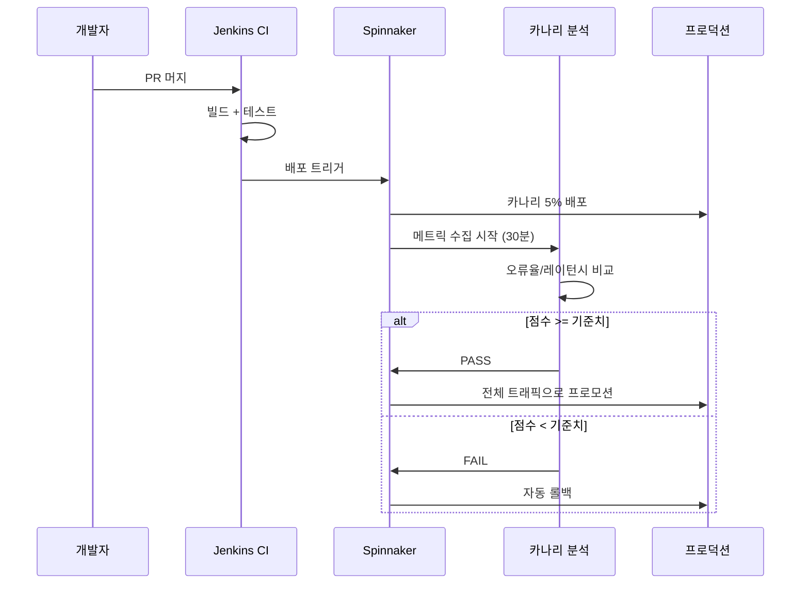
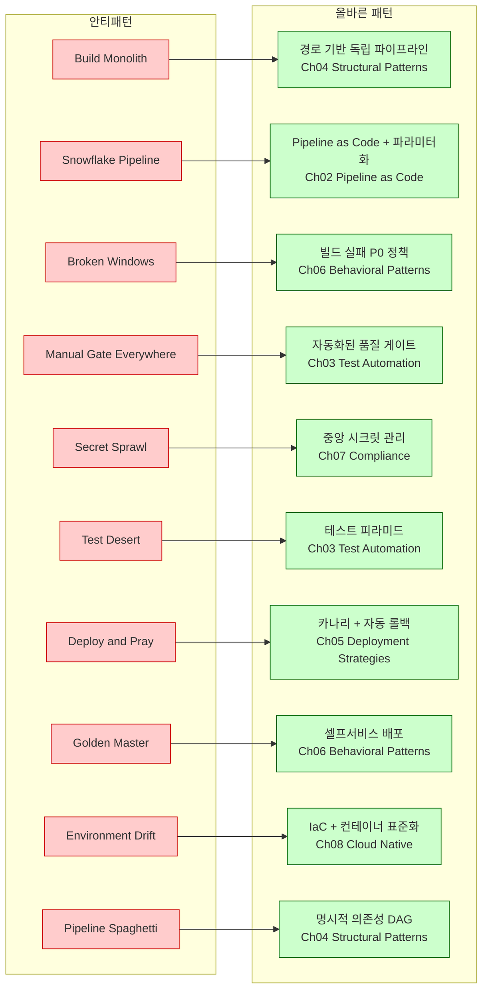

# Ch10. 안티패턴과 케이스 스터디

**핵심 질문**: "CI/CD에서 가장 흔한 안티패턴과 극복 사례는?"

---

## 🎯 학습 목표

1. CI/CD 안티패턴 Top 10을 식별하고 각각의 근본 원인을 설명할 수 있다
2. 안티패턴 탐지 스크립트를 작성해 기존 파이프라인을 진단할 수 있다
3. Self-healing 파이프라인의 자동 복구 전략을 설계할 수 있다
4. Netflix, GitHub, 금융권 케이스 스터디에서 공통 교훈을 도출할 수 있다
5. 안티패턴에서 올바른 패턴으로 점진적으로 전환하는 전략을 수립할 수 있다
6. 팀의 파이프라인 상태를 정기 진단하는 문화를 만들 수 있다

---

## CI/CD 안티패턴 Top 10

CI/CD 파이프라인은 처음부터 나쁘게 설계되지 않는다. 초기에는 작동하는 것처럼 보이는 결정들이 시스템이 커지면서 기술 부채로 쌓인다. 이 섹션은 가장 자주 반복되는 10가지 안티패턴과 그 처방을 다룬다.

---

### 1. Build Monolith — 모든 것을 한 파이프라인에

**문제**: 마이크로서비스 시대에도 하나의 거대한 파이프라인이 모든 서비스를 순차 빌드한다. 서비스 A의 변경이 서비스 Z의 빌드까지 강제로 트리거한다.

**영향**: 피드백 루프가 길어지고 (30분 빌드가 일상화), 팀 간 결합도가 파이프라인 수준에서 생긴다. 한 서비스의 테스트 실패가 전체 배포를 블로킹한다.

**해결**: 각 서비스에 독립 파이프라인을 부여하고, 공통 단계는 재사용 가능한 워크플로우 템플릿으로 추출한다. 변경된 서비스만 빌드하는 경로 기반 트리거(path filter)를 도입한다.

```yaml
# BAD: 모든 서비스를 하나의 잡에서 빌드
jobs:
  build-all:
    steps:
      - run: make build-service-a
      - run: make build-service-b
      - run: make build-service-c  # 변경 없어도 항상 실행

# GOOD: 경로 필터로 변경된 서비스만 트리거
jobs:
  build-service-a:
    if: contains(github.event.paths, 'service-a/')
    uses: ./.github/workflows/service-build.yml
    with:
      service: service-a

  build-service-b:
    if: contains(github.event.paths, 'service-b/')
    uses: ./.github/workflows/service-build.yml
    with:
      service: service-b
```

---

### 2. Snowflake Pipeline — 환경마다 다른 파이프라인

**문제**: dev 환경용 파이프라인, staging용 파이프라인, prod용 파이프라인이 각각 독립적으로 관리된다. 처음에는 "환경마다 요구사항이 다르다"는 합리적인 이유로 시작한다.

**영향**: staging에서 통과한 배포 스크립트가 prod에서 실패한다. 환경마다 비밀스러운 차이가 숨어 있어 디버깅에 시간이 소요된다. 파이프라인 자체가 Snowflake(눈송이처럼 하나뿐인 독특한 것)가 된다.

**해결**: 단일 파이프라인 정의에서 환경별 파라미터(env var, config file)로 차이를 제어한다. Pipeline as Code 원칙에 따라 파이프라인도 코드로 버전 관리하고, 환경 차이는 주입(injection)으로 처리한다.

```yaml
# GOOD: 단일 파이프라인, 환경은 파라미터로 주입
on:
  workflow_call:
    inputs:
      environment:
        required: true
        type: string
      cluster:
        required: true
        type: string

jobs:
  deploy:
    environment: ${{ inputs.environment }}
    steps:
      - name: Deploy
        # 로직은 동일, 타겟만 파라미터화
        run: |
          helm upgrade --install app ./chart \
            --set image.tag=${{ github.sha }} \
            --values ./envs/${{ inputs.environment }}.yaml \
            --kube-context ${{ inputs.cluster }}
```

---

### 3. Broken Windows — 깨진 빌드 방치

**문제**: 빌드가 실패해도 "나중에 고치자"는 문화가 정착한다. 실패한 빌드 알림이 무시되고, 팀이 빨간 상태의 파이프라인에 무감각해진다.

**영향**: 깨진 창문 이론(Broken Window Theory)이 CI/CD에도 적용된다. 하나의 실패가 방치되면 다른 팀원들도 실패를 용납하게 된다. 결국 파이프라인은 신뢰를 잃고 형식적인 절차로 전락한다.

**해결**: 빌드 실패는 P0 이슈로 취급한다. 팀 알림 채널에 즉각 에스컬레이션하고, 실패한 빌드가 있는 한 새 PR 머지를 블로킹하는 정책을 도입한다.

---

### 4. Manual Gate Everywhere — 모든 단계에 수동 승인

**문제**: "혹시 모르니까" 라는 이유로 dev→staging, staging→prod, 심지어 테스트 실행 전에도 수동 승인을 붙인다.

**영향**: 배포 사이클이 며칠로 늘어난다. 승인자가 휴가일 때 긴급 핫픽스를 배포할 수 없다. 수동 승인이 실제 품질 게이트가 아닌 "책임 회피"용 체크박스가 된다.

**해결**: 신뢰할 수 있는 자동화된 품질 게이트(테스트, 보안 스캔, 성능 기준)를 구축하고, 수동 승인은 prod 배포 전 한 단계에만 남긴다. 자동화가 신뢰를 얻으면 그 단계도 제거한다.

---

### 5. Secret Sprawl — 시크릿 하드코딩/복사

**문제**: API 키, 데이터베이스 비밀번호, 인증서가 파이프라인 설정 파일이나 환경변수에 평문으로 박혀 있다. 또는 동일한 시크릿이 여러 파이프라인에 복사된다.

**영향**: 시크릿 로테이션이 불가능해지고, 하나의 시크릿 노출이 전체 시스템 침해로 이어진다. git history에 시크릿이 영원히 남는다.

**해결**: Vault, AWS Secrets Manager, GitHub Secrets 같은 중앙 시크릿 관리 시스템을 사용한다. 시크릿은 파이프라인 실행 시 동적으로 주입한다.

---

### 6. Test Desert — 테스트 없는 CD

**문제**: 빌드→배포 파이프라인에 실질적인 테스트 단계가 없다. 또는 테스트가 있어도 항상 통과하는 의미 없는 테스트(형식적 커버리지)만 있다.

**영향**: CD가 "자동화된 무작위 배포"가 된다. 버그가 프로덕션에서만 발견된다.

**해결**: 파이프라인에 단위→통합→E2E 테스트를 순서대로 배치한다. 테스트 커버리지 기준(예: 80%)을 품질 게이트로 설정한다.

---

### 7. Deploy and Pray — 모니터링 없는 배포

**문제**: 배포 후 무슨 일이 일어나는지 파이프라인이 확인하지 않는다. 배포 성공 = 프로세스 시작 성공으로 간주한다.

**영향**: 서비스가 뜨지만 오류율 99%인 상태로 운영된다. 문제를 고객이 먼저 발견한다.

**해결**: 배포 후 smoke test, health check, 오류율 모니터링을 파이프라인에 포함한다. 기준치를 벗어나면 자동 롤백을 트리거한다.

---

### 8. Golden Master — 한 사람만 배포 가능

**문제**: 특정 팀원만 배포 방법을 알고 있다. 배포 절차가 문서화되지 않았거나, 그 사람의 로컬 환경에 의존적인 스크립트가 있다.

**영향**: 버스 팩터(Bus Factor)가 1이다. 그 사람이 없을 때 배포가 불가능하다. 지식이 개인에게 묶여 있어 팀 성장을 막는다.

**해결**: 모든 배포 절차를 파이프라인으로 코드화하고, 팀 전체가 배포 권한을 갖는다. 배포 방법은 README에 문서화해 신규 팀원도 24시간 안에 배포할 수 있게 한다.

---

### 9. Environment Drift — 환경 간 설정 불일치

**문제**: dev, staging, prod 환경의 OS 버전, 라이브러리, 설정값이 시간이 지나면서 달라진다. "내 로컬에서는 됐는데"가 팀의 공식 언어가 된다.

**영향**: staging 통과가 prod 성공을 보장하지 않는다. 환경 불일치로 인한 버그가 재현하기 어렵다.

**해결**: Infrastructure as Code(Terraform, Pulumi)와 컨테이너로 환경을 코드로 정의하고, 모든 환경을 동일한 베이스에서 프로비저닝한다.

---

### 10. Pipeline Spaghetti — 단계 간 의존성 꼬임

**문제**: 파이프라인 단계들이 암묵적 의존성으로 연결되어 있다. A 단계가 완료되면 B가 시작되지만, B는 실제로 C의 부산물에 의존하고 있다.

**영향**: 파이프라인 수정이 두렵다. 한 단계를 바꾸면 예상치 못한 곳이 깨진다.

**해결**: 각 단계를 명시적인 입력/출력으로 정의한다. Artifact를 통해 단계 간 데이터를 전달하고, 의존성을 그래프로 시각화해 관리한다.

---

## 안티패턴 탐지 스크립트

파이프라인을 직접 분석해 안티패턴을 자동으로 탐지하는 스크립트다. 기존 파이프라인 파일을 대상으로 실행하면 주요 문제점을 리포트로 출력한다.

```bash
#!/usr/bin/env bash
# detect-antipatterns.sh
# 파이프라인 설정 파일에서 CI/CD 안티패턴을 탐지한다
# 사용법: ./detect-antipatterns.sh [파이프라인_디렉토리]

set -euo pipefail

PIPELINE_DIR="${1:-.github/workflows}"
REPORT_FILE="antipattern-report.txt"
ISSUES=0

# 컬러 출력 (터미널 지원 여부 확인)
RED='\033[0;31m'
YELLOW='\033[1;33m'
GREEN='\033[0;32m'
NC='\033[0m'

report() {
  local severity="$1"
  local message="$2"
  echo "[$severity] $message" | tee -a "$REPORT_FILE"
  ((ISSUES++)) || true
}

echo "=== CI/CD 안티패턴 탐지 리포트 ===" > "$REPORT_FILE"
echo "대상 디렉토리: $PIPELINE_DIR" >> "$REPORT_FILE"
echo "실행 시각: $(date)" >> "$REPORT_FILE"
echo "---" >> "$REPORT_FILE"

# 1. Secret Sprawl 탐지: 하드코딩된 시크릿 패턴 검색
echo -e "\n${YELLOW}[검사 1] 하드코딩된 시크릿 탐지${NC}"
SECRET_PATTERNS=(
  "password\s*[:=]\s*['\"][^'\"$][^'\"]*['\"]"
  "api_key\s*[:=]\s*['\"][^'\"$][^'\"]*['\"]"
  "secret\s*[:=]\s*['\"][^'\"$][^'\"]*['\"]"
  "token\s*[:=]\s*['\"][^'\"$][^'\"]*['\"]"
  "AWS_ACCESS_KEY_ID\s*[:=]\s*AKIA[0-9A-Z]{16}"
)

for pattern in "${SECRET_PATTERNS[@]}"; do
  # 주석 라인 제외, ${{ secrets.* }} 형태는 정상이므로 제외
  matches=$(grep -rEi "$pattern" "$PIPELINE_DIR" \
    --include="*.yml" --include="*.yaml" \
    | grep -v '^\s*#' \
    | grep -v '\${{.*secrets\.' \
    | grep -v '\${{.*env\.' || true)
  if [ -n "$matches" ]; then
    report "CRITICAL" "하드코딩된 시크릿 의심: $matches"
  fi
done

# 2. Test Desert 탐지: 테스트 단계 누락 확인
echo -e "\n${YELLOW}[검사 2] 테스트 단계 누락 탐지${NC}"
pipeline_files=$(find "$PIPELINE_DIR" -name "*.yml" -o -name "*.yaml" 2>/dev/null)

for file in $pipeline_files; do
  # 배포 관련 파일인데 테스트 단계가 없는 경우
  has_deploy=$(grep -Ei "deploy|helm|kubectl|push" "$file" || true)
  has_test=$(grep -Ei "test|spec|coverage|jest|pytest|go test" "$file" || true)

  if [ -n "$has_deploy" ] && [ -z "$has_test" ]; then
    report "HIGH" "테스트 없는 배포 파이프라인: $file"
  fi
done

# 3. Build Monolith 탐지: 단일 잡에서 다수 서비스 빌드
echo -e "\n${YELLOW}[검사 3] Build Monolith 탐지${NC}"
for file in $pipeline_files; do
  # 한 step 안에서 여러 서비스를 빌드하는 패턴
  service_build_count=$(grep -c "build-service\|make build\|docker build" "$file" 2>/dev/null || echo "0")
  if [ "$service_build_count" -gt 3 ]; then
    report "MEDIUM" "단일 파이프라인에서 $service_build_count 개 빌드 감지 (Build Monolith 의심): $file"
  fi
done

# 4. Manual Gate Everywhere 탐지: 과도한 수동 승인
echo -e "\n${YELLOW}[검사 4] 과도한 수동 승인 탐지${NC}"
for file in $pipeline_files; do
  manual_approval_count=$(grep -c "environment:" "$file" 2>/dev/null || echo "0")
  if [ "$manual_approval_count" -gt 2 ]; then
    report "MEDIUM" "수동 승인 환경이 ${manual_approval_count}개 (Manual Gate Everywhere 의심): $file"
  fi
done

# 5. Snowflake Pipeline 탐지: 환경별 중복 파이프라인
echo -e "\n${YELLOW}[검사 5] Snowflake Pipeline 탐지${NC}"
env_specific_files=$(find "$PIPELINE_DIR" -name "*dev*" -o -name "*staging*" -o -name "*prod*" 2>/dev/null | wc -l)
if [ "$env_specific_files" -gt 3 ]; then
  report "MEDIUM" "환경별 파이프라인 파일 ${env_specific_files}개 감지 (Snowflake Pipeline 의심)"
fi

# 6. Deploy and Pray 탐지: 배포 후 헬스체크 부재
echo -e "\n${YELLOW}[검사 6] 배포 후 모니터링 부재 탐지${NC}"
for file in $pipeline_files; do
  has_deploy=$(grep -Ei "helm upgrade|kubectl apply|deploy" "$file" || true)
  has_healthcheck=$(grep -Ei "health|smoke|curl.*health|wait.*ready" "$file" || true)

  if [ -n "$has_deploy" ] && [ -z "$has_healthcheck" ]; then
    report "HIGH" "배포 후 헬스체크 없음 (Deploy and Pray 의심): $file"
  fi
done

# 최종 요약 출력
echo ""
echo "================================="
echo "탐지 완료. 총 이슈 수: $ISSUES"
echo "상세 리포트: $REPORT_FILE"
echo "================================="

if [ "$ISSUES" -gt 0 ]; then
  echo -e "${RED}안티패턴이 발견되었습니다. 리포트를 검토하세요.${NC}"
  exit 1
else
  echo -e "${GREEN}안티패턴이 발견되지 않았습니다.${NC}"
  exit 0
fi
```

---

## Self-healing 파이프라인

파이프라인이 실패했을 때 사람이 개입하지 않아도 스스로 복구하는 전략이다. 세 가지 핵심 메커니즘이 있다.

### 1. Auto-retry (자동 재시도)

네트워크 플리킹, 일시적 API 한도 초과처럼 재현성이 낮은 실패에 적용한다. 재시도 횟수와 간격을 지수 백오프(exponential backoff)로 설정해 연쇄 실패를 방지한다.

```yaml
# GitHub Actions retry 패턴 (nick-fields/retry 액션 활용)
jobs:
  deploy:
    runs-on: ubuntu-latest
    steps:
      - name: Deploy with retry
        uses: nick-fields/retry@v2
        with:
          timeout_minutes: 10
          max_attempts: 3
          # 재시도 간격: 1분, 2분, 4분 (지수 백오프)
          retry_wait_seconds: 60
          command: |
            helm upgrade --install app ./chart \
              --wait --timeout 5m \
              --set image.tag=${{ github.sha }}
```

### 2. Auto-rollback (자동 롤백)

배포 후 헬스체크 실패 시 이전 버전으로 자동 복구한다. 롤백 자체가 실패할 경우를 대비해 알림 에스컬레이션을 병행한다.

```yaml
jobs:
  deploy-with-rollback:
    runs-on: ubuntu-latest
    steps:
      - name: 이전 버전 기록 (롤백 기준점)
        id: prev-version
        run: |
          PREV=$(helm get values app -o json | jq -r '.image.tag')
          echo "tag=$PREV" >> $GITHUB_OUTPUT

      - name: 배포
        id: deploy
        run: |
          helm upgrade --install app ./chart \
            --set image.tag=${{ github.sha }} \
            --wait --timeout 5m

      - name: 스모크 테스트
        id: smoke-test
        run: |
          # 30초 대기 후 헬스체크 (파드가 준비되는 시간)
          sleep 30
          curl -f --retry 5 --retry-delay 10 \
            https://app.example.com/health || exit 1

      - name: 자동 롤백 (스모크 테스트 실패 시)
        if: failure() && steps.smoke-test.outcome == 'failure'
        run: |
          echo "스모크 테스트 실패 → 이전 버전으로 롤백"
          helm upgrade --install app ./chart \
            --set image.tag=${{ steps.prev-version.outputs.tag }} \
            --wait --timeout 5m

      - name: 롤백 알림
        if: failure()
        uses: slackapi/slack-github-action@v1
        with:
          channel-id: "#incidents"
          slack-message: |
            *자동 롤백 실행*
            서비스: app
            실패 버전: ${{ github.sha }}
            복구 버전: ${{ steps.prev-version.outputs.tag }}
        env:
          SLACK_BOT_TOKEN: ${{ secrets.SLACK_BOT_TOKEN }}
```

### 3. Circuit Breaker (서킷 브레이커)

연속 실패가 일정 횟수를 초과하면 배포를 일시 중단한다. 시스템이 불안정한 상태에서 계속 배포 시도를 반복하면 상황이 악화된다.

```bash
# 최근 N회 배포 실패율 계산 후 배포 차단 결정
FAILURE_THRESHOLD=3
WINDOW=10  # 최근 10회 배포 기준

recent_failures=$(gh run list \
  --workflow=deploy.yml \
  --limit=$WINDOW \
  --json conclusion \
  --jq '[.[] | select(.conclusion == "failure")] | length')

if [ "$recent_failures" -ge "$FAILURE_THRESHOLD" ]; then
  echo "최근 ${WINDOW}회 중 ${recent_failures}회 실패 → 배포 차단 (Circuit Open)"
  exit 1
fi
```

---

## 케이스 스터디

### Case 1. Netflix — 마이크로서비스 CI/CD

Netflix는 수백 개의 마이크로서비스를 매일 수천 회 배포한다. 초기에는 각 팀이 자체 배포 스크립트를 가지고 있었고, 이는 전형적인 Snowflake Pipeline 안티패턴이었다.

**전환 포인트**: Netflix는 Spinnaker(오픈소스 배포 플랫폼)를 자체 개발해 배포를 표준화했다. Spinnaker의 핵심은 카나리 분석(Kayenta)이다. 신규 버전을 전체 트래픽의 1~5%에 먼저 노출하고, Prometheus 메트릭을 기반으로 오류율·레이턴시를 기존 버전과 자동 비교한다. 점수가 기준치를 넘으면 자동 프로모션, 하락하면 자동 롤백이다.

**교훈**: "배포 성공"의 정의를 "프로세스 시작"에서 "비즈니스 메트릭 유지"로 바꿨다. Deploy and Pray 안티패턴을 데이터 기반 배포로 교체한 것이다.



---

### Case 2. GitHub — Actions로 자체 CI/CD (Dogfooding)

GitHub은 GitHub Actions를 자체 플랫폼 배포에 사용한다. 이를 "Dogfooding"이라 부른다. 자신이 만든 도구로 자신을 배포하는 방식이다.

**해결한 안티패턴**: 초기 GitHub Actions는 캐시가 없어 매번 의존성을 풀 다운로드했다. 빌드 시간이 15분에 달했다. `actions/cache` 액션이 도입되면서 Node.js 의존성 캐시 적중률이 95%에 달하게 됐고 빌드 시간이 3분으로 줄었다. 이는 Build Monolith 안티패턴(불필요한 작업 반복)의 한 형태였다.

**교훈**: 파이프라인 성능도 코드 성능만큼 최적화 대상이다. 캐싱, 병렬화, 조건부 실행은 빌드 시간을 선형적으로 줄이는 수단이다.

```yaml
# GitHub 내부적으로 적용하는 캐싱 패턴
- name: Node.js 의존성 캐시
  uses: actions/cache@v3
  with:
    path: ~/.npm
    # package-lock.json 해시로 캐시 키 결정
    # 의존성이 변경될 때만 캐시 무효화됨
    key: ${{ runner.os }}-node-${{ hashFiles('**/package-lock.json') }}
    restore-keys: |
      ${{ runner.os }}-node-
```

---

### Case 3. 대규모 금융사 — 규제 준수 파이프라인 전환

국내 한 시중 은행은 배포 과정이 전적으로 수동이었다. 배포 신청서 작성 → 보안팀 검토(3일) → 인프라팀 작업 → 운영팀 확인 순서로 최소 5영업일이 걸렸다.

**문제**: Manual Gate Everywhere 안티패턴의 극단적 사례였다. 보안팀은 코드를 직접 보지 않고 신청서 형식만 검토했다. 실질적인 보안 검증은 없는 채 절차만 남은 상태였다.

**전환 전략**:
1. **1단계 (3개월)**: SAST/DAST 스캐너를 파이프라인에 통합해 보안팀의 수동 검토를 자동화된 스캔 결과로 대체했다. 보안팀은 스캔 기준 설정에 집중하게 됐다.
2. **2단계 (6개월)**: Compliance Gate를 파이프라인 단계로 구현했다. 체크리스트 항목이 자동으로 검증되고, 감사 로그가 파이프라인 실행 기록으로 자동 생성됐다.
3. **3단계 (12개월)**: prod 배포 전 최종 승인 하나만 남기고 나머지 수동 단계를 제거했다.

**결과**: 배포 사이클이 5영업일에서 4시간으로 줄었다. 오히려 감사 로그는 수동 시절보다 상세해졌다. 금융감독원 검사에서 "자동화된 감사 추적이 수동보다 신뢰성 있다"는 평가를 받았다.

---

## 안티패턴 → 패턴 전환 매핑



---

## 핵심 정리

CI/CD 안티패턴은 대부분 단기 편의를 위한 선택이 장기 부채로 전환된 결과다. Build Monolith는 "일단 작동하면 된다"는 생각에서, Broken Windows는 "나중에 고치자"는 지연에서, Manual Gate Everywhere는 "혹시 모르니까"라는 두려움에서 생긴다.

세 케이스 스터디의 공통 교훈은 하나다. 자동화는 통제력을 잃는 것이 아니라 통제력을 더 세밀하게 갖는 것이다. Netflix는 카나리 분석으로 배포 위험을 정량화했고, GitHub은 캐싱으로 피드백 루프를 단축했으며, 금융사는 자동화된 감사 로그로 오히려 규제 준수를 강화했다.

안티패턴에서 패턴으로의 전환은 한 번에 이루어지지 않는다. 가장 고통스러운 안티패턴 하나를 골라 작은 개선을 시작하고, 그 성과를 팀이 느끼게 만드는 것이 시작이다.

---

## 체크포인트

- [ ] 탐지 스크립트를 기존 파이프라인에 실행해 안티패턴 수를 세었다
- [ ] 가장 시급한 안티패턴을 팀과 논의해 우선순위를 정했다
- [ ] Auto-rollback 워크플로우를 로컬 환경에 구성해봤다
- [ ] 세 케이스 스터디 중 현재 팀 상황과 가장 유사한 케이스를 선택했다
