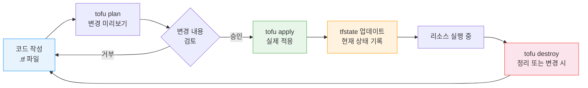
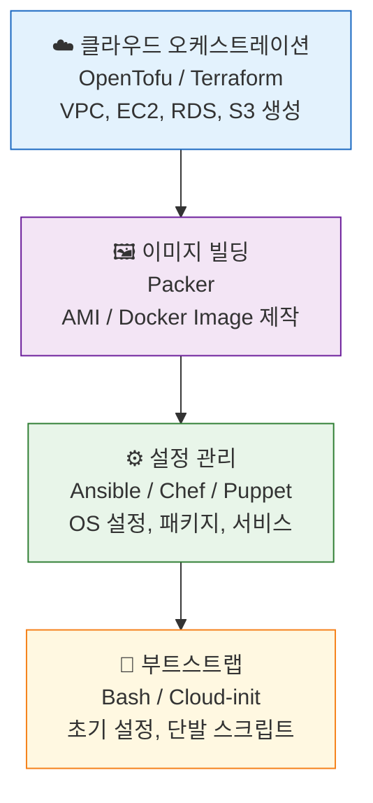

# Ch02. Infrastructure as Code

**핵심 질문**: "ClickOps의 문제를 IaC로 어떻게 해결하는가?"

---

## 🎯 학습 목표

이 챕터를 마치면 다음을 할 수 있다.

- ClickOps가 왜 규모 확장에 실패하는지 설명할 수 있다
- 선언적 IaC와 명령적 IaC의 차이를 도구 선택 기준으로 활용할 수 있다
- Bash, Ansible, Packer, OpenTofu 각각의 책임 경계를 구분할 수 있다
- OpenTofu로 VPC + EC2 + Security Group 기본 네트워크를 구성할 수 있다
- Ansible 플레이북으로 서버 상태를 재현 가능하게 관리할 수 있다
- IaC 워크플로(plan → apply → state)를 실제 변경에 적용할 수 있다

---

## 1. ClickOps의 문제점

### 수동 인프라 관리의 한계

ClickOps란 AWS 콘솔, Azure Portal 같은 웹 UI에서 마우스 클릭으로 인프라를 구성하는 방식이다. 서버 한 대를 빠르게 띄울 때는 직관적이지만, 이 방식은 세 가지 근본적인 한계를 갖는다.

첫째, **재현 불가능성**이다. 콘솔에서 클릭한 순서, 선택한 옵션은 어디에도 기록되지 않는다. 6개월 뒤 동일한 환경을 다시 만들어야 할 때, 당시 무슨 설정을 했는지 아무도 정확히 기억하지 못한다. 결국 "비슷한" 환경은 만들 수 있지만 "동일한" 환경은 보장할 수 없다.

둘째, **검토 불가능성**이다. 코드 변경은 Pull Request로 리뷰하고 히스토리를 추적할 수 있다. 하지만 콘솔에서 Security Group 규칙 하나를 추가하면? 누가 언제 왜 변경했는지 CloudTrail을 뒤져야 하고, 그마저도 "무슨 맥락에서"는 알 수 없다.

셋째, **확장 불가능성**이다. 서버 1대 설정은 클릭으로 5분이다. 서버 50대를 동일하게 설정하면? 5분 × 50 = 250분이고, 그중 절반은 실수가 섞인다.

### 눈송이 서버 (Snowflake Server)

수동 관리가 누적되면 "눈송이 서버"가 탄생한다. 눈송이는 세상에 완전히 동일한 것이 없다는 의미다. 처음에는 동일하게 만든 서버 A와 B가 시간이 지나면서 서로 다른 패치, 서로 다른 설정, 서로 다른 라이브러리 버전을 갖게 된다.

"서버 A에서는 되는데 서버 B에서는 안 된다"는 버그는 대부분 이 눈송이 문제에서 온다. IaC는 이 눈송이 서버를 **교체 가능한 가축(cattle)**으로 만든다. 개별 서버에 애착을 갖는 것이 아니라, 언제든 폐기하고 코드에서 동일한 것을 다시 만들 수 있어야 한다.

---

## 2. IaC의 핵심 원칙

### 선언적(Declarative) vs 명령적(Imperative)

명령적 방식은 "어떻게(How)"를 기술한다. "nginx를 설치하라, 80번 포트를 열어라, 서비스를 시작하라"처럼 순서가 있는 절차를 나열한다. Bash 스크립트가 대표적이다.

선언적 방식은 "무엇을(What)"을 기술한다. "nginx가 설치되어 있고 실행 중인 상태여야 한다"처럼 최종 상태를 명시하면, 도구가 현재 상태와 비교해서 필요한 작업을 스스로 결정한다. Terraform, Ansible이 이 방식을 따른다.

선언적 방식의 핵심 장점은 **멱등성(Idempotency)**이다. 같은 설정을 열 번 적용해도 결과가 동일하다. 이미 nginx가 설치되어 있으면 건너뛰고, 설정이 이미 올바르면 변경하지 않는다. 반면 명령적 스크립트를 두 번 실행하면 패키지가 중복 설치될 수 있고, 이미 존재하는 사용자를 또 만들려다 오류가 발생한다.

### 버전 관리가 인프라에 가져오는 것

IaC 파일은 코드이므로 Git으로 관리한다. 이것이 단순해 보이지만 실제로는 세 가지를 바꾼다. 변경 이력이 생기고(누가 언제 왜 바꿨는가), 리뷰가 가능해지며(팀이 함께 인프라 변경을 검토), 롤백이 명확해진다(이전 커밋의 코드를 적용하면 된다).

---

## 3. Bash 프로비저닝 스크립트

Bash 스크립트는 IaC 도구 중 가장 원초적이지만, 커스텀 로직이나 단발성 부트스트랩에는 여전히 유효하다. 다만 멱등성 보장을 직접 구현해야 한다는 점이 함정이다.

```bash
#!/usr/bin/env bash
# provision-webserver.sh
# 목적: nginx 웹 서버 설정 + 방화벽 + 배포 전용 사용자 생성
# 멱등성: 각 단계에서 이미 완료된 경우 건너뜀

set -euo pipefail  # 오류 즉시 종료, 미정의 변수 금지, 파이프 오류 전파

# ── 색상 출력 헬퍼 ──────────────────────────────────────────
RED='\033[0;31m'; GREEN='\033[0;32m'; YELLOW='\033[1;33m'; NC='\033[0m'
log_info()  { echo -e "${GREEN}[INFO]${NC} $1"; }
log_warn()  { echo -e "${YELLOW}[WARN]${NC} $1"; }
log_error() { echo -e "${RED}[ERROR]${NC} $1" >&2; }

# ── 변수 ──────────────────────────────────────────────────────
DEPLOY_USER="deploy"
NGINX_CONF_DIR="/etc/nginx/conf.d"
APP_DIR="/var/www/html/app"
FIREWALL_PORTS=(22 80 443)

# ── 1. 시스템 업데이트 ────────────────────────────────────────
log_info "패키지 캐시 업데이트 중..."
apt-get update -qq

# ── 2. nginx 설치 (이미 설치된 경우 건너뜀) ──────────────────
if ! command -v nginx &>/dev/null; then
    log_info "nginx 설치 중..."
    apt-get install -y nginx ufw
else
    log_warn "nginx 이미 설치됨 — 건너뜀"
fi

# ── 3. 방화벽 설정 (ufw) ─────────────────────────────────────
log_info "방화벽 규칙 설정 중..."
ufw --force reset  # 기존 규칙 초기화 (멱등성 보장)
ufw default deny incoming
ufw default allow outgoing
for port in "${FIREWALL_PORTS[@]}"; do
    ufw allow "$port/tcp"
    log_info "포트 $port/tcp 허용"
done
ufw --force enable

# ── 4. 배포 전용 사용자 생성 ──────────────────────────────────
# useradd는 존재하면 오류 → id 명령으로 사전 확인
if ! id "$DEPLOY_USER" &>/dev/null; then
    log_info "배포 사용자 '$DEPLOY_USER' 생성 중..."
    useradd -m -s /bin/bash -G www-data "$DEPLOY_USER"
    mkdir -p "/home/$DEPLOY_USER/.ssh"
    chmod 700 "/home/$DEPLOY_USER/.ssh"
    # 실제 환경에서는 외부에서 공개키를 주입
    touch "/home/$DEPLOY_USER/.ssh/authorized_keys"
    chmod 600 "/home/$DEPLOY_USER/.ssh/authorized_keys"
    chown -R "$DEPLOY_USER:$DEPLOY_USER" "/home/$DEPLOY_USER/.ssh"
else
    log_warn "사용자 '$DEPLOY_USER' 이미 존재 — 건너뜀"
fi

# ── 5. 앱 디렉토리 및 nginx 가상 호스트 설정 ─────────────────
log_info "앱 디렉토리 생성 중..."
mkdir -p "$APP_DIR"
chown -R "$DEPLOY_USER:www-data" "$APP_DIR"
chmod 2775 "$APP_DIR"  # setgid: 하위 파일이 www-data 그룹 상속

log_info "nginx 가상 호스트 설정 중..."
cat > "$NGINX_CONF_DIR/app.conf" <<'NGINX_EOF'
server {
    listen 80;
    server_name _;
    root /var/www/html/app;
    index index.html;

    location / {
        try_files $uri $uri/ =404;
    }

    # 보안 헤더
    add_header X-Frame-Options "SAMEORIGIN";
    add_header X-Content-Type-Options "nosniff";
}
NGINX_EOF

# ── 6. nginx 설정 검증 및 재시작 ────────────────────────────
log_info "nginx 설정 검증 중..."
nginx -t || { log_error "nginx 설정 오류 — 중단"; exit 1; }
systemctl enable nginx
systemctl restart nginx

log_info "프로비저닝 완료."
log_info "배포 사용자: $DEPLOY_USER"
log_info "앱 경로: $APP_DIR"
```

이 스크립트에서 중요한 부분은 각 단계에서 "이미 완료됐는가?"를 확인하는 분기다. `command -v nginx`, `id "$DEPLOY_USER"` 같은 사전 검사가 없으면 두 번째 실행에서 오류가 발생한다. 이것이 Bash로 멱등성을 구현하는 방식이고, 동시에 Bash의 한계이기도 하다. 모든 단계에서 이런 분기를 개발자가 직접 작성해야 한다.

---

## 4. Configuration Management: Ansible

Ansible은 멱등성을 기본으로 내장한다. 태스크마다 "원하는 상태"를 선언하면, Ansible 모듈이 현재 상태와 비교해서 필요한 경우에만 변경한다. 에이전트 없이 SSH만으로 동작하는 것도 실용적인 장점이다.

```yaml
# playbook-webserver.yml
# 목적: nginx 웹 서버를 원하는 상태로 수렴
---
- name: Configure Web Server
  hosts: webservers
  become: true  # sudo 권한으로 실행

  vars:
    deploy_user: deploy
    app_dir: /var/www/html/app
    nginx_worker_processes: auto
    allowed_ports:
      - "22/tcp"
      - "80/tcp"
      - "443/tcp"

  handlers:
    # handler는 notify를 받았을 때만 실행되고, 플레이 끝에 한 번만 실행된다
    # 설정 변경이 여러 task에서 발생해도 nginx 재시작은 한 번만
    - name: Reload nginx
      ansible.builtin.service:
        name: nginx
        state: reloaded

    - name: Restart nginx
      ansible.builtin.service:
        name: nginx
        state: restarted

  tasks:
    # ── 패키지 설치 ─────────────────────────────────────────
    - name: Install nginx and ufw
      ansible.builtin.apt:
        name:
          - nginx
          - ufw
        state: present  # "설치되어 있는 상태" = 멱등적
        update_cache: true

    # ── 방화벽 설정 ─────────────────────────────────────────
    - name: Allow required ports in ufw
      community.general.ufw:
        rule: allow
        port: "{{ item.split('/')[0] }}"
        proto: "{{ item.split('/')[1] }}"
      loop: "{{ allowed_ports }}"

    - name: Enable ufw
      community.general.ufw:
        state: enabled
        policy: deny

    # ── 배포 사용자 ─────────────────────────────────────────
    - name: Create deploy user
      ansible.builtin.user:
        name: "{{ deploy_user }}"
        shell: /bin/bash
        groups: www-data
        append: true
        create_home: true
        state: present

    - name: Set up deploy user SSH directory
      ansible.builtin.file:
        path: "/home/{{ deploy_user }}/.ssh"
        state: directory
        owner: "{{ deploy_user }}"
        mode: "0700"

    # ── 앱 디렉토리 ─────────────────────────────────────────
    - name: Create app directory
      ansible.builtin.file:
        path: "{{ app_dir }}"
        state: directory
        owner: "{{ deploy_user }}"
        group: www-data
        mode: "2775"

    # ── nginx 설정 ───────────────────────────────────────────
    - name: Deploy nginx virtual host config
      ansible.builtin.template:
        src: templates/nginx-vhost.conf.j2
        dest: /etc/nginx/conf.d/app.conf
        owner: root
        group: root
        mode: "0644"
        validate: nginx -t -c %s  # 배포 전 검증
      notify: Reload nginx  # 설정 변경 시에만 재로드

    - name: Ensure nginx is enabled and started
      ansible.builtin.service:
        name: nginx
        enabled: true
        state: started
```

Ansible의 강점은 `notify` + `handler` 패턴에 있다. 설정 파일이 변경됐을 때만 nginx를 재로드한다. 열 번 실행해도 설정이 동일하면 nginx는 한 번도 재시작하지 않는다.

---

## 5. 이미지 빌더: Packer

Packer는 "서버를 코드로 굽는" 도구다. Ansible이 실행 중인 서버에 설정을 밀어 넣는다면, Packer는 미리 설정이 완료된 서버 이미지(AMI, Docker 이미지 등)를 만든다. 이 이미지에서 시작한 서버는 부팅 시 추가 설정이 없어도 된다.

```hcl
# webserver.pkr.hcl
# 목적: nginx와 앱 런타임이 포함된 AMI 빌드
packer {
  required_plugins {
    amazon = {
      version = ">= 1.3.0"
      source  = "github.com/hashicorp/amazon"
    }
    ansible = {
      version = ">= 1.1.0"
      source  = "github.com/hashicorp/ansible"
    }
  }
}

variable "aws_region" {
  default = "ap-northeast-2"
}

variable "base_ami" {
  description = "Ubuntu 22.04 LTS AMI (ap-northeast-2)"
  default     = "ami-0c9c942bd7bf113a2"
}

source "amazon-ebs" "webserver" {
  region        = var.aws_region
  source_ami    = var.base_ami
  instance_type = "t3.micro"

  # 빌드용 임시 인스턴스에만 접근 허용
  ssh_username  = "ubuntu"

  ami_name        = "webserver-{{timestamp}}"
  ami_description = "Pre-configured nginx web server"

  tags = {
    Name        = "webserver-ami"
    Environment = "production"
    BuildDate   = "{{timestamp}}"
    ManagedBy   = "packer"
  }

  # AMI를 여러 리전에 복사 (선택)
  ami_regions = ["us-east-1"]
}

build {
  name    = "webserver"
  sources = ["source.amazon-ebs.webserver"]

  # 1단계: 시스템 준비
  provisioner "shell" {
    inline = [
      "sudo apt-get update -qq",
      "sudo apt-get install -y python3 python3-pip",
      # Ansible이 없는 경우 설치
      "pip3 install ansible --quiet",
    ]
  }

  # 2단계: Ansible로 실제 설정 적용
  provisioner "ansible" {
    playbook_file = "./playbook-webserver.yml"
    user          = "ubuntu"
    extra_arguments = [
      "--extra-vars", "target_env=ami_build"
    ]
  }

  # 3단계: 빌드 완료 후 정리 (로그, 임시 파일 제거)
  provisioner "shell" {
    inline = [
      "sudo apt-get clean",
      "sudo rm -rf /var/lib/apt/lists/*",
      "sudo rm -f /root/.bash_history",
      "sudo truncate -s 0 /var/log/syslog",
    ]
  }

  # 빌드 결과를 파일로 저장 (CI/CD에서 AMI ID 참조용)
  post-processor "manifest" {
    output     = "packer-manifest.json"
    strip_path = true
  }
}
```

Packer + Ansible 조합이 실용적인 이유는 역할 분리다. Packer는 "어떤 도구로 어떤 이미지를 만드는가"를 담당하고, 실제 설정 로직은 Ansible 플레이북에 위임한다. 이미지 빌드에도, 실행 중인 서버 설정에도 같은 플레이북을 재사용한다.

---

## 6. IaC 도구: OpenTofu / Terraform

OpenTofu(Terraform의 오픈소스 포크)는 인프라 프로비저닝 도구다. Ansible이 서버 *내부* 상태를 관리한다면, OpenTofu는 서버, 네트워크, 스토리지 같은 *클라우드 리소스 자체*를 생성하고 관리한다.

```hcl
# main.tf
# 목적: VPC + 퍼블릭/프라이빗 서브넷 + EC2 + Security Group
terraform {
  required_version = ">= 1.6.0"
  required_providers {
    aws = {
      source  = "hashicorp/aws"
      version = "~> 5.0"
    }
  }

  # 원격 State 저장소 (협업 시 필수)
  backend "s3" {
    bucket = "my-terraform-state"
    key    = "envs/dev/network/terraform.tfstate"
    region = "ap-northeast-2"
  }
}

provider "aws" {
  region = var.aws_region
}

# ── 변수 ──────────────────────────────────────────────────────
variable "aws_region"   { default = "ap-northeast-2" }
variable "environment"  { default = "dev" }
variable "project_name" { default = "myapp" }

locals {
  common_tags = {
    Project     = var.project_name
    Environment = var.environment
    ManagedBy   = "opentofu"
  }
  name_prefix = "${var.project_name}-${var.environment}"
}

# ── VPC ───────────────────────────────────────────────────────
resource "aws_vpc" "main" {
  cidr_block           = "10.0.0.0/16"
  enable_dns_hostnames = true  # EC2 퍼블릭 DNS 이름 활성화
  enable_dns_support   = true

  tags = merge(local.common_tags, { Name = "${local.name_prefix}-vpc" })
}

resource "aws_internet_gateway" "main" {
  vpc_id = aws_vpc.main.id
  tags   = merge(local.common_tags, { Name = "${local.name_prefix}-igw" })
}

# ── 서브넷 ────────────────────────────────────────────────────
resource "aws_subnet" "public" {
  vpc_id                  = aws_vpc.main.id
  cidr_block              = "10.0.1.0/24"
  availability_zone       = "${var.aws_region}a"
  map_public_ip_on_launch = true  # EC2 자동 퍼블릭 IP 할당

  tags = merge(local.common_tags, { Name = "${local.name_prefix}-public" })
}

resource "aws_subnet" "private" {
  vpc_id            = aws_vpc.main.id
  cidr_block        = "10.0.10.0/24"
  availability_zone = "${var.aws_region}a"

  tags = merge(local.common_tags, { Name = "${local.name_prefix}-private" })
}

# ── 라우팅 ────────────────────────────────────────────────────
resource "aws_route_table" "public" {
  vpc_id = aws_vpc.main.id

  route {
    cidr_block = "0.0.0.0/0"
    gateway_id = aws_internet_gateway.main.id
  }

  tags = merge(local.common_tags, { Name = "${local.name_prefix}-public-rt" })
}

resource "aws_route_table_association" "public" {
  subnet_id      = aws_subnet.public.id
  route_table_id = aws_route_table.public.id
}

# ── Security Group ────────────────────────────────────────────
resource "aws_security_group" "web" {
  name        = "${local.name_prefix}-web-sg"
  description = "Web server security group"
  vpc_id      = aws_vpc.main.id

  # 인바운드: HTTP, HTTPS, SSH
  ingress {
    description = "HTTP"
    from_port   = 80
    to_port     = 80
    protocol    = "tcp"
    cidr_blocks = ["0.0.0.0/0"]
  }

  ingress {
    description = "HTTPS"
    from_port   = 443
    to_port     = 443
    protocol    = "tcp"
    cidr_blocks = ["0.0.0.0/0"]
  }

  ingress {
    description = "SSH from private network only"
    from_port   = 22
    to_port     = 22
    protocol    = "tcp"
    cidr_blocks = ["10.0.0.0/8"]  # 내부망에서만 허용
  }

  # 아웃바운드: 전체 허용 (패키지 설치 등)
  egress {
    from_port   = 0
    to_port     = 0
    protocol    = "-1"
    cidr_blocks = ["0.0.0.0/0"]
  }

  tags = merge(local.common_tags, { Name = "${local.name_prefix}-web-sg" })
}

# ── EC2 인스턴스 ─────────────────────────────────────────────
data "aws_ami" "webserver" {
  most_recent = true
  owners      = ["self"]  # Packer로 빌드한 자체 AMI 사용

  filter {
    name   = "name"
    values = ["webserver-ami-*"]
  }
}

resource "aws_instance" "web" {
  ami                    = data.aws_ami.webserver.id
  instance_type          = "t3.small"
  subnet_id              = aws_subnet.public.id
  vpc_security_group_ids = [aws_security_group.web.id]

  # 인스턴스 교체 시 새 것이 준비된 후 기존 것 삭제
  lifecycle {
    create_before_destroy = true
  }

  tags = merge(local.common_tags, { Name = "${local.name_prefix}-web" })
}

# ── 출력값 ────────────────────────────────────────────────────
output "web_public_ip" {
  description = "Web server public IP"
  value       = aws_instance.web.public_ip
}

output "vpc_id" {
  description = "VPC ID"
  value       = aws_vpc.main.id
}
```

`lifecycle { create_before_destroy = true }` 설정 하나가 의미하는 바가 크다. AMI를 교체할 때 기존 인스턴스를 먼저 지우면 짧은 다운타임이 생긴다. 이 설정은 새 인스턴스를 먼저 띄운 다음 기존 것을 제거하는 순서로 바꾼다. 인프라 정책이 코드 한 줄에 담긴다.

---

## 7. IaC 도구 비교

| 도구 | 방식 | 멱등성 | 책임 | 상태 관리 |
|------|------|--------|------|---------|
| **Bash** | 명령적 | 수동 구현 | 단발 부트스트랩, 커스텀 로직 | 없음 |
| **Ansible** | 선언적 | 내장 | 서버 내부 설정, OS 수준 | 없음 (서버 자체가 상태) |
| **Packer** | 선언적 | 내장 | 서버 이미지 빌드 | 없음 (이미지가 결과) |
| **OpenTofu** | 선언적 | 내장 | 클라우드 리소스 생성/관리 | tfstate 파일 |

도구를 선택할 때 "무엇을 관리하는가"로 구분하면 쉽다. 클라우드 리소스(VPC, EC2, RDS) 생성은 OpenTofu, 서버 내부 상태(패키지, 서비스, 파일)는 Ansible, 이미지 제작은 Packer, 그 외 자동화 스크립트는 Bash다.

---

## 8. IaC 워크플로: plan → apply → state



**plan**은 "무엇이 바뀌는가"를 현재 state와 코드를 비교해서 보여준다. `+`는 생성, `-`는 삭제, `~`는 변경이다. apply 전에 반드시 plan 출력을 확인하는 것이 팀 관행이어야 한다.

**state**는 OpenTofu가 관리하는 리소스의 현재 상태를 기록한 파일이다. 혼자 작업할 때는 로컬 파일로 충분하지만, 팀이 함께 사용할 때는 S3 + DynamoDB 잠금 같은 원격 백엔드가 필수다. state 파일이 충돌하면 같은 리소스를 두 번 생성하거나 다른 사람의 변경을 덮어쓰는 참사가 난다.

---

## 9. IaC 도구 스택 레이어



레이어가 올라갈수록 추상화 수준이 높아진다. 실제 프로젝트에서는 모든 레이어를 다 사용하지 않는다. EC2에 직접 배포하는 구조라면 OpenTofu + Ansible 조합이 충분하고, Kubernetes를 사용한다면 Packer 대신 Docker 이미지로 대체한다.

---

## 10. ClickOps vs IaC: 나란히 보기

수동 SSH 명령과 Ansible의 차이를 나란히 보면 IaC가 왜 필요한지 명확해진다.

```bash
# ❌ ClickOps 방식: 서버에 직접 SSH 접속
ssh ubuntu@10.0.1.100
sudo apt-get install nginx
sudo nano /etc/nginx/sites-available/default  # 텍스트 에디터로 직접 수정
sudo nginx -t && sudo systemctl restart nginx

# 문제점:
# 1. 이 작업이 언제, 누가, 왜 했는지 기록 없음
# 2. 두 번째 서버에 동일하게 적용하려면 기억에 의존
# 3. 설정 파일 변경 내용을 되돌리려면 다시 SSH
```

```yaml
# ✅ IaC 방식: Ansible 플레이북
# git log로 변경 이력 확인 가능
# 100대 서버에 동시 적용 가능
# 실패하면 자동 롤백 또는 재시도
- name: Ensure nginx is configured and running
  hosts: webservers
  tasks:
    - name: Install nginx
      apt: name=nginx state=present
    - name: Deploy config from template
      template:
        src: nginx.conf.j2
        dest: /etc/nginx/nginx.conf
      notify: Restart nginx
  handlers:
    - name: Restart nginx
      service: name=nginx state=restarted
```

---

## 핵심 요약

IaC가 해결하는 것은 결국 **신뢰 가능한 재현성**이다. 코드로 정의된 인프라는 언제, 어디서, 누가 실행해도 동일한 결과를 만든다. 눈송이 서버 대신 교체 가능한 가축을 만들고, 마우스 클릭 대신 Git 커밋으로 인프라를 관리한다.

도구는 책임에 따라 선택한다. 클라우드 리소스는 OpenTofu, 서버 설정은 Ansible, 이미지는 Packer, 그 외 단발 자동화는 Bash다. 중요한 것은 도구가 아니라 "코드로 표현하고, 버전으로 관리하고, 자동으로 적용한다"는 원칙이다.

---

## 다음 챕터

Ch03에서는 CI/CD 파이프라인을 다룬다. IaC 코드 변경이 어떻게 자동으로 검증되고 프로덕션에 적용되는지, Jenkins와 GitHub Actions로 살펴본다.
