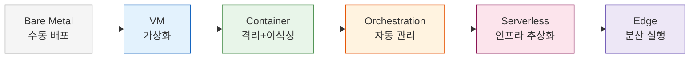
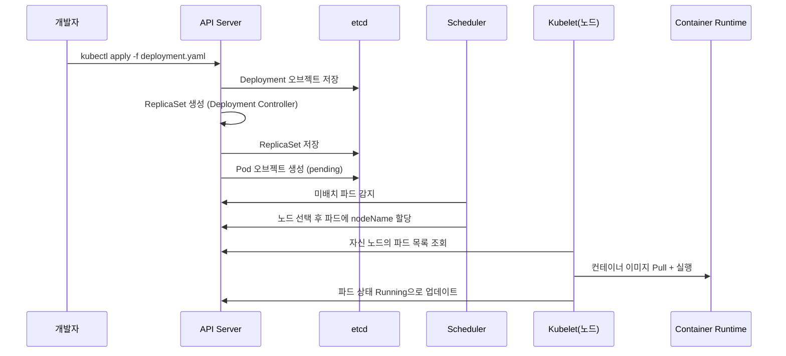

# Ch03. 오케스트레이션과 앱 관리

**핵심 질문**: "배포/스케일링/복구 자동화에 어떤 도구를 선택하는가?"

---

## 🎯 학습 목표

1. 오케스트레이션이 필요한 이유와 단계별 진화 과정을 설명할 수 있다
2. Docker Compose로 멀티서비스 애플리케이션을 정의하고 헬스체크를 구성할 수 있다
3. Kubernetes의 Deployment, Service, HPA 리소스를 작성하고 의미를 해석할 수 있다
4. Serverless(AWS Lambda)의 실행 모델과 Cold Start 특성을 이해한다
5. 서비스 규모와 팀 역량에 맞는 오케스트레이션 도구를 선택하는 기준을 세울 수 있다
6. VM, 컨테이너, Serverless의 비용·복잡도·스케일링 특성을 비교할 수 있다

---

## 1. 오케스트레이션이란

서버 하나에 애플리케이션 하나를 올리던 시절에는 배포가 단순했다. SSH로 접속해서 `systemctl restart app` 한 줄이면 충분했고, 장애가 나면 같은 방식으로 재시작하면 됐다. 문제는 트래픽이 늘고 서비스가 복잡해지면서 시작된다.

**단일 서버**에서는 CPU가 100%에 달해도 서버를 추가하려면 수작업이 필요하다. 새 서버를 프로비저닝하고, 코드를 배포하고, 로드밸런서 설정을 바꾸는 데 몇 시간이 걸린다. 그동안 사용자들은 느린 응답을 받거나 에러를 마주한다.

**다중 서버** 환경으로 넘어오면 다른 문제가 생긴다. "지금 배포된 버전이 서버마다 다르다", "서버 A는 살아있는데 서버 B는 죽어있다", "특정 서버에만 환경변수가 설정되지 않았다" 같은 상태 불일치가 일상이 된다. 이것을 일일이 추적하고 수동으로 맞추는 비용이 어마어마하다.

**컨테이너 오케스트레이션**은 이 문제를 "선언적 상태 관리"로 해결한다. "웹 서버 3개, API 서버 5개, DB 1개를 이런 스펙으로 실행하라"고 선언하면, 오케스트레이터가 현재 상태를 파악해서 목표 상태에 맞게 자동으로 조정한다. 사람이 "어디에 어떻게" 배포할지 고민하는 대신, 시스템이 "무엇을 몇 개"라는 의도만 받아서 나머지를 처리한다.



이 진화 과정에서 각 단계는 이전 단계의 한계를 해결하지만 새로운 복잡도를 도입한다. Bare Metal은 단순하지만 유연성이 없고, Serverless는 유연하지만 벤더 종속과 Cold Start 문제가 생긴다. 어디에 멈출지는 팀의 역량과 서비스 요구사항에 달려 있다.

---

## 2. Docker Compose로 멀티서비스 관리

Docker Compose는 단일 호스트에서 여러 컨테이너를 하나의 단위로 관리하는 도구다. 개발 환경이나 소규모 프로덕션에서 빛을 발한다. YAML 파일 하나에 전체 스택을 정의하고 `docker compose up -d`로 올리면 된다.

핵심은 **서비스 의존성 관리**와 **헬스체크**다. API 서버가 DB보다 먼저 뜨면 연결에 실패한다. `depends_on`만으로는 부족하다. 컨테이너가 시작됐다고 DB가 준비된 것이 아니기 때문이다. `condition: service_healthy`와 `healthcheck`를 함께 사용해야 실제로 DB가 쿼리를 받을 준비가 됐을 때 API가 시작된다.

```yaml
# docker-compose.yml
# 목적: 웹 + API + DB + Redis의 완전한 스택을 단일 파일로 정의
# 핵심: healthcheck + depends_on condition으로 시작 순서 보장

version: "3.9"

services:
  web:
    image: nginx:1.25-alpine
    ports:
      - "80:80"
    volumes:
      - ./nginx.conf:/etc/nginx/nginx.conf:ro  # 읽기전용 마운트
    depends_on:
      api:
        condition: service_healthy  # API가 healthy 상태일 때만 web 시작
    networks:
      - frontend
    restart: unless-stopped  # 수동 중지 외에는 항상 재시작

  api:
    build:
      context: ./api
      dockerfile: Dockerfile
    environment:
      - DB_HOST=db
      - DB_PORT=5432
      - DB_NAME=appdb
      - DB_USER=appuser
      - DB_PASSWORD_FILE=/run/secrets/db_password  # 시크릿 파일 참조
      - REDIS_URL=redis://cache:6379
    depends_on:
      db:
        condition: service_healthy  # DB가 준비돼야 API 시작
      cache:
        condition: service_healthy
    healthcheck:
      test: ["CMD", "curl", "-f", "http://localhost:8080/health"]
      interval: 10s    # 10초마다 체크
      timeout: 5s      # 5초 내 응답 없으면 실패
      retries: 3       # 3번 연속 실패 시 unhealthy
      start_period: 30s  # 시작 후 30초는 실패해도 무시 (초기화 시간)
    networks:
      - frontend
      - backend
    restart: unless-stopped
    secrets:
      - db_password

  db:
    image: postgres:16-alpine
    environment:
      - POSTGRES_DB=appdb
      - POSTGRES_USER=appuser
      - POSTGRES_PASSWORD_FILE=/run/secrets/db_password
    volumes:
      - db_data:/var/lib/postgresql/data  # named volume으로 데이터 영속화
      - ./init.sql:/docker-entrypoint-initdb.d/init.sql:ro
    healthcheck:
      # pg_isready: PostgreSQL 전용 연결 체크 명령어
      test: ["CMD-SHELL", "pg_isready -U appuser -d appdb"]
      interval: 10s
      timeout: 5s
      retries: 5
      start_period: 20s
    networks:
      - backend
    restart: unless-stopped
    secrets:
      - db_password

  cache:
    image: redis:7-alpine
    command: redis-server --appendonly yes  # AOF 활성화: 재시작 후 데이터 복구
    volumes:
      - redis_data:/data
    healthcheck:
      test: ["CMD", "redis-cli", "ping"]  # PONG 응답 확인
      interval: 10s
      timeout: 3s
      retries: 3
    networks:
      - backend
    restart: unless-stopped

networks:
  frontend:
    driver: bridge  # 외부 노출 네트워크
  backend:
    driver: bridge
    internal: true  # 외부 접근 차단 — DB, Redis는 직접 노출하지 않음

volumes:
  db_data:
    driver: local  # 호스트 로컬 디스크에 저장
  redis_data:
    driver: local

secrets:
  db_password:
    file: ./secrets/db_password.txt  # 파일에서 시크릿 로드
```

네트워크를 `frontend`와 `backend`로 분리한 이유는 보안이다. `backend` 네트워크는 `internal: true`로 설정해서 외부에서 직접 DB나 Redis에 접근할 수 없다. API 서버만 두 네트워크에 모두 속해서 브릿지 역할을 한다.

Docker Compose의 한계는 단일 호스트다. 서버 하나가 죽으면 전체 서비스가 중단된다. 여러 서버에 걸쳐 컨테이너를 분산 실행하고 싶다면 Kubernetes가 필요하다.

---

## 3. Kubernetes 핵심 리소스

Kubernetes(K8s)는 컨테이너 오케스트레이션의 사실상 표준이다. 복잡하다는 평이 맞지만, 그 복잡도는 실제 분산 시스템의 어려움을 해결하는 데서 온다. 핵심 리소스 세 가지만 이해해도 기본 운영이 가능하다: Deployment, Service, HPA.

### Deployment — 파드 생명주기 관리

Deployment는 "이 컨테이너 이미지를 3개 실행하고 항상 유지하라"는 선언이다. 파드가 죽으면 자동으로 재생성하고, 이미지를 업데이트하면 롤링 방식으로 무중단 배포한다.

```yaml
# deployment.yaml
# 목적: API 서버의 배포 전략과 리소스 제한을 선언
apiVersion: apps/v1
kind: Deployment
metadata:
  name: api-server
  namespace: production
  labels:
    app: api-server
    version: "1.2.0"
spec:
  replicas: 3  # 항상 3개 파드 유지
  selector:
    matchLabels:
      app: api-server  # 이 라벨이 있는 파드를 관리
  strategy:
    type: RollingUpdate
    rollingUpdate:
      maxSurge: 1        # 업데이트 중 최대 1개 추가 생성 (3+1=4개까지)
      maxUnavailable: 0  # 업데이트 중 서비스 불가 파드 0개 — 무중단 보장
  template:
    metadata:
      labels:
        app: api-server  # selector와 일치해야 함
    spec:
      containers:
        - name: api
          image: myregistry/api-server:1.2.0
          ports:
            - containerPort: 8080
          env:
            - name: DB_HOST
              valueFrom:
                secretKeyRef:       # Secret에서 값 주입
                  name: db-secret
                  key: host
            - name: LOG_LEVEL
              valueFrom:
                configMapKeyRef:    # ConfigMap에서 값 주입
                  name: api-config
                  key: log_level
          resources:
            requests:               # 스케줄러가 노드 배치 시 참고하는 최소 보장값
              cpu: "100m"           # 0.1 코어
              memory: "128Mi"
            limits:                 # 이 값을 초과하면 강제 제한 (OOMKill)
              cpu: "500m"           # 0.5 코어
              memory: "512Mi"
          livenessProbe:            # 실패 시 컨테이너 재시작 — 데드락 감지용
            httpGet:
              path: /health/live
              port: 8080
            initialDelaySeconds: 30  # 앱 초기화 시간 고려
            periodSeconds: 10
            failureThreshold: 3
          readinessProbe:           # 실패 시 트래픽 라우팅 중단 — 준비 안 된 파드 보호
            httpGet:
              path: /health/ready
              port: 8080
            initialDelaySeconds: 10
            periodSeconds: 5
            failureThreshold: 3
      # 파드를 서로 다른 노드에 분산 배치 — 노드 장애 시 전체 중단 방지
      affinity:
        podAntiAffinity:
          preferredDuringSchedulingIgnoredDuringExecution:
            - weight: 100
              podAffinityTerm:
                labelSelector:
                  matchExpressions:
                    - key: app
                      operator: In
                      values:
                        - api-server
                topologyKey: kubernetes.io/hostname
```

`livenessProbe`와 `readinessProbe`는 다른 목적을 가진다. Liveness는 "이 컨테이너가 살아있는가?"를 묻는다. 실패하면 K8s가 컨테이너를 재시작한다. Readiness는 "이 컨테이너가 트래픽을 받을 준비가 됐는가?"를 묻는다. 실패해도 재시작하지 않고 Service의 엔드포인트 목록에서만 제거한다. 배포 중 새 파드가 완전히 준비되기 전에 트래픽을 받지 않도록 보호하는 역할이다.

### Service — 안정적인 네트워크 엔드포인트

파드는 생성되고 삭제되면서 IP가 바뀐다. Service는 이 일시적인 파드들 앞에 고정된 가상 IP와 DNS 이름을 제공한다. 파드가 3개든 10개든, 클라이언트는 Service 이름 하나로 접근하면 K8s가 로드밸런싱해준다.

```yaml
# service.yaml
# 목적: Deployment의 파드들에 안정적인 접근점 제공
apiVersion: v1
kind: Service
metadata:
  name: api-server-svc
  namespace: production
spec:
  type: ClusterIP  # 클러스터 내부 접근만 허용 (기본값)
  # type: LoadBalancer  # 클라우드 로드밸런서 프로비저닝 (외부 노출 시)
  # type: NodePort     # 노드 포트로 외부 노출 (로컬 테스트용)
  selector:
    app: api-server  # 이 라벨을 가진 파드에게 트래픽 전달
  ports:
    - name: http
      protocol: TCP
      port: 80          # Service가 노출하는 포트
      targetPort: 8080  # 파드의 실제 포트
```

클러스터 내부에서는 `http://api-server-svc.production.svc.cluster.local`이라는 DNS 이름으로 접근할 수 있다. 짧게는 같은 네임스페이스 내에서 `api-server-svc`만으로도 된다.

### HPA — 자동 스케일링

수동으로 `kubectl scale deployment api-server --replicas=10`을 치는 방식은 야간 트래픽 급증에 대응할 수 없다. HPA(Horizontal Pod Autoscaler)는 메트릭을 보고 파드 수를 자동으로 조정한다.

```yaml
# hpa.yaml
# 목적: CPU/메모리 메트릭 기반으로 파드 수를 자동 조정
apiVersion: autoscaling/v2
kind: HorizontalPodAutoscaler
metadata:
  name: api-server-hpa
  namespace: production
spec:
  scaleTargetRef:
    apiVersion: apps/v1
    kind: Deployment
    name: api-server  # 어떤 Deployment를 스케일링할지
  minReplicas: 3   # 트래픽이 없어도 최소 3개 유지 (가용성 보장)
  maxReplicas: 20  # 비용 제어를 위한 상한선
  metrics:
    - type: Resource
      resource:
        name: cpu
        target:
          type: Utilization
          averageUtilization: 70  # CPU 평균 70% 초과 시 스케일아웃
    - type: Resource
      resource:
        name: memory
        target:
          type: Utilization
          averageUtilization: 80  # 메모리 80% 초과 시 스케일아웃
  behavior:
    scaleUp:
      stabilizationWindowSeconds: 60   # 60초 안정화 후 스케일업 — 급등 방지
      policies:
        - type: Pods
          value: 4         # 한 번에 최대 4개 추가
          periodSeconds: 60
    scaleDown:
      stabilizationWindowSeconds: 300  # 스케일다운은 5분 안정화 — 플래핑 방지
      policies:
        - type: Percent
          value: 25        # 한 번에 최대 25% 감소
          periodSeconds: 60
```

`stabilizationWindowSeconds`가 중요하다. 스케일업은 빠르게(60초), 스케일다운은 느리게(300초) 설정하는 것이 관례다. 트래픽이 잠시 빠졌다가 다시 오는 상황에서 파드를 줄였다 늘렸다 반복하는 "플래핑" 현상을 막는다.

**나쁜 방법 vs 좋은 방법 비교:**

```bash
# Bad: 수동 스케일링 — 사람이 24시간 모니터링해야 함
kubectl scale deployment api-server --replicas=10
# 트래픽 줄면? 다시 수동으로 줄여야 함
kubectl scale deployment api-server --replicas=3

# Good: HPA 자동 스케일링 — 선언하면 K8s가 알아서 조정
# hpa.yaml을 적용하면 70% CPU 기준으로 3~20 사이에서 자동 조정
kubectl apply -f hpa.yaml
# 확인
kubectl get hpa api-server-hpa -n production
# NAME              REFERENCE              TARGETS   MINPODS   MAXPODS   REPLICAS
# api-server-hpa    Deployment/api-server  45%/70%   3         20        3
```

---

## 4. Serverless — AWS Lambda

Serverless는 서버가 없는 것이 아니라, 서버를 직접 관리하지 않는 실행 모델이다. 코드를 함수 단위로 업로드하면 클라우드 제공자가 실행 환경을 프로비저닝하고 트래픽에 따라 자동으로 스케일링한다. 비용은 실행 시간과 요청 수에 따라 청구되므로, 요청이 없을 때는 비용이 0이다.

Lambda의 실행 모델을 이해해야 올바르게 사용할 수 있다. 함수가 호출되면 Lambda는 컨테이너를 준비하고 코드를 로드하는데, 이 초기화 시간을 **Cold Start**라고 한다. 이미 준비된 컨테이너가 있으면 재사용해서 초기화 없이 바로 실행하는데, 이를 **Warm Start**라 한다.

```javascript
// lambda-handler.js
// 목적: API Gateway 이벤트를 받아 DynamoDB를 조회하는 Lambda 핸들러
// 주의: 핸들러 밖에서 초기화 — Warm Start 시 재사용되어 Cold Start 비용 절감

const { DynamoDBClient, GetItemCommand, PutItemCommand } = require("@aws-sdk/client-dynamodb");
const { marshall, unmarshall } = require("@aws-sdk/util-dynamodb");

// 핸들러 밖 초기화: Cold Start에만 실행, Warm Start에서는 재사용
// DB 연결, SDK 클라이언트 등 무거운 초기화는 여기서
const dynamoDB = new DynamoDBClient({ region: process.env.AWS_REGION });
const TABLE_NAME = process.env.TABLE_NAME;

// 핸들러 함수: API Gateway의 각 요청마다 호출됨
exports.handler = async (event) => {
  console.log("Event:", JSON.stringify(event, null, 2));

  try {
    const { httpMethod, pathParameters, body } = event;

    // REST API 라우팅 — API Gateway의 리소스 경로와 매핑
    if (httpMethod === "GET" && pathParameters?.id) {
      return await getItem(pathParameters.id);
    } else if (httpMethod === "POST" && body) {
      return await createItem(JSON.parse(body));
    }

    return response(400, { error: "지원하지 않는 요청입니다" });

  } catch (error) {
    // Lambda는 예외가 throw되면 재시도할 수 있으므로
    // 클라이언트 오류(4xx)는 예외 대신 응답으로 반환
    console.error("Error:", error);
    return response(500, { error: "서버 오류가 발생했습니다" });
  }
};

async function getItem(id) {
  const command = new GetItemCommand({
    TableName: TABLE_NAME,
    Key: marshall({ id }),  // marshall: JS 객체 → DynamoDB 형식 변환
  });

  const result = await dynamoDB.send(command);

  if (!result.Item) {
    return response(404, { error: `아이템 ${id}를 찾을 수 없습니다` });
  }

  return response(200, unmarshall(result.Item));  // unmarshall: DynamoDB → JS 객체
}

async function createItem(data) {
  // 입력값 검증 — Lambda는 API Gateway 뒤에서도 직접 호출될 수 있으므로
  // 함수 자체에서 검증하는 것이 더 안전하다
  if (!data.title || typeof data.title !== "string") {
    return response(400, { error: "title 필드가 필요합니다" });
  }

  const item = {
    id: `${Date.now()}-${Math.random().toString(36).substr(2, 9)}`,
    title: data.title,
    createdAt: new Date().toISOString(),
  };

  const command = new PutItemCommand({
    TableName: TABLE_NAME,
    Item: marshall(item),
    ConditionExpression: "attribute_not_exists(id)",  // 중복 방지
  });

  await dynamoDB.send(command);
  return response(201, item);
}

// 응답 헬퍼: API Gateway가 요구하는 형식
function response(statusCode, body) {
  return {
    statusCode,
    headers: {
      "Content-Type": "application/json",
      "Access-Control-Allow-Origin": "*",
    },
    body: JSON.stringify(body),
  };
}
```

Lambda의 실행 환경은 요청 사이에 잠시 유지되다가 사라진다. 따라서 **상태를 Lambda 내부에 저장하면 안 된다**. 세션, 캐시, 파일 등 모든 상태는 DynamoDB, S3, ElastiCache 같은 외부 스토리지에 저장해야 한다.

---

## 5. 도구 선택 매트릭스

어떤 오케스트레이션 도구를 선택할지는 서비스 특성과 팀 역량에 따라 달라진다. 각 옵션의 장단점을 비교해서 판단 기준을 잡는다.

| 기준 | VM (단일/다중) | Docker Compose | Kubernetes | Serverless |
|------|---------------|----------------|------------|------------|
| **운영 복잡도** | 낮음 | 낮음 | 높음 | 최소 |
| **학습 곡선** | 낮음 | 낮음 | 높음 | 낮음 |
| **스케일링** | 수동 | 수동/제한적 | 자동 (HPA) | 자동 (플랫폼) |
| **비용 (저트래픽)** | 고정 비용 | 고정 비용 | 고정 비용 | 거의 0 |
| **비용 (고트래픽)** | 고정+수동 | 단일호스트 한계 | 효율적 | 높아질 수 있음 |
| **고가용성** | 수동 구성 | 단일 호스트 제약 | 내장 | 플랫폼 보장 |
| **배포 전략** | 수동 | 재시작 방식 | 롤링/카나리 | 자동 |
| **콜드 스타트** | 없음 | 없음 | 거의 없음 | 있음 (수백ms) |
| **적합한 규모** | 소규모 | 소~중규모 | 중~대규모 | 이벤트 기반 |
| **벤더 종속** | 낮음 | 없음 | 낮음 | 높음 |

**선택 가이드:**
- 서비스를 처음 만들고 팀이 작다면 Docker Compose로 시작한다. Kubernetes의 복잡도를 감당할 엔지니어링 비용이 없다.
- 서비스가 성장해서 다중 서버가 필요하거나, 팀에 DevOps 엔지니어가 있다면 Kubernetes를 고려한다.
- 이벤트 처리, 예측 불가한 트래픽, 배치 작업이라면 Serverless가 경제적이다.
- 레이턴시 요구사항이 엄격하다면(10ms 이내) Serverless의 Cold Start는 문제가 될 수 있다.

---

## 6. 오케스트레이션 선택의 실제

이론적인 비교만으로는 부족하다. 실제 상황에서 어떤 기준으로 결정하는지 살펴본다.

스타트업 초기에는 Docker Compose가 합리적인 선택이다. Kubernetes를 운영하려면 최소 1명의 전담 엔지니어가 필요하다. 클러스터 업그레이드, 노드 관리, 네트워크 정책, RBAC 설정 등을 처리해야 하는데, 초기 팀에서 이 비용을 감당하는 것은 오버엔지니어링이다.

반대로 팀이 20명을 넘고 마이크로서비스가 10개 이상이 되면 Kubernetes 없이는 운영 자체가 힘들어진다. 서비스마다 배포 파이프라인을 따로 관리하고, 서버 프로비저닝을 수동으로 하면 엔지니어들이 개발 대신 운영에 시간을 쏟게 된다.

AWS EKS, GKE, AKS 같은 매니지드 Kubernetes 서비스는 클러스터 관리 부담을 줄여준다. 컨트롤 플레인은 클라우드 제공자가 관리하고, 팀은 워크로드에만 집중할 수 있다.

### K8s 배포 흐름 — 실제로 무슨 일이 일어나는가

`kubectl apply -f deployment.yaml`을 실행하면 클러스터 내부에서 여러 컴포넌트가 협력한다. 이 흐름을 이해하면 배포가 느리거나 실패할 때 어디를 봐야 할지 알 수 있다.



각 컴포넌트는 **watch 루프**로 동작한다. Scheduler는 `nodeName`이 비어있는 파드를 지속적으로 감시하고, Kubelet은 자신 노드에 할당된 파드를 감시한다. 중앙에서 명령을 내리는 것이 아니라, 각자가 자신의 관심사를 감시하고 반응하는 구조다. 이 때문에 컨트롤 플레인이 잠깐 다운돼도 이미 실행 중인 워크로드는 계속 동작한다.

### 자가 치유 — K8s가 장애를 처리하는 방식

Kubernetes의 가장 큰 장점 중 하나는 **자가 치유(self-healing)**다. 파드가 비정상 종료되면 ReplicaSet 컨트롤러가 즉시 감지해서 새 파드를 생성한다. 노드 전체가 다운되면 그 노드의 파드들을 다른 건강한 노드로 재스케줄링한다.

```bash
# 자가 치유 동작 확인 — 파드를 강제로 삭제해도 즉시 재생성됨
kubectl get pods -n production -w
# NAME                          READY   STATUS    RESTARTS   AGE
# api-server-7d9f8c6b4-xk2pq   1/1     Running   0          10m

# 파드 강제 삭제
kubectl delete pod api-server-7d9f8c6b4-xk2pq -n production

# 삭제 직후: ReplicaSet이 새 파드 즉시 생성
# api-server-7d9f8c6b4-xk2pq   1/1     Terminating   0          10m
# api-server-7d9f8c6b4-mn8rt   0/1     ContainerCreating   0   2s
# api-server-7d9f8c6b4-mn8rt   1/1     Running   0          8s
# replicas=3 선언이 항상 유지됨을 확인

# 노드 장애 시뮬레이션 — 노드를 스케줄링 불가로 표시
kubectl cordon node-2
kubectl drain node-2 --ignore-daemonsets --delete-emptydir-data
# node-2의 파드들이 node-1, node-3으로 재배치됨
```

자가 치유가 동작하려면 두 가지 조건이 갖춰져야 한다. 첫째, `livenessProbe`가 올바르게 설정돼야 한다. 애플리케이션이 응답을 멈췄는데 프로세스는 살아있는 상황(데드락, 무한루프)에서 K8s가 재시작을 트리거하려면 liveness 실패 감지가 필요하다. 둘째, 이미지가 레지스트리에서 접근 가능해야 한다. `ImagePullBackOff` 상태가 되면 자가 치유가 불가능하다.

### Namespace와 RBAC — 멀티팀 환경에서의 격리

여러 팀이 같은 클러스터를 사용할 때 Namespace로 논리적으로 분리한다. Namespace는 이름 충돌을 방지하고, ResourceQuota로 팀별 리소스 한도를 설정할 수 있다.

```bash
# 네임스페이스 생성 및 ResourceQuota 설정
kubectl create namespace team-payment

cat <<EOF | kubectl apply -f -
apiVersion: v1
kind: ResourceQuota
metadata:
  name: payment-quota
  namespace: team-payment
spec:
  hard:
    requests.cpu: "4"         # 팀 전체 CPU 요청 합계 상한
    requests.memory: 8Gi
    limits.cpu: "8"
    limits.memory: 16Gi
    pods: "20"                # 최대 파드 수
EOF

# 네임스페이스별 리소스 사용 현황 확인
kubectl describe resourcequota payment-quota -n team-payment
```

Namespace만으로는 보안이 부족하다. RBAC(Role-Based Access Control)으로 "payment 팀 개발자는 team-payment 네임스페이스에서만 배포할 수 있고, 다른 팀의 시크릿은 볼 수 없다"처럼 세밀한 권한을 설정해야 한다. RBAC의 상세 내용은 `02-kubernetes` PoC의 보안 챕터에서 다룬다.

---

## 📚 교차참조

- **Kubernetes 상세**: `runners-high/poc/03_CloudNative/02-kubernetes/` — 20챕터, 네트워킹, 스토리지, 보안, Helm 포함
- **Docker 컨테이너 기초**: `runners-high/poc/03_CloudNative/01-docker/` — Dockerfile, 이미지 최적화, 네트워킹
- **Jenkins CI/CD 연동**: `runners-high/poc/05_DevOps/01-jenkins/` — 빌드 후 K8s 배포 파이프라인
- **Service Mesh**: `runners-high/poc/03_CloudNative/03-service-mesh/` — K8s 위에서 Linkerd/Istio 운영

---

## ✅ 핵심 요약

오케스트레이션은 "수동 관리"에서 "선언적 자동화"로의 전환이다. Docker Compose는 단일 호스트에서 서비스를 구성하는 가장 단순한 방법이고, Kubernetes는 다중 호스트에서 자동 스케일링과 자가 치유를 제공한다. Serverless는 이벤트 기반 워크로드에서 인프라 관리를 완전히 추상화한다.

세 도구는 경쟁 관계가 아니라 보완 관계다. 실제 프로젝트에서는 API 서버는 K8s로, 이미지 리사이징은 Lambda로, 개발 환경은 Compose로 운영하는 하이브리드가 흔하다. 어떤 도구가 "더 좋다"가 아니라, 어떤 문제에 어떤 도구가 맞는지 판단하는 것이 오케스트레이션의 핵심이다.
