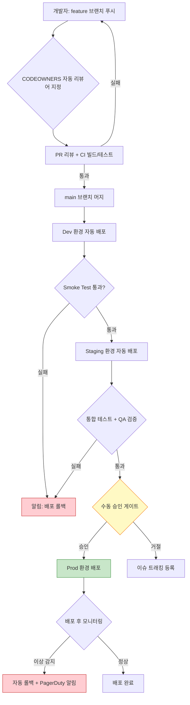

# Ch06. 멀티 팀과 환경 관리

**핵심 질문**: "팀이 늘어나면 배포와 코드를 어떻게 분리하는가?"

---

## 🎯 학습 목표

이 챕터를 마치면 다음을 할 수 있다.

- 환경(dev/staging/prod)이 왜 서로 달라야 하는지 설명하고, 각 환경의 역할을 구분할 수 있다
- Terraform Workspace를 활용해 동일한 코드베이스로 여러 환경을 독립적으로 관리할 수 있다
- Kubernetes Namespace와 RBAC를 조합해 팀별 격리와 최소 권한 접근을 구현할 수 있다
- Docker Compose override 패턴으로 환경별 설정 차이를 관리할 수 있다
- CODEOWNERS 파일로 팀별 코드 소유권을 선언하고 PR 리뷰 흐름을 자동화할 수 있다
- 환경별 설정 외부화 전략(env vars, ConfigMap, Vault)의 장단점을 비교할 수 있다

---

## 1. 환경 분리의 필요성

개발자가 한 명일 때는 로컬과 프로덕션 두 가지 환경으로도 충분하다. 그런데 팀이 커질수록 이 단순한 구조가 무너지기 시작한다. A 팀이 새 기능을 테스트하는 동안 B 팀의 버그 수정이 그 위에 덮어씌워지고, 테스트가 끝나지 않은 코드가 프로덕션에 나가는 사고가 발생한다.

환경 분리는 이 문제를 해결하기 위한 가장 기본적인 조직적 합의다. 일반적으로 세 계층이 쓰인다. 개발(dev) 환경은 새 코드가 처음 배포되는 곳으로, 빠른 피드백이 목적이라 안정성보다 속도를 우선한다. 스테이징(staging) 환경은 프로덕션과 거의 동일하게 구성해, 최종 검증 게이트 역할을 한다. 프로덕션(prod) 환경은 실제 사용자가 접근하는 곳으로, 모든 변경이 이전 두 환경을 통과한 뒤에만 들어온다.

환경이 달라야 하는 이유는 단순히 "조심하려고"가 아니다. 각 환경의 **목적이 다르기 때문**이다. dev는 실험의 공간이고, staging은 신뢰의 공간이며, prod는 약속의 공간이다. 이 목적 차이가 인프라 크기, 설정값, 접근 권한까지 모두 달라지게 만든다.

---

## 2. Terraform Workspace로 환경 분리하기

Terraform으로 인프라를 코드화할 때 가장 흔히 겪는 딜레마는 "환경별로 코드를 복사할 것인가, 아니면 하나의 코드를 재사용할 것인가"다. 복사하면 관리할 파일이 세 배로 늘어나고, 한 곳을 고치면 나머지도 고쳐야 한다는 부담이 생긴다. 그렇다고 단순히 변수만 바꾸면 환경 간 상태(state)가 뒤섞여 dev의 변경이 prod 상태에 영향을 줄 수 있다.

Terraform Workspace는 하나의 코드베이스에 대해 독립된 state 파일을 유지하는 방식으로 이 문제를 해결한다. `terraform workspace new dev`를 실행하면 `dev`라는 이름의 state가 별도 저장소에 생기고, 이후 모든 apply/plan은 그 state만 건드린다.

```hcl
# variables.tf
# 환경별 변수 기본값 - workspace 이름을 키로 사용해 각 환경에 맞는 값을 선택한다
variable "env_config" {
  description = "환경별 설정 맵 — workspace 이름이 키가 된다"
  type = map(object({
    instance_type   = string
    min_size        = number
    max_size        = number
    db_instance     = string
    enable_deletion_protection = bool
  }))

  default = {
    dev = {
      instance_type   = "t3.micro"
      min_size        = 1
      max_size        = 2
      db_instance     = "db.t3.micro"
      enable_deletion_protection = false   # dev는 빠른 재생성을 위해 삭제 보호 비활성화
    }
    staging = {
      instance_type   = "t3.small"
      min_size        = 1
      max_size        = 3
      db_instance     = "db.t3.small"
      enable_deletion_protection = false
    }
    prod = {
      instance_type   = "t3.medium"
      min_size        = 2
      max_size        = 10
      db_instance     = "db.r6g.large"
      enable_deletion_protection = true    # prod는 실수 삭제를 막기 위해 반드시 활성화
    }
  }
}

# locals.tf
# terraform.workspace 값으로 현재 환경 설정을 가져온다
locals {
  env    = terraform.workspace
  config = var.env_config[local.env]

  # 공통 태그 — 모든 리소스에 환경 이름을 붙여 비용 추적과 감사를 가능하게 한다
  common_tags = {
    Environment = local.env
    ManagedBy   = "terraform"
    Workspace   = terraform.workspace
  }
}

# main.tf — EC2 Auto Scaling Group
resource "aws_autoscaling_group" "app" {
  name             = "app-${local.env}"
  min_size         = local.config.min_size
  max_size         = local.config.max_size
  desired_capacity = local.config.min_size

  launch_template {
    id      = aws_launch_template.app.id
    version = "$Latest"
  }

  tag {
    key                 = "Environment"
    value               = local.env
    propagate_at_launch = true
  }
}

# main.tf — RDS Instance
resource "aws_db_instance" "main" {
  identifier        = "myapp-db-${local.env}"
  instance_class    = local.config.db_instance
  engine            = "postgres"
  engine_version    = "15.4"
  allocated_storage = local.env == "prod" ? 100 : 20  # prod는 더 큰 스토리지 할당

  # 삭제 보호 — prod에서 실수로 DB를 지우는 사고를 방지하는 마지막 안전망
  deletion_protection = local.config.enable_deletion_protection

  # prod와 staging에서만 멀티 AZ 활성화 — dev는 비용 절감을 위해 단일 AZ 사용
  multi_az = local.env == "prod" || local.env == "staging"

  tags = merge(local.common_tags, {
    Name = "myapp-db-${local.env}"
  })
}

# outputs.tf
output "environment" {
  description = "현재 배포된 환경 이름"
  value       = local.env
}

output "db_endpoint" {
  description = "데이터베이스 연결 엔드포인트 (민감 정보 마스킹)"
  value       = aws_db_instance.main.endpoint
  sensitive   = true
}
```

워크스페이스 사용 흐름은 단순하다.

```bash
# 처음 환경을 만들 때
terraform workspace new dev
terraform workspace new staging
terraform workspace new prod

# 환경 전환 후 apply
terraform workspace select dev
terraform plan -out=dev.tfplan
terraform apply dev.tfplan

# prod 배포 시
terraform workspace select prod
terraform plan -out=prod.tfplan
terraform apply prod.tfplan
```

---

## 3. Kubernetes Namespace와 RBAC

K8s 클러스터 하나를 여러 팀이 공유할 때, Namespace는 논리적 울타리 역할을 한다. 팀 A의 Pod가 팀 B의 Secret에 접근하거나, 실수로 다른 팀의 Deployment를 삭제하는 일을 막으려면 Namespace + RBAC 조합이 필요하다.

아래는 `team-alpha`팀이 `alpha` 네임스페이스 안에서만 리소스를 조회하고 배포할 수 있도록 제한하는 완전한 매니페스트다.

```yaml
# 01-namespace.yaml
# 팀별 네임스페이스 — 리소스 쿼터, 네트워크 정책의 경계가 된다
apiVersion: v1
kind: Namespace
metadata:
  name: alpha
  labels:
    team: team-alpha
    env: production
---
# 02-serviceaccount.yaml
# CI/CD 파이프라인이 K8s API를 호출할 때 사용하는 전용 계정
apiVersion: v1
kind: ServiceAccount
metadata:
  name: team-alpha-deployer
  namespace: alpha
  annotations:
    description: "team-alpha CI/CD 배포용 서비스 계정 — IAM Role과 연결 가능"
---
# 03-role.yaml
# 최소 권한 원칙 — team-alpha는 자신의 네임스페이스에서 Deployment/Service/ConfigMap만 다룰 수 있다
# Secrets 쓰기 권한은 의도적으로 제외 — Vault나 External Secrets Operator가 담당한다
apiVersion: rbac.authorization.k8s.io/v1
kind: Role
metadata:
  name: team-alpha-deploy-role
  namespace: alpha
rules:
  - apiGroups: ["apps"]
    resources: ["deployments", "replicasets"]
    verbs: ["get", "list", "watch", "create", "update", "patch"]
  - apiGroups: [""]
    resources: ["services", "configmaps", "pods", "pods/logs"]
    verbs: ["get", "list", "watch", "create", "update", "patch"]
  - apiGroups: [""]
    resources: ["secrets"]
    verbs: ["get", "list"]    # 읽기만 허용 — 시크릿 생성/수정은 인프라 팀 담당
  - apiGroups: ["networking.k8s.io"]
    resources: ["ingresses"]
    verbs: ["get", "list", "watch", "create", "update", "patch"]
---
# 04-rolebinding.yaml
# ServiceAccount와 Role을 연결 — 이 바인딩이 없으면 Role 정의만으로는 아무 효과가 없다
apiVersion: rbac.authorization.k8s.io/v1
kind: RoleBinding
metadata:
  name: team-alpha-deploy-binding
  namespace: alpha
subjects:
  - kind: ServiceAccount
    name: team-alpha-deployer
    namespace: alpha
roleRef:
  kind: Role
  apiRef: rbac.authorization.k8s.io
  name: team-alpha-deploy-role
```

팀 간 네트워크 통신도 기본적으로 차단해야 한다. NetworkPolicy를 쓰면 "같은 네임스페이스 내 통신만 허용, 외부는 특정 포트만 열기" 같은 정책을 선언할 수 있다.

```yaml
# 05-networkpolicy.yaml
# 기본 정책: alpha 네임스페이스로 들어오는 트래픽은 같은 네임스페이스 Pod와
# ingress-nginx 네임스페이스에서만 허용한다
apiVersion: networking.k8s.io/v1
kind: NetworkPolicy
metadata:
  name: alpha-default-deny
  namespace: alpha
spec:
  podSelector: {}          # 네임스페이스 내 모든 Pod에 적용
  policyTypes:
    - Ingress
    - Egress
  ingress:
    - from:
        # 같은 네임스페이스 Pod 간 통신은 항상 허용
        - podSelector: {}
        # Ingress Controller에서 오는 트래픽 허용
        - namespaceSelector:
            matchLabels:
              kubernetes.io/metadata.name: ingress-nginx
  egress:
    - to:
        - podSelector: {}   # 같은 네임스페이스 내부 통신 허용
    - to:
        - namespaceSelector:
            matchLabels:
              kubernetes.io/metadata.name: kube-dns
      ports:
        - port: 53
          protocol: UDP     # DNS 조회는 항상 허용 — 없으면 서비스 디스커버리가 불가능하다
```

---

## 4. K8s ResourceQuota와 LimitRange

RBAC이 "누가 무엇을 할 수 있는가"를 제한한다면, ResourceQuota와 LimitRange는 "얼마나 쓸 수 있는가"를 제한한다. 팀 A가 클러스터의 CPU 전체를 써버리면 팀 B의 Pod가 Pending 상태에 머무는 일이 생긴다. 공유 클러스터에서는 자원 독점을 막는 경계가 반드시 필요하다.

ResourceQuota는 네임스페이스 전체에 허용되는 총량을 정의한다. LimitRange는 개별 Pod나 Container에 적용되는 기본값과 최대값을 설정한다. LimitRange가 없으면 리소스 제한을 명시하지 않은 Pod가 무제한으로 자원을 사용할 수 있어 다른 팀에 영향을 준다.

```yaml
# 06-resourcequota.yaml
# team-alpha 네임스페이스 전체에 허용되는 자원 총량 — 이 한도를 넘으면 Pod 생성이 거부된다
apiVersion: v1
kind: ResourceQuota
metadata:
  name: alpha-quota
  namespace: alpha
spec:
  hard:
    # 컴퓨팅 자원 — requests는 보장량, limits는 최대 사용량
    requests.cpu: "4"
    requests.memory: 8Gi
    limits.cpu: "8"
    limits.memory: 16Gi

    # 오브젝트 수 제한 — 실수로 무한 루프가 Pod를 계속 생성하는 사고를 막는다
    pods: "20"
    services: "10"
    persistentvolumeclaims: "5"
    secrets: "20"
    configmaps: "20"

    # LoadBalancer 서비스는 클라우드 비용이 크므로 팀당 허용 수를 제한한다
    services.loadbalancers: "2"
---
# 07-limitrange.yaml
# 개별 Container에 적용되는 기본값과 상한 — requests/limits를 명시하지 않은 Container에 자동 적용된다
apiVersion: v1
kind: LimitRange
metadata:
  name: alpha-limitrange
  namespace: alpha
spec:
  limits:
    - type: Container
      # default: requests/limits를 명시하지 않은 Container에 자동으로 적용되는 값
      default:
        cpu: "500m"
        memory: 256Mi
      defaultRequest:
        cpu: "100m"
        memory: 128Mi
      # max: 이 값을 초과하는 Container는 생성이 거부된다
      max:
        cpu: "2"
        memory: 2Gi
      min:
        cpu: "50m"
        memory: 64Mi
    - type: Pod
      max:
        cpu: "4"
        memory: 4Gi
```

설정 후 실제 사용량은 `kubectl describe resourcequota -n alpha`로 확인할 수 있다. 팀이 할당량의 80%에 도달하면 알람을 보내는 정책을 추가하면 예상치 못한 배포 실패를 미리 막을 수 있다.

---

## 5. Docker Compose Override 패턴

로컬 개발과 프로덕션 배포에 동일한 `docker-compose.yml`을 쓰면 두 가지 문제가 생긴다. 개발 편의를 위한 볼륨 마운트나 디버그 포트가 프로덕션에 노출되거나, 프로덕션용 리소스 제한이 개발 환경을 느리게 만든다. Override 패턴은 공통 설정은 `docker-compose.yml`에 두고, 환경별 차이만 override 파일에 선언하는 방식으로 이 문제를 해결한다.

```yaml
# docker-compose.yml — 공통 기반 설정
version: "3.9"

services:
  app:
    image: myapp:${APP_VERSION:-latest}
    environment:
      - DATABASE_URL=${DATABASE_URL}
      - REDIS_URL=${REDIS_URL}
    depends_on:
      - postgres
      - redis

  postgres:
    image: postgres:15-alpine
    environment:
      POSTGRES_DB: ${POSTGRES_DB:-myapp}
      POSTGRES_USER: ${POSTGRES_USER:-appuser}
      POSTGRES_PASSWORD: ${POSTGRES_PASSWORD}

  redis:
    image: redis:7-alpine
```

프로덕션 override 파일은 공통 파일의 설정을 덮어쓰거나 보완한다.

```yaml
# docker-compose.prod.yml — 프로덕션 전용 오버라이드
version: "3.9"

services:
  app:
    # 프로덕션에서는 항상 명시적 태그를 사용 — latest는 재현 불가능한 배포를 만든다
    image: myapp:${APP_VERSION}
    restart: always
    deploy:
      replicas: 3
      resources:
        limits:
          cpus: "1.0"
          memory: 512M
        reservations:
          cpus: "0.5"
          memory: 256M
    # 프로덕션에서는 포트를 직접 바인딩하지 않는다 — Nginx나 로드밸런서가 앞에 위치한다
    # ports는 의도적으로 비워둔다
    logging:
      driver: "json-file"
      options:
        max-size: "50m"
        max-file: "5"

  postgres:
    restart: always
    volumes:
      # 프로덕션 데이터는 named volume으로 관리 — 컨테이너 재시작 후에도 데이터 유지
      - postgres_prod_data:/var/lib/postgresql/data
    deploy:
      resources:
        limits:
          memory: 1G

volumes:
  postgres_prod_data:
    external: true    # 사전에 수동으로 생성된 외부 볼륨 — 실수 삭제 방지
```

실행은 `-f` 플래그로 파일을 명시적으로 지정한다.

```bash
# 개발 환경 (기본 파일만 사용)
docker compose up -d

# 프로덕션 환경 (두 파일을 병합해 실행)
docker compose -f docker-compose.yml -f docker-compose.prod.yml up -d

# 설정 확인 — 두 파일이 실제로 어떻게 병합되는지 미리 확인한다
docker compose -f docker-compose.yml -f docker-compose.prod.yml config
```

---

## 6. 환경별 설정 관리 전략

설정을 어디에 저장하고 어떻게 주입하느냐는 보안과 운영 편의성의 트레이드오프다. 세 가지 주요 방법이 있다.

**환경 변수**는 가장 단순하다. 12-Factor App 원칙에서 권장하는 방식으로, 설정이 코드와 완전히 분리된다. 단점은 컨테이너 환경에서 모든 자식 프로세스가 볼 수 있어 시크릿 유출 위험이 있고, 수백 개의 변수를 관리하기 어렵다는 점이다.

**Kubernetes ConfigMap/Secret**은 K8s 환경에서 설정을 선언적으로 관리하는 방법이다. ConfigMap은 일반 설정, Secret은 민감 정보에 사용한다. 다만 K8s Secret은 기본적으로 base64 인코딩만 할 뿐 암호화가 아니므로, etcd 암호화나 외부 시크릿 관리가 별도로 필요하다.

**HashiCorp Vault** 같은 전용 시크릿 관리 도구는 가장 강력하다. 동적 시크릿(요청할 때마다 새 자격증명 생성), 접근 감사 로그, 자동 만료 같은 기능을 제공한다. 운영 복잡도가 올라가므로 팀 규모와 보안 요구사항을 고려해 선택해야 한다.

| 방법 | 적합한 경우 | 주의 사항 |
|------|-----------|----------|
| 환경 변수 | 소규모 팀, 비민감 설정 | 시크릿은 별도 처리 필요 |
| K8s ConfigMap/Secret | K8s 환경, 팀 단위 관리 | etcd 암호화 필수 |
| Vault / AWS Secrets Manager | 대규모 팀, 높은 보안 요구 | 운영 복잡도 증가 |

---

## 7. 멀티 팀 코드 소유권: CODEOWNERS

코드가 많아지고 팀이 늘어나면 "이 코드를 누가 리뷰해야 하는가?"라는 질문이 반드시 나온다. 슬랙에서 물어보고 기다리는 방식은 작동하지 않는다. CODEOWNERS 파일은 이 질문을 코드로 선언하는 방법이다.

GitHub/GitLab은 PR이 열릴 때 변경된 파일의 CODEOWNERS를 읽어 해당 팀이나 사람을 자동으로 리뷰어로 추가한다. 이 파일 하나가 "배포 전 반드시 팀장 리뷰 필요"라는 조직 프로세스를 자동화한다.

```gitignore
# .github/CODEOWNERS
# 형식: 파일 패턴 → 오너 (GitHub 유저네임 또는 팀 이름)
# 여러 오너를 나열하면 모두가 리뷰어로 자동 추가된다

# 기본 소유권 — 다른 규칙에 매칭되지 않는 모든 파일
*                           @org/platform-team

# 인프라 코드는 DevOps 팀이 반드시 리뷰
/terraform/                 @org/devops-team
/k8s/                       @org/devops-team
/.github/workflows/         @org/devops-team

# 각 서비스는 해당 도메인 팀이 소유
/services/payment/          @org/payment-team @alice @bob
/services/auth/             @org/security-team
/services/notification/     @org/notification-team

# 공유 라이브러리는 시니어가 리뷰 — 변경이 모든 팀에 영향을 준다
/libs/core/                 @org/principal-engineers
/libs/shared-ui/            @carol @dave

# 보안 관련 파일은 Security 팀 필수 리뷰
**/secrets*                 @org/security-team
**/*auth*                   @org/security-team
SECURITY.md                 @org/security-team
```

CODEOWNERS가 효과를 발휘하려면 Branch Protection Rules와 함께 사용해야 한다. "CODEOWNERS 리뷰 없이 main 머지 불가"를 저장소 설정에서 강제해야 파일이 의미를 가진다.

---

## 8. 환경별 배포 파이프라인 흐름

팀이 코드를 작성하고 프로덕션에 배포되기까지의 흐름은 다음과 같다. 각 단계는 이전 단계가 통과했을 때만 진행된다는 점이 핵심이다.



dev → staging으로의 자동 승격과 staging → prod의 수동 승인 게이트가 구분된다는 점에 주목해야 한다. staging까지는 자동화로 빠르게 검증하고, 프로덕션 배포만큼은 사람이 최종 판단을 내리는 구조다.

---

## 9. Bad vs Good: 환경 설정 하드코딩

**Bad 패턴 — 환경 분기를 코드 안에서 처리한다**

```python
# bad_config.py
# 환경 이름을 코드 안에서 분기하면 새 환경이 추가될 때마다 코드를 수정해야 한다
import os

ENV = os.getenv("APP_ENV", "dev")

if ENV == "prod":
    DATABASE_URL = "postgresql://prod-db.internal:5432/myapp"
    CACHE_TTL = 3600
elif ENV == "staging":
    DATABASE_URL = "postgresql://staging-db.internal:5432/myapp"
    CACHE_TTL = 300
else:
    DATABASE_URL = "postgresql://localhost:5432/myapp"
    CACHE_TTL = 60
```

이 코드의 문제는 세 가지다. 첫째, DB 주소가 코드에 하드코딩되어 있어 주소가 바뀌면 코드를 수정하고 재배포해야 한다. 둘째, 새 환경(예: `canary`)이 추가되면 코드 분기도 늘어난다. 셋째, 실수로 prod DB 주소가 개발자 화면에 노출될 수 있다.

**Good 패턴 — 설정을 외부에서 완전히 주입한다**

```python
# good_config.py
# 코드는 환경을 모른다 — 모든 설정은 실행 환경에서 주입된다
import os

# 필수 설정이 없으면 명시적 에러 — 잘못된 기본값으로 조용히 실행되는 것보다 낫다
DATABASE_URL = os.environ["DATABASE_URL"]
CACHE_TTL    = int(os.environ.get("CACHE_TTL", "60"))
APP_SECRET   = os.environ["APP_SECRET"]
```

```bash
# 환경별 .env 파일 또는 CI/CD 파이프라인에서 주입
# .env.dev
DATABASE_URL=postgresql://localhost:5432/myapp_dev
CACHE_TTL=60
APP_SECRET=dev-secret-not-real

# .env.prod (실제로는 Vault나 Secrets Manager에서 가져온다)
DATABASE_URL=postgresql://prod-db.internal:5432/myapp
CACHE_TTL=3600
APP_SECRET=<vault:secret/prod/app-secret>
```

코드는 설정의 **키**만 알고, **값**은 모른다. 이 원칙이 지켜지면 코드를 변경하지 않고 설정만 바꿔 다른 환경에 배포할 수 있다.

---

## 핵심 정리

환경 분리는 "조심하려고" 만드는 형식적 구조가 아니다. 각 환경이 맡은 역할이 다르고, 그 역할 차이가 인프라 크기부터 접근 권한까지 모든 것을 결정한다. Terraform Workspace는 하나의 코드로 여러 환경의 상태를 독립 관리하게 해주고, K8s RBAC는 팀 간 리소스 격리의 기술적 경계를 만들며, CODEOWNERS는 조직의 코드 소유권을 자동화된 프로세스로 연결한다. 이 세 도구가 함께 작동할 때 "팀이 늘어도 배포 사고가 줄어드는" 환경이 만들어진다.

---

## 참고

- [Terraform Workspaces](https://developer.hashicorp.com/terraform/language/state/workspaces)
- [Kubernetes RBAC Authorization](https://kubernetes.io/docs/reference/access-authn-authz/rbac/)
- [Docker Compose Multiple Files](https://docs.docker.com/compose/how-tos/multiple-compose-files/)
- [About CODEOWNERS](https://docs.github.com/en/repositories/managing-your-repositorys-settings-and-features/customizing-your-repository/about-code-owners)
- [12-Factor App: Config](https://12factor.net/config)
