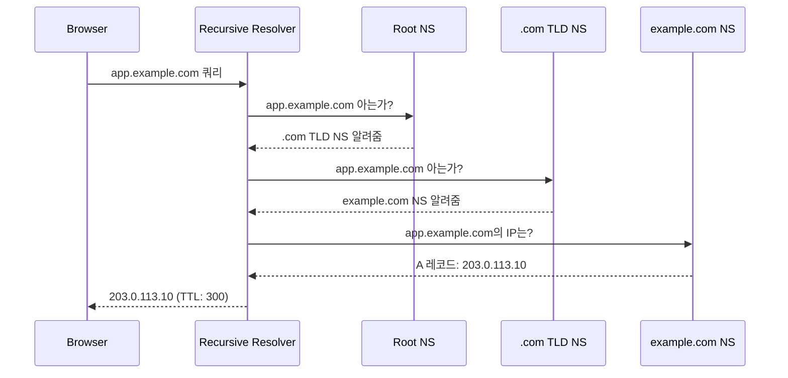
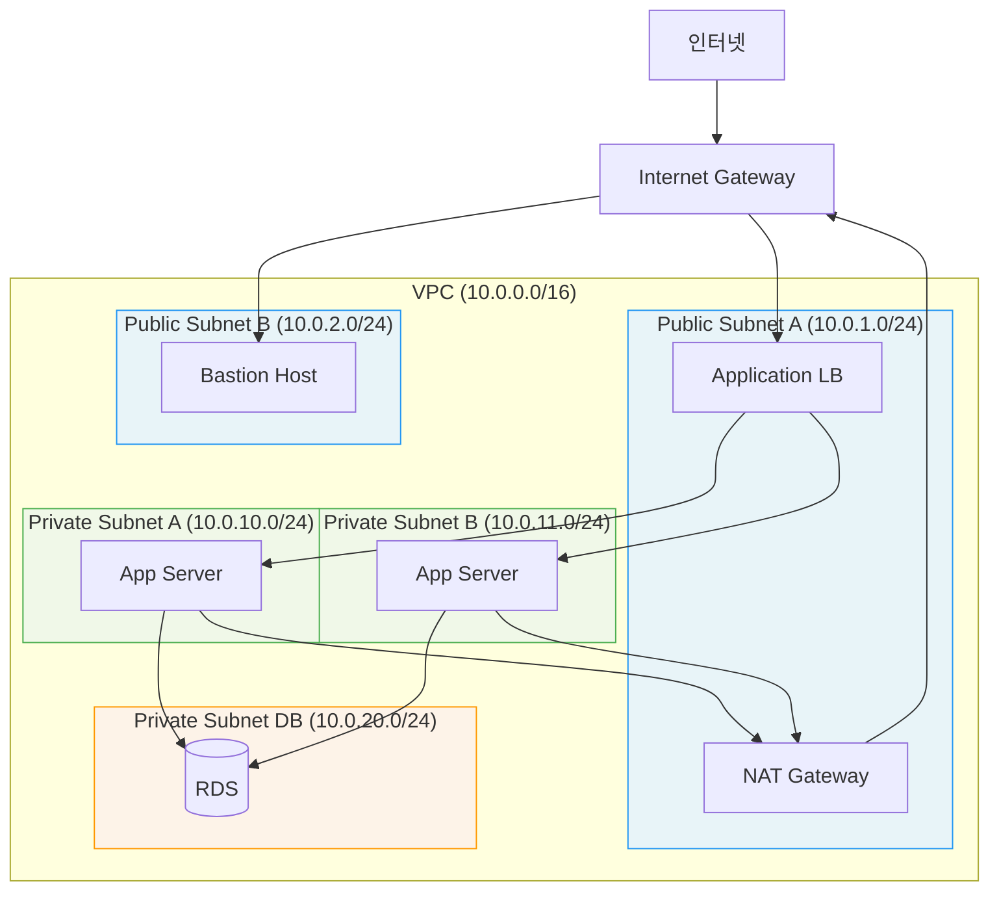

# Ch07. 네트워킹 기초

**핵심 질문**: "서버 간 통신을 안전하고 신뢰성 있게 구성하려면?"

---

## 🎯 학습 목표

- OSI 모델의 핵심 레이어(L3/L4/L7)를 DevOps 관점에서 구분하고 각 레이어에서 트러블슈팅 방법을 설명할 수 있다
- DNS 재귀 질의 흐름을 단계별로 추적하고, A/CNAME/MX 레코드와 TTL의 역할을 구분할 수 있다
- VPC를 Public/Private 서브넷으로 나누고 NAT Gateway, IGW, Route Table을 OpenTofu로 구성할 수 있다
- nginx를 Reverse Proxy로 구성하여 SSL 터미네이션, 업스트림 로드밸런싱, 요청 헤더 전달을 적용할 수 있다
- Security Group 규칙을 최소 권한 원칙에 따라 설계하고, 불필요한 포트 노출을 방지할 수 있다
- `dig`, `curl`, `tcpdump`, `ss` 등 CLI 도구로 네트워크 문제를 진단하는 흐름을 설명할 수 있다

---

## 1. OSI 모델과 TCP/IP — DevOps 엔지니어의 관점

OSI 7계층을 모두 외우는 것은 시험에나 필요하다. 실제 운영 환경에서 DevOps 엔지니어가 마주하는 문제는 대부분 세 레이어에 집중된다.

**L3 (Network): IP 라우팅**
패킷이 어떤 경로로 목적지에 도달할지 결정하는 레이어다. "이 서버에서 저 서버로 패킷이 가는가?" 라는 질문이 L3의 영역이다. VPC Route Table, Security Group의 CIDR 규칙, 서브넷 간 통신 허용 여부가 모두 여기서 결정된다.

**L4 (Transport): TCP/UDP 연결**
포트 번호와 연결 상태를 다루는 레이어다. "80번 포트가 열려 있는가?", "TCP 3-way handshake가 완료됐는가?" 가 L4의 질문이다. 로드밸런서 헬스체크가 TCP 연결 성공 여부만 확인할 때가 L4 로드밸런싱이다.

**L7 (Application): HTTP/HTTPS**
요청의 내용을 이해하는 레이어다. URL 경로, HTTP 헤더, 쿠키 기반 라우팅이 모두 L7에서 이루어진다. nginx의 `location` 블록, ALB의 경로 기반 라우팅 규칙이 L7 동작의 예다.

실제 장애 진단은 L3부터 위로 올라가는 것이 원칙이다. 먼저 `ping`으로 L3 연결을 확인하고, `telnet host port`로 L4 포트 개방을 확인하고, `curl`로 L7 응답을 확인한다.

```bash
# L3 확인: IP 연결 가능 여부
ping 10.0.1.5

# L4 확인: TCP 포트 개방 여부
telnet 10.0.1.5 8080
# 또는
nc -zv 10.0.1.5 8080

# L7 확인: HTTP 응답 상세 출력
curl -v http://10.0.1.5:8080/health

# 연결 상태 확인 (ESTABLISHED, TIME_WAIT 등)
ss -tnp | grep 8080

# 패킷 레벨 캡처 (루트 권한 필요)
tcpdump -i eth0 'port 8080' -n
```

---

## 2. DNS의 동작 원리

`app.example.com` 을 브라우저 주소창에 입력하면 어떤 일이 일어날까? 단순히 "도메인을 IP로 바꾼다"고 알고 있으면 장애 대응 시 막힌다.

**재귀 질의 흐름**

브라우저가 도메인을 요청하면, OS는 `/etc/hosts` 파일을 먼저 확인한다. 없으면 로컬 DNS 캐시를 확인하고, 그것도 없으면 `/etc/resolv.conf`에 설정된 Recursive Resolver(보통 ISP 또는 `8.8.8.8`)에게 질의한다. Recursive Resolver는 Root NS → TLD NS(`.com`) → Authoritative NS(`example.com`) 순으로 위임을 따라가며 최종 IP를 가져온다.



**레코드 타입과 용도**

- `A`: 도메인 → IPv4 주소. 가장 기본적인 레코드다.
- `CNAME`: 도메인 → 다른 도메인. CDN 연동이나 `www` 리다이렉트에 주로 사용된다. 루트 도메인(`example.com`)에는 사용할 수 없다는 제약이 있다.
- `MX`: 이메일 수신 서버 지정. 우선순위(낮을수록 높음) 값과 함께 설정한다.
- `TXT`: 임의 텍스트. SPF/DKIM 이메일 인증, 도메인 소유권 확인에 사용된다.

**TTL이 장애에 미치는 영향**

TTL(Time To Live)은 캐시 유효 시간(초 단위)이다. TTL을 300초로 설정했다면, 서버 IP를 변경해도 최대 5분 동안 구 IP로 트래픽이 가는 상황을 감수해야 한다. 블루-그린 배포나 DR 전환처럼 빠른 DNS 전환이 필요한 경우, 전환 24-48시간 전에 TTL을 60초로 낮춰두는 것이 표준 절차다.

```bash
# DNS 질의 상세 추적 (재귀 경로 확인)
dig +trace app.example.com

# 특정 DNS 서버에 직접 질의
dig @8.8.8.8 app.example.com A

# CNAME 체인 확인
dig app.example.com CNAME

# TTL 확인 (두 번째 컬럼이 남은 TTL)
dig app.example.com +noall +answer
```

---

## 3. VPC 설계 — 네트워크 격리의 기본

VPC(Virtual Private Cloud)는 클라우드에서 논리적으로 격리된 네트워크 공간이다. 왜 격리가 필요한가? 인터넷에서 직접 접근해서는 안 되는 데이터베이스, 캐시 서버, 내부 API를 Public 인터넷으로부터 분리하기 위해서다.

핵심 설계 원칙은 하나다: 인터넷에서 직접 접근이 필요한 리소스만 Public Subnet에 두고, 나머지는 Private Subnet에 둔다. 일반적으로 로드밸런서, Bastion Host만 Public에 위치하고, 애플리케이션 서버와 데이터베이스는 Private에 위치한다.



다음은 위 토폴로지를 OpenTofu로 구현한 완전한 예시다.

```hcl
# vpc.tf — 완전한 VPC 네트워크 구성
# 이 설정으로 2-AZ HA 구조의 격리된 네트워크가 완성된다

terraform {
  required_providers {
    aws = {
      source  = "registry.opentofu.org/hashicorp/aws"
      version = "~> 5.0"
    }
  }
}

# VPC: 전체 네트워크의 루트 컨테이너
# /16 CIDR은 65,534개 IP를 제공한다 — 서브넷 분할 여유를 충분히 확보한다
resource "aws_vpc" "main" {
  cidr_block           = "10.0.0.0/16"
  enable_dns_hostnames = true  # EC2에 DNS 이름 자동 할당 (RDS 엔드포인트 등에 필요)
  enable_dns_support   = true

  tags = { Name = "main-vpc" }
}

# Internet Gateway: VPC와 인터넷 사이의 관문
# IGW 자체는 HA다 — AWS가 내부적으로 이중화한다
resource "aws_internet_gateway" "main" {
  vpc_id = aws_vpc.main.id
  tags   = { Name = "main-igw" }
}

# ─── Public Subnets ────────────────────────────────────────────────────────────
# Public Subnet: IGW로 라우팅되어 인터넷에서 직접 접근 가능한 영역
# 2개의 AZ에 분산하여 단일 AZ 장애에 대비한다

resource "aws_subnet" "public_a" {
  vpc_id                  = aws_vpc.main.id
  cidr_block              = "10.0.1.0/24"   # 254개 IP
  availability_zone       = "ap-northeast-2a"
  map_public_ip_on_launch = true  # 이 서브넷에 생성된 EC2는 자동으로 Public IP를 갖는다

  tags = { Name = "public-subnet-a" }
}

resource "aws_subnet" "public_b" {
  vpc_id                  = aws_vpc.main.id
  cidr_block              = "10.0.2.0/24"
  availability_zone       = "ap-northeast-2b"
  map_public_ip_on_launch = true

  tags = { Name = "public-subnet-b" }
}

# ─── Private Subnets ───────────────────────────────────────────────────────────
# Private Subnet: 인터넷에서 직접 접근 불가 — 애플리케이션 서버가 위치한다

resource "aws_subnet" "private_a" {
  vpc_id            = aws_vpc.main.id
  cidr_block        = "10.0.10.0/24"
  availability_zone = "ap-northeast-2a"
  # map_public_ip_on_launch = false (기본값) — Public IP 할당 안 함

  tags = { Name = "private-subnet-a" }
}

resource "aws_subnet" "private_b" {
  vpc_id            = aws_vpc.main.id
  cidr_block        = "10.0.11.0/24"
  availability_zone = "ap-northeast-2b"

  tags = { Name = "private-subnet-b" }
}

# DB 전용 서브넷: 앱 서브넷과 CIDR을 분리하면 Security Group 규칙이 명확해진다
resource "aws_subnet" "private_db_a" {
  vpc_id            = aws_vpc.main.id
  cidr_block        = "10.0.20.0/24"
  availability_zone = "ap-northeast-2a"

  tags = { Name = "private-db-subnet-a" }
}

resource "aws_subnet" "private_db_b" {
  vpc_id            = aws_vpc.main.id
  cidr_block        = "10.0.21.0/24"
  availability_zone = "ap-northeast-2b"

  tags = { Name = "private-db-subnet-b" }
}

# ─── NAT Gateway ───────────────────────────────────────────────────────────────
# NAT Gateway: Private Subnet의 서버가 인터넷으로 아웃바운드 통신할 수 있게 한다
# (예: apt 업데이트, 외부 API 호출) 인바운드는 여전히 차단된다
# EIP: NAT Gateway에 고정 Public IP를 부여한다 — 외부 서비스의 IP 화이트리스트에 등록할 때 필요하다
resource "aws_eip" "nat_a" {
  domain = "vpc"
  tags   = { Name = "nat-eip-a" }
}

resource "aws_nat_gateway" "main_a" {
  allocation_id = aws_eip.nat_a.id
  subnet_id     = aws_subnet.public_a.id  # NAT GW 자체는 Public Subnet에 있어야 한다

  tags       = { Name = "nat-gw-a" }
  depends_on = [aws_internet_gateway.main]  # IGW가 먼저 생성되어야 NAT GW가 인터넷에 연결된다
}

# ─── Route Tables ──────────────────────────────────────────────────────────────
# Public Route Table: 모든 인터넷 트래픽(0.0.0.0/0)을 IGW로 보낸다
resource "aws_route_table" "public" {
  vpc_id = aws_vpc.main.id

  route {
    cidr_block = "0.0.0.0/0"
    gateway_id = aws_internet_gateway.main.id
  }

  tags = { Name = "public-rt" }
}

# Public Subnet들을 Public Route Table에 연결
resource "aws_route_table_association" "public_a" {
  subnet_id      = aws_subnet.public_a.id
  route_table_id = aws_route_table.public.id
}

resource "aws_route_table_association" "public_b" {
  subnet_id      = aws_subnet.public_b.id
  route_table_id = aws_route_table.public.id
}

# Private Route Table: 인터넷 트래픽을 NAT Gateway로 보낸다
# (IGW로 보내지 않으므로 인바운드 인터넷 접근은 불가하다)
resource "aws_route_table" "private_a" {
  vpc_id = aws_vpc.main.id

  route {
    cidr_block     = "0.0.0.0/0"
    nat_gateway_id = aws_nat_gateway.main_a.id
  }

  tags = { Name = "private-rt-a" }
}

resource "aws_route_table_association" "private_a" {
  subnet_id      = aws_subnet.private_a.id
  route_table_id = aws_route_table.private_a.id
}

resource "aws_route_table_association" "private_b" {
  subnet_id      = aws_subnet.private_b.id
  route_table_id = aws_route_table.private_a.id
}

# DB 서브넷은 별도 Route Table로 분리할 수도 있다 (여기서는 Private과 공유)
resource "aws_route_table_association" "private_db_a" {
  subnet_id      = aws_subnet.private_db_a.id
  route_table_id = aws_route_table.private_a.id
}
```

---

## 4. Reverse Proxy와 Load Balancer

Reverse Proxy는 클라이언트와 백엔드 서버 사이에서 요청을 중계하는 서버다. 왜 직접 연결하지 않고 중간에 두는가? SSL 터미네이션, 로드밸런싱, 요청 필터링, 캐싱을 한 지점에서 처리할 수 있기 때문이다. 백엔드 서버는 HTTP만 처리하면 되고, TLS 인증서 관리는 nginx 한 곳에서만 신경 쓰면 된다.

```nginx
# /etc/nginx/nginx.conf — 완전한 Reverse Proxy + Load Balancer 구성

events {
    worker_connections 1024;
}

http {
    # ── Upstream 그룹 정의 ────────────────────────────────────────────────────
    # upstream 블록은 백엔드 서버 풀을 정의한다
    # least_conn: 현재 연결 수가 가장 적은 서버에 요청을 보낸다 (기본은 round-robin)
    upstream app_backend {
        least_conn;

        server 10.0.10.10:8080 weight=2;  # weight: 상대적 트래픽 비율 (고사양 서버에 더 많이)
        server 10.0.10.11:8080 weight=1;
        server 10.0.10.12:8080 weight=1 backup;  # backup: 나머지 서버 다운 시에만 사용

        # 헬스체크: 2회 실패 시 풀에서 제거, 1회 성공 시 복귀
        # (nginx plus 기능; OSS는 passive check만 가능)
        keepalive 32;  # 업스트림과 keepalive 커넥션 유지 — 연결 오버헤드 절감
    }

    # ── HTTP → HTTPS 리다이렉트 ───────────────────────────────────────────────
    server {
        listen 80;
        server_name app.example.com;

        # ACME challenge는 리다이렉트에서 제외한다 (Let's Encrypt 갱신에 필요)
        location /.well-known/acme-challenge/ {
            root /var/www/certbot;
        }

        location / {
            return 301 https://$host$request_uri;
        }
    }

    # ── HTTPS Reverse Proxy ───────────────────────────────────────────────────
    server {
        listen 443 ssl;
        server_name app.example.com;

        # SSL 터미네이션: 클라이언트와의 TLS는 nginx가 처리한다
        # 백엔드 서버는 HTTP로 통신하므로 TLS 처리 부하가 없다
        ssl_certificate     /etc/nginx/ssl/fullchain.pem;
        ssl_certificate_key /etc/nginx/ssl/privkey.pem;

        # 취약한 프로토콜(TLS 1.0, 1.1)을 비활성화한다
        ssl_protocols TLSv1.2 TLSv1.3;
        ssl_ciphers   HIGH:!aNULL:!MD5;
        ssl_prefer_server_ciphers on;

        # HSTS: 브라우저에게 "앞으로 1년간 HTTPS만 사용하라"고 지시한다
        add_header Strict-Transport-Security "max-age=31536000; includeSubDomains" always;

        # 요청 크기 제한 (파일 업로드 등에서 조정 필요)
        client_max_body_size 10M;

        location / {
            proxy_pass http://app_backend;

            # 프록시 헤더: 백엔드가 실제 클라이언트 정보를 알 수 있게 한다
            # nginx가 중간에 있으면 백엔드는 클라이언트 IP를 모른다 — 이 헤더로 전달한다
            proxy_set_header Host              $host;
            proxy_set_header X-Real-IP         $remote_addr;
            proxy_set_header X-Forwarded-For   $proxy_add_x_forwarded_for;
            proxy_set_header X-Forwarded-Proto $scheme;  # http/https 여부 전달

            # 타임아웃 설정: 백엔드 응답이 늦으면 클라이언트에게 504를 반환한다
            proxy_connect_timeout 5s;
            proxy_send_timeout    60s;
            proxy_read_timeout    60s;

            # 버퍼링: 응답을 nginx가 버퍼에 모아 백엔드 커넥션을 빠르게 해제한다
            proxy_buffering on;
            proxy_buffer_size 4k;
        }

        # 헬스체크 엔드포인트는 로그에서 제외한다 (노이즈 방지)
        location /health {
            proxy_pass http://app_backend;
            access_log off;
        }

        # 정적 파일은 nginx가 직접 서빙한다 (백엔드 부하 절감)
        location /static/ {
            root /var/www;
            expires 30d;
            add_header Cache-Control "public, immutable";
        }
    }
}
```

---

## 5. Security Group — 최소 권한 원칙

Security Group은 상태 기반(stateful) 방화벽이다. 상태 기반이라는 뜻은 인바운드 허용을 설정하면 해당 연결의 아웃바운드 응답은 자동으로 허용된다는 것이다. 반대로 NACL(Network ACL)은 무상태(stateless)로 인바운드와 아웃바운드를 각각 설정해야 한다.

설계 원칙은 "필요한 것만 열고, 나머지는 닫는다"이다. `0.0.0.0/0`으로 모든 포트를 여는 것은 보안 사고의 출발점이다.

```hcl
# security_groups.tf — 계층별 Security Group 설계

# ── ALB Security Group ────────────────────────────────────────────────────────
# ALB는 인터넷에서 80/443만 받는다
resource "aws_security_group" "alb" {
  name   = "alb-sg"
  vpc_id = aws_vpc.main.id

  ingress {
    from_port   = 80
    to_port     = 80
    protocol    = "tcp"
    cidr_blocks = ["0.0.0.0/0"]
  }

  ingress {
    from_port   = 443
    to_port     = 443
    protocol    = "tcp"
    cidr_blocks = ["0.0.0.0/0"]
  }

  # 아웃바운드: 백엔드 서버의 8080 포트로만 나간다
  egress {
    from_port       = 8080
    to_port         = 8080
    protocol        = "tcp"
    security_groups = [aws_security_group.app.id]
  }

  tags = { Name = "alb-sg" }
}

# ── App Server Security Group ─────────────────────────────────────────────────
# 앱 서버는 ALB로부터만 트래픽을 받는다 — CIDR 대신 Security Group ID 참조가 더 정확하다
resource "aws_security_group" "app" {
  name   = "app-sg"
  vpc_id = aws_vpc.main.id

  ingress {
    from_port       = 8080
    to_port         = 8080
    protocol        = "tcp"
    security_groups = [aws_security_group.alb.id]  # ALB SG에서만 허용
  }

  # SSH는 Bastion Host에서만 허용한다 (직접 Public 접근 금지)
  ingress {
    from_port       = 22
    to_port         = 22
    protocol        = "tcp"
    security_groups = [aws_security_group.bastion.id]
  }

  egress {
    from_port   = 0
    to_port     = 0
    protocol    = "-1"
    cidr_blocks = ["0.0.0.0/0"]  # 아웃바운드는 허용 (NAT를 통해 인터넷 가능)
  }

  tags = { Name = "app-sg" }
}

# ── RDS Security Group ────────────────────────────────────────────────────────
resource "aws_security_group" "rds" {
  name   = "rds-sg"
  vpc_id = aws_vpc.main.id

  ingress {
    from_port       = 5432  # PostgreSQL
    to_port         = 5432
    protocol        = "tcp"
    security_groups = [aws_security_group.app.id]  # 앱 서버에서만 접근 가능
  }

  tags = { Name = "rds-sg" }
}

# ── Bastion Host Security Group ───────────────────────────────────────────────
resource "aws_security_group" "bastion" {
  name   = "bastion-sg"
  vpc_id = aws_vpc.main.id

  ingress {
    from_port   = 22
    to_port     = 22
    protocol    = "tcp"
    cidr_blocks = ["203.0.113.0/32"]  # 운영팀 고정 IP만 허용 (실제 환경에서는 VPN 고려)
  }

  egress {
    from_port   = 0
    to_port     = 0
    protocol    = "-1"
    cidr_blocks = ["0.0.0.0/0"]
  }

  tags = { Name = "bastion-sg" }
}
```

---

## 6. DNS 레코드 설정

Route53 또는 Cloudflare에서 레코드를 설정하는 방법이다. Terraform으로 관리하면 레코드 변경 이력이 Git에 남아 감사(audit)가 가능하다.

```hcl
# dns.tf — Route53 레코드 설정

resource "aws_route53_zone" "main" {
  name = "example.com"
}

# A 레코드: 도메인을 ALB의 IP로 직접 연결
# ALB는 IP가 변동되므로, AWS에서는 ALIAS 레코드를 사용한다
resource "aws_route53_record" "app" {
  zone_id = aws_route53_zone.main.zone_id
  name    = "app.example.com"
  type    = "A"

  alias {
    name                   = aws_lb.main.dns_name
    zone_id                = aws_lb.main.zone_id
    evaluate_target_health = true  # ALB 헬스체크 상태를 DNS 응답에 반영한다
  }
}

# CNAME: www를 루트 도메인으로 리다이렉트
resource "aws_route53_record" "www" {
  zone_id = aws_route53_zone.main.zone_id
  name    = "www.example.com"
  type    = "CNAME"
  ttl     = 300
  records = ["app.example.com"]
}
```

```bash
# Cloudflare CLI로 레코드 추가 (flarectl)
flarectl dns create --zone example.com \
  --type A \
  --name app \
  --content 203.0.113.10 \
  --ttl 300 \
  --proxy  # Cloudflare 프록시 활성화 (CDN + DDoS 보호)
```

---

## 7. 네트워크 트러블슈팅 실전 명령어

장애 발생 시 당황하지 않으려면 진단 흐름을 몸에 익혀야 한다. L3 → L4 → L7 순서로 내려가며 문제를 좁혀가는 것이 효율적이다.

```bash
# ── DNS 진단 ──────────────────────────────────────────────────────────────────
# 전체 재귀 질의 경로 추적
dig +trace app.example.com

# 응답 시간 측정 (QueryTime 확인)
dig app.example.com +stats

# DNS 캐시 우회 후 직접 질의
dig @1.1.1.1 app.example.com +short

# ── 연결 진단 ─────────────────────────────────────────────────────────────────
# HTTP 요청 전 단계별 소요 시간 측정
curl -w "\n
DNS: %{time_namelookup}s
TCP: %{time_connect}s
TLS: %{time_appconnect}s
TTFB: %{time_starttransfer}s
Total: %{time_total}s\n" \
  -o /dev/null -s https://app.example.com

# SSL 인증서 정보 확인
openssl s_client -connect app.example.com:443 -showcerts < /dev/null 2>/dev/null \
  | openssl x509 -noout -text | grep -E "Subject:|Not After"

# 포트 스캔 (네트워크 정책 확인 용도)
nmap -p 80,443,8080 10.0.10.10

# ── 라우팅 경로 확인 ──────────────────────────────────────────────────────────
# 패킷이 어떤 경로로 목적지에 도달하는지
traceroute 10.0.10.10

# ── 로드밸런서 로그 확인 ─────────────────────────────────────────────────────
# nginx 에러 로그 실시간 모니터링
tail -f /var/log/nginx/error.log | grep -v "health"

# 응답 코드별 집계 (5xx 비율 확인)
awk '{print $9}' /var/log/nginx/access.log | sort | uniq -c | sort -rn
```

---

## 교차참조

서비스 간 통신 보안을 mTLS로 강화하는 방법은 Service Mesh PoC에서 다룬다.

- **서비스 메시 기초**: `runners-high/poc/03_CloudNative/03-service-mesh/learning/` Ch03 (Gateway API), Ch04 (mTLS/제로트러스트)
- **Linkerd mTLS 자동화**: Ch07 (Linkerd 보안)
- **Kubernetes 네트워크 정책**: `runners-high/poc/03_CloudNative/02-kubernetes/` 네트워크 정책 챕터

VPC 설계와 Kubernetes 클러스터 네트워킹이 맞닿는 부분은 EKS 또는 K3s 구성 시 VPC CNI 플러그인 선택에서 등장한다.

---

## ✅ 체크포인트

- [ ] `dig +trace` 명령으로 재귀 질의 경로를 직접 확인했다
- [ ] OpenTofu로 VPC + Public/Private Subnet + NAT GW를 직접 생성했다
- [ ] nginx를 Reverse Proxy로 구성하고 `X-Forwarded-For` 헤더가 백엔드에 전달됨을 확인했다
- [ ] Security Group을 CIDR 대신 Security Group ID 참조 방식으로 설정했다
- [ ] `curl -w` 명령으로 DNS → TCP → TLS → TTFB 각 단계 소요 시간을 측정했다
