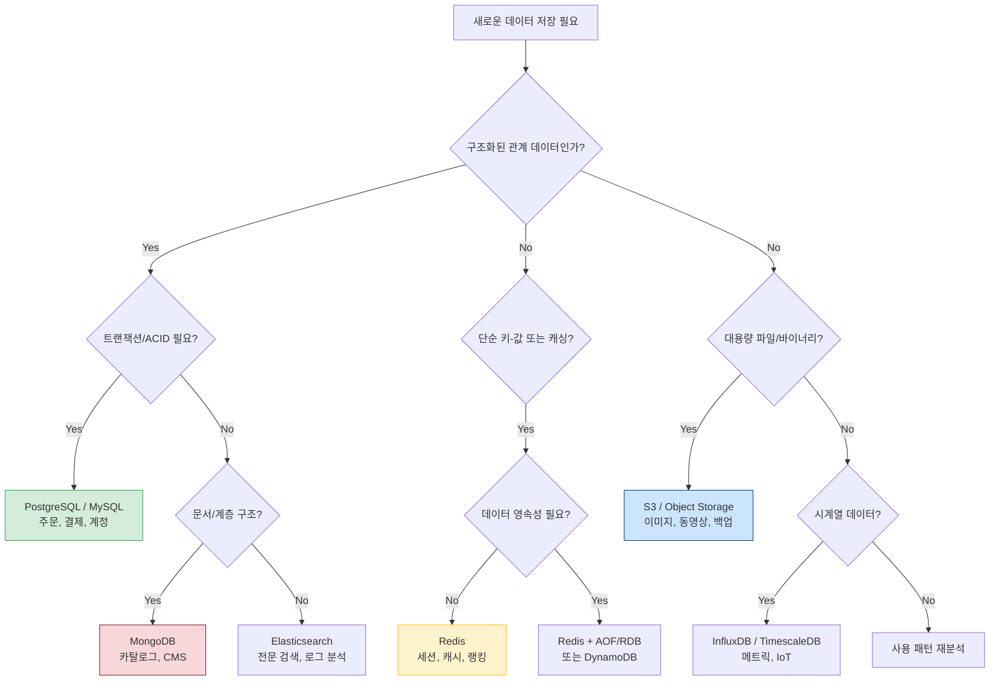

# Ch09. 데이터 저장소 선택과 관리

**핵심 질문**: "어떤 데이터에 어떤 저장소를 선택하는가?"

---

## 🎯 학습 목표

1. RDBMS, NoSQL, Object Storage, In-Memory Cache의 본질적 차이를 설명할 수 있다
2. CAP 정리를 이해하고 저장소 선택 기준에 적용할 수 있다
3. Knex.js를 사용해 PostgreSQL 스키마 마이그레이션을 무중단으로 수행할 수 있다
4. Redis 캐싱 패턴(Cache-Aside, Write-Through)을 코드로 구현할 수 있다
5. S3 라이프사이클 정책과 백업 자동화 스크립트를 작성할 수 있다
6. Polyglot Persistence 전략으로 서비스별 최적 저장소를 설계할 수 있다

---

## 1. 데이터 저장소 유형 — 왜 하나로 통일하지 않는가

많은 팀이 처음에는 모든 데이터를 PostgreSQL 하나에 넣으려 한다. 사용자 정보, 세션 토큰, 이미지 파일, 실시간 랭킹까지 전부 같은 DB에. 이 접근은 단기적으로는 편하지만, 서비스가 커질수록 각 데이터 특성을 무시한 대가를 치른다. RDBMS는 관계와 트랜잭션에 강하지만, 세션 데이터처럼 수백만 번 읽고 쓰는 단순한 키-값에는 과도한 선택이다. 반대로 Redis는 초고속 캐시에 적합하지만 복잡한 조인 쿼리를 지원하지 않는다.

데이터 저장소를 이해하는 핵심은 "어떤 질문을 자주 던지는가?"다. 구조화된 관계를 자주 조인하면 RDBMS, 패턴이 없는 문서를 유연하게 저장하면 NoSQL, 수 기가바이트의 파일을 저렴하게 보관하면 Object Storage, 수십 밀리초 이내 응답이 필요하면 In-Memory Cache를 선택한다.

| 저장소 | 대표 구현 | 강점 | 약점 | 주요 사용 사례 |
|--------|-----------|------|------|--------------|
| RDBMS | PostgreSQL, MySQL | 트랜잭션, 복잡한 조인, 스키마 강제 | 수평 확장 어려움, 스키마 변경 비용 | 주문, 결제, 사용자 계정 |
| Document NoSQL | MongoDB | 스키마 유연성, 계층 구조 저장 | 강한 일관성 보장 어려움 | 상품 카탈로그, 콘텐츠 관리 |
| In-Memory Cache | Redis | 마이크로초 응답, TTL 지원 | 데이터 영속성 제한, 메모리 비용 | 세션, 랭킹, 캐싱 레이어 |
| Object Storage | AWS S3 | 무제한 확장, 저렴한 비용, 내구성 | 랜덤 접근 불가, 레이턴시 높음 | 이미지, 로그, 백업, 정적 파일 |

---

## 2. RDBMS: PostgreSQL과 스키마 마이그레이션

PostgreSQL은 ACID 트랜잭션을 보장하기 때문에 돈과 관련된 데이터에 가장 많이 선택된다. 주문 테이블과 결제 테이블이 동시에 업데이트되어야 할 때, 하나라도 실패하면 전체를 롤백하는 원자성(Atomicity)이 금전 거래의 정합성을 지킨다.

스키마 마이그레이션은 "코드처럼 DB 구조를 버전 관리하는 행위"다. `ALTER TABLE`을 직접 실행하면 어느 환경에 어떤 변경이 적용됐는지 추적할 수 없다. Knex.js 같은 마이그레이션 도구는 각 변경을 타임스탬프 파일로 기록하고, 어디까지 적용됐는지 `knex_migrations` 테이블에 남긴다.

```javascript
// migrations/20240301_create_orders.js
// WHY: up/down을 함께 정의해야 롤백이 가능하다. down 없이는 마이그레이션이 아닌 일방통행이다.
exports.up = async (knex) => {
  await knex.schema.createTable('orders', (table) => {
    table.increments('id').primary();
    table.integer('user_id').notNullable().references('id').inTable('users').onDelete('RESTRICT');
    table.string('status', 20).notNullable().defaultTo('pending');
    // WHY: NUMERIC(12,2)는 부동소수점 오차가 없어 금액 저장에 적합하다.
    table.decimal('total_amount', 12, 2).notNullable();
    table.timestamps(true, true); // created_at, updated_at 자동 관리
  });
};

exports.down = async (knex) => {
  await knex.schema.dropTableIfExists('orders');
};
```

```javascript
// migrations/20240302_add_payment_method.js
// WHY: 컬럼 추가는 기존 행에 NULL을 채우므로 무중단이 가능하다.
// 단, NOT NULL + DEFAULT 없이 추가하면 기존 데이터가 있는 테이블에서 실패한다.
exports.up = async (knex) => {
  await knex.schema.alterTable('orders', (table) => {
    table.string('payment_method', 50).nullable();
    table.string('payment_ref').nullable();
  });
};

exports.down = async (knex) => {
  await knex.schema.alterTable('orders', (table) => {
    table.dropColumn('payment_method');
    table.dropColumn('payment_ref');
  });
};
```

```javascript
// seeds/01_seed_orders.js
// WHY: 시드 데이터는 개발/테스트 환경에서 동일한 초기 상태를 보장한다.
exports.seed = async (knex) => {
  // 기존 데이터 제거 (외래키 순서 고려)
  await knex('orders').del();

  await knex('orders').insert([
    { user_id: 1, status: 'completed', total_amount: 29900.00, payment_method: 'card' },
    { user_id: 2, status: 'pending',   total_amount: 15000.00, payment_method: null },
  ]);
};
```

```bash
# 마이그레이션 실행 (최신까지 적용)
npx knex migrate:latest

# 한 단계 롤백
npx knex migrate:rollback

# 시드 실행
npx knex seed:run

# 현재 마이그레이션 상태 확인
npx knex migrate:currentVersion
```

Knex.js를 프로젝트에서 사용하려면 `knexfile.js`에 환경별 연결 설정을 분리해 두는 것이 표준이다. 개발, 테스트, 운영 DB가 각각 다른 자격증명을 사용하기 때문이다.

```javascript
// knexfile.js
// WHY: 환경별 설정을 한 파일에 두면 migrate:latest가 NODE_ENV를 읽어 올바른 DB에 연결한다.
module.exports = {
  development: {
    client: 'postgresql',
    connection: {
      host: process.env.DB_HOST || 'localhost',
      port: 5432,
      database: 'myapp_dev',
      user: process.env.DB_USER || 'postgres',
      password: process.env.DB_PASSWORD,
    },
    migrations: { directory: './migrations' },
    seeds:      { directory: './seeds' },
  },
  production: {
    client: 'postgresql',
    connection: process.env.DATABASE_URL,  // Cloud DB는 단일 URL로 전달
    pool: { min: 2, max: 10 },             // WHY: 풀 크기는 DB 서버 max_connections의 10% 이하 권장
    migrations: { directory: './migrations' },
  },
};
```

PostgreSQL의 또 다른 강점은 트랜잭션 내에서 여러 쿼리를 원자적으로 묶을 수 있다는 점이다. 주문을 생성하면서 재고를 차감하는 두 작업이 반드시 함께 성공하거나 함께 실패해야 하는 상황이 전형적인 예다.

```javascript
// transaction.js
// WHY: trx 객체를 사용하면 두 쿼리가 같은 트랜잭션 컨텍스트에서 실행된다.
async function placeOrder(userId, productId, qty) {
  return knex.transaction(async (trx) => {
    // 재고 차감 — 0 미만이 되면 UPDATE가 0행을 변경하므로 실패를 감지할 수 있다.
    const updated = await trx('inventory')
      .where({ product_id: productId })
      .where('stock', '>=', qty)
      .decrement('stock', qty);

    if (updated === 0) {
      throw new Error('재고 부족');  // throw 시 트랜잭션 자동 롤백
    }

    const [order] = await trx('orders')
      .insert({ user_id: userId, product_id: productId, quantity: qty, status: 'confirmed' })
      .returning('*');

    return order;
  });
}
```

---

## 3. In-Memory Cache: Redis와 캐싱 패턴

Redis가 왜 빠른지 이해하려면 하드웨어 레이어를 생각해야 한다. 디스크 I/O는 수 밀리초가 걸리지만 메모리 접근은 수백 나노초다. PostgreSQL이 인덱스를 타도 1ms 안팎인 쿼리를, Redis는 0.1ms 이내에 응답한다. 초당 수만 요청이 들어오는 서비스에서 이 차이는 서버 비용과 직결된다.

**Cache-Aside 패턴**은 "캐시 미스 시 애플리케이션이 직접 DB에서 데이터를 가져와 캐시에 채운다"는 방식이다. 가장 범용적인 패턴이다. 애플리케이션이 캐시와 DB 사이를 직접 제어하기 때문에, 캐시가 다운돼도 DB로 폴백하는 회복탄력성이 생긴다.

```javascript
// cache-aside.js
// WHY: redis client v4는 promise 기반이라 async/await과 자연스럽게 조합된다.
import { createClient } from 'redis';
import { pool } from './db.js';

const redis = createClient({ url: process.env.REDIS_URL });
await redis.connect();

const CACHE_TTL_SECONDS = 300; // WHY: 5분이면 사용자 프로필처럼 자주 변하지 않는 데이터에 적합하다.

async function getUserById(userId) {
  const cacheKey = `user:${userId}`;

  // 1. 캐시 조회
  const cached = await redis.get(cacheKey);
  if (cached) {
    return JSON.parse(cached); // 캐시 히트: DB 호출 없음
  }

  // 2. 캐시 미스 → DB 조회
  const result = await pool.query('SELECT * FROM users WHERE id = $1', [userId]);
  const user = result.rows[0];

  if (!user) return null;

  // 3. 캐시에 저장 (TTL 설정)
  // WHY: EX 옵션으로 TTL을 지정하지 않으면 캐시가 영구히 남아 메모리를 점유한다.
  await redis.set(cacheKey, JSON.stringify(user), { EX: CACHE_TTL_SECONDS });

  return user;
}

// Write-Through 패턴: 쓰기 시 캐시와 DB를 동시에 업데이트
// WHY: 캐시와 DB 불일치를 원천 차단한다. 단, 쓰기 레이턴시가 소폭 증가한다.
async function updateUser(userId, data) {
  await pool.query(
    'UPDATE users SET name = $1, email = $2 WHERE id = $3',
    [data.name, data.email, userId]
  );

  const cacheKey = `user:${userId}`;
  await redis.set(cacheKey, JSON.stringify({ id: userId, ...data }), { EX: CACHE_TTL_SECONDS });
}

// 캐시 무효화: 관련 캐시 키 삭제
async function deleteUser(userId) {
  await pool.query('DELETE FROM users WHERE id = $1', [userId]);
  await redis.del(`user:${userId}`);
}
```

```javascript
// 세션 관리 — Redis가 세션에 적합한 이유
// WHY: 세션은 로그인 상태라는 임시 정보다. DB에 저장하면 매 요청마다 쿼리가 발생한다.
async function setSession(sessionId, payload, ttlSeconds = 3600) {
  await redis.set(`session:${sessionId}`, JSON.stringify(payload), { EX: ttlSeconds });
}

async function getSession(sessionId) {
  const data = await redis.get(`session:${sessionId}`);
  return data ? JSON.parse(data) : null;
}
```

Redis는 단순한 키-값 저장소를 넘어 Sorted Set, List, HyperLogLog 같은 고급 자료구조를 제공한다. 실시간 랭킹은 Sorted Set이 가장 잘 맞는 사례다. `ZADD`로 점수를 업데이트하고 `ZREVRANK`로 순위를 O(log N)에 조회할 수 있어, 매번 `ORDER BY` 쿼리를 날리는 RDBMS보다 훨씬 효율적이다.

```javascript
// leaderboard.js — Redis Sorted Set으로 실시간 랭킹 구현
// WHY: Sorted Set은 점수 기반 자동 정렬을 내부적으로 Skip List로 관리한다.
// 삽입/삭제/조회 모두 O(log N)으로, 수백만 명의 랭킹도 밀리초 내에 처리 가능하다.
const LEADERBOARD_KEY = 'game:leaderboard';

async function updateScore(userId, score) {
  // NX 옵션: 이미 높은 점수가 있으면 덮어쓰지 않으려면 GT 옵션 사용
  await redis.zAdd(LEADERBOARD_KEY, [{ score, value: String(userId) }]);
}

async function getRank(userId) {
  // ZREVRANK: 높은 점수가 0위 (내림차순)
  const rank = await redis.zRevRank(LEADERBOARD_KEY, String(userId));
  return rank !== null ? rank + 1 : null; // 1-indexed 반환
}

async function getTopN(n = 10) {
  // ZREVRANGE WITH SCORES: 상위 N명과 점수를 함께 반환
  return redis.zRangeWithScores(LEADERBOARD_KEY, 0, n - 1, { REV: true });
}
```

여러 Redis 명령을 순차적으로 보내면 각 명령마다 네트워크 왕복이 발생한다. 파이프라인을 사용하면 여러 명령을 한 번의 네트워크 요청으로 묶어 레이턴시를 크게 줄일 수 있다.

```javascript
// pipeline.js — 배치 작업에서 네트워크 왕복 최소화
// WHY: 100개 키를 개별 SET으로 보내면 100번 왕복, 파이프라인으로 보내면 1번 왕복이다.
async function bulkCacheUsers(users) {
  const pipeline = redis.multi();

  for (const user of users) {
    pipeline.set(`user:${user.id}`, JSON.stringify(user), { EX: 300 });
  }

  await pipeline.exec(); // 모든 명령을 한 번에 전송
}
```

---

## 4. Object Storage: S3 라이프사이클 정책

S3는 "무한히 저렴하게 파일을 보관하는 서비스"로 이해하면 쉽다. 내부적으로 데이터는 여러 가용 영역에 복제되어 99.999999999%(11-nine) 내구성을 제공한다. 직접 스토리지 서버를 운영하면 하드웨어 교체, RAID 구성, 모니터링을 모두 책임져야 하지만, S3를 쓰면 버킷 정책과 라이프사이클만 관리하면 된다.

라이프사이클 정책은 "시간이 지남에 따라 데이터 가치가 떨어지는 성질"을 이용해 비용을 절감한다. 업로드 직후에는 자주 접근하는 Standard 티어에 두고, 90일 후에는 Standard-IA(Infrequent Access), 1년 후에는 Glacier로 이동하면 비용을 최대 80%까지 줄일 수 있다.

```json
// s3-lifecycle-policy.json
// WHY: 로그 파일은 최근 30일만 빠른 접근이 필요하고, 이후는 감사용으로만 보관한다.
{
  "Rules": [
    {
      "ID": "log-tiering-rule",
      "Status": "Enabled",
      "Filter": { "Prefix": "logs/" },
      "Transitions": [
        {
          "Days": 30,
          "StorageClass": "STANDARD_IA"
          // WHY: 30일 이후 로그는 접근 빈도가 낮아 IA가 비용 효율적이다.
        },
        {
          "Days": 90,
          "StorageClass": "GLACIER"
          // WHY: Glacier는 검색에 수 분이 걸리지만 비용이 IA의 1/5 수준이다.
        }
      ],
      "Expiration": {
        "Days": 365
        // WHY: 1년이 지난 로그는 규정상 불필요하면 자동 삭제해 스토리지 비용을 제거한다.
      }
    },
    {
      "ID": "backup-retention-rule",
      "Status": "Enabled",
      "Filter": { "Prefix": "backups/" },
      "Transitions": [
        { "Days": 7,  "StorageClass": "STANDARD_IA" },
        { "Days": 30, "StorageClass": "GLACIER" }
      ],
      "Expiration": { "Days": 90 }
    },
    {
      "ID": "incomplete-multipart-cleanup",
      "Status": "Enabled",
      "Filter": { "Prefix": "" },
      "AbortIncompleteMultipartUpload": { "DaysAfterInitiation": 7 }
      // WHY: 중단된 멀티파트 업로드는 완료되지 않아도 비용이 청구된다.
    }
  ]
}
```

```bash
# 라이프사이클 정책 적용
aws s3api put-bucket-lifecycle-configuration \
  --bucket my-app-bucket \
  --lifecycle-configuration file://s3-lifecycle-policy.json

# 파일 업로드
aws s3 cp ./report.pdf s3://my-app-bucket/reports/2024/report.pdf

# 디렉토리 동기화 (변경된 파일만 업로드)
aws s3 sync ./dist s3://my-app-bucket/static/ --delete

# 사전 서명 URL 생성 (1시간 유효) — 인증 없이 임시 접근 허용
# WHY: 민감한 파일을 공개하지 않고 특정 사용자에게만 임시 다운로드 링크를 제공한다.
aws s3 presign s3://my-app-bucket/reports/2024/report.pdf --expires-in 3600

# 버저닝 활성화 — 덮어쓰기/삭제 실수 복구
aws s3api put-bucket-versioning \
  --bucket my-app-bucket \
  --versioning-configuration Status=Enabled
```

---

## 5. 백업 전략 — RTO와 RPO

백업의 목적을 명확히 해야 전략이 나온다. RTO(Recovery Time Objective)는 "장애 후 몇 시간 안에 서비스를 복구해야 하는가"고, RPO(Recovery Point Objective)는 "최대 몇 분의 데이터 손실을 허용하는가"다. 이 두 수치를 먼저 비즈니스팀과 합의하지 않으면 백업 주기와 복구 전략을 결정할 수 없다.

`pg_dump`는 PostgreSQL의 논리적 백업 도구다. 실행 시점의 스냅샷을 덤프 파일로 만들기 때문에, 덤프 중에도 서비스를 중단할 필요가 없다. 덤프 파일은 S3에 올려 내구성을 확보하고, 로컬에는 최근 며칠 치만 남겨 디스크 낭비를 막는다.

```bash
#!/bin/bash
# backup-postgres.sh
# WHY: 이 스크립트는 cron으로 매일 새벽 3시에 실행된다. 사용자 트래픽이 가장 적은 시간을 선택했다.

set -euo pipefail  # WHY: 오류 발생 시 스크립트가 멈춰야 불완전한 백업이 S3에 올라가지 않는다.

DB_NAME="${DB_NAME:-myapp}"
DB_HOST="${DB_HOST:-localhost}"
DB_USER="${DB_USER:-postgres}"
S3_BUCKET="${S3_BUCKET:-my-app-backups}"
BACKUP_DIR="/tmp/pg_backups"
RETENTION_DAYS=7  # WHY: 7일치 로컬 백업을 보관한다. S3 라이프사이클이 장기 보관을 담당한다.

TIMESTAMP=$(date +%Y%m%d_%H%M%S)
BACKUP_FILE="${BACKUP_DIR}/${DB_NAME}_${TIMESTAMP}.dump"

mkdir -p "$BACKUP_DIR"

echo "[$(date)] 백업 시작: $DB_NAME"

# pg_dump: custom format (-Fc)은 병렬 복원이 가능해 대용량 DB에 유리하다.
PGPASSWORD="$DB_PASSWORD" pg_dump \
  -h "$DB_HOST" \
  -U "$DB_USER" \
  -Fc \
  --no-acl \
  --no-owner \
  "$DB_NAME" > "$BACKUP_FILE"

echo "[$(date)] 백업 완료: $(du -sh "$BACKUP_FILE" | cut -f1)"

# gzip 압축 (custom format은 이미 압축되나, 추가 압축으로 30-50% 절감 가능)
gzip "$BACKUP_FILE"
BACKUP_FILE="${BACKUP_FILE}.gz"

# S3 업로드 — 날짜 기반 프리픽스로 정렬
S3_PATH="s3://${S3_BUCKET}/postgres/${DB_NAME}/$(date +%Y/%m)/$(basename "$BACKUP_FILE")"
aws s3 cp "$BACKUP_FILE" "$S3_PATH" --storage-class STANDARD_IA

echo "[$(date)] S3 업로드 완료: $S3_PATH"

# 로컬 오래된 파일 정리 (RETENTION_DAYS일 이상)
find "$BACKUP_DIR" -name "*.dump.gz" -mtime +"$RETENTION_DAYS" -delete
echo "[$(date)] 로컬 정리 완료 (${RETENTION_DAYS}일 이상 삭제)"

# 복원 검증 — 빈 임시 DB에 덤프를 복원해 파일 무결성 확인
# WHY: 백업이 있어도 복원이 안 되면 의미 없다. 주간 검증을 권장한다.
# pg_restore -h "$DB_HOST" -U "$DB_USER" -d myapp_verify "$BACKUP_FILE"
```

```bash
# crontab 등록 (매일 03:00 실행)
# crontab -e
0 3 * * * DB_PASSWORD=secret /opt/scripts/backup-postgres.sh >> /var/log/pg_backup.log 2>&1

# 복원 명령 (장애 시)
aws s3 cp s3://my-app-backups/postgres/myapp/2024/03/myapp_20240301_030000.dump.gz /tmp/
gunzip /tmp/myapp_20240301_030000.dump.gz
pg_restore -h localhost -U postgres -d myapp_restored /tmp/myapp_20240301_030000.dump
```

---

## 6. CAP 정리와 저장소 선택 기준

CAP 정리는 "분산 시스템은 Consistency(일관성), Availability(가용성), Partition Tolerance(파티션 내성) 중 동시에 두 가지만 보장할 수 있다"는 원칙이다. 네트워크 파티션은 현실에서 반드시 발생하므로, 실질적으로는 CP(일관성 우선)와 AP(가용성 우선) 사이의 선택이다.

PostgreSQL은 CP 시스템이다. 복제 지연 중에는 쓰기를 막아서라도 모든 노드가 동일한 데이터를 보도록 한다. 결제 서비스에서 "잔액이 10만 원인지"를 두 서버가 다르게 읽으면 이중 출금이 발생하기 때문이다. 반면 Cassandra는 AP 시스템이다. 파티션이 발생해도 쓰기를 허용하고 나중에 충돌을 해소(eventual consistency)한다. 소셜 피드 "좋아요 수"가 일시적으로 다르게 보여도 비즈니스상 치명적이지 않은 경우에 적합하다.

| 저장소 | CAP 분류 | 일관성 모델 | 파티션 발생 시 동작 |
|--------|---------|------------|------------------|
| PostgreSQL | CP | 강한 일관성 | 쓰기 중단, 읽기 가능 |
| MySQL (InnoDB) | CP | 강한 일관성 | 쓰기 중단 |
| MongoDB (기본) | CP | 최종 일관성 설정 가능 | Primary 선출 대기 |
| Cassandra | AP | 최종 일관성 | 모든 노드에서 읽기/쓰기 허용 |
| DynamoDB | AP (기본) | 최종 일관성, 강한 일관성 선택 가능 | 가용성 우선 |
| Redis (단일) | CP | 강한 일관성 | 클러스터 모드에서 AP로 전환 |
| S3 | AP | 최종 일관성 (신규 오브젝트는 강한 일관성) | 항상 응답 |

CAP 분류는 절대적이지 않다. MongoDB와 DynamoDB는 설정에 따라 CP와 AP 사이를 조절할 수 있다. 중요한 것은 "이 데이터가 잠시 불일치해도 비즈니스가 괜찮은가?"를 묻는 일이다. 불일치가 돈과 연결되면 CP, 사용자 경험에 영향이 미미하면 AP를 선택한다.

```
데이터 저장소 의사결정 트리
```



---

## 7. 데이터 마이그레이션 전략

데이터 마이그레이션에서 가장 피해야 할 것은 "서비스를 내리고 마이그레이션하기"다. 이를 Big Bang 마이그레이션이라 하는데, 수십 분의 다운타임이 발생하고 실패 시 롤백도 복잡하다.

**Dual-Write 패턴**은 "일정 기간 동안 구 DB와 신 DB 모두에 쓰고, 읽기를 점진적으로 전환하는 방식"이다. 새 DB가 안정적이라는 확신이 들면 구 DB 쓰기를 중단한다.

```javascript
// dual-write.js
// WHY: 전환 중에는 두 저장소가 일시적으로 불일치할 수 있다. 이를 허용하는 서비스에만 적용한다.
async function createOrder(orderData) {
  // 구 DB (PostgreSQL) 에 항상 쓰기 (신뢰할 수 있는 소스)
  const order = await postgresDB.query(
    'INSERT INTO orders (...) VALUES (...) RETURNING *',
    [orderData]
  );

  // 신 DB (MongoDB) 에도 비동기로 쓰기 — 실패해도 구 DB는 유지
  // WHY: 신 DB 쓰기 실패가 주문 처리 실패로 이어지면 안 된다.
  mongoDB.collection('orders').insertOne({ ...order.rows[0] })
    .catch(err => logger.error('MongoDB dual-write failed', { orderId: order.rows[0].id, err }));

  return order.rows[0];
}
```

**Expand-Contract 패턴**은 단일 DB 내에서 컬럼 이름을 바꾸거나 타입을 변경할 때 다운타임 없이 진행하는 3단계 전략이다. 컬럼 이름을 `phone`에서 `phone_number`로 바꾼다고 가정하면 다음 순서로 진행한다.

1. **Expand(확장)**: 신규 컬럼 `phone_number`를 `nullable`로 추가한다. 기존 `phone`은 그대로 유지한다. 이 마이그레이션은 테이블 락 없이 즉시 적용된다.
2. **Migrate(이행)**: 애플리케이션 코드를 배포해 읽기는 `phone_number`를 우선 참조하고, 쓰기는 두 컬럼 모두에 기록하도록 변경한다. 백그라운드 배치로 기존 `phone` 값을 `phone_number`에 복사한다.
3. **Contract(수축)**: 모든 행의 `phone_number`가 채워졌음을 확인한 뒤, `phone` 컬럼을 `DROP`한다.

```javascript
// migrations/20240310_expand_phone.js — 1단계: 새 컬럼 추가만
exports.up = async (knex) => {
  await knex.schema.alterTable('users', (table) => {
    // WHY: nullable로 추가해야 기존 행에 영향을 주지 않아 무중단이 가능하다.
    table.string('phone_number', 20).nullable();
  });
};
exports.down = async (knex) => {
  await knex.schema.alterTable('users', (table) => {
    table.dropColumn('phone_number');
  });
};

// migrations/20240320_contract_phone.js — 3단계: 구 컬럼 제거 (코드 배포 완료 후)
exports.up = async (knex) => {
  await knex.schema.alterTable('users', (table) => {
    table.dropColumn('phone');
  });
};
exports.down = async (knex) => {
  await knex.schema.alterTable('users', (table) => {
    table.string('phone', 20).nullable();
  });
};
```

---

## 8. Bad vs Good — Polyglot Persistence

**Bad: 단일 DB에 모든 데이터**

```javascript
// BAD: PostgreSQL 하나로 세션, 이미지 경로, 랭킹을 모두 관리
// 문제: 세션 조회마다 DB 커넥션 소모, 이미지 blob은 DB 부하, 랭킹 정렬은 매번 COUNT 쿼리
await db.query("INSERT INTO sessions VALUES ($1, $2)", [sessionId, userId]);
await db.query("INSERT INTO images (data) VALUES ($1)", [imageBuffer]); // blob 저장
await db.query("SELECT COUNT(*) FROM scores WHERE user_id = $1", [userId]); // 랭킹 계산
```

**Good: 저장소별 책임 분리**

```javascript
// GOOD: 각 데이터 특성에 맞는 저장소 선택
// 세션 → Redis (빠른 TTL 기반 관리)
await redis.set(`session:${sessionId}`, JSON.stringify({ userId }), { EX: 3600 });

// 이미지 → S3 (저렴한 대용량 파일 저장) + DB에는 URL만 저장
const s3Url = await uploadToS3(imageBuffer, `images/${userId}/${filename}`);
await db.query("INSERT INTO user_images (user_id, url) VALUES ($1, $2)", [userId, s3Url]);

// 랭킹 → Redis Sorted Set (O(log N) 정렬, ZRANK 즉시 응답)
await redis.zAdd('leaderboard', { score: newScore, value: String(userId) });
const rank = await redis.zRevRank('leaderboard', String(userId));
```

---

## 9. 저장소 비교 요약

| 항목 | PostgreSQL | MongoDB | Redis | S3 |
|------|-----------|---------|-------|----|
| 데이터 모델 | 테이블/행 | JSON 문서 | 키-값/자료구조 | 오브젝트 |
| 일관성 | 강한 일관성(ACID) | 구성 가능(기본 최종 일관성) | 단일 노드 강함 | 최종 일관성 |
| 확장성 | 수직 확장 주로 | 수평 샤딩 | 클러스터링 | 무제한 |
| 레이턴시 | ~1ms | ~2ms | <1ms | 수십~수백ms |
| 비용 | 중간 | 중간 | 높음(메모리) | 낮음 |
| 최적 사용 | 관계형 데이터, 트랜잭션 | 비정형 문서, 유연한 스키마 | 캐시, 세션, 실시간 | 파일, 백업, 아카이브 |

---

## 10. 핵심 정리

저장소 선택은 기술 선호가 아니라 데이터 접근 패턴의 문제다. "어떤 질문을 자주 던지는가, 얼마나 빠른 응답이 필요한가, 데이터 손실을 얼마나 허용하는가"라는 세 질문에 답하면 선택지가 좁아진다. PostgreSQL은 정합성이 필요한 핵심 업무에, Redis는 반복 읽기가 많은 휘발성 데이터에, S3는 저렴하게 오래 보관해야 하는 파일에 각각 제 역할이 있다. 이 역할을 혼동하지 않는 것이 Polyglot Persistence의 출발점이다.

---

## 참고

- [PostgreSQL 공식 문서 — ACID](https://www.postgresql.org/docs/current/transaction-iso.html)
- [Redis 캐싱 패턴](https://redis.io/docs/manual/patterns/)
- [AWS S3 스토리지 클래스](https://aws.amazon.com/ko/s3/storage-classes/)
- [Knex.js 마이그레이션](https://knexjs.org/guide/migrations.html)
- [CAP 정리 — Brewer's Conjecture](https://en.wikipedia.org/wiki/CAP_theorem)
