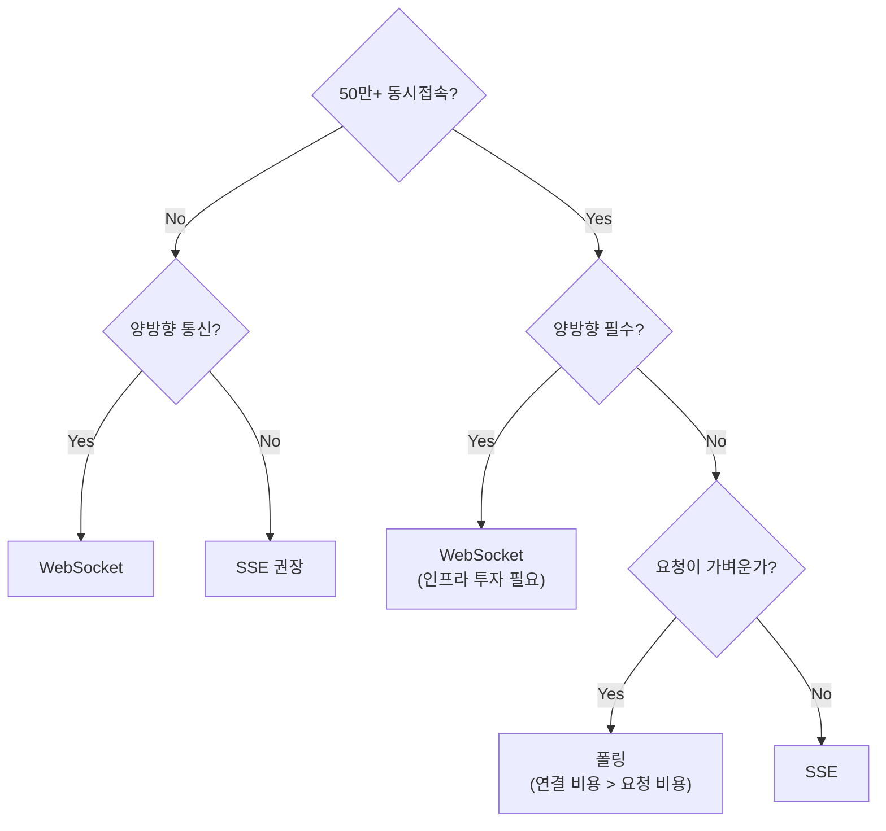

# WebSocket 학습 실습 공간

## 학습 목표
React 환경에서 WebSocket을 활용한 실시간 통신을 이해하고 구현합니다.

---

## 환경 설정

### 1. 의존성 설치
```bash
cd practice/react-app && npm install
```

### 2. Mock 서버 실행
```bash
npm run mock-server
```

### 3. 실습 코드 실행
```bash
npm run dev
```

---

## 학습 흐름 (3단계)

각 주제는 다음 3단계로 구성됩니다:

| 단계 | 파일 | 목적 |
|------|------|------|
| 1. INVESTIGATE | `INVESTIGATE.md` | 소크라테스 질문으로 사고 유도 |
| 2. LEARN | `LEARN.md` | 질문에 대한 답변 + 개념 정리 |
| 3. Practice | `practice/` | 코드로 직접 실습 |

**학습 방법**:
1. `INVESTIGATE.md`의 질문을 먼저 읽고 스스로 생각해봅니다
2. `LEARN.md`를 채워가며 개념을 정리합니다
3. `practice/` 폴더의 코드를 직접 수정하고 실행합니다

---

## 목차

| 섹션 | 주제 | 설명 |
|------|------|------|
| **01** | [WebSocket 기초](./learning/01-basics/) | HTTP vs WebSocket, 핸드셰이크 |
| **02** | [react-use-websocket](./learning/02-react-use-websocket/) | useWebSocket 훅, 조건부 연결 |
| **03** | [연결 상태 관리](./learning/03-connection-state/) | readyState, 상태별 UI 분기 |
| **04** | [재연결 로직](./learning/04-reconnection/) | Close Code, 지수 백오프 |
| **05** | [메시지 타입](./learning/05-message-types/) | SNAPSHOT/DELTA, 상태 동기화 |
| **06** | [에러 처리](./learning/06-error-handling/) | onError vs onClose, Fallback |
| **07** | [실제 코드 분석](./learning/07-real-world/) | TPS 프로젝트 분석 |
| **08** | [스케일링](./learning/08-scaling-considerations/) | Sticky Session, 재접속 폭풍 |

---

## 대규모 환경에서의 기술 선택



**핵심 공식:**
> **연결 유지 비용 > 자주 묻는 비용 → 폴링이 유리한 구간**

**상세 내용:** [08. 스케일링 고려사항](./learning/08-scaling-considerations/) | [SSE POC - 대규모 트래픽](../09-sse/learning/08-large-scale-architecture/)

---

## 디렉토리 구조

```
08-websocket/
├── README.md                        # 이 파일
├── learning/                        # 학습 문서 통합
│   ├── 01-basics/
│   ├── 02-react-use-websocket/
│   ├── 03-connection-state/
│   ├── 04-reconnection/
│   ├── 05-message-types/
│   ├── 06-error-handling/
│   ├── 07-real-world/
│   ├── 08-scaling-considerations/
│   └── reference/
└── practice/                        # 통합 실습 프로젝트
    ├── react-app/                   # React + react-use-websocket
    │   └── src/
    │       ├── main.tsx             # 엔트리 (섹션별 탭 네비게이션)
    │       ├── ch01/                # 네이티브 WebSocket
    │       ├── ch02/                # react-use-websocket 기본
    │       ├── ch03/                # 연결 상태
    │       ├── ch04/                # 재연결
    │       ├── ch05/                # 메시지 타입
    │       └── ch06/                # 에러 처리
    └── server/                      # Mock WebSocket 서버
        └── server.ts
```

---

## Mock 서버

Mock 서버는 `mock-socket` 라이브러리를 사용하여 WebSocket 서버를 시뮬레이션합니다.

### 메시지 타입
```typescript
// 서버 → 클라이언트
{ type: 'SNAPSHOT', data: [...] }
{ type: 'DELTA', data: { id, changes } }
{ type: 'ERROR', message: string }

// 클라이언트 → 서버
{ type: 'SUBSCRIBE', topic: string }
{ type: 'UNSUBSCRIBE', topic: string }
```

---

## 참고 자료
- [react-use-websocket 문서](https://github.com/robtaussig/react-use-websocket)
- [MDN WebSocket API](https://developer.mozilla.org/en-US/docs/Web/API/WebSocket)
- [WebSocket Close Codes](https://developer.mozilla.org/en-US/docs/Web/API/CloseEvent/code)
