# LEARN: react-use-websocket 라이브러리

## 학습 목표
react-use-websocket 라이브러리의 핵심 API를 이해하고, 조건부 연결 패턴과 메시지 히스토리 관리 방법을 설명할 수 있다.

---

## A0. 왜 라이브러리를 사용하는가?

### 네이티브 WebSocket의 문제점

**네이티브 WebSocket API를 React에서 직접 사용하면 다음 문제들이 발생합니다:**

```typescript
// ❌ 문제가 많은 코드
function ChatComponent() {
  const [messages, setMessages] = useState([]);

  useEffect(() => {
    const ws = new WebSocket('wss://...');

    ws.onmessage = (e) => {
      setMessages(prev => [...prev, e.data]);  // 클로저 문제 가능
    };

    return () => ws.close();  // cleanup
  }, []);  // 의존성 관리 어려움

  // ws를 어떻게 다른 곳에서 사용하지?
  // 재연결은 어떻게?
  // 상태는 어떻게 추적하지?
}
```

| 문제 | 설명 |
|------|------|
| **클로저 문제** | 이벤트 핸들러가 오래된 state를 참조 |
| **재연결 구현** | 직접 구현해야 함 (지수 백오프 등) |
| **상태 동기화** | readyState 변경 시 리렌더링 안 됨 |
| **컴포넌트 언마운트** | cleanup 누락 시 메모리 누수 |
| **여러 컴포넌트 공유** | 같은 연결을 공유하기 어려움 |

### react-use-websocket이 해결하는 것

```typescript
// ✅ 라이브러리 사용 - 깔끔하고 안전
function ChatComponent() {
  const { sendMessage, lastMessage, readyState } = useWebSocket('wss://...', {
    shouldReconnect: () => true,  // 자동 재연결
    reconnectAttempts: 5,
    reconnectInterval: 3000,
  });

  // lastMessage가 바뀌면 자동 리렌더링
  // readyState가 바뀌면 자동 리렌더링
  // 언마운트 시 자동 cleanup
  // 재연결 로직 내장
}
```

### 비교표

| 항목 | 네이티브 WebSocket | react-use-websocket |
|------|-------------------|---------------------|
| 상태 관리 | 직접 구현 | 자동 (readyState 동기화) |
| 재연결 | 직접 구현 | 옵션으로 설정 |
| 메모리 관리 | cleanup 필수 | 자동 cleanup |
| 타입 안전성 | 직접 정의 | 제네릭 지원 |
| 여러 컴포넌트 공유 | 어려움 | `share: true` 옵션 |
| 조건부 연결 | 직접 구현 | null URL 패턴 |

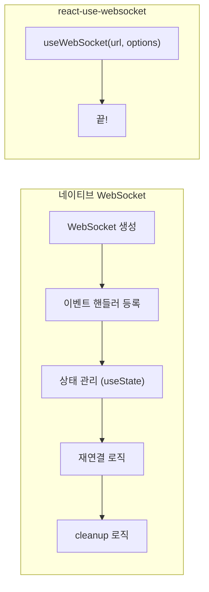

---

## A1. useWebSocket 반환값

### 기본 사용법

```typescript
import useWebSocket from 'react-use-websocket';

const MyComponent = () => {
  const { sendMessage, lastMessage, readyState } = useWebSocket('wss://example.com/ws');

  return <div>...</div>;
};
```

### 각 반환값의 역할

| 반환값 | 타입 | 역할 | 사용 예시 |
|--------|------|------|----------|
| `sendMessage` | `(msg: string) => void` | 서버로 문자열 메시지 전송 | `sendMessage('Hello')` |
| `sendJsonMessage` | `(msg: T) => void` | 객체를 JSON.stringify 후 전송 | `sendJsonMessage({ type: 'chat', text: 'Hi' })` |
| `lastMessage` | `MessageEvent \| null` | 마지막 수신 메시지 (원본) | `lastMessage?.data` |
| `lastJsonMessage` | `T \| null` | 마지막 수신 메시지 (자동 파싱) | `lastJsonMessage?.type` |
| `readyState` | `ReadyState` | 현재 연결 상태 (0~3, -1) | `readyState === ReadyState.OPEN` |
| `getWebSocket` | `() => WebSocket \| null` | 원본 WebSocket 객체 접근 | `getWebSocket()?.close()` |

### getWebSocket() 상세 설명

**`getWebSocket()`은 라이브러리가 내부적으로 관리하는 실제 WebSocket 인스턴스를 반환합니다.**

```typescript
const { getWebSocket, sendMessage } = useWebSocket(url);

// 원본 WebSocket 객체 접근
const ws = getWebSocket();
```

**왜 필요한가?**

useWebSocket 훅은 대부분의 기능을 추상화하지만, 때때로 **네이티브 WebSocket API에 직접 접근**해야 하는 경우가 있습니다.

| 상황 | getWebSocket() 사용 이유 |
|------|-------------------------|
| **바이너리 데이터 전송** | `ws.binaryType = 'arraybuffer'` 설정 |
| **버퍼 상태 확인** | `ws.bufferedAmount`로 전송 대기량 확인 |
| **프로토콜 확인** | `ws.protocol`로 협상된 프로토콜 확인 |
| **확장 기능** | `ws.extensions`로 사용 중인 확장 확인 |
| **강제 종료** | 특수한 Close Code로 종료 |

**사용 예시:**

```typescript
// 1. 바이너리 데이터 전송 설정
useEffect(() => {
  const ws = getWebSocket();
  if (ws) {
    ws.binaryType = 'arraybuffer';  // 또는 'blob'
  }
}, [getWebSocket]);

// 2. 버퍼 상태 확인 (대량 데이터 전송 시)
const sendLargeData = (data: ArrayBuffer) => {
  const ws = getWebSocket();
  if (ws && ws.bufferedAmount < 1024 * 1024) {  // 1MB 미만일 때만
    ws.send(data);
  } else {
    console.warn('버퍼가 가득 참, 전송 대기');
  }
};

// 3. 특수 Close Code로 종료
const forceClose = () => {
  const ws = getWebSocket();
  ws?.close(4000, 'Custom close reason');
};
```

**주의사항:**

```typescript
// ❌ 잘못된 사용 - 훅의 상태 관리를 우회
const ws = getWebSocket();
ws?.close();  // 훅이 재연결을 시도할 수 있음

// ✅ 올바른 사용 - 특수한 경우에만
const ws = getWebSocket();
if (ws?.bufferedAmount > threshold) {
  // 버퍼 상태에 따른 로직
}
```

**null 반환 시점:**
- URL이 null일 때 (조건부 연결)
- 아직 연결이 시작되지 않았을 때
- 연결이 완전히 종료되었을 때

---

### ReadyState 상세 설명

**react-use-websocket은 네이티브 WebSocket의 readyState에 `UNINSTANTIATED(-1)`를 추가합니다.**

| 상수 | 값 | 의미 | 발생 시점 |
|------|:--:|------|----------|
| `UNINSTANTIATED` | -1 | WebSocket 인스턴스 없음 | URL이 null일 때 |
| `CONNECTING` | 0 | 연결 시도 중 | `new WebSocket()` 직후 |
| `OPEN` | 1 | 연결 성공 | 핸드셰이크 완료 |
| `CLOSING` | 2 | 종료 진행 중 | `close()` 호출 직후 |
| `CLOSED` | 3 | 연결 종료됨 | 종료 완료 또는 실패 |

```typescript
import useWebSocket, { ReadyState } from 'react-use-websocket';

const { readyState } = useWebSocket(url);

// 상태별 UI 렌더링
const statusMap = {
  [ReadyState.UNINSTANTIATED]: { text: '비활성화', color: 'gray' },
  [ReadyState.CONNECTING]: { text: '연결 중...', color: 'yellow' },
  [ReadyState.OPEN]: { text: '연결됨', color: 'green' },
  [ReadyState.CLOSING]: { text: '종료 중...', color: 'orange' },
  [ReadyState.CLOSED]: { text: '연결 끊김', color: 'red' },
};

return <span style={{ color: statusMap[readyState].color }}>
  {statusMap[readyState].text}
</span>;
```

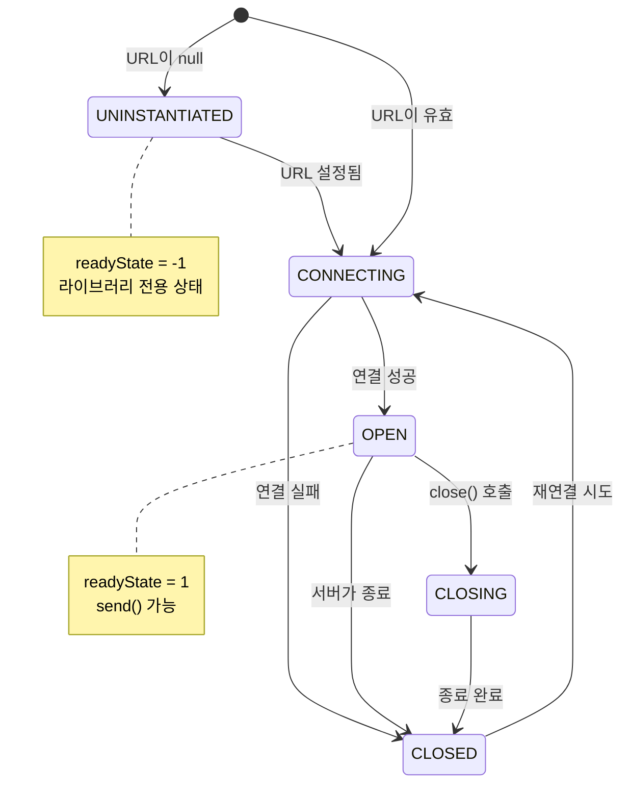

### UNINSTANTIATED(-1)가 필요한 이유

**네이티브 WebSocket에는 UNINSTANTIATED 상태가 없습니다.** `new WebSocket()`을 호출하면 즉시 CONNECTING(0) 상태가 됩니다.

```typescript
// 네이티브 WebSocket
const ws = new WebSocket('wss://...');
console.log(ws.readyState);  // 0 (CONNECTING) - 즉시 연결 시도

// WebSocket 인스턴스가 없는 상태를 표현할 방법이 없음!
```

**문제:** React에서 조건부 연결을 구현하려면 "아직 연결을 시작하지 않은 상태"를 표현해야 합니다.

```typescript
// 로그인 전에는 WebSocket을 만들면 안 됨
const wsUrl = isLoggedIn ? 'wss://...' : null;

// URL이 null일 때 readyState는 뭘로 표시해야 하지?
// - CONNECTING(0)? → 연결 중이 아닌데?
// - CLOSED(3)? → 닫힌 게 아니라 아예 안 만든 건데?
```

**해결:** 라이브러리가 `-1 (UNINSTANTIATED)`를 추가했습니다.

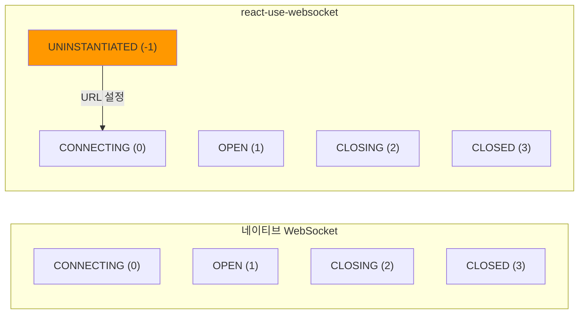

| 상태 | 네이티브 | 라이브러리 | 의미 |
|------|:-------:|:---------:|------|
| -1 | ❌ 없음 | ✅ UNINSTANTIATED | WebSocket 인스턴스 자체가 없음 |
| 0 | ✅ CONNECTING | ✅ CONNECTING | 연결 시도 중 |
| 1 | ✅ OPEN | ✅ OPEN | 연결됨 |
| 2 | ✅ CLOSING | ✅ CLOSING | 종료 중 |
| 3 | ✅ CLOSED | ✅ CLOSED | 종료됨 |

**실제 사용 예시:**

```typescript
const { readyState } = useWebSocket(isLoggedIn ? url : null);

// 상태별 분기
if (readyState === ReadyState.UNINSTANTIATED) {
  return <p>로그인이 필요합니다</p>;  // 아예 연결 안 함
}

if (readyState === ReadyState.CONNECTING) {
  return <p>연결 중...</p>;  // 연결 시도 중
}

if (readyState === ReadyState.OPEN) {
  return <p>연결됨!</p>;  // 사용 가능
}

if (readyState === ReadyState.CLOSED) {
  return <p>연결 끊김, 재연결 중...</p>;  // 끊어진 후 재연결
}
```

**핵심:**
> UNINSTANTIATED(-1)는 "WebSocket을 만들지 않기로 결정한 상태"입니다. CLOSED(3)는 "만들었다가 닫힌 상태"입니다. 이 차이가 조건부 연결에서 중요합니다.
| `getWebSocket` | `() => WebSocket \| null` | 원본 WebSocket 객체 접근 | `getWebSocket()?.close()` |

### sendMessage vs sendJsonMessage

**대부분의 WebSocket 통신은 JSON 형식을 사용합니다.** 라이브러리는 이를 위해 두 가지 전송 메서드를 제공합니다.

```typescript
// 문자열 전송 - sendMessage
sendMessage('plain text');

// JSON 전송 - sendJsonMessage (권장)
sendJsonMessage({
  type: 'chat',
  content: 'Hello!',
  timestamp: Date.now(),
});
// 내부적으로 JSON.stringify 수행

// 수동 JSON 전송 (비권장)
sendMessage(JSON.stringify({ type: 'chat' }));
```

**왜 sendJsonMessage를 권장하는가?**

| 방식 | 장점 | 단점 |
|------|------|------|
| `sendMessage(JSON.stringify(...))` | 명시적 | 매번 stringify 호출, 코드 장황 |
| `sendJsonMessage(...)` | 간결, 타입 안전 | 내부 동작 숨겨짐 |

```typescript
// ❌ sendMessage로 JSON 전송 - 번거롭고 실수 가능
sendMessage(JSON.stringify({ type: 'chat', content: text }));
sendMessage(JSON.stringify({ type: 'subscribe', channel: 'news' }));
sendMessage(JSON.stringify({ type: 'ping' }));

// ✅ sendJsonMessage - 간결하고 일관적
sendJsonMessage({ type: 'chat', content: text });
sendJsonMessage({ type: 'subscribe', channel: 'news' });
sendJsonMessage({ type: 'ping' });
```

**타입 안전성:**

```typescript
interface OutgoingMessage {
  type: 'chat' | 'subscribe' | 'ping';
  content?: string;
  channel?: string;
}

// 타입 체크됨
const { sendJsonMessage } = useWebSocket<unknown, OutgoingMessage>(url);

sendJsonMessage({ type: 'chat', content: 'Hi' });  // ✅
sendJsonMessage({ type: 'invalid' });  // ❌ 타입 에러
```

**sendMessage를 사용해야 하는 경우:**
- 바이너리 데이터 전송 (`ArrayBuffer`, `Blob`)
- 이미 직렬화된 문자열 전송
- JSON이 아닌 다른 형식 (XML 등)

### lastMessage vs lastJsonMessage

**서버에서 받은 메시지를 처리하는 두 가지 방법입니다.**

```typescript
// lastMessage 사용 (수동 파싱 필요)
useEffect(() => {
  if (lastMessage) {
    try {
      const data = JSON.parse(lastMessage.data);
      handleData(data);
    } catch (e) {
      console.error('파싱 실패');
    }
  }
}, [lastMessage]);

// lastJsonMessage 사용 (자동 파싱, 권장)
useEffect(() => {
  if (lastJsonMessage) {
    handleData(lastJsonMessage);  // 이미 객체
  }
}, [lastJsonMessage]);
```

**왜 lastJsonMessage를 권장하는가?**

| 항목 | lastMessage | lastJsonMessage |
|------|-------------|-----------------|
| **타입** | `MessageEvent \| null` | `T \| null` (제네릭) |
| **데이터 접근** | `lastMessage.data` (문자열) | 바로 객체 |
| **파싱** | 직접 `JSON.parse()` | 자동 파싱됨 |
| **에러 처리** | try-catch 필요 | 파싱 실패 시 null |
| **타입 안전성** | `unknown` | 제네릭으로 타입 지정 |

**내부 동작 비교:**

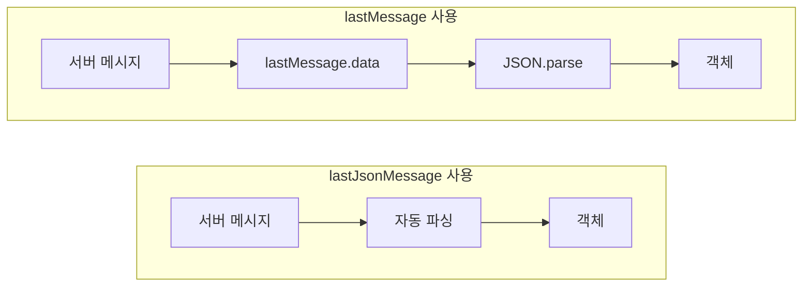

**타입 안전한 사용:**

```typescript
interface ServerMessage {
  type: 'chat' | 'notification' | 'error';
  payload: unknown;
  timestamp: number;
}

// 제네릭으로 타입 지정
const { lastJsonMessage } = useWebSocket<ServerMessage>(url);

// lastJsonMessage는 ServerMessage | null 타입
if (lastJsonMessage) {
  console.log(lastJsonMessage.type);      // 타입 자동완성 ✅
  console.log(lastJsonMessage.payload);   // 타입 안전 ✅
  console.log(lastJsonMessage.timestamp); // 타입 안전 ✅
}
```

**lastMessage를 사용해야 하는 경우:**

```typescript
// 1. 바이너리 데이터 수신
useEffect(() => {
  if (lastMessage && lastMessage.data instanceof Blob) {
    // Blob 처리
    const reader = new FileReader();
    reader.onload = () => console.log(reader.result);
    reader.readAsArrayBuffer(lastMessage.data);
  }
}, [lastMessage]);

// 2. 원본 MessageEvent의 다른 속성 필요
useEffect(() => {
  if (lastMessage) {
    console.log(lastMessage.origin);      // 메시지 출처
    console.log(lastMessage.timeStamp);   // 이벤트 타임스탬프
  }
}, [lastMessage]);

// 3. JSON이 아닌 데이터 (plain text, XML 등)
useEffect(() => {
  if (lastMessage) {
    const text = lastMessage.data;  // 문자열 그대로 사용
  }
}, [lastMessage]);
```

**파싱 실패 시 동작:**

```typescript
// 서버가 잘못된 JSON을 보낸 경우: "invalid json {"

// lastMessage - 에러 발생
const data = JSON.parse(lastMessage.data);  // ❌ SyntaxError

// lastJsonMessage - null 반환 (안전)
console.log(lastJsonMessage);  // null (파싱 실패)
```

---

## A2. 조건부 연결 패턴

### null URL 패턴

**react-use-websocket은 URL이 `null`이면 연결을 시도하지 않습니다.** 이 특성을 활용하면 조건부 연결을 구현할 수 있습니다.

```typescript
const MyComponent = ({ isLoggedIn }: { isLoggedIn: boolean }) => {
  // 로그인한 경우에만 WebSocket 연결
  const wsUrl = isLoggedIn ? 'wss://example.com/ws' : null;

  const { sendMessage, readyState } = useWebSocket(wsUrl);

  // isLoggedIn이 false → wsUrl이 null → 연결 안 함
  // isLoggedIn이 true → wsUrl이 유효 → 연결 시작
};
```

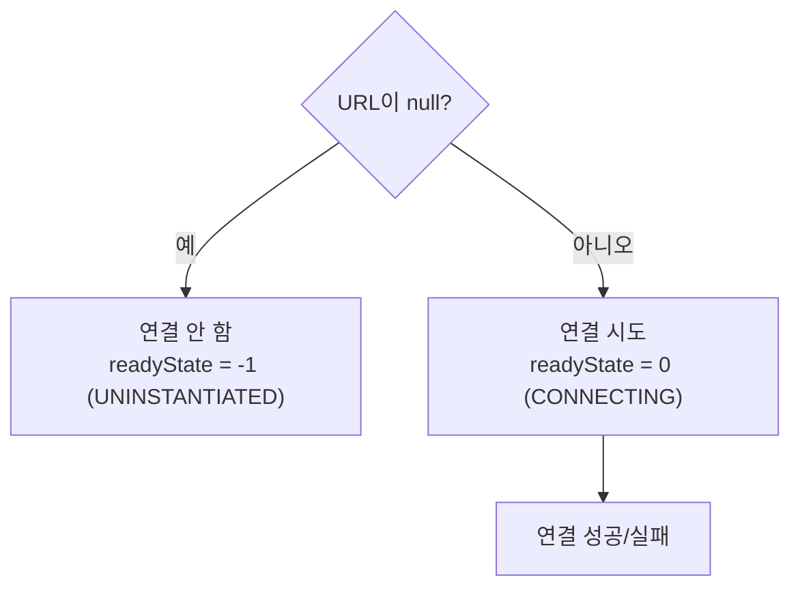

### ⚠️ shouldConnect 옵션 (버전 주의)

```typescript
// react-use-websocket 3.x에서는 사용 가능했으나
// 4.x에서는 제거됨!
useWebSocket('wss://example.com/ws', {
  shouldConnect: isLoggedIn,  // ❌ 4.x에서 타입 에러
});
```

**react-use-websocket 4.x에서는 `shouldConnect` 옵션이 없습니다.** 대신 **null URL 패턴**을 사용하세요.

```typescript
// ✅ 4.x에서 권장하는 방법
const wsUrl = isLoggedIn ? 'wss://example.com/ws' : null;
useWebSocket(wsUrl);
```

### null URL 패턴의 장점

| 장점 | 설명 |
|------|------|
| **명시적** | URL이 null이면 "연결 의도 없음"이 명확 |
| **타입 안전** | TypeScript에서 `string | null` 타입으로 명확히 표현 |
| **동적 URL** | 조건에 따라 다른 URL로 연결 가능 |
| **버전 호환** | 모든 버전에서 동작 |

### 실제 사용 사례

```typescript
// 1. 로그인 후에만 연결
const wsUrl = user?.isAuthenticated ? 'wss://...' : null;

// 2. 특정 페이지에서만 연결
const wsUrl = location.pathname === '/chat' ? 'wss://...' : null;

// 3. 팝업이 열릴 때만 연결
const wsUrl = isModalOpen ? 'wss://...' : null;

// 4. 수동 연결/해제 제어
const [shouldConnect, setShouldConnect] = useState(false);
const wsUrl = shouldConnect ? 'wss://...' : null;

<button onClick={() => setShouldConnect(true)}>연결</button>
<button onClick={() => setShouldConnect(false)}>해제</button>
```

---

## A3. 메시지 히스토리

### lastMessage의 한계

`lastMessage`는 **가장 최근 메시지 하나만 저장**합니다. 이전 메시지들을 보관하려면 별도의 상태 관리가 필요합니다.

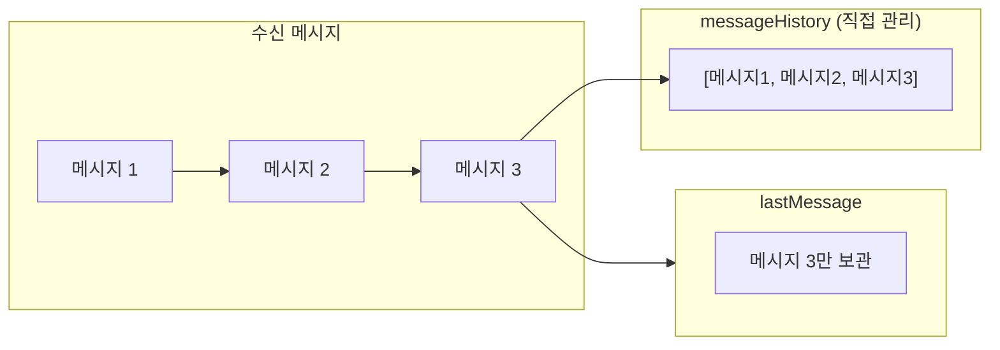

### 메시지 히스토리 관리 방법

**방법 1: useEffect로 직접 관리 (권장)**

```typescript
interface ChatMessage {
  id: string;
  sender: string;
  content: string;
  timestamp: number;
}

const ChatComponent = () => {
  const [messages, setMessages] = useState<ChatMessage[]>([]);
  const { lastJsonMessage, sendJsonMessage } = useWebSocket<ChatMessage>(url);

  // lastMessage가 변경될 때마다 히스토리에 추가
  useEffect(() => {
    if (lastJsonMessage !== null) {
      setMessages((prev) => [...prev, lastJsonMessage]);
    }
  }, [lastJsonMessage]);

  return (
    <ul>
      {messages.map((msg) => (
        <li key={msg.id}>{msg.sender}: {msg.content}</li>
      ))}
    </ul>
  );
};
```

**방법 2: 최대 개수 제한 (메모리 관리)**

```typescript
const MAX_MESSAGES = 100;

useEffect(() => {
  if (lastJsonMessage !== null) {
    setMessages((prev) => {
      const updated = [...prev, lastJsonMessage];
      // 오래된 메시지 제거
      return updated.slice(-MAX_MESSAGES);
    });
  }
}, [lastJsonMessage]);
```

---

## A4. 옵션 객체

### 주요 옵션

```typescript
useWebSocket(url, {
  // 이벤트 핸들러
  onOpen: (event) => console.log('연결됨'),
  onMessage: (event) => console.log('메시지:', event.data),
  onClose: (event) => console.log('종료:', event.code),
  onError: (event) => console.error('에러 발생'),

  // 재연결 설정
  shouldReconnect: (closeEvent) => closeEvent.code !== 1000,
  reconnectAttempts: 5,
  reconnectInterval: 3000,  // 또는 함수: (attemptNumber) => delay

  // 연결 제어
  share: false,        // 같은 URL 공유 여부
  retryOnError: true,  // 에러 시 재연결
  queryParams: { token: 'abc' },  // URL에 쿼리 추가
});
```

### shouldReconnect 상세 설명

**`shouldReconnect`는 연결이 끊겼을 때 재연결 여부를 결정하는 함수입니다.**

```typescript
useWebSocket(url, {
  shouldReconnect: (closeEvent) => {
    // closeEvent.code로 종료 원인 파악
    // true 반환 → 재연결 시도
    // false 반환 → 재연결 안 함

    // 정상 종료(1000)는 재연결 안 함
    if (closeEvent.code === 1000) return false;

    // 인증 실패(4001 등 커스텀 코드)는 재연결 안 함
    if (closeEvent.code === 4001) return false;

    // 그 외는 재연결
    return true;
  },
});
```

**일반적인 패턴:**

| 패턴 | 코드 | 설명 |
|------|------|------|
| 항상 재연결 | `() => true` | 어떤 상황에서도 재연결 |
| 비정상 종료만 | `(e) => e.code !== 1000` | 정상 종료 외에만 재연결 |
| 특정 에러 제외 | `(e) => ![1000, 4001].includes(e.code)` | 특정 코드 제외 |
| 조건부 | `(e) => isUserLoggedIn && e.code !== 1000` | 로그인 상태일 때만 |

### reconnectInterval 상세 설명

**고정 간격 또는 지수 백오프를 설정할 수 있습니다.**

```typescript
// 방법 1: 고정 간격 (3초마다)
useWebSocket(url, {
  reconnectInterval: 3000,
});

// 방법 2: 지수 백오프 (권장)
useWebSocket(url, {
  reconnectInterval: (attemptNumber) => {
    // attemptNumber: 1, 2, 3, 4, 5...
    // 1초, 2초, 4초, 8초, 16초... (최대 30초)
    return Math.min(1000 * Math.pow(2, attemptNumber - 1), 30000);
  },
});
```

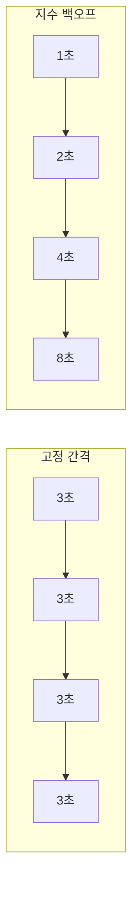

### 콜백 vs 반환값 사용

| 상황 | 콜백 (onOpen, onMessage 등) | 반환값 (lastMessage, readyState) |
|------|----------------------------|----------------------------------|
| 단순 상태 표시 | △ | ✅ `readyState` 직접 사용 |
| 부수효과 필요 | ✅ 콜백 내에서 처리 | △ useEffect 필요 |
| 조건부 처리 | ✅ 콜백에서 분기 | ✅ 렌더링에서 분기 |
| 로깅/알림 | ✅ 콜백에서 직접 호출 | △ |

```typescript
// 콜백 사용: 연결 성공 시 초기 메시지 전송
useWebSocket(url, {
  onOpen: () => {
    sendJsonMessage({ type: 'subscribe', channel: 'updates' });
    toast.success('연결됨!');
  },
});

// 반환값 사용: UI에서 상태 표시
const { readyState } = useWebSocket(url);
return <span>{readyState === ReadyState.OPEN ? '연결됨' : '연결 중...'}</span>;
```

### WebSocket 이벤트 타입 (WebSocketEventMap)

**콜백 함수의 `event` 파라미터 타입은 TypeScript의 `WebSocketEventMap`에서 가져옵니다.**

```typescript
// TypeScript lib.dom.d.ts에 정의된 WebSocketEventMap
interface WebSocketEventMap {
  "close": CloseEvent;
  "error": Event;
  "message": MessageEvent;
  "open": Event;
}
```

각 콜백에서 받는 이벤트 타입이 다릅니다:

| 콜백 | 이벤트 타입 | 주요 속성 |
|------|------------|----------|
| `onOpen` | `Event` | 기본 이벤트 (특별한 속성 없음) |
| `onMessage` | `MessageEvent` | `data`, `origin`, `lastEventId` |
| `onClose` | `CloseEvent` | `code`, `reason`, `wasClean` |
| `onError` | `Event` | 기본 이벤트 (에러 상세 없음) |

**왜 `WebSocketEventMap["open"]`을 사용하는가?**

```typescript
// 방법 1: 직접 Event 타입 사용 (권장)
onOpen: (event: Event) => { ... }

// 방법 2: WebSocketEventMap 인덱스 접근 (동일함)
onOpen: (event: WebSocketEventMap["open"]) => { ... }

// 두 방법은 동일한 타입! WebSocketEventMap["open"]은 Event 타입을 반환
```

`WebSocketEventMap["open"]`은 **인덱스 접근 타입(Indexed Access Type)**으로, WebSocketEventMap 인터페이스에서 "open" 키에 해당하는 타입을 추출합니다.

**각 이벤트 타입 상세:**

```typescript
// 1. onOpen - Event 타입
onOpen: (event: WebSocketEventMap["open"]) => {
  // event: Event
  console.log(event.type);        // "open"
  console.log(event.timeStamp);   // 이벤트 발생 시간
  // event.data는 없음! (MessageEvent에만 있음)
}

// 2. onMessage - MessageEvent 타입
onMessage: (event: WebSocketEventMap["message"]) => {
  // event: MessageEvent
  console.log(event.data);        // 서버에서 보낸 데이터 (문자열 또는 Blob)
  console.log(event.origin);      // 메시지 출처 URL
  console.log(event.lastEventId); // SSE와 호환용 (WebSocket에선 보통 빈 문자열)
}

// 3. onClose - CloseEvent 타입
onClose: (event: WebSocketEventMap["close"]) => {
  // event: CloseEvent
  console.log(event.code);        // 종료 코드 (1000, 1001, 4000 등)
  console.log(event.reason);      // 종료 이유 (문자열)
  console.log(event.wasClean);    // 정상 종료 여부 (boolean)
}

// 4. onError - Event 타입
onError: (event: WebSocketEventMap["error"]) => {
  // event: Event
  // ⚠️ 에러 상세 정보가 없음! (보안상 제한)
  console.log(event.type);        // "error"
  // event.message 같은 속성은 없음
}
```

**실전 예시:**

```typescript
useWebSocket(url, {
  onOpen: (event) => {
    // TypeScript가 event를 Event 타입으로 추론
    console.log('연결 성공:', event.timeStamp);
  },

  onMessage: (event) => {
    // TypeScript가 event를 MessageEvent 타입으로 추론
    const data = event.data;  // string | Blob | ArrayBuffer
    console.log('메시지:', data);
  },

  onClose: (event) => {
    // TypeScript가 event를 CloseEvent 타입으로 추론
    if (!event.wasClean) {
      console.warn(`비정상 종료: ${event.code} - ${event.reason}`);
    }
  },

  onError: (event) => {
    // TypeScript가 event를 Event 타입으로 추론
    // ⚠️ 에러 상세 정보는 접근 불가 (브라우저 보안 정책)
    console.error('WebSocket 에러 발생');
  },
});
```

**타입 가드와 함께 사용:**

```typescript
// MessageEvent의 data 타입 체크
onMessage: (event: MessageEvent) => {
  if (typeof event.data === 'string') {
    // 문자열 데이터 처리
    const parsed = JSON.parse(event.data);
  } else if (event.data instanceof Blob) {
    // 바이너리 데이터 처리
    const reader = new FileReader();
    reader.readAsArrayBuffer(event.data);
  }
}
```

**CloseEvent의 주요 코드:**

```typescript
onClose: (event: CloseEvent) => {
  switch (event.code) {
    case 1000:
      console.log('정상 종료');
      break;
    case 1001:
      console.log('페이지 이동/서버 종료');
      break;
    case 1006:
      console.log('비정상 종료 (네트워크 문제)');
      break;
    case 4001:
      console.log('인증 실패 (커스텀 코드)');
      break;
  }
}
```

### 이벤트 타입 계층 구조

**Event는 모든 DOM 이벤트의 기본(상위) 타입입니다.** MessageEvent, CloseEvent 등은 Event를 상속받아 추가 속성을 제공합니다.

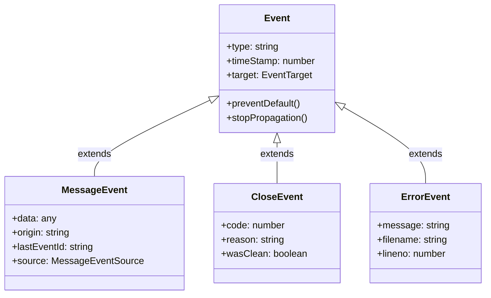

**TypeScript 정의 (간략화):**

```typescript
// 기본 Event 타입
interface Event {
  readonly type: string;
  readonly timeStamp: number;
  readonly target: EventTarget | null;
}

// MessageEvent는 Event를 확장
interface MessageEvent extends Event {
  readonly data: any;      // 추가된 속성
  readonly origin: string; // 추가된 속성
}

// CloseEvent는 Event를 확장
interface CloseEvent extends Event {
  readonly code: number;     // 추가된 속성
  readonly reason: string;   // 추가된 속성
  readonly wasClean: boolean; // 추가된 속성
}
```

**상속 관계가 의미하는 것:**

```typescript
// MessageEvent는 Event의 모든 속성 + 자신만의 속성을 가짐
onMessage: (event: MessageEvent) => {
  // Event에서 상속받은 속성
  console.log(event.type);       // ✅ "message"
  console.log(event.timeStamp);  // ✅ 이벤트 발생 시간

  // MessageEvent만의 속성
  console.log(event.data);       // ✅ 서버에서 보낸 데이터
  console.log(event.origin);     // ✅ 메시지 출처
}

// Event 타입은 기본 속성만 가짐
onOpen: (event: Event) => {
  console.log(event.type);       // ✅ "open"
  console.log(event.timeStamp);  // ✅ 이벤트 발생 시간
  console.log(event.data);       // ❌ undefined (Event에는 data 없음)
}
```

**왜 WebSocket error는 ErrorEvent가 아닌 Event인가?**

WebSocket의 `error` 이벤트는 `ErrorEvent`가 아닌 기본 `Event` 타입입니다. **브라우저 보안 정책** 때문에 에러 상세 정보(메시지, 스택 트레이스)를 노출하지 않습니다.

```typescript
// WebSocket error - Event 타입 (상세 정보 없음)
ws.onerror = (event: Event) => {
  console.log(event.message);  // ❌ undefined - 보안상 제한
};

// 일반 JavaScript 에러 - ErrorEvent 타입 (상세 정보 있음)
window.onerror = (event: ErrorEvent) => {
  console.log(event.message);  // ✅ 에러 메시지 접근 가능
  console.log(event.filename); // ✅ 파일명
  console.log(event.lineno);   // ✅ 라인 번호
};
```

> **핵심**: WebSocket 에러는 **크로스 오리진 보안** 때문에 상세 정보가 숨겨집니다. 외부 서버의 에러 정보가 악의적인 스크립트에 노출되는 것을 방지하기 위함입니다.

---

### share 옵션

**`share: true`로 설정하면 같은 URL을 사용하는 여러 컴포넌트가 하나의 WebSocket 연결을 공유합니다.**

```typescript
// ComponentA와 ComponentB가 같은 연결 사용
// ComponentA.tsx
useWebSocket('wss://example.com/ws', { share: true });

// ComponentB.tsx
useWebSocket('wss://example.com/ws', { share: true });
```

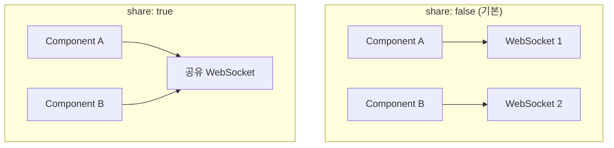

---

## A5. 훅 내부 동작 원리

**useWebSocket은 내부적으로 어떻게 동작하는가?**

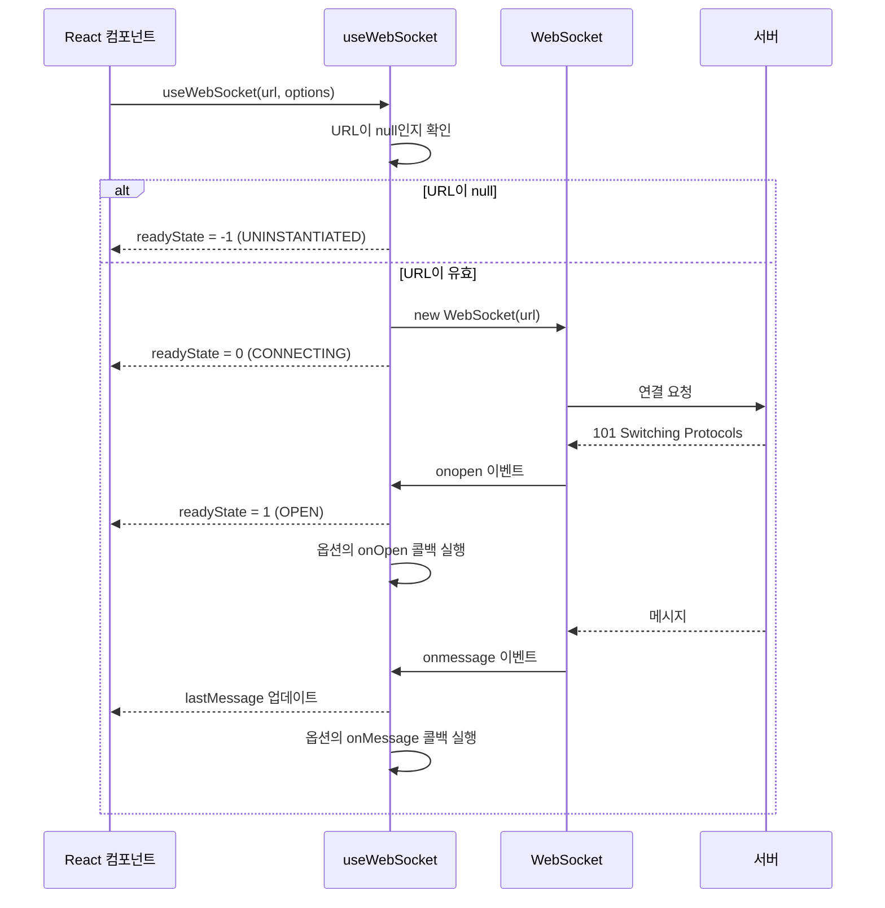

### 리렌더링 발생 시점

| 변경 | 리렌더링 | 이유 |
|------|:-------:|------|
| readyState 변경 | ✅ | 내부 state로 관리 |
| lastMessage 변경 | ✅ | 내부 state로 관리 |
| sendMessage 호출 | ❌ | 함수 참조는 안정적 |
| onOpen 콜백 실행 | ❌ | 콜백은 부수효과 |

### cleanup 동작

```typescript
// 컴포넌트 언마운트 시 자동으로:
useEffect(() => {
  // ... WebSocket 연결 로직

  return () => {
    // 1. WebSocket 정리
    websocket.close(1000, 'Component unmounted');
    // 2. 타이머 정리 (재연결 타이머 등)
    clearTimeout(reconnectTimeout);
    // 3. 이벤트 리스너 제거
  };
}, [url]);
```

---

## A6. 실전 패턴

### 패턴 1: 인증 토큰과 함께 연결

```typescript
const { token } = useAuth();

// 토큰을 URL 파라미터로 전달
const wsUrl = token ? `wss://api.example.com/ws?token=${token}` : null;

const { lastMessage, readyState } = useWebSocket(wsUrl, {
  onOpen: () => {
    console.log('인증된 WebSocket 연결 성공');
  },
  onClose: (event) => {
    if (event.code === 4001) {
      // 인증 실패 - 로그아웃 처리
      logout();
    }
  },
});
```

### 패턴 2: 연결 성공 시 구독 요청

```typescript
const { sendJsonMessage, lastJsonMessage, readyState } = useWebSocket(url, {
  onOpen: () => {
    // 연결 즉시 구독 요청
    sendJsonMessage({
      type: 'SUBSCRIBE',
      channels: ['notifications', 'chat'],
    });
  },
});
```

### 패턴 3: 연결 상태에 따른 UI

```typescript
function ConnectionStatus() {
  const { readyState } = useWebSocket(url);

  if (readyState === ReadyState.CONNECTING) {
    return <Spinner />;
  }

  if (readyState === ReadyState.CLOSED) {
    return <Alert type="error">연결이 끊어졌습니다. 재연결 중...</Alert>;
  }

  if (readyState === ReadyState.OPEN) {
    return <Badge color="green">실시간 연결됨</Badge>;
  }

  return null;
}
```

### 패턴 4: 메시지 타입별 처리

```typescript
interface ServerMessage {
  type: 'CHAT' | 'NOTIFICATION' | 'SYSTEM';
  payload: unknown;
}

const { lastJsonMessage } = useWebSocket<ServerMessage>(url);

useEffect(() => {
  if (!lastJsonMessage) return;

  switch (lastJsonMessage.type) {
    case 'CHAT':
      addChatMessage(lastJsonMessage.payload);
      break;
    case 'NOTIFICATION':
      showNotification(lastJsonMessage.payload);
      break;
    case 'SYSTEM':
      handleSystemMessage(lastJsonMessage.payload);
      break;
  }
}, [lastJsonMessage]);
```

---

## 핵심 정리 (한 문장으로)

> `useWebSocket`은 **WebSocket 연결, 상태 관리, 메시지 송수신을 선언적으로 처리**하며, **URL이 null이면 연결하지 않는 특성**을 활용해 조건부 연결을 구현하는 React 훅이다.

---

## 타입스크립트 제네릭

### useWebSocket 제네릭 구조

**useWebSocket은 두 개의 제네릭 타입 파라미터를 받습니다:**

```typescript
useWebSocket<TReceive, TSend>(url, options)
//           ^^^^^^^^  ^^^^^
//           수신 타입  송신 타입
```

| 제네릭 | 역할 | 적용 대상 |
|--------|------|----------|
| `TReceive` (첫 번째) | 서버에서 **받는** 메시지 타입 | `lastJsonMessage` |
| `TSend` (두 번째) | 서버로 **보내는** 메시지 타입 | `sendJsonMessage` |

### 기본 사용법

```typescript
// 수신 메시지 타입만 지정 (가장 흔한 케이스)
interface ServerMessage {
  type: 'chat' | 'notification';
  data: unknown;
}

const { lastJsonMessage } = useWebSocket<ServerMessage>(url);
// lastJsonMessage: ServerMessage | null
```

### 송신/수신 타입 모두 지정

```typescript
// 수신 메시지 타입
interface IncomingMessage {
  type: 'SNAPSHOT' | 'DELTA' | 'PONG';
  data?: unknown;
  timestamp: number;
}

// 송신 메시지 타입
interface OutgoingMessage {
  type: 'SUBSCRIBE' | 'UNSUBSCRIBE' | 'PING';
  channel?: string;
}

const { lastJsonMessage, sendJsonMessage } = useWebSocket<IncomingMessage, OutgoingMessage>(url);

// lastJsonMessage: IncomingMessage | null
// sendJsonMessage: (message: OutgoingMessage) => void

// 타입 체크됨!
sendJsonMessage({ type: 'SUBSCRIBE', channel: 'news' });  // ✅
sendJsonMessage({ type: 'INVALID' });  // ❌ 타입 에러

if (lastJsonMessage?.type === 'SNAPSHOT') {  // ✅ 자동완성 지원
  console.log(lastJsonMessage.data);
}
```

### 제네릭 사용 패턴

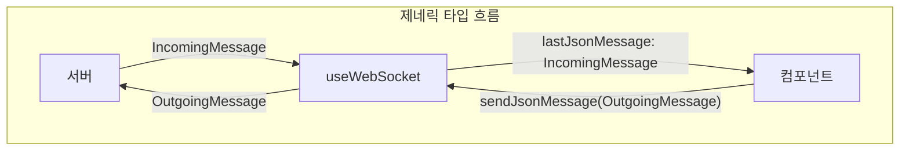

### 실전 예시: 채팅 앱

```typescript
// 서버 → 클라이언트 메시지
interface ChatIncoming {
  type: 'message' | 'user_joined' | 'user_left' | 'error';
  payload: {
    userId?: string;
    username?: string;
    content?: string;
    error?: string;
  };
  timestamp: number;
}

// 클라이언트 → 서버 메시지
interface ChatOutgoing {
  type: 'send_message' | 'join_room' | 'leave_room';
  payload: {
    roomId?: string;
    content?: string;
  };
}

function ChatRoom({ roomId }: { roomId: string }) {
  const { lastJsonMessage, sendJsonMessage, readyState } =
    useWebSocket<ChatIncoming, ChatOutgoing>(WS_URL);

  // 메시지 수신 처리
  useEffect(() => {
    if (!lastJsonMessage) return;

    switch (lastJsonMessage.type) {
      case 'message':
        // lastJsonMessage.payload.content 타입 안전
        addMessage(lastJsonMessage.payload);
        break;
      case 'user_joined':
        // lastJsonMessage.payload.username 타입 안전
        showNotification(`${lastJsonMessage.payload.username} 입장`);
        break;
      case 'error':
        showError(lastJsonMessage.payload.error);
        break;
    }
  }, [lastJsonMessage]);

  // 메시지 전송
  const handleSend = (content: string) => {
    sendJsonMessage({
      type: 'send_message',  // 자동완성 ✅
      payload: { content },
    });
  };

  // 방 입장
  useEffect(() => {
    if (readyState === ReadyState.OPEN) {
      sendJsonMessage({
        type: 'join_room',
        payload: { roomId },
      });
    }
  }, [readyState, roomId]);

  return <div>...</div>;
}
```

### unknown을 사용하는 경우

```typescript
// 수신 타입을 모르거나 동적인 경우
const { lastJsonMessage, sendJsonMessage } =
  useWebSocket<unknown, OutgoingMessage>(url);

// lastJsonMessage: unknown - 직접 타입 체크 필요
if (lastJsonMessage && typeof lastJsonMessage === 'object') {
  // 타입 가드로 처리
}

// sendJsonMessage는 여전히 타입 안전
sendJsonMessage({ type: 'PING' });  // ✅ OutgoingMessage 타입 체크
```

### 기본값

```typescript
// 제네릭을 생략하면 둘 다 unknown
useWebSocket(url);
// = useWebSocket<unknown, unknown>(url)

// 첫 번째만 지정하면 두 번째는 unknown
useWebSocket<ServerMessage>(url);
// = useWebSocket<ServerMessage, unknown>(url)
```

---

## 실습으로 이동
→ `practice/basic-usage.tsx`
→ `practice/conditional-connect.tsx`
