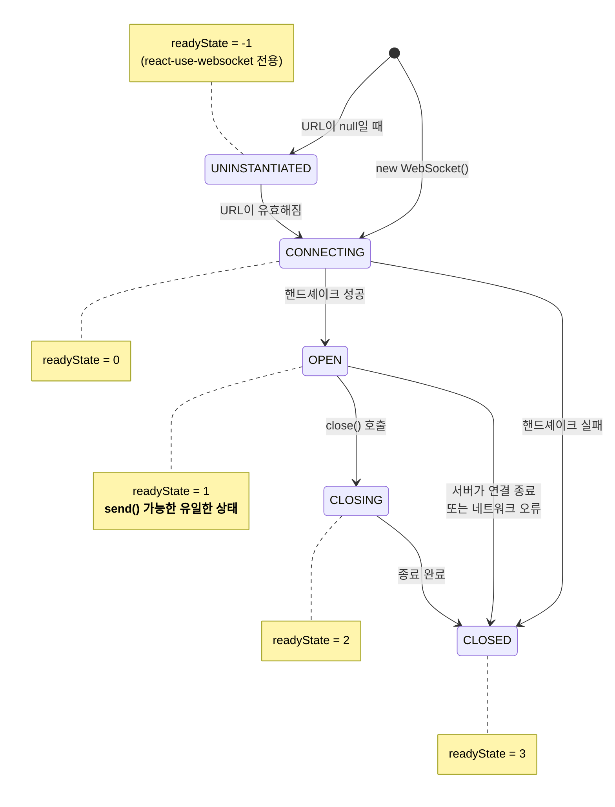
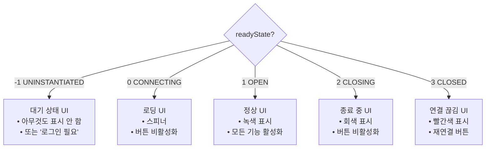
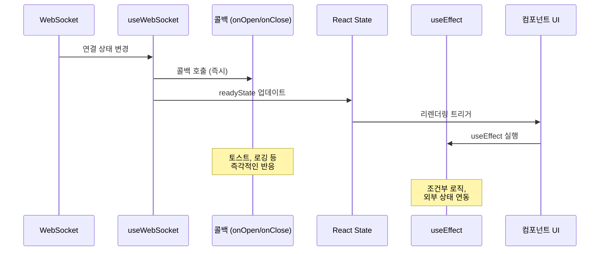
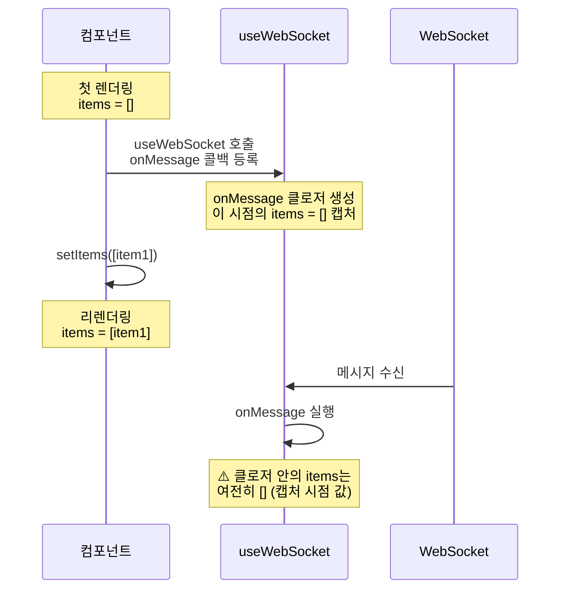
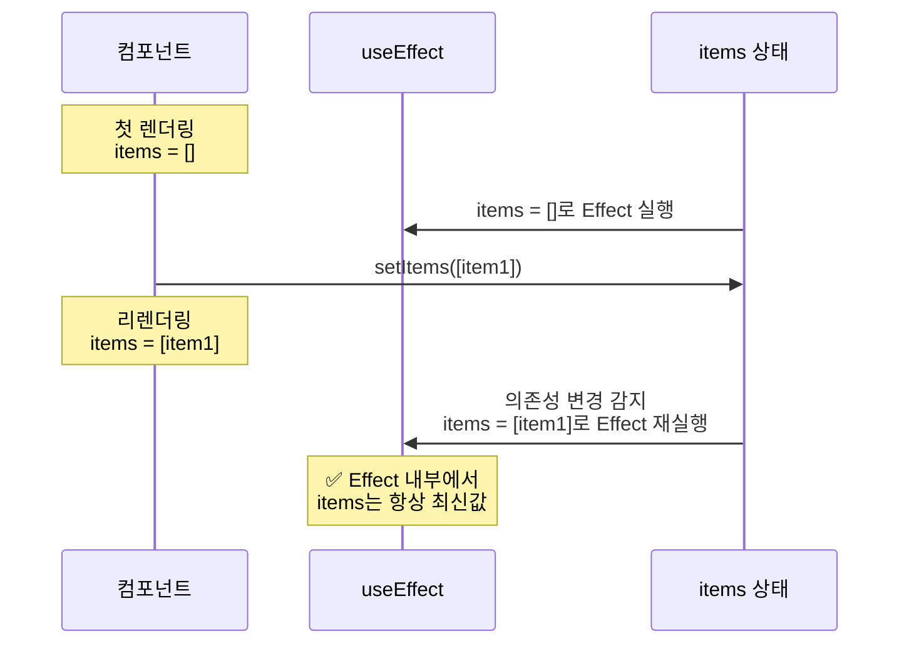
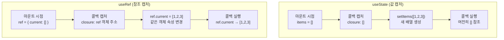
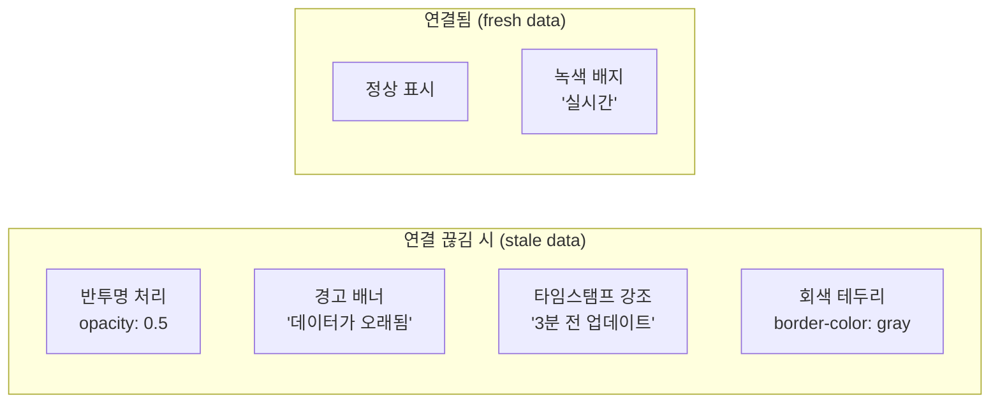

# LEARN: 연결 상태 관리

## 학습 목표
WebSocket의 readyState 값을 이해하고, 상태별 UI 분기와 상태 변경 감지 패턴을 면접에서 설명할 수 있다.

---

## A1. readyState 값의 의미

### readyState란?

**readyState는 WebSocket 연결의 현재 상태를 나타내는 숫자 값입니다.** 네이티브 WebSocket API에서는 0~3의 값을, react-use-websocket에서는 추가로 -1(UNINSTANTIATED)을 제공합니다.

### 상태 값 정리

| 값 | 상수명 | 의미 | send() 호출 시 |
|----|--------|------|---------------|
| 0 | CONNECTING | 연결 시도 중, 핸드셰이크 진행 | ❌ 에러 발생 |
| 1 | OPEN | 연결 완료, 데이터 송수신 가능 | ✅ 정상 전송 |
| 2 | CLOSING | 연결 종료 진행 중 | ❌ 에러 발생 |
| 3 | CLOSED | 연결 종료 완료 | ❌ 에러 발생 |
| -1 | UNINSTANTIATED | WebSocket이 아직 생성되지 않음 (react-use-websocket 전용) | ❌ 아무 일도 안 일어남 |

### 상태 전이 다이어그램



### UNINSTANTIATED 상태 (-1)

**UNINSTANTIATED는 react-use-websocket 라이브러리에서만 존재하는 상태입니다.** 네이티브 WebSocket API에는 없으며, URL이 `null`이어서 WebSocket 객체가 아예 생성되지 않은 상태를 나타냅니다.

```typescript
// UNINSTANTIATED 상태가 되는 경우
const { readyState } = useWebSocket(null);  // readyState === -1

// 조건부 연결에서 자주 발생
const wsUrl = isLoggedIn ? 'wss://...' : null;
const { readyState } = useWebSocket(wsUrl);
// isLoggedIn === false → readyState === -1
```

**UNINSTANTIATED vs CLOSED 차이:**

| 상태 | 의미 | 재연결 시도 |
|------|------|------------|
| UNINSTANTIATED (-1) | WebSocket 객체가 없음 | URL이 유효해지면 연결 |
| CLOSED (3) | 연결이 있었으나 종료됨 | shouldReconnect에 따라 재연결 |

---

## A2. 상태별 UI 분기

### 왜 상태별 UI가 필요한가?

**사용자는 현재 연결 상태를 알아야 합니다.** 연결 중인데 메시지를 보내려 하거나, 연결이 끊어졌는데 데이터를 신뢰하면 안 됩니다. 적절한 UI 피드백은 UX의 핵심입니다.

### CONNECTING 상태 (0)

**연결 시도 중임을 사용자에게 알려야 합니다.**

- **사용자 피드백**: 로딩 인디케이터, 스피너, "연결 중..." 텍스트
- **UI 요소**: 메시지 전송 버튼 비활성화, 입력 필드 비활성화

```typescript
{readyState === ReadyState.CONNECTING && (
  <div className="status-bar connecting">
    <Spinner size="sm" />
    <span>서버에 연결 중...</span>
  </div>
)}
```

### OPEN 상태 (1)

**정상 연결 상태임을 표시하고, 모든 기능을 활성화합니다.**

- **활성화할 요소**: 메시지 입력, 전송 버튼, 구독 버튼
- **비활성화할 요소**: 없음 (모든 기능 사용 가능)

```typescript
{readyState === ReadyState.OPEN && (
  <>
    <div className="status-bar connected">
      <span className="dot green" />
      <span>연결됨</span>
    </div>
    <MessageInput onSend={sendMessage} />
  </>
)}
```

### CLOSING/CLOSED 상태 (2, 3)

**연결이 종료되었거나 종료 중임을 알리고, 재연결 옵션을 제공합니다.**

- **사용자 피드백**: "연결 끊김", 오프라인 상태 표시
- **재연결 옵션**: 수동 재연결 버튼, 자동 재연결 카운트다운

```typescript
{(readyState === ReadyState.CLOSING || readyState === ReadyState.CLOSED) && (
  <div className="status-bar disconnected">
    <span className="dot red" />
    <span>연결 끊김</span>
    <button onClick={reconnect}>재연결</button>
  </div>
)}
```

### 전체 상태별 UI 분기 패턴

```typescript
import useWebSocket, { ReadyState } from 'react-use-websocket';

const ChatRoom = () => {
  const { sendMessage, lastMessage, readyState } = useWebSocket(WS_URL);

  // 상태별 상태 표시 텍스트
  const connectionStatus = {
    [ReadyState.CONNECTING]: '연결 중...',
    [ReadyState.OPEN]: '연결됨',
    [ReadyState.CLOSING]: '연결 종료 중...',
    [ReadyState.CLOSED]: '연결 끊김',
    [ReadyState.UNINSTANTIATED]: '대기 중',
  }[readyState];

  // 전송 버튼 활성화 여부
  const canSend = readyState === ReadyState.OPEN;

  return (
    <div className="chat-room">
      {/* 상태 표시 바 */}
      <StatusBar status={connectionStatus} readyState={readyState} />

      {/* 메시지 목록 */}
      <MessageList messages={messages} />

      {/* 입력 영역 */}
      <div className="input-area">
        <input
          type="text"
          disabled={!canSend}
          placeholder={canSend ? '메시지 입력...' : '연결 대기 중...'}
        />
        <button disabled={!canSend} onClick={() => sendMessage(input)}>
          전송
        </button>
      </div>
    </div>
  );
};
```

### 상태 분기 플로우차트



---

## A3. 상태 변경 감지

### 자동 리렌더링

**react-use-websocket의 `readyState`는 React 상태로 관리되므로, 변경 시 컴포넌트가 자동으로 리렌더링됩니다.** 별도의 구독이나 이벤트 리스너 설정이 필요 없습니다.

```typescript
const { readyState } = useWebSocket(url);

// readyState가 변경될 때마다 이 컴포넌트가 리렌더링됨
return <span>{readyState}</span>;
```

### 상태 변경 시 액션 수행

상태가 변경될 때 특정 로직을 실행하는 방법은 두 가지입니다.

**방법 1: useEffect 사용**

```typescript
const { readyState, sendMessage } = useWebSocket(url);

useEffect(() => {
  if (readyState === ReadyState.OPEN) {
    // 연결 성공 시 초기 데이터 요청
    sendMessage(JSON.stringify({ type: 'subscribe', channel: 'updates' }));
    console.log('WebSocket 연결됨!');
  }

  if (readyState === ReadyState.CLOSED) {
    // 연결 종료 시 상태 정리
    console.log('WebSocket 연결 끊김');
  }
}, [readyState]);
```

**방법 2: 콜백 옵션 사용**

```typescript
const { sendMessage } = useWebSocket(url, {
  onOpen: () => {
    sendMessage(JSON.stringify({ type: 'subscribe', channel: 'updates' }));
    console.log('WebSocket 연결됨!');
  },
  onClose: (event) => {
    console.log(`WebSocket 연결 끊김: ${event.code}`);
  },
  onError: (event) => {
    console.error('WebSocket 에러 발생');
  },
});
```

### 언제 어떤 방법을 사용?

| 상황 | useEffect | 콜백 | 이유 |
|------|:---------:|:----:|------|
| 연결 시 초기 메시지 전송 | △ | ✅ | 콜백이 더 직관적, `sendMessage` 즉시 사용 가능 |
| 연결 상태 로깅 | △ | ✅ | 콜백에서 이벤트 객체 접근 가능 |
| 상태별 UI 렌더링 | ✅ | △ | `readyState` 값으로 직접 분기 가능 |
| 여러 상태 조합 처리 | ✅ | △ | 복잡한 조건문은 useEffect가 유연 |
| 외부 상태 연동 | ✅ | △ | Redux, Zustand 등과 연동 시 useEffect 권장 |
| 단순 알림/토스트 | △ | ✅ | 콜백에서 바로 호출 |

**권장 패턴:**

```typescript
// 콜백: 단순한 일회성 액션
useWebSocket(url, {
  onOpen: () => toast.success('연결됨!'),
  onClose: () => toast.error('연결 끊김'),
});

// useEffect: 상태 기반 복잡한 로직
useEffect(() => {
  if (readyState === ReadyState.OPEN && isAuthenticated) {
    sendMessage(JSON.stringify({ token: authToken }));
  }
}, [readyState, isAuthenticated, authToken]);
```

### 상태 변경 감지 흐름



### 콜백의 Stale Closure 문제

**콜백 방식에는 치명적인 문제가 있습니다.** 콜백 내부에서 React 상태를 참조하면 **등록 시점의 값만 보입니다.**

```typescript
const [items, setItems] = useState<Item[]>([]);
const [connectionCount, setConnectionCount] = useState(0);

useWebSocket(WS_URL, {
  onOpen: () => {
    setConnectionCount(prev => prev + 1);
  },
  onMessage: (event) => {
    // ⚠️ 문제: items는 항상 초기값 []를 참조함
    console.log('현재 items:', items);  // 항상 []
    console.log('연결 횟수:', connectionCount);  // 항상 0

    const newItem = JSON.parse(event.data);
    // items.length는 항상 0으로 보임
    console.log('items 개수:', items.length);  // 항상 0
  },
});
```

**왜 이런 문제가 발생하는가?**

JavaScript 클로저의 동작 원리 때문입니다.



**핵심 원인:**
1. `onMessage` 콜백은 **컴포넌트 마운트 시점**에 한 번만 등록됩니다
2. 이때 콜백 함수가 참조하는 `items`는 **그 시점의 값으로 고정**(캡처)됩니다
3. 이후 `setItems`로 상태가 변경되어도, 콜백 안의 `items`는 **업데이트되지 않습니다**
4. 이것을 **"Stale Closure"(오래된 클로저)** 문제라고 합니다

### useEffect + lastMessage가 해결책인 이유

```typescript
const [items, setItems] = useState<Item[]>([]);
const { lastMessage } = useWebSocket(WS_URL);

useEffect(() => {
  if (lastMessage !== null) {
    // ✅ 이 시점에서 items는 최신 값
    console.log('현재 items:', items);  // 실제 최신 값

    const newItem = JSON.parse(lastMessage.data);
    console.log('items 개수:', items.length);  // 실제 개수
  }
}, [lastMessage, items]);  // 의존성 배열에 items 포함
```

**왜 동작하는가?**



**핵심 원리:**
1. `useEffect`는 **의존성 배열이 변경될 때마다** 새로 실행됩니다
2. 새로 실행될 때 **현재 렌더링 시점의 최신 값**을 참조합니다
3. `[lastMessage, items]`를 의존성에 넣으면:
   - `lastMessage`가 변경될 때 (새 메시지 수신)
   - `items`가 변경될 때
   - 둘 다 Effect가 재실행되어 최신 값 보장

### useEffect vs 콜백 비교 정리

| 항목 | onMessage 콜백 | useEffect + lastMessage |
|------|----------------|-------------------------|
| 실행 시점 | 메시지 수신 시 | 의존성 변경 시 |
| 상태 참조 | ❌ 등록 시점 값 (stale) | ✅ 현재 최신 값 |
| 클로저 문제 | 발생 | 없음 |
| 코드 복잡도 | 단순 | 약간 복잡 |
| 권장 용도 | 단순 로깅 | 상태 의존 로직 |

### 콜백을 써도 되는 경우

상태에 의존하지 않는 **단순 작업**은 콜백으로도 충분합니다:

```typescript
useWebSocket(WS_URL, {
  onMessage: (event) => {
    // ✅ OK: 외부 상태에 의존하지 않음
    console.log('메시지 수신:', event.data);

    // ✅ OK: 외부 함수 호출 (상태 무관)
    analytics.track('websocket_message', { data: event.data });
  },
});
```

### useRef로 콜백에서 최신값 참조하기

콜백을 반드시 써야 한다면 `useRef`를 사용합니다:

```typescript
const [items, setItems] = useState<Item[]>([]);
const itemsRef = useRef(items);

// items가 변경될 때마다 ref도 업데이트
useEffect(() => {
  itemsRef.current = items;
}, [items]);

useWebSocket(WS_URL, {
  onMessage: (event) => {
    // ✅ ref는 항상 최신값
    console.log('현재 items:', itemsRef.current);
  },
});
```

**왜 useRef는 동작하는가?**

핵심은 **useState와 useRef의 캡처 방식 차이**에 있습니다.

**useState: 값을 캡처**

```typescript
const [items, setItems] = useState([]);  // items = []

useWebSocket(WS_URL, {
  onMessage: (event) => {
    // 콜백 생성 시점에 items 값 "[]"이 복사됨
    console.log(items);  // 항상 []
  },
});

setItems([1, 2, 3]);  // 새 배열이 생성됨, 하지만 콜백은 옛날 []를 봄
```

**useRef: 객체 참조를 캡처**

```typescript
const itemsRef = useRef([]);  // { current: [] } 객체 생성

useWebSocket(WS_URL, {
  onMessage: (event) => {
    // 콜백 생성 시점에 ref "객체의 주소"가 캡처됨
    console.log(itemsRef.current);  // 최신값!
  },
});

itemsRef.current = [1, 2, 3];  // 같은 객체의 current 속성만 변경
```

**시각화**



**메모리 관점에서 비교**

```typescript
// === useState ===
let items_v1 = [];           // 메모리 주소: 0x001
// 콜백이 0x001 주소의 [] 캡처

setItems([1, 2, 3]);         // 메모리 주소: 0x002 (새 배열!)
// 콜백은 여전히 0x001 참조 → []

// === useRef ===
const ref = { current: [] }; // 메모리 주소: 0x100, current는 0x001
// 콜백이 0x100 주소의 객체 캡처

ref.current = [1, 2, 3];     // 0x100 객체의 current를 0x002로 변경
// 콜백은 0x100 참조 → ref.current → [1, 2, 3]
```

**useState vs useRef 비교**

| | useState | useRef |
|---|---|---|
| 캡처 대상 | **값** (primitive/array/object) | **객체 참조** (항상 같은 주소) |
| 업데이트 시 | 새 값 생성 | 같은 객체의 `.current` 변경 |
| 콜백에서 | 캡처된 옛날 값 | `.current`로 최신값 접근 |
| 리렌더링 | 발생 | 발생 안 함 |

> **한 줄 요약**: useRef는 **"상자"를 캡처**하고, 상자 안의 내용물(`.current`)은 언제든 바꿀 수 있습니다. useState는 **"내용물"을 캡처**해서 상자가 바뀌면 못 따라갑니다.

### 실무 권장 패턴

```typescript
// 1. lastJsonMessage로 자동 파싱 + useEffect로 최신 상태 보장
const { lastJsonMessage } = useWebSocket<ServerMessage>(WS_URL);

const handleMessage = useCallback((message: ServerMessage) => {
  switch (message.type) {
    case 'SNAPSHOT':
      setItems(message.data);
      break;
    case 'DELTA':
      setItems(prev => prev.map(item =>
        item.id === message.data.id
          ? { ...item, ...message.data.changes }
          : item
      ));
      break;
  }
}, []);

useEffect(() => {
  if (lastJsonMessage) {
    handleMessage(lastJsonMessage);
  }
}, [lastJsonMessage, handleMessage]);
```

---

## A4. 상태 시각화

### 색상 가이드

| 상태 | 추천 색상 | 이유 |
|------|----------|------|
| CONNECTING | 🟡 노란색/주황색 | 진행 중, 주의 필요 (신호등의 노란불) |
| OPEN | 🟢 녹색 | 정상, 안전 (신호등의 녹색불) |
| CLOSING | 🟠 주황색 | 경고, 곧 종료됨 |
| CLOSED | 🔴 빨간색 | 중단됨, 문제 발생 (신호등의 빨간불) |
| UNINSTANTIATED | ⚪ 회색 | 비활성, 대기 중 |

### 아이콘 가이드

| 상태 | 추천 아이콘 | 설명 |
|------|------------|------|
| CONNECTING | 🔄 스피너/회전 | 진행 중인 작업 |
| OPEN | ✅ 체크/연결됨 | 정상 연결 |
| CLOSED | ❌ X표시/끊어진 선 | 연결 해제 |
| UNINSTANTIATED | ⏸️ 일시정지 | 대기 상태 |

### 구현 예시: ConnectionIndicator 컴포넌트

```typescript
import { ReadyState } from 'react-use-websocket';

interface ConnectionIndicatorProps {
  readyState: ReadyState;
}

const ConnectionIndicator = ({ readyState }: ConnectionIndicatorProps) => {
  const config = {
    [ReadyState.CONNECTING]: {
      color: '#f59e0b',  // amber-500
      icon: '🔄',
      text: '연결 중',
      className: 'animate-pulse',
    },
    [ReadyState.OPEN]: {
      color: '#22c55e',  // green-500
      icon: '✅',
      text: '연결됨',
      className: '',
    },
    [ReadyState.CLOSING]: {
      color: '#f97316',  // orange-500
      icon: '⏳',
      text: '종료 중',
      className: '',
    },
    [ReadyState.CLOSED]: {
      color: '#ef4444',  // red-500
      icon: '❌',
      text: '연결 끊김',
      className: '',
    },
    [ReadyState.UNINSTANTIATED]: {
      color: '#9ca3af',  // gray-400
      icon: '⏸️',
      text: '대기 중',
      className: '',
    },
  }[readyState];

  return (
    <div className={`connection-indicator ${config.className}`}>
      <span
        className="status-dot"
        style={{ backgroundColor: config.color }}
      />
      <span className="status-icon">{config.icon}</span>
      <span className="status-text">{config.text}</span>
    </div>
  );
};
```

### 오래된 데이터 표시

**연결이 끊어진 동안 화면에 표시되는 데이터가 최신이 아닐 수 있습니다.** 이를 사용자에게 알려야 합니다.

```typescript
const RealTimeData = ({ data, readyState }) => {
  const isStale = readyState !== ReadyState.OPEN;

  return (
    <div className={`data-container ${isStale ? 'stale' : ''}`}>
      {isStale && (
        <div className="stale-warning">
          ⚠️ 연결이 끊어져 데이터가 최신이 아닐 수 있습니다
        </div>
      )}

      <div className={isStale ? 'opacity-50' : ''}>
        {/* 실제 데이터 표시 */}
        <span>현재 가격: {data.price}</span>
        <span className="timestamp">
          마지막 업데이트: {data.lastUpdated}
        </span>
      </div>
    </div>
  );
};
```

**시각적 처리 방법:**



---

## 핵심 정리 (한 문장으로)

> 연결 상태 관리의 핵심은 **`readyState` 값에 따라 UI를 분기하고, 사용자에게 현재 연결 상태와 데이터의 신선도를 명확하게 전달하는 것**이다.

---

## 상태 관리 체크리스트

| 항목 | 확인 |
|------|:----:|
| 모든 readyState 값(5개)에 대한 UI 처리 | ☐ |
| OPEN 상태에서만 send() 호출 | ☐ |
| 연결 중 로딩 표시 | ☐ |
| 연결 끊김 시 재연결 옵션 제공 | ☐ |
| 오래된 데이터 표시 처리 | ☐ |
| 상태별 버튼 활성화/비활성화 | ☐ |

---

## 실습으로 이동
→ `practice/connection-status.tsx`
