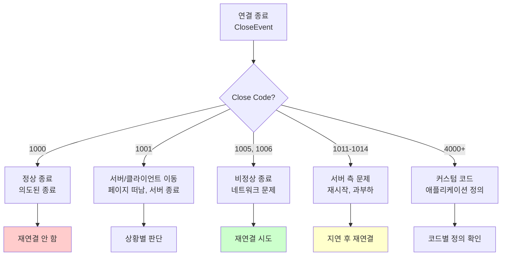
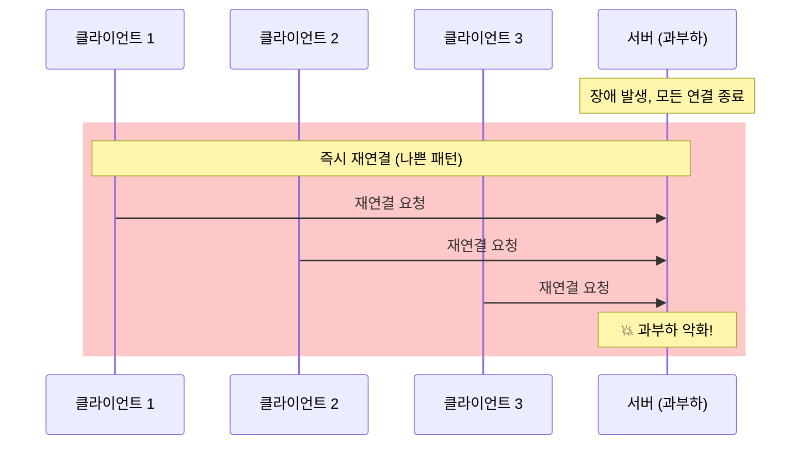
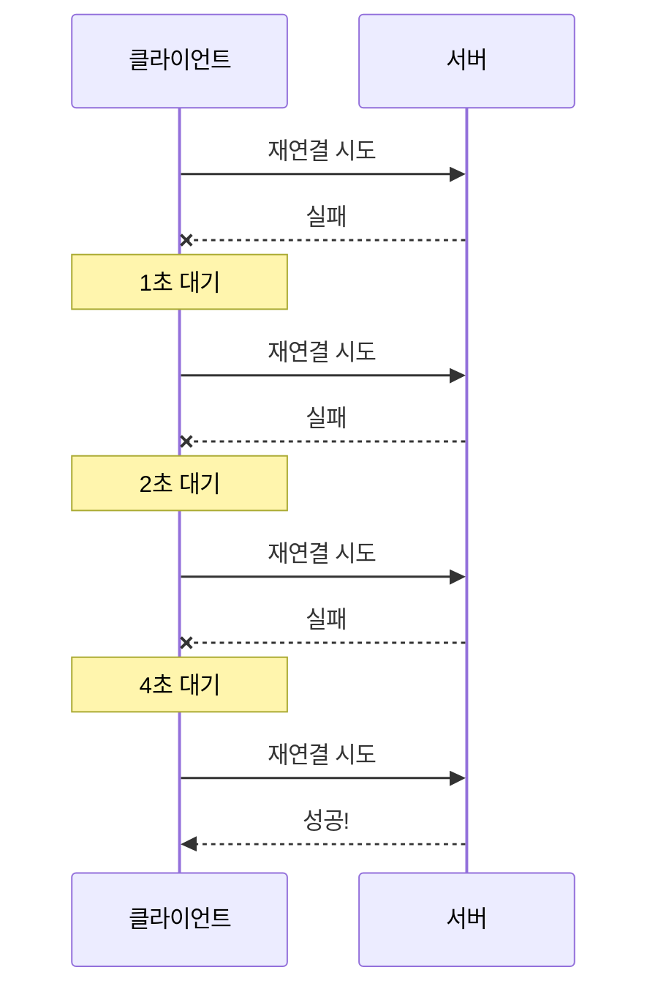
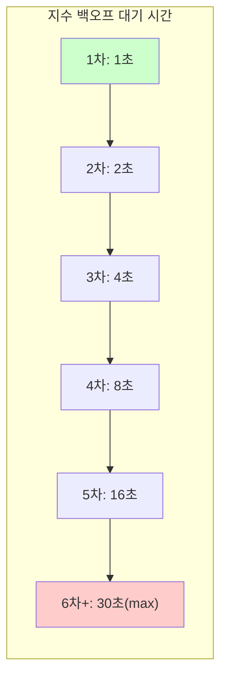
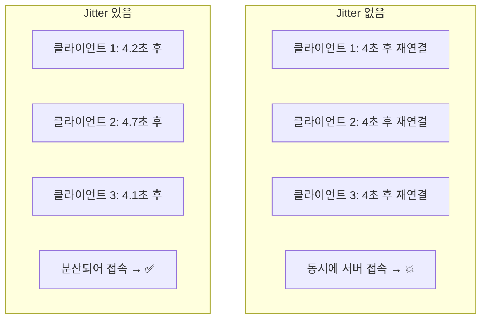
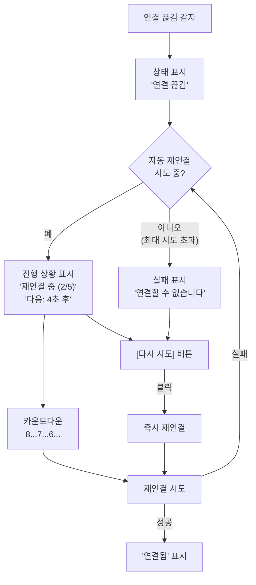

# LEARN: 재연결 로직

## 학습 목표
WebSocket Close Code의 의미를 이해하고, 지수 백오프 알고리즘을 활용한 재연결 전략을 면접에서 설명할 수 있다.

---

## A1. Close Code의 의미

### Close Code란?

**Close Code는 WebSocket 연결이 종료될 때 그 이유를 나타내는 숫자 코드입니다.** HTTP의 상태 코드(200, 404, 500 등)처럼, WebSocket에도 종료 사유를 표준화한 코드가 있습니다. 이 코드를 기반으로 재연결 여부를 결정합니다.

### 주요 Close Code

| 코드 | 이름 | 의미 | 재연결 여부 |
|------|------|------|:----------:|
| 1000 | Normal Closure | 정상적으로 연결 종료 (의도된 종료) | ❌ |
| 1001 | Going Away | 서버 종료 또는 페이지 이동 | ⚠️ (상황에 따라) |
| 1002 | Protocol Error | 프로토콜 오류 | ❌ |
| 1003 | Unsupported Data | 지원하지 않는 데이터 형식 수신 | ❌ |
| 1005 | No Status Received | 종료 코드 없이 연결 종료 | ✅ |
| 1006 | Abnormal Closure | 비정상 종료 (네트워크 끊김 등) | ✅ |
| 1007 | Invalid Payload | 잘못된 형식의 데이터 | ❌ |
| 1008 | Policy Violation | 정책 위반 (너무 큰 메시지 등) | ❌ |
| 1009 | Message Too Big | 메시지 크기 초과 | ❌ |
| 1010 | Extension Required | 필수 확장 누락 | ❌ |
| 1011 | Internal Error | 서버 내부 오류 | ✅ |
| 1012 | Service Restart | 서버 재시작 | ✅ |
| 1013 | Try Again Later | 일시적 과부하 | ✅ (지연 후) |
| 1014 | Bad Gateway | 게이트웨이 오류 | ✅ |
| 1015 | TLS Handshake Fail | TLS 핸드셰이크 실패 | ❌ |
| 4000-4999 | 애플리케이션 정의 | 서버가 정의한 커스텀 코드 | ⚠️ (코드별 정의) |

### Close Code 분류 다이어그램



### 재연결 결정 로직

```typescript
function shouldReconnect(closeEvent: CloseEvent): boolean {
  switch (closeEvent.code) {
    // 정상 종료 - 재연결 안 함
    case 1000:
      return false;

    // 비정상 종료 - 재연결 시도
    case 1005:  // No Status
    case 1006:  // Abnormal Closure (가장 흔한 케이스)
      return true;

    // 서버 측 일시적 문제 - 재연결 시도
    case 1011:  // Internal Error
    case 1012:  // Service Restart
    case 1013:  // Try Again Later
    case 1014:  // Bad Gateway
      return true;

    // 클라이언트 측 오류 - 재연결 무의미
    case 1002:  // Protocol Error
    case 1003:  // Unsupported Data
    case 1007:  // Invalid Payload
    case 1008:  // Policy Violation
    case 1009:  // Message Too Big
      return false;

    // 커스텀 코드 (4000-4999)
    case 4001:  // 예: 인증 실패
      return false;  // 인증 후 재연결 필요
    case 4002:  // 예: 세션 만료
      return false;  // 토큰 갱신 후 재연결

    default:
      // 알 수 없는 코드는 일단 재연결 시도
      return true;
  }
}
```

### 커스텀 Close Code 설계 예시

```typescript
// 서버와 협의하여 정의하는 커스텀 코드
const CustomCloseCode = {
  AUTH_FAILED: 4001,        // 인증 실패
  SESSION_EXPIRED: 4002,    // 세션 만료
  RATE_LIMITED: 4003,       // 요청 제한 초과
  MAINTENANCE: 4004,        // 서버 점검 중
  DUPLICATE_SESSION: 4005,  // 중복 세션 (다른 기기에서 접속)
} as const;
```

---

## A2. 지수 백오프 (Exponential Backoff)

### 왜 필요한가?

**단순 재연결의 문제점:**

서버가 장애 상태일 때 모든 클라이언트가 동시에 즉시 재연결을 시도하면 **"Thundering Herd" 문제**가 발생합니다. 이미 과부하 상태인 서버에 수천 개의 연결 요청이 동시에 몰려 서버가 더 빨리 죽게 됩니다.



**지수 백오프의 해결책:**

재연결 실패 시마다 대기 시간을 지수적으로 늘려서, 서버가 복구될 시간을 확보합니다.



### 알고리즘

```
대기시간 = min(baseDelay × 2^(attempts-1), maxDelay) + randomJitter
```

- **baseDelay**: 기본 대기 시간 (보통 1000ms)
- **attempts**: 현재 시도 횟수
- **maxDelay**: 최대 대기 시간 (보통 30000ms)
- **randomJitter**: 랜덤 요소 (0~1000ms)

### 예시 시나리오

| 시도 | 계산 | 대기시간 (baseDelay=1000ms, maxDelay=30000ms) |
|:----:|------|---------------------------------------------|
| 1 | 1000 × 2^0 = 1000ms | 1초 + jitter |
| 2 | 1000 × 2^1 = 2000ms | 2초 + jitter |
| 3 | 1000 × 2^2 = 4000ms | 4초 + jitter |
| 4 | 1000 × 2^3 = 8000ms | 8초 + jitter |
| 5 | 1000 × 2^4 = 16000ms | 16초 + jitter |
| 6 | 1000 × 2^5 = 32000ms → 30000ms (max) | 30초 + jitter |
| 7+ | min(계산값, 30000) | 30초 + jitter (최대값 유지) |

### 대기 시간 증가 시각화



### Jitter의 역할

**Jitter(지터)는 대기 시간에 추가하는 랜덤 요소입니다.**



**왜 필요한가?**
- 같은 시점에 연결이 끊긴 클라이언트들이 같은 대기 시간을 가짐
- Jitter 없으면 모두 동시에 재연결 시도
- Jitter로 요청을 분산시켜 서버 부하 완화

### 구현 예시

```typescript
/**
 * 지수 백오프 계산 함수
 * @param attemptNumber 현재 시도 횟수 (1부터 시작)
 * @param baseDelay 기본 대기 시간 (ms)
 * @param maxDelay 최대 대기 시간 (ms)
 * @returns 대기 시간 (ms)
 */
function calculateBackoff(
  attemptNumber: number,
  baseDelay: number = 1000,
  maxDelay: number = 30000
): number {
  // 지수 계산: baseDelay * 2^(attempt-1)
  const exponentialDelay = baseDelay * Math.pow(2, attemptNumber - 1);

  // 최대값 제한
  const cappedDelay = Math.min(exponentialDelay, maxDelay);

  // 랜덤 Jitter 추가 (0~1000ms)
  const jitter = Math.random() * 1000;

  return cappedDelay + jitter;
}

// 사용 예시
calculateBackoff(1);  // 약 1000~2000ms
calculateBackoff(3);  // 약 4000~5000ms
calculateBackoff(10); // 약 30000~31000ms (max로 제한됨)
```

> **상세 내용**: Full Jitter, Initial Delay, Reconnection Storm 대응은 [08. 스케일링 고려사항](../08-scaling-considerations/)을 참조하세요.

---

## A3. react-use-websocket 재연결 옵션

### 주요 옵션

```typescript
useWebSocket(url, {
  // 재연결 여부 결정 (CloseEvent를 받아 boolean 반환)
  shouldReconnect: (closeEvent) => closeEvent.code !== 1000,

  // 최대 재연결 시도 횟수 (기본값: 20)
  reconnectAttempts: 10,

  // 재연결 간격 (숫자 또는 함수)
  reconnectInterval: 3000,  // 또는 함수로 지수 백오프 구현

  // 최대 시도 횟수 초과 시 호출되는 콜백
  onReconnectStop: (numAttempts) => {
    console.log(`${numAttempts}번 시도 후 재연결 포기`);
  },
});
```

### shouldReconnect 콜백

**어떤 기준으로 재연결을 결정할까?**

```typescript
useWebSocket(url, {
  shouldReconnect: (closeEvent) => {
    // 1. 정상 종료(1000)는 재연결 안 함
    if (closeEvent.code === 1000) {
      console.log('정상 종료, 재연결 안 함');
      return false;
    }

    // 2. 인증 관련 실패는 재연결 의미 없음
    if (closeEvent.code === 4001 || closeEvent.code === 4002) {
      console.log('인증 실패, 로그인 페이지로 이동');
      redirectToLogin();
      return false;
    }

    // 3. 네트워크 오류나 서버 문제는 재연결 시도
    console.log(`비정상 종료(${closeEvent.code}), 재연결 시도`);
    return true;
  },
});
```

### onReconnectStop 콜백

**최대 재연결 시도 횟수를 초과하면 호출됩니다.**

재연결을 `reconnectAttempts`만큼 시도했지만 모두 실패했을 때, 라이브러리는 더 이상 자동 재연결을 시도하지 않고 `onReconnectStop` 콜백을 호출합니다. 이 시점에서 사용자에게 연결 실패를 알리거나, 수동 재연결 버튼을 제공하는 등의 후속 처리가 필요합니다.

```typescript
useWebSocket(url, {
  reconnectAttempts: 5,
  reconnectInterval: 3000,

  onReconnectStop: (numAttempts) => {
    // numAttempts: 총 재연결 시도 횟수
    console.log(`${numAttempts}번 시도 후 재연결 포기`);

    // 1. 사용자에게 알림
    showNotification('서버에 연결할 수 없습니다.');

    // 2. 수동 재연결 UI 활성화
    setShowManualReconnect(true);

    // 3. 에러 로깅
    logError('WebSocket 재연결 실패', { attempts: numAttempts });
  },
});
```

**일반적인 용도:**
- 자동 재연결 포기 후 사용자에게 현재 상태 알림
- "다시 연결" 버튼을 표시하여 수동 재연결 기회 제공
- 서버 상태 모니터링 시스템에 에러 기록

### reconnectInterval로 지수 백오프 구현

```typescript
useWebSocket(url, {
  shouldReconnect: (closeEvent) => closeEvent.code !== 1000,
  reconnectAttempts: 10,

  // 숫자 대신 함수를 전달하면 지수 백오프 구현 가능
  reconnectInterval: (attemptNumber) => {
    const baseDelay = 1000;
    const maxDelay = 30000;

    // 지수 백오프 + Jitter
    const exponentialDelay = Math.min(
      baseDelay * Math.pow(2, attemptNumber - 1),
      maxDelay
    );
    const jitter = Math.random() * 1000;

    const delay = exponentialDelay + jitter;
    console.log(`재연결 시도 #${attemptNumber}: ${Math.round(delay)}ms 후`);

    return delay;
  },
});
```

### 기본 동작

**react-use-websocket의 기본 재연결 설정:**

| 옵션 | 기본값 | 설명 |
|------|--------|------|
| shouldReconnect | `() => true` | 기본적으로 항상 재연결 시도 |
| reconnectAttempts | 20 | 최대 20번까지 시도 |
| reconnectInterval | 5000 | 숫자(ms) 또는 함수 `(attemptNumber) => ms` |
| onReconnectStop | - | 최대 시도 횟수 초과 시 호출되는 콜백 |

**reconnectInterval 타입:**
- `number`: 고정 간격 (예: `3000` → 항상 3초)
- `(attemptNumber: number) => number`: 시도 횟수에 따라 동적 간격 반환 (지수 백오프 구현 가능)

**주의:** 기본 설정은 지수 백오프가 없으므로, 프로덕션에서는 직접 구현해야 합니다.

### 재연결 시도 횟수 추적

```typescript
const [reconnectCount, setReconnectCount] = useState(0);

const { readyState } = useWebSocket(url, {
  onOpen: () => {
    setReconnectCount(0);  // 연결 성공 시 카운트 리셋
  },
  onReconnectStop: (numAttempts) => {
    console.log(`${numAttempts}번 시도 후 재연결 포기`);
    showErrorMessage('서버에 연결할 수 없습니다.');
  },
  reconnectInterval: (attemptNumber) => {
    setReconnectCount(attemptNumber);
    return Math.min(1000 * Math.pow(2, attemptNumber - 1), 30000);
  },
});
```

---

## A4. 재연결 UX

### 사용자에게 보여줄 정보

좋은 재연결 UX는 사용자에게 현재 상황을 투명하게 알려줍니다.

| 정보 | 필수 | 설명 |
|------|:----:|------|
| 현재 연결 상태 | ✅ | 연결됨/끊김/재연결 중 |
| 재연결 시도 중인지 | ✅ | 자동 재연결이 진행 중인지 |
| 재연결 시도 횟수 | ⚠️ | (3/5) 형태로 진행 상황 표시 |
| 다음 재연결까지 남은 시간 | ⚠️ | 카운트다운으로 표시 |
| 수동 재연결 버튼 | ✅ | 사용자가 직접 재연결 시도 |

### UI 패턴

```
연결 끊김 · 재연결 중 (3/5) · 다음 시도: 8초 후 [지금 연결]
```

### 구현 예시

```typescript
interface ReconnectStatusProps {
  readyState: ReadyState;
  reconnectCount: number;
  maxAttempts: number;
  nextRetryIn: number;  // 초
  onManualReconnect: () => void;
}

const ReconnectStatus = ({
  readyState,
  reconnectCount,
  maxAttempts,
  nextRetryIn,
  onManualReconnect,
}: ReconnectStatusProps) => {
  if (readyState === ReadyState.OPEN) {
    return (
      <div className="status connected">
        <span className="dot green" />
        연결됨
      </div>
    );
  }

  if (readyState === ReadyState.CONNECTING) {
    return (
      <div className="status connecting">
        <Spinner size="sm" />
        연결 중...
      </div>
    );
  }

  // CLOSED 상태
  return (
    <div className="status disconnected">
      <span className="dot red" />
      <span>연결 끊김</span>

      {reconnectCount < maxAttempts ? (
        <>
          <span className="divider">·</span>
          <span>재연결 중 ({reconnectCount}/{maxAttempts})</span>
          <span className="divider">·</span>
          <span>다음 시도: {nextRetryIn}초 후</span>
        </>
      ) : (
        <span>재연결 실패</span>
      )}

      <button
        className="reconnect-btn"
        onClick={onManualReconnect}
      >
        지금 연결
      </button>
    </div>
  );
};
```

### 재연결 UX 흐름



### 언제 수동 재연결을 제공할까?

**항상 제공하는 것이 좋습니다.** 자동 재연결과 별개로 수동 버튼이 필요한 이유:

1. **사용자 심리**: "기다리는 것보다 직접 클릭하고 싶다"
2. **네트워크 복구 인지**: 사용자가 Wi-Fi를 다시 연결한 경우 즉시 시도 가능
3. **자동 재연결 실패 후**: 최대 시도 횟수를 초과해도 수동으로 재시도 가능
4. **디버깅**: 개발/테스트 시 강제 재연결 필요

```typescript
// 수동 재연결 구현
const { sendMessage, getWebSocket } = useWebSocket(url, { ... });

const handleManualReconnect = () => {
  // 현재 연결 종료 후 새 연결 시도
  const ws = getWebSocket();
  if (ws) {
    ws.close();  // 종료하면 shouldReconnect에 따라 자동 재연결
  }
};
```

---

## 핵심 정리 (한 문장으로)

> 재연결 로직의 핵심은 **Close Code로 재연결 가능 여부를 판단하고, 지수 백오프로 서버 부하를 분산하며, 사용자에게 투명한 상태 정보를 제공하는 것**이다.

---

## 재연결 구현 체크리스트

| 항목 | 확인 |
|------|:----:|
| Close Code별 재연결 여부 판단 | ☐ |
| 지수 백오프 알고리즘 적용 | ☐ |
| 최대 재연결 시도 횟수 제한 | ☐ |
| Jitter 추가로 요청 분산 | ☐ |
| 재연결 상태 UI 표시 | ☐ |
| 수동 재연결 버튼 제공 | ☐ |
| 최대 시도 초과 시 메시지 표시 | ☐ |

---

## 실습으로 이동
→ `practice/basic-reconnect.tsx`
→ `practice/exponential-backoff.tsx`
