# LEARN: SNAPSHOT/DELTA 메시지 패턴

## 학습 목표
실시간 데이터 동기화에서 SNAPSHOT과 DELTA 메시지 패턴의 차이를 이해하고, 낙관적 업데이트 전략을 면접에서 설명할 수 있다.

---

## A1. SNAPSHOT vs DELTA

### 각각의 목적

**SNAPSHOT은 전체 상태를 한 번에 전송하는 메시지입니다.** 클라이언트가 현재 서버의 전체 데이터 상태를 알 수 있게 합니다.

**DELTA는 변경된 부분만 전송하는 메시지입니다.** 네트워크 대역폭과 처리 비용을 절약합니다.

| 타입 | 목적 | 전송 시점 | 데이터 크기 |
|------|------|----------|:----------:|
| SNAPSHOT | 전체 상태 동기화 | 초기 연결, 재연결 | 큼 (전체 데이터) |
| DELTA | 변경 사항만 전달 | 개별 변경 발생 시 | 작음 (변경분만) |

### 동기화 흐름

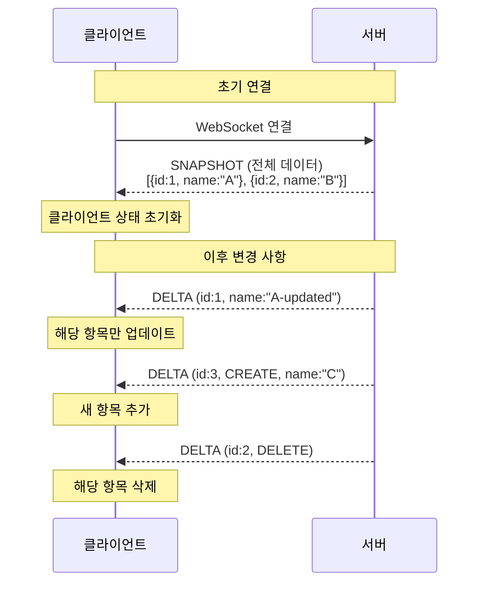
```mermaid
sequenceDiagram
    participant C as 클라이언트
    participant S as 서버

    Note over C,S: 초기 연결
    C->>S: WebSocket 연결
    S-->>C: SNAPSHOT (전체 데이터)<br/>[{id:1, name:"A"}, {id:2, name:"B"}]

    Note over C: 클라이언트 상태 초기화

    Note over C,S: 이후 변경 사항
    S-->>C: DELTA (id:1, name:"A-updated")
    Note over C: 해당 항목만 업데이트

    S-->>C: DELTA (id:3, CREATE, name:"C")
    Note over C: 새 항목 추가

    S-->>C: DELTA (id:2, DELETE)
    Note over C: 해당 항목 삭제
```

### SNAPSHOT만 사용할 때의 문제점

**매번 전체 데이터를 전송하면:**

1. **네트워크 대역폭 낭비**: 1000개 항목 중 1개만 변경되어도 1000개 전체 전송
2. **처리 비용 증가**: 클라이언트가 매번 전체 상태를 재구성
3. **불필요한 리렌더링**: 변경 없는 컴포넌트도 다시 렌더링
4. **서버 부하**: 많은 클라이언트에게 대량 데이터 지속 전송

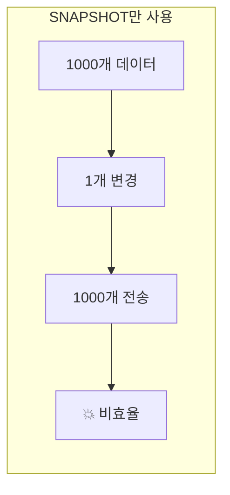
```mermaid
flowchart LR
    subgraph Problem["SNAPSHOT만 사용"]
        S1["1000개 데이터"]
        S2["1개 변경"]
        S3["1000개 전송"]
        S4["💥 비효율"]

        S1 --> S2 --> S3 --> S4
    end
```

### DELTA만 사용할 때의 문제점

**변경분만 전송하면:**

1. **초기 상태 부재**: 연결 시 클라이언트는 현재 상태를 모름
2. **재연결 문제**: 연결이 끊겼다 다시 연결되면 중간 변경 사항 누락
3. **순서 문제**: DELTA 메시지가 순서대로 도착하지 않으면 상태 불일치
4. **누락 문제**: 하나의 DELTA가 누락되면 이후 모든 상태가 틀어짐

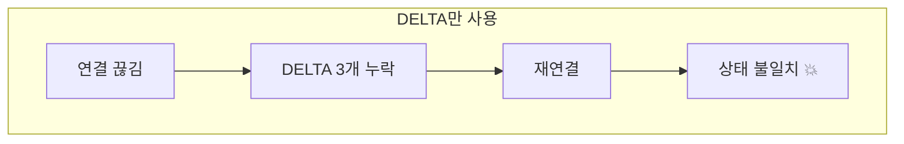
```mermaid
flowchart TD
    subgraph DeltaOnly["DELTA만 사용"]
        D1["연결 끊김"]
        D2["DELTA 3개 누락"]
        D3["재연결"]
        D4["상태 불일치 💥"]

        D1 --> D2 --> D3 --> D4
    end
```

### 적절한 사용 시점

**SNAPSHOT 전송 시점:**
- 초기 연결 시 (클라이언트가 상태를 모르므로)
- 재연결 시 (중간 변경 사항 누락 가능성)
- 클라이언트가 명시적으로 요청할 때
- 오류 복구 시 (상태 불일치 감지)
- 버전 갭이 큰 경우 (DELTA로 따라잡기 어려움)

**DELTA 전송 시점:**
- 개별 항목 생성/수정/삭제 시
- 실시간 업데이트가 필요한 경우
- 연결이 안정적인 상태에서

### 결합 패턴

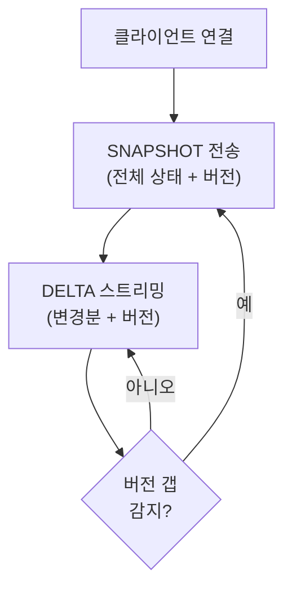
```mermaid
flowchart TD
    START["클라이언트 연결"]
    START --> SNAPSHOT["SNAPSHOT 전송<br/>(전체 상태 + 버전)"]
    SNAPSHOT --> DELTA["DELTA 스트리밍<br/>(변경분 + 버전)"]

    DELTA --> CHECK{"버전 갭<br/>감지?"}
    CHECK -->|"예"| SNAPSHOT
    CHECK -->|"아니오"| DELTA
```

---

## A2. 상태 동기화 전략

### DELTA 적용 시 고려사항

#### 1. 순서 문제 (버전 관리)

**네트워크 특성상 메시지가 순서대로 도착하지 않을 수 있습니다.** 버전 번호로 순서를 보장해야 합니다.

```typescript
interface BaseMessage {
  version: number;  // 서버의 현재 상태 버전
}

interface SnapshotMessage extends BaseMessage {
  type: 'SNAPSHOT';
  data: Item[];
}

interface DeltaMessage extends BaseMessage {
  type: 'DELTA';
  action: 'CREATE' | 'UPDATE' | 'DELETE';
  data: Item | Partial<Item>;
}

// 클라이언트 측 버전 관리
let clientVersion = 0;

function handleMessage(message: SnapshotMessage | DeltaMessage) {
  // 오래된 메시지 무시
  if (message.version <= clientVersion) {
    console.log('오래된 메시지 무시:', message.version);
    return;
  }

  // 메시지 처리
  processMessage(message);
  clientVersion = message.version;
}
```

#### 2. 누락 처리 (버전 갭 감지)

```typescript
function handleDelta(delta: DeltaMessage) {
  const expectedVersion = clientVersion + 1;

  // 버전 갭 감지 - DELTA가 누락됨
  if (delta.version > expectedVersion) {
    console.warn(`버전 갭 감지: ${clientVersion} → ${delta.version}`);
    requestSnapshot();  // SNAPSHOT 재요청
    return;
  }

  // 정상 처리
  applyDelta(delta);
  clientVersion = delta.version;
}

function requestSnapshot() {
  sendMessage(JSON.stringify({ type: 'REQUEST_SNAPSHOT' }));
}
```

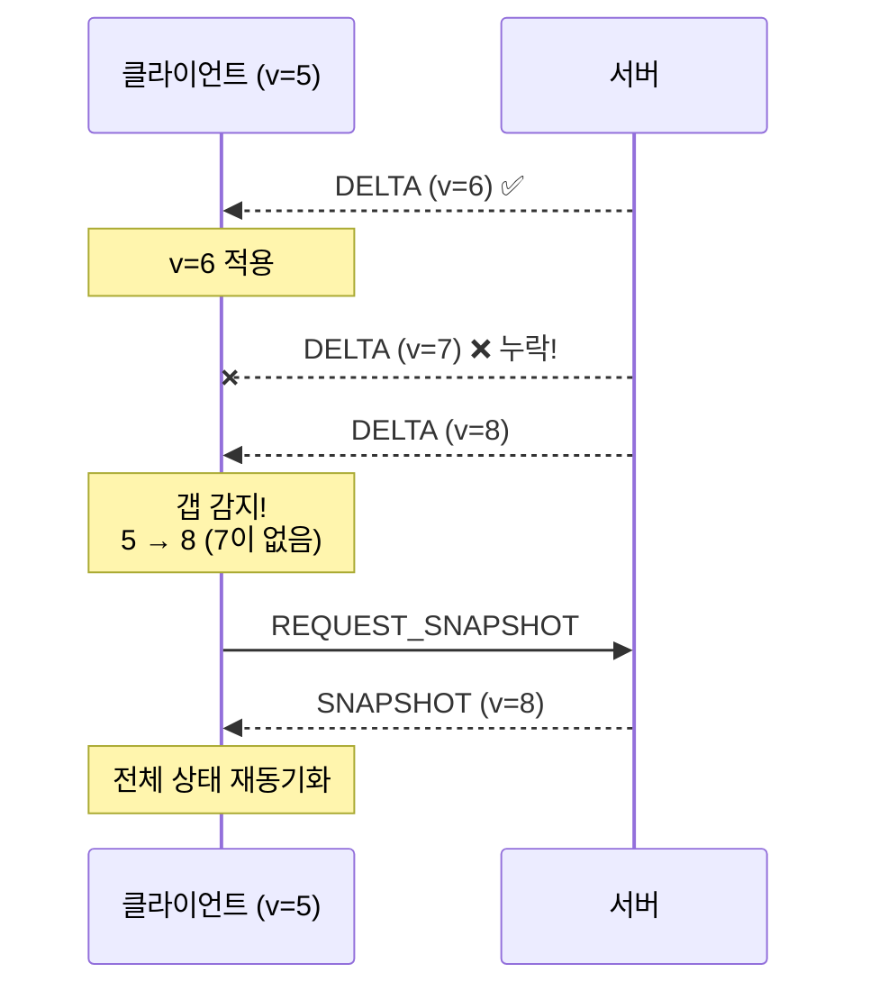
```mermaid
sequenceDiagram
    participant C as 클라이언트 (v=5)
    participant S as 서버

    S-->>C: DELTA (v=6) ✅
    Note over C: v=6 적용

    S--xC: DELTA (v=7) ❌ 누락!

    S-->>C: DELTA (v=8)
    Note over C: 갭 감지!<br/>5 → 8 (7이 없음)

    C->>S: REQUEST_SNAPSHOT
    S-->>C: SNAPSHOT (v=8)
    Note over C: 전체 상태 재동기화
```

#### 3. 존재하지 않는 항목에 대한 DELTA

**DELTA 적용 대상이 로컬에 없을 때:**

```typescript
function applyDelta(delta: DeltaMessage) {
  switch (delta.action) {
    case 'UPDATE':
      const target = items.find(item => item.id === delta.data.id);

      if (!target) {
        // 존재하지 않는 항목 업데이트 시도
        // 옵션 1: 무시 (상태 불일치 가능성)
        // 옵션 2: SNAPSHOT 재요청 (권장)
        console.warn('존재하지 않는 항목 업데이트:', delta.data.id);
        requestSnapshot();
        return;
      }

      // 정상 업데이트
      Object.assign(target, delta.data);
      break;

    case 'CREATE':
      items.push(delta.data as Item);
      break;

    case 'DELETE':
      const index = items.findIndex(item => item.id === delta.data.id);
      if (index !== -1) {
        items.splice(index, 1);
      }
      // DELETE는 이미 없어도 문제없음 (멱등성)
      break;
  }
}
```

---

## A3. 메시지 타입 설계

> ⚠️ **중요**: 이 섹션에서 설명하는 메시지 타입(SNAPSHOT, DELTA, ACK 등)은 **WebSocket 표준이 아닌 설계 패턴**입니다. WebSocket 프로토콜(RFC 6455)은 메시지 내용의 형식을 정의하지 않으며, 단순히 양방향 바이트 스트림만 제공합니다. 여기서 소개하는 패턴은 실시간 데이터 동기화에서 널리 사용되는 검증된 설계 방식이지만, **프로젝트 요구사항에 맞게 자유롭게 커스텀할 수 있습니다.**

### 표준 vs 설계 패턴

```
WebSocket 표준 (RFC 6455)이 정의하는 것:
├── 프레임 타입: text, binary, ping, pong, close
├── 핸드셰이크 방식 (HTTP Upgrade)
└── 연결 유지 메커니즘

WebSocket 표준이 정의하지 않는 것:
├── 메시지 내용의 형식 (JSON, Protobuf 등)
├── 메시지 타입 이름 (SNAPSHOT, DELTA 등)
└── 데이터 동기화 방식
```

**다른 라이브러리/프레임워크의 명명 예시:**

| 라이브러리 | 전체 상태 | 변경분 | 응답 확인 |
|-----------|----------|--------|----------|
| **이 문서** | SNAPSHOT | DELTA | ACK |
| Socket.IO | `sync:full` | `sync:patch` | callback |
| Phoenix | `presence_state` | `presence_diff` | `phx_reply` |
| GraphQL Sub | `data` | `data` | `complete` |
| 도메인 중심 | `ORDER_LIST` | `ORDER_UPDATED` | `ORDER_ACK` |

**결론**: 메시지 타입 이름과 구조는 팀/프로젝트에서 자유롭게 정의합니다. 이 문서의 패턴을 따르면 검증된 방식으로 엣지 케이스(버전 갭, 롤백 등)를 처리할 수 있고, 다른 개발자와 공통 어휘로 소통할 수 있습니다.

---

### 왜 메시지 타입을 체계적으로 설계해야 하는가?

**WebSocket은 HTTP와 달리 "요청-응답" 쌍이 자동으로 매칭되지 않습니다.** 양방향으로 메시지가 자유롭게 오가기 때문에, 각 메시지가 무엇인지, 어떤 요청에 대한 응답인지를 명시적으로 구분해야 합니다.

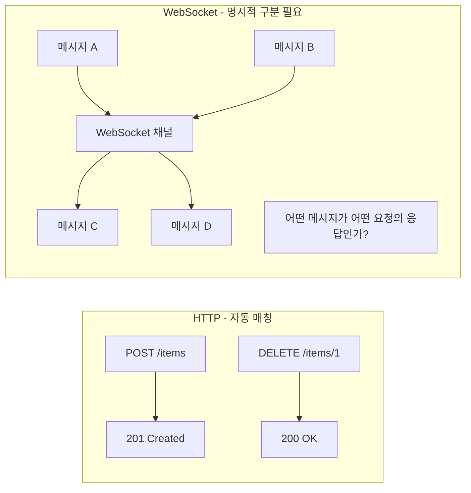
```mermaid
flowchart LR
    subgraph HTTP["HTTP - 자동 매칭"]
        H1["POST /items"] --> H2["201 Created"]
        H3["DELETE /items/1"] --> H4["200 OK"]
    end

    subgraph WS["WebSocket - 명시적 구분 필요"]
        W1["메시지 A"] --> WS_CH["WebSocket 채널"]
        W2["메시지 B"] --> WS_CH
        WS_CH --> W3["메시지 C"]
        WS_CH --> W4["메시지 D"]
        Note["어떤 메시지가 어떤 요청의 응답인가?"]
    end
```

**메시지 타입 설계의 목표:**
1. **명확한 의도 전달**: 이 메시지가 무엇을 하려는 건지 즉시 파악
2. **요청-응답 추적**: `requestId`로 어떤 요청에 대한 응답인지 매칭
3. **확장 가능성**: 새 메시지 타입을 추가해도 기존 로직에 영향 없음
4. **타입 안전성**: TypeScript로 컴파일 타임에 메시지 형식 검증

---

### 메시지 분류 체계

#### 방향에 따른 분류

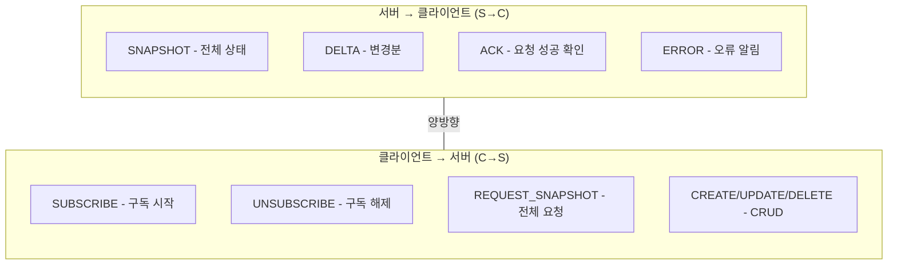
```mermaid
flowchart TB
    subgraph ServerToClient["서버 → 클라이언트 (S→C)"]
        direction TB
        S1["SNAPSHOT - 전체 상태"]
        S2["DELTA - 변경분"]
        S3["ACK - 요청 성공 확인"]
        S4["ERROR - 오류 알림"]
    end

    subgraph ClientToServer["클라이언트 → 서버 (C→S)"]
        direction TB
        C1["SUBSCRIBE - 구독 시작"]
        C2["UNSUBSCRIBE - 구독 해제"]
        C3["REQUEST_SNAPSHOT - 전체 요청"]
        C4["CREATE/UPDATE/DELETE - CRUD"]
    end

    ServerToClient ---|"양방향"| ClientToServer
```

#### 목적에 따른 분류

| 목적 | 메시지 타입 | 설명 |
|------|------------|------|
| **상태 동기화** | SNAPSHOT, DELTA | 클라이언트 상태를 서버와 동기화 |
| **구독 관리** | SUBSCRIBE, UNSUBSCRIBE | 관심 있는 데이터 범위 지정 |
| **데이터 조작** | CREATE, UPDATE, DELETE | 서버 데이터 변경 요청 |
| **응답/확인** | ACK, ERROR | 요청 처리 결과 알림 |

---

### 기본 메시지 타입 상세

| 타입 | 방향 | 설명 | 사용 시점 |
|------|:----:|------|----------|
| **SNAPSHOT** | S→C | 전체 상태 전송 | 초기 연결, 재연결, 버전 갭 복구 |
| **DELTA** | S→C | 개별 변경 전송 | 실시간 업데이트 |
| **ACK** | S→C | 요청 처리 확인 | 클라이언트 요청 성공 시 |
| **ERROR** | S→C | 오류 발생 알림 | 권한 없음, 유효성 실패, 서버 오류 |
| **SUBSCRIBE** | C→S | 구독 시작 | 특정 채널/리소스 실시간 업데이트 수신 원할 때 |
| **UNSUBSCRIBE** | C→S | 구독 해제 | 더 이상 업데이트 수신 불필요할 때 |
| **REQUEST_SNAPSHOT** | C→S | 전체 상태 요청 | 상태 불일치 감지 시 명시적 재요청 |
| **CREATE** | C→S | 새 항목 생성 | 사용자가 새 데이터 생성 |
| **UPDATE** | C→S | 기존 항목 수정 | 사용자가 데이터 수정 |
| **DELETE** | C→S | 항목 삭제 | 사용자가 데이터 삭제 |

---

### 각 메시지 타입 상세 설명

#### 1. SNAPSHOT (서버 → 클라이언트)

**목적**: 클라이언트의 로컬 상태를 서버의 현재 상태로 완전히 교체

```typescript
interface SnapshotMessage {
  type: 'SNAPSHOT';
  version: number;      // 서버 상태의 버전 (시퀀스 번호)
  data: Item[];         // 전체 데이터
  timestamp: number;    // 서버 시간 (선택적)
}

// 예시
{
  "type": "SNAPSHOT",
  "version": 42,
  "data": [
    { "id": "item-1", "name": "항목 A", "status": "active" },
    { "id": "item-2", "name": "항목 B", "status": "inactive" }
  ],
  "timestamp": 1706600000000
}
```

**전송 시점:**
- 클라이언트 최초 연결 시
- 재연결 시 (연결이 끊겼다 다시 연결)
- 클라이언트가 `REQUEST_SNAPSHOT` 요청 시
- 버전 갭이 너무 커서 DELTA로 복구 불가능할 때

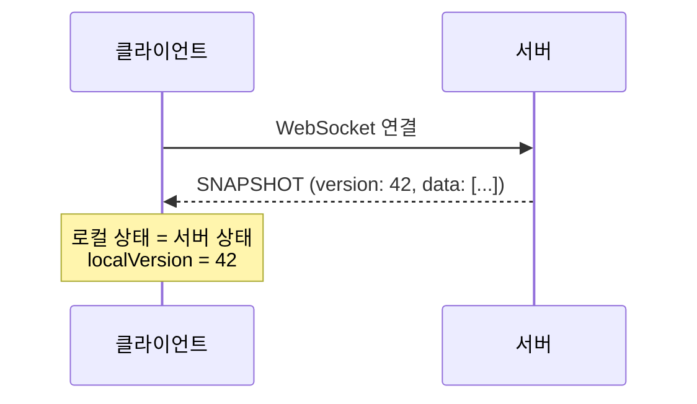
```mermaid
sequenceDiagram
    participant C as 클라이언트
    participant S as 서버

    C->>S: WebSocket 연결
    S-->>C: SNAPSHOT (version: 42, data: [...])
    Note over C: 로컬 상태 = 서버 상태<br/>localVersion = 42
```

---

#### 2. DELTA (서버 → 클라이언트)

**목적**: 변경된 항목만 전송하여 네트워크 대역폭 절약

```typescript
interface DeltaMessage {
  type: 'DELTA';
  version: number;                    // 변경 후 버전
  action: 'CREATE' | 'UPDATE' | 'DELETE';
  data: Item | PartialItem;           // CREATE/DELETE는 전체, UPDATE는 변경분만
}

// 예시: 항목 생성
{
  "type": "DELTA",
  "version": 43,
  "action": "CREATE",
  "data": { "id": "item-3", "name": "새 항목", "status": "active" }
}

// 예시: 항목 수정 (변경된 필드만)
{
  "type": "DELTA",
  "version": 44,
  "action": "UPDATE",
  "data": { "id": "item-1", "name": "수정된 이름" }
}

// 예시: 항목 삭제
{
  "type": "DELTA",
  "version": 45,
  "action": "DELETE",
  "data": { "id": "item-2" }
}
```

**action별 data 형식:**

| action | data 내용 | 클라이언트 처리 |
|--------|----------|----------------|
| `CREATE` | 전체 Item | 로컬 배열에 추가 |
| `UPDATE` | id + 변경된 필드만 | 해당 항목 병합 |
| `DELETE` | id만 | 해당 항목 제거 |

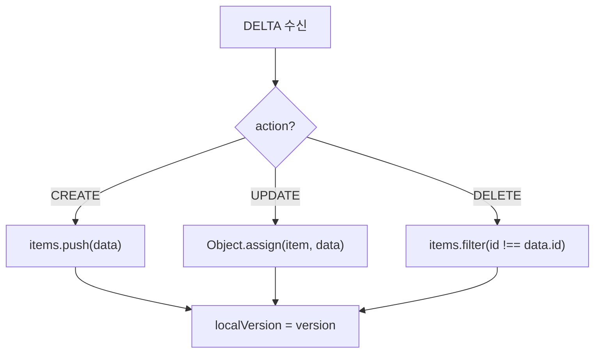
```mermaid
flowchart TD
    DELTA["DELTA 수신"]
    DELTA --> ACTION{action?}

    ACTION -->|"CREATE"| ADD["items.push(data)"]
    ACTION -->|"UPDATE"| MERGE["Object.assign(item, data)"]
    ACTION -->|"DELETE"| REMOVE["items.filter(id !== data.id)"]

    ADD --> UPDATE_VER["localVersion = version"]
    MERGE --> UPDATE_VER
    REMOVE --> UPDATE_VER
```

---

#### 3. ACK (서버 → 클라이언트)

**목적**: 클라이언트 요청이 성공적으로 처리되었음을 확인

```typescript
interface AckMessage {
  type: 'ACK';
  requestId: string;    // 클라이언트가 보낸 요청 ID
  success: true;
  data?: any;           // 추가 정보 (생성된 ID 등)
}

// 예시: CREATE 요청 성공
{
  "type": "ACK",
  "requestId": "req-abc123",
  "success": true,
  "data": { "id": "item-new-456" }  // 서버가 생성한 ID
}
```

**requestId의 중요성:**

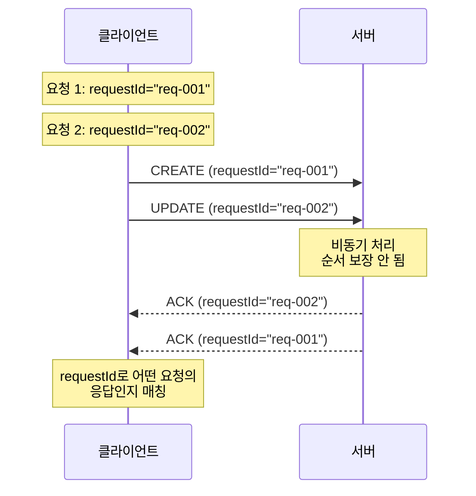
```mermaid
sequenceDiagram
    participant C as 클라이언트
    participant S as 서버

    Note over C: 요청 1: requestId="req-001"
    Note over C: 요청 2: requestId="req-002"
    C->>S: CREATE (requestId="req-001")
    C->>S: UPDATE (requestId="req-002")

    Note over S: 비동기 처리<br/>순서 보장 안 됨

    S-->>C: ACK (requestId="req-002")
    S-->>C: ACK (requestId="req-001")

    Note over C: requestId로 어떤 요청의<br/>응답인지 매칭
```

**requestId 생성 방법:**

클라이언트가 요청을 보낼 때 고유한 ID를 직접 생성해야 합니다.

```typescript
// ✅ 방법 1: 브라우저 내장 (권장)
const requestId = crypto.randomUUID();
// 결과: "550e8400-e29b-41d4-a716-446655440000"

// ✅ 방법 2: nanoid 라이브러리 (짧은 ID)
import { nanoid } from 'nanoid';
const requestId = nanoid();      // "V1StGXR8_Z5jdHi6B-myT" (21자)
const requestId = nanoid(10);    // "IRFa-VaY2b" (길이 지정)

// ✅ 방법 3: 직접 구현 (타임스탬프 + 랜덤)
function generateRequestId(): string {
  return `${Date.now()}-${Math.random().toString(36).slice(2, 9)}`;
}
// 결과: "1706600000000-k8f3j2m"
```

| 방법 | 장점 | 단점 | 추천 상황 |
|------|------|------|----------|
| `crypto.randomUUID()` | 내장, 표준, 충돌 없음 | 길이 36자 | 대부분의 경우 ✅ |
| `nanoid` | 짧고 빠름, URL 안전 | 설치 필요 | 짧은 ID 필요 시 |
| 타임스탬프+랜덤 | 의존성 없음, 디버깅 용이 | 충돌 가능성 낮음 | 간단한 프로젝트 |

**실무 권장 패턴:**

```typescript
// utils/generateId.ts
export function generateRequestId(): string {
  if (typeof crypto !== 'undefined' && crypto.randomUUID) {
    return crypto.randomUUID();
  }
  // 폴백: 타임스탬프 + 랜덤
  return `${Date.now()}-${Math.random().toString(36).slice(2, 11)}`;
}

// 사용 예시
import { generateRequestId } from './utils/generateId';

function createItem(name: string) {
  const requestId = generateRequestId();

  sendMessage({
    type: 'CREATE',
    requestId,  // 클라이언트가 생성한 ID
    data: { name }
  });

  // 이 requestId로 ACK 응답 매칭
  pendingRequests.set(requestId, { /* ... */ });
}
```

**왜 ACK가 필요한가?**
- **낙관적 업데이트 확정**: UI를 먼저 업데이트한 후, ACK로 성공 확인
- **요청 추적**: 여러 요청이 동시에 진행될 때 각각의 결과 추적
- **타임아웃 처리**: ACK가 오지 않으면 요청 실패로 간주

---

#### ACK가 정말 필요한가? (솔직한 정리)

**단순한 앱에서는 DELTA만으로 충분합니다.** ACK는 엣지 케이스 대응용입니다.

**DELTA만으로 안 되는 상황:**

**1. 실패 시 알 수 없음**

```
DELTA만 있을 때:
클라이언트: CREATE 요청
...3초 후...
클라이언트: DELTA가 안 왔네?
          → 실패? 네트워크 지연? 서버가 아직 처리 중?
          → 얼마나 더 기다려야 하지?

ACK가 있을 때:
클라이언트: CREATE 요청
서버: ACK { success: false, error: "권한 없음" }
클라이언트: 아, 실패구나. 바로 롤백.
```

**2. 동시 요청 구분 불가**

```typescript
// 빠르게 2개 생성
createItem("A");  // requestId="001"
createItem("B");  // requestId="002"

// DELTA 2개 도착
DELTA: { id: "item-99", name: "A" }
DELTA: { id: "item-100", name: "B" }

// 문제: 어떤 DELTA가 어떤 요청의 결과인지?
// name으로 매칭? → name이 같으면? 수정 요청이면?

// ACK가 있으면:
ACK: { requestId: "002", data: { id: "item-100" } }  // B의 결과
ACK: { requestId: "001", data: { id: "item-99" } }   // A의 결과
// → 정확히 매칭 가능
```

**3. 다른 사용자 변경과 구분 불가**

```
나: CREATE "회의록" 요청
동시에 다른 사람도: CREATE "회의록" 요청

DELTA: { id: "item-50", name: "회의록" }
DELTA: { id: "item-51", name: "회의록" }

→ 둘 중 어떤 게 내 요청 결과? (ACK 없으면 구분 불가)
```

**ACK 필요 여부 판단:**

| 상황 | ACK 필요? | 이유 |
|------|:---------:|------|
| 한 번에 하나씩 요청 | ❌ | DELTA만으로 충분 |
| 낙관적 업데이트 안 씀 | ❌ | 서버 응답 기다리면 됨 |
| 동시에 여러 요청 | ✅ | 요청-응답 매칭 필요 |
| 에러 처리 중요 | ✅ | 실패 시 명확한 알림 필요 |
| 타임아웃 처리 필요 | ✅ | 응답 없음 vs 실패 구분 |

**결론:**
- **단순한 앱**: DELTA만으로 OK
- **복잡한 앱**: ACK 필요 (동시 요청, 에러 처리, 타임아웃)

ACK는 "필수"가 아니라 **"엣지 케이스 대응용"**입니다. 프로젝트 복잡도에 따라 선택하면 됩니다.

---

#### ACK vs DELTA/SNAPSHOT 핵심 차이

**ACK와 DELTA는 서로 다른 목적을 가진 별개의 메시지입니다.** ACK는 요청자에게만 전송되는 "확인" 메시지이고, DELTA/SNAPSHOT은 모든 구독자에게 브로드캐스트되는 "상태 동기화" 메시지입니다.

| 구분 | ACK | DELTA/SNAPSHOT |
|------|-----|----------------|
| **수신 대상** | 요청자만 (1:1) | 모든 구독자 (브로드캐스트) |
| **목적** | 요청 성공/실패 확인 | 상태 동기화 |
| **requestId** | 있음 (요청 매칭용) | 없음 |
| **실패 시** | 전송됨 (success: false) | 전송 안 됨 |
| **요청 결과 정보** | 포함 (생성된 ID 등) | 포함하지만 요청과 매칭 어려움 |

---

#### ACK와 DELTA의 관계

**질문: ACK는 DELTA와 같이 오는 건가요?**

**네, 성공한 요청의 경우 ACK와 DELTA가 같이 옵니다.** 하지만 둘은 별개의 메시지로, 역할이 다릅니다.

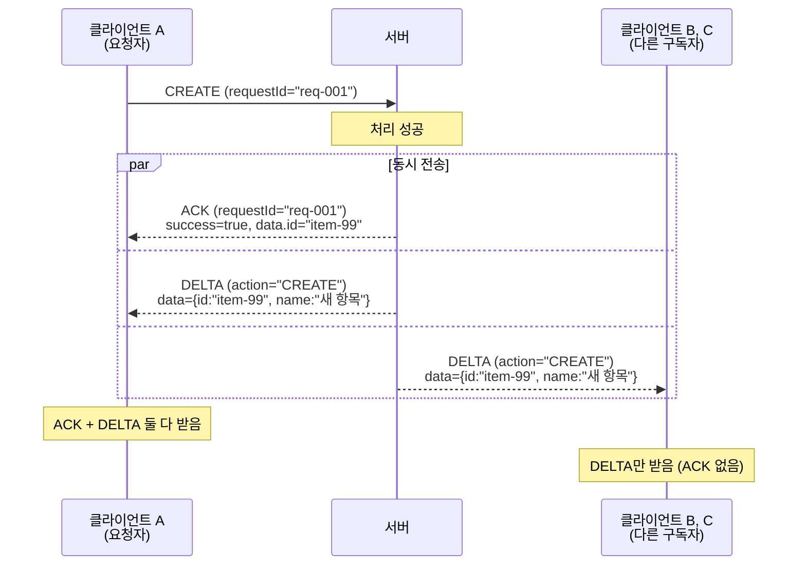
```mermaid
sequenceDiagram
    participant A as 클라이언트 A<br/>(요청자)
    participant S as 서버
    participant B as 클라이언트 B, C<br/>(다른 구독자)

    A->>S: CREATE (requestId="req-001")

    Note over S: 처리 성공

    par 동시 전송
        S-->>A: ACK (requestId="req-001")<br/>success=true, data.id="item-99"
    and
        S-->>A: DELTA (action="CREATE")<br/>data={id:"item-99", name:"새 항목"}
    and
        S-->>B: DELTA (action="CREATE")<br/>data={id:"item-99", name:"새 항목"}
    end

    Note over A: ACK + DELTA 둘 다 받음
    Note over B: DELTA만 받음 (ACK 없음)
```

**시나리오별 정리:**

| 시나리오 | ACK | DELTA | 설명 |
|----------|:---:|:-----:|------|
| **내 요청 성공** | ✅ 받음 | ✅ 받음 | ACK로 성공 확인, DELTA로 상태 동기화 |
| **내 요청 실패** | ✅ 받음 (success=false) | ❌ 안 옴 | 변경이 없으므로 DELTA 없음 |
| **다른 사람 요청 성공** | ❌ 안 받음 | ✅ 받음 | 내 요청이 아니므로 ACK 없음 |

---

#### 왜 ACK와 DELTA 둘 다 필요한가?

**1. DELTA만 있으면?**

```typescript
// 문제 1: 실패 시 알 수 없음
클라이언트: CREATE 요청 전송
...5초 후...
클라이언트: DELTA가 안 왔네?
          → 실패인가? 네트워크 지연인가? 서버가 아직 처리 중인가?

// 문제 2: 동시 요청 구분 불가
A: CREATE item1 (requestId="001")
A: CREATE item2 (requestId="002")
// DELTA 2개 도착
DELTA: item-99 추가됨  → item1? item2? 구분 불가
DELTA: item-100 추가됨 → item1? item2?
```

**2. ACK만 있으면?**

```typescript
// 문제: 다른 사용자의 변경을 모름
클라이언트 B가 항목 생성 → 서버가 B에게만 ACK
클라이언트 A: 새 항목이 생긴 줄 모름 → 상태 불일치
```

**3. 둘 다 있으면?**

```typescript
// ACK 역할: "네 요청 처리 완료" (요청자 전용, 1:1)
// DELTA 역할: "상태가 바뀌었어" (모든 구독자, 브로드캐스트)

// 실패 처리
서버: ACK { requestId: "001", success: false, error: "권한 없음" }
클라이언트: 아, 실패구나. 롤백하자.

// 요청 결과 매칭
서버: ACK { requestId: "002", success: true, data: { id: "item-99" } }
클라이언트: req-002로 생성한 항목의 ID가 item-99구나!

// 다른 사용자 변경 감지
서버 → 모든 구독자: DELTA { action: "CREATE", data: { id: "item-100" } }
클라이언트 A: 누군가 새 항목을 만들었네, UI 업데이트하자.
```

---

#### 실무 처리 패턴

```typescript
// 요청 → ACK/DELTA 처리 흐름
const pendingRequests = new Map<string, PendingRequest>();

function createItem(name: string) {
  const requestId = generateId();

  // 1. 낙관적 업데이트 (DELTA 도착 전 UI 먼저 반영)
  const tempItem = { id: `temp-${requestId}`, name };
  items.push(tempItem);

  // 2. pending 상태 저장
  pendingRequests.set(requestId, { tempItem, timestamp: Date.now() });

  // 3. 서버 요청
  sendMessage({ type: 'CREATE', requestId, data: { name } });
}

function handleAck(ack: AckMessage) {
  const pending = pendingRequests.get(ack.requestId);
  if (!pending) return;

  if (ack.success) {
    // 성공: 임시 ID를 서버가 부여한 ID로 교체
    pending.tempItem.id = ack.data.id;
    pendingRequests.delete(ack.requestId);
  } else {
    // 실패: 롤백
    items = items.filter(i => i !== pending.tempItem);
    pendingRequests.delete(ack.requestId);
    showError('생성 실패');
  }
}

function handleDelta(delta: DeltaMessage) {
  // 내 요청으로 인한 DELTA인지 확인
  const isMyRequest = Array.from(pendingRequests.values())
    .some(p => p.tempItem.name === delta.data.name);

  if (isMyRequest) {
    // ACK가 먼저 처리했으면 무시 (이미 반영됨)
    // ACK가 아직 안 왔으면 DELTA로 반영
    return;
  }

  // 다른 사용자의 변경 → 상태에 반영
  applyDelta(delta);
}
```

---

#### 서버는 어떻게 ACK를 요청자에게만 보내는가?

**"1대 100 연결인데 어떻게 특정 클라이언트에게만?"**

**핵심: 각 WebSocket 연결은 서버 입장에서 독립적인 세션입니다.** 100명이 연결해도 서버는 100개의 개별 연결 객체를 관리합니다.

```
┌─────────────────────────────────────────────────────┐
│                    WebSocket 서버                    │
├─────────────────────────────────────────────────────┤
│  connections = Map<connectionId, WebSocket>         │
│                                                     │
│  conn-001 ←──────── 클라이언트 A                    │
│  conn-002 ←──────── 클라이언트 B  ← 요청 보냄       │
│  conn-003 ←──────── 클라이언트 C                    │
│  ...                                                │
└─────────────────────────────────────────────────────┘

서버가 메시지를 받을 때, 어떤 연결에서 왔는지 이미 알고 있음
→ 그 연결에만 ACK 전송 가능
```

**전송 방식 비교:**

| 전송 방식 | 방법 | 용도 |
|----------|------|------|
| **유니캐스트** | `ws.send()` (요청 받은 연결) | ACK, ERROR |
| **브로드캐스트** | `connections.forEach(c => c.send())` | DELTA |
| **멀티캐스트** | 특정 채널 구독자만 순회 | 채널별 DELTA |

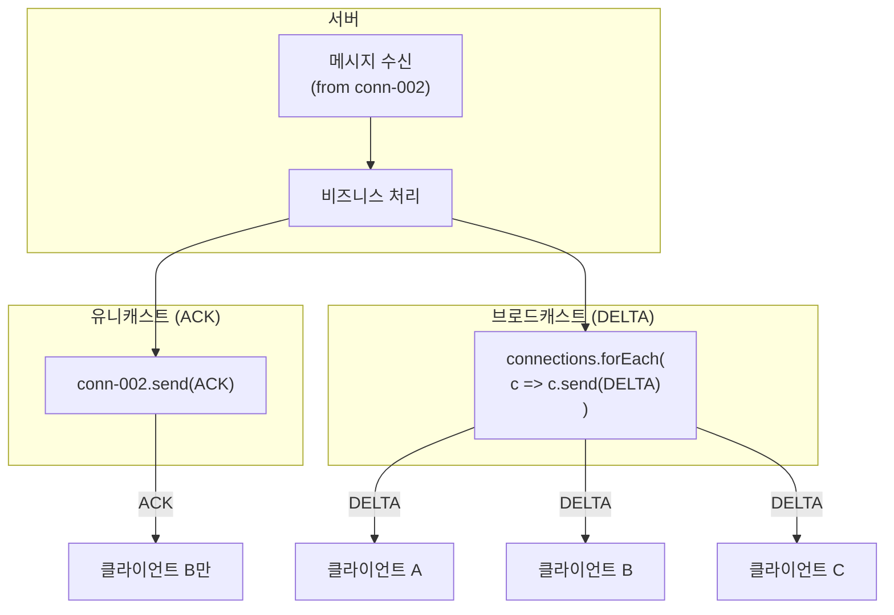
```mermaid
flowchart TB
    subgraph Server["서버"]
        MSG["메시지 수신<br/>(from conn-002)"]
        PROCESS["비즈니스 처리"]
    end

    subgraph Unicast["유니캐스트 (ACK)"]
        ACK["conn-002.send(ACK)"]
    end

    subgraph Broadcast["브로드캐스트 (DELTA)"]
        DELTA["connections.forEach(<br/>  c => c.send(DELTA)<br/>)"]
    end

    MSG --> PROCESS
    PROCESS --> ACK
    PROCESS --> DELTA

    ACK -->|"ACK"| C2["클라이언트 B만"]
    DELTA -->|"DELTA"| C1["클라이언트 A"]
    DELTA -->|"DELTA"| C2B["클라이언트 B"]
    DELTA -->|"DELTA"| C3["클라이언트 C"]
```

**서버 구현 예시 (Go + gorilla/websocket):**

```go
package main

import (
	"encoding/json"
	"net/http"
	"sync"

	"github.com/google/uuid"
	"github.com/gorilla/websocket"
)

// 메시지 타입 정의
type Message struct {
	Type      string          `json:"type"`
	RequestID string          `json:"requestId,omitempty"`
	Action    string          `json:"action,omitempty"`
	Data      json.RawMessage `json:"data,omitempty"`
}

type AckMessage struct {
	Type      string      `json:"type"`
	RequestID string      `json:"requestId"`
	Success   bool        `json:"success"`
	Data      interface{} `json:"data,omitempty"`
}

type DeltaMessage struct {
	Type   string      `json:"type"`
	Action string      `json:"action"`
	Data   interface{} `json:"data"`
}

// 연결 관리
type Hub struct {
	connections map[string]*websocket.Conn
	mu          sync.RWMutex
}

func NewHub() *Hub {
	return &Hub{
		connections: make(map[string]*websocket.Conn),
	}
}

// 연결 추가
func (h *Hub) Add(id string, conn *websocket.Conn) {
	h.mu.Lock()
	defer h.mu.Unlock()
	h.connections[id] = conn
}

// 연결 제거
func (h *Hub) Remove(id string) {
	h.mu.Lock()
	defer h.mu.Unlock()
	delete(h.connections, id)
}

// ✅ 유니캐스트: 특정 연결에만 전송 (ACK)
func (h *Hub) SendTo(id string, message interface{}) error {
	h.mu.RLock()
	conn, exists := h.connections[id]
	h.mu.RUnlock()

	if !exists {
		return nil
	}
	return conn.WriteJSON(message)
}

// ✅ 브로드캐스트: 모든 연결에 전송 (DELTA)
func (h *Hub) Broadcast(message interface{}) {
	h.mu.RLock()
	defer h.mu.RUnlock()

	for _, conn := range h.connections {
		conn.WriteJSON(message)
	}
}

var upgrader = websocket.Upgrader{
	CheckOrigin: func(r *http.Request) bool { return true },
}

var hub = NewHub()

func handleWebSocket(w http.ResponseWriter, r *http.Request) {
	conn, err := upgrader.Upgrade(w, r, nil)
	if err != nil {
		return
	}

	connID := uuid.New().String()
	hub.Add(connID, conn)

	defer func() {
		hub.Remove(connID)
		conn.Close()
	}()

	for {
		var msg Message
		if err := conn.ReadJSON(&msg); err != nil {
			break
		}

		switch msg.Type {
		case "CREATE":
			// 비즈니스 로직 처리
			newItem := map[string]interface{}{
				"id":   uuid.New().String(),
				"name": "새 항목",
			}

			// ✅ ACK: 요청한 연결에만 전송 (유니캐스트)
			hub.SendTo(connID, AckMessage{
				Type:      "ACK",
				RequestID: msg.RequestID,
				Success:   true,
				Data:      map[string]string{"id": newItem["id"].(string)},
			})

			// ✅ DELTA: 모든 연결에 전송 (브로드캐스트)
			hub.Broadcast(DeltaMessage{
				Type:   "DELTA",
				Action: "CREATE",
				Data:   newItem,
			})
		}
	}
}

func main() {
	http.HandleFunc("/ws", handleWebSocket)
	http.ListenAndServe(":8080", nil)
}
```

**핵심 포인트:**

```go
// 메시지 수신 시, 어떤 연결(connID)에서 왔는지 알고 있음
for {
    conn.ReadJSON(&msg)  // conn = 요청을 보낸 연결

    // ACK: 그 연결에만 전송
    hub.SendTo(connID, ackMessage)

    // DELTA: 모든 연결에 전송
    hub.Broadcast(deltaMessage)
}
```

**핵심 정리:**
- 서버는 메시지를 받을 때 **어떤 연결(세션)에서 왔는지 알고 있음**
- `hub.SendTo(connID, msg)` = 해당 연결에만 전송 (ACK)
- `hub.Broadcast(msg)` = 모든 연결에 전송 (DELTA)

---

#### TCP 연결과 소켓 관리 (심화)

**"서버 주소가 하나인데 어떻게 여러 클라이언트를 구분하지?"**

TCP 연결은 4-Tuple(서버IP, 서버Port, 클라이언트IP, 클라이언트Port)로 구분됩니다. 서버 포트는 하나지만, 각 클라이언트의 IP:Port가 다르므로 수천 개의 연결을 동시에 관리할 수 있습니다.

> **상세 내용**: 연결 수립 과정, Listen Socket vs Connection Socket, 패킷 라우팅 등의 자세한 설명은 [01. WebSocket 기초 - A4. TCP 연결과 소켓 관리](../01-basics/LEARN.md#a4-tcp-연결과-소켓-관리)를 참조하세요.

---

#### 4. ERROR (서버 → 클라이언트)

**목적**: 요청 실패 또는 오류 상황을 클라이언트에게 알림

```typescript
interface ErrorMessage {
  type: 'ERROR';
  requestId?: string;   // 특정 요청에 대한 오류면 포함
  code: string;         // 에러 코드 (프로그래밍적 처리용)
  message: string;      // 사람이 읽을 메시지
  details?: any;        // 추가 상세 정보
}

// 예시: 특정 요청 실패
{
  "type": "ERROR",
  "requestId": "req-abc123",
  "code": "VALIDATION_ERROR",
  "message": "이름은 필수 항목입니다.",
  "details": { "field": "name" }
}

// 예시: 전역 오류 (requestId 없음)
{
  "type": "ERROR",
  "code": "UNAUTHORIZED",
  "message": "세션이 만료되었습니다."
}
```

**에러 코드 체계 설계:**

```typescript
// 에러 코드 분류
const ErrorCodes = {
  // 인증/권한 (4xx)
  UNAUTHORIZED: 'UNAUTHORIZED',           // 인증 필요
  FORBIDDEN: 'FORBIDDEN',                 // 권한 없음
  SESSION_EXPIRED: 'SESSION_EXPIRED',     // 세션 만료

  // 유효성 검사 (400)
  VALIDATION_ERROR: 'VALIDATION_ERROR',   // 필드 유효성 실패
  INVALID_FORMAT: 'INVALID_FORMAT',       // 메시지 형식 오류
  MISSING_FIELD: 'MISSING_FIELD',         // 필수 필드 누락

  // 리소스 (404)
  NOT_FOUND: 'NOT_FOUND',                 // 리소스 없음
  ALREADY_EXISTS: 'ALREADY_EXISTS',       // 중복

  // 상태 (409)
  CONFLICT: 'CONFLICT',                   // 충돌 (동시 수정)
  STALE_VERSION: 'STALE_VERSION',         // 버전 불일치

  // 서버 (5xx)
  INTERNAL_ERROR: 'INTERNAL_ERROR',       // 서버 내부 오류
  SERVICE_UNAVAILABLE: 'SERVICE_UNAVAILABLE',
} as const;
```

**에러 처리 흐름:**

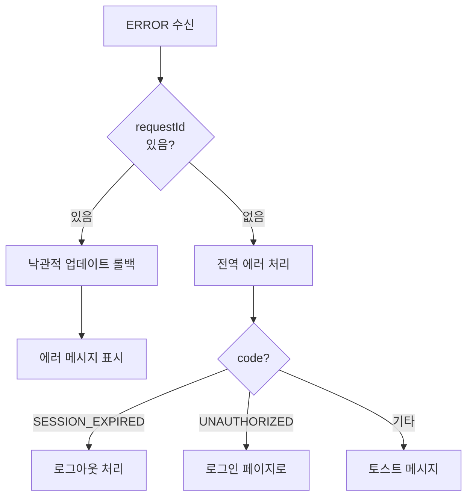
```mermaid
flowchart TD
    ERROR["ERROR 수신"]
    ERROR --> HAS_REQ{requestId<br/>있음?}

    HAS_REQ -->|"있음"| ROLLBACK["낙관적 업데이트 롤백"]
    HAS_REQ -->|"없음"| GLOBAL["전역 에러 처리"]

    ROLLBACK --> SHOW["에러 메시지 표시"]
    GLOBAL --> CHECK{code?}

    CHECK -->|"SESSION_EXPIRED"| LOGOUT["로그아웃 처리"]
    CHECK -->|"UNAUTHORIZED"| LOGIN["로그인 페이지로"]
    CHECK -->|"기타"| TOAST["토스트 메시지"]
```

---

#### 5. SUBSCRIBE / UNSUBSCRIBE (클라이언트 → 서버)

**목적**: 관심 있는 데이터 범위를 지정하여 필요한 업데이트만 수신

```typescript
interface SubscribeMessage {
  type: 'SUBSCRIBE';
  channel: string;      // 구독할 채널/토픽
  params?: any;         // 추가 필터 조건
}

interface UnsubscribeMessage {
  type: 'UNSUBSCRIBE';
  channel: string;
}

// 예시: 특정 채팅방 구독
{ "type": "SUBSCRIBE", "channel": "chat:room-123" }

// 예시: 사용자별 알림 구독
{ "type": "SUBSCRIBE", "channel": "notifications:user-456" }

// 예시: 특정 조건으로 구독
{
  "type": "SUBSCRIBE",
  "channel": "orders",
  "params": { "status": "pending", "region": "KR" }
}
```

**구독 패턴 활용:**

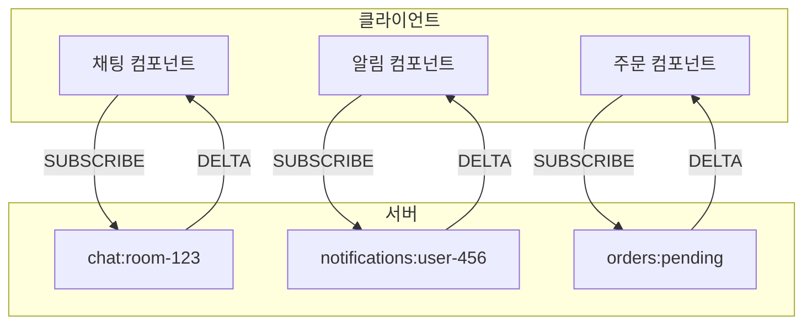
```mermaid
flowchart TB
    subgraph Client["클라이언트"]
        Chat["채팅 컴포넌트"]
        Noti["알림 컴포넌트"]
        Order["주문 컴포넌트"]
    end

    subgraph Server["서버"]
        ChatCh["chat:room-123"]
        NotiCh["notifications:user-456"]
        OrderCh["orders:pending"]
    end

    Chat -->|"SUBSCRIBE"| ChatCh
    Noti -->|"SUBSCRIBE"| NotiCh
    Order -->|"SUBSCRIBE"| OrderCh

    ChatCh -->|"DELTA"| Chat
    NotiCh -->|"DELTA"| Noti
    OrderCh -->|"DELTA"| Order
```

**컴포넌트 마운트/언마운트와 구독:**

```typescript
// React 컴포넌트에서의 구독 관리
function ChatRoom({ roomId }: { roomId: string }) {
  const { sendJsonMessage } = useWebSocket(WS_URL);

  useEffect(() => {
    // 마운트 시 구독
    sendJsonMessage({
      type: 'SUBSCRIBE',
      channel: `chat:${roomId}`,
    });

    // 언마운트 시 구독 해제
    return () => {
      sendJsonMessage({
        type: 'UNSUBSCRIBE',
        channel: `chat:${roomId}`,
      });
    };
  }, [roomId]);

  // ...
}
```

---

#### 6. CREATE / UPDATE / DELETE (클라이언트 → 서버)

**목적**: 서버 데이터 변경 요청 (CRUD)

```typescript
interface CreateMessage {
  type: 'CREATE';
  requestId: string;              // 응답 추적용
  channel?: string;               // 대상 채널 (선택)
  data: Omit<Item, 'id'>;         // id는 서버가 생성
}

interface UpdateMessage {
  type: 'UPDATE';
  requestId: string;
  data: {
    id: string;
    changes: Partial<Item>;       // 변경할 필드만
  };
}

interface DeleteMessage {
  type: 'DELETE';
  requestId: string;
  data: { id: string };
}

// 예시
{ "type": "CREATE", "requestId": "req-001", "data": { "name": "새 항목" } }
{ "type": "UPDATE", "requestId": "req-002", "data": { "id": "item-1", "changes": { "status": "inactive" } } }
{ "type": "DELETE", "requestId": "req-003", "data": { "id": "item-1" } }
```

**요청 → 응답 흐름:**

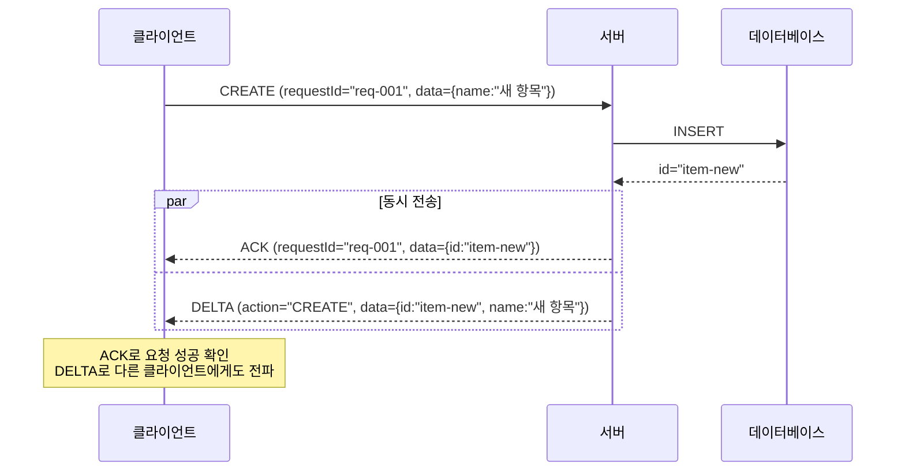
```mermaid
sequenceDiagram
    participant C as 클라이언트
    participant S as 서버
    participant DB as 데이터베이스

    C->>S: CREATE (requestId="req-001", data={name:"새 항목"})

    S->>DB: INSERT
    DB-->>S: id="item-new"

    par 동시 전송
        S-->>C: ACK (requestId="req-001", data={id:"item-new"})
    and
        S-->>C: DELTA (action="CREATE", data={id:"item-new", name:"새 항목"})
    end

    Note over C: ACK로 요청 성공 확인<br/>DELTA로 다른 클라이언트에게도 전파
```

---

### 메시지 스키마 예시 (통합)

```typescript
// ========== 공통 타입 ==========
interface Item {
  id: string;
  name: string;
  status: 'active' | 'inactive';
  updatedAt: number;
}

// ========== 서버 → 클라이언트 ==========
type ServerMessage =
  | {
      type: 'SNAPSHOT';
      version: number;
      data: Item[];
    }
  | {
      type: 'DELTA';
      version: number;
      action: 'CREATE' | 'UPDATE' | 'DELETE';
      data: Item | Partial<Item> & { id: string };
    }
  | {
      type: 'ACK';
      requestId: string;
      success: boolean;
      data?: any;
    }
  | {
      type: 'ERROR';
      requestId?: string;
      code: string;
      message: string;
      details?: any;
    };

// ========== 클라이언트 → 서버 ==========
type ClientMessage =
  | {
      type: 'SUBSCRIBE';
      channel: string;
      params?: Record<string, any>;
    }
  | {
      type: 'UNSUBSCRIBE';
      channel: string;
    }
  | {
      type: 'REQUEST_SNAPSHOT';
      channel?: string;
    }
  | {
      type: 'CREATE';
      requestId: string;
      data: Omit<Item, 'id'>;
    }
  | {
      type: 'UPDATE';
      requestId: string;
      data: { id: string; changes: Partial<Item> };
    }
  | {
      type: 'DELETE';
      requestId: string;
      data: { id: string };
    };
```

---

### 메시지 검증 (런타임)

**TypeScript 타입은 컴파일 타임에만 동작합니다.** 런타임에 외부(서버)에서 오는 메시지를 검증하려면 추가 검증이 필요합니다.

```typescript
// Zod를 사용한 런타임 검증
import { z } from 'zod';

const ItemSchema = z.object({
  id: z.string(),
  name: z.string(),
  status: z.enum(['active', 'inactive']),
  updatedAt: z.number(),
});

const SnapshotSchema = z.object({
  type: z.literal('SNAPSHOT'),
  version: z.number(),
  data: z.array(ItemSchema),
});

const DeltaSchema = z.object({
  type: z.literal('DELTA'),
  version: z.number(),
  action: z.enum(['CREATE', 'UPDATE', 'DELETE']),
  data: ItemSchema.partial().extend({ id: z.string() }),
});

const ServerMessageSchema = z.discriminatedUnion('type', [
  SnapshotSchema,
  DeltaSchema,
  // ... 다른 스키마
]);

// 사용
function handleMessage(raw: string) {
  try {
    const json = JSON.parse(raw);
    const message = ServerMessageSchema.parse(json);  // 검증

    switch (message.type) {
      case 'SNAPSHOT':
        handleSnapshot(message);  // 타입 안전!
        break;
      case 'DELTA':
        handleDelta(message);
        break;
    }
  } catch (error) {
    console.error('메시지 파싱/검증 실패:', error);
  }
}
```

---

### 메시지 처리 흐름

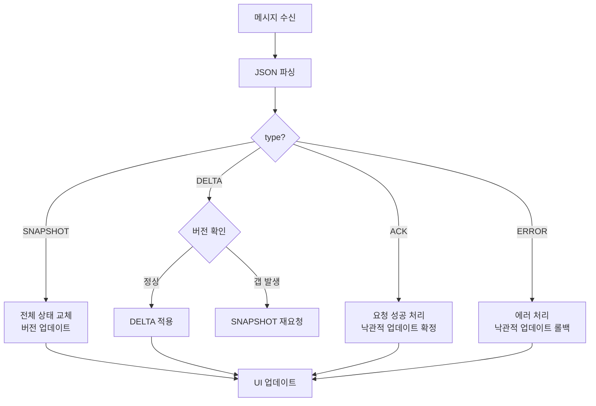
```mermaid
flowchart TD
    MSG["메시지 수신"]
    MSG --> PARSE["JSON 파싱"]
    PARSE --> TYPE{type?}

    TYPE -->|"SNAPSHOT"| SNAP["전체 상태 교체<br/>버전 업데이트"]
    TYPE -->|"DELTA"| CHECK_VER{"버전 확인"}
    TYPE -->|"ACK"| ACK["요청 성공 처리<br/>낙관적 업데이트 확정"]
    TYPE -->|"ERROR"| ERR["에러 처리<br/>낙관적 업데이트 롤백"]

    CHECK_VER -->|"정상"| APPLY["DELTA 적용"]
    CHECK_VER -->|"갭 발생"| REQ_SNAP["SNAPSHOT 재요청"]

    SNAP --> RENDER["UI 업데이트"]
    APPLY --> RENDER
    ACK --> RENDER
    ERR --> RENDER
```

---

## A4. 낙관적 업데이트

### 낙관적 업데이트란?

**낙관적 업데이트(Optimistic Update)는 서버 응답을 기다리지 않고 UI를 먼저 업데이트하는 패턴입니다.** 사용자 경험을 향상시키지만, 실패 시 롤백이 필요합니다.

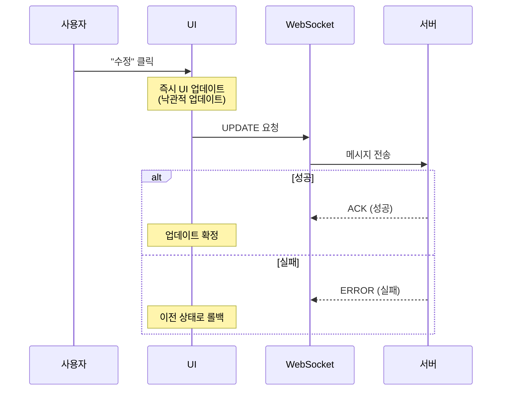
```mermaid
sequenceDiagram
    participant U as 사용자
    participant UI as UI
    participant WS as WebSocket
    participant S as 서버

    U->>UI: "수정" 클릭
    Note over UI: 즉시 UI 업데이트<br/>(낙관적 업데이트)
    UI->>WS: UPDATE 요청
    WS->>S: 메시지 전송

    alt 성공
        S-->>WS: ACK (성공)
        Note over UI: 업데이트 확정
    else 실패
        S-->>WS: ERROR (실패)
        Note over UI: 이전 상태로 롤백
    end
```

### 장단점

| 장점 | 단점 |
|------|------|
| 즉각적인 UI 반응 (지연 없음) | 롤백 로직 필요 |
| 사용자 경험 향상 | 상태 불일치 가능성 |
| 오프라인 지원 용이 | 복잡한 상태 관리 |
| 체감 속도 빠름 | 실패 시 UX 혼란 가능 |

### WebSocket에서의 적용

**HTTP vs WebSocket 낙관적 업데이트 차이:**

| 측면 | HTTP | WebSocket |
|------|------|-----------|
| 응답 확인 | Response로 명확함 | ACK 메시지 필요 |
| 롤백 트리거 | catch 블록 | ERROR 메시지 핸들러 |
| 동시 요청 | 독립적 | 순서 고려 필요 |
| 서버 푸시 | 없음 | DELTA로 추가 업데이트 가능 |

### 구현 패턴

```typescript
interface PendingUpdate {
  requestId: string;
  previousState: Item;
  timestamp: number;
}

// 대기 중인 업데이트 관리
const pendingUpdates = new Map<string, PendingUpdate>();

function updateItem(id: string, changes: Partial<Item>) {
  const requestId = generateRequestId();
  const target = items.find(item => item.id === id);

  if (!target) return;

  // 1. 이전 상태 저장 (롤백용)
  pendingUpdates.set(requestId, {
    requestId,
    previousState: { ...target },
    timestamp: Date.now(),
  });

  // 2. 낙관적 업데이트 (즉시 UI 반영)
  Object.assign(target, changes);
  triggerRerender();

  // 3. 서버 요청
  sendJsonMessage({
    type: 'UPDATE',
    requestId,
    data: { id, changes },
  });
}

// ACK 수신 시
function handleAck(ack: { requestId: string; success: boolean }) {
  if (ack.success) {
    // 성공: 대기 상태 제거 (업데이트 확정)
    pendingUpdates.delete(ack.requestId);
  } else {
    // 실패: 롤백
    rollback(ack.requestId);
  }
}

// ERROR 수신 시
function handleError(error: { requestId?: string; message: string }) {
  if (error.requestId) {
    rollback(error.requestId);
  }
  showErrorToast(error.message);
}

// 롤백 함수
function rollback(requestId: string) {
  const pending = pendingUpdates.get(requestId);
  if (!pending) return;

  // 이전 상태로 복원
  const target = items.find(item => item.id === pending.previousState.id);
  if (target) {
    Object.assign(target, pending.previousState);
    triggerRerender();
  }

  pendingUpdates.delete(requestId);
  showErrorToast('변경 사항을 저장하지 못했습니다.');
}
```

### 낙관적 업데이트 흐름

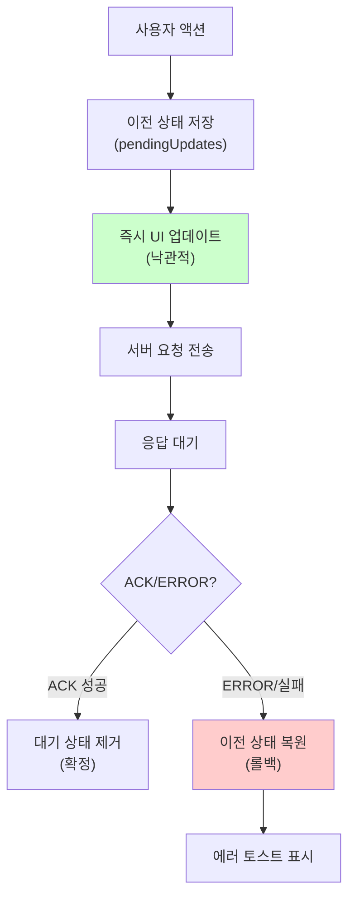
```mermaid
flowchart TD
    ACTION["사용자 액션"]

    ACTION --> SAVE["이전 상태 저장<br/>(pendingUpdates)"]
    SAVE --> OPTIMISTIC["즉시 UI 업데이트<br/>(낙관적)"]
    OPTIMISTIC --> SEND["서버 요청 전송"]
    SEND --> WAIT["응답 대기"]

    WAIT --> RESULT{ACK/ERROR?}

    RESULT -->|"ACK 성공"| CONFIRM["대기 상태 제거<br/>(확정)"]
    RESULT -->|"ERROR/실패"| ROLLBACK["이전 상태 복원<br/>(롤백)"]

    ROLLBACK --> TOAST["에러 토스트 표시"]

    style OPTIMISTIC fill:#ccffcc
    style ROLLBACK fill:#ffcccc
```

### 충돌 처리

**여러 사용자가 동시에 같은 항목을 수정할 때:**

```typescript
// 서버에서 DELTA가 먼저 도착한 경우
function handleDelta(delta: DeltaMessage) {
  const itemId = delta.data.id;

  // 같은 항목에 대한 pending update가 있는지 확인
  const hasPending = Array.from(pendingUpdates.values())
    .some(p => p.previousState.id === itemId);

  if (hasPending) {
    // 옵션 1: 서버 DELTA 우선 (내 변경 롤백)
    // 옵션 2: 내 변경 우선 (서버 DELTA 무시)
    // 옵션 3: 병합 시도

    // 권장: 서버 DELTA 우선 + 사용자에게 알림
    console.warn('충돌 감지: 다른 사용자가 같은 항목을 수정했습니다.');
    applyDelta(delta);

    // 관련 pending update 롤백
    for (const [requestId, pending] of pendingUpdates.entries()) {
      if (pending.previousState.id === itemId) {
        pendingUpdates.delete(requestId);
      }
    }
  } else {
    applyDelta(delta);
  }
}
```

---

## A5. 실전 예시: 다중 유저 등록 + 재시도

### 시나리오 설명

**요구사항:**
1. 여러 유저를 한 번에 등록합니다.
2. 각 유저의 상태(진행중/성공/실패)가 변경될 때마다 DELTA로 실시간 알림을 받습니다.
3. 실패한 유저는 재시도 버튼으로 다시 시도할 수 있습니다.
4. 재시도 버튼 클릭 시 버튼을 비활성화하고, ACK 수신 후 다시 활성화합니다.

### 아키텍처 선택: 순수 WebSocket vs REST + WebSocket 혼합

| 방식 | 등록 요청 | 재시도 요청 | 진행 현황 | 적합한 경우 |
|------|----------|------------|----------|------------|
| **순수 WebSocket** | WebSocket | WebSocket | WebSocket | 실시간 양방향 통신이 핵심인 경우 |
| **REST + WebSocket 혼합** | REST API | REST API | WebSocket | 기존 REST API 활용, 역할 분리 원할 때 |

**REST + WebSocket 혼합 패턴을 권장하는 상황:**

| 상황 | 설명 |
|------|------|
| **장시간 작업** | 등록/처리에 시간이 걸려서 실시간 진행 상황이 필요한 경우 |
| **기존 REST API 활용** | 이미 REST API가 있고, 실시간 기능만 추가하고 싶은 경우 |
| **명확한 역할 분리** | 요청/응답(REST)과 실시간 구독(WebSocket) 분리 |

### 메시지 흐름도 (REST + WebSocket 혼합)

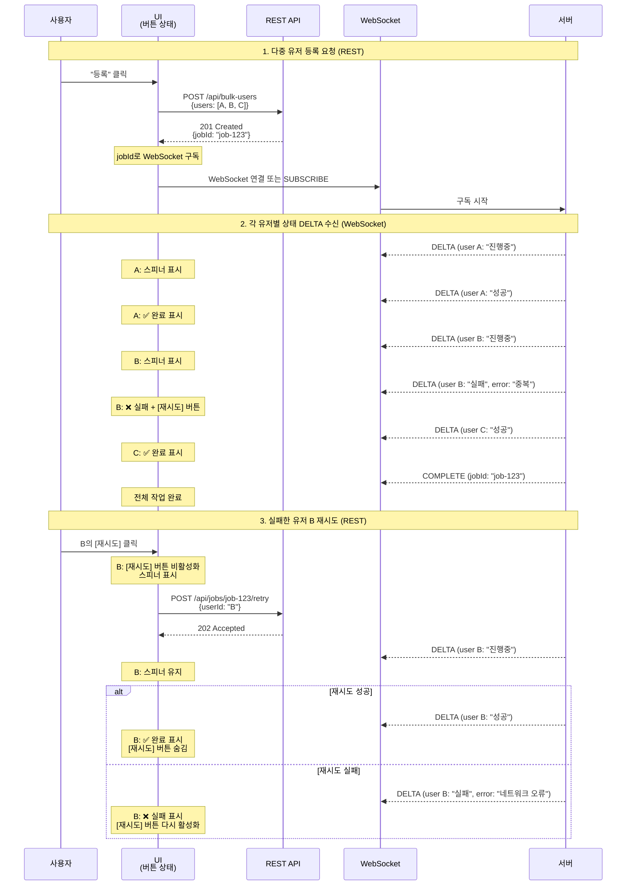
```mermaid
sequenceDiagram
    participant U as 사용자
    participant UI as UI<br/>(버튼 상태)
    participant REST as REST API
    participant WS as WebSocket
    participant S as 서버

    Note over U,S: 1. 다중 유저 등록 요청 (REST)

    U->>UI: "등록" 클릭
    UI->>REST: POST /api/bulk-users<br/>{users: [A, B, C]}
    REST-->>UI: 201 Created<br/>{jobId: "job-123"}

    Note over UI: jobId로 WebSocket 구독

    UI->>WS: WebSocket 연결 또는 SUBSCRIBE
    WS->>S: 구독 시작

    Note over U,S: 2. 각 유저별 상태 DELTA 수신 (WebSocket)

    S-->>WS: DELTA (user A: "진행중")
    Note over UI: A: 스피너 표시

    S-->>WS: DELTA (user A: "성공")
    Note over UI: A: ✅ 완료 표시

    S-->>WS: DELTA (user B: "진행중")
    Note over UI: B: 스피너 표시

    S-->>WS: DELTA (user B: "실패", error: "중복")
    Note over UI: B: ❌ 실패 + [재시도] 버튼

    S-->>WS: DELTA (user C: "성공")
    Note over UI: C: ✅ 완료 표시

    S-->>WS: COMPLETE (jobId: "job-123")
    Note over UI: 전체 작업 완료

    Note over U,S: 3. 실패한 유저 B 재시도 (REST)

    U->>UI: B의 [재시도] 클릭
    Note over UI: B: [재시도] 버튼 비활성화<br/>스피너 표시
    UI->>REST: POST /api/jobs/job-123/retry<br/>{userId: "B"}
    REST-->>UI: 202 Accepted

    S-->>WS: DELTA (user B: "진행중")
    Note over UI: B: 스피너 유지

    alt 재시도 성공
        S-->>WS: DELTA (user B: "성공")
        Note over UI: B: ✅ 완료 표시<br/>[재시도] 버튼 숨김
    else 재시도 실패
        S-->>WS: DELTA (user B: "실패", error: "네트워크 오류")
        Note over UI: B: ❌ 실패 표시<br/>[재시도] 버튼 다시 활성화
    end
```

### REST vs WebSocket 역할 분리

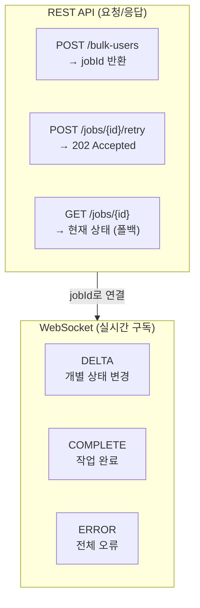
```mermaid
flowchart TB
    subgraph REST["REST API (요청/응답)"]
        R1["POST /bulk-users<br/>→ jobId 반환"]
        R2["POST /jobs/{id}/retry<br/>→ 202 Accepted"]
        R3["GET /jobs/{id}<br/>→ 현재 상태 (폴백)"]
    end

    subgraph WebSocket["WebSocket (실시간 구독)"]
        W1["DELTA<br/>개별 상태 변경"]
        W2["COMPLETE<br/>작업 완료"]
        W3["ERROR<br/>전체 오류"]
    end

    REST -->|"jobId로 연결"| WebSocket
```

| 역할 | REST | WebSocket |
|------|------|-----------|
| **요청 시작** | ✅ POST로 작업 생성 | ❌ |
| **재시도 요청** | ✅ POST로 재시도 | ❌ |
| **진행 상황** | △ 폴링 (폴백) | ✅ 실시간 DELTA |
| **완료 알림** | △ 폴링으로 확인 | ✅ COMPLETE 메시지 |

### WebSocket URL 설계 옵션

#### 옵션 1: 경로에 jobId 포함 (단순한 경우 권장)

```
wss://api.example.com/ws/jobs/{jobId}
```

```typescript
// REST로 등록 요청
const response = await fetch('/api/bulk-users', {
  method: 'POST',
  body: JSON.stringify({ users: [...] })
});
const { jobId } = await response.json();  // "job-123"

// 해당 작업 전용 WebSocket 연결
const ws = new WebSocket(`wss://api.example.com/ws/jobs/${jobId}`);
```

| 장점 | 단점 |
|------|------|
| URL만 보면 무슨 작업인지 명확 | job마다 새 연결 필요 |
| 구현 단순 | 여러 job 동시 모니터링 시 연결 수 증가 |
| 서버 라우팅 쉬움 | |

#### 옵션 2: 단일 연결 + SUBSCRIBE 메시지 (복잡한 경우 권장)

```
wss://api.example.com/ws
```

```typescript
// 앱 시작 시 단일 WebSocket 연결 (재사용)
const ws = new WebSocket('wss://api.example.com/ws');

// REST로 등록 요청
const { jobId } = await createBulkUsers(users);

// 해당 job 구독 (메시지로)
ws.send(JSON.stringify({
  type: 'SUBSCRIBE',
  channel: `jobs:${jobId}`
}));
```

| 장점 | 단점 |
|------|------|
| 연결 1개로 여러 job 모니터링 | 메시지에 channel 필드 필요 |
| 연결 재사용 (효율적) | 구현 복잡도 증가 |

#### 옵션 선택 가이드

| 상황 | 추천 방식 |
|------|----------|
| **단일 작업 모니터링** | 옵션 1 (경로에 jobId) |
| **여러 작업 동시 모니터링** | 옵션 2 (SUBSCRIBE 메시지) |
| **이미 WebSocket 연결 있음** | 옵션 2 (기존 연결 재사용) |

### API 엔드포인트 설계

| 엔드포인트 | 메서드 | 용도 |
|-----------|--------|------|
| `/api/bulk-users` | POST | 다중 유저 등록 시작, jobId 반환 |
| `/api/jobs/{jobId}` | GET | 작업 상태 조회 (폴링 폴백용) |
| `/api/jobs/{jobId}/retry` | POST | 실패한 유저 재시도 |
| `/api/jobs/{jobId}/cancel` | POST | 작업 취소 (선택) |
| `wss://.../ws/jobs/{jobId}` | WS | 진행 상황 실시간 구독 (옵션 1) |
| `wss://.../ws` | WS | 범용 WebSocket (옵션 2) |

### 메시지 타입 설계

```typescript
// ========== 클라이언트 → 서버 ==========

// 다중 유저 등록 요청
interface BulkCreateMessage {
  type: 'BULK_CREATE';
  requestId: string;
  data: {
    users: Array<{ name: string; email: string; /* ... */ }>;
  };
}

// 실패한 유저 재시도 요청
interface RetryMessage {
  type: 'RETRY';
  requestId: string;  // 재시도 요청 추적용 (매번 새로 생성!)
  data: {
    userId: string;   // 재시도할 유저 ID
  };
}

// ========== 서버 → 클라이언트 ==========

// 개별 유저 상태 변경
interface UserDeltaMessage {
  type: 'DELTA';
  data: {
    userId: string;
    status: 'pending' | 'success' | 'failed';
    error?: string;  // 실패 시 에러 메시지
  };
}

// 요청 완료 확인
interface AckMessage {
  type: 'ACK';
  requestId: string;  // 'bulk-001' 또는 'retry-002'
  success: boolean;
  data?: {
    completedUsers?: string[];  // 성공한 유저 ID 목록
    failedUsers?: string[];     // 실패한 유저 ID 목록
  };
}
```

### 재시도 시 requestId: 반드시 새로 생성

**재시도할 때마다 새로운 requestId를 생성해야 합니다.**

| 방식 | 권장 | 이유 |
|------|:----:|------|
| **매번 새로 생성** | ✅ | 각 요청을 독립적으로 추적 가능 |
| 동일하게 유지 | ❌ | 응답 혼란, 타임아웃 문제, 중복 처리 이슈 |

**동일 requestId 사용 시 문제:**

```mermaid
sequenceDiagram
    participant C as 클라이언트
    participant S as 서버

    C->>S: RETRY (requestId="req-001")
    Note over S: 처리 중... 네트워크 지연

    Note over C: 응답 안 옴, 다시 시도

    C->>S: RETRY (requestId="req-001") ❌ 동일!
    Note over S: 처리 중

    S-->>C: ACK (requestId="req-001", success=false)
    S-->>C: ACK (requestId="req-001", success=true)

    Note over C: 둘 다 "req-001"인데...<br/>어떤 게 어떤 요청의 응답? 😵
```

**새 requestId 사용 시:**

```mermaid
sequenceDiagram
    participant C as 클라이언트
    participant S as 서버

    C->>S: RETRY (requestId="req-001")
    Note over S: 처리 중... 네트워크 지연

    Note over C: 응답 안 옴, 다시 시도

    C->>S: RETRY (requestId="req-002") ✅ 새로 생성!
    Note over S: 처리 중

    S-->>C: ACK (requestId="req-001", success=false)
    Note over C: req-001은 이미 타임아웃 처리함, 무시

    S-->>C: ACK (requestId="req-002", success=true)
    Note over C: req-002 성공! 버튼 상태 복원 ✅
```

**새 requestId가 필요한 이유:**

| 이유 | 설명 |
|------|------|
| **응답 매칭** | 늦게 도착한 이전 응답과 현재 응답을 구분 |
| **타임아웃 처리** | 이전 요청 타임아웃 후에도 응답이 올 수 있음 |
| **서버 중복 방지** | 서버가 requestId로 중복 감지 시 거부될 수 있음 |
| **디버깅/로깅** | 각 요청을 로그에서 쉽게 추적 가능 |

### 클라이언트 상태 관리 및 실전 구현

```typescript
// types.ts
interface UserRegistrationState {
  userId: string;
  name: string;
  status: 'pending' | 'success' | 'failed';
  error?: string;
  isRetrying: boolean;  // 재시도 중 여부
}

interface JobProgressMessage {
  type: 'DELTA' | 'COMPLETE' | 'ERROR';
  data: {
    userId?: string;
    status?: 'pending' | 'success' | 'failed';
    error?: string;
  };
}

// useBulkUserRegistration.ts
function useBulkUserRegistration() {
  const [jobId, setJobId] = useState<string | null>(null);
  const [users, setUsers] = useState<UserRegistrationState[]>([]);
  const wsRef = useRef<WebSocket | null>(null);

  // 1. REST로 등록 요청
  const startRegistration = async (userList: User[]) => {
    // 초기 상태 설정
    setUsers(userList.map(u => ({
      ...u,
      status: 'pending',
      isRetrying: false
    })));

    // REST API 호출
    const response = await fetch('/api/bulk-users', {
      method: 'POST',
      headers: { 'Content-Type': 'application/json' },
      body: JSON.stringify({ users: userList })
    });

    const { jobId } = await response.json();
    setJobId(jobId);

    // 2. WebSocket으로 진행 상황 구독
    const ws = new WebSocket(`wss://api.example.com/ws/jobs/${jobId}`);
    wsRef.current = ws;

    ws.onmessage = (event) => {
      const message: JobProgressMessage = JSON.parse(event.data);

      if (message.type === 'DELTA') {
        // 개별 유저 상태 업데이트
        setUsers(prev => prev.map(u =>
          u.userId === message.data.userId
            ? {
                ...u,
                status: message.data.status!,
                error: message.data.error,
                isRetrying: false  // 재시도 완료
              }
            : u
        ));
      } else if (message.type === 'COMPLETE') {
        // 작업 완료 → 연결 종료
        ws.close();
      }
    };
  };

  // 3. 재시도 (REST로 요청, 결과는 WebSocket으로 수신)
  const retryUser = async (userId: string) => {
    // 버튼 비활성화
    setUsers(prev => prev.map(u =>
      u.userId === userId
        ? { ...u, isRetrying: true, status: 'pending' }
        : u
    ));

    // REST API 호출 (결과는 기존 WebSocket으로 수신)
    await fetch(`/api/jobs/${jobId}/retry`, {
      method: 'POST',
      headers: { 'Content-Type': 'application/json' },
      body: JSON.stringify({ userId })
    });

    // 버튼 상태는 DELTA 수신 시 자동 복원 (isRetrying: false)
  };

  // 재시도 버튼 비활성화 조건
  const isRetryDisabled = (user: UserRegistrationState): boolean => {
    return user.status === 'pending' || user.isRetrying;
  };

  // 클린업
  useEffect(() => {
    return () => {
      wsRef.current?.close();
    };
  }, []);

  return { startRegistration, retryUser, users, jobId, isRetryDisabled };
}
```

### 폴백 전략: WebSocket 연결 실패 시

WebSocket 연결이 실패하면 REST 폴링으로 폴백합니다.

```typescript
function useBulkUserRegistration() {
  const pollingRef = useRef<NodeJS.Timeout | null>(null);

  const startRegistration = async (userList: User[]) => {
    const { jobId } = await createBulkUsers(userList);
    setJobId(jobId);

    // WebSocket 연결 시도
    const ws = new WebSocket(`wss://api.example.com/ws/jobs/${jobId}`);

    ws.onerror = () => {
      console.warn('WebSocket 연결 실패, 폴링으로 전환');
      startPolling(jobId);
    };

    ws.onclose = (event) => {
      if (event.code !== 1000) {  // 정상 종료가 아니면
        startPolling(jobId);
      }
    };

    ws.onmessage = handleMessage;
  };

  // 폴링 폴백
  const startPolling = (jobId: string) => {
    pollingRef.current = setInterval(async () => {
      const response = await fetch(`/api/jobs/${jobId}`);
      const status = await response.json();

      // 상태 업데이트
      setUsers(status.users);

      if (status.completed) {
        clearInterval(pollingRef.current!);
      }
    }, 2000);  // 2초마다 폴링
  };

  // 클린업
  useEffect(() => {
    return () => {
      if (pollingRef.current) {
        clearInterval(pollingRef.current);
      }
    };
  }, []);

  return { ... };
}
```

### ACK와 DELTA의 역할 분리

| 메시지 | 역할 | 버튼 상태 영향 |
|--------|------|---------------|
| **DELTA** | 유저의 실시간 상태 변경 (진행중/성공/실패) | `status` 업데이트 → UI 표시 변경 |
| **ACK** | 특정 요청(`requestId`)의 완료 확인 | `retryRequestId` 해제 → 버튼 다시 활성화 |

**왜 둘 다 필요한가?**

```
DELTA만 있으면:
- "유저 B가 실패했어" (상태 변경은 알 수 있음)
- "내 재시도 요청이 끝났는지?" (알 수 없음 → 버튼 언제 활성화?)

ACK가 있으면:
- "네 재시도 요청(retry-002)이 완료됐어" (요청 완료 확인)
- → requestId로 매칭해서 해당 버튼만 활성화
```

### 버튼 상태 흐름도

```mermaid
stateDiagram-v2
    [*] --> Enabled: 초기 상태 (실패)

    Enabled --> Disabled: 재시도 클릭<br/>retryRequestId 설정
    Disabled --> Enabled: ACK 수신<br/>(success=false)
    Disabled --> Hidden: ACK 수신<br/>(success=true)

    note right of Disabled
        버튼 비활성화 조건:
        retryRequestId !== undefined
    end note

    note right of Hidden
        성공 시 재시도 불필요
        버튼 숨김 또는 제거
    end note
```

---

## 핵심 정리 (한 문장으로)

> SNAPSHOT/DELTA 패턴의 핵심은 **초기/재연결 시 SNAPSHOT으로 전체 상태를 동기화하고, 이후 DELTA로 변경분만 전송하여 효율적인 실시간 상태 동기화를 구현하는 것**이다.

---

## 메시지 패턴 체크리스트

| 항목 | 확인 |
|------|:----:|
| 초기 연결 시 SNAPSHOT 전송 | ☐ |
| 재연결 시 SNAPSHOT 재요청 | ☐ |
| 버전 번호로 순서 관리 | ☐ |
| 버전 갭 감지 및 SNAPSHOT 재요청 | ☐ |
| 낙관적 업데이트 구현 | ☐ |
| 롤백 메커니즘 구현 | ☐ |
| ACK/ERROR 메시지 처리 | ☐ |
| 충돌 처리 전략 정의 | ☐ |

---

## 실습으로 이동

| 실습 파일 | 내용 |
|----------|------|
| `practice/snapshot-delta.tsx` | 기본 SNAPSHOT/DELTA 패턴, 버전 기반 동기화, 낙관적 업데이트 |
| `practice/bulk-user-registration.tsx` | **A5 시나리오** - 다중 유저 등록 + 재시도, REST + WebSocket 혼합 패턴 |
