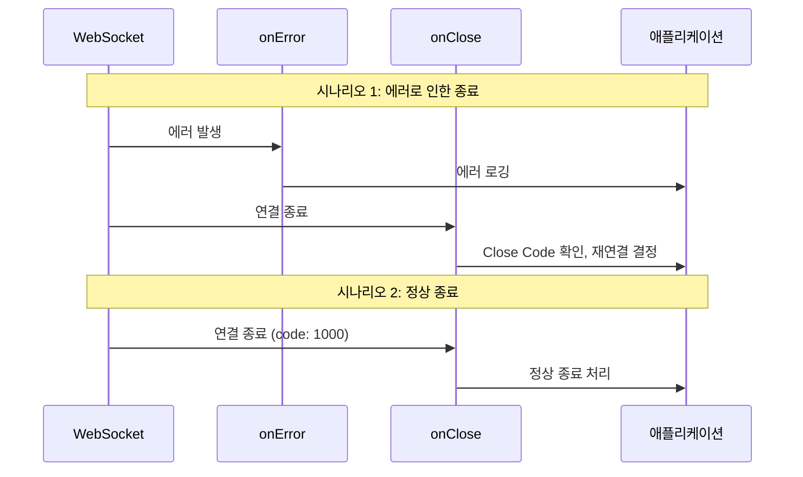
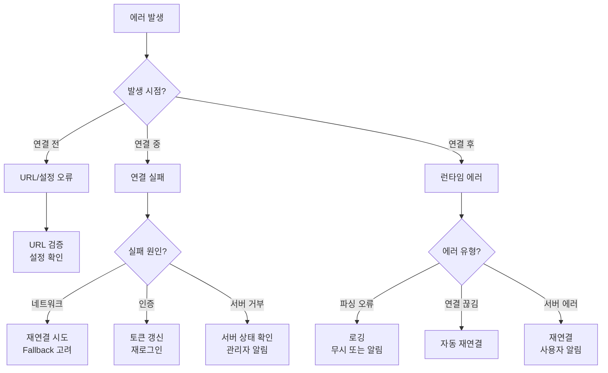
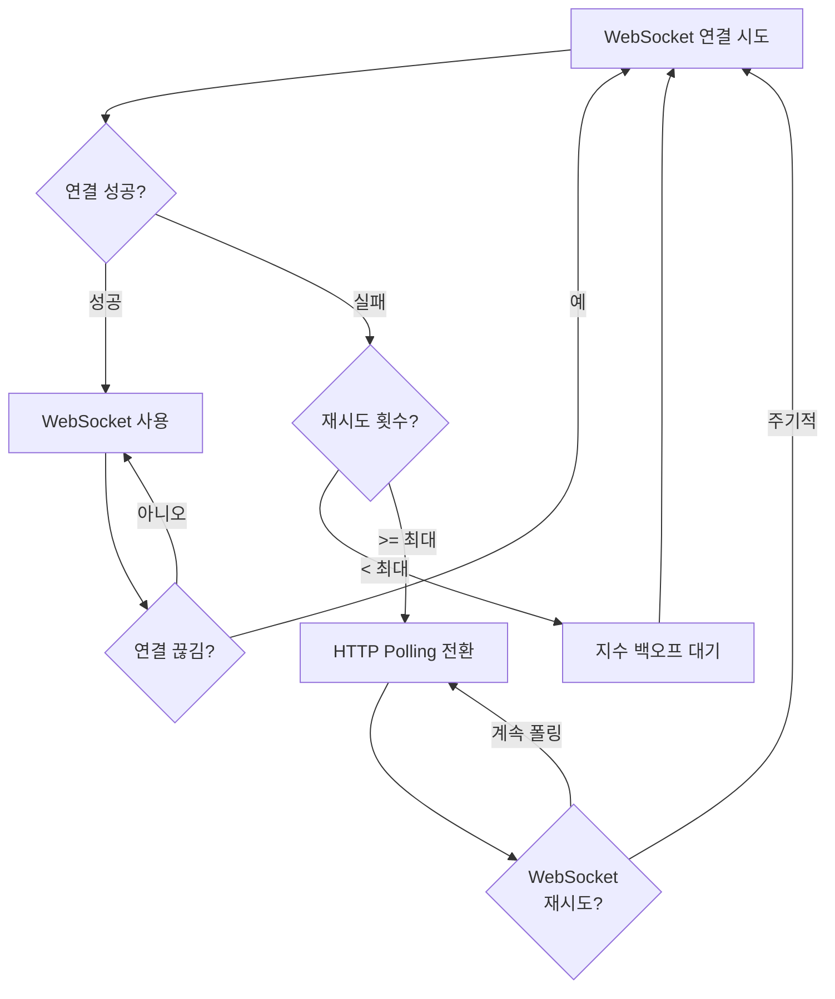
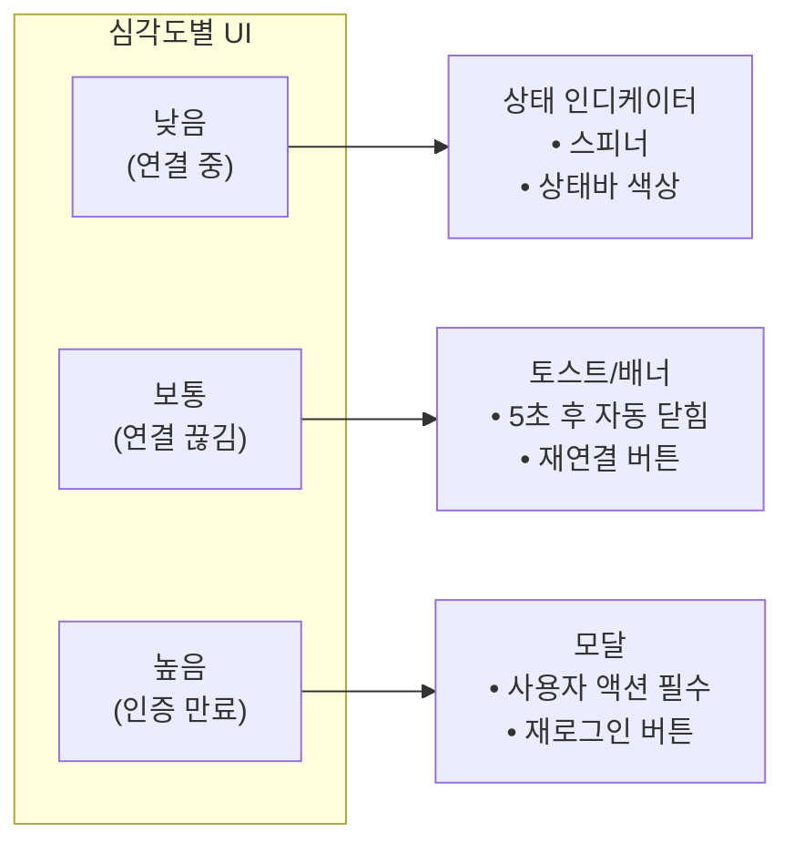

# LEARN: 에러 처리

## 학습 목표
WebSocket의 onError와 onClose의 차이를 이해하고, 에러 유형별 처리 전략과 HTTP Fallback 패턴을 면접에서 설명할 수 있다.

---

## A1. onError vs onClose

### 기본 개념

**onError는 WebSocket에 오류가 발생했을 때 호출됩니다.** 연결 실패, 프로토콜 오류 등이 해당됩니다.

**onClose는 WebSocket 연결이 종료될 때 호출됩니다.** 정상 종료든 비정상 종료든 항상 호출됩니다.

### 차이점

| 항목 | onError | onClose |
|------|---------|---------|
| 호출 시점 | 오류 발생 시 (연결 실패, 프로토콜 오류 등) | 연결 종료 시 (항상 호출됨) |
| 제공되는 정보 | Event 객체 (상세 정보 제한적) | CloseEvent (code, reason, wasClean) |
| 재연결 결정 | 여기서 하지 않음 | Close Code 기반으로 결정 |
| 호출 보장 | 오류 시에만 | 항상 (정상/비정상 종료 모두) |

### 호출 순서



**핵심 포인트:**
- 에러 발생 시: `onError` → `onClose` 순서로 호출
- 정상 종료 시: `onClose`만 호출
- `onError`만 호출되고 끝나는 경우는 없음 (항상 `onClose`가 따라옴)

### 각 콜백에서 처리할 내용

**onError에서 처리:**
```typescript
useWebSocket(url, {
  onError: (event) => {
    // 1. 에러 로깅 (디버깅, 모니터링용)
    console.error('WebSocket 에러:', event);

    // 2. 에러 추적 서비스에 전송
    errorTracker.captureError({
      type: 'websocket_error',
      url,
      timestamp: Date.now(),
    });

    // 3. 내부 상태 업데이트 (필요시)
    setHasError(true);

    // ⚠️ 재연결 결정은 여기서 하지 않음!
    // (onClose에서 Close Code 기반으로 결정)
  },
});
```

**onClose에서 처리:**
```typescript
useWebSocket(url, {
  onClose: (event) => {
    // 1. Close Code 확인
    console.log(`연결 종료: code=${event.code}, reason=${event.reason}`);

    // 2. 정상/비정상 종료 구분
    if (event.code === 1000) {
      console.log('정상 종료');
      return;
    }

    // 3. 사용자 알림
    if (event.code === 1006) {
      showToast('네트워크 연결이 끊어졌습니다.');
    }

    // 4. 필요시 상태 정리
    clearPendingRequests();
  },

  // 5. 재연결 결정은 shouldReconnect에서
  shouldReconnect: (closeEvent) => closeEvent.code !== 1000,
});
```

### onError의 한계

**WebSocket의 `onError`는 보안상 상세 정보를 제공하지 않습니다.** 브라우저가 의도적으로 에러 상세 정보를 숨깁니다.

```typescript
ws.onerror = (event) => {
  // event.message, event.code 등이 없음!
  // 단순히 "에러가 발생했다"만 알 수 있음
  console.log(event);  // Event { type: "error" } 정도만 출력
};
```

**왜 그럴까?**
- 포트 스캐닝 방지 (어떤 포트가 열려있는지 알 수 없게)
- 네트워크 구조 노출 방지
- 보안 취약점 정보 노출 방지

---

## A2. 에러 유형 분류

### 연결 단계별 에러

| 단계 | 에러 유형 | 원인 | 대응 |
|------|----------|------|------|
| **연결 전** | URL 유효성 오류 | 잘못된 프로토콜, 유효하지 않은 URL | URL 검증, 사용자 알림 |
| **연결 중** | 핸드셰이크 실패 | 서버 다운, 네트워크 불가, CORS | 재연결 시도, Fallback |
| | 인증 실패 | 토큰 만료, 권한 없음 | 토큰 갱신 후 재연결 |
| | 타임아웃 | 서버 응답 지연 | 타임아웃 설정, 재시도 |
| **연결 후** | 메시지 파싱 오류 | 잘못된 JSON, 스키마 불일치 | 에러 로깅, 무시 또는 알림 |
| | 연결 끊김 | 네트워크 불안정, 서버 재시작 | 자동 재연결 |
| | 서버 에러 | 서버 내부 오류 | 재연결, 사용자 알림 |

### 에러 분류 다이어그램



### 에러 처리 우선순위

```typescript
function handleWebSocketError(error: any, closeEvent?: CloseEvent) {
  // 1순위: 네트워크 에러 (재연결 시도)
  if (closeEvent?.code === 1006) {
    console.log('네트워크 에러 - 재연결 시도');
    return { action: 'reconnect', delay: calculateBackoff() };
  }

  // 2순위: 인증 에러 (재로그인)
  if (closeEvent?.code === 4001 || closeEvent?.code === 4002) {
    console.log('인증 에러 - 재로그인 필요');
    return { action: 'reauth', redirect: '/login' };
  }

  // 3순위: 프로토콜 에러 (로깅 + 알림)
  if (closeEvent?.code >= 1002 && closeEvent?.code <= 1003) {
    console.error('프로토콜 에러:', closeEvent.reason);
    reportError(closeEvent);
    return { action: 'alert', message: '연결에 문제가 발생했습니다.' };
  }

  // 4순위: 애플리케이션 에러 (메시지에 따라 처리)
  if (closeEvent?.code >= 4000) {
    return handleApplicationError(closeEvent);
  }

  // 기본: 재연결 시도
  return { action: 'reconnect', delay: 3000 };
}
```

### 메시지 파싱 에러 처리

```typescript
useWebSocket(url, {
  onMessage: (event) => {
    try {
      const data = JSON.parse(event.data);
      handleMessage(data);
    } catch (parseError) {
      // 파싱 실패 시 처리
      console.error('메시지 파싱 실패:', parseError);
      console.log('원본 메시지:', event.data);

      // 옵션 1: 무시 (단순 로깅)
      // 옵션 2: 서버에 에러 보고
      // 옵션 3: 연결 재시작 (상태 불일치 우려 시)

      // 권장: 로깅 후 무시
      errorTracker.capture({
        type: 'parse_error',
        rawMessage: event.data.substring(0, 200),  // 일부만
      });
    }
  },
});
```

---

## A3. HTTP 폴링 Fallback

### Fallback이 필요한 경우

WebSocket을 사용할 수 없는 환경이 있습니다.

| 상황 | 설명 | 빈도 |
|------|------|:----:|
| 구형 브라우저 | WebSocket 미지원 (IE9 이하) | 매우 드묾 |
| 기업 방화벽/프록시 | WebSocket 포트(ws/wss) 차단 | 간혹 발생 |
| 불안정한 네트워크 | 연결 유지가 어려운 환경 | 가끔 |
| 재연결 반복 실패 | 일정 횟수 이상 실패 | 가끔 |

### Fallback 전환 흐름



### 구현 전략

```typescript
interface ConnectionState {
  mode: 'websocket' | 'polling';
  wsFailCount: number;
  lastWsAttempt: number;
}

const MAX_WS_RETRIES = 5;
const WS_RETRY_COOLDOWN = 60000;  // 1분 후 WebSocket 재시도

function useRealtimeConnection(url: string) {
  const [state, setState] = useState<ConnectionState>({
    mode: 'websocket',
    wsFailCount: 0,
    lastWsAttempt: 0,
  });

  // WebSocket 연결
  const wsUrl = state.mode === 'websocket' ? url : null;
  const { readyState, lastMessage } = useWebSocket(wsUrl, {
    shouldReconnect: (closeEvent) => {
      const newFailCount = state.wsFailCount + 1;

      if (newFailCount >= MAX_WS_RETRIES) {
        console.log('WebSocket 재연결 실패, Polling으로 전환');
        setState({
          mode: 'polling',
          wsFailCount: newFailCount,
          lastWsAttempt: Date.now(),
        });
        return false;  // 더 이상 재연결 안 함
      }

      setState(prev => ({ ...prev, wsFailCount: newFailCount }));
      return true;
    },
    onOpen: () => {
      // 연결 성공 시 실패 카운트 리셋
      setState(prev => ({ ...prev, wsFailCount: 0 }));
    },
  });

  // Polling 로직
  const [pollingData, setPollingData] = useState(null);

  useEffect(() => {
    if (state.mode !== 'polling') return;

    const pollInterval = setInterval(async () => {
      try {
        const response = await fetch('/api/updates');
        const data = await response.json();
        setPollingData(data);
      } catch (error) {
        console.error('Polling 실패:', error);
      }
    }, 5000);

    // 주기적으로 WebSocket 재시도
    const wsRetryInterval = setInterval(() => {
      if (Date.now() - state.lastWsAttempt > WS_RETRY_COOLDOWN) {
        console.log('WebSocket 재시도');
        setState({
          mode: 'websocket',
          wsFailCount: 0,
          lastWsAttempt: Date.now(),
        });
      }
    }, WS_RETRY_COOLDOWN);

    return () => {
      clearInterval(pollInterval);
      clearInterval(wsRetryInterval);
    };
  }, [state.mode, state.lastWsAttempt]);

  // 통합 데이터 반환
  return {
    data: state.mode === 'websocket' ? lastMessage?.data : pollingData,
    connectionMode: state.mode,
    isConnected: state.mode === 'websocket'
      ? readyState === ReadyState.OPEN
      : true,  // Polling은 항상 "연결됨" 취급
  };
}
```

### Polling과 WebSocket 비교

| 측면 | WebSocket | HTTP Polling |
|------|-----------|--------------|
| 실시간성 | 즉시 (ms) | 폴링 간격만큼 지연 |
| 서버 부하 | 낮음 (연결 유지) | 높음 (반복 요청) |
| 클라이언트 복잡성 | 높음 (상태 관리) | 낮음 |
| 방화벽 호환성 | 낮음 | 높음 |
| 양방향 통신 | 가능 | 단방향 (요청-응답) |

### 전환 시 주의점

```typescript
// 1. 데이터 형식 통일
// WebSocket과 Polling이 같은 형식의 데이터를 반환해야 함
interface UpdateData {
  items: Item[];
  version: number;
}

// 2. 상태 동기화
// Polling 전환 시 전체 상태 재요청 필요
async function switchToPolling() {
  // 전환 시 최신 상태 fetch
  const snapshot = await fetch('/api/snapshot');
  setItems(await snapshot.json());
}

// 3. 사용자 알림
function notifyConnectionMode(mode: 'websocket' | 'polling') {
  if (mode === 'polling') {
    showToast(
      '실시간 연결에 문제가 있어 대체 방식으로 전환되었습니다. ' +
      '일부 업데이트가 지연될 수 있습니다.',
      { duration: 5000 }
    );
  }
}
```

---

## A4. 사용자 알림

### 에러 노출 기준

| 에러 유형 | 사용자 표시 | 표시 방식 | 액션 |
|----------|:----------:|----------|------|
| 연결 중 | ⚠️ 선택적 | 상태바/인디케이터 | 없음 (자동 처리) |
| 연결 끊김 | ✅ 표시 | 토스트/배너 | 재연결 버튼 |
| 재연결 중 | ✅ 표시 | 상태바 | 진행 상황 표시 |
| 재연결 실패 | ✅ 표시 | 모달/배너 | 수동 재시도 버튼 |
| 서버 에러 | ✅ 표시 | 토스트 | 새로고침 안내 |
| 인증 만료 | ✅ 표시 | 모달 | 재로그인 버튼 |

### 좋은 에러 메시지 작성

**기술적 (비권장):**
```
WebSocket connection to 'wss://api.example.com/ws' failed:
Error during WebSocket handshake: Unexpected response code: 503
```

**사용자 친화적 (권장):**
```
서버에 일시적인 문제가 발생했습니다.
잠시 후 자동으로 다시 연결됩니다.
```

### 에러 메시지 가이드라인

```typescript
const errorMessages: Record<number, { title: string; description: string }> = {
  // 네트워크 에러
  1006: {
    title: '연결이 끊어졌습니다',
    description: '인터넷 연결을 확인해 주세요. 자동으로 다시 연결을 시도합니다.',
  },

  // 서버 에러
  1011: {
    title: '서버에 문제가 발생했습니다',
    description: '잠시 후 다시 시도해 주세요.',
  },

  // 인증 에러 (커스텀)
  4001: {
    title: '로그인이 필요합니다',
    description: '세션이 만료되었습니다. 다시 로그인해 주세요.',
  },

  // 권한 에러 (커스텀)
  4003: {
    title: '접근 권한이 없습니다',
    description: '이 기능을 사용할 수 있는 권한이 없습니다.',
  },
};

function getErrorMessage(code: number): { title: string; description: string } {
  return errorMessages[code] || {
    title: '연결에 문제가 발생했습니다',
    description: '잠시 후 다시 시도해 주세요.',
  };
}
```

### 알림 UI 패턴



### 구현 예시

```typescript
interface ErrorNotificationProps {
  error: {
    code: number;
    title: string;
    description: string;
  };
  onRetry?: () => void;
  onDismiss?: () => void;
}

const ErrorNotification = ({ error, onRetry, onDismiss }: ErrorNotificationProps) => {
  const severity = getSeverity(error.code);

  // 심각도에 따른 UI 결정
  if (severity === 'low') {
    // 상태 인디케이터만
    return (
      <StatusIndicator status="connecting">
        연결 중...
      </StatusIndicator>
    );
  }

  if (severity === 'high') {
    // 모달
    return (
      <Modal open onClose={onDismiss}>
        <Modal.Header>{error.title}</Modal.Header>
        <Modal.Body>{error.description}</Modal.Body>
        <Modal.Footer>
          {onRetry && <Button onClick={onRetry}>다시 시도</Button>}
        </Modal.Footer>
      </Modal>
    );
  }

  // 기본: 토스트
  return (
    <Toast
      title={error.title}
      description={error.description}
      action={onRetry && { label: '재연결', onClick: onRetry }}
      duration={5000}
      onClose={onDismiss}
    />
  );
};

function getSeverity(code: number): 'low' | 'medium' | 'high' {
  if (code === 1006) return 'medium';  // 네트워크 에러
  if (code >= 4001 && code <= 4002) return 'high';  // 인증 에러
  return 'medium';
}
```

---

## 핵심 정리 (한 문장으로)

> WebSocket 에러 처리의 핵심은 **onError로 로깅하고, onClose의 Close Code로 재연결 여부를 결정하며, 사용자에게는 기술 용어 없이 상황과 해결책을 알려주는 것**이다.

---

## 에러 처리 체크리스트

| 항목 | 확인 |
|------|:----:|
| onError에서 에러 로깅 | ☐ |
| onClose에서 Close Code 확인 | ☐ |
| 에러 유형별 대응 전략 정의 | ☐ |
| HTTP Polling Fallback 구현 | ☐ |
| 사용자 친화적 에러 메시지 | ☐ |
| 심각도별 알림 UI 구분 | ☐ |
| 재연결/재시도 버튼 제공 | ☐ |

---

## 실습으로 이동
→ `practice/error-handler.tsx`
