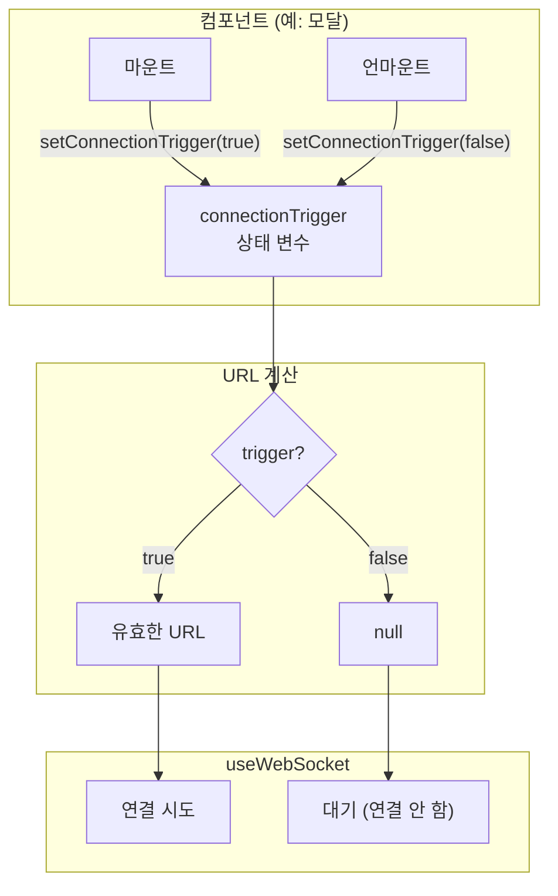
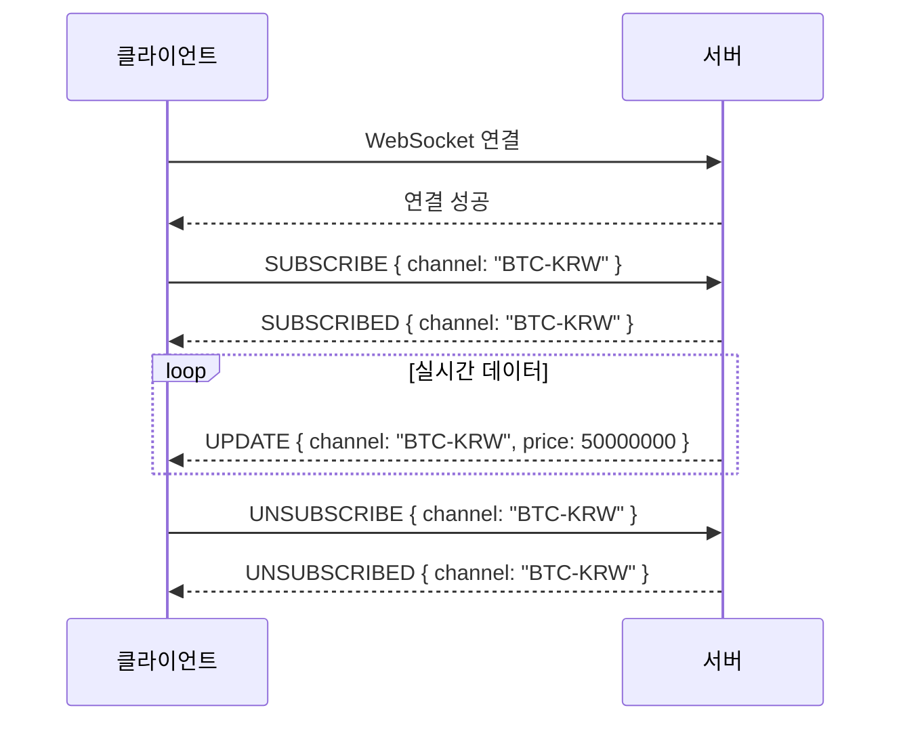
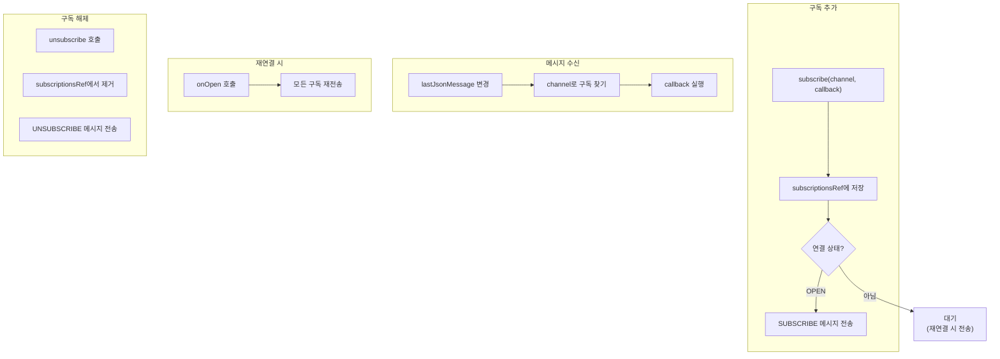
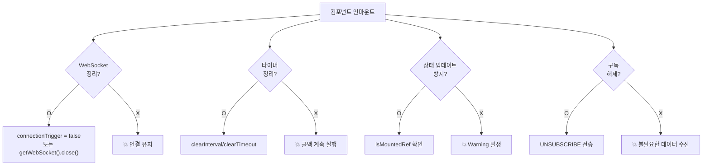

# LEARN: 실제 코드 분석

## 학습 목표
프로덕션 수준의 WebSocket 구현 패턴을 이해하고, 실제 코드에서 연결 제어, 메시지 처리, 에러 복구가 어떻게 통합되는지 면접에서 설명할 수 있다.

---

## A1. connectionTrigger 패턴

### 패턴 개요

**connectionTrigger는 WebSocket 연결의 시작/종료를 명시적으로 제어하는 상태 변수입니다.** URL을 조건부로 `null`로 설정하여 연결을 제어합니다.

```typescript
const [connectionTrigger, setConnectionTrigger] = useState(false);

// connectionTrigger가 false → wsUrl이 null → 연결 안 함
// connectionTrigger가 true → wsUrl이 유효 → 연결 시작
const wsUrl = connectionTrigger ? 'wss://example.com/ws' : null;

const { sendMessage, readyState } = useWebSocket(wsUrl, { /* options */ });
```

### 전체 아키텍처



### 코드 분석

```typescript
const RealtimeLogViewer = ({ pipelineId }: { pipelineId: string }) => {
  // ========== 1. 연결 제어 상태 ==========
  const [connectionTrigger, setConnectionTrigger] = useState(false);

  // ========== 2. 마운트 시 연결, 언마운트 시 해제 ==========
  useEffect(() => {
    // 컴포넌트가 마운트되면 연결 시작
    setConnectionTrigger(true);

    // 컴포넌트가 언마운트되면 연결 해제
    return () => {
      setConnectionTrigger(false);
    };
  }, []);

  // ========== 3. 조건부 URL 계산 ==========
  const { token, userId } = useAuth();
  const baseUrl = useConfig('wsUrl');

  const wsUrl = useMemo(() => {
    if (!connectionTrigger || !token) return null;

    const params = new URLSearchParams({
      token,
      userId,
      pipelineId,
    });

    return `${baseUrl}/logs?${params}`;
  }, [connectionTrigger, token, userId, baseUrl, pipelineId]);

  // ========== 4. WebSocket 연결 ==========
  const { sendMessage, lastMessage, readyState } = useWebSocket(wsUrl, {
    onOpen: () => {
      // 연결 성공 시 구독 요청
      sendMessage(JSON.stringify({ type: 'subscribe', pipelineId }));
    },
    shouldReconnect: (closeEvent) => closeEvent.code !== 1000,
  });

  // ... 나머지 로직
};
```

### 언제 이 패턴을 사용하는가?

| 상황 | 설명 | 예시 |
|------|------|------|
| **모달/다이얼로그** | 열릴 때만 연결 필요 | 실시간 로그 뷰어 모달 |
| **조건부 실시간 기능** | 특정 조건에서만 연결 | 프리미엄 사용자만 실시간 |
| **탭/라우트 기반** | 특정 페이지에서만 연결 | /chat 페이지만 WebSocket |
| **인증 의존** | 로그인 후에만 연결 | 인증된 사용자 전용 기능 |
| **수동 제어** | 사용자가 연결/해제 | 실시간 모니터링 토글 |

---

## A2. 구독 관리

### 구독 개념

**WebSocket에서 구독(Subscription)은 클라이언트가 관심 있는 데이터 스트림을 서버에 알리는 것입니다.** 채팅방 입장, 특정 종목 시세 구독 등이 해당됩니다.



### 단일 구독 관리

```typescript
const useRealtimeData = (channel: string) => {
  const [data, setData] = useState(null);
  const wsUrl = 'wss://api.example.com/ws';

  const { sendMessage, lastJsonMessage, readyState } = useWebSocket(wsUrl, {
    onOpen: () => {
      // 연결되면 구독 요청
      sendMessage(JSON.stringify({
        type: 'SUBSCRIBE',
        channel,
      }));
    },
  });

  // 메시지 처리
  useEffect(() => {
    if (lastJsonMessage?.channel === channel) {
      setData(lastJsonMessage.data);
    }
  }, [lastJsonMessage, channel]);

  // 언마운트 시 구독 해제
  useEffect(() => {
    return () => {
      if (readyState === ReadyState.OPEN) {
        sendMessage(JSON.stringify({
          type: 'UNSUBSCRIBE',
          channel,
        }));
      }
    };
  }, [channel, readyState, sendMessage]);

  return { data, isConnected: readyState === ReadyState.OPEN };
};
```

### 다중 구독 관리

```typescript
interface Subscription {
  channel: string;
  callback: (data: any) => void;
}

const useMultiSubscription = () => {
  const subscriptionsRef = useRef<Map<string, Subscription>>(new Map());
  const wsUrl = 'wss://api.example.com/ws';

  const { sendMessage, lastJsonMessage, readyState } = useWebSocket(wsUrl, {
    onOpen: () => {
      // 재연결 시 모든 구독 복구
      subscriptionsRef.current.forEach((sub, channel) => {
        sendMessage(JSON.stringify({
          type: 'SUBSCRIBE',
          channel,
        }));
      });
    },
  });

  // 메시지 라우팅
  useEffect(() => {
    if (lastJsonMessage) {
      const channel = lastJsonMessage.channel;
      const subscription = subscriptionsRef.current.get(channel);
      subscription?.callback(lastJsonMessage.data);
    }
  }, [lastJsonMessage]);

  // 구독 추가
  const subscribe = useCallback((channel: string, callback: (data: any) => void) => {
    subscriptionsRef.current.set(channel, { channel, callback });

    if (readyState === ReadyState.OPEN) {
      sendMessage(JSON.stringify({
        type: 'SUBSCRIBE',
        channel,
      }));
    }

    // 구독 해제 함수 반환
    return () => {
      subscriptionsRef.current.delete(channel);
      if (readyState === ReadyState.OPEN) {
        sendMessage(JSON.stringify({
          type: 'UNSUBSCRIBE',
          channel,
        }));
      }
    };
  }, [readyState, sendMessage]);

  return { subscribe, isConnected: readyState === ReadyState.OPEN };
};
```

### 구독 관리 흐름



---

## A3. 메모리 누수 방지

### 정리해야 할 리소스

| 리소스 | 누수 증상 | 정리 방법 |
|--------|----------|----------|
| WebSocket 연결 | 언마운트 후에도 연결 유지 | connectionTrigger = false |
| 타이머 | setInterval 계속 실행 | clearInterval |
| 이벤트 리스너 | 콜백이 호출됨 | removeEventListener |
| 상태 업데이트 | "setState on unmounted" 경고 | isMounted 플래그 |
| 구독 | 불필요한 데이터 수신 | UNSUBSCRIBE 전송 |

### 안전한 cleanup 패턴

```typescript
const useWebSocketWithCleanup = (url: string) => {
  // 마운트 상태 추적
  const isMountedRef = useRef(true);
  const [data, setData] = useState(null);
  const [error, setError] = useState<string | null>(null);

  // 타이머 정리를 위한 ref
  const reconnectTimerRef = useRef<NodeJS.Timeout | null>(null);

  const { sendMessage, lastMessage, readyState } = useWebSocket(url, {
    onMessage: (event) => {
      // 언마운트 후 상태 업데이트 방지
      if (!isMountedRef.current) return;

      try {
        const parsed = JSON.parse(event.data);
        setData(parsed);
      } catch (e) {
        setError('파싱 오류');
      }
    },
    onError: () => {
      if (!isMountedRef.current) return;
      setError('연결 오류');
    },
    onClose: (event) => {
      if (!isMountedRef.current) return;

      // 비정상 종료 시 재연결 타이머 설정
      if (event.code !== 1000) {
        reconnectTimerRef.current = setTimeout(() => {
          if (isMountedRef.current) {
            // 재연결 로직
          }
        }, 3000);
      }
    },
  });

  // cleanup
  useEffect(() => {
    isMountedRef.current = true;

    return () => {
      isMountedRef.current = false;

      // 타이머 정리
      if (reconnectTimerRef.current) {
        clearTimeout(reconnectTimerRef.current);
      }
    };
  }, []);

  return { data, error, readyState };
};
```

### 메모리 누수 방지 체크리스트



---

## A4. 테스트 전략

### Mock WebSocket 설정

```typescript
// __mocks__/mock-socket.ts
import { Server } from 'mock-socket';

let mockServer: Server | null = null;

export const setupMockWebSocket = (url: string) => {
  mockServer = new Server(url);
  return mockServer;
};

export const teardownMockWebSocket = () => {
  if (mockServer) {
    mockServer.stop();
    mockServer = null;
  }
};

export const sendMockMessage = (data: any) => {
  mockServer?.emit('message', JSON.stringify(data));
};
```

### 테스트 케이스

```typescript
import { renderHook, act, waitFor } from '@testing-library/react';
import { setupMockWebSocket, teardownMockWebSocket, sendMockMessage } from './__mocks__/mock-socket';

const WS_URL = 'ws://localhost:1234';

describe('useRealtimeData', () => {
  beforeEach(() => {
    setupMockWebSocket(WS_URL);
  });

  afterEach(() => {
    teardownMockWebSocket();
  });

  // 1. 연결 성공 테스트
  test('연결 성공 시 OPEN 상태가 된다', async () => {
    const { result } = renderHook(() => useRealtimeData(WS_URL));

    await waitFor(() => {
      expect(result.current.isConnected).toBe(true);
    });
  });

  // 2. 메시지 수신 테스트
  test('메시지 수신 시 데이터가 업데이트된다', async () => {
    const { result } = renderHook(() => useRealtimeData(WS_URL));

    await waitFor(() => {
      expect(result.current.isConnected).toBe(true);
    });

    act(() => {
      sendMockMessage({ type: 'UPDATE', value: 100 });
    });

    await waitFor(() => {
      expect(result.current.data).toEqual({ type: 'UPDATE', value: 100 });
    });
  });

  // 3. 에러 처리 테스트
  test('잘못된 JSON 수신 시 에러 상태가 된다', async () => {
    const { result } = renderHook(() => useRealtimeData(WS_URL));

    await waitFor(() => {
      expect(result.current.isConnected).toBe(true);
    });

    act(() => {
      // 잘못된 JSON 전송
      mockServer.emit('message', 'invalid json');
    });

    await waitFor(() => {
      expect(result.current.error).toBeTruthy();
    });
  });

  // 4. 언마운트 시 정리 테스트
  test('언마운트 시 연결이 정리된다', async () => {
    const { result, unmount } = renderHook(() => useRealtimeData(WS_URL));

    await waitFor(() => {
      expect(result.current.isConnected).toBe(true);
    });

    unmount();

    // 언마운트 후 서버 연결 확인
    expect(mockServer.clients().length).toBe(0);
  });
});
```

---

## A5. 프로덕션 고려사항

### 인증/인가

```typescript
// 토큰 만료 시 재인증 처리
const useAuthenticatedWebSocket = (baseUrl: string) => {
  const { token, refreshToken, isTokenExpired } = useAuth();
  const [wsUrl, setWsUrl] = useState<string | null>(null);

  useEffect(() => {
    const initConnection = async () => {
      let currentToken = token;

      // 토큰 만료 시 갱신
      if (isTokenExpired()) {
        try {
          currentToken = await refreshToken();
        } catch (error) {
          // 갱신 실패 시 로그인 페이지로
          redirectToLogin();
          return;
        }
      }

      setWsUrl(`${baseUrl}?token=${currentToken}`);
    };

    initConnection();
  }, [token, baseUrl]);

  return useWebSocket(wsUrl, {
    onClose: (event) => {
      // 인증 실패로 종료된 경우
      if (event.code === 4001 || event.code === 4002) {
        refreshToken()
          .then(() => {
            // URL 재설정으로 재연결
            setWsUrl(null);
            setTimeout(() => setWsUrl(`${baseUrl}?token=${token}`), 100);
          })
          .catch(() => redirectToLogin());
      }
    },
    shouldReconnect: (event) => {
      // 인증 관련 에러는 재연결 안 함
      return event.code !== 4001 && event.code !== 4002;
    },
  });
};
```

### 인프라 고려사항

| 영역 | 고려사항 | 해결 방안 |
|------|----------|----------|
| **로드밸런서** | WebSocket은 Sticky Session 필요 | IP Hash 또는 Cookie 기반 라우팅 |
| **서버 배포** | 배포 시 기존 연결 끊김 | Graceful Shutdown, 클라이언트 재연결 |
| **스케일링** | 연결 분산, 브로드캐스트 | Redis Pub/Sub, Message Broker |
| **타임아웃** | 프록시/로드밸런서 타임아웃 | Ping/Pong Heartbeat |

### Heartbeat 구현

```typescript
const useWebSocketWithHeartbeat = (url: string) => {
  const HEARTBEAT_INTERVAL = 30000;  // 30초
  const heartbeatRef = useRef<NodeJS.Timeout | null>(null);

  const { sendMessage, readyState } = useWebSocket(url, {
    onOpen: () => {
      // Heartbeat 시작
      heartbeatRef.current = setInterval(() => {
        sendMessage(JSON.stringify({ type: 'PING' }));
      }, HEARTBEAT_INTERVAL);
    },
    onClose: () => {
      // Heartbeat 중지
      if (heartbeatRef.current) {
        clearInterval(heartbeatRef.current);
      }
    },
    onMessage: (event) => {
      const data = JSON.parse(event.data);
      if (data.type === 'PONG') {
        // Heartbeat 응답 수신 - 연결 정상
        return;
      }
      // 일반 메시지 처리
    },
  });

  // cleanup
  useEffect(() => {
    return () => {
      if (heartbeatRef.current) {
        clearInterval(heartbeatRef.current);
      }
    };
  }, []);
};
```

### 모니터링

```typescript
// 연결 상태 모니터링
const useWebSocketMonitoring = (url: string) => {
  const metricsRef = useRef({
    connectCount: 0,
    disconnectCount: 0,
    messageCount: 0,
    errorCount: 0,
    lastConnectedAt: null as number | null,
    totalConnectedTime: 0,
  });

  const { readyState } = useWebSocket(url, {
    onOpen: () => {
      metricsRef.current.connectCount++;
      metricsRef.current.lastConnectedAt = Date.now();

      // 메트릭 서버로 전송
      analytics.track('websocket_connected', {
        url,
        connectCount: metricsRef.current.connectCount,
      });
    },
    onClose: () => {
      metricsRef.current.disconnectCount++;

      if (metricsRef.current.lastConnectedAt) {
        const connectedTime = Date.now() - metricsRef.current.lastConnectedAt;
        metricsRef.current.totalConnectedTime += connectedTime;
      }

      analytics.track('websocket_disconnected', {
        url,
        disconnectCount: metricsRef.current.disconnectCount,
        sessionDuration: metricsRef.current.totalConnectedTime,
      });
    },
    onMessage: () => {
      metricsRef.current.messageCount++;
    },
    onError: () => {
      metricsRef.current.errorCount++;

      analytics.track('websocket_error', {
        url,
        errorCount: metricsRef.current.errorCount,
      });
    },
  });

  return {
    metrics: metricsRef.current,
    readyState,
  };
};
```

---

## 발견한 패턴 정리

### 패턴 1: 조건부 연결 (connectionTrigger)

```typescript
const [shouldConnect, setShouldConnect] = useState(false);
const wsUrl = shouldConnect ? 'wss://...' : null;

useEffect(() => {
  setShouldConnect(true);
  return () => setShouldConnect(false);
}, []);
```

**용도**: 모달, 특정 페이지, 인증 후 연결

### 패턴 2: 메시지 타입 분기

```typescript
useEffect(() => {
  if (!lastJsonMessage) return;

  switch (lastJsonMessage.type) {
    case 'SNAPSHOT':
      setData(lastJsonMessage.data);
      break;
    case 'DELTA':
      setData(prev => applyDelta(prev, lastJsonMessage.data));
      break;
    case 'ERROR':
      setError(lastJsonMessage.message);
      break;
  }
}, [lastJsonMessage]);
```

**용도**: 다양한 메시지 타입 처리

### 패턴 3: 에러 복구

```typescript
useWebSocket(url, {
  shouldReconnect: (event) => event.code !== 1000,
  reconnectAttempts: 5,
  reconnectInterval: (attempt) =>
    Math.min(1000 * Math.pow(2, attempt), 30000),
  onReconnectStop: () => {
    enableFallbackPolling();
  },
});
```

**용도**: 안정적인 연결 유지

---

## 프로덕션 체크리스트

| 영역 | 항목 | 확인 |
|------|------|:----:|
| **연결 관리** | 컴포넌트 언마운트 시 연결 해제 | ☐ |
| | 조건부 연결 (필요할 때만) | ☐ |
| | 재연결 로직 구현 | ☐ |
| | 최대 재연결 시도 횟수 제한 | ☐ |
| | 지수 백오프 적용 | ☐ |
| **인증/보안** | wss:// 프로토콜 사용 | ☐ |
| | 인증 토큰 전달 | ☐ |
| | 토큰 만료 시 처리 | ☐ |
| **에러 처리** | 연결 에러 UI 표시 | ☐ |
| | 서버 에러 메시지 처리 | ☐ |
| | 네트워크 오프라인 감지 | ☐ |
| **성능** | Heartbeat 구현 | ☐ |
| | 메시지 버퍼링 고려 | ☐ |
| | 불필요한 리렌더링 방지 | ☐ |
| | 메모리 누수 방지 (cleanup) | ☐ |
| **테스트** | 연결 성공/실패 테스트 | ☐ |
| | 메시지 수신 테스트 | ☐ |
| | 재연결 시나리오 테스트 | ☐ |
| | 언마운트 정리 테스트 | ☐ |
| **모니터링** | 연결 상태 추적 | ☐ |
| | 에러 로깅 | ☐ |
| | 메트릭 수집 | ☐ |

---

## 핵심 정리 (한 문장으로)

> 프로덕션 WebSocket 구현의 핵심은 **connectionTrigger로 연결 생명주기를 제어하고, 구독 관리와 메모리 누수 방지를 철저히 하며, 인증/재연결/모니터링을 통합하는 것**이다.

---

## 전체 문서 인덱스

| 문서 | 핵심 내용 |
|------|----------|
| [01-basics](../01-basics/LEARN.md) | HTTP vs WebSocket, 핸드셰이크, Full-Duplex |
| [02-react-use-websocket](../02-react-use-websocket/LEARN.md) | 라이브러리 API, 조건부 연결 |
| [03-connection-state](../03-connection-state/LEARN.md) | readyState, 상태별 UI |
| [04-reconnection](../04-reconnection/LEARN.md) | Close Code, 지수 백오프 |
| [05-message-types](../05-message-types/LEARN.md) | SNAPSHOT/DELTA, 낙관적 업데이트 |
| [06-error-handling](../06-error-handling/LEARN.md) | 에러 분류, HTTP Fallback |
| [07-real-world](../07-real-world/LEARN.md) | 실제 코드 패턴, 체크리스트 |
