# 08. 스케일링 고려사항 - 학습 (LEARN)

## 학습 목표
WebSocket 기반 시스템의 스케일링 과제를 이해하고, 대규모 환경에서의 아키텍처 설계 및 한계를 면접에서 설명할 수 있다.

---

## A1. WebSocket 스케일링의 어려움

### Stateful 연결의 도전

**HTTP API는 Stateless입니다.** 어떤 서버가 요청을 처리해도 결과가 동일합니다. 반면 **WebSocket은 Stateful**입니다. 특정 서버에 연결이 유지되어 있어, 해당 서버만 클라이언트와 통신할 수 있습니다.

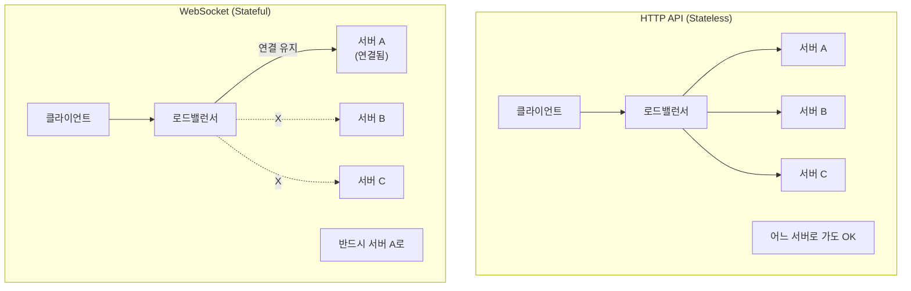

### 스케일링 차이점

| 항목 | HTTP API | WebSocket |
|------|----------|-----------|
| **상태** | Stateless | Stateful |
| **로드밸런싱** | 라운드로빈 OK | Sticky Session 필요 |
| **서버 추가** | 즉시 트래픽 분산 | 기존 연결 재분배 필요 |
| **서버 제거** | 다음 요청은 다른 서버로 | 연결 끊김, 재연결 필요 |
| **장애 복구** | 자동 (다른 서버로) | 클라이언트 재연결 필요 |

---

## A2. 로드밸런서 설정

### L4 vs L7 로드밸런서

**WebSocket은 HTTP 핸드셰이크로 시작합니다.** 따라서 L7(HTTP 인식) 로드밸런서가 필요합니다.

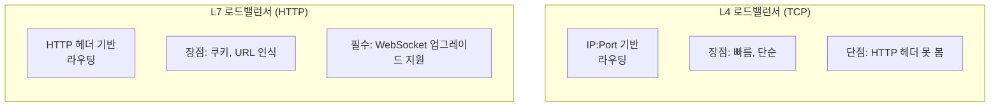

### Sticky Session 구현 방식

**Sticky Session은 동일 클라이언트를 동일 서버로 라우팅합니다.**

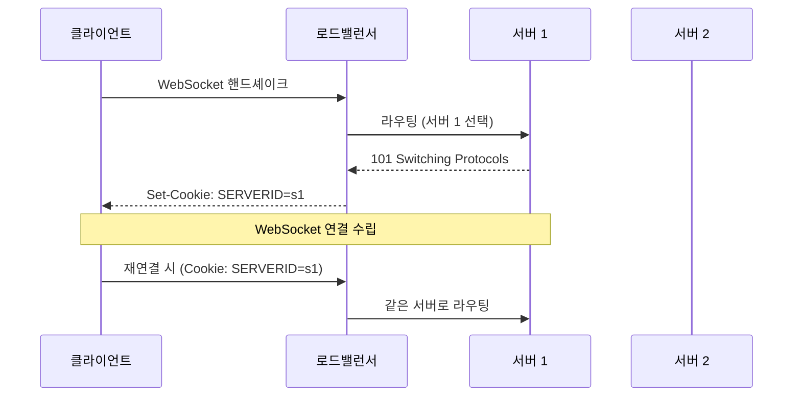

**구현 방식:**

| 방식 | 설명 | 장단점 |
|------|------|--------|
| **쿠키 기반** | `Set-Cookie: SERVERID=s1` | 브라우저 자동 전송, 범용적 |
| **IP 해시** | 클라이언트 IP로 서버 결정 | 쿠키 불필요, NAT 문제 |
| **URL 파라미터** | `ws://host?server=s1` | 명시적, 추가 구현 필요 |

### AWS ALB WebSocket 설정

```yaml
# ALB Target Group 설정
TargetGroup:
  Protocol: HTTP
  HealthCheckPath: /health
  # Sticky Session 활성화
  TargetGroupAttributes:
    - Key: stickiness.enabled
      Value: 'true'
    - Key: stickiness.type
      Value: lb_cookie
    - Key: stickiness.lb_cookie.duration_seconds
      Value: '86400'  # 24시간
```

---

## A3. 메시지 브로드캐스트

### 문제: 서버 간 통신

**채팅방에 100만 명이 접속해 있고, 서버가 10대라면?** 서버 A의 사용자가 보낸 메시지를 서버 B, C, ...의 사용자에게 어떻게 전달할까요?

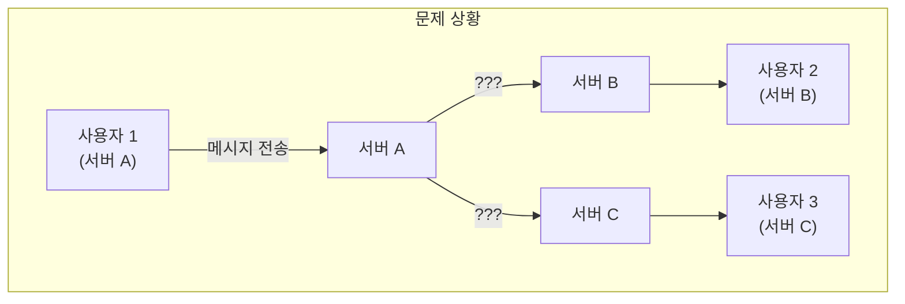

### 해결: Redis Pub/Sub

**Redis Pub/Sub는 서버 간 메시지 브로드캐스트 채널을 제공합니다.**

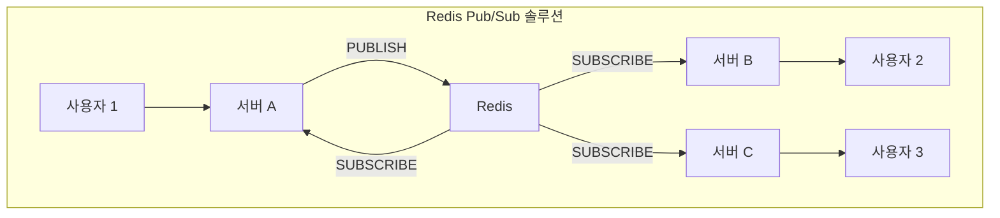

### 구현 예시 (Node.js + Redis)

```typescript
import { createClient } from 'redis';
import { WebSocketServer } from 'ws';

const pubClient = createClient();
const subClient = createClient().duplicate();

await pubClient.connect();
await subClient.connect();

const wss = new WebSocketServer({ port: 8080 });
const roomConnections = new Map<string, Set<WebSocket>>();

// Redis 구독: 다른 서버의 메시지 수신
await subClient.pSubscribe('chat:*', (message, channel) => {
  const roomId = channel.replace('chat:', '');
  const connections = roomConnections.get(roomId) || new Set();

  // 로컬 연결된 사용자에게 전송
  connections.forEach(ws => ws.send(message));
});

wss.on('connection', (ws, req) => {
  const roomId = req.url?.split('/').pop() || 'default';

  // 방에 연결 추가
  if (!roomConnections.has(roomId)) {
    roomConnections.set(roomId, new Set());
  }
  roomConnections.get(roomId)!.add(ws);

  ws.on('message', async (data) => {
    // Redis로 발행: 모든 서버에 브로드캐스트
    await pubClient.publish(`chat:${roomId}`, data.toString());
  });

  ws.on('close', () => {
    roomConnections.get(roomId)?.delete(ws);
  });
});
```

### 메시지 브로커 비교

| 브로커 | 장점 | 단점 | 적합한 경우 |
|--------|------|------|------------|
| **Redis Pub/Sub** | 간단, 빠름, 저지연 | 메시지 유실 가능, 영속성 없음 | 실시간 채팅, 알림 |
| **Redis Streams** | 메시지 영속성, 순서 보장 | 복잡도 증가 | 순서 중요한 경우 |
| **Kafka** | 대용량, 내구성, 리플레이 | 지연 시간 높음, 복잡 | 대규모 이벤트 스트리밍 |
| **RabbitMQ** | 유연한 라우팅, 메시지 보장 | 설정 복잡 | 복잡한 메시지 라우팅 |

---

## A4. 재접속 폭풍 대응

### 문제: 재접속 폭풍 (Reconnection Storm)

**네트워크 장애로 10만 연결이 동시에 끊기면?** 10만 클라이언트가 동시에 재연결을 시도하여 서버가 과부하됩니다.

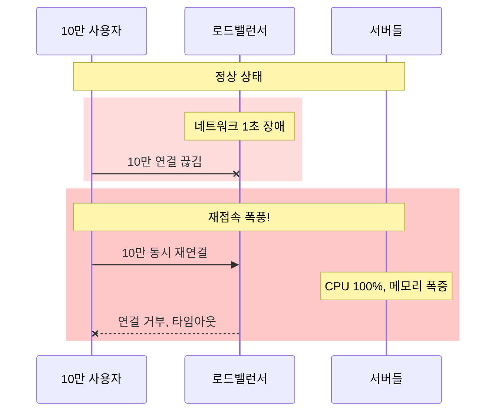

### 왜 WebSocket 재연결 폭풍이 더 위험한가? (HTTP vs WebSocket)

**HTTP 수천 요청과 WebSocket 수천 연결 요청은 근본적으로 다릅니다.**

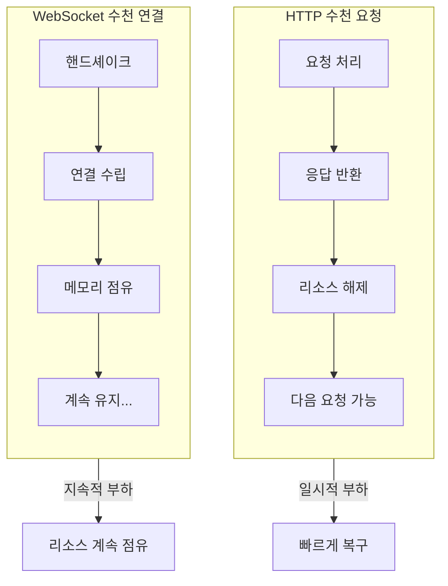

#### 핵심 차이점

| | HTTP 요청 | WebSocket 연결 |
|--|----------|---------------|
| **요청 후** | 응답하고 끝 | **연결 유지** |
| **리소스** | 처리 후 해제 | 연결 종료까지 점유 |
| **상태** | Stateless | Stateful |
| **핸드셰이크** | Keep-Alive면 재사용 | **매번** TCP+TLS+HTTP Upgrade |

#### 핸드셰이크 비용 비교

**HTTP 요청:**
```
1. TCP 연결 (Keep-Alive면 재사용)
2. TLS (세션 재사용 가능)
3. HTTP 요청/응답
4. 끝 - 리소스 해제
```

**WebSocket 연결:**
```
1. TCP 3-way handshake
2. TLS handshake (wss://)
3. HTTP Upgrade 요청
4. 101 Switching Protocols 응답
5. Sec-WebSocket-Accept 검증
6. 소켓 객체 생성 (메모리)
7. 이벤트 리스너 등록
8. 파일 디스크립터 할당
→ HTTP보다 훨씬 비용이 높음
```

#### 수치로 비교 (수천 개 기준)

| 항목 | HTTP 수천 요청 | WebSocket 수천 연결 |
|------|--------------|-------------------|
| **메모리** | 일시적 수 MB, 곧 해제 | 수십 GB **지속 점유** |
| **파일 디스크립터** | 재사용 가능 | 연결당 1개 점유 |
| **1초 후** | 대부분 처리 완료 | 연결 수립 중 |
| **1시간 후** | 정상 상태 | **여전히** 수천 개 점유 |

#### 악순환 구조

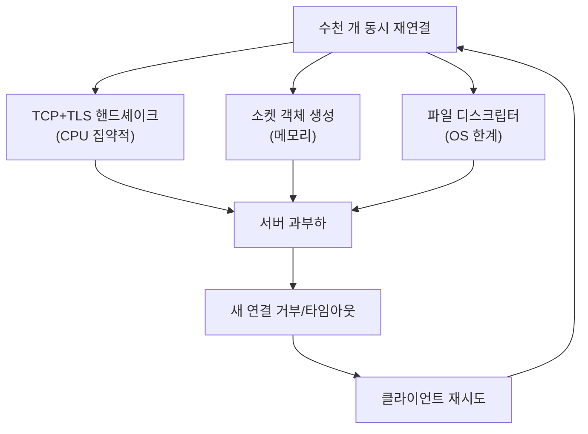

**결론:**
```
HTTP 수천 요청 = "잠깐 바쁨" (처리하면 끝)
WebSocket 수천 연결 = "영구적 부담" (연결 유지 비용)
```

---

### 대응 전략 1: 지수 백오프의 한계와 Full Jitter

**기본 지수 백오프**는 재시도 간격을 지수적으로 증가시키고, **Jitter**는 랜덤 지연을 추가합니다.

#### 기본 구현 (문제 있음)

```typescript
// 기본 방식: 고정 지연 + 작은 Jitter
function basicBackoff(attempt: number): number {
  const baseDelay = Math.min(1000 * Math.pow(2, attempt), 30000);
  const jitter = Math.random() * 1000; // 0~1초 Jitter
  return baseDelay + jitter;
}

// 1차: 1000 + (0~1000) = 1000~2000ms
// 2차: 2000 + (0~1000) = 2000~3000ms
// 3차: 4000 + (0~1000) = 4000~5000ms
```

#### 문제점: 여전히 밀집됨

```
장애 발생 시점 (t=0)
├── 클라이언트 1: 1초 + jitter = 1~2초 후 재연결
├── 클라이언트 2: 1초 + jitter = 1~2초 후 재연결
├── 클라이언트 3: 1초 + jitter = 1~2초 후 재연결
└── ... 수천 개가 1~2초 사이에 몰림!
```

**1초 범위의 Jitter로는 수천 개의 요청을 충분히 분산시키지 못합니다.**

#### 해결책: Full Jitter (AWS 권장)

```typescript
// Full Jitter: 0부터 계산된 값 사이에서 랜덤
function fullJitter(attempt: number): number {
  const ceiling = Math.min(30000, 1000 * Math.pow(2, attempt));
  return Math.random() * ceiling; // 0 ~ ceiling 사이 랜덤
}

// 1차: random(0, 1000)  → 0~1초 어디든
// 2차: random(0, 2000)  → 0~2초 어디든
// 3차: random(0, 4000)  → 0~4초 어디든
```

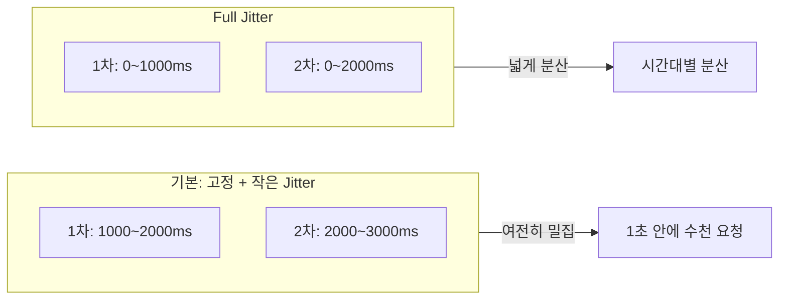

#### 추가 전략: Initial Delay

**1차 시도부터 분산시키려면 연결 끊김 감지 후 즉시가 아닌, 랜덤 지연 후 재연결:**

```typescript
function onDisconnect() {
  // 즉시 재연결 X
  // 0~5초 사이 랜덤 지연 후 첫 재연결 시도
  const initialDelay = Math.random() * 5000;

  setTimeout(() => {
    reconnectWithBackoff();
  }, initialDelay);
}
```

#### 지수 백오프의 진짜 효과

**1차 실패는 불가피합니다.** 지수 백오프의 효과는 2차, 3차 시도에서 나타납니다.

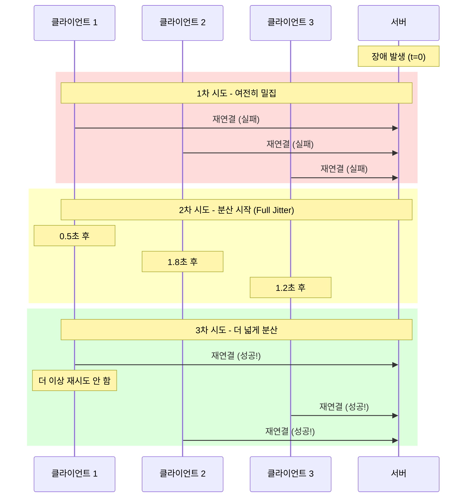

**핵심:** 성공한 클라이언트는 재시도 안 함 → 시간이 지날수록 부하 감소

#### 완전한 구현

```typescript
class ReconnectionStrategy {
  private attempt = 0;
  private maxDelay = 30000;

  getDelay(): number {
    // Full Jitter: 0부터 ceiling 사이 랜덤
    const ceiling = Math.min(
      this.maxDelay,
      1000 * Math.pow(2, this.attempt)
    );

    this.attempt++;
    return Math.random() * ceiling;
  }

  reset() {
    this.attempt = 0;
  }
}

function onDisconnect() {
  const strategy = new ReconnectionStrategy();

  // Initial Delay: 첫 시도부터 분산
  const initialDelay = Math.random() * 5000;

  setTimeout(() => reconnect(strategy), initialDelay);
}

function reconnect(strategy: ReconnectionStrategy) {
  const delay = strategy.getDelay();

  setTimeout(async () => {
    try {
      await connect();
      strategy.reset();
    } catch {
      reconnect(strategy);
    }
  }, delay);
}
```

#### 전략 비교

| 전략 | 1차 시도 | 2차+ 시도 | 효과 |
|------|---------|---------|------|
| **기본 백오프** | 밀집 | 약간 분산 | 부족 |
| **Full Jitter** | 밀집 | 넓게 분산 | 양호 |
| **Initial Delay** | 분산 | - | 1차에 효과 |
| **Full Jitter + Initial Delay** | 분산 | 넓게 분산 | **최선** |

### 대응 전략 2: Socket.IO 폴백

**Socket.IO는 WebSocket 실패 시 자동으로 Long Polling으로 폴백합니다.**

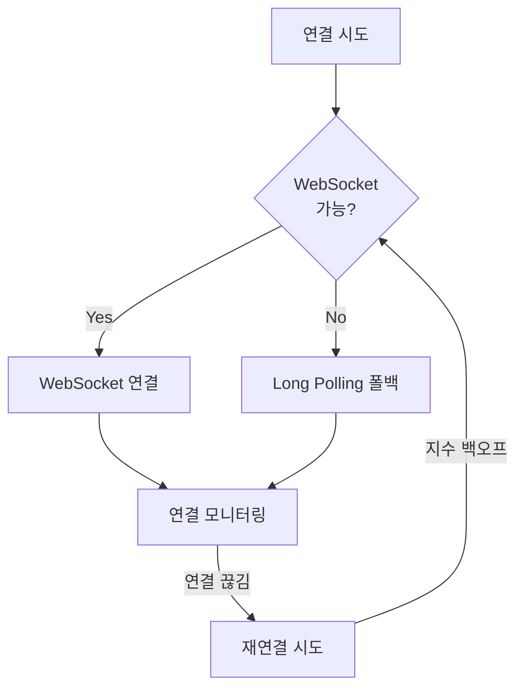

```javascript
// Socket.IO 클라이언트 설정
const socket = io('https://example.com', {
  // 폴백 순서
  transports: ['websocket', 'polling'],

  // 재연결 설정
  reconnection: true,
  reconnectionAttempts: 10,
  reconnectionDelay: 1000,
  reconnectionDelayMax: 30000,
  randomizationFactor: 0.5, // Jitter
});
```

### 대응 전략 3: 서버 측 보호

```typescript
// 연결 속도 제한 (Rate Limiting)
const connectionRateLimit = new RateLimit({
  windowMs: 1000, // 1초
  max: 1000, // 최대 1000 연결/초
  message: 'Too many connections',
});

// 서킷 브레이커
const circuitBreaker = new CircuitBreaker({
  threshold: 50, // 50% 실패 시
  timeout: 30000, // 30초 차단
  onOpen: () => console.log('Circuit opened: rejecting new connections'),
});
```

---

## A5. 언제 WebSocket을 선택하지 말아야 하는가

### 1. 단방향 상태 확인만 필요할 때

**SSE(Server-Sent Events)가 더 적합합니다.**

| 요구사항 | WebSocket | SSE |
|----------|:---------:|:---:|
| 서버→클라이언트 단방향 | 과도함 | 적합 |
| 양방향 통신 | 적합 | 부적합 |
| 자동 재연결 | 수동 구현 | 브라우저 내장 |
| HTTP 호환성 | 업그레이드 필요 | 100% 호환 |
| 방화벽 통과 | 차단 가능 | HTTP이므로 통과 |

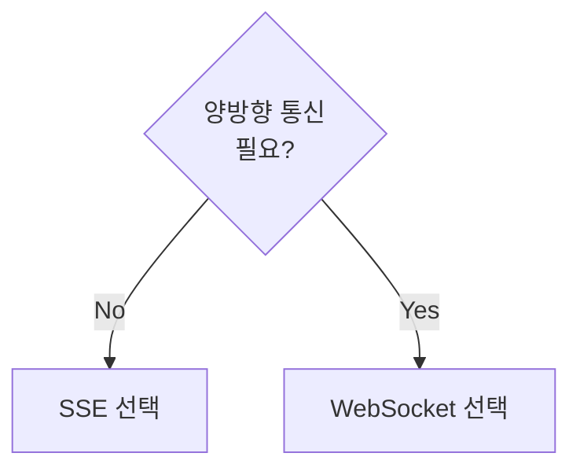

### 2. 50만+ 동시접속 환경

**연결 유지 비용이 요청 비용을 초과합니다.**

```
WebSocket: 50만 연결 × 10KB = 5GB 메모리 상주
Polling:   요청당 처리 후 해제 (Stateless)
```

| 항목 | WebSocket | 폴링 |
|------|:---------:|:----:|
| 서버 메모리 | 5~10GB | 낮음 |
| 스케일 아웃 | 복잡 | 서버 추가만 |
| 재접속 폭풍 | 위험 | 없음 |
| 로드밸런싱 | Sticky 필요 | 라운드로빈 |

**대기열, 상태 조회 같은 가벼운 요청은 폴링이 더 효율적입니다.**

### 3. 기업 네트워크 환경 (방화벽)

**많은 기업 방화벽과 프록시가 WebSocket을 차단합니다.**

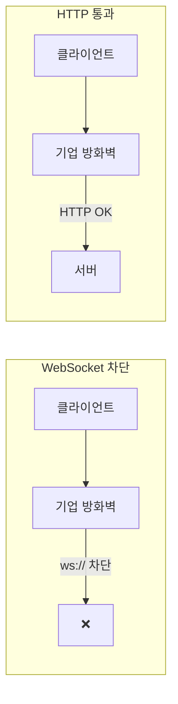

**이유:**
- `ws://`는 HTTP가 아닌 별도 프로토콜로 업그레이드
- 딥 패킷 검사(DPI)가 비-HTTP 트래픽 차단
- 보안 정책이 HTTP/HTTPS만 허용

**대안:**
- `wss://` (TLS 암호화) 사용 시 통과 확률 높음
- SSE 사용 (HTTP 기반)
- Long Polling 폴백

### 4. WebSocket을 선택해야 할 때

**반대로, 다음 상황에서는 WebSocket이 최선의 선택입니다.**

| 상황 | 이유 |
|------|------|
| **양방향 실시간 통신** | 채팅, 협업 도구 - 클라이언트도 서버로 데이터 전송 |
| **고빈도 메시지** | 초당 수십 건 이상 메시지 교환 시 HTTP 오버헤드 회피 |
| **저지연 필수** | 게임, 트레이딩 - 밀리초 단위 응답 필요 |
| **바이너리 데이터** | 파일 전송, 미디어 스트리밍 - 프레임 기반 효율적 전송 |
| **상태 기반 프로토콜** | 턴제 게임, 실시간 경매 - 연결 상태 유지 필요 |

### 기술 선택 플로우차트

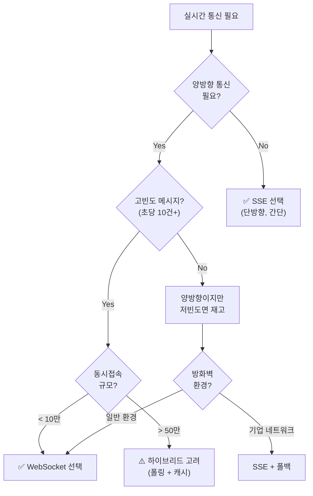

---

## A6. 2026년 기준 신기술: WebTransport

### WebTransport란?

**HTTP/3 기반의 양방향 통신 API입니다.** WebSocket의 후계자로 기대됩니다.

| 특성 | WebSocket | WebTransport |
|------|-----------|--------------|
| **기반 프로토콜** | TCP | QUIC (UDP) |
| **핸드셰이크** | TCP + TLS + HTTP | QUIC (더 빠름) |
| **스트림** | 단일 연결 | 다중 스트림 |
| **신뢰성** | 항상 신뢰 | 선택 가능 (신뢰/비신뢰) |
| **지연 시간** | 중간 | 낮음 |

### 브라우저 지원 현황 (2026년)

| 브라우저 | 지원 |
|----------|:----:|
| Chrome | ✅ |
| Edge | ✅ |
| Firefox | 🔄 실험적 |
| Safari | ❌ 미지원 |

**결론:** WebSocket이 현재 실용적인 선택. WebTransport는 2~3년 후 생태계 성숙 시 대안.

---

## 요약

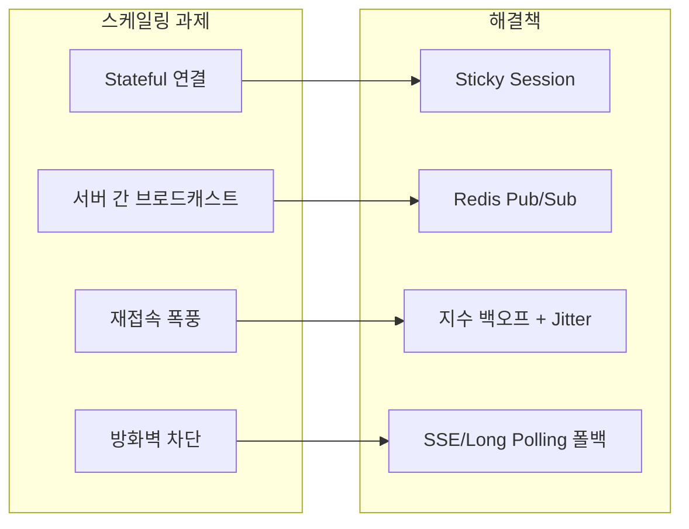

| 핵심 개념 | 설명 |
|----------|------|
| **Stateful 연결** | 로드밸런싱에 Sticky Session 필요 |
| **Redis Pub/Sub** | 서버 간 메시지 브로드캐스트 |
| **HTTP vs WS 연결** | HTTP는 처리 후 해제, WS는 계속 점유 |
| **재접속 폭풍** | Full Jitter + Initial Delay로 완화 |
| **대안 기술** | SSE (단방향), 폴링 (대규모) |
| **WebTransport** | 미래 기술, 현재는 WebSocket 사용 |

---

## 면접 질문 대비

### Q: "WebSocket 서버를 어떻게 스케일 아웃하겠습니까?"

**모범 답변:**
> "WebSocket은 Stateful 연결이므로 HTTP와 다른 전략이 필요합니다.
>
> 1. **로드밸런서**: L7 + Sticky Session (쿠키 또는 IP 해시)
> 2. **서버 간 통신**: Redis Pub/Sub로 메시지 브로드캐스트
> 3. **재접속 대비**: 지수 백오프 + Jitter 재연결 로직
> 4. **모니터링**: 연결 수, 메모리, 재연결률 모니터링
>
> 단, 50만+ 대규모 환경에서는 연결 유지 비용을 고려하여 폴링이나 SSE도 검토하겠습니다."

---

이전 섹션: [07. 실제 코드 분석](../07-real-world/)
