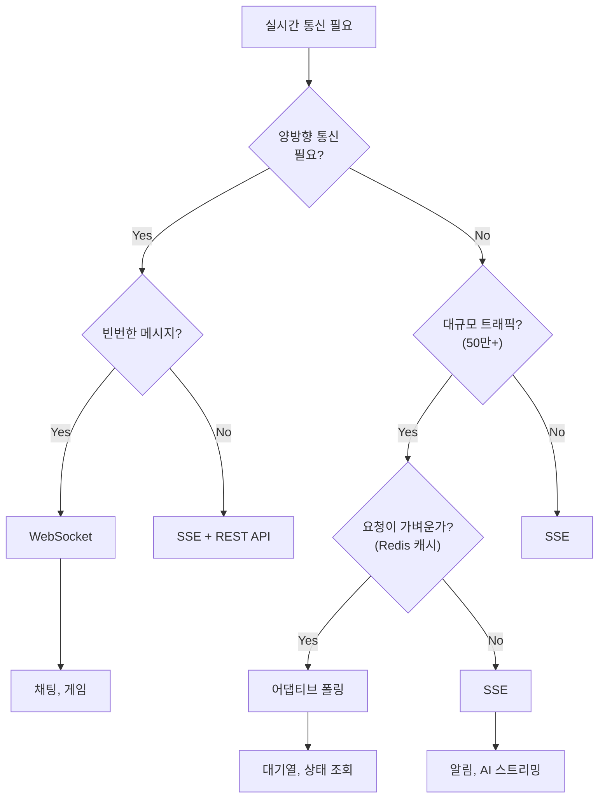

# SSE (Server-Sent Events) POC

## 학습 목표

1. **SSE 개념 이해**: HTTP 기반 서버→클라이언트 단방향 실시간 통신
2. **EventSource API 마스터**: 브라우저 내장 API 활용
3. **WebSocket과의 차이점 파악**: 언제 SSE를, 언제 WebSocket을 선택해야 하는가
4. **React 통합**: 실무에서 SSE를 React 애플리케이션에 적용하는 방법

---

## 환경 설정

### 통합 서버 실행

```bash
cd practice/server && go run main.go
```

서버가 `http://localhost:3001`에서 실행됩니다.

### 통합 React 앱 실행

```bash
cd practice/react-app && npm install && npm run dev
```

`http://localhost:5173`에서 챕터별 실습 페이지를 확인하세요.

---

## 3단계 학습 흐름

각 섹션은 다음 3단계로 구성됩니다:

### 1. INVESTIGATE.md (조사)
- 스스로 답해볼 질문들
- 학습 전 사전 지식 점검
- "왜?"라는 질문에 집중

### 2. LEARN.md (학습)
- 핵심 개념 설명
- 코드 예제와 함께 이해
- 실무 관점의 인사이트

### 3. practice/ (실습)
- 직접 코드 작성
- 브라우저에서 동작 확인
- 다양한 시나리오 테스트

---

## 목차

| 섹션 | 주제 | 설명 | 실습 |
|------|------|------|------|
| **00** | [실시간 통신 개론](./learning/00-realtime-overview/) | 폴링/롱폴링/SSE/WebSocket 역사와 비교 | - |
| **01** | [SSE 기초](./learning/01-basics/) | SSE란? HTTP 기반 실시간 통신의 원리 | - |
| **02** | [EventSource API](./learning/02-eventsource-api/) | 브라우저 내장 API 사용법 | DONE |
| **03** | [커스텀 이벤트](./learning/03-custom-events/) | event: 필드로 이벤트 타입 분리 | DONE |
| **04** | [재연결](./learning/04-reconnection/) | 자동 재연결, Last-Event-ID | TODO |
| **05** | [에러 처리](./learning/05-error-handling/) | 에러 핸들링 패턴 | TODO |
| **06** | [React 통합](./learning/06-react-integration/) | useSSE 훅, fetch-event-source | TODO |
| **07** | [WebSocket 비교](./learning/07-websocket-comparison/) | 심층 비교 및 선택 기준 | THEORY |
| **08** | [대규모 트래픽 아키텍처](./learning/08-large-scale-architecture/) | 50만+ 동시접속, 폴링 vs 소켓 | TODO |

---

## SSE vs WebSocket 한눈에 보기

| 항목 | SSE | WebSocket |
|------|-----|-----------|
| **통신 방향** | 단방향 (서버→클라이언트) | 양방향 |
| **프로토콜** | HTTP/HTTPS | ws:// / wss:// |
| **데이터 형식** | UTF-8 텍스트만 | 텍스트 + 바이너리 |
| **재연결** | 자동 | 수동 구현 필요 |
| **방화벽** | HTTP이므로 통과 용이 | 차단 가능성 있음 |
| **복잡도** | 낮음 | 높음 |

**SSE 적합**: 뉴스피드, 주식 시세, 알림, AI 스트리밍 (ChatGPT)
**WebSocket 적합**: 채팅, 게임, 실시간 협업

---

## 실시간 통신 기술 선택 가이드



### 2026년 기준 핵심 인사이트

| 기술 | 최적 사용 사례 | 확장성 |
|------|---------------|--------|
| **SSE** | 단방향 서버→클라이언트 푸시 (알림, 피드, AI) | 확장 용이 |
| **WebSocket** | 양방향 인터랙티브 앱 (채팅, 게임, 트레이딩) | 인프라 투자 필요 |
| **폴링** | 대규모 단방향 상태 확인 (대기열) | 매우 확장 용이 |

> "무엇을 선택할지 모르겠다면 — SSE로 시작하세요. 80% 경우에 작동합니다." — DEV Community

---

## 참고 자료

### 공식 문서
- [MDN - Server-Sent Events](https://developer.mozilla.org/en-US/docs/Web/API/Server-sent_events/Using_server-sent_events)
- [MDN - EventSource API](https://developer.mozilla.org/en-US/docs/Web/API/EventSource)
- [HTML Living Standard - SSE](https://html.spec.whatwg.org/multipage/server-sent-events.html)

### 비교 분석
- [Ably - WebSockets vs SSE 2024](https://ably.com/blog/websockets-vs-sse)
- [SoftwareMill - SSE vs WebSockets](https://softwaremill.com/sse-vs-websockets-comparing-real-time-communication-protocols/)

### 라이브러리
- [@microsoft/fetch-event-source](https://github.com/Azure/fetch-event-source) - POST 지원, 커스텀 헤더

---

## 디렉토리 구조

```
09-sse/
├── README.md                        # 이 파일
├── learning/                        # 학습 문서 통합
│   ├── 00-realtime-overview/
│   │   ├── LEARN.md
│   │   └── INVESTIGATE.md
│   ├── 01-basics/
│   ├── 02-eventsource-api/
│   ├── 03-custom-events/
│   ├── 04-reconnection/
│   ├── 05-error-handling/
│   ├── 06-react-integration/
│   ├── 07-websocket-comparison/
│   ├── 08-large-scale-architecture/
│   └── reference/                   # 참조 문서
└── practice/                        # 통합 실습 프로젝트
    ├── react-app/                   # 단일 React 앱 (챕터별 라우팅)
    │   └── src/
    │       ├── hooks/ch{XX}/        # 챕터별 훅
    │       ├── components/ch{XX}/   # 챕터별 컴포넌트
    │       └── pages/               # 챕터별 페이지
    └── server/                      # 통합 Go 서버 (포트 3001)
        └── main.go
```
