# 00. 실시간 통신 기술 개론 - 학습 (LEARN)

## 학습 목표
웹 실시간 통신 기술의 역사적 발전 과정을 이해하고, 각 기술의 동작 원리와 트레이드오프를 면접에서 설명할 수 있다.

---

## A1. 웹 실시간 통신의 발전사

### iframe/frame 시대 (1990년대)

**1990년대 웹은 페이지 전체를 새로고침해야만 데이터를 업데이트할 수 있었습니다.** 당시 웹은 문서를 보여주는 용도로 설계되었기 때문에, 서버에서 새 데이터를 가져오려면 브라우저가 완전히 새로운 페이지를 요청해야 했습니다.

개발자들은 "실시간"처럼 보이게 하기 위해 숨겨진 `<iframe>`이나 `<frameset>`을 사용했습니다. 화면에 보이지 않는 iframe이 주기적으로 서버에 요청을 보내고, 응답을 받으면 JavaScript로 메인 화면을 업데이트하는 방식이었습니다.

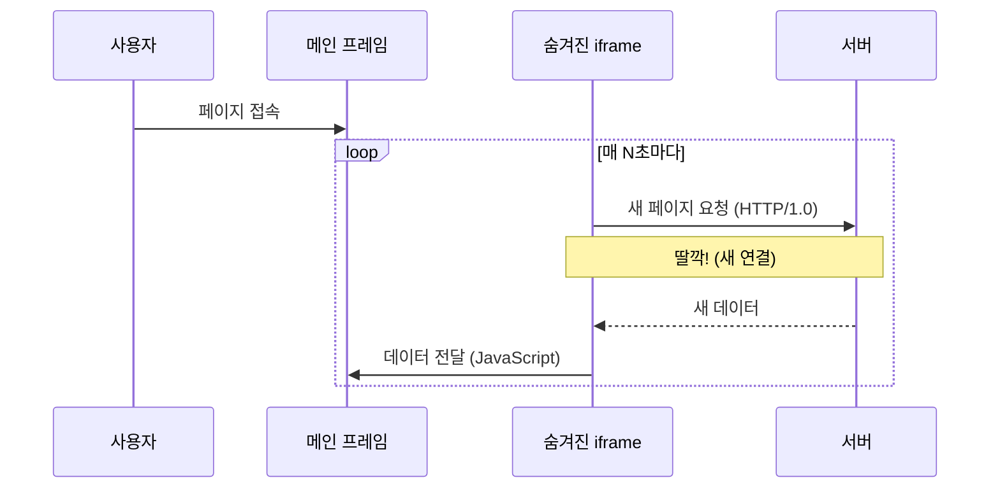

**왜 "딸깍딸깍" 소리가 났을까?**

HTTP/1.0은 **매 요청마다 새 TCP 연결**을 수립했습니다. TCP 연결을 맺으려면 클라이언트와 서버가 3번의 패킷을 주고받아야 하는데(3-way handshake), 이 과정에서 브라우저가 네트워크 활동을 사용자에게 알려주었습니다. 숨겨진 iframe이 새 페이지를 로드할 때마다 브라우저는 연결음을 재생하고, 상태 표시줄에 스피너를 보여주었습니다. 이런 시청각적 피드백이 사용자 경험을 크게 방해했습니다.

**문제점:**

첫째, 매 요청마다 TCP 3-way handshake 오버헤드가 발생했습니다. 실제 데이터 전송 전에 연결을 맺는 데만 1.5 RTT(Round Trip Time)가 소요되었습니다.

둘째, 단순히 데이터 몇 바이트만 필요해도 전체 HTML 페이지를 매번 로드해야 했습니다. 헤더, 스타일, 스크립트 등 불필요한 데이터가 매번 함께 전송되었습니다.

셋째, iframe이 페이지를 로드할 때마다 브라우저 히스토리에 기록이 남았습니다. 사용자가 뒤로 가기 버튼을 누르면 예상치 못한 동작이 발생할 수 있었습니다.

넷째, iframe 내부의 JavaScript와 메인 프레임 간의 통신 과정에서 메모리 누수가 자주 발생했습니다. 장시간 페이지를 열어두면 브라우저가 느려지거나 충돌하는 문제가 있었습니다.

### XMLHttpRequest 시대 (2000년대)

**Ajax(Asynchronous JavaScript and XML)의 등장으로 페이지 새로고침 없이 데이터를 가져올 수 있게 되었습니다.** 2005년 Google이 Gmail과 Google Maps에서 Ajax를 본격적으로 사용하면서 웹 개발 패러다임이 완전히 바뀌었습니다.

Ajax의 핵심은 `XMLHttpRequest` 객체입니다. 이 객체를 사용하면 JavaScript가 백그라운드에서 서버와 통신할 수 있습니다. 사용자는 페이지가 멈추는 것을 느끼지 못하고, 필요한 부분만 동적으로 업데이트됩니다.

```javascript
// 2005년경 Ajax 코드
var xhr = new XMLHttpRequest();
xhr.open('GET', '/api/data', true);  // true = 비동기 요청
xhr.onreadystatechange = function() {
  // readyState 4 = 요청 완료, status 200 = 성공
  if (xhr.readyState === 4 && xhr.status === 200) {
    updateUI(JSON.parse(xhr.responseText));
  }
};
xhr.send();
```

**핵심 개선점:**

첫째, 페이지 새로고침 없이 서버와 통신할 수 있게 되었습니다. 전체 HTML을 다시 받아오는 대신, 필요한 데이터만 JSON이나 XML 형식으로 주고받습니다. 이로 인해 사용자 경험이 데스크톱 애플리케이션에 가까워졌습니다.

둘째, 필요한 데이터만 요청하고 수신합니다. iframe 방식에서는 전체 HTML 페이지를 받아야 했지만, Ajax는 실제로 필요한 데이터 몇 바이트만 전송합니다. 네트워크 대역폭과 서버 리소스를 크게 절약할 수 있습니다.

셋째, 비동기 처리로 UI 블로킹을 방지합니다. `xhr.open()`의 세 번째 인자 `true`가 비동기를 의미합니다. 요청을 보낸 후 응답을 기다리는 동안에도 사용자는 페이지와 상호작용할 수 있습니다. 동기 방식(`false`)을 사용하면 응답이 올 때까지 브라우저가 완전히 멈춥니다.

### 기술 발전 타임라인

웹 실시간 통신 기술은 약 30년에 걸쳐 발전해왔습니다. 각 기술은 이전 기술의 한계를 극복하기 위해 등장했습니다.

1990년대의 iframe 방식은 페이지 전체를 리로드하는 비효율적인 방식이었습니다. 2000년대에 Ajax가 등장하면서 폴링이 가능해졌고, 곧이어 Long Polling(Comet)이 실시간성을 개선했습니다. 2010년대에는 HTML5 표준으로 SSE가, RFC 6455로 WebSocket이 정식 등장했습니다. 2020년대에는 HTTP/2의 멀티플렉싱이 SSE의 연결 제한 문제를 해결했고, HTTP/3 기반의 WebTransport가 새로운 가능성을 열고 있습니다.

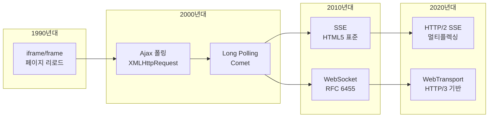

Long Polling에서 두 갈래로 나뉜 이유가 있습니다. SSE는 "단방향이지만 단순하게"라는 방향으로, WebSocket은 "양방향 완전 지원"이라는 방향으로 각각 발전했습니다. 둘은 경쟁 관계가 아니라 용도에 따라 선택하는 상호 보완적 기술입니다.

---

## A2. 폴링 (Polling)

### 동작 원리

**폴링은 클라이언트가 일정 주기로 서버에 요청을 보내 새 데이터를 확인하는 방식입니다.** "새 메일 있어요?" "없어요." "새 메일 있어요?" "없어요." 이런 식으로 계속 물어보는 것과 같습니다.

가장 단순하고 구현하기 쉬운 실시간 통신 방법입니다. 서버는 별도의 상태를 유지할 필요 없이, 요청이 오면 현재 데이터를 반환하면 됩니다. 클라이언트도 `setInterval`로 주기적으로 요청만 보내면 되므로 로직이 단순합니다.

다음 다이어그램은 5초 폴링의 동작을 보여줍니다. 클라이언트가 5초마다 서버에 요청을 보내고, 서버는 즉시 응답합니다. 주목할 점은 **t=3s에 데이터가 생성되었지만, 클라이언트가 이를 알게 되는 것은 t=10s**라는 것입니다. 폴링 주기(5초) 때문에 최대 7초의 지연이 발생합니다.

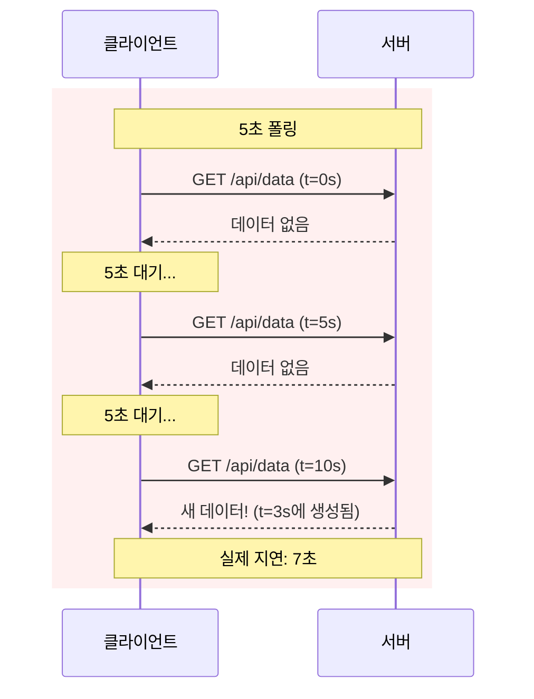

**실무 예시: 환율 조회 서비스**

은행 환율 조회 서비스를 생각해봅시다. 환율은 분 단위로 업데이트되고, 사용자는 "대략적인" 현재 환율만 알면 됩니다. 이 경우 30초 폴링이면 충분합니다. 30초 간격으로 요청해도 사용자 경험에 문제가 없고, 서버 부하도 적습니다.

### 구현 예시 (React-TypeScript)

```tsx
import { useState, useEffect, useCallback } from 'react';

interface PollingData {
  [key: string]: unknown;
}

// 커스텀 훅: usePolling
function usePolling<T = PollingData>(url: string, interval: number) {
  const [data, setData] = useState<T | null>(null);
  const [error, setError] = useState<Error | null>(null);
  const [isPolling, setIsPolling] = useState(true);

  useEffect(() => {
    if (!isPolling) return;

    const poll = async () => {
      try {
        const response = await fetch(url);
        if (!response.ok) throw new Error(`HTTP ${response.status}`);
        const result = await response.json();
        setData(result);
        setError(null);
      } catch (err) {
        console.error('Polling error:', err);
        setError(err instanceof Error ? err : new Error('Unknown error'));
      }
    };

    // 즉시 1회 실행 후 주기적 실행
    poll();
    const pollerId = setInterval(poll, interval);

    // 클린업
    return () => clearInterval(pollerId);
  }, [url, interval, isPolling]);

  const stop = useCallback(() => setIsPolling(false), []);
  const start = useCallback(() => setIsPolling(true), []);

  return { data, error, isPolling, stop, start };
}

// 사용 예시
function PollingComponent() {
  const { data, error, isPolling, stop, start } = usePolling<{ message: string }>(
    '/api/data',
    5000 // 5초마다
  );

  return (
    <div>
      <p>Status: {isPolling ? 'Polling...' : 'Stopped'}</p>
      {error && <p style={{ color: 'red' }}>Error: {error.message}</p>}
      {data && <p>Data: {JSON.stringify(data)}</p>}
      <button onClick={isPolling ? stop : start}>
        {isPolling ? 'Stop' : 'Start'}
      </button>
    </div>
  );
}

export { usePolling, PollingComponent };
```

### 장단점

폴링의 장단점을 이해하면 언제 사용해야 하는지 판단할 수 있습니다.

| 장점 | 단점 |
|------|------|
| 구현이 매우 간단 | 불필요한 요청 발생 (데이터 없어도 요청) |
| HTTP 인프라와 완벽 호환 | 실시간성 낮음 (폴링 주기만큼 지연) |
| 상태 비저장 (Stateless) | 서버 부하 (N명 * 요청/분) |
| 방화벽/프록시 문제 없음 | 네트워크 대역폭 낭비 |
| 디버깅 용이 | 배터리 소모 (모바일) |

**장점을 좀 더 설명하면:**

"구현이 매우 간단"하다는 것은 클라이언트에서 `setInterval`과 `fetch`만 있으면 된다는 의미입니다. 서버도 일반 REST API처럼 요청-응답만 처리하면 됩니다.

"HTTP 인프라와 완벽 호환"이라는 것은 기존 로드밸런서, CDN, 프록시 설정을 전혀 바꾸지 않아도 된다는 의미입니다. 일반 HTTP 요청과 똑같이 동작하기 때문입니다.

"상태 비저장"은 서버가 어떤 클라이언트가 연결되어 있는지 기억할 필요가 없다는 의미입니다. 이는 서버 확장(scale-out)을 쉽게 만들어줍니다.

**단점을 좀 더 설명하면:**

"서버 부하"를 계산해봅시다. 1,000명이 5초 폴링을 한다면, 초당 200개의 요청이 발생합니다. 대부분의 요청은 "새 데이터 없음"이라는 빈 응답을 받게 되어 낭비입니다.

"배터리 소모"는 모바일에서 특히 문제입니다. 스마트폰은 네트워크 요청을 보낼 때마다 라디오를 활성화하는데, 이것이 배터리를 많이 소모합니다.

### 폴링 주기의 트레이드오프

폴링 주기를 어떻게 설정하느냐에 따라 실시간성과 서버 부하 사이에서 균형을 잡아야 합니다. 짧은 주기는 실시간성을 높이지만 서버 부하를 증가시키고, 긴 주기는 그 반대입니다.

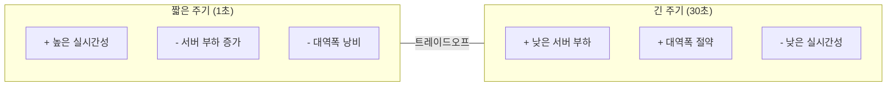

**실무 가이드라인:**

1초 폴링은 실시간 경매, 라이브 스코어보드처럼 즉각적인 업데이트가 필요한 경우에만 사용합니다. 하지만 이 경우 SSE나 WebSocket을 고려하는 것이 더 나을 수 있습니다.

5-10초 폴링은 알림 확인, 새 메시지 확인 등에 적합합니다. 사용자가 "약간의 지연"을 인지하지 못하는 수준입니다.

30초 이상 폴링은 환율, 날씨, 시스템 상태 모니터링처럼 변화가 느린 데이터에 적합합니다.

### 적합한 사용 사례

| 상황 | 이유 |
|------|------|
| 업데이트 빈도가 예측 가능하고 낮음 | 불필요한 요청 최소화 가능 |
| 레거시 시스템 통합 | 추가 인프라 불필요 |
| 서버가 푸시를 지원하지 않음 | 유일한 선택지 |
| 정확한 타이밍보다 "대략적" 업데이트 | 약간의 지연 허용 가능 |

**실무 예시: 레거시 시스템 통합**

10년 된 ERP 시스템과 새 대시보드를 연동해야 한다고 가정합니다. ERP는 WebSocket이나 SSE를 지원하지 않고, 방화벽 설정을 변경하는 것도 어렵습니다. 이 경우 30초 폴링이 가장 현실적인 선택입니다. 기존 REST API만 호출하면 되므로 추가 인프라 변경 없이 구현할 수 있습니다.

---

## A3. 롱폴링 (Long Polling)

### 동작 원리

**롱폴링은 서버가 새 데이터가 생길 때까지 응답을 보류(hold)하는 방식입니다.** 일반 폴링이 "새 데이터 있어?" "없어" "새 데이터 있어?" "없어"를 반복한다면, 롱폴링은 "새 데이터 있어?" "(한참 기다리다가) 있어, 여기!" 방식입니다.

폴링의 핵심 단점은 "불필요한 요청"입니다. 데이터가 없어도 계속 요청을 보냅니다. 롱폴링은 이 문제를 해결합니다. 서버가 데이터가 생길 때까지 응답을 보내지 않고 기다리기 때문에, 클라이언트는 데이터가 있을 때만 응답을 받습니다.

다음 다이어그램은 롱폴링의 핵심 동작을 보여줍니다. 클라이언트가 요청을 보내면 서버는 즉시 응답하지 않고 대기합니다. 새 데이터가 생기면 그때서야 응답을 보냅니다. 클라이언트는 응답을 받자마자 즉시 다음 요청을 보내 "대기 상태"를 유지합니다.

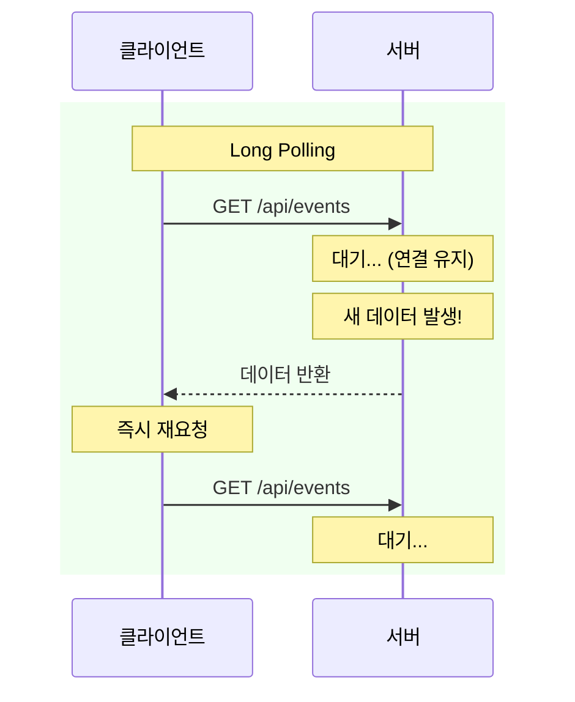

**실무 예시: 실시간 알림 시스템**

Facebook의 초기 알림 시스템이 롱폴링을 사용했습니다. 사용자가 페이지를 열면 클라이언트는 `/notifications` 엔드포인트에 요청을 보냅니다. 서버는 새 알림이 생길 때까지 최대 30초간 응답을 보류합니다. 새 알림이 생기면 즉시 응답하고, 클라이언트는 알림을 표시한 후 다시 요청을 보냅니다. 30초 동안 알림이 없으면 빈 응답을 보내고, 클라이언트는 다시 요청합니다.

### 서버 측 구현 예시 (Go)

```go
package main

import (
	"encoding/json"
	"net/http"
	"sync"
	"time"
)

type waitingClient struct {
	responseChan chan []any
	done         chan struct{}
}

var (
	waitingClients = make(map[*waitingClient]struct{})
	clientsMu      sync.Mutex
)

// 서버 측: 데이터 발생 시까지 응답 보류
func longPollHandler(w http.ResponseWriter, r *http.Request) {
	client := &waitingClient{
		responseChan: make(chan []any, 1),
		done:         make(chan struct{}),
	}

	clientsMu.Lock()
	waitingClients[client] = struct{}{}
	clientsMu.Unlock()

	defer func() {
		clientsMu.Lock()
		delete(waitingClients, client)
		clientsMu.Unlock()
		close(client.done)
	}()

	select {
	case events := <-client.responseChan:
		// 새 이벤트 발생
		json.NewEncoder(w).Encode(map[string]any{"events": events})
	case <-time.After(30 * time.Second):
		// 30초 타임아웃: 빈 응답
		json.NewEncoder(w).Encode(map[string]any{"events": []any{}, "timeout": true})
	case <-r.Context().Done():
		// 클라이언트 연결 종료
		return
	}
}

// 새 이벤트 발생 시 대기 클라이언트들에게 전송
func notifyClients(event any) {
	clientsMu.Lock()
	defer clientsMu.Unlock()

	for client := range waitingClients {
		select {
		case client.responseChan <- []any{event}:
		default:
		}
	}
	// clear map
	waitingClients = make(map[*waitingClient]struct{})
}

func main() {
	http.HandleFunc("/api/events", longPollHandler)
	http.ListenAndServe(":8080", nil)
}
```

### 클라이언트 측 구현 예시 (React-TypeScript)

```tsx
import { useState, useEffect, useRef, useCallback } from 'react';

interface LongPollResponse<T> {
  events: T[];
  timeout?: boolean;
}

// 커스텀 훅: useLongPolling
function useLongPolling<T = unknown>(url: string) {
  const [events, setEvents] = useState<T[]>([]);
  const [error, setError] = useState<Error | null>(null);
  const [isConnected, setIsConnected] = useState(true);
  const abortControllerRef = useRef<AbortController | null>(null);

  const longPoll = useCallback(async () => {
    while (true) {
      // AbortController 생성 (타임아웃보다 약간 길게)
      abortControllerRef.current = new AbortController();
      const timeoutId = setTimeout(() => abortControllerRef.current?.abort(), 35000);

      try {
        const response = await fetch(url, {
          signal: abortControllerRef.current.signal,
        });

        clearTimeout(timeoutId);

        if (!response.ok) throw new Error(`HTTP ${response.status}`);

        const data: LongPollResponse<T> = await response.json();

        if (data.events.length > 0) {
          setEvents((prev) => [...prev, ...data.events]);
        }

        setError(null);
        // 즉시 다음 요청 (루프)
      } catch (err) {
        clearTimeout(timeoutId);

        // AbortError는 정상 종료 또는 타임아웃
        if (err instanceof Error && err.name === 'AbortError') {
          // 컴포넌트 언마운트로 인한 중단이면 루프 종료
          if (!abortControllerRef.current) return;
          continue; // 타임아웃은 정상, 재요청
        }

        console.error('Long poll error:', err);
        setError(err instanceof Error ? err : new Error('Unknown error'));

        // 오류 시 5초 대기 후 재시도
        await new Promise((resolve) => setTimeout(resolve, 5000));
      }
    }
  }, [url]);

  useEffect(() => {
    if (!isConnected) return;

    longPoll();

    // 클린업: 연결 중단
    return () => {
      abortControllerRef.current?.abort();
      abortControllerRef.current = null;
    };
  }, [longPoll, isConnected]);

  const disconnect = useCallback(() => {
    setIsConnected(false);
    abortControllerRef.current?.abort();
  }, []);

  const connect = useCallback(() => {
    setIsConnected(true);
  }, []);

  const clearEvents = useCallback(() => setEvents([]), []);

  return { events, error, isConnected, disconnect, connect, clearEvents };
}

// 사용 예시
function LongPollingComponent() {
  const { events, error, isConnected, disconnect, connect, clearEvents } =
    useLongPolling<{ id: number; message: string }>('/api/events');

  return (
    <div>
      <p>Status: {isConnected ? 'Connected' : 'Disconnected'}</p>
      {error && <p style={{ color: 'red' }}>Error: {error.message}</p>}

      <div>
        <h3>Events ({events.length})</h3>
        <ul>
          {events.map((event, idx) => (
            <li key={idx}>{JSON.stringify(event)}</li>
          ))}
        </ul>
      </div>

      <button onClick={isConnected ? disconnect : connect}>
        {isConnected ? 'Disconnect' : 'Connect'}
      </button>
      <button onClick={clearEvents}>Clear</button>
    </div>
  );
}

export { useLongPolling, LongPollingComponent };
```

### 타임아웃이 필요한 이유

롱폴링에서 타임아웃은 선택이 아닌 필수입니다. 타임아웃 없이 무한정 대기하면 여러 문제가 발생합니다.

다음 다이어그램에서 왼쪽은 타임아웃이 없는 경우입니다. 서버가 무한 대기하면 중간의 프록시나 로드밸런서가 "유휴 연결"로 판단하고 강제로 종료합니다. 문제는 클라이언트가 이 사실을 모른다는 것입니다. 클라이언트는 아직 연결이 살아있다고 생각하며 응답을 기다립니다.

오른쪽은 30초 타임아웃을 설정한 경우입니다. 데이터가 없더라도 30초가 지나면 빈 응답을 보냅니다. 클라이언트는 이를 받고 즉시 재요청하여 "대기 상태"를 유지합니다. 이 방식으로 연결 상태를 주기적으로 확인할 수 있습니다.

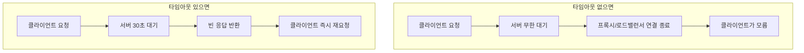

**타임아웃 설정 이유를 상세히 설명하면:**

첫째, **프록시/로드밸런서 호환성**입니다. AWS ALB는 기본 60초, Nginx는 기본 60초, Cloudflare는 100초 후에 유휴 연결을 종료합니다. 타임아웃을 이보다 짧게(보통 30초) 설정해야 프록시가 연결을 먼저 끊는 것을 방지할 수 있습니다.

둘째, **네트워크 불안정 감지**입니다. TCP 연결은 상대방이 갑자기 사라져도(예: 모바일에서 터널 진입) 바로 알 수 없습니다. 타임아웃 주기로 요청-응답을 주고받으면 연결 상태를 확인할 수 있습니다.

셋째, **서버 리소스 정리**입니다. 서버는 대기 중인 클라이언트를 메모리에 보관합니다. 클라이언트가 갑자기 사라지면 이 메모리가 해제되지 않습니다. 타임아웃으로 주기적으로 정리해야 메모리 누수를 방지할 수 있습니다.

넷째, **재연결 기회**입니다. 30초마다 새 요청을 보내면, 로드밸런서가 다른 서버로 요청을 보낼 기회가 생깁니다. 이는 서버 간 부하 분산과 장애 복구에 도움이 됩니다.

### 장단점

롱폴링은 폴링의 "불필요한 요청" 문제를 해결하지만, 새로운 복잡성을 도입합니다.

| 장점 | 단점 |
|------|------|
| 폴링보다 높은 실시간성 | 서버 연결 유지 비용 (메모리, 스레드) |
| 데이터 있을 때만 응답 | 요청-응답 주기마다 HTTP 오버헤드 |
| HTTP 인프라 호환 | 타임아웃/재연결 로직 복잡 |
| 방화벽 문제 없음 | 동시 접속 수 제한 |

**장점을 좀 더 설명하면:**

"폴링보다 높은 실시간성"은 데이터가 생기자마자 클라이언트에게 전달되기 때문입니다. 폴링은 최대 폴링 주기만큼 지연되지만, 롱폴링은 거의 즉시 전달됩니다.

"데이터 있을 때만 응답"은 불필요한 네트워크 트래픽을 줄입니다. 폴링에서 1,000명이 5초 폴링을 하면 초당 200개 요청이 발생하지만, 롱폴링에서는 실제 데이터가 있을 때만 응답이 오갑니다.

**단점을 좀 더 설명하면:**

"서버 연결 유지 비용"은 롱폴링의 가장 큰 단점입니다. 서버는 대기 중인 모든 클라이언트의 연결을 메모리에 유지해야 합니다. 1,000명이 접속하면 1,000개의 연결이 열려 있습니다. 이는 스레드 기반 서버(Apache)에서 특히 문제가 됩니다. Node.js나 Go처럼 비동기 I/O를 지원하는 환경에서는 영향이 적습니다.

"동시 접속 수 제한"은 HTTP/1.1에서 브라우저가 도메인당 6개의 동시 연결만 허용하기 때문입니다. 롱폴링이 1개의 연결을 계속 점유하면 다른 HTTP 요청에 사용할 수 있는 연결이 5개로 줄어듭니다.

### 폴링 vs 롱폴링 비교

두 방식의 핵심 차이를 시각적으로 비교합니다. 폴링은 클라이언트가 주기적으로 "물어보는" 방식이고, 롱폴링은 서버가 "알려주는" 방식입니다.

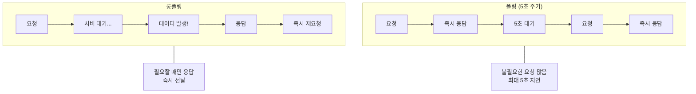

**핵심 차이점 요약:**

폴링에서 요청 횟수는 `시간 / 폴링주기`로 고정됩니다. 1시간 동안 5초 폴링이면 720번 요청합니다. 데이터 유무와 관계없이 항상 같은 횟수입니다.

롱폴링에서 요청 횟수는 `데이터 발생 횟수 + 타임아웃 횟수`입니다. 1시간 동안 데이터가 10번 발생하고 30초 타임아웃이면, 최대 130번(10번 + 120번) 요청합니다. 데이터가 많이 발생하면 요청도 많아지지만, 폴링보다는 적습니다.

---

## A4. 기술 비교표 (2026년 기준)

### 핵심 비교

각 기술을 여러 관점에서 비교합니다. 이 표를 통해 상황에 맞는 기술을 선택할 수 있습니다.

| 기술 | 통신 방향 | 실시간성 | 요청 오버헤드 | 서버 부하 | 확장성 | 방화벽 |
|:----:|:---------:|:--------:|:------------:|:---------:|:------:|:------:|
| **Polling** | 단방향 | 낮음 | 높음 | 중간 | 쉬움 | 통과 |
| **Long Polling** | 단방향 | 중간 | 중간 | 높음 | 어려움 | 통과 |
| **SSE** | 단방향 | 높음 | 낮음 | 낮음 | 쉬움 | 통과 |
| **WebSocket** | 양방향 | 높음 | 매우 낮음 | 높음 | 어려움 | 차단 가능 |

**표를 읽는 방법:**

"요청 오버헤드"는 HTTP 헤더 등의 메타데이터가 얼마나 자주 전송되는지를 의미합니다. Polling은 매 요청마다, Long Polling은 타임아웃/데이터마다, SSE는 최초 1회만, WebSocket은 핸드셰이크 1회만 HTTP 오버헤드가 발생합니다.

"서버 부하"에서 Long Polling과 WebSocket이 "높음"인 이유가 다릅니다. Long Polling은 요청-응답 주기마다 새 연결을 맺어야 해서 부하가 높고, WebSocket은 연결 자체는 효율적이지만 양방향 메시지 처리 로직이 복잡해서 부하가 높습니다.

"확장성"에서 Polling과 SSE가 "쉬움"인 이유는 상태 비저장(Stateless)이거나 단순한 단방향 스트림이기 때문입니다. Long Polling과 WebSocket은 서버가 연결 상태를 유지해야 해서 확장이 어렵습니다.

### HTTP/2의 영향

HTTP/2는 SSE의 게임 체인저입니다. HTTP/1.1에서는 SSE가 가진 치명적인 한계가 있었는데, HTTP/2가 이를 완전히 해결했습니다.

**HTTP/1.1의 문제:**

브라우저는 보안과 성능 이유로 동일 도메인에 **최대 6개** HTTP 연결만 허용합니다. 이것은 HTTP/1.1 스펙에 명시된 제한입니다.

SSE 연결은 계속 열려 있습니다. 만약 사용자가 같은 서비스의 탭을 6개 열면, 6개의 SSE 연결이 모든 슬롯을 차지합니다. 이제 일반 REST API 요청, 이미지 로딩 등이 **차단**됩니다. 연결 슬롯이 비어야 요청을 보낼 수 있기 때문입니다.

이 문제는 Chrome과 Firefox에서 "Won't fix"로 마감되었습니다. HTTP/1.1의 근본적인 한계이기 때문입니다.

**HTTP/2 해결책:**

HTTP/2의 핵심 기능은 **멀티플렉싱**입니다. 하나의 TCP 연결 위에서 여러 개의 논리적 "스트림"을 동시에 운영할 수 있습니다.

기본값으로 **128개 동시 스트림**이 가능합니다. 이 설정은 서버에서 변경할 수 있어서 필요하면 더 늘릴 수 있습니다.

이로 인해 SSE가 더 이상 "제한된" 옵션이 아닌 "효율적인" 옵션이 되었습니다. 탭을 10개 열어도 SSE 연결이 10개의 스트림만 사용하고, 나머지 118개 스트림으로 다른 요청을 처리할 수 있습니다.

### HTTP/2 멀티플렉싱 상세 구조

멀티플렉싱을 이해하려면 HTTP/2의 기본 단위인 **프레임(Frame)**과 **스트림(Stream)**을 알아야 합니다.

**핵심 개념:**

- **프레임(Frame)**: HTTP/2에서 가장 작은 통신 단위입니다. 헤더 프레임(HEADERS), 데이터 프레임(DATA) 등이 있습니다.
- **스트림(Stream)**: 하나의 요청-응답 쌍을 나타내는 논리적 채널입니다. 각 스트림은 고유한 ID를 가집니다.
- **인터리빙(Interleaving)**: 여러 스트림의 프레임이 섞여서 전송됩니다. 하나의 응답이 끝날 때까지 기다릴 필요 없이 동시에 여러 응답을 받을 수 있습니다.

다음 다이어그램은 HTTP/1.1과 HTTP/2의 로우레벨 차이를 보여줍니다.

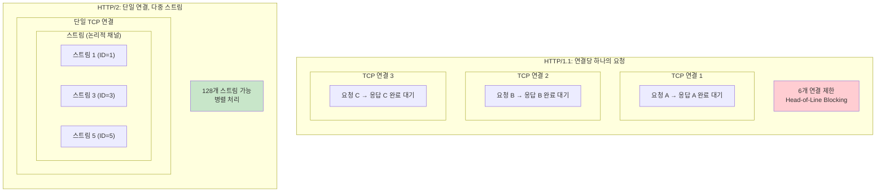

**HTTP/1.1의 Head-of-Line Blocking 문제:**

HTTP/1.1에서는 하나의 연결에서 요청 A의 응답이 완전히 도착할 때까지 요청 B의 응답을 받을 수 없습니다. 큰 파일을 다운로드하면 뒤의 작은 요청들이 모두 대기해야 합니다. 이를 **Head-of-Line Blocking**이라고 합니다.

다음 다이어그램은 실제 네트워크에서 프레임이 어떻게 전송되는지 보여줍니다.

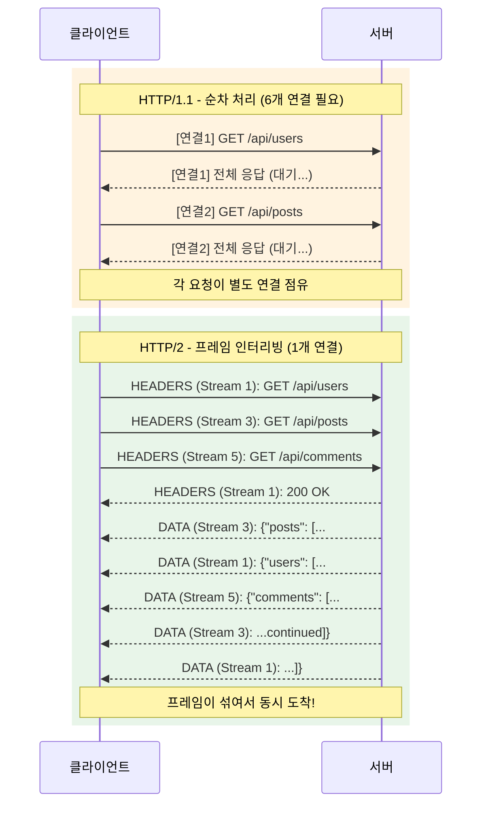

**프레임 인터리빙이 중요한 이유:**

위 다이어그램에서 HTTP/2는 Stream 1, 3, 5의 DATA 프레임이 섞여서 도착합니다. 서버는 준비된 데이터부터 보내고, 클라이언트는 스트림 ID를 보고 어떤 요청의 응답인지 구분합니다.

만약 Stream 1의 응답이 매우 크다면? HTTP/1.1에서는 다른 요청이 대기해야 하지만, HTTP/2에서는 Stream 3, 5의 작은 응답이 먼저 완료될 수 있습니다.

다음은 HTTP/2 프레임의 실제 구조입니다.

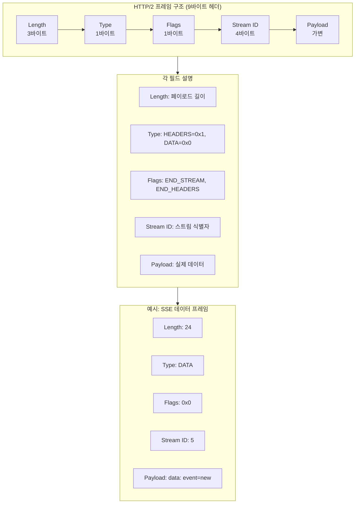

**SSE와 HTTP/2의 시너지:**

SSE 연결은 하나의 스트림을 점유합니다. HTTP/1.1에서는 이것이 6개 연결 중 1개를 차지했지만, HTTP/2에서는 128개 스트림 중 1개만 차지합니다.

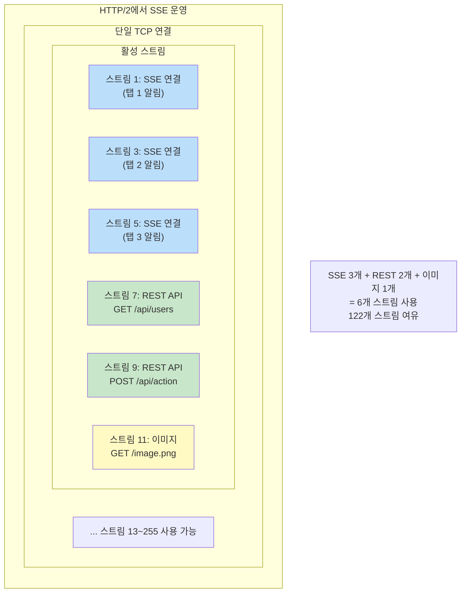

**스트림 ID 규칙:**

- 클라이언트가 시작한 스트림: **홀수** ID (1, 3, 5, ...)
- 서버가 시작한 스트림 (Server Push): **짝수** ID (2, 4, 6, ...)
- 스트림 ID 0: 연결 전체에 대한 제어 메시지

이 규칙 덕분에 클라이언트와 서버가 동시에 새 스트림을 만들어도 ID 충돌이 발생하지 않습니다.

### HTTP/2에서 멀티플렉싱이 가능한 이유

HTTP/1.1에서는 왜 멀티플렉싱이 불가능했고, HTTP/2에서는 어떻게 가능해졌을까요?

**HTTP/1.1의 근본적 한계:**

HTTP/1.1은 **텍스트 기반 프로토콜**입니다. 요청과 응답이 텍스트로 전송되며, 메시지의 끝을 알기 위해 빈 줄(`\r\n\r\n`)이나 `Content-Length` 헤더에 의존합니다.

```
GET /api/users HTTP/1.1\r\n
Host: example.com\r\n
\r\n
```

이 구조에서는 **메시지 경계를 명확히 구분하기 어렵습니다**. 응답이 어디서 끝나는지 알려면 전체 본문을 다 받아야 합니다. 그래서 하나의 연결에서 응답 A가 완전히 끝나야 응답 B를 시작할 수 있습니다.

HTTP/1.1에도 **파이프라이닝(Pipelining)**이라는 시도가 있었습니다. 응답을 기다리지 않고 여러 요청을 연속으로 보내는 방식이었지만, 응답은 여전히 **요청 순서대로** 와야 했습니다. 첫 번째 응답이 느리면 뒤의 모든 응답이 대기하는 Head-of-Line Blocking 문제가 그대로였고, 결국 대부분의 브라우저에서 비활성화되었습니다.

**HTTP/2의 해결책: 바이너리 프레이밍 계층**

HTTP/2는 텍스트 대신 **바이너리 프로토콜**을 사용합니다. 모든 메시지가 고정된 구조의 **프레임**으로 캡슐화됩니다.

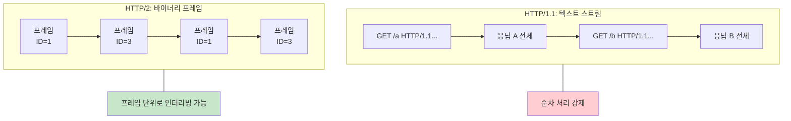

핵심은 **모든 프레임에 스트림 ID가 포함**된다는 것입니다. 프레임이 어떤 순서로 도착하든, 스트림 ID를 보고 어떤 요청/응답에 속하는지 즉시 알 수 있습니다. 이것이 멀티플렉싱을 가능하게 하는 핵심 메커니즘입니다.

| 특성 | HTTP/1.1 | HTTP/2 |
|------|----------|--------|
| 메시지 형식 | 텍스트 | 바이너리 프레임 |
| 메시지 식별 | 순서에 의존 | 스트림 ID |
| 메시지 경계 | Content-Length, 빈 줄 | 프레임 Length 필드 |
| 동시 처리 | 불가 (순차) | 가능 (인터리빙) |

### HTTP/2에서도 여러 연결이 발생하는 경우

"HTTP/2는 단일 연결"이라는 것은 **이상적인 경우**입니다. 실제로는 여러 연결이 열리는 경우가 있습니다.

**1. 다른 도메인 (Origin)**

HTTP/2도 **도메인별로 연결이 분리**됩니다. `api.example.com`과 `cdn.example.com`은 별도 연결입니다.

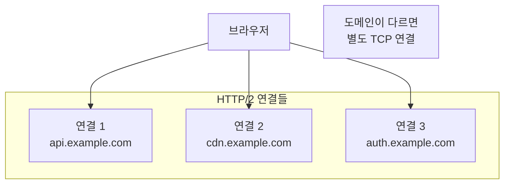

**2. Connection Coalescing 조건 불충족**

HTTP/2에는 **Connection Coalescing**이라는 최적화가 있습니다. 여러 도메인이 **같은 IP 주소**와 **같은 TLS 인증서**를 공유하면, 하나의 연결로 합칠 수 있습니다.

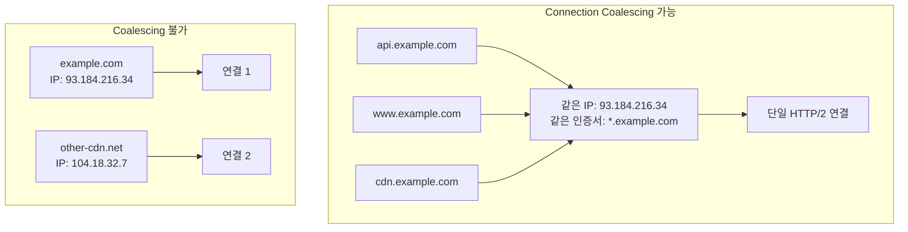

조건이 맞지 않으면(IP가 다르거나, 인증서가 해당 도메인을 커버하지 않으면) 별도 연결이 열립니다.

**3. 서버의 동시 스트림 제한**

서버는 `SETTINGS_MAX_CONCURRENT_STREAMS`로 동시 스트림 수를 제한할 수 있습니다. 기본값은 100~128이지만, 서버가 더 낮게 설정할 수 있습니다.

예를 들어 서버가 50개로 제한했는데 클라이언트가 100개 요청을 동시에 보내야 한다면, 브라우저는 **추가 연결**을 열 수 있습니다.

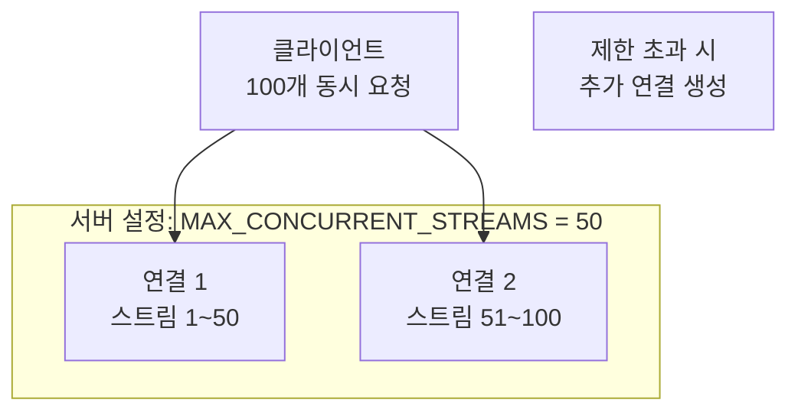

**4. 브라우저 구현에 따른 차이**

일부 브라우저는 성능 최적화를 위해 의도적으로 여러 HTTP/2 연결을 열기도 합니다.

- **중요 리소스 분리**: HTML과 이미지를 별도 연결로 분리하여 중요한 리소스가 블로킹되지 않도록
- **대역폭 최대 활용**: 하나의 TCP 연결은 혼잡 윈도우(congestion window) 제한이 있으므로, 여러 연결로 대역폭을 더 활용
- **장애 격리**: 하나의 연결에 문제가 생겨도 다른 연결은 영향 없음

**5. HTTP/2 미지원 또는 협상 실패**

서버가 HTTP/2를 지원하지 않거나, 중간 프록시가 HTTP/2를 지원하지 않으면 **HTTP/1.1로 폴백**합니다. 이 경우 다시 여러 연결이 필요해집니다.

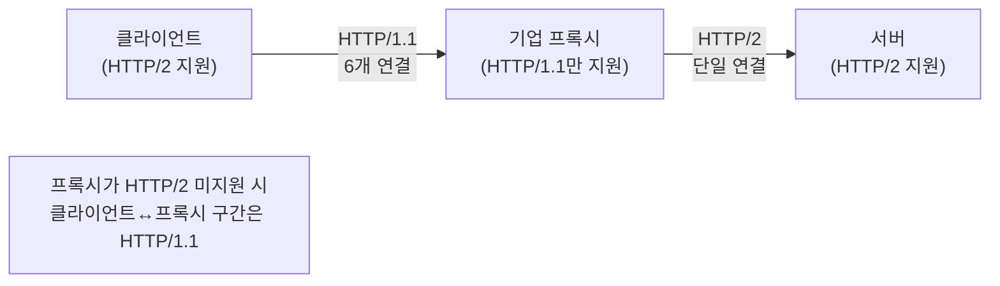

**정리:**

| 상황 | 연결 수 | 이유 |
|------|---------|------|
| 단일 도메인, HTTP/2 | 1개 | 이상적인 경우 |
| 여러 도메인 | 도메인 수만큼 | Origin 분리 |
| Coalescing 가능 | 1개로 합침 | IP/인증서 공유 |
| 스트림 제한 초과 | 추가 연결 | 서버 설정 |
| HTTP/2 미지원 | 최대 6개 | HTTP/1.1 폴백 |

**결론:**

HTTP/2의 "단일 연결"은 **같은 Origin에 대해** 성립합니다. 실제 웹 페이지는 여러 도메인의 리소스를 로드하므로 여러 연결이 열리는 것이 일반적입니다. 하지만 HTTP/1.1에서 도메인당 6개 연결이 필요했던 것에 비하면, HTTP/2는 **도메인당 1개**로 크게 줄어듭니다.

### 바이너리 프레임의 효율성

HTTP/2가 텍스트 대신 바이너리를 선택한 이유는 **파싱 속도**와 **데이터 크기** 두 가지 측면에서 효율적이기 때문입니다.

**파싱 효율성:**

HTTP/1.1은 텍스트 기반이므로 파서가 많은 작업을 해야 합니다. 줄바꿈(`\r\n`)을 찾을 때까지 스캔하고, 콜론(`:`)으로 헤더 이름과 값을 분리하고, `Content-Length` 같은 숫자 문자열을 정수로 변환해야 합니다. 대소문자 구분 없이 비교해야 하므로 `Content-Length`와 `content-length`를 같은 것으로 처리하는 로직도 필요합니다.

반면 HTTP/2 바이너리 프레임은 고정된 9바이트 헤더 구조를 가집니다. 파서는 정해진 오프셋에서 바로 값을 읽으면 됩니다. 문자열 스캔이나 변환이 필요 없어서 약 **10배 빠른 파싱**이 가능합니다.

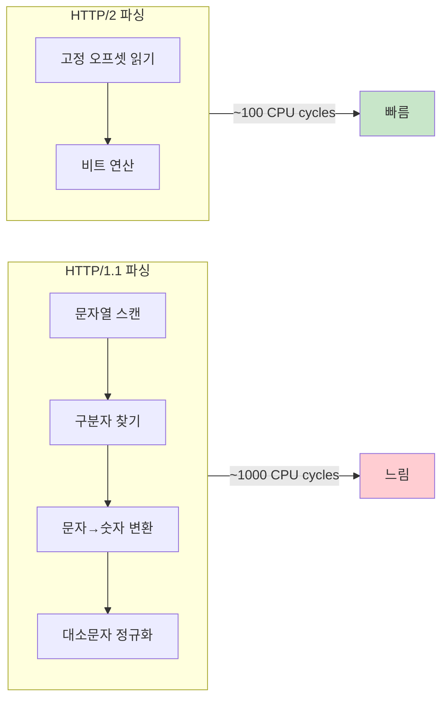

**헤더 압축 (HPACK):**

HTTP/2의 더 큰 이점은 **HPACK 헤더 압축**입니다. HTTP/1.1에서는 매 요청마다 동일한 헤더를 반복 전송합니다. `User-Agent`, `Cookie`, `Authorization` 같은 헤더는 수백 바이트에 달하지만 거의 변하지 않습니다.

HPACK은 두 가지 기법으로 이 문제를 해결합니다.

첫째, **정적/동적 테이블 인덱싱**입니다. 자주 사용하는 헤더는 미리 정의된 인덱스로 대체합니다. `:method: GET`은 인덱스 2번 하나로 표현됩니다. 연결 중에 새로운 헤더가 나오면 동적 테이블에 저장하고, 이후에는 인덱스로만 참조합니다.

둘째, **허프만 인코딩**입니다. 문자열을 압축하여 전송합니다. 자주 사용하는 문자에 짧은 코드를 할당하여 평균 30% 크기를 줄입니다.

| 시나리오 | HTTP/1.1 | HTTP/2 | 감소율 |
|----------|----------|--------|--------|
| 첫 번째 요청 | 800 bytes | 350 bytes | **56%** |
| 10번째 요청 (같은 연결) | 800 bytes | 50 bytes | **94%** |
| 웹페이지 전체 (100개 리소스) | 80 KB | 12 KB | **85%** |

모바일이나 저대역폭 환경에서 이 차이는 체감 성능에 큰 영향을 미칩니다. 100개 리소스를 로드할 때 헤더만 75KB를 절감하면, 3G 환경에서 약 1초 빨라질 수 있습니다.

2026년 현재 **브라우저 지원율은 96%** 이상입니다. IE11을 제외한 모든 주요 브라우저가 HTTP/2를 지원합니다.

다음 다이어그램은 HTTP/1.1과 HTTP/2의 차이를 시각적으로 보여줍니다. HTTP/1.1에서는 7번째 탭이 차단되지만, HTTP/2에서는 모든 탭이 단일 연결의 스트림으로 처리됩니다.

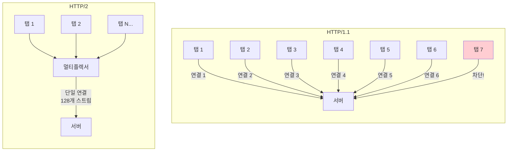

### 실무 권장사항

> "SSE는 HTTP/1.1에서는 사실상 사용 불가능한 수준. 최소 HTTP/2 필수"
> — MDN Web Docs

이 인용문의 의미를 명확히 이해해야 합니다. HTTP/1.1에서 SSE가 "작동하지 않는다"는 것이 아닙니다. 연결 수 제한으로 인해 **프로덕션 환경에서 안정적으로 사용하기 어렵다**는 의미입니다.

**실무에서 HTTP/2 확인 방법:**

서버가 HTTP/2를 지원하는지 확인하려면 브라우저 개발자 도구의 Network 탭에서 Protocol 열을 확인합니다. `h2`가 표시되면 HTTP/2입니다. 대부분의 CDN(Cloudflare, AWS CloudFront, Akamai)은 기본적으로 HTTP/2를 지원합니다.

### 방화벽/프록시 고려사항

기업 환경에서는 방화벽과 프록시 설정이 기술 선택에 큰 영향을 미칩니다. 아래 표는 각 환경에서 기술별 호환성을 보여줍니다.

| 환경 | Polling | Long Polling | SSE | WebSocket |
|:----:|:-------:|:------------:|:---:|:---------:|
| 기업 프록시 | 통과 | 통과 | 통과 | 종종 차단 |
| 공용 WiFi | 통과 | 통과 | 통과 | 차단 가능 |
| 일부 ISP | 통과 | 통과 | 통과 | 차단 가능 |
| 클라우드 환경 | 통과 | 통과 | 통과 | 통과 |

**WebSocket이 차단되는 이유를 상세히 설명하면:**

첫째, `ws://`는 HTTP가 아닌 별도 프로토콜입니다. WebSocket 연결은 HTTP 요청으로 시작하지만, `Upgrade: websocket` 헤더를 통해 프로토콜을 "업그레이드"합니다. 이후의 통신은 HTTP가 아닌 WebSocket 프로토콜을 사용합니다.

둘째, 보안 정책이 HTTP만 허용하는 경우가 많습니다. 기업 프록시는 종종 "HTTP/HTTPS 트래픽만 허용"하도록 설정됩니다. WebSocket은 HTTP로 시작하지만 업그레이드 후에는 HTTP가 아니므로 차단될 수 있습니다.

셋째, 딥 패킷 검사(DPI)가 비-HTTP 트래픽을 차단합니다. 일부 ISP와 기업 네트워크는 패킷 내용을 검사하여 HTTP가 아닌 트래픽을 차단합니다. 이는 보안 목적이지만, WebSocket도 함께 차단됩니다.

**해결책:** `wss://`(WebSocket Secure)를 사용하면 TLS로 암호화되어 DPI를 우회할 수 있습니다. 하지만 프록시가 HTTPS 트래픽도 복호화하여 검사하는 경우(MITM proxy)에는 여전히 차단될 수 있습니다.

---

## A5. 기술 선택 가이드

### 결정 플로우차트

기술 선택은 몇 가지 핵심 질문으로 결정할 수 있습니다. 다음 플로우차트를 따라가면 상황에 맞는 기술을 찾을 수 있습니다.

첫 번째 질문은 "양방향 통신이 필요한가?"입니다. 클라이언트가 서버에 자주 데이터를 보내야 한다면 WebSocket을 고려합니다. 서버에서 클라이언트로만 데이터가 흐른다면 SSE가 더 단순합니다.

두 번째 질문은 "실시간성이 얼마나 중요한가?"입니다. 1초의 지연도 허용되지 않는다면 SSE나 WebSocket이 필요합니다. 몇 초의 지연이 괜찮다면 Polling도 선택지입니다.

세 번째 질문은 "HTTP/2를 지원하는가?"입니다. HTTP/1.1 환경에서 SSE는 연결 수 제한 문제가 있어 Long Polling이 더 안정적입니다.

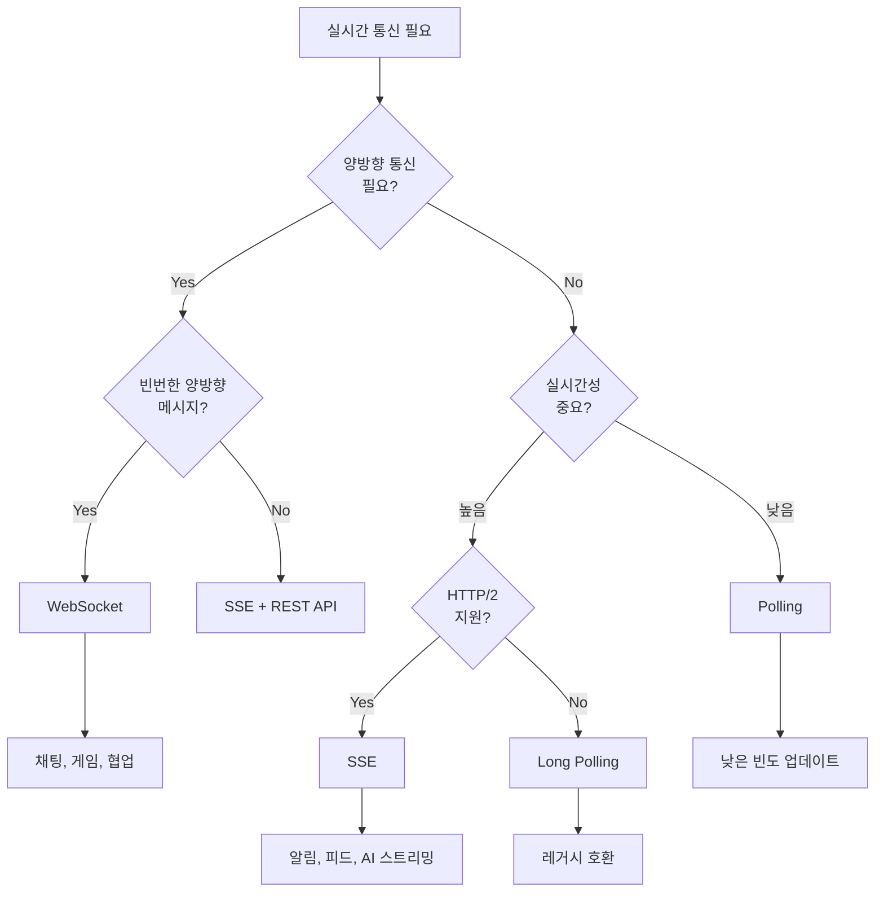

**"SSE + REST API"가 의미하는 것:**

양방향 통신이 필요하지만 빈번하지 않다면, WebSocket 대신 "SSE + REST API" 조합을 사용할 수 있습니다. 서버→클라이언트는 SSE로, 클라이언트→서버는 일반 REST API로 처리합니다. 예를 들어, 알림 시스템에서 알림 수신은 SSE로, "읽음" 표시는 REST API로 처리합니다.

### 사용 사례별 권장 기술

각 사용 사례에 대해 권장 기술과 그 이유를 정리했습니다.

| 사용 사례 | 권장 기술 | 이유 |
|----------|----------|------|
| 실시간 채팅 | WebSocket | 빈번한 양방향 메시지 |
| 온라인 게임 | WebSocket | 낮은 지연, 양방향 |
| 주식 시세 | SSE | 서버→클라이언트 단방향 |
| 알림 시스템 | SSE | 단방향, HTTP 호환 |
| AI 스트리밍 (ChatGPT) | SSE | 텍스트 스트리밍 최적화 |
| 대시보드 새로고침 | Polling/SSE | 업데이트 빈도에 따라 |
| 파일 업로드 진행률 | SSE | 서버→클라이언트 상태 |
| 협업 편집기 | WebSocket | 동시 편집, 충돌 해결 |

**각 사례를 좀 더 설명하면:**

"실시간 채팅"에서 WebSocket을 사용하는 이유는 사용자가 메시지를 보내는 것(클라이언트→서버)과 받는 것(서버→클라이언트)이 모두 빈번하기 때문입니다. SSE + REST로도 가능하지만, 매 메시지마다 HTTP 요청을 보내는 것은 비효율적입니다.

"AI 스트리밍"에서 SSE를 사용하는 이유는 AI의 응답이 토큰 단위로 스트리밍되기 때문입니다. ChatGPT, Claude 모두 SSE를 사용합니다. 사용자의 질문은 일반 HTTP POST로 보내고, 응답은 SSE로 스트리밍받습니다.

"대시보드 새로고침"은 상황에 따라 다릅니다. 데이터가 분 단위로 업데이트된다면 30초 Polling으로 충분합니다. 초 단위로 업데이트된다면 SSE가 더 효율적입니다.

### 2025-2026 트렌드

> "무엇을 선택할지 모르겠다면 — SSE로 시작하세요. 80% 경우에 작동합니다."
> — DEV Community

이 인용문은 현재 트렌드를 잘 반영합니다. 과거에는 "실시간 = WebSocket"이라는 공식이 있었지만, 이제는 SSE가 많은 경우에 더 나은 선택입니다.

**SSE 르네상스가 일어난 이유:**

첫째, AI 스트리밍으로 SSE가 재조명되었습니다. ChatGPT와 Claude는 모두 SSE를 사용하여 응답을 스트리밍합니다. 수억 명의 사용자가 SSE를 매일 경험하면서 기술의 안정성이 입증되었습니다.

둘째, HTTP/2 보급으로 연결 제한 문제가 해결되었습니다. 과거 SSE의 가장 큰 약점이었던 "도메인당 6개 연결 제한"이 HTTP/2의 멀티플렉싱으로 사라졌습니다.

셋째, 실제 비용 절감 사례가 나오고 있습니다. 한 SaaS 회사는 롱폴링에서 SSE로 전환하여 **연간 $45,000**의 서버 비용을 절감했습니다. SSE는 연결 유지 비용이 낮고, HTTP 인프라를 그대로 사용할 수 있어서 운영 비용이 적습니다.

**하이브리드 접근이 권장되는 이유:**

현대 애플리케이션은 여러 실시간 기능을 동시에 필요로 합니다. 각 기능에 가장 적합한 기술을 선택하는 것이 좋습니다.

- **알림**: SSE - 단방향이고, 자동 재연결이 필요함
- **채팅**: WebSocket - 양방향이고, 메시지 빈도가 높음
- **백그라운드 동기화**: Polling - 정확한 타이밍이 중요하지 않음

이렇게 하이브리드로 구성하면 각 기술의 장점을 살리면서 단점을 피할 수 있습니다.

### 모바일 고려사항

모바일 환경에서는 데스크톱과 다른 제약이 있습니다. 특히 배터리 절약을 위해 OS가 백그라운드 앱의 네트워크 활동을 제한합니다.

| 환경 | WebSocket/SSE 연결 유지 |
|------|------------------------|
| 데스크톱 브라우저 | 수 시간 가능 |
| 모바일 Safari | 백그라운드에서 **30초 후** 연결 종료 |
| 모바일 Chrome | OS에 따라 다름 |

**왜 모바일에서 연결이 끊어지는가?**

iOS는 배터리 수명을 위해 백그라운드 앱의 네트워크 연결을 적극적으로 종료합니다. 사용자가 다른 앱으로 전환하면 Safari의 웹 페이지는 "일시 정지" 상태가 되고, 약 30초 후 모든 네트워크 연결이 종료됩니다.

Android는 Doze 모드가 있어서 화면이 꺼지면 네트워크 활동이 제한됩니다. 하지만 iOS보다는 유연하게 동작합니다.

**모바일 전략:**

포그라운드(화면에 앱이 보이는 상태)에서는 SSE나 WebSocket을 정상적으로 사용합니다.

백그라운드로 전환되면 두 가지 전략이 있습니다:
1. **Push Notification**: 중요한 알림은 OS의 푸시 알림 시스템을 통해 전달합니다. 이는 OS가 관리하므로 배터리 효율적입니다.
2. **재접속 시 동기화**: 사용자가 앱으로 돌아오면 서버에서 놓친 이벤트를 일괄 조회합니다. 이를 위해 서버는 이벤트에 시퀀스 번호를 부여하고, 클라이언트는 마지막으로 받은 번호를 기억해야 합니다.

---

## A6. 면접 질문 대비

### Q1: "실시간 알림을 구현하려면 어떤 기술을 선택하겠습니까?"

**모범 답변:**
> "알림은 **서버에서 클라이언트로 단방향**으로 전송되므로, **SSE**를 선택하겠습니다.
>
> 이유:
> 1. 양방향 통신이 필요 없어 WebSocket은 과도함
> 2. HTTP 기반이라 방화벽/프록시 문제 없음
> 3. 자동 재연결이 브라우저에 내장됨
> 4. HTTP/2 환경에서 연결 제한 문제 해결됨
>
> 단, 사용자가 알림에 "읽음" 응답을 보내야 한다면, SSE + REST API 조합으로 해결하거나, 빈번하다면 WebSocket을 고려하겠습니다."

### Q2: "폴링과 웹소켓 중 어떤 것을 선택하겠습니까?"

**모범 답변:**
> "요구사항에 따라 다릅니다.
>
> **폴링 선택:**
> - 업데이트 빈도가 낮고 예측 가능할 때 (예: 매 분 환율 조회)
> - 레거시 시스템 호환이 필요할 때
> - 간단한 구현이 우선일 때
>
> **WebSocket 선택:**
> - 양방향 통신이 필요할 때 (채팅, 게임)
> - 낮은 지연이 중요할 때 (실시간 협업)
> - 메시지 빈도가 높을 때
>
> 만약 **서버→클라이언트 단방향**이라면, 두 기술 대신 **SSE**를 먼저 검토하겠습니다. 폴링보다 효율적이고, WebSocket보다 단순합니다."

### Q3: "Long Polling과 SSE의 차이점은?"

**모범 답변:**
> "핵심 차이는 **연결 유지 방식**입니다.
>
> **Long Polling:**
> - 요청 → 서버 대기 → 응답 → **연결 종료** → 재요청
> - 매 응답마다 HTTP 오버헤드 발생
> - 타임아웃/재연결 로직 직접 구현 필요
>
> **SSE:**
> - 요청 → **연결 유지** → 이벤트1 → 이벤트2 → ...
> - HTTP 오버헤드 최초 1회만
> - 자동 재연결 브라우저 내장
>
> SSE가 거의 모든 면에서 우수하지만, HTTP/1.1 환경에서는 연결 수 제한(6개) 때문에 Long Polling이 더 적합할 수 있습니다."

### Q4: "HTTP/1.1에서 SSE가 가지는 한계는?"

**모범 답변:**
> "HTTP/1.1에서 브라우저는 **도메인당 최대 6개** 동시 연결만 허용합니다.
>
> SSE는 연결을 계속 유지하므로:
> - 6개 탭에서 SSE 연결을 열면 **더 이상 HTTP 요청 불가**
> - REST API 호출, 이미지 로딩 등이 차단됨
>
> **해결책:**
> 1. **HTTP/2 사용** (멀티플렉싱으로 128개 스트림)
> 2. **도메인 샤딩** (api1.example.com, api2.example.com)
> 3. **SSE 대신 Long Polling** (응답마다 연결 해제)
>
> 현재는 HTTP/2가 96% 이상 지원되므로 이 문제는 거의 해결되었습니다."

---

## 요약

이 문서에서 학습한 내용을 한눈에 정리합니다.

다음 다이어그램은 기술의 발전 과정과 선택 기준을 보여줍니다. 왼쪽은 시간순 발전이고, 오른쪽은 현재 시점에서의 선택 기준입니다.

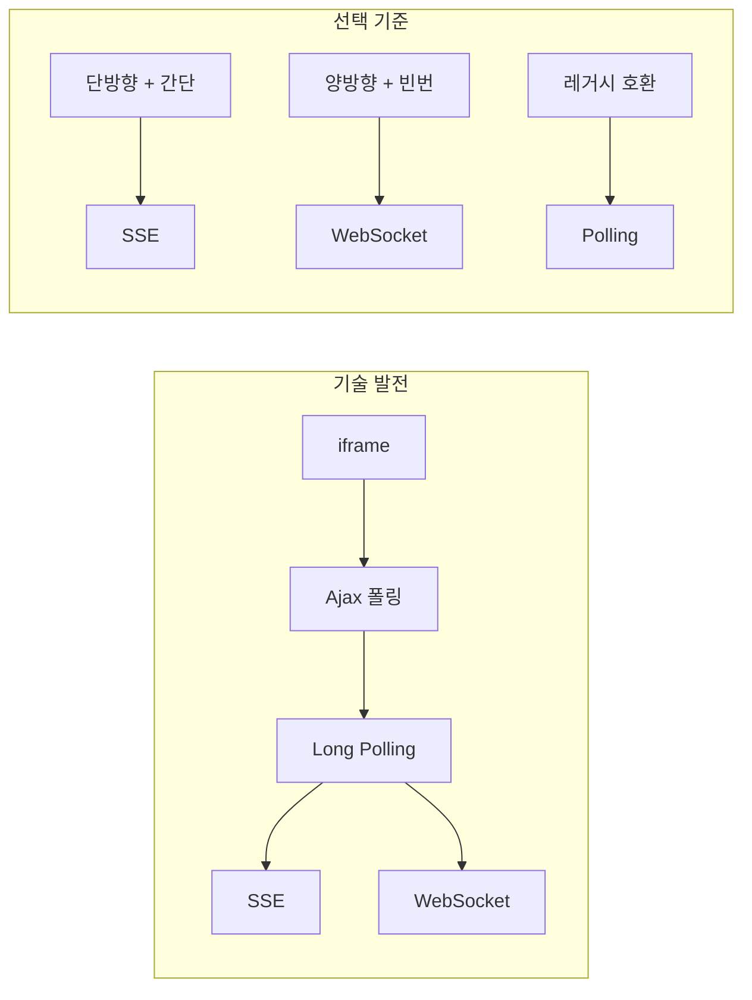

| 핵심 포인트 | 내용 |
|------------|------|
| **폴링** | 클라이언트가 주기적으로 서버에 요청을 보내 데이터를 확인합니다. 가장 간단하지만 불필요한 요청이 많아 비효율적입니다. |
| **롱폴링** | 서버가 데이터가 생길 때까지 응답을 보류합니다. 폴링보다 실시간성이 높지만, 요청-응답마다 HTTP 오버헤드가 발생합니다. |
| **SSE** | HTTP 기반의 단방향 스트림입니다. 연결을 유지하면서 서버가 이벤트를 푸시합니다. 2025년 AI 스트리밍으로 르네상스를 맞이했습니다. |
| **WebSocket** | 양방향 전이중 통신을 지원합니다. 채팅, 게임처럼 양방향 메시지가 빈번한 경우에 적합합니다. |
| **HTTP/2** | 멀티플렉싱으로 SSE의 연결 수 제한 문제를 해결했습니다. SSE를 프로덕션에서 사용하려면 HTTP/2가 필수입니다. |
| **면접 팁** | "상황에 따라 다릅니다"라고 말한 후, 양방향 필요 여부, 실시간성 중요도, 인프라 환경을 기준으로 구체적인 선택 이유를 설명합니다. |

---

## 참고 자료

- [MDN - Server-Sent Events](https://developer.mozilla.org/en-US/docs/Web/API/Server-sent_events/Using_server-sent_events)
- [DEV Community - SSE vs WebSockets in 2025](https://dev.to/haraf/server-sent-events-sse-vs-websockets-vs-long-polling-whats-best-in-2025-5ep8)
- [portalZINE - SSE's Glorious Comeback](https://portalzine.de/sses-glorious-comeback-why-2025-is-the-year-of-server-sent-events/)

---

다음 섹션: [01. SSE 기초](../01-basics/)
