# 01. SSE 기초 - 학습 (LEARN)

## 학습 목표

SSE의 동작 원리와 프로토콜 구조를 이해하고, WebSocket과의 차이점을 면접에서 명확하게 설명할 수 있다.

---

## SSE란?

**Server-Sent Events (SSE)**는 서버에서 클라이언트로 실시간 데이터를 전송하는 웹 표준 기술입니다.

SSE를 한 문장으로 정의하면 이렇습니다: **"HTTP 연결을 열어두고 서버가 원할 때마다 클라이언트에게 데이터를 푸시하는 기술"**입니다.

SSE는 HTML5 명세에 포함되어 있어서 별도의 라이브러리 없이 브라우저에서 바로 사용할 수 있습니다. 브라우저는 `EventSource`라는 내장 API를 제공하고, 개발자는 몇 줄의 코드로 실시간 데이터 수신을 구현할 수 있습니다.

```javascript
// 이것이 SSE의 전부입니다
const eventSource = new EventSource('/events');
eventSource.onmessage = (e) => console.log(e.data);
```

### 핵심 특징

SSE의 특징을 이해하면 언제 사용해야 하는지 판단할 수 있습니다.

| 특징 | 설명 |
|------|------|
| **단방향** | 서버 → 클라이언트로만 전송 |
| **HTTP 기반** | 표준 HTTP/HTTPS 사용 |
| **텍스트 전용** | UTF-8 인코딩 텍스트만 지원 |
| **자동 재연결** | 연결 끊김 시 브라우저가 자동 재연결 |
| **표준 API** | `EventSource` API 제공 |

**각 특징을 좀 더 설명하면:**

"단방향"이라는 것은 서버만 데이터를 보낼 수 있고, 클라이언트는 받기만 한다는 의미입니다. 클라이언트가 서버에 데이터를 보내려면 별도의 HTTP 요청(fetch, axios)을 사용해야 합니다.

"HTTP 기반"이라는 것은 기존 웹 인프라와 완벽하게 호환된다는 의미입니다. 방화벽, 프록시, 로드밸런서 설정을 변경할 필요가 없습니다. WebSocket은 HTTP에서 별도 프로토콜로 업그레이드하기 때문에 일부 환경에서 차단될 수 있지만, SSE는 순수 HTTP이므로 이런 문제가 없습니다.

"텍스트 전용"이라는 것은 바이너리 데이터(이미지, 파일)를 직접 전송할 수 없다는 의미입니다. 바이너리가 필요하면 Base64로 인코딩해야 합니다. 하지만 대부분의 실시간 데이터(JSON, 알림 메시지)는 텍스트이므로 실무에서 큰 제약이 되지 않습니다.

"자동 재연결"은 SSE의 큰 장점입니다. 네트워크 연결이 끊어지면 브라우저가 자동으로 재연결을 시도합니다. 개발자가 재연결 로직을 직접 구현할 필요가 없습니다. WebSocket은 이 기능이 없어서 직접 구현해야 합니다.

---

## HTTP로 실시간 데이터를 받는 원리

### 일반 HTTP vs SSE

일반적인 HTTP 요청은 "요청 → 응답 → 연결 종료"의 패턴을 따릅니다. 서버가 응답을 보내면 연결이 닫히고, 새 데이터가 필요하면 다시 요청해야 합니다.

SSE는 이 패턴을 깨뜨립니다. 서버가 응답을 보내도 **연결을 닫지 않고 열어둡니다**. 그리고 새 데이터가 생길 때마다 같은 연결로 계속 전송합니다.

다음 다이어그램은 이 차이를 보여줍니다. 일반 HTTP에서는 각 데이터마다 새 연결이 필요하지만, SSE에서는 하나의 연결로 여러 이벤트를 받습니다.

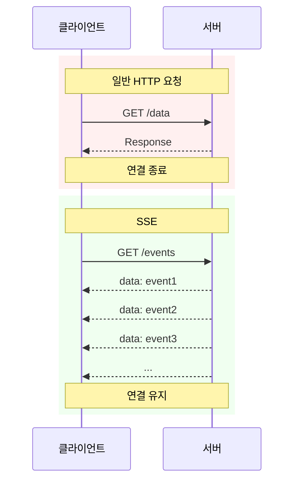

### SSE가 가능한 기술적 배경

SSE가 HTTP 위에서 동작할 수 있는 이유는 세 가지 기술 덕분입니다.

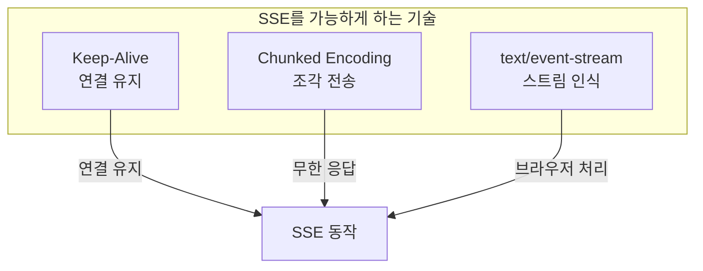

---

### 1. Keep-Alive vs SSE: "연결 재사용"과 "응답 유지"는 다르다

HTTP/1.1의 `Connection: keep-alive`는 **TCP 연결을 재사용**합니다. HTTP/1.0에서는 매 요청마다 TCP 연결을 새로 맺었지만, HTTP/1.1은 하나의 연결로 여러 요청-응답을 처리합니다.

#### HTTP/1.1에서 연결 재사용이 가능해진 이유

HTTP/1.0에서는 **"응답의 끝 = 연결 종료"**였습니다. 서버가 응답을 다 보내면 연결을 끊어버렸고, 클라이언트는 "연결이 끊겼으니 응답이 끝났구나"라고 판단했습니다. 이 방식은 단순하지만, 매 요청마다 TCP 3-way handshake를 반복해야 해서 비효율적이었습니다.

HTTP/1.1은 **응답 경계를 명시적으로 알 수 있게** 만들어서 이 문제를 해결했습니다.

```
HTTP/1.0: 응답의 끝을 어떻게 알까?
─────────────────────────────────────────
연결 끊김 = 응답 끝
→ 그래서 매번 연결을 새로 맺어야 했음

HTTP/1.1: 응답의 끝을 어떻게 알까?
─────────────────────────────────────────
방법 1) Content-Length: 1024
        → "1024바이트 읽으면 응답 끝"

방법 2) Transfer-Encoding: chunked
        → "크기 0인 chunk가 오면 응답 끝"

→ 연결을 끊지 않아도 응답이 끝났는지 알 수 있음
→ 같은 연결에서 다음 요청-응답 가능!
```

| HTTP/1.0 | HTTP/1.1 |
|----------|----------|
| 응답 끝 = 연결 종료 | Content-Length 또는 Chunked로 응답 경계 명시 |
| 매 요청마다 새 연결 (3-way handshake) | 하나의 연결로 여러 요청-응답 처리 |
| Connection: keep-alive 선택적 | Connection: keep-alive 기본값 |

**중요한 점**: Keep-Alive는 "연결 재사용"이지, "응답 재사용"이 아닙니다.

```
Keep-Alive (HTTP/1.1):
┌─────────────────────────────────────────────────────┐
│  하나의 TCP 연결                                      │
│                                                     │
│  요청1 → 응답1(완료) → 요청2 → 응답2(완료) → 요청3...   │
│                                                     │
│  각 응답은 "완료"됨. 다음 데이터를 받으려면 새 요청 필요  │
└─────────────────────────────────────────────────────┘

SSE:
┌─────────────────────────────────────────────────────┐
│  하나의 TCP 연결                                      │
│                                                     │
│  요청1 → 응답(끝나지 않음... 데이터... 데이터... 데이터...)│
│                                                     │
│  하나의 응답이 "계속 진행 중". 추가 요청 없이 데이터 수신  │
└─────────────────────────────────────────────────────┘
```

**핵심 차이**: Keep-Alive에서 서버는 클라이언트가 요청해야만 응답할 수 있습니다. SSE에서는 **서버가 원할 때 데이터를 보냅니다**.

Keep-Alive로 연결을 유지하더라도, 요청-응답 모델은 변하지 않습니다. 서버가 "지금 새 알림이 왔어!"라고 먼저 말할 방법이 없습니다. SSE는 응답 자체가 끝나지 않으므로, 서버가 원하는 시점에 데이터를 보낼 수 있습니다.

#### 그렇다면 HTTP/1.1에서 여러 연결이 필요한 이유는?

Keep-Alive로 연결을 재사용할 수 있다면, 하나의 연결로 충분하지 않을까요? **아닙니다.** HTTP/1.1의 치명적인 한계가 있습니다.

**Head-of-Line Blocking**: HTTP/1.1은 하나의 연결에서 **요청-응답이 순차적**입니다. 응답1이 올 때까지 요청2를 보낼 수 없습니다.

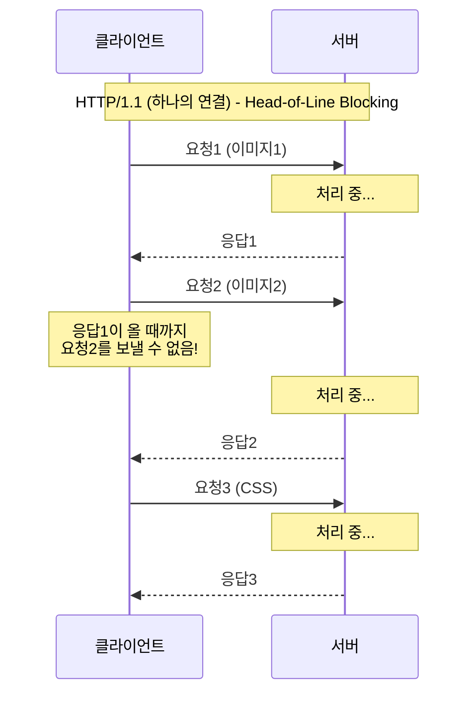

웹페이지에 이미지 10개, CSS 5개, JS 3개가 있다면? 하나의 연결로 18개를 순차 처리하면 매우 느립니다. 그래서 브라우저는 **도메인당 6개 연결**을 열어서 병렬 처리합니다.

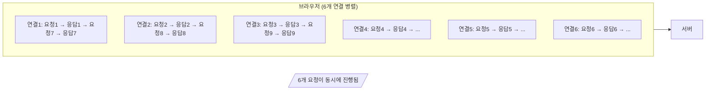

**Keep-Alive의 실제 역할**: 연결 "재사용"이지, 연결 "공유"가 아닙니다.

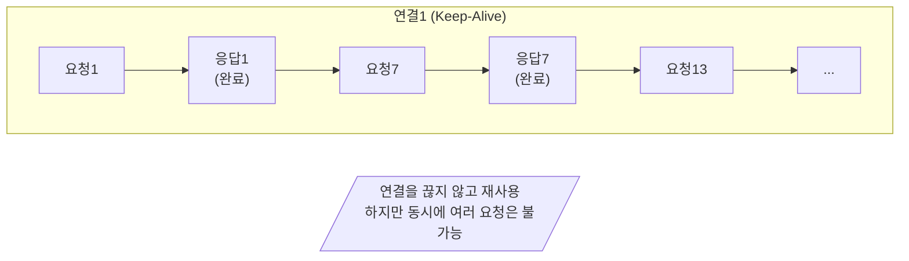

#### HTTP/2가 해결한 것: 멀티플렉싱

HTTP/2는 **하나의 연결에서 여러 요청을 동시에** 처리합니다. 요청들이 동시에 진행되고, 응답 순서도 상관없습니다.

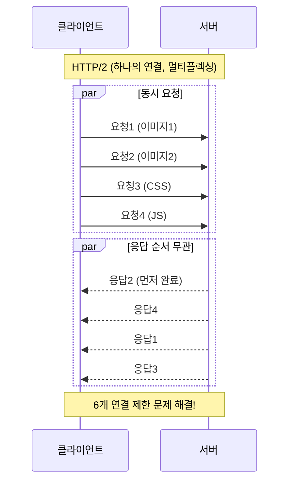

#### HTTP 버전별 비교

| | HTTP/1.0 | HTTP/1.1 | HTTP/2 |
|---|----------|----------|--------|
| **연결** | 매 요청마다 새 연결 | Keep-Alive로 재사용 | 하나의 연결 |
| **동시 요청** | 불가 | 불가 (순차) | 가능 (멀티플렉싱) |
| **병렬 처리** | 여러 연결 필요 | 여러 연결 필요 (도메인당 6개) | 하나의 연결로 충분 |
| **SSE 연결 제한** | 해당 없음 | 6개 제한 문제 | 제한 없음 |

**SSE와의 연관성**: HTTP/1.1에서 SSE 연결 하나가 6개 연결 중 하나를 점유합니다. SSE를 여러 개 열면 일반 HTTP 요청에 영향을 줍니다. HTTP/2에서는 이 문제가 해결됩니다.

---

### 2. Chunked Transfer Encoding: SSE만의 것이 아니다

Chunked Transfer Encoding은 **응답 크기를 미리 알 수 없을 때** 데이터를 조각으로 나누어 전송하는 HTTP 기능입니다. SSE만 사용하는 것이 아니라, **일반 HTTP에서도 대용량 파일 다운로드에 사용**합니다.

**일반 HTTP Chunked (예: 10GB 파일 다운로드):**

```
HTTP/1.1 200 OK
Transfer-Encoding: chunked

1000\r\n
[4096 bytes of data]\r\n
1000\r\n
[4096 bytes of data]\r\n
...
0\r\n          ← 마지막 chunk (크기 0) = 응답 종료!
\r\n
```

일반 Chunked 응답은 마지막에 **크기 0인 chunk**를 보내서 "응답이 끝났다"고 알립니다.

**SSE Chunked:**

```
HTTP/1.1 200 OK
Content-Type: text/event-stream
Transfer-Encoding: chunked

1a\r\n
data: hello\n\n\r\n
1a\r\n
data: world\n\n\r\n
...
(크기 0 chunk를 보내지 않음 = 응답이 끝나지 않음)
```

SSE는 **의도적으로 응답을 끝내지 않습니다**. 크기 0 chunk를 보내지 않으므로, 브라우저는 "아직 응답이 진행 중"이라고 판단합니다.

**그래서 Chunked 인코딩과 SSE의 관계는?**

Chunked 인코딩 자체는 SSE의 전유물이 아닙니다. SSE는 Chunked를 **"끝나지 않는 응답"**으로 활용한다는 점이 다릅니다.

| 구분 | 일반 HTTP Chunked | SSE Chunked |
|------|-------------------|-------------|
| **용도** | 대용량 파일 다운로드 | 실시간 이벤트 스트리밍 |
| **응답 종료** | 크기 0 chunk로 명시적 종료 | 종료하지 않음 (무한) |
| **브라우저 동작** | 전체 다운로드 완료 대기 | 도착 즉시 이벤트 발생 |

---

### 3. text/event-stream: 브라우저가 "스트림"으로 인식하게 만드는 키

Chunked로 응답이 끝나지 않더라도, 브라우저가 이것을 "이벤트 스트림"으로 해석하려면 **`Content-Type: text/event-stream`** 헤더가 필요합니다.

```typescript
// 일반 Chunked 응답을 fetch로 받으면?
const response = await fetch('/large-file');
const data = await response.text();  // 전체가 끝날 때까지 대기

// SSE를 EventSource로 받으면?
const es = new EventSource('/events');
es.onmessage = (e) => {
  // chunk가 도착할 때마다 즉시 콜백 실행
  console.log(e.data);
};
```

브라우저의 EventSource API는:
1. `Content-Type: text/event-stream`을 보고 SSE로 인식
2. 응답을 버퍼링하지 않고 **실시간 파싱**
3. `data:`, `event:`, `id:` 필드를 해석하여 JavaScript 이벤트로 변환
4. 연결이 끊기면 **자동 재연결**

**Chunked는 "전송 방식"이고, SSE는 "프로토콜 + 브라우저 API"입니다.**

---

### 기술 스택의 관계 정리

```
┌─────────────────────────────────────────────────────────┐
│                    SSE (프로토콜 + API)                  │
│  - text/event-stream 포맷                               │
│  - 브라우저 EventSource API                             │
│  - 자동 재연결, 이벤트 파싱                              │
├─────────────────────────────────────────────────────────┤
│              Chunked Transfer Encoding                  │
│  - 크기를 모르는 데이터를 조각으로 전송                    │
│  - SSE뿐 아니라 파일 다운로드에도 사용                    │
├─────────────────────────────────────────────────────────┤
│                 HTTP/1.1 Keep-Alive                     │
│  - TCP 연결 재사용 (요청-응답 모델은 유지)                │
├─────────────────────────────────────────────────────────┤
│                      TCP 연결                           │
└─────────────────────────────────────────────────────────┘
```

| 기술 | 역할 | SSE에서의 의미 |
|------|------|---------------|
| **Keep-Alive** | TCP 연결 재사용 | SSE는 연결을 유지하지만, "응답이 끝나지 않음"이 핵심 |
| **Chunked** | 크기 모르는 데이터 전송 | SSE가 무한히 데이터를 보낼 수 있게 해주는 전송 메커니즘 |
| **text/event-stream** | 스트림 인식 | 브라우저가 chunk를 파싱하여 JS 이벤트로 전달

---

## 실시간 통신 기술 비교

다음 다이어그램은 네 가지 실시간 통신 기술의 동작 방식을 시각적으로 비교합니다.

Polling은 주기적으로 요청을 보내고 매번 연결을 끊습니다. Long Polling은 서버가 대기하다가 응답하고 연결을 끊습니다. SSE는 연결을 유지하면서 서버가 이벤트를 푸시합니다. WebSocket은 연결을 유지하면서 양방향으로 통신합니다.

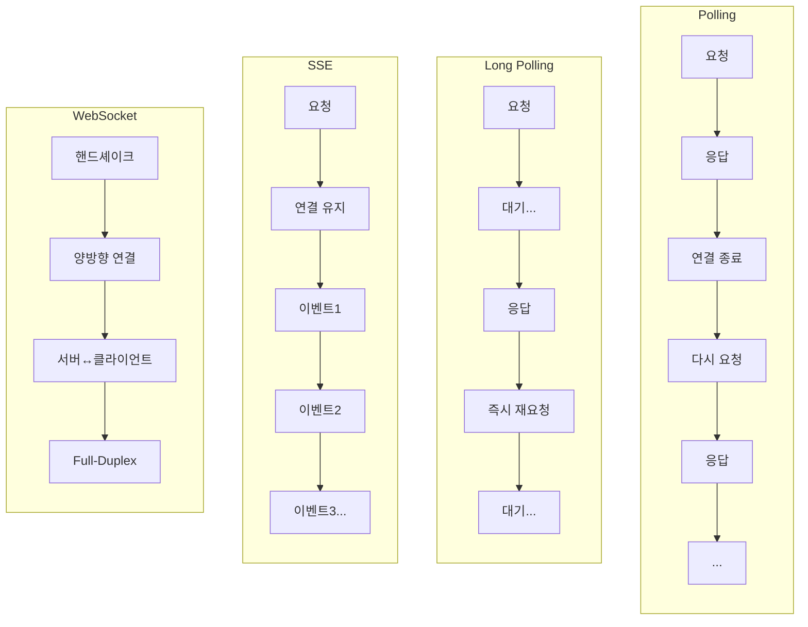

### 각 기술의 특징

| 기술 | 연결 방식 | 방향 | 오버헤드 | 적합한 경우 |
|------|-----------|------|----------|-------------|
| **Polling** | 주기적 요청/응답 | 단방향 | 높음 | 업데이트 빈도 낮음 |
| **Long Polling** | 대기 후 응답 | 단방향 | 중간 | 레거시 호환 필요 |
| **SSE** | 연결 유지 | 단방향 | 낮음 | 서버→클라이언트 스트림 |
| **WebSocket** | 연결 유지 | 양방향 | 낮음 | 양방향 실시간 통신 |

**SSE와 Long Polling의 핵심 차이:**

Long Polling은 데이터가 도착하면 **응답을 보내고 연결을 끊습니다**. 클라이언트는 다시 연결해야 합니다. 이 과정에서 매번 HTTP 헤더가 오갑니다.

SSE는 **연결을 유지한 채로** 데이터만 전송합니다. HTTP 오버헤드는 최초 연결 시 한 번만 발생합니다. 이것이 SSE가 더 효율적인 이유입니다.

**SSE와 WebSocket의 핵심 차이:**

WebSocket은 HTTP에서 **별도 프로토콜로 업그레이드**합니다. 양방향 통신이 가능하지만, 일부 방화벽/프록시에서 차단될 수 있습니다.

SSE는 **순수 HTTP를 유지**합니다. 단방향이지만, 어떤 환경에서도 동작합니다. 클라이언트→서버 통신이 필요하면 별도 HTTP 요청을 사용합니다.

---

## text/event-stream 형식

SSE 메시지는 정해진 텍스트 형식을 따릅니다. 이 형식을 이해하면 서버 구현과 디버깅이 쉬워집니다.

### SSE 메시지 구조

SSE 메시지는 **필드: 값** 형식의 텍스트 줄로 구성됩니다. 각 필드는 콜론(`:`)으로 이름과 값을 구분합니다. 메시지의 끝은 **빈 줄(두 개의 줄바꿈, `\n\n`)**로 표시합니다.

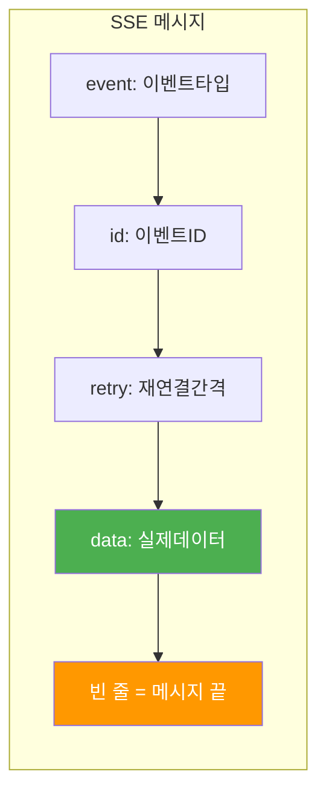

### 전체 필드 목록

| 필드 | 필수 여부 | 설명 | 예시 |
|------|-----------|------|------|
| `data:` | **필수** | 전송할 데이터 | `data: Hello World\n` |
| `event:` | 선택 | 커스텀 이벤트 타입 | `event: notification\n` |
| `id:` | 선택 | 이벤트 ID (재연결 시 사용) | `id: 123\n` |
| `retry:` | 선택 | 재연결 대기 시간 (ms) | `retry: 5000\n` |

**각 필드를 상세히 설명하면:**

`data:` 필드는 실제 전송할 데이터입니다. 유일한 필수 필드입니다. 여러 줄의 데이터를 보내려면 `data:`를 여러 번 사용합니다. 브라우저는 이를 하나의 문자열로 합칩니다(줄바꿈 포함).

`event:` 필드는 이벤트 타입을 지정합니다. 지정하지 않으면 기본 `message` 이벤트로 처리됩니다. 커스텀 이벤트를 사용하면 클라이언트에서 `addEventListener`로 특정 이벤트만 처리할 수 있습니다.

`id:` 필드는 이벤트에 고유 ID를 부여합니다. 연결이 끊어졌다가 재연결되면, 브라우저는 `Last-Event-ID` 헤더에 마지막으로 받은 ID를 포함하여 요청합니다. 서버는 이 ID 이후의 이벤트만 다시 전송할 수 있습니다.

`retry:` 필드는 재연결 대기 시간을 밀리초로 지정합니다. 기본값은 브라우저마다 다르지만 보통 3초입니다. 서버 부하가 높을 때 이 값을 늘려 재연결 빈도를 줄일 수 있습니다.

### 예시: 다양한 메시지 형식

```
// 1. 기본 메시지 - data만 있으면 됨
data: Hello World

// 2. JSON 데이터 - 실무에서 가장 많이 사용
data: {"name": "John", "age": 30}

// 3. 여러 줄 데이터 - data를 여러 번 사용
data: Line 1
data: Line 2
data: Line 3

// 4. 커스텀 이벤트 + ID + 데이터
event: userJoined
id: 42
data: {"userId": "abc123", "username": "Alice"}

// 5. 재연결 간격 설정 (10초)
retry: 10000
data: Connection settings updated
```

**주의사항:**
- 각 메시지는 반드시 **빈 줄(`\n\n`)**로 끝나야 합니다
- `\n\n`이 없으면 브라우저는 메시지가 아직 끝나지 않았다고 판단합니다
- 콜론 뒤의 공백은 무시됩니다 (`data: hello`와 `data:hello`는 같음)

### 서버 구현 예시 (Go)

```go
package main

import (
    "fmt"
    "net/http"
    "time"
)

func sseHandler(w http.ResponseWriter, r *http.Request) {
    // 1. SSE 헤더 설정
    w.Header().Set("Content-Type", "text/event-stream")
    w.Header().Set("Cache-Control", "no-cache")
    w.Header().Set("Connection", "keep-alive")

    // CORS가 필요한 경우
    w.Header().Set("Access-Control-Allow-Origin", "*")

    // 2. Flusher 인터페이스 확인 (스트리밍에 필수)
    flusher, ok := w.(http.Flusher)
    if !ok {
        http.Error(w, "Streaming not supported", http.StatusInternalServerError)
        return
    }

    // 3. 초기 연결 메시지
    fmt.Fprintf(w, "data: Connected!\n\n")
    flusher.Flush()

    // 4. 주기적으로 데이터 전송
    ticker := time.NewTicker(1 * time.Second)
    defer ticker.Stop()

    for {
        select {
        case <-r.Context().Done():
            // 클라이언트 연결 종료
            return
        case t := <-ticker.C:
            fmt.Fprintf(w, "data: {\"time\": \"%s\"}\n\n", t.Format(time.RFC3339))
            flusher.Flush()
        }
    }
}

func main() {
    http.HandleFunc("/events", sseHandler)
    http.ListenAndServe(":8080", nil)
}
```

### 백엔드 구현 시 주의사항

SSE는 헤더만 설정하면 될 것 같지만, **그것만으로는 동작하지 않습니다**. 다음 사항들을 반드시 처리해야 합니다.

#### 1. 버퍼 Flush (가장 중요!)

웹 서버는 기본적으로 응답을 **버퍼링**합니다. 성능을 위해 데이터를 모아서 한 번에 보내는데, SSE에서는 이것이 문제입니다. 데이터가 생길 때마다 **즉시** 클라이언트로 보내야 합니다.

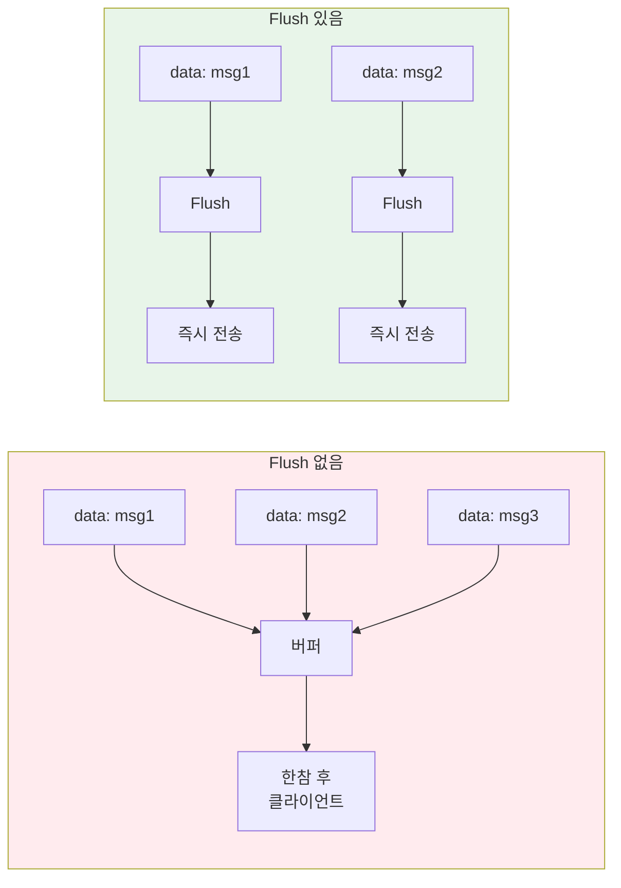

**언어별 Flush 방법:**

```go
// Go - http.Flusher 인터페이스 사용
flusher, ok := w.(http.Flusher)
fmt.Fprintf(w, "data: hello\n\n")
flusher.Flush()  // ← 필수!
```

```java
// Spring Boot - SseEmitter 사용 (내부적으로 flush)
SseEmitter emitter = new SseEmitter();
emitter.send(SseEmitter.event().data("hello"));
```

```javascript
// Node.js Express
res.write("data: hello\n\n");
res.flush();  // compression 미들웨어 사용 시 필요
```

#### 2. 클라이언트 연결 종료 감지

클라이언트가 브라우저를 닫거나 `eventSource.close()`를 호출하면, 서버는 이를 감지하고 **리소스를 정리**해야 합니다. 그렇지 않으면 고루틴/스레드가 계속 살아있어 메모리 누수가 발생합니다.

```go
// Go - Context로 연결 종료 감지
for {
    select {
    case <-r.Context().Done():
        // 클라이언트 연결 끊김 - 정리 후 종료
        log.Println("Client disconnected")
        return
    case data := <-dataChan:
        fmt.Fprintf(w, "data: %s\n\n", data)
        flusher.Flush()
    }
}
```

#### 3. 프록시/로드밸런서 설정

Nginx 같은 리버스 프록시도 기본적으로 버퍼링합니다. SSE가 동작하려면 프록시 설정이 필요합니다.

```nginx
# Nginx 설정
location /events {
    proxy_pass http://backend;

    # SSE를 위한 필수 설정
    proxy_buffering off;           # 버퍼링 비활성화
    proxy_cache off;               # 캐시 비활성화
    proxy_read_timeout 86400s;     # 긴 연결 유지 (24시간)

    # 헤더 전달
    proxy_set_header Connection '';
    proxy_http_version 1.1;
    chunked_transfer_encoding off;
}
```

#### SSE 백엔드 체크리스트

| 항목 | 설명 | 필수 |
|------|------|:----:|
| **헤더 설정** | `Content-Type: text/event-stream` 등 | ✓ |
| **버퍼 Flush** | 데이터 전송 후 즉시 flush | ✓ |
| **연결 종료 감지** | 클라이언트 끊김 시 리소스 정리 | ✓ |
| **메시지 포맷** | `data: ...\n\n` 형식 준수 | ✓ |
| **프록시 설정** | Nginx 등에서 버퍼링 비활성화 | 환경에 따라 |
| **타임아웃 설정** | 긴 연결을 위한 타임아웃 조정 | 환경에 따라 |

**흔한 실수**: "헤더는 설정했는데 왜 안 되지?" → **Flush를 안 했을 가능성 99%**

### 클라이언트 구현 예시 (React-TypeScript)

```tsx
import { useEffect, useState, useCallback } from 'react';

interface SSEMessage {
  time: string;
}

function useSSE(url: string) {
  const [data, setData] = useState<SSEMessage | null>(null);
  const [error, setError] = useState<Error | null>(null);
  const [isConnected, setIsConnected] = useState(false);

  useEffect(() => {
    const eventSource = new EventSource(url);

    eventSource.onopen = () => {
      setIsConnected(true);
      setError(null);
    };

    eventSource.onmessage = (event) => {
      try {
        const parsed = JSON.parse(event.data);
        setData(parsed);
      } catch {
        // JSON이 아닌 경우 문자열로 처리
        setData({ time: event.data });
      }
    };

    eventSource.onerror = () => {
      setIsConnected(false);
      setError(new Error('SSE connection failed'));
      // 브라우저가 자동으로 재연결 시도함
    };

    // 클린업: 컴포넌트 언마운트 시 연결 종료
    return () => {
      eventSource.close();
    };
  }, [url]);

  return { data, error, isConnected };
}

// 사용 예시
function SSEComponent() {
  const { data, error, isConnected } = useSSE('/events');

  return (
    <div>
      <p>Status: {isConnected ? '연결됨' : '연결 끊김'}</p>
      {error && <p style={{ color: 'red' }}>{error.message}</p>}
      {data && <p>서버 시간: {data.time}</p>}
    </div>
  );
}
```

### 필수 HTTP 헤더

SSE가 동작하려면 서버가 반드시 세 가지 헤더를 설정해야 합니다.

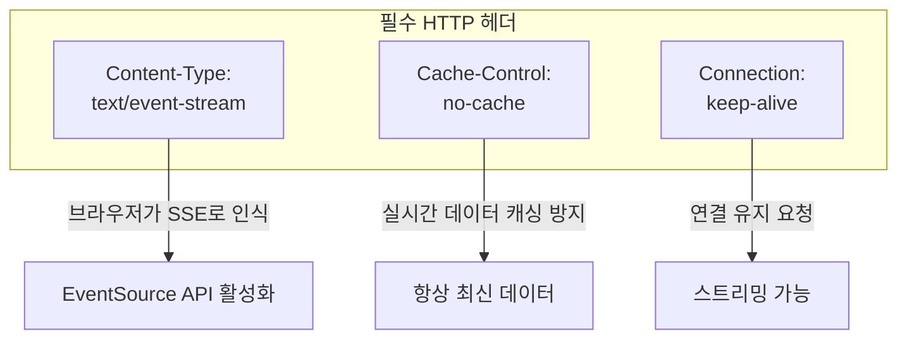

**각 헤더의 역할:**

`Content-Type: text/event-stream`은 브라우저에게 "이것은 SSE 스트림이다"라고 알려줍니다. 이 헤더가 없으면 브라우저는 일반 HTTP 응답으로 처리하고, 응답이 완전히 끝날 때까지 기다립니다.

`Cache-Control: no-cache`는 프록시나 브라우저가 응답을 캐싱하지 않도록 합니다. 실시간 데이터가 캐싱되면 사용자에게 오래된 데이터가 표시될 수 있습니다.

`Connection: keep-alive`는 연결을 유지하도록 요청합니다. HTTP/1.1에서는 기본값이지만, 명시적으로 설정하는 것이 안전합니다.

---

## 브라우저 지원

### 지원 현황 (2026년 기준)

SSE는 IE를 제외한 모든 주요 브라우저에서 지원됩니다. IE는 2022년 6월에 지원이 종료되었으므로, 현재 신규 프로젝트에서 IE를 고려할 필요는 거의 없습니다.

| 브라우저 | 지원 | 최소 버전 |
|----------|------|-----------|
| Chrome | ✅ Yes | 6+ (2010) |
| Firefox | ✅ Yes | 6+ (2011) |
| Safari | ✅ Yes | 5+ (2010) |
| Edge | ✅ Yes | 79+ (Chromium 기반) |
| Opera | ✅ Yes | 11+ (2010) |
| **IE** | ❌ **No** | 지원 종료 |

### 지원 확인 코드

런타임에 SSE 지원 여부를 확인하려면 `EventSource` 객체의 존재를 확인합니다.

```javascript
if (typeof EventSource !== 'undefined') {
  console.log('SSE 지원됨');
  const eventSource = new EventSource('/events');
} else {
  console.log('SSE 미지원 - 폴백 필요');
  // Long Polling이나 다른 대안 사용
}
```

### 폴백 옵션

레거시 브라우저 지원이 필요한 경우 세 가지 옵션이 있습니다.

**첫째, 폴리필 사용입니다.** [eventsource-polyfill](https://github.com/Yaffle/EventSource)은 XHR을 사용하여 SSE를 구현합니다. 코드 변경 없이 IE에서도 SSE를 사용할 수 있습니다.

**둘째, Long Polling으로 폴백합니다.** SSE가 지원되지 않으면 Long Polling을 사용합니다. 실시간성은 약간 떨어지지만, 모든 브라우저에서 동작합니다.

**셋째, Socket.IO를 사용합니다.** Socket.IO는 WebSocket, SSE, Long Polling 등 여러 전송 방식을 자동으로 선택합니다. 브라우저와 네트워크 환경에 따라 최적의 방식을 사용합니다.

---

## 왜 SSE는 단방향인가?

SSE가 서버→클라이언트 단방향만 지원하는 것은 **의도된 설계**입니다.

### 이유 1: HTTP의 본질적 특성

HTTP는 요청-응답 모델입니다. SSE는 이 응답을 "무한히 긴 응답"으로 만든 것입니다.

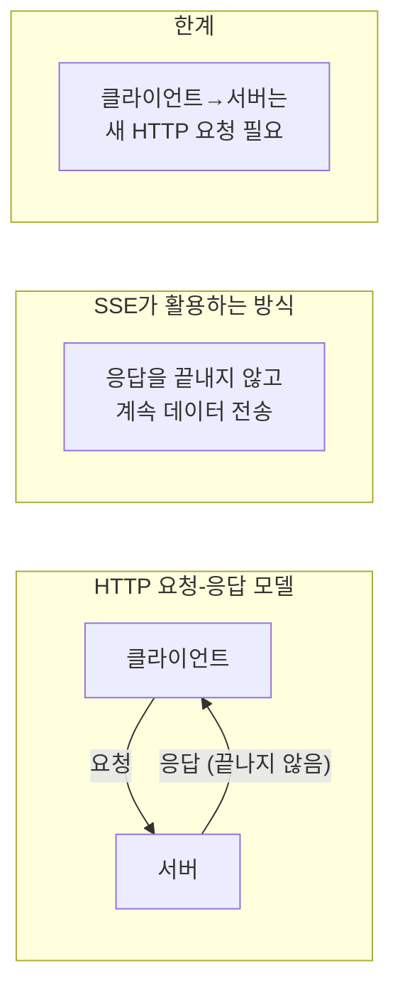

### 이유 2: 단순성이 장점

양방향이 필요 없다면, SSE의 단순함이 오히려 강점입니다.

| 항목 | SSE | WebSocket |
|------|-----|-----------|
| 서버 구현 | 표준 HTTP 핸들러 | 별도 프로토콜 처리 |
| 디버깅 | 브라우저 Network 탭 | 별도 도구 필요 |
| 인프라 호환 | 기존 HTTP 그대로 | 프록시/방화벽 설정 필요 |

---

## 실무 패턴: SSE + REST API

대부분의 실시간 요구사항은 이 패턴으로 해결됩니다.

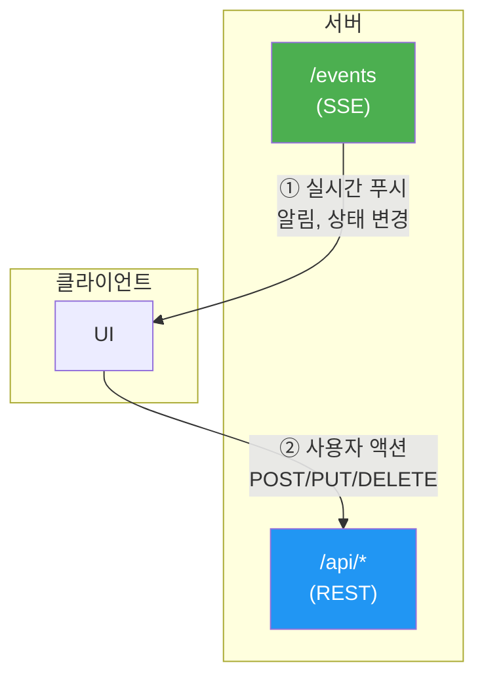

### 언제 어떤 방향을 사용하는가?

| 방향 | 기술 | 특징 | 예시 |
|------|------|------|------|
| **서버 → 클라이언트** | SSE | 빈번하고 예측 불가 | 새 알림 도착, 가격 변동 |
| **클라이언트 → 서버** | REST API | 사용자 액션 시에만 | 읽음 표시, 좋아요 클릭 |

### 코드 예시: 알림 시스템

**서버 → 클라이언트 (SSE)**

```typescript
// 새 알림이 언제 올지 모름 → SSE로 실시간 수신
const eventSource = new EventSource('/notifications');

eventSource.onmessage = (e) => {
  const notification = JSON.parse(e.data);
  showNotification(notification);
};
```

**클라이언트 → 서버 (REST API)**

```typescript
// 사용자가 "읽음" 버튼 클릭 → REST API 호출
async function markAsRead(notificationId: string) {
  await fetch(`/api/notifications/${notificationId}/read`, {
    method: 'POST',
  });
}
```

> **핵심**: 80%의 실시간 기능은 "서버가 클라이언트에 알려주는" 단방향입니다. 나머지 20%의 클라이언트 액션은 기존 REST API로 충분합니다.

---

## SSE 사용 사례

SSE는 **서버가 클라이언트에게 데이터를 푸시하는** 모든 경우에 적합합니다. 반대로, 클라이언트가 서버에 자주 데이터를 보내야 하는 경우에는 WebSocket이 더 적합합니다.

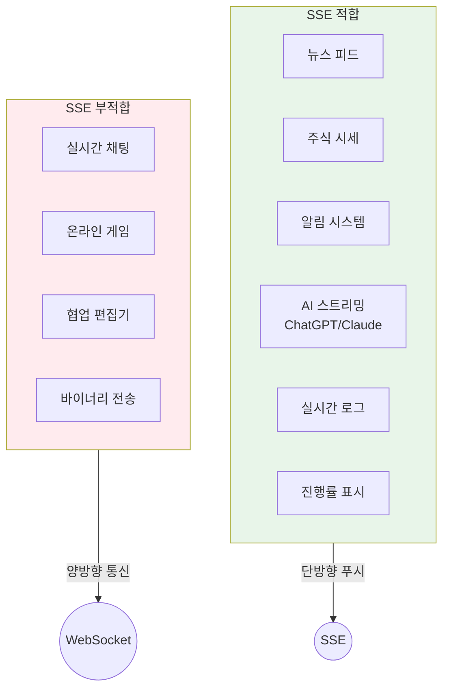

**SSE가 적합한 경우를 상세히 설명하면:**

"뉴스 피드"는 새 기사가 올라오면 서버가 클라이언트에게 푸시합니다. 사용자는 읽기만 합니다.

"주식 시세"는 가격이 변할 때마다 서버가 업데이트를 푸시합니다. 초당 수십 개의 업데이트가 있을 수 있습니다.

"알림 시스템"은 새 알림이 생기면 서버가 즉시 푸시합니다. 사용자의 "읽음" 표시는 REST API로 처리합니다.

"AI 스트리밍"은 ChatGPT, Claude가 사용하는 방식입니다. AI 응답을 토큰 단위로 스트리밍하여 사용자가 타이핑되는 것처럼 보이게 합니다.

"실시간 로그"는 서버 로그를 실시간으로 모니터링할 때 사용합니다. 새 로그가 생길 때마다 푸시합니다.

"진행률 표시"는 파일 업로드, 배치 작업 등의 진행 상황을 실시간으로 보여줍니다.

**SSE가 부적합한 경우:**

"실시간 채팅"은 사용자가 메시지를 보내는 것(클라이언트→서버)이 빈번합니다. WebSocket이 더 효율적입니다.

"온라인 게임"은 플레이어의 입력이 초당 수십 번 서버로 전송됩니다. 낮은 지연시간과 양방향 통신이 필수입니다.

"협업 편집기"는 여러 사용자의 편집이 실시간으로 동기화되어야 합니다. 양방향 통신과 충돌 해결 로직이 필요합니다.

"바이너리 전송"은 SSE가 텍스트만 지원하므로 부적합합니다. WebSocket은 바이너리 프레임을 지원합니다.

---

## 자동 재연결과 Last-Event-ID

SSE의 강력한 기능 중 하나는 **브라우저가 자동으로 재연결을 처리**한다는 것입니다.

### 재연결 동작 방식

네트워크 연결이 끊어지거나 서버가 연결을 종료하면, 브라우저는 자동으로 재연결을 시도합니다. 기본 재연결 대기 시간은 브라우저마다 다르지만 보통 3초입니다.

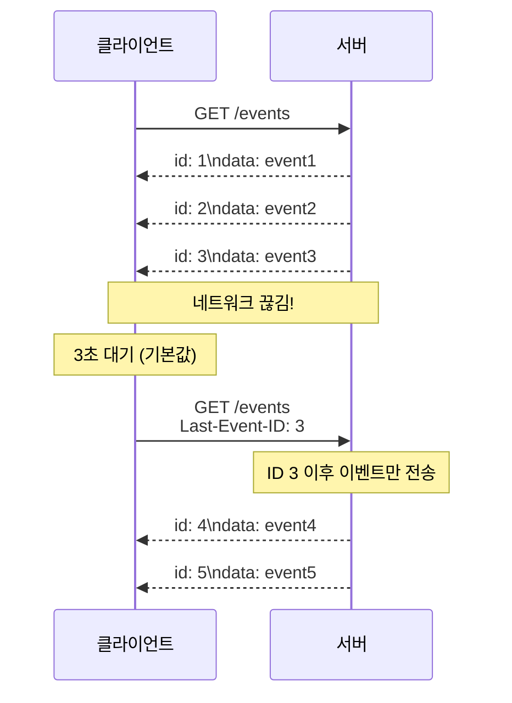

**Last-Event-ID의 중요성:**

재연결 시 브라우저는 `Last-Event-ID` 헤더에 마지막으로 받은 이벤트 ID를 포함합니다. 서버는 이 ID를 확인하고, 그 이후의 이벤트만 전송할 수 있습니다. 이렇게 하면 **이벤트 손실 없이** 연결을 복구할 수 있습니다.

서버가 이 기능을 지원하려면:
1. 모든 이벤트에 `id:` 필드를 포함
2. 클라이언트의 `Last-Event-ID` 헤더를 확인
3. 해당 ID 이후의 이벤트만 전송

### 재연결 간격 조절

서버는 `retry:` 필드로 재연결 대기 시간을 조절할 수 있습니다.

```
retry: 10000
data: Server is busy, please reconnect slowly
```

서버 부하가 높을 때 `retry` 값을 늘리면 클라이언트들의 재연결 빈도를 줄일 수 있습니다.

---

## 면접 대비 요약

### 한 줄 정의

> "SSE(Server-Sent Events)는 HTTP 연결을 유지한 채로 서버가 클라이언트에게 실시간으로 이벤트를 푸시하는 웹 표준 기술입니다."

### 핵심 포인트 3가지

1. **HTTP 기반 단방향**: 순수 HTTP를 사용하므로 방화벽/프록시 문제가 없고, 서버→클라이언트 단방향 통신에 특화
2. **자동 재연결**: 브라우저가 연결 복구를 자동 처리하고, Last-Event-ID로 이벤트 손실 방지
3. **AI 스트리밍 표준**: ChatGPT, Claude 등 현대 AI 서비스의 응답 스트리밍에 사용

### 자주 묻는 질문

**Q: SSE와 WebSocket 중 언제 무엇을 선택해야 하나요?**

> A: 서버→클라이언트 단방향 푸시만 필요하면 SSE를 선택합니다. 알림, 피드, AI 스트리밍이 대표적입니다. 양방향 통신이 빈번하면 WebSocket을 선택합니다. 채팅, 게임, 협업 도구가 대표적입니다. 양방향이 필요하지만 빈번하지 않다면 "SSE + REST API" 조합도 좋은 선택입니다.

**Q: SSE가 텍스트만 지원하는데 문제가 되지 않나요?**

> A: 실무에서 대부분의 실시간 데이터는 JSON입니다. 바이너리가 필요한 경우(이미지, 파일)는 드물고, 필요하면 Base64 인코딩이나 별도 엔드포인트를 사용합니다. 텍스트 전용이라는 제약은 실제로 큰 문제가 되지 않습니다.

**Q: HTTP/1.1에서 SSE 연결 수 제한 문제는 어떻게 해결하나요?**

> A: HTTP/2를 사용하면 해결됩니다. HTTP/2의 멀티플렉싱으로 하나의 TCP 연결에서 128개 스트림을 동시에 처리할 수 있습니다. 2026년 현재 HTTP/2 지원율은 96% 이상이므로 대부분의 환경에서 문제가 없습니다.

**Q: HTTP/1.1 Keep-Alive도 연결을 유지하는데, SSE와 무엇이 다른가요?**

> A: Keep-Alive는 "연결 재사용"이고, SSE는 "응답이 끝나지 않음"입니다.
>
> Keep-Alive에서는 요청1 → 응답1(완료) → 요청2 → 응답2(완료) 순서로 진행됩니다. 각 응답은 완료되고, 서버가 먼저 데이터를 보낼 수 없습니다. 클라이언트가 요청해야만 응답할 수 있습니다.
>
> SSE에서는 요청1 → 응답(끝나지 않음... 데이터... 데이터...)입니다. 하나의 응답이 계속 진행 중이므로, 서버가 원할 때 데이터를 보낼 수 있습니다.

**Q: Chunked Transfer Encoding은 일반 HTTP에서도 쓰는데, SSE와 직접적인 연관이 있나요?**

> A: Chunked 인코딩 자체는 SSE만의 것이 아닙니다. 대용량 파일 다운로드에도 사용합니다.
>
> 차이점은 일반 HTTP Chunked는 마지막에 크기 0인 chunk를 보내서 "응답 종료"를 알립니다. SSE는 의도적으로 이 종료 chunk를 보내지 않아서 "응답이 끝나지 않음" 상태를 유지합니다.
>
> Chunked는 "전송 방식"이고, SSE는 "프로토콜 + 브라우저 API"입니다. SSE가 Chunked를 활용하지만, 핵심은 `Content-Type: text/event-stream`을 보고 브라우저가 스트림으로 인식하여 도착 즉시 이벤트를 발생시킨다는 점입니다.

**Q: SSE 백엔드 구현 시 헤더 설정 외에 주의할 점이 있나요?**

> A: 네, **버퍼 Flush가 필수**입니다. 웹 서버는 기본적으로 응답을 버퍼링하여 모아서 보내는데, SSE는 데이터가 생길 때마다 즉시 전송해야 합니다.
>
> Go에서는 `http.Flusher` 인터페이스로 `Flush()`를 호출하고, Spring Boot는 `SseEmitter`가 내부적으로 처리합니다. Node.js Express는 `res.flush()`를 사용합니다.
>
> 또한 클라이언트 연결 종료를 감지하여 리소스를 정리해야 하고, Nginx 같은 프록시를 사용한다면 `proxy_buffering off` 설정이 필요합니다.
>
> **가장 흔한 실수**: "헤더는 설정했는데 왜 안 되지?" → Flush를 안 했을 가능성이 높습니다.

**Q: HTTP/1.1에서 Keep-Alive로 연결을 재사용할 수 있는데, 왜 여러 연결이 필요한가요?**

> A: HTTP/1.1의 **Head-of-Line Blocking** 때문입니다. Keep-Alive는 연결을 재사용하지만, 하나의 연결에서 요청-응답이 순차적입니다. 응답1이 올 때까지 요청2를 보낼 수 없습니다.
>
> 웹페이지에 리소스가 18개 있다면, 하나의 연결로 순차 처리하면 매우 느립니다. 그래서 브라우저는 도메인당 6개 연결을 열어서 병렬 처리합니다.
>
> HTTP/2의 멀티플렉싱은 하나의 연결에서 여러 요청을 동시에 처리하여 이 문제를 해결합니다.

---

## 요약

| 항목 | 내용 |
|------|------|
| **정의** | HTTP 연결을 유지하며 서버가 클라이언트에게 실시간 이벤트를 푸시하는 기술 |
| **프로토콜** | HTTP/HTTPS (순수 HTTP, 프로토콜 업그레이드 없음) |
| **API** | EventSource (브라우저 내장, 라이브러리 불필요) |
| **데이터 형식** | text/event-stream (UTF-8 텍스트, JSON 주로 사용) |
| **재연결** | 브라우저 자동 지원, Last-Event-ID로 이벤트 복구 |
| **브라우저** | IE 제외 모든 주요 브라우저 (96%+ 지원) |
| **적합한 사례** | 알림, 피드, AI 스트리밍, 실시간 로그, 진행률 |
| **부적합한 사례** | 채팅, 게임, 협업 편집기 (양방향 필요) |

---

다음 섹션: [02. EventSource API 상세](../02-eventsource/) | 실습: [practice/](./practice/)
