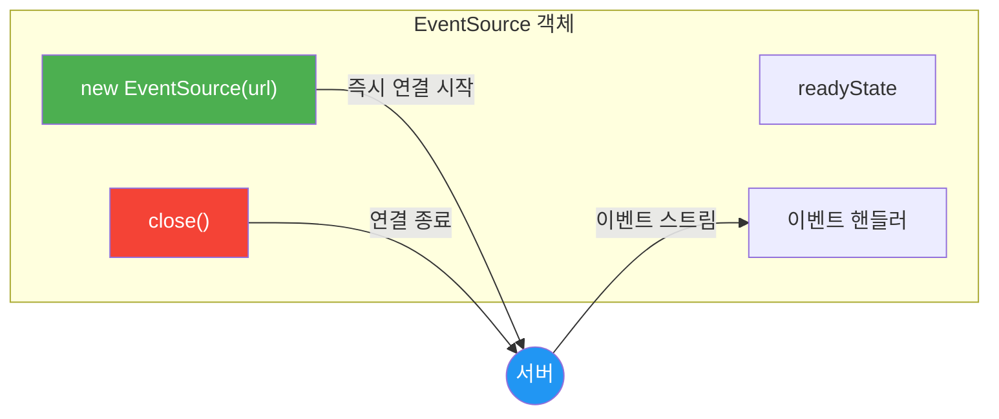
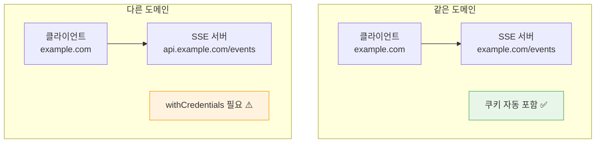
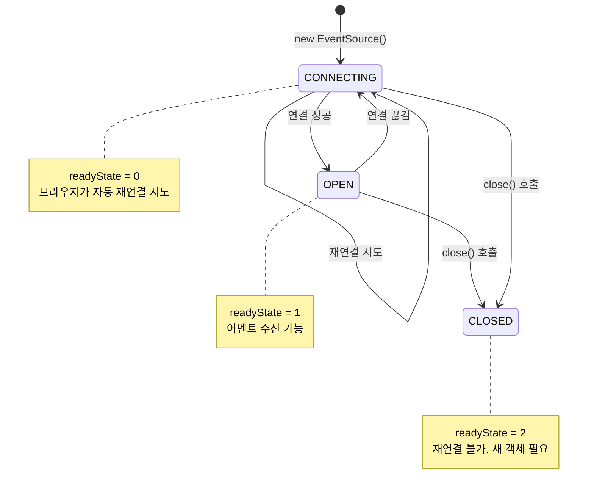
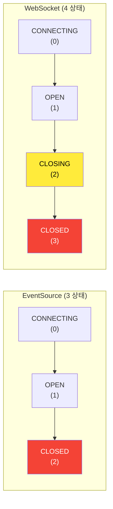
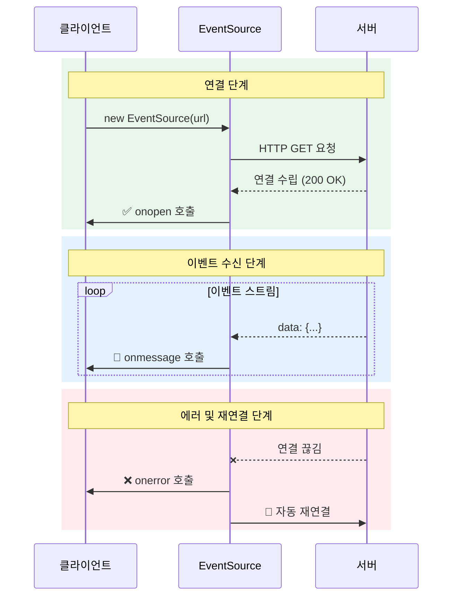
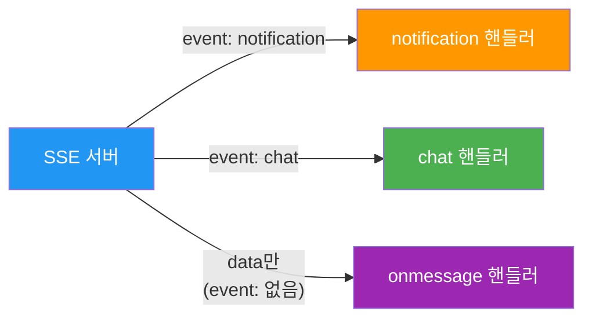
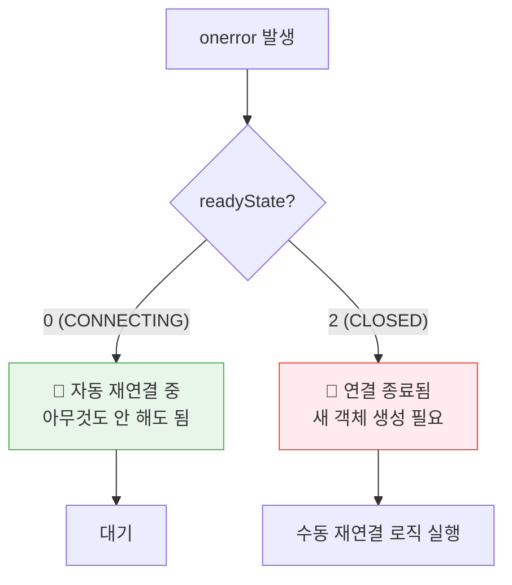
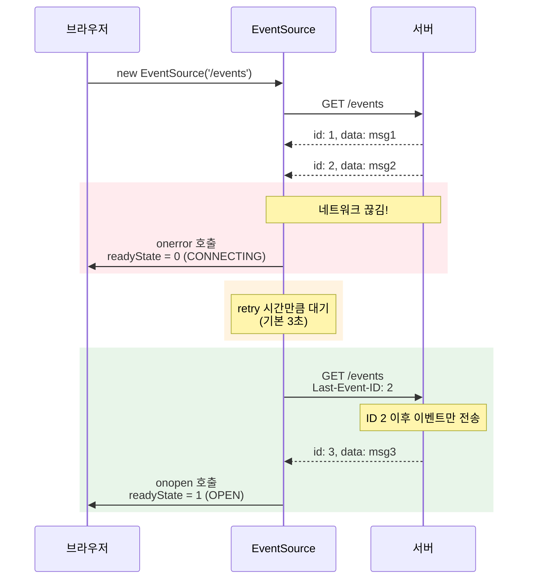
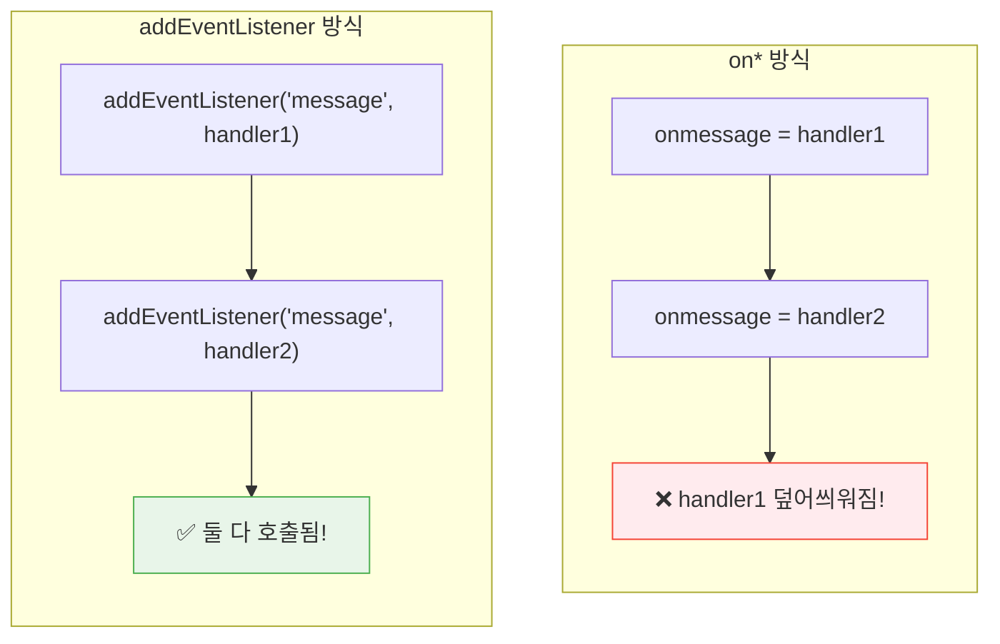
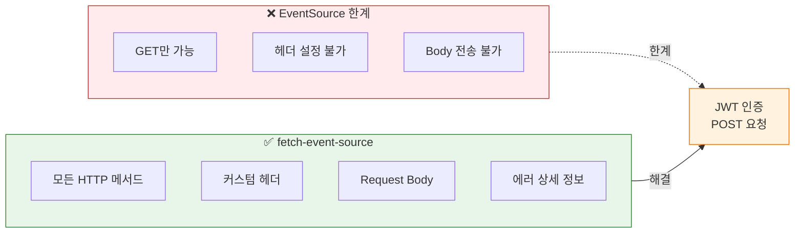

# 02. EventSource API - 학습 (LEARN)

## 학습 목표

이 문서를 학습하면 다음 질문에 답할 수 있습니다:
- EventSource API는 무엇이고, 왜 WebSocket 대신 사용하는가?
- readyState의 각 상태는 무엇을 의미하며, 언제 전환되는가?
- EventSource의 인증 처리 한계와 해결책은 무엇인가?

---

## EventSource란?

> **한 문장 정의**: EventSource는 **SSE 연결을 관리하는 브라우저 내장 API**로, 객체 생성 즉시 서버와 연결을 시작하고 연결이 끊기면 자동으로 재연결을 시도합니다.

### 왜 EventSource가 필요한가?

브라우저가 SSE를 위한 전용 API를 제공하는 이유는 **개발자가 직접 구현해야 할 복잡한 로직을 추상화**하기 위함입니다.

| fetch 직접 구현 | EventSource 사용 |
|----------------|------------------|
| 텍스트 파싱 직접 처리 | 자동 파싱 |
| 재연결 로직 직접 구현 | 자동 재연결 |
| 이벤트 ID 추적 직접 관리 | Last-Event-ID 자동 관리 |
| **100줄 이상 코드** | **3줄 코드** |



---

## EventSource vs Fetch 스트리밍

### 왜 EventSource가 10배 간결한가?

Fetch로 SSE를 구현하려면 스트림 읽기, 버퍼 관리, 프로토콜 파싱을 모두 직접 해야 합니다.
EventSource는 이 모든 것을 내장하고 있어 개발자가 비즈니스 로직에만 집중할 수 있습니다.

### Fetch로 SSE 구현 (복잡함)

```typescript
const response = await fetch('/events');
const reader = response.body!.getReader();
const decoder = new TextDecoder();
let buffer = '';

while (true) {
  const { done, value } = await reader.read();
  if (done) break;

  buffer += decoder.decode(value, { stream: true });
  // 수동으로 data:, event:, id: 파싱 필요
  // 재연결 로직 직접 구현 필요
  // Last-Event-ID 관리 필요
}
```

### EventSource로 SSE 구현 (간단함)

```typescript
const es = new EventSource('/events');
es.onmessage = (e) => console.log(e.data);
// 파싱, 재연결, ID 관리 모두 자동!
```

---

## 생성자와 연결 시작

EventSource 객체를 생성하면 **즉시 연결을 시작**합니다. 이는 WebSocket과 동일한 동작입니다.

### 기본 생성

```typescript
// 가장 간단한 사용법
const eventSource = new EventSource('/events');

// 이 시점에서 이미 연결 시도가 시작됨!
console.log(eventSource.readyState);  // 0 (CONNECTING)
```

---

## withCredentials 옵션

### 왜 withCredentials가 필요한가?

브라우저는 보안을 위해 **동일 출처 정책(Same-Origin Policy)**을 적용합니다.
다른 도메인의 SSE 서버에 연결할 때 쿠키나 인증 정보를 보내려면 명시적으로 허용해야 합니다.

### 사용 시나리오



### 코드 예시

```typescript
// 같은 도메인 요청 (쿠키 자동 포함)
const es1 = new EventSource('/events');

// 다른 도메인 요청 (쿠키 포함 필요)
const es2 = new EventSource('https://api.example.com/events', {
  withCredentials: true  // 쿠키, Authorization 헤더 포함
});
```

### 서버 요구사항

`withCredentials: true` 사용 시 서버에서 반드시 설정해야 할 헤더:

| 헤더 | 값 | 설명 |
|------|-----|------|
| `Access-Control-Allow-Origin` | `https://example.com` | 와일드카드(`*`) **사용 불가** |
| `Access-Control-Allow-Credentials` | `true` | 필수 설정 |

---

## readyState: 연결 상태 관리

readyState는 **현재 연결 상태를 나타내는 읽기 전용 속성**입니다.
이 값을 통해 연결이 성공했는지, 재연결 중인지, 완전히 종료되었는지 판단할 수 있습니다.

### 상태 값 요약

| 상수 | 값 | 의미 | 발생 시점 |
|------|-----|------|----------|
| `CONNECTING` | 0 | 연결 시도 중 | 객체 생성 직후, 재연결 시도 중 |
| `OPEN` | 1 | 연결 완료 | 서버와 연결 성공 |
| `CLOSED` | 2 | 연결 종료 | `close()` 호출 후 |

### 상태 전이 다이어그램



---

## EventSource vs WebSocket readyState

### 왜 EventSource에는 CLOSING이 없는가?

EventSource는 **단방향 통신**이므로 우아한 종료(graceful shutdown)가 필요 없습니다.
WebSocket은 양방향이므로 양쪽 모두 종료 핸드셰이크가 필요하지만, SSE는 클라이언트가 일방적으로 끊으면 됩니다.

### 비교 테이블

| 상태 | EventSource | WebSocket |
|------|-------------|-----------|
| 연결 중 | `CONNECTING (0)` | `CONNECTING (0)` |
| 연결됨 | `OPEN (1)` | `OPEN (1)` |
| 종료 중 | **없음** | `CLOSING (2)` |
| 종료됨 | `CLOSED (2)` | `CLOSED (3)` |

### 비교 다이어그램



---

## 이벤트 핸들러

EventSource는 세 가지 이벤트 핸들러를 제공합니다.
각 핸들러는 연결 라이프사이클의 특정 시점에 호출됩니다.

### 이벤트 흐름 다이어그램



---

## onopen: 연결 성공

`onopen`은 **서버와 연결이 성공적으로 수립**되었을 때 호출됩니다.
이 시점에서 readyState는 `OPEN(1)`입니다.

```typescript
eventSource.onopen = (event) => {
  console.log('SSE 연결 성공');
  console.log('readyState:', eventSource.readyState);  // 1 (OPEN)

  // UI 상태 업데이트
  setConnectionStatus('connected');
};
```

---

## onmessage: 메시지 수신

### 주의: 기본 메시지만 수신

`onmessage`는 **서버에서 `event:` 필드 없이 보낸 메시지**만 수신합니다.
커스텀 이벤트 타입이 지정된 메시지는 onmessage로 받을 수 없습니다.

### event: 필드란?

SSE 프로토콜에서 서버가 보내는 메시지는 여러 필드로 구성됩니다.
`event:` 필드는 **이벤트 타입을 지정**하는 역할을 합니다.

```
event: <이벤트 타입>
id: <이벤트 ID>
data: <실제 데이터>
retry: <재연결 시간(ms)>
```

**핵심**: `event:` 필드가 없으면 이벤트 타입이 기본값 `"message"`가 됩니다.
이것이 바로 `onmessage`가 `event:` 필드 없는 메시지만 받는 이유입니다.

### event: 필드 유무에 따른 동작 차이

| 서버 응답 | 이벤트 타입 | 수신 방법 |
|----------|------------|----------|
| `data: hello\n\n` | `"message"` (기본값) | `onmessage` 또는 `addEventListener('message', ...)` |
| `event: notification\ndata: hello\n\n` | `"notification"` | **오직** `addEventListener('notification', ...)` |
| `event: update\ndata: hello\n\n` | `"update"` | **오직** `addEventListener('update', ...)` |



### 기본 사용법

```typescript
eventSource.onmessage = (event) => {
  // MessageEvent 객체의 주요 속성
  console.log('데이터:', event.data);         // 서버가 보낸 데이터
  console.log('ID:', event.lastEventId);      // 이벤트 ID (있는 경우)
  console.log('출처:', event.origin);         // 이벤트 출처 URL
  console.log('타입:', event.type);           // 'message'
};
```

### MessageEvent 속성 정리

| 속성 | 타입 | 설명 |
|------|------|------|
| `data` | string | 서버가 보낸 데이터 (**항상 문자열**, JSON은 직접 파싱 필요) |
| `lastEventId` | string | 마지막 이벤트 ID (재연결 시 사용) |
| `origin` | string | 이벤트 출처 URL (보안 검증에 사용) |
| `type` | string | 이벤트 타입 (`'message'` 또는 커스텀) |

---

## onerror: 에러 처리

### 왜 에러 상세 정보가 없는가?

`onerror`는 **연결 오류 발생 시** 호출됩니다.
중요한 점은 **에러 상세 정보가 제공되지 않는다**는 것입니다.

이는 보안상의 이유입니다. 에러 상세를 노출하면 공격자가 서버 상태를 파악할 수 있기 때문입니다.
대신 **readyState를 확인해서 상태를 판단**해야 합니다.

### 에러 처리 패턴

```typescript
eventSource.onerror = (event) => {
  // ⚠️ event 객체에는 에러 상세 정보가 없음!
  // readyState로 상태 판단

  if (eventSource.readyState === EventSource.CONNECTING) {
    console.log('재연결 시도 중...');
    // 브라우저가 자동으로 재연결을 시도하고 있음
  } else if (eventSource.readyState === EventSource.CLOSED) {
    console.log('연결이 완전히 종료됨');
    // close()가 호출되었거나 복구 불가능한 에러
  }
};
```

### readyState별 처리 방법



---

## close() 메서드

`close()` 메서드는 **연결을 즉시 종료**합니다.
호출 즉시 readyState가 `CLOSED(2)`가 되며, **자동 재연결도 중단**됩니다.

### 중요 특성

```typescript
eventSource.close();
console.log(eventSource.readyState);  // 2 (CLOSED)

// ⚠️ close() 호출 후에는 재연결이 되지 않음!
// 다시 연결하려면 새 EventSource 객체 생성 필요
```

### 자동 재연결 메커니즘

EventSource의 가장 큰 장점 중 하나는 **브라우저가 자동으로 재연결을 처리**한다는 것입니다.



**핵심 포인트:**
- 연결 끊김 시 `onerror` 호출, `readyState`는 `CONNECTING(0)`
- 브라우저가 `retry` 시간(기본 3초) 후 자동 재연결
- 재연결 시 `Last-Event-ID` 헤더에 마지막 수신 ID 포함
- 서버는 해당 ID 이후 이벤트만 전송 가능

### 수동 재연결 패턴

close() 후 재연결이 필요하면 **새 객체를 생성**해야 합니다.

```typescript
let eventSource = new EventSource('/events');

function reconnect() {
  // 1. 기존 연결 종료
  eventSource.close();

  // 2. 새 객체 생성으로 재연결
  eventSource = new EventSource('/events');
  setupHandlers(eventSource);
}

function setupHandlers(es: EventSource) {
  es.onopen = () => console.log('연결됨');
  es.onmessage = (e) => console.log('데이터:', e.data);
  es.onerror = () => {
    if (es.readyState === EventSource.CLOSED) {
      // 필요 시 수동 재연결
      setTimeout(reconnect, 5000);
    }
  };
}
```

---

## addEventListener vs on* 속성

이벤트 핸들러를 등록하는 두 가지 방법이 있습니다.

### 핵심 차이점

| 특성 | `on*` 속성 | `addEventListener` |
|------|-----------|-------------------|
| 핸들러 개수 | **1개만** | **여러 개** 가능 |
| 중복 등록 시 | 덮어씌움 | 모두 호출 |
| 커스텀 이벤트 | ❌ 불가 | ✅ 가능 |

### 다이어그램 비교



### 코드 비교

**on* 방식: 마지막 핸들러만 동작**

```typescript
eventSource.onmessage = logToConsole;
eventSource.onmessage = updateUI;  // ❌ logToConsole이 덮어씌워짐!
```

**addEventListener 방식: 모든 핸들러 동작**

```typescript
eventSource.addEventListener('message', logToConsole);
eventSource.addEventListener('message', updateUI);      // ✅ 둘 다 호출됨
eventSource.addEventListener('message', sendAnalytics); // ✅ 셋 다 호출됨
```

---

## 커스텀 이벤트: addEventListener 필수

서버가 `event:` 필드로 보낸 커스텀 이벤트는 **반드시 addEventListener로만** 받을 수 있습니다.

### 서버 응답 예시

```
event: notification
data: {"message": "새 알림"}
```

### 클라이언트 수신 방법

```typescript
// ❌ onmessage로는 받을 수 없음
eventSource.onmessage = (e) => {
  // notification 이벤트는 여기로 오지 않음!
};

// ✅ addEventListener로 받아야 함
eventSource.addEventListener('notification', (e) => {
  console.log('알림:', e.data);
});
```

---

## 인증 처리: EventSource의 한계와 해결책

### 문제: 커스텀 헤더 미지원

EventSource는 **커스텀 HTTP 헤더를 지원하지 않습니다**.
이것이 EventSource의 **가장 큰 한계**입니다.

```typescript
// ❌ 불가능! headers 옵션이 없음
const es = new EventSource('/events', {
  headers: {
    'Authorization': 'Bearer token123'  // 지원 안 됨!
  }
});
```

### 해결책 비교

| 해결책 | 장점 | 단점 | 권장 상황 |
|--------|------|------|----------|
| **쿠키 기반 인증** | 표준 방식, 보안성 높음 | CORS 설정 복잡 | 세션 기반 인증 서버 |
| **URL 쿼리 파라미터** | 구현 간단 | 보안 취약 | 단기 토큰, 내부 서비스 |
| **fetch-event-source** | 완전한 HTTP 지원 | 외부 라이브러리 필요 | JWT 인증, POST 필요 시 |

---

## 해결책 1: 쿠키 기반 인증

세션 쿠키를 사용하면 `withCredentials` 옵션으로 해결할 수 있습니다.

```typescript
// 서버에서 세션 쿠키 발급
// Set-Cookie: sessionId=abc123; HttpOnly; Secure

// 클라이언트에서 쿠키 포함 요청
const es = new EventSource('/events', {
  withCredentials: true
});
```

---

## 해결책 2: URL 쿼리 파라미터

토큰을 URL에 포함시킬 수 있습니다. 단, **보안에 주의**해야 합니다.

```typescript
const token = 'abc123';
const es = new EventSource(`/events?token=${token}`);
```

### ⚠️ 보안 주의사항

| 위험 | 설명 |
|------|------|
| 서버 로그 노출 | 토큰이 서버 로그에 기록될 수 있음 |
| 브라우저 히스토리 | 주소창에 토큰이 남음 |
| Referer 헤더 | 다른 사이트로 이동 시 노출 |

**권장**: 단기 토큰(short-lived token) 사용, 만료 시간 짧게 설정

---

## 해결책 3: fetch-event-source 라이브러리

Microsoft에서 제공하는 라이브러리로, **모든 HTTP 기능을 지원**합니다.

### EventSource vs fetch-event-source 비교

| 기능 | EventSource | fetch-event-source |
|------|:-----------:|:------------------:|
| HTTP 메서드 | GET만 | GET, POST, PUT 등 |
| 커스텀 헤더 | ❌ | ✅ |
| Authorization 헤더 | ❌ (쿠키만) | ✅ |
| Request Body | ❌ | ✅ |
| HTTP 상태 코드 접근 | ❌ | ✅ |
| AbortController | ❌ | ✅ |
| 자동 재연결 | ✅ (브라우저 내장) | ✅ (직접 제어 가능) |
| 번들 크기 | 0 (내장) | ~2KB |



### 설치

```bash
npm install @microsoft/fetch-event-source
```

### 사용 예시

```typescript
import { fetchEventSource } from '@microsoft/fetch-event-source';

await fetchEventSource('/events', {
  method: 'POST',  // ✅ GET 외 메서드 지원
  headers: {
    'Authorization': 'Bearer token123',  // ✅ 커스텀 헤더 지원
    'Content-Type': 'application/json'
  },
  body: JSON.stringify({ query: 'data' }),  // ✅ 요청 본문 지원

  onopen(response) {
    if (response.ok) {
      console.log('연결 성공');
    }
  },

  onmessage(event) {
    console.log(event.data);
  },

  onerror(err) {
    console.error('에러:', err);
  }
});
```

---

## 서버 구현 (Go)

### 기본 SSE 서버

```go
package main

import (
	"fmt"
	"net/http"
	"time"
)

func eventsHandler(w http.ResponseWriter, r *http.Request) {
	// SSE 헤더 설정
	w.Header().Set("Content-Type", "text/event-stream")
	w.Header().Set("Cache-Control", "no-cache")
	w.Header().Set("Connection", "keep-alive")

	// CORS 설정 (필요시)
	w.Header().Set("Access-Control-Allow-Origin", "*")

	// Flusher 인터페이스 확인
	flusher, ok := w.(http.Flusher)
	if !ok {
		http.Error(w, "Streaming not supported", http.StatusInternalServerError)
		return
	}

	// 클라이언트 연결 해제 감지
	ctx := r.Context()

	// 이벤트 ID
	eventID := 0

	// 주기적으로 이벤트 전송
	ticker := time.NewTicker(1 * time.Second)
	defer ticker.Stop()

	for {
		select {
		case <-ctx.Done():
			// 클라이언트 연결 해제
			fmt.Println("클라이언트 연결 종료")
			return

		case t := <-ticker.C:
			eventID++

			// SSE 형식으로 전송
			fmt.Fprintf(w, "id: %d\n", eventID)
			fmt.Fprintf(w, "data: {\"time\": \"%s\", \"id\": %d}\n\n",
				t.Format(time.RFC3339), eventID)

			flusher.Flush()
		}
	}
}

func main() {
	http.HandleFunc("/events", eventsHandler)

	fmt.Println("SSE 서버 시작: http://localhost:8080")
	http.ListenAndServe(":8080", nil)
}
```

---

## 클라이언트 구현 (React-TypeScript)

### useEventSource 훅

```tsx
import { useEffect, useState, useCallback, useRef } from 'react';

interface UseEventSourceOptions {
  withCredentials?: boolean;
  onOpen?: () => void;
  onError?: (event: Event) => void;
}

interface UseEventSourceReturn<T> {
  data: T | null;
  error: Error | null;
  readyState: number;
  isConnected: boolean;
  close: () => void;
}

function useEventSource<T = unknown>(
  url: string,
  options: UseEventSourceOptions = {}
): UseEventSourceReturn<T> {
  const [data, setData] = useState<T | null>(null);
  const [error, setError] = useState<Error | null>(null);
  const [readyState, setReadyState] = useState<number>(EventSource.CONNECTING);

  const eventSourceRef = useRef<EventSource | null>(null);

  useEffect(() => {
    const eventSource = new EventSource(url, {
      withCredentials: options.withCredentials
    });

    eventSourceRef.current = eventSource;

    eventSource.onopen = () => {
      setReadyState(EventSource.OPEN);
      setError(null);
      options.onOpen?.();
    };

    eventSource.onmessage = (event) => {
      try {
        const parsed = JSON.parse(event.data) as T;
        setData(parsed);
      } catch {
        setData(event.data as unknown as T);
      }
    };

    eventSource.onerror = (event) => {
      setReadyState(eventSource.readyState);

      if (eventSource.readyState === EventSource.CLOSED) {
        setError(new Error('연결이 종료되었습니다'));
      }

      options.onError?.(event);
    };

    return () => {
      eventSource.close();
    };
  }, [url, options.withCredentials]);

  const close = useCallback(() => {
    eventSourceRef.current?.close();
  }, []);

  return {
    data,
    error,
    readyState,
    isConnected: readyState === EventSource.OPEN,
    close
  };
}

export { useEventSource };
```

### 사용 예시

```tsx
interface ServerTime {
  time: string;
  id: number;
}

function TimeDisplay() {
  const { data, isConnected, error, close } = useEventSource<ServerTime>(
    '/events',
    {
      onOpen: () => console.log('연결됨'),
      onError: () => console.log('에러 발생')
    }
  );

  return (
    <div>
      <div className={`status ${isConnected ? 'connected' : 'disconnected'}`}>
        상태: {isConnected ? '연결됨' : '연결 끊김'}
      </div>

      {error && <div className="error">에러: {error.message}</div>}

      {data && (
        <div className="data">
          <p>서버 시간: {data.time}</p>
          <p>이벤트 ID: {data.id}</p>
        </div>
      )}

      <button onClick={close}>연결 종료</button>
    </div>
  );
}

export { TimeDisplay };
```

---

## 면접 대비 요약

### 한 문장 정의

> EventSource는 SSE 연결을 관리하는 브라우저 내장 API로, 자동 재연결과 이벤트 파싱을 기본 제공합니다.

### 핵심 포인트 3가지

1. **즉시 연결**: 객체 생성 시점에 연결이 시작됩니다
2. **자동 재연결**: 연결이 끊기면 브라우저가 자동으로 재연결을 시도합니다
3. **헤더 제한**: 커스텀 HTTP 헤더를 지원하지 않아 인증 처리에 제약이 있습니다

---

## 자주 묻는 질문

### Q: EventSource와 fetch 스트리밍의 차이는?

> EventSource는 자동 재연결, 이벤트 파싱, Last-Event-ID 관리를 내장하고 있습니다.
> fetch는 이 모든 것을 직접 구현해야 하지만, POST 요청과 커스텀 헤더를 지원합니다.

### Q: readyState CONNECTING과 CLOSED를 어떻게 구분하나요?

> onerror에서 readyState가 `CONNECTING(0)`이면 재연결 시도 중이고, `CLOSED(2)`면 완전히 종료된 것입니다.
> `CONNECTING` 상태에서는 브라우저가 자동으로 재연결합니다.

### Q: EventSource에서 JWT 토큰 인증을 어떻게 처리하나요?

> 세 가지 방법이 있습니다:
> 1. 세션 쿠키 + `withCredentials`
> 2. URL 쿼리 파라미터 (보안 주의)
> 3. `fetch-event-source` 라이브러리 사용
>
> 실무에서는 세션 쿠키나 라이브러리 사용을 권장합니다.

---

## 요약

| 항목 | 내용 |
|------|------|
| **생성** | `new EventSource(url, options)` - 즉시 연결 시작 |
| **상태** | `readyState` (0=연결중, 1=연결됨, 2=종료) |
| **이벤트** | `onopen`, `onmessage`, `onerror` |
| **메서드** | `close()` - 연결 종료, 재연결 중단 |
| **커스텀 이벤트** | `addEventListener` 필수 |
| **인증** | 쿠키 또는 URL 파라미터 (헤더 미지원) |

---

다음 학습: [03. 커스텀 이벤트](../03-custom-events/)
