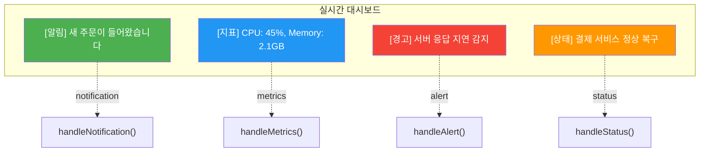
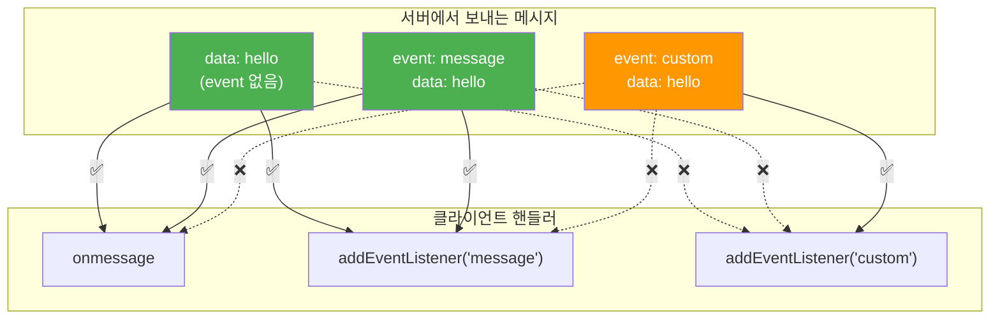

# 03. 커스텀 이벤트 - 학습 (LEARN)

## 학습 목표

이 문서를 학습하면 다음 질문에 답할 수 있습니다:
- 커스텀 이벤트가 필요한 이유와 onmessage만 사용했을 때의 문제점은?
- 서버에서 커스텀 이벤트 타입을 어떻게 지정하고, 클라이언트에서 어떻게 수신하는가?
- onmessage와 addEventListener의 이벤트 수신 차이점은 무엇인가?

---

## 왜 커스텀 이벤트가 필요한가?

> **한 문장 정의**: 커스텀 이벤트는 **서버에서 이벤트 타입을 지정**하여 클라이언트가 **타입별로 핸들러를 분리**할 수 있게 하는 SSE 기능입니다.

---

## 문제: onmessage로 모든 메시지 처리

실시간 애플리케이션에서는 알림, 지표 업데이트, 경고 등 **다양한 종류의 데이터**가 하나의 SSE 연결로 전송됩니다.
모든 메시지를 `onmessage` 하나로 처리하면 **클라이언트에서 매번 타입을 분류**해야 합니다.

### 문제가 되는 코드

```typescript
// 문제: 모든 메시지를 수동으로 분류해야 함
eventSource.onmessage = (event) => {
  const data = JSON.parse(event.data);

  // 매번 조건문으로 타입 체크 필요
  if (data.type === 'notification') {
    handleNotification(data);
  } else if (data.type === 'metrics') {
    handleMetrics(data);
  } else if (data.type === 'alert') {
    handleAlert(data);
  } else if (data.type === 'status') {
    handleStatus(data);
  }
  // 타입이 늘어날수록 분기문이 증가...
};
```

### 문제점 정리

| 문제 | 설명 |
|------|------|
| **단일 책임 원칙 위반** | 하나의 핸들러가 모든 타입을 처리 |
| **코드 복잡도 증가** | 타입이 늘어날수록 분기문 증가 |
| **서버-클라이언트 결합** | 타입 문자열을 양쪽에서 관리해야 함 |

---

## 해결: 커스텀 이벤트로 핸들러 분리

SSE의 `event:` 필드를 사용하면 **브라우저가 이벤트 라우팅**을 대신 처리합니다.

### 깔끔해진 코드

```typescript
// 깔끔: 이벤트 타입별로 핸들러 분리
eventSource.addEventListener('notification', handleNotification);
eventSource.addEventListener('metrics', handleMetrics);
eventSource.addEventListener('alert', handleAlert);
eventSource.addEventListener('status', handleStatus);

// 각 핸들러는 자신의 데이터만 처리
function handleNotification(event: MessageEvent) {
  const data = JSON.parse(event.data);
  showToast(data.message);
}

function handleMetrics(event: MessageEvent) {
  const data = JSON.parse(event.data);
  updateDashboard(data);
}
```

### 이벤트 라우팅 다이어그램



---

## 서버에서 이벤트 타입 지정

### event: 필드의 역할

SSE 프로토콜에서 `event:` 필드는 **이벤트 타입을 지정**합니다.
클라이언트의 `addEventListener`가 이 타입을 기준으로 핸들러를 호출합니다.

### SSE 메시지 형식

```
event: notification
data: {"message": "새 주문이 들어왔습니다"}

```

> **주의**: `data:` 다음에 **빈 줄(`\n\n`)**이 있어야 메시지가 완성됩니다. 빈 줄이 메시지의 경계를 나타냅니다.

---

## 기본 이벤트 타입: message

`event:` 필드가 **없으면** 이벤트 타입은 자동으로 `message`가 됩니다.

### 동일한 결과를 내는 두 메시지

```
# event: 필드 없음 → 타입은 'message'
data: Hello World

# 명시적으로 message 타입 지정 (동일한 결과)
event: message
data: Hello World

```

---

## Go 서버 구현

```go
package main

import (
	"encoding/json"
	"fmt"
	"net/http"
	"time"
)

// 다양한 이벤트 타입 정의
type NotificationEvent struct {
	Message string `json:"message"`
	Level   string `json:"level"`
}

type MetricsEvent struct {
	CPU    float64 `json:"cpu"`
	Memory float64 `json:"memory"`
	Time   string  `json:"time"`
}

type AlertEvent struct {
	Title   string `json:"title"`
	Message string `json:"message"`
	Urgency string `json:"urgency"`
}

func customEventsHandler(w http.ResponseWriter, r *http.Request) {
	// SSE 헤더 설정
	w.Header().Set("Content-Type", "text/event-stream")
	w.Header().Set("Cache-Control", "no-cache")
	w.Header().Set("Connection", "keep-alive")
	w.Header().Set("Access-Control-Allow-Origin", "*")

	flusher, ok := w.(http.Flusher)
	if !ok {
		http.Error(w, "Streaming not supported", http.StatusInternalServerError)
		return
	}

	ctx := r.Context()

	// 다양한 이벤트 시뮬레이션
	events := []struct {
		eventType string
		data      interface{}
		delay     time.Duration
	}{
		{
			eventType: "notification",
			data:      NotificationEvent{Message: "환영합니다!", Level: "info"},
			delay:     0,
		},
		{
			eventType: "metrics",
			data:      MetricsEvent{CPU: 45.2, Memory: 2.1, Time: time.Now().Format(time.RFC3339)},
			delay:     time.Second,
		},
		{
			eventType: "alert",
			data:      AlertEvent{Title: "주의", Message: "CPU 사용량 증가", Urgency: "medium"},
			delay:     2 * time.Second,
		},
		{
			eventType: "", // 기본 message 타입
			data:      map[string]string{"text": "일반 메시지입니다"},
			delay:     3 * time.Second,
		},
	}

	for _, e := range events {
		select {
		case <-ctx.Done():
			return
		case <-time.After(e.delay):
			// 이벤트 타입 지정 (있는 경우만)
			if e.eventType != "" {
				fmt.Fprintf(w, "event: %s\n", e.eventType)
			}

			// 데이터 JSON 직렬화
			jsonData, _ := json.Marshal(e.data)
			fmt.Fprintf(w, "data: %s\n\n", jsonData)

			flusher.Flush()
		}
	}

	// 연결 유지하며 주기적 이벤트 전송
	ticker := time.NewTicker(5 * time.Second)
	defer ticker.Stop()

	for {
		select {
		case <-ctx.Done():
			return
		case t := <-ticker.C:
			// metrics 이벤트 주기적 전송
			metrics := MetricsEvent{
				CPU:    45.0 + float64(t.Second()%20),
				Memory: 2.0 + float64(t.Second()%10)/10,
				Time:   t.Format(time.RFC3339),
			}
			jsonData, _ := json.Marshal(metrics)

			fmt.Fprintf(w, "event: metrics\n")
			fmt.Fprintf(w, "data: %s\n\n", jsonData)
			flusher.Flush()
		}
	}
}

func main() {
	http.HandleFunc("/events/custom", customEventsHandler)

	fmt.Println("커스텀 이벤트 SSE 서버 시작: http://localhost:8080")
	http.ListenAndServe(":8080", nil)
}
```

---

## 클라이언트에서 커스텀 이벤트 수신

### 핵심 규칙: addEventListener 필수

커스텀 이벤트는 **반드시 `addEventListener`로 수신**해야 합니다.
`onmessage` 속성으로는 커스텀 이벤트를 받을 수 없습니다.

---

## onmessage vs addEventListener 수신 규칙

이 규칙을 정확히 이해하는 것이 중요합니다.

### 수신 규칙 다이어그램



### 수신 규칙 정리

| 서버 메시지 | onmessage | addEventListener('message') | addEventListener('custom') |
|-------------|:---------:|:---------------------------:|:--------------------------:|
| `data: hello` | ✅ | ✅ | ❌ |
| `event: message`<br/>`data: hello` | ✅ | ✅ | ❌ |
| `event: custom`<br/>`data: hello` | **❌** | **❌** | ✅ |

> **핵심**: `event:` 필드로 커스텀 타입을 지정하면, `onmessage`와 `addEventListener('message')`로는 **절대 받을 수 없습니다**.

---

## React-TypeScript 클라이언트 구현

### useCustomEvents 훅

```tsx
import { useEffect, useState, useRef, useCallback } from 'react';

interface NotificationData {
  message: string;
  level: 'info' | 'warning' | 'error';
}

interface MetricsData {
  cpu: number;
  memory: number;
  time: string;
}

interface AlertData {
  title: string;
  message: string;
  urgency: 'low' | 'medium' | 'high';
}

interface CustomEventsState {
  notification: NotificationData | null;
  metrics: MetricsData | null;
  alert: AlertData | null;
  message: string | null;
}

interface UseCustomEventsReturn extends CustomEventsState {
  isConnected: boolean;
  close: () => void;
}

function useCustomEvents(url: string): UseCustomEventsReturn {
  const [state, setState] = useState<CustomEventsState>({
    notification: null,
    metrics: null,
    alert: null,
    message: null
  });
  const [isConnected, setIsConnected] = useState(false);

  const eventSourceRef = useRef<EventSource | null>(null);

  useEffect(() => {
    const eventSource = new EventSource(url);
    eventSourceRef.current = eventSource;

    eventSource.onopen = () => {
      setIsConnected(true);
    };

    // 커스텀 이벤트: notification
    eventSource.addEventListener('notification', (event) => {
      const data = JSON.parse(event.data) as NotificationData;
      setState(prev => ({ ...prev, notification: data }));
    });

    // 커스텀 이벤트: metrics
    eventSource.addEventListener('metrics', (event) => {
      const data = JSON.parse(event.data) as MetricsData;
      setState(prev => ({ ...prev, metrics: data }));
    });

    // 커스텀 이벤트: alert
    eventSource.addEventListener('alert', (event) => {
      const data = JSON.parse(event.data) as AlertData;
      setState(prev => ({ ...prev, alert: data }));
    });

    // 기본 message 이벤트 (event: 필드 없는 메시지)
    eventSource.onmessage = (event) => {
      try {
        const data = JSON.parse(event.data);
        setState(prev => ({ ...prev, message: data.text || event.data }));
      } catch {
        setState(prev => ({ ...prev, message: event.data }));
      }
    };

    eventSource.onerror = () => {
      setIsConnected(eventSource.readyState === EventSource.OPEN);
    };

    return () => {
      eventSource.close();
    };
  }, [url]);

  const close = useCallback(() => {
    eventSourceRef.current?.close();
    setIsConnected(false);
  }, []);

  return {
    ...state,
    isConnected,
    close
  };
}

export { useCustomEvents };
```

### 사용 예시: 대시보드 컴포넌트

```tsx
function RealtimeDashboard() {
  const {
    notification,
    metrics,
    alert,
    message,
    isConnected,
    close
  } = useCustomEvents('/events/custom');

  return (
    <div className="dashboard">
      {/* 연결 상태 */}
      <header className={`status ${isConnected ? 'connected' : 'disconnected'}`}>
        상태: {isConnected ? '🟢 연결됨' : '🔴 연결 끊김'}
        <button onClick={close}>연결 종료</button>
      </header>

      {/* 알림 패널 */}
      {notification && (
        <div className={`notification ${notification.level}`}>
          <strong>알림:</strong> {notification.message}
        </div>
      )}

      {/* 지표 패널 */}
      {metrics && (
        <div className="metrics-panel">
          <h3>시스템 지표</h3>
          <div className="metric">
            <span>CPU</span>
            <progress value={metrics.cpu} max={100} />
            <span>{metrics.cpu.toFixed(1)}%</span>
          </div>
          <div className="metric">
            <span>Memory</span>
            <progress value={metrics.memory} max={8} />
            <span>{metrics.memory.toFixed(1)} GB</span>
          </div>
          <small>업데이트: {new Date(metrics.time).toLocaleTimeString()}</small>
        </div>
      )}

      {/* 경고 패널 */}
      {alert && (
        <div className={`alert ${alert.urgency}`}>
          <strong>{alert.title}</strong>
          <p>{alert.message}</p>
          <span className="urgency">긴급도: {alert.urgency}</span>
        </div>
      )}

      {/* 일반 메시지 */}
      {message && (
        <div className="message">
          <strong>메시지:</strong> {message}
        </div>
      )}
    </div>
  );
}

export { RealtimeDashboard };
```

---

## 여러 핸들러 등록

`addEventListener`는 **같은 이벤트에 여러 핸들러를 등록**할 수 있습니다.
이는 관심사 분리에 유용합니다.

### 활용 예시

```typescript
const eventSource = new EventSource('/events/custom');

// 같은 이벤트에 여러 핸들러 등록 (모두 호출됨)
eventSource.addEventListener('notification', logToConsole);      // 로깅
eventSource.addEventListener('notification', showToast);          // UI 표시
eventSource.addEventListener('notification', updateNotificationBadge); // 뱃지 업데이트
eventSource.addEventListener('notification', sendAnalytics);      // 분석 전송
```

### onmessage는 덮어씌워짐

```typescript
// onmessage는 덮어씌워짐 (하나만 유효)
eventSource.onmessage = handler1;
eventSource.onmessage = handler2;  // ❌ handler1은 사라짐!
```

---

## 핸들러 제거

특정 핸들러만 제거할 수 있습니다.

```typescript
function handleNotification(event: MessageEvent) {
  console.log(event.data);
}

// 등록
eventSource.addEventListener('notification', handleNotification);

// 제거 (동일한 함수 참조 필요)
eventSource.removeEventListener('notification', handleNotification);

// ⚠️ 익명 함수는 제거 불가
eventSource.addEventListener('notification', (e) => console.log(e)); // 제거 불가!
```

---

## 이벤트 타입 네이밍 규칙

### 허용되는 이름

| 형식 | 예시 | 비고 |
|------|------|------|
| 카멜케이스 | `myEvent` | JavaScript 스타일 |
| 케밥케이스 | `my-event` | URL 스타일 |
| 스네이크케이스 | `my_event` | 백엔드 스타일 |
| 숫자 포함 | `myEvent123` | 허용됨 |
| 대문자 | `MYEVENT` | 허용됨 |

### 허용되지 않는 이름

| 형식 | 예시 | 이유 |
|------|------|------|
| 공백 포함 | `my event` | 파싱 오류 |
| 콜론 포함 | `my:event` | 필드 구분자와 충돌 |
| 빈 이름 | `event:` | 유효하지 않음 |

---

## 대소문자 구분

이벤트 타입은 **대소문자를 구분**합니다.
서버와 클라이언트의 타입명이 정확히 일치해야 합니다.

```typescript
// 서버에서 보낸 이벤트: event: Notification

eventSource.addEventListener('Notification', handler);  // ✅ 수신됨
eventSource.addEventListener('notification', handler);  // ❌ 수신 안 됨
eventSource.addEventListener('NOTIFICATION', handler);  // ❌ 수신 안 됨
```

---

## 권장 네이밍 컨벤션

일관성을 위해 팀 내에서 하나의 스타일을 선택하세요.

| 스타일 | 예시 | 장점 |
|--------|------|------|
| 케밥 케이스 | `user-joined`, `message-received` | URL과 일관성 |
| 스네이크 케이스 | `user_joined`, `message_received` | 백엔드와 일관성 |
| 카멜 케이스 | `userJoined`, `messageReceived` | JavaScript와 일관성 |

---

## event-source-polyfill로 커스텀 이벤트 처리

### EventSource의 한계

기본 `EventSource`는 **커스텀 HTTP 헤더를 지원하지 않습니다**.
JWT 인증이 필요한 SSE 연결에서는 이것이 큰 문제가 됩니다.

```typescript
// ❌ 기본 EventSource - 커스텀 헤더 불가
const es = new EventSource('/events/custom', {
  // headers 옵션 없음!
});
```

### event-source-polyfill 사용

`event-source-polyfill` 라이브러리를 사용하면 커스텀 헤더를 포함하여 SSE 연결을 할 수 있습니다.

```bash
npm install event-source-polyfill
npm install -D @types/event-source-polyfill
```

### 커스텀 이벤트 + 인증 헤더

```typescript
import { EventSourcePolyfill } from 'event-source-polyfill';

const es = new EventSourcePolyfill('/events/custom', {
  headers: {
    'Authorization': `Bearer ${jwtToken}`,
    'X-Custom-Header': 'value',
  },
  heartbeatTimeout: 45000,  // 하트비트 타임아웃 설정
});

// 커스텀 이벤트 수신 (기본 EventSource와 동일)
es.addEventListener('notification', (event) => {
  const data = JSON.parse((event as MessageEvent).data);
  showNotification(data.message);
});

es.addEventListener('metrics', (event) => {
  const data = JSON.parse((event as MessageEvent).data);
  updateDashboard(data);
});

// 기본 메시지 (event: 필드 없음)
es.onmessage = (event) => {
  console.log('기본 메시지:', event.data);
};
```

### EventSource vs EventSourcePolyfill 비교

| 기능 | EventSource | EventSourcePolyfill |
|------|:-----------:|:-------------------:|
| 커스텀 헤더 | ❌ | ✅ |
| Authorization | ❌ | ✅ |
| heartbeatTimeout | ❌ | ✅ |
| 커스텀 이벤트 | ✅ | ✅ |
| addEventListener | ✅ | ✅ |
| 자동 재연결 | ✅ | ✅ |
| 번들 크기 | 0 (내장) | ~3KB |

### React 훅: useCustomEventsWithAuth

```typescript
import { useEffect, useState, useRef, useCallback } from 'react';
import { EventSourcePolyfill } from 'event-source-polyfill';

interface UseCustomEventsOptions {
  token?: string;
  heartbeatTimeout?: number;
}

function useCustomEventsWithAuth<T extends Record<string, unknown>>(
  url: string,
  eventTypes: string[],
  options: UseCustomEventsOptions = {}
) {
  const { token, heartbeatTimeout = 45000 } = options;
  const [events, setEvents] = useState<Partial<T>>({});
  const [isConnected, setIsConnected] = useState(false);
  const esRef = useRef<EventSourcePolyfill | null>(null);

  useEffect(() => {
    const es = new EventSourcePolyfill(url, {
      headers: token ? { 'Authorization': `Bearer ${token}` } : undefined,
      heartbeatTimeout,
    });
    esRef.current = es;

    es.onopen = () => setIsConnected(true);

    // 각 이벤트 타입에 대한 리스너 등록
    eventTypes.forEach((eventType) => {
      es.addEventListener(eventType, ((event: MessageEvent) => {
        try {
          const data = JSON.parse(event.data);
          setEvents((prev) => ({ ...prev, [eventType]: data }));
        } catch {
          setEvents((prev) => ({ ...prev, [eventType]: event.data }));
        }
      }) as EventListener);
    });

    es.onerror = () => {
      setIsConnected(es.readyState === EventSource.OPEN);
    };

    return () => {
      es.close();
    };
  }, [url, token, heartbeatTimeout, eventTypes.join(',')]);

  const close = useCallback(() => {
    esRef.current?.close();
    setIsConnected(false);
  }, []);

  return { events, isConnected, close };
}

// 사용 예시
function Dashboard() {
  const { events, isConnected } = useCustomEventsWithAuth<{
    notification: { message: string };
    metrics: { cpu: number; memory: number };
    alert: { title: string; urgency: string };
  }>(
    '/events/custom',
    ['notification', 'metrics', 'alert'],
    { token: localStorage.getItem('jwt') || undefined }
  );

  return (
    <div>
      <p>연결: {isConnected ? '✅' : '❌'}</p>
      {events.notification && <p>알림: {events.notification.message}</p>}
      {events.metrics && <p>CPU: {events.metrics.cpu}%</p>}
    </div>
  );
}
```

### 서버에서 Authorization 헤더 확인 (Go)

```go
func customEventsHandler(w http.ResponseWriter, r *http.Request) {
    // Authorization 헤더 확인
    authHeader := r.Header.Get("Authorization")
    if authHeader == "" || !strings.HasPrefix(authHeader, "Bearer ") {
        http.Error(w, "Unauthorized", http.StatusUnauthorized)
        return
    }

    token := strings.TrimPrefix(authHeader, "Bearer ")
    // 토큰 검증 로직...

    // SSE 헤더 설정
    w.Header().Set("Content-Type", "text/event-stream")
    w.Header().Set("Cache-Control", "no-cache")
    w.Header().Set("Connection", "keep-alive")

    // 이벤트 전송...
}
```

### 언제 event-source-polyfill을 사용해야 하나?

| 상황 | 권장 |
|------|------|
| 인증 없는 공개 SSE | 기본 EventSource |
| JWT/Bearer 토큰 인증 | **EventSourcePolyfill** |
| 커스텀 헤더 필요 | **EventSourcePolyfill** |
| 하트비트 타임아웃 제어 | **EventSourcePolyfill** |
| 최소 번들 크기 | 기본 EventSource |

---

## 실무 패턴: 이벤트 라우터

대규모 애플리케이션에서는 **이벤트 라우터 패턴**을 사용하여 이벤트 처리를 중앙화합니다.

### TypeScript 이벤트 라우터

```typescript
type EventHandler<T = unknown> = (data: T, event: MessageEvent) => void;

class SSEEventRouter {
  private eventSource: EventSource;
  private handlers: Map<string, EventHandler[]> = new Map();

  constructor(url: string) {
    this.eventSource = new EventSource(url);
  }

  /**
   * 이벤트 핸들러 등록
   * 체이닝을 지원하여 연속 등록 가능
   */
  on<T = unknown>(eventType: string, handler: EventHandler<T>): this {
    if (!this.handlers.has(eventType)) {
      this.handlers.set(eventType, []);

      // 실제 이벤트 리스너는 한 번만 등록
      this.eventSource.addEventListener(eventType, (event: MessageEvent) => {
        const data = this.parseData(event.data);
        const handlers = this.handlers.get(eventType) || [];
        handlers.forEach(h => h(data, event));
      });
    }

    this.handlers.get(eventType)!.push(handler as EventHandler);
    return this;  // 체이닝 지원
  }

  /**
   * 핸들러 제거
   */
  off<T = unknown>(eventType: string, handler: EventHandler<T>): this {
    const handlers = this.handlers.get(eventType);
    if (handlers) {
      const index = handlers.indexOf(handler as EventHandler);
      if (index > -1) {
        handlers.splice(index, 1);
      }
    }
    return this;
  }

  /**
   * JSON 파싱 (실패 시 원본 반환)
   */
  private parseData(data: string): unknown {
    try {
      return JSON.parse(data);
    } catch {
      return data;
    }
  }

  /**
   * 연결 종료
   */
  close(): void {
    this.eventSource.close();
    this.handlers.clear();
  }

  /**
   * 연결 상태 확인
   */
  get isConnected(): boolean {
    return this.eventSource.readyState === EventSource.OPEN;
  }
}
```

### 사용 예시: 체이닝으로 깔끔하게 등록

```typescript
const router = new SSEEventRouter('/events/custom');

router
  .on<NotificationData>('notification', (data) => {
    showNotification(data.message);
  })
  .on<MetricsData>('metrics', (data) => {
    updateDashboard(data);
  })
  .on<AlertData>('alert', (data) => {
    playAlertSound();
    showAlertModal(data);
  });

// 컴포넌트 언마운트 시
router.close();
```

---

## 면접 대비 요약

### 한 문장 정의

> 커스텀 이벤트는 서버가 `event:` 필드로 이벤트 타입을 지정하면, 클라이언트가 `addEventListener`로 타입별 핸들러를 분리할 수 있게 하는 SSE 기능입니다.

### 핵심 포인트 3가지

1. **브라우저 라우팅**: 이벤트 분류를 클라이언트 코드가 아닌 브라우저가 처리합니다
2. **onmessage 한계**: `event:` 필드가 있는 메시지는 onmessage로 받을 수 없습니다
3. **대소문자 구분**: 이벤트 타입은 정확히 일치해야 합니다

---

## 자주 묻는 질문

### Q: onmessage와 addEventListener('message')의 차이는?

> 동작은 동일합니다(message 타입만 수신).
> 차이점은 onmessage는 하나의 핸들러만 등록 가능하고, addEventListener는 여러 핸들러를 등록할 수 있다는 것입니다.

### Q: 서버에서 event: 필드를 보내면 onmessage로 받을 수 없는 이유는?

> SSE 프로토콜 스펙에서 `event:` 필드가 있으면 해당 타입의 리스너만 호출하도록 정의되어 있습니다.
> 브라우저가 이 규칙을 따릅니다.

### Q: 커스텀 이벤트와 JSON의 type 필드를 사용하는 것의 차이는?

> 커스텀 이벤트는 브라우저가 라우팅을 처리하므로 클라이언트 코드가 간결해집니다.
> JSON type 필드는 클라이언트에서 분기 처리가 필요하지만, 더 복잡한 라우팅 로직(와일드카드 매칭 등)을 구현할 수 있습니다.

---

## 요약

| 항목 | 내용 |
|------|------|
| **event: 필드** | 커스텀 이벤트 타입 지정 |
| **기본 타입** | `event:` 없으면 `message` |
| **수신 방법** | 커스텀 타입은 `addEventListener` 필수 |
| **onmessage** | `message` 타입만 수신 |
| **대소문자** | 구분됨 (정확히 일치해야 함) |
| **핸들러** | addEventListener는 여러 개 등록 가능 |

---

다음 학습: [04. 재연결 및 Last-Event-ID](../04-reconnection/)
