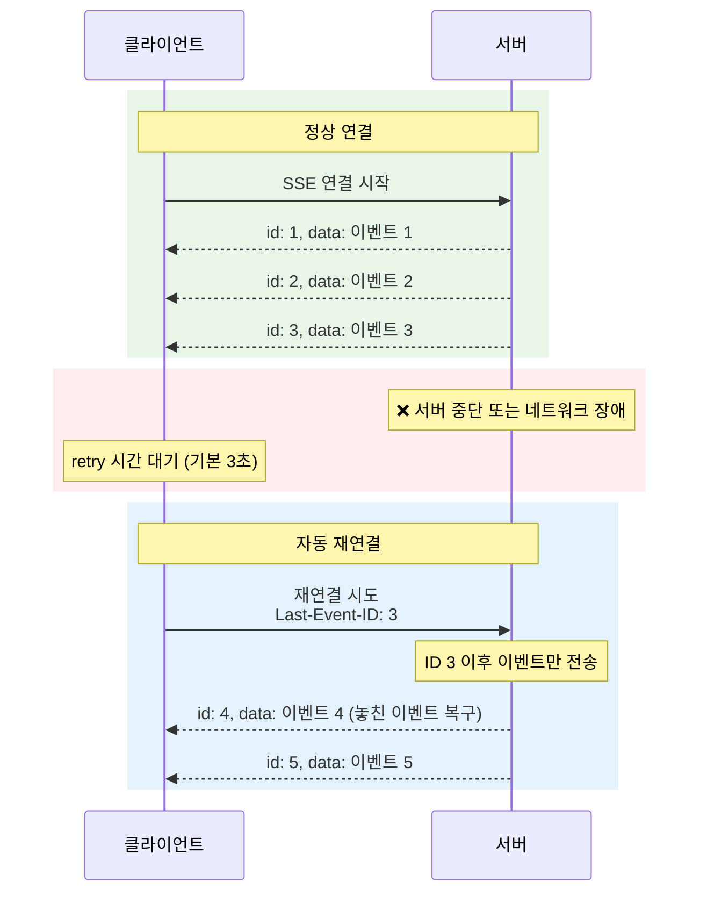
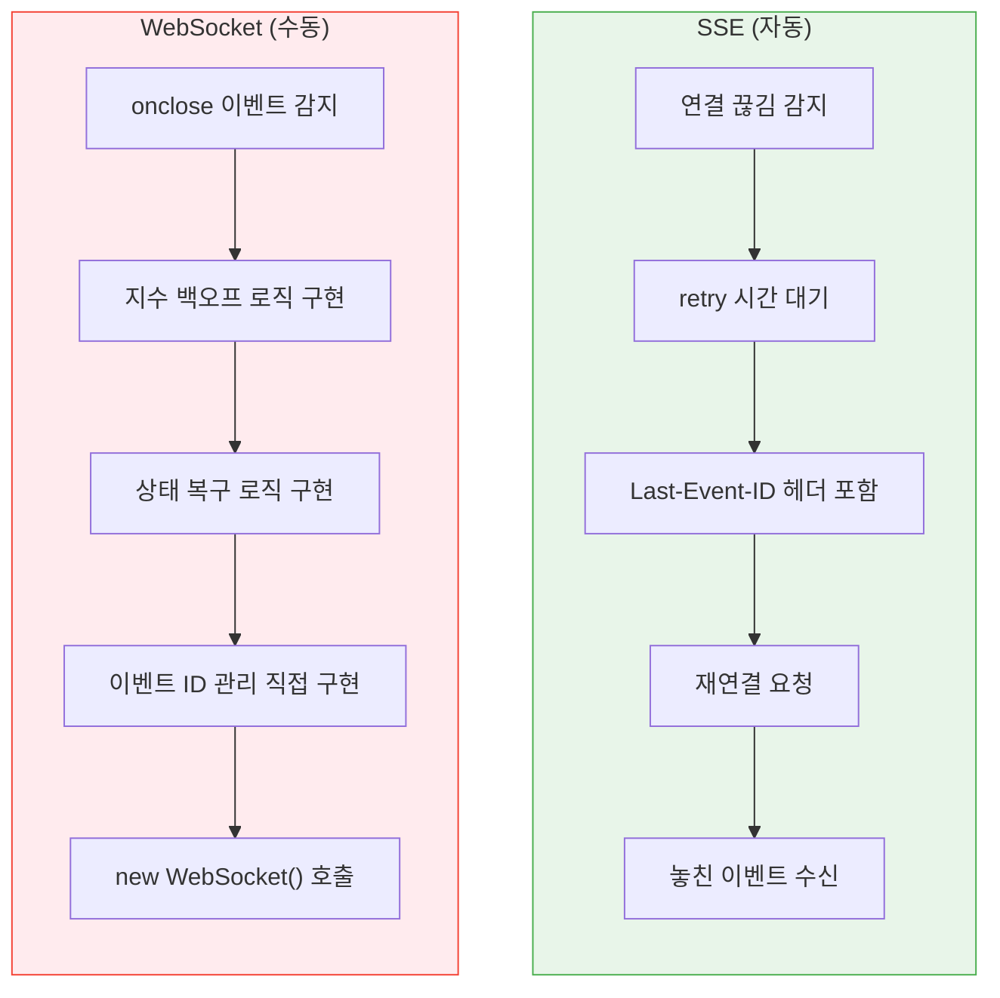
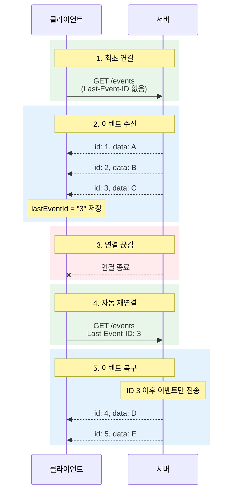
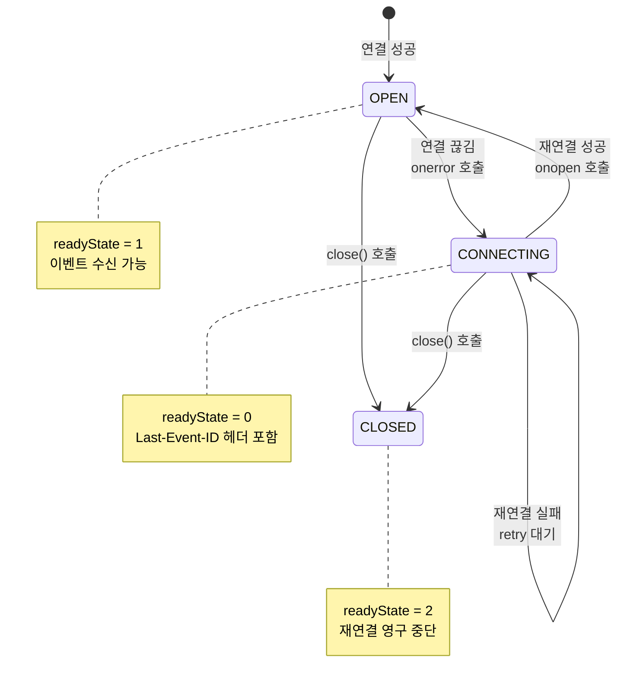
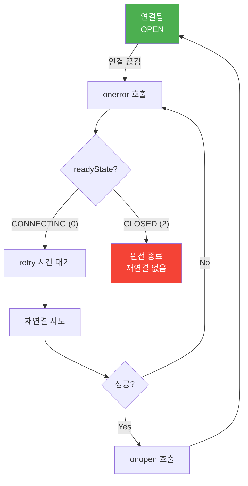

# 04. 재연결 및 Last-Event-ID - 학습 (LEARN)

## 학습 목표

이 문서를 학습하면 다음 질문에 답할 수 있습니다:
- SSE의 자동 재연결이 WebSocket과 어떻게 다르며, 왜 이 차이가 중요한가?
- Last-Event-ID 메커니즘은 어떻게 이벤트 손실을 방지하는가?
- retry 필드는 어떻게 동작하며, 서버가 클라이언트의 재연결 간격을 제어할 수 있는가?

---

## SSE의 자동 재연결

> **한 문장 정의**: SSE의 자동 재연결은 **브라우저가 연결 끊김을 감지하면 자동으로 재연결을 시도**하고, **Last-Event-ID 헤더로 마지막 수신 이벤트를 서버에 알려** 이벤트 손실을 방지하는 내장 기능입니다.

---

## 왜 자동 재연결이 중요한가?

네트워크 연결은 **언제든 끊길 수 있습니다**: 모바일 네트워크 전환, 일시적인 서버 장애, 프록시 타임아웃 등.
SSE의 자동 재연결은 이런 상황에서 개발자가 **별도 코드 없이도 연결 복구**를 처리할 수 있게 합니다.

---

## 재연결 시나리오



---

## SSE vs WebSocket 재연결 비교

### 왜 SSE가 더 간단한가?

WebSocket은 재연결 로직을 **개발자가 직접 구현**해야 합니다.
SSE는 이 모든 것이 **브라우저에 내장**되어 있습니다.

### 비교 다이어그램



### 코드 비교

**SSE: 1줄로 끝**

```typescript
// SSE: 재연결은 브라우저가 자동 처리
const es = new EventSource('/events');
es.onmessage = (e) => console.log(e.data);
// 끝. 연결 끊김 시 자동 재연결됨.
```

**WebSocket: 50줄 이상**

```typescript
// WebSocket: 재연결 로직 직접 구현 필요
class ReconnectingWebSocket {
  private ws: WebSocket | null = null;
  private reconnectInterval = 3000;
  private maxReconnectInterval = 30000;

  constructor(private url: string) {
    this.connect();
  }

  private connect(): void {
    this.ws = new WebSocket(this.url);

    this.ws.onopen = () => {
      console.log('연결됨');
      this.reconnectInterval = 3000;  // 성공 시 초기화
    };

    this.ws.onclose = () => {
      console.log('연결 끊김, 재연결 시도...');
      setTimeout(() => this.connect(), this.reconnectInterval);

      // 지수 백오프
      this.reconnectInterval = Math.min(
        this.reconnectInterval * 2,
        this.maxReconnectInterval
      );
    };

    this.ws.onerror = () => {
      this.ws?.close();
    };
  }
}

// SSE는 위의 50줄을 1줄로 대체합니다
```

---

## retry: 필드 - 재연결 간격 제어

### retry 필드의 역할

서버는 `retry:` 필드로 **클라이언트의 재연결 대기 시간을 지정**할 수 있습니다.
이는 **밀리초 단위**입니다.

### retry 필드의 특성

| 특성 | 설명 |
|------|------|
| **단위** | 밀리초 (5000 = 5초) |
| **기본값** | 브라우저마다 다름 (보통 3초) |
| **한 번만 설정** | 첫 메시지에서 설정하면 이후 적용 |
| **업데이트 가능** | 중간에 다른 값으로 변경 가능 |
| **클라이언트 접근** | JavaScript에서 현재 값 확인 불가 |

---

## Go 서버: retry 필드 설정

```go
package main

import (
	"fmt"
	"net/http"
	"time"
)

func eventsHandler(w http.ResponseWriter, r *http.Request) {
	w.Header().Set("Content-Type", "text/event-stream")
	w.Header().Set("Cache-Control", "no-cache")
	w.Header().Set("Connection", "keep-alive")

	flusher, ok := w.(http.Flusher)
	if !ok {
		http.Error(w, "Streaming not supported", http.StatusInternalServerError)
		return
	}

	// 연결 직후 retry 값 설정 (5초)
	// 연결이 끊기면 클라이언트는 5초 후 재연결 시도
	fmt.Fprintf(w, "retry: 5000\n\n")
	flusher.Flush()

	ctx := r.Context()
	eventID := 0

	ticker := time.NewTicker(1 * time.Second)
	defer ticker.Stop()

	for {
		select {
		case <-ctx.Done():
			return
		case <-ticker.C:
			eventID++
			fmt.Fprintf(w, "id: %d\n", eventID)
			fmt.Fprintf(w, "data: Event #%d\n\n", eventID)
			flusher.Flush()
		}
	}
}

func main() {
	http.HandleFunc("/events", eventsHandler)
	fmt.Println("서버 시작: http://localhost:8080")
	http.ListenAndServe(":8080", nil)
}
```

---

## 동적 retry 조절

서버 상황에 따라 retry 값을 동적으로 조절할 수 있습니다.

```go
func eventsHandler(w http.ResponseWriter, r *http.Request) {
	// ... 헤더 설정 생략

	// 서버 부하 확인
	serverLoad := getServerLoad()

	// 부하에 따라 retry 값 조절
	var retryMs int
	switch {
	case serverLoad > 80:
		retryMs = 10000  // 부하 높음: 10초
	case serverLoad > 50:
		retryMs = 5000   // 부하 중간: 5초
	default:
		retryMs = 2000   // 부하 낮음: 2초
	}

	fmt.Fprintf(w, "retry: %d\n\n", retryMs)
	flusher.Flush()

	// ... 이벤트 전송 로직
}
```

---

## id: 필드와 Last-Event-ID

### 이벤트 ID의 역할

서버가 각 이벤트에 ID를 부여하면, 재연결 시 **마지막으로 받은 이벤트 이후부터** 다시 받을 수 있습니다.
이것이 SSE의 **이벤트 복구 메커니즘**입니다.

### 동작 원리



### HTTP 요청 헤더

재연결 시 브라우저가 자동으로 추가하는 헤더:

```http
GET /events HTTP/1.1
Host: example.com
Accept: text/event-stream
Last-Event-ID: 3
```

---

## Go 서버: 이벤트 복구 지원

```go
package main

import (
	"encoding/json"
	"fmt"
	"net/http"
	"strconv"
	"sync"
	"time"
)

// 이벤트 저장소 (실제로는 Redis나 DB 사용)
type EventStore struct {
	events []Event
	mu     sync.RWMutex
	nextID int
}

type Event struct {
	ID   int         `json:"id"`
	Data interface{} `json:"data"`
	Time time.Time   `json:"time"`
}

var store = &EventStore{}

func (s *EventStore) Add(data interface{}) Event {
	s.mu.Lock()
	defer s.mu.Unlock()

	s.nextID++
	event := Event{
		ID:   s.nextID,
		Data: data,
		Time: time.Now(),
	}

	s.events = append(s.events, event)

	// 최근 1000개만 유지
	if len(s.events) > 1000 {
		s.events = s.events[len(s.events)-1000:]
	}

	return event
}

func (s *EventStore) GetAfter(lastID int) []Event {
	s.mu.RLock()
	defer s.mu.RUnlock()

	var result []Event
	for _, e := range s.events {
		if e.ID > lastID {
			result = append(result, e)
		}
	}
	return result
}

func eventsHandler(w http.ResponseWriter, r *http.Request) {
	w.Header().Set("Content-Type", "text/event-stream")
	w.Header().Set("Cache-Control", "no-cache")
	w.Header().Set("Connection", "keep-alive")

	flusher, ok := w.(http.Flusher)
	if !ok {
		http.Error(w, "Streaming not supported", http.StatusInternalServerError)
		return
	}

	// retry 설정
	fmt.Fprintf(w, "retry: 3000\n\n")
	flusher.Flush()

	// Last-Event-ID 확인
	lastEventID := 0
	if lastIDStr := r.Header.Get("Last-Event-ID"); lastIDStr != "" {
		if id, err := strconv.Atoi(lastIDStr); err == nil {
			lastEventID = id
			fmt.Printf("클라이언트 재연결: ID %d 이후 이벤트 전송\n", lastEventID)
		}
	}

	// 놓친 이벤트 전송
	missedEvents := store.GetAfter(lastEventID)
	for _, event := range missedEvents {
		sendEvent(w, flusher, event)
	}

	ctx := r.Context()

	// 새 이벤트 구독 (실제로는 메시지 큐 사용)
	ticker := time.NewTicker(2 * time.Second)
	defer ticker.Stop()

	for {
		select {
		case <-ctx.Done():
			return
		case <-ticker.C:
			event := store.Add(map[string]interface{}{
				"message": "New event",
				"time":    time.Now().Format(time.RFC3339),
			})
			sendEvent(w, flusher, event)
		}
	}
}

func sendEvent(w http.ResponseWriter, flusher http.Flusher, event Event) {
	data, _ := json.Marshal(event.Data)
	fmt.Fprintf(w, "id: %d\n", event.ID)
	fmt.Fprintf(w, "data: %s\n\n", data)
	flusher.Flush()
}

func main() {
	http.HandleFunc("/events", eventsHandler)
	fmt.Println("서버 시작: http://localhost:8080")
	http.ListenAndServe(":8080", nil)
}
```

---

## 클라이언트에서 ID 확인

### lastEventId 속성

MessageEvent 객체의 `lastEventId` 속성으로 현재 이벤트의 ID를 확인할 수 있습니다.

```typescript
const eventSource = new EventSource('/events');

eventSource.onmessage = (event) => {
  console.log('데이터:', event.data);
  console.log('이벤트 ID:', event.lastEventId);  // 문자열 타입
};
```

---

## React-TypeScript 훅: 재연결 상태 추적

```tsx
import { useEffect, useState, useRef, useCallback } from 'react';

interface UseSSEWithRecoveryOptions {
  onReconnect?: (lastEventId: string) => void;
  onMissedEvents?: (count: number) => void;
}

interface UseSSEWithRecoveryReturn<T> {
  data: T | null;
  lastEventId: string;
  isConnected: boolean;
  reconnectCount: number;
  close: () => void;
}

function useSSEWithRecovery<T = unknown>(
  url: string,
  options: UseSSEWithRecoveryOptions = {}
): UseSSEWithRecoveryReturn<T> {
  const [data, setData] = useState<T | null>(null);
  const [lastEventId, setLastEventId] = useState<string>('');
  const [isConnected, setIsConnected] = useState(false);
  const [reconnectCount, setReconnectCount] = useState(0);

  const eventSourceRef = useRef<EventSource | null>(null);
  const previousEventIdRef = useRef<string>('');

  useEffect(() => {
    const eventSource = new EventSource(url);
    eventSourceRef.current = eventSource;

    eventSource.onopen = () => {
      setIsConnected(true);

      // 재연결 감지
      if (previousEventIdRef.current) {
        setReconnectCount(prev => prev + 1);
        options.onReconnect?.(previousEventIdRef.current);
      }
    };

    eventSource.onmessage = (event) => {
      try {
        const parsed = JSON.parse(event.data) as T;
        setData(parsed);
      } catch {
        setData(event.data as unknown as T);
      }

      // 이벤트 ID 추적
      if (event.lastEventId) {
        // 놓친 이벤트 감지 (ID가 연속적이라고 가정)
        const currentId = parseInt(event.lastEventId, 10);
        const previousId = parseInt(previousEventIdRef.current, 10);

        if (previousId && currentId > previousId + 1) {
          const missedCount = currentId - previousId - 1;
          options.onMissedEvents?.(missedCount);
        }

        setLastEventId(event.lastEventId);
        previousEventIdRef.current = event.lastEventId;
      }
    };

    eventSource.onerror = () => {
      if (eventSource.readyState === EventSource.CONNECTING) {
        setIsConnected(false);
        // 재연결 시도 중 - 브라우저가 자동 처리
      }
    };

    return () => {
      eventSource.close();
    };
  }, [url]);

  const close = useCallback(() => {
    eventSourceRef.current?.close();
    setIsConnected(false);
  }, []);

  return {
    data,
    lastEventId,
    isConnected,
    reconnectCount,
    close
  };
}

export { useSSEWithRecovery };
```

### 사용 예시

```tsx
function EventStream() {
  const {
    data,
    lastEventId,
    isConnected,
    reconnectCount,
    close
  } = useSSEWithRecovery<{ message: string; time: string }>('/events', {
    onReconnect: (lastId) => {
      console.log(`재연결됨. 마지막 ID: ${lastId}`);
    },
    onMissedEvents: (count) => {
      console.warn(`${count}개 이벤트 누락 감지`);
    }
  });

  return (
    <div>
      <div className="status">
        상태: {isConnected ? '연결됨' : '연결 끊김'}
        {reconnectCount > 0 && ` (재연결 ${reconnectCount}회)`}
      </div>

      <div className="event-id">
        마지막 이벤트 ID: {lastEventId || '없음'}
      </div>

      {data && (
        <div className="data">
          <p>메시지: {data.message}</p>
          <p>시간: {data.time}</p>
        </div>
      )}

      <button onClick={close}>연결 종료</button>
    </div>
  );
}

export { EventStream };
```

---

## 재연결 흐름 상세

### 상태 전이 다이어그램



### 재연결 판단 로직



---

## 실무 고려사항

### 1. 이벤트 ID 설계

이벤트 ID는 **고유하고 정렬 가능**해야 합니다.

| 방법 | 예시 | 장점 | 단점 |
|------|------|------|------|
| 단순 증가 숫자 | `1, 2, 3, ...` | 간단 | 서버 재시작 시 문제 |
| 타임스탬프 | `1705123456789` | 고유성 보장 | 밀리초 충돌 가능 |
| 복합 키 | `server1-1234` | 멀티 서버 지원 | 파싱 필요 |
| UUID | `550e8400-...` | 충돌 없음 | 정렬 어려움 |
| ULID | `01ARZ3NDEK...` | 정렬 가능 + 고유 | 라이브러리 필요 |

### 2. 이벤트 저장소 선택

| 저장소 | 장점 | 단점 | 사용 케이스 |
|-------|------|------|-----------|
| **메모리** | 빠름 | 서버 재시작 시 손실 | 개발/테스트 |
| **Redis** | 빠름, TTL 지원 | 메모리 한계 | 실시간 이벤트 |
| **PostgreSQL** | 영구 보관 | 상대적으로 느림 | 감사 로그 |
| **Kafka** | 대용량, 분산 | 복잡한 설정 | 대규모 시스템 |

### 3. 너무 오래된 이벤트 처리

클라이언트가 오랜 시간 후 재연결하면, 모든 이벤트를 보내는 것은 비효율적입니다.

```go
func eventsHandler(w http.ResponseWriter, r *http.Request) {
	// ... 헤더 설정 생략

	lastEventID := r.Header.Get("Last-Event-ID")

	if lastEventID != "" {
		lastEvent := store.Get(lastEventID)

		// 1분 이상 지난 이벤트면 전체 동기화 요청
		if time.Since(lastEvent.Time) > time.Minute {
			fmt.Fprintf(w, "event: full-sync-required\n")
			fmt.Fprintf(w, "data: {\"reason\": \"events_expired\"}\n\n")
			flusher.Flush()
			return
		}
	}

	// 정상 이벤트 전송
	// ...
}
```

### 4. close() 호출 시 주의

`close()`를 호출하면 **재연결이 영구 중단**됩니다.
다시 연결하려면 새 EventSource 객체가 필요합니다.

```typescript
let eventSource = new EventSource('/events');

// close() 호출하면 재연결 중단
eventSource.close();

// 다시 연결하려면 새 객체 필요
eventSource = new EventSource('/events');
```

---

## 면접 대비 요약

### 한 문장 정의

> SSE의 자동 재연결은 브라우저가 연결 끊김 시 자동으로 재연결하고, Last-Event-ID 헤더로 마지막 수신 이벤트를 서버에 알려 이벤트 손실을 방지하는 기능입니다.

### 핵심 포인트 3가지

1. **자동 재연결**: 브라우저가 알아서 처리하므로 별도 코드 불필요
2. **Last-Event-ID**: 재연결 시 자동으로 헤더에 포함되어 이벤트 복구 가능
3. **retry 필드**: 서버가 클라이언트의 재연결 간격을 제어할 수 있음

---

## 자주 묻는 질문

### Q: SSE 재연결과 WebSocket 재연결의 차이는?

> SSE는 브라우저가 자동으로 재연결하고 Last-Event-ID를 전송합니다.
> WebSocket은 onclose 이벤트를 감지하고, 지수 백오프 로직과 상태 복구를 개발자가 직접 구현해야 합니다.

### Q: Last-Event-ID는 어떻게 서버에 전달되나요?

> 재연결 시 브라우저가 HTTP 요청 헤더에 `Last-Event-ID: <마지막 ID>`를 자동으로 추가합니다.
> 서버는 이 헤더를 읽어 해당 ID 이후의 이벤트만 전송합니다.

### Q: close()를 호출하면 재연결이 되나요?

> 아니요. `close()`를 호출하면 readyState가 `CLOSED(2)`가 되고, 자동 재연결이 영구 중단됩니다.
> 다시 연결하려면 새 EventSource 객체를 생성해야 합니다.

---

## 요약

| 항목 | 내용 |
|------|------|
| **자동 재연결** | 브라우저 내장, 별도 구현 불필요 |
| **retry: 필드** | 재연결 간격 (밀리초), 서버에서 설정 |
| **id: 필드** | 이벤트 고유 식별자 |
| **Last-Event-ID** | 재연결 시 헤더로 자동 전송 |
| **이벤트 복구** | 서버에서 구현 필요 (저장소 + 필터링) |
| **close() 호출** | 재연결 영구 중단 |

---

다음 학습: [05. 에러 처리](../05-error-handling/)
