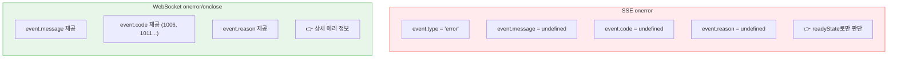
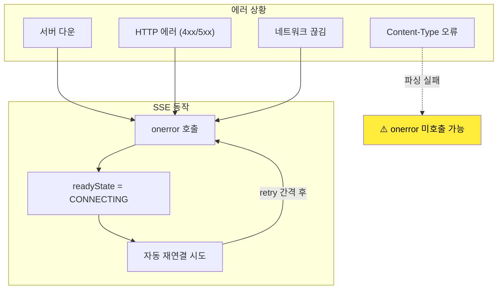
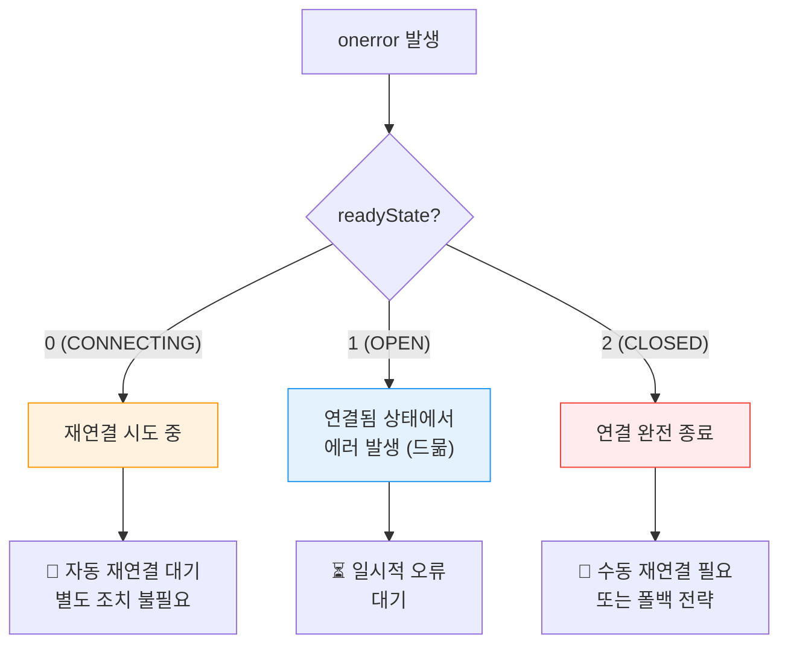
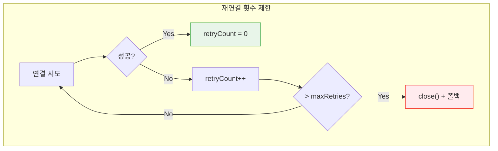
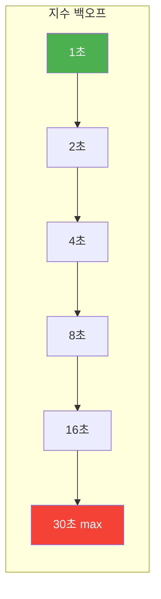
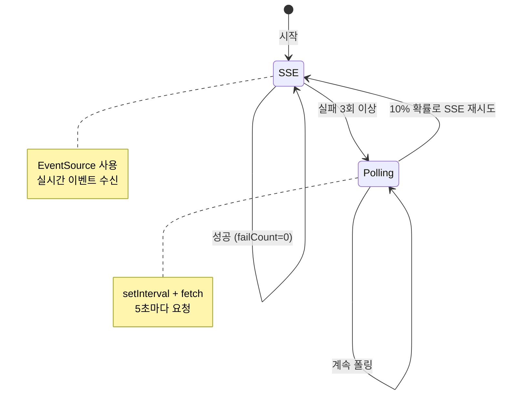

# 05. 에러 처리 - 학습 (LEARN)

## 학습 목표

이 문서를 학습하면 다음 질문에 답할 수 있습니다:
- SSE의 onerror 이벤트가 WebSocket과 다른 점은 무엇인가?
- readyState만으로 에러 상태를 어떻게 판단하는가?
- 실무에서 SSE 에러를 어떻게 처리하고 폴백 전략을 구현하는가?

---

## onerror 이벤트의 한계

> **핵심 문제**: SSE의 onerror 이벤트는 **에러 상세 정보를 제공하지 않습니다**. 에러 메시지, 에러 코드, 에러 원인 모두 없습니다. 오직 **readyState**만으로 상태를 판단해야 합니다.

---

## SSE vs WebSocket 에러 정보 비교

### 왜 SSE는 에러 정보가 없는가?

SSE는 HTTP 위에서 동작하므로, **HTTP 응답 코드와 헤더**가 에러 정보의 주요 소스입니다.
그러나 브라우저는 이 정보를 JavaScript에 노출하지 않습니다.
이는 **보안상의 이유**도 있습니다 (CORS 관련 에러 정보 노출 방지).

### 비교 다이어그램



### 코드로 보는 차이

**SSE: 에러 정보 없음**

```typescript
const es = new EventSource('/events');
es.onerror = (event) => {
  console.log(event.type);      // "error"
  console.log(event.message);   // undefined
  console.log(event.code);      // undefined

  // readyState로만 상태 판단
  console.log(es.readyState);   // 0 (CONNECTING) 또는 2 (CLOSED)
};
```

**WebSocket: 에러 정보 제공**

```typescript
const ws = new WebSocket('ws://example.com');
ws.onerror = (event) => {
  console.log(event.message);   // "Connection failed"
};
ws.onclose = (event) => {
  console.log(event.code);      // 1006
  console.log(event.reason);    // "Connection reset"
  console.log(event.wasClean);  // false
};
```

---

## 에러 상황별 동작

### 에러 상황과 SSE 반응



---

## 1. 서버 연결 불가 (서버 다운)

서버가 응답하지 않으면 브라우저는 **무한히 재연결을 시도**합니다.

```typescript
// 존재하지 않는 서버
const es = new EventSource('http://localhost:9999/events');

es.onerror = () => {
  if (es.readyState === EventSource.CONNECTING) {
    console.log('연결 실패, 재시도 중...');
    // 브라우저가 retry 간격 후 자동 재연결
  }
};
// 로그: "연결 실패, 재시도 중..." (반복)
```

---

## 2. HTTP 에러 응답

### 중요: 대부분의 HTTP 에러에서 브라우저는 계속 재연결을 시도합니다!

| HTTP 상태 | SSE 동작 | 설명 |
|-----------|----------|------|
| 200 OK | 정상 연결 | - |
| 204 No Content | onerror, 재연결 | 빈 응답 |
| 301/302 Redirect | 리다이렉트 따라감 | 자동 처리 |
| 401 Unauthorized | onerror, 재연결 | 인증 실패해도 계속 시도 |
| 403 Forbidden | onerror, 재연결 | 권한 없어도 계속 시도 |
| 404 Not Found | onerror, 재연결 | 존재하지 않아도 계속 시도 |
| 500 Server Error | onerror, 재연결 | 서버 에러에도 계속 시도 |

---

## 3. 연결 중 서버 종료

```typescript
const es = new EventSource('/events');

es.onmessage = (e) => console.log('받음:', e.data);

es.onerror = () => {
  if (es.readyState === EventSource.CONNECTING) {
    // 서버가 연결을 끊었고, 브라우저가 재연결 시도 중
    console.log('연결 끊김, 재연결 중...');
  } else if (es.readyState === EventSource.CLOSED) {
    // close()가 호출되어 완전히 종료됨
    console.log('연결 완전히 종료');
  }
};
```

---

## 4. Content-Type 오류

서버가 `text/event-stream`이 아닌 Content-Type을 반환하면 **예상치 못한 동작**이 발생할 수 있습니다.

```typescript
// 서버가 text/html 반환하면:
// - 연결은 되지만 이벤트 파싱 실패
// - onerror가 호출되지 않을 수 있음!
// - 조용히 실패하므로 디버깅 어려움
```

> **주의**: 이 경우 onerror가 호출되지 않아 문제를 감지하기 어렵습니다. 서버 설정을 확인해야 합니다.

---

## readyState 기반 에러 판단

### onerror에서 readyState 확인



### 구현 예시

```typescript
const es = new EventSource('/events');

es.onerror = () => {
  switch (es.readyState) {
    case EventSource.CONNECTING: // 0
      console.log('재연결 시도 중...');
      // 브라우저가 자동으로 재연결
      // 별도 조치 불필요
      break;

    case EventSource.OPEN: // 1
      console.log('연결됨 상태에서 에러 발생');
      // 매우 드문 케이스
      // 일시적 오류로 곧 복구될 수 있음
      break;

    case EventSource.CLOSED: // 2
      console.log('연결 종료됨');
      // close()가 호출되었거나
      // 복구 불가능한 에러
      // 수동 재연결 또는 폴백 필요
      break;
  }
};
```

---

## 실무 에러 처리 패턴

### 패턴 1: 재연결 횟수 제한

브라우저의 무한 재연결을 방지하고, **일정 횟수 실패 후 포기**합니다.

#### 흐름도



#### 구현 코드

```typescript
class SSEClientWithRetryLimit {
  private eventSource: EventSource | null = null;
  private retryCount = 0;
  private readonly maxRetries: number;

  onMaxRetriesExceeded?: () => void;
  onMessage?: (data: unknown) => void;

  constructor(
    private url: string,
    maxRetries = 5
  ) {
    this.maxRetries = maxRetries;
    this.connect();
  }

  private connect(): void {
    this.eventSource = new EventSource(this.url);

    this.eventSource.onopen = () => {
      console.log('연결 성공');
      this.retryCount = 0;  // 성공하면 카운터 리셋
    };

    this.eventSource.onmessage = (event) => {
      this.onMessage?.(JSON.parse(event.data));
    };

    this.eventSource.onerror = () => {
      if (this.eventSource?.readyState === EventSource.CONNECTING) {
        this.retryCount++;

        if (this.retryCount > this.maxRetries) {
          console.log(`최대 재시도 횟수 초과 (${this.maxRetries}회)`);
          this.close();
          this.onMaxRetriesExceeded?.();
        } else {
          console.log(`재연결 시도 ${this.retryCount}/${this.maxRetries}`);
        }
      }
    };
  }

  close(): void {
    this.eventSource?.close();
    this.eventSource = null;
  }
}

// 사용
const client = new SSEClientWithRetryLimit('/events', 5);
client.onMaxRetriesExceeded = () => {
  showFallbackUI();
  startPolling();  // 폴백 전략
};
```

---

### 패턴 2: 지수 백오프 (수동 재연결)

브라우저의 자동 재연결 대신 **직접 제어**하여 지수 백오프를 적용합니다.

#### 백오프 시간 증가



#### 구현 코드

```typescript
class SSEWithExponentialBackoff {
  private eventSource: EventSource | null = null;
  private retryCount = 0;

  constructor(
    private url: string,
    private baseDelay = 1000,
    private maxDelay = 30000
  ) {
    this.connect();
  }

  private connect(): void {
    this.eventSource = new EventSource(this.url);

    this.eventSource.onopen = () => {
      this.retryCount = 0;  // 성공 시 리셋
    };

    this.eventSource.onerror = () => {
      // 자동 재연결 끄고 수동 제어
      this.eventSource?.close();
      this.scheduleReconnect();
    };
  }

  private scheduleReconnect(): void {
    // 지수 백오프: 1s, 2s, 4s, 8s, ... 최대 30s
    const delay = Math.min(
      this.baseDelay * Math.pow(2, this.retryCount),
      this.maxDelay
    );

    // Jitter 추가 (±20%)로 동시 재연결 방지
    const jitter = delay * 0.2 * (Math.random() * 2 - 1);
    const actualDelay = Math.round(delay + jitter);

    console.log(`${actualDelay / 1000}초 후 재연결...`);

    setTimeout(() => {
      this.retryCount++;
      this.connect();
    }, actualDelay);
  }

  close(): void {
    this.eventSource?.close();
  }
}
```

---

### 패턴 3: 폴백 전략 (SSE → 폴링)

SSE가 반복 실패하면 **폴링으로 전환**하고, 주기적으로 SSE 재시도합니다.

#### 상태 전이



#### 구현 코드

```typescript
class ResilientDataStream<T> {
  private eventSource: EventSource | null = null;
  private pollInterval: ReturnType<typeof setInterval> | null = null;
  private useSSE = true;
  private sseFailCount = 0;

  onData?: (data: T) => void;

  constructor(
    private sseUrl: string,
    private pollUrl: string
  ) {
    this.start();
  }

  private start(): void {
    if (this.useSSE) {
      this.startSSE();
    } else {
      this.startPolling();
    }
  }

  private startSSE(): void {
    this.eventSource = new EventSource(this.sseUrl);

    this.eventSource.onmessage = (event) => {
      this.sseFailCount = 0;  // 성공 시 리셋
      this.onData?.(JSON.parse(event.data) as T);
    };

    this.eventSource.onerror = () => {
      this.sseFailCount++;

      if (this.sseFailCount > 3) {
        console.log('SSE 실패, 폴링으로 전환');
        this.eventSource?.close();
        this.useSSE = false;
        this.startPolling();
      }
    };
  }

  private startPolling(): void {
    const poll = async (): Promise<void> => {
      try {
        const response = await fetch(this.pollUrl);
        if (!response.ok) throw new Error(`HTTP ${response.status}`);

        const data = await response.json() as T;
        this.onData?.(data);

        // 폴링 성공 후 10% 확률로 SSE 재시도
        if (!this.useSSE && Math.random() < 0.1) {
          console.log('SSE 재시도');
          this.stopPolling();
          this.useSSE = true;
          this.sseFailCount = 0;
          this.startSSE();
        }
      } catch (err) {
        console.log('폴링 실패:', err);
      }
    };

    this.pollInterval = setInterval(poll, 5000);
    poll();  // 즉시 첫 요청
  }

  private stopPolling(): void {
    if (this.pollInterval) {
      clearInterval(this.pollInterval);
      this.pollInterval = null;
    }
  }

  stop(): void {
    this.eventSource?.close();
    this.stopPolling();
  }
}

// 사용
const stream = new ResilientDataStream<{ message: string }>(
  '/events',      // SSE URL
  '/api/latest'   // 폴링 URL
);

stream.onData = (data) => {
  console.log('데이터:', data.message);
};
```

---

## 사용자 알림 패턴

연결 상태를 **UI로 명확하게 표시**하는 것이 중요합니다.

### React 훅 구현

```tsx
import { useEffect, useState, useRef } from 'react';

type ConnectionStatus = 'connected' | 'reconnecting' | 'disconnected';

interface UseSSEWithUIReturn<T> {
  data: T | null;
  status: ConnectionStatus;
  statusMessage: string;
}

function useSSEWithUI<T>(url: string): UseSSEWithUIReturn<T> {
  const [data, setData] = useState<T | null>(null);
  const [status, setStatus] = useState<ConnectionStatus>('reconnecting');
  const [statusMessage, setStatusMessage] = useState('연결 중...');

  const eventSourceRef = useRef<EventSource | null>(null);

  useEffect(() => {
    const eventSource = new EventSource(url);
    eventSourceRef.current = eventSource;

    eventSource.onopen = () => {
      setStatus('connected');
      setStatusMessage('실시간 연결됨');
    };

    eventSource.onmessage = (event) => {
      setData(JSON.parse(event.data) as T);
    };

    eventSource.onerror = () => {
      if (eventSource.readyState === EventSource.CONNECTING) {
        setStatus('reconnecting');
        setStatusMessage('재연결 중...');
      } else {
        setStatus('disconnected');
        setStatusMessage('연결 끊김');
      }
    };

    return () => {
      eventSource.close();
    };
  }, [url]);

  return { data, status, statusMessage };
}

export { useSSEWithUI };
```

### 컴포넌트 구현

```tsx
function ConnectionStatusIndicator() {
  const { data, status, statusMessage } = useSSEWithUI<{ value: number }>('/events');

  return (
    <div>
      {/* 연결 상태 표시 */}
      <div className={`status-bar status-${status}`}>
        <span className="status-dot" />
        <span className="status-text">{statusMessage}</span>
      </div>

      {/* 데이터 표시 */}
      {data && <div className="data">값: {data.value}</div>}

      {/* 연결 끊김 시 안내 */}
      {status === 'disconnected' && (
        <div className="alert">
          연결이 끊겼습니다.
          <button onClick={() => window.location.reload()}>
            새로고침
          </button>
        </div>
      )}
    </div>
  );
}
```

### CSS (참고)

```css
.status-bar { display: flex; align-items: center; gap: 8px; padding: 8px; }
.status-dot { width: 8px; height: 8px; border-radius: 50%; }
.status-connected .status-dot { background: #4CAF50; }
.status-reconnecting .status-dot { background: #FF9800; animation: pulse 1s infinite; }
.status-disconnected .status-dot { background: #f44336; }
@keyframes pulse { 0%, 100% { opacity: 1; } 50% { opacity: 0.5; } }
```

---

## 타임아웃 처리

SSE 연결은 열려있는 한 타임아웃이 없습니다.
하지만 **"살아있는" 연결인지 확인**이 필요할 수 있습니다.

### 하트비트 패턴

```typescript
class SSEWithHeartbeat<T> {
  private eventSource: EventSource | null = null;
  private lastActivity = Date.now();
  private checkInterval: ReturnType<typeof setInterval> | null = null;

  onMessage?: (data: T) => void;
  onTimeout?: () => void;

  constructor(
    private url: string,
    private timeout = 30000  // 30초
  ) {
    this.connect();
  }

  private connect(): void {
    this.eventSource = new EventSource(this.url);
    this.lastActivity = Date.now();

    this.eventSource.onmessage = (event) => {
      this.lastActivity = Date.now();
      this.onMessage?.(JSON.parse(event.data) as T);
    };

    // 주기적으로 활동 확인
    this.checkInterval = setInterval(() => {
      const idle = Date.now() - this.lastActivity;

      if (idle > this.timeout) {
        console.log(`타임아웃 (${idle}ms 무응답) - 재연결`);
        this.onTimeout?.();
        this.reconnect();
      }
    }, 5000);

    this.eventSource.onerror = () => {
      this.lastActivity = Date.now();  // 에러도 활동으로 간주
    };
  }

  private reconnect(): void {
    this.eventSource?.close();
    this.lastActivity = Date.now();
    this.connect();
  }

  close(): void {
    this.eventSource?.close();
    if (this.checkInterval) {
      clearInterval(this.checkInterval);
    }
  }
}
```

---

## 면접 대비 요약

### 한 문장 정의

> SSE의 onerror는 에러 상세 정보를 제공하지 않으므로, readyState로 연결 상태를 판단하고 재연결 횟수 제한이나 폴백 전략으로 안정성을 확보해야 합니다.

### 핵심 포인트 3가지

1. **정보 부재**: onerror의 event 객체에는 에러 메시지, 코드, 원인이 없습니다
2. **무한 재연결**: 브라우저는 대부분의 에러에서 계속 재연결을 시도합니다
3. **폴백 필요**: SSE 실패 시 폴링으로 전환하는 전략이 필요합니다

---

## 자주 묻는 질문

### Q: SSE onerror에서 에러 원인을 어떻게 알 수 있나요?

> 알 수 없습니다. readyState가 `CONNECTING`이면 재연결 중, `CLOSED`면 완전 종료입니다.
> 서버 측 로그를 확인하거나, 서버에서 커스텀 에러 이벤트를 보내는 방식을 사용해야 합니다.

### Q: 401 Unauthorized 응답을 받으면 어떻게 되나요?

> 브라우저가 계속 재연결을 시도합니다.
> 인증 실패를 감지하려면 서버에서 연결 전에 인증을 확인하고, 실패 시 적절한 에러 이벤트를 보내는 것이 좋습니다.

### Q: SSE 연결이 "조용히" 실패하는 경우는?

> Content-Type이 `text/event-stream`이 아니면 연결은 되지만 이벤트 파싱이 실패하고, onerror도 호출되지 않을 수 있습니다.
> 서버 설정을 확인해야 합니다.

---

## 요약

| 항목 | 내용 |
|------|------|
| **onerror 정보** | 상세 에러 정보 없음 (readyState만 확인) |
| **자동 재연결** | 대부분의 에러에서 자동 재연결 |
| **재연결 제어** | close() 후 새 객체 생성으로 수동 제어 |
| **폴백 전략** | SSE 실패 시 폴링으로 전환 |
| **사용자 알림** | 연결 상태 UI 표시 권장 |
| **타임아웃** | 별도 구현 필요 (하트비트 패턴) |

---

다음 학습: [06. React 통합](../06-react-integration/)
