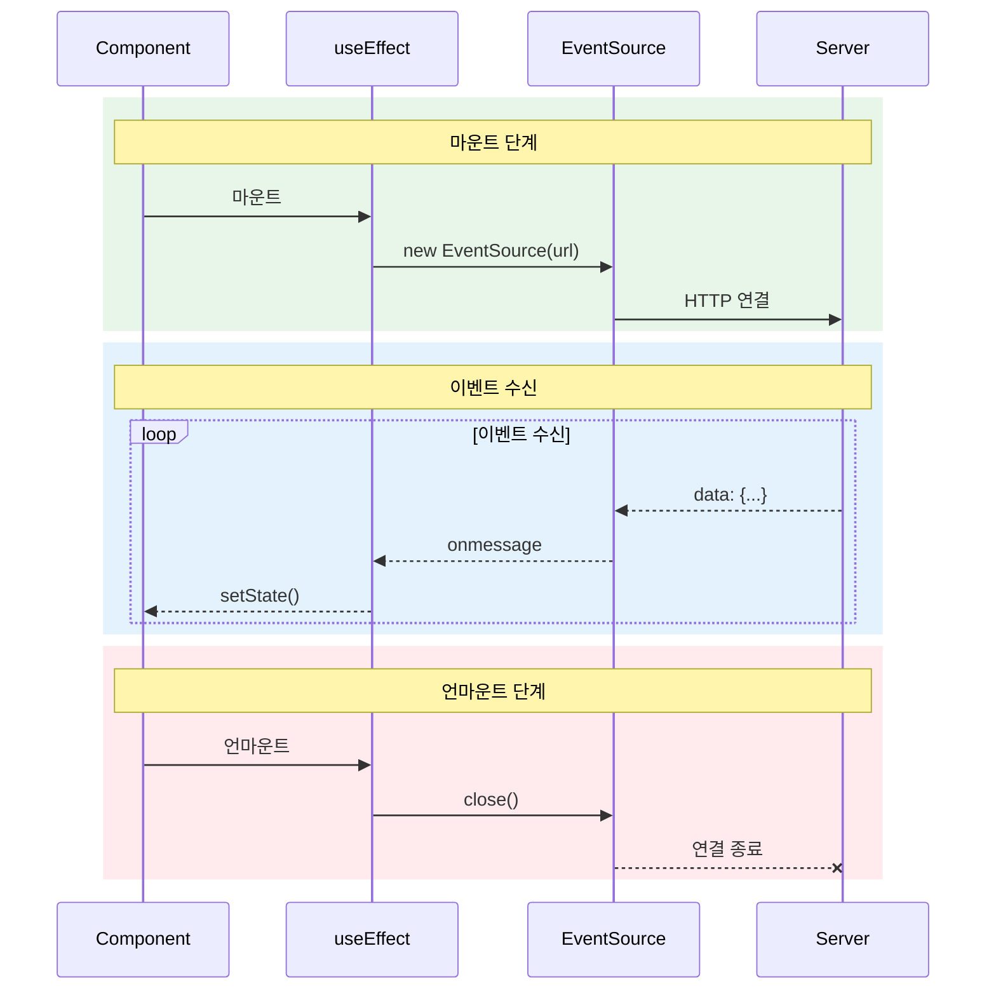
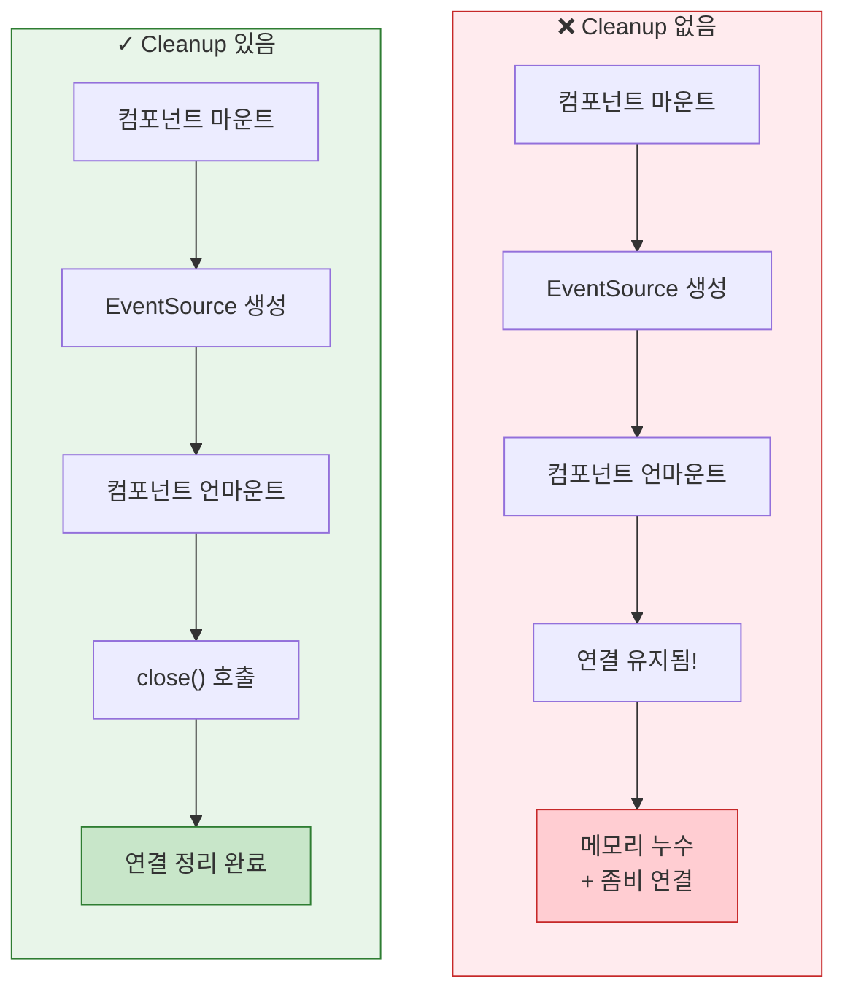
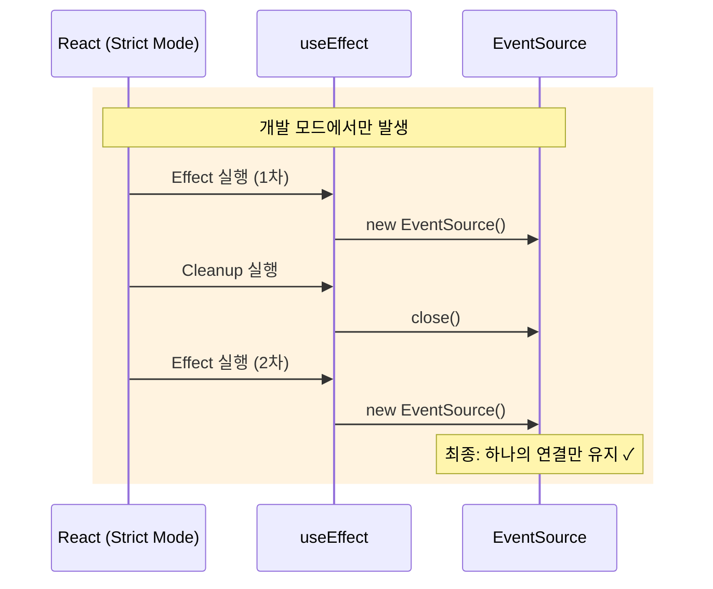
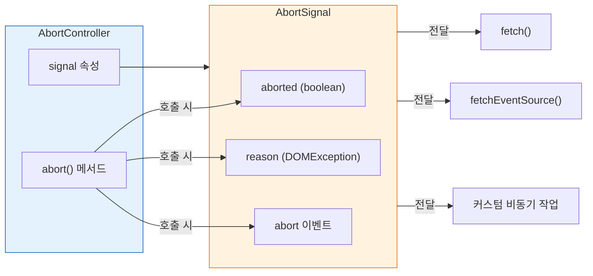
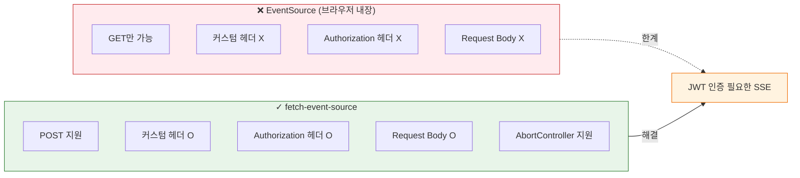
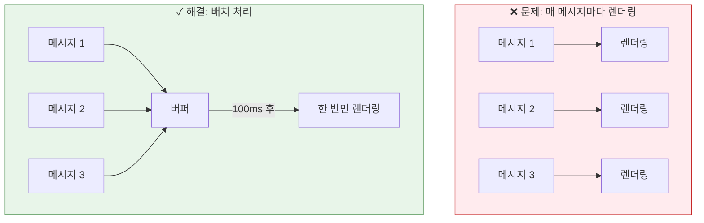
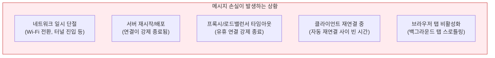
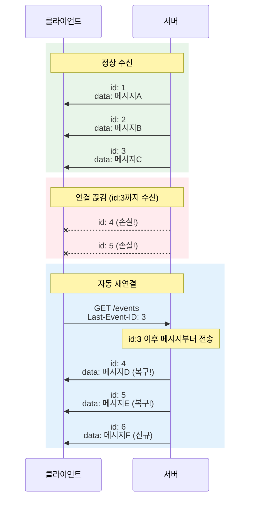

# 06. React 통합 - 학습 (LEARN)

## 학습 목표

이 문서를 학습하면 다음 질문에 답할 수 있습니다:
- React에서 EventSource를 올바르게 관리하는 방법과 cleanup이 중요한 이유는?
- AbortController란 무엇이며, EventSource.close()만으로 부족한 이유는?
- React Strict Mode는 언제부터 있었고, React 18에서 무엇이 바뀌었는가? 적용/해제는 어떻게 하는가?
- `event-source-polyfill`과 `@microsoft/fetch-event-source`는 각각 언제, 왜 사용하는가?
- SSE에서 메시지 손실이 발생하는 경우와 이를 방지하는 전략은?
- SSE를 React 상태 관리(Context, TanStack Query)와 어떻게 통합하는가?

---

## 한 문장 정의

> **React SSE 통합**: useEffect에서 EventSource를 생성하고, **cleanup 함수에서 반드시 close()**해야 메모리 누수와 좀비 연결을 방지할 수 있습니다.

---

## 왜 EventSource를 useEffect에서 관리해야 하는가?

EventSource는 **side effect**입니다. 네트워크 연결을 열고 유지하므로, React의 렌더링 사이클과 분리해서 관리해야 합니다.

| 관리 방식 | 문제점 |
|-----------|--------|
| 컴포넌트 본문에서 생성 | 매 렌더마다 새 연결 생성 |
| useState에서 생성 | 초기화 로직이 복잡해짐 |
| **useEffect에서 생성** | 마운트/언마운트와 연결 생명주기 일치 ✓ |

---

## useEffect에서 EventSource 관리

### 기본 패턴



```typescript
import { useEffect, useState } from 'react';

function NotificationFeed() {
  const [messages, setMessages] = useState<string[]>([]);
  const [isConnected, setIsConnected] = useState(false);

  useEffect(() => {
    // 1. EventSource 생성
    const eventSource = new EventSource('/events');

    // 2. 이벤트 핸들러 설정
    eventSource.onopen = () => {
      setIsConnected(true);
    };

    eventSource.onmessage = (event) => {
      const data = JSON.parse(event.data);
      setMessages(prev => [...prev, data.message]);
    };

    eventSource.onerror = () => {
      setIsConnected(eventSource.readyState === EventSource.OPEN);
    };

    // 3. Cleanup 함수 (필수!)
    return () => {
      eventSource.close();
    };
  }, []);  // 빈 의존성 배열: 마운트 시 한 번만 실행

  return (
    <div>
      <div>연결 상태: {isConnected ? '연결됨' : '연결 안 됨'}</div>
      <ul>
        {messages.map((msg, i) => (
          <li key={i}>{msg}</li>
        ))}
      </ul>
    </div>
  );
}
```

---

## 왜 Cleanup이 중요한가?

cleanup 없이 EventSource를 사용하면 **메모리 누수**와 **좀비 연결**이 발생합니다.



### Cleanup 없는 경우의 문제

| 문제 | 설명 |
|------|------|
| **좀비 연결** | 페이지 이동 후에도 연결이 유지되어 서버 리소스 낭비 |
| **메모리 누수** | 컴포넌트 재마운트마다 새 연결 누적 |
| **React 경고** | setState가 언마운트된 컴포넌트에서 호출되어 경고 발생 |
| **브라우저 제한 도달** | HTTP/1.1의 도메인당 6개 연결 제한에 빠르게 도달 |

---

## React 18 Strict Mode 대응

### Strict Mode의 역사

Strict Mode는 **React 18에서 처음 도입된 것이 아닙니다**. 버전별로 기능이 점진적으로 강화되어 왔습니다:

| 버전 | 시기 | Strict Mode 변경사항 |
|------|------|---------------------|
| **React 16.3** | 2018 | **최초 도입**. 안전하지 않은 생명주기 메서드, 레거시 API 경고 |
| **React 17** | 2020 | 렌더 함수, 생명주기 메서드 이중 호출 추가. 단, 콘솔 로그가 **자동 억제**됨 |
| **React 18** | 2022 | **useEffect 마운트→언마운트→재마운트 시뮬레이션** 추가. 콘솔 로그 억제 해제 (DevTools에서 흐리게 표시) |

React 18의 가장 큰 변화는 **Effect의 마운트→언마운트→재마운트 시뮬레이션**입니다. 이전 버전에서는 렌더 함수만 이중 호출했지만, React 18부터 **useEffect/useLayoutEffect도 이중 호출**하게 되었습니다.

### 기본 적용인가? 수동 설정인가?

**React 자체는 Strict Mode를 자동 활성화하지 않습니다.** 코드에서 `<StrictMode>`로 명시적으로 감싸야 합니다. 다만 프레임워크/도구가 기본 템플릿에 포함하는 경우가 있습니다:

| 프레임워크/도구 | 기본 적용 여부 | 비고 |
|----------------|:-------------:|------|
| **Create React App** | ✅ 기본 포함 | `src/index.tsx`에서 `<React.StrictMode>`로 감쌈 |
| **Next.js (App Router)** | ✅ 기본 활성화 | v13.5.1부터 기본. `next.config.js`에서 비활성화 가능 |
| **Next.js (Pages Router)** | ❌ 기본 비활성화 | `next.config.js`에서 `reactStrictMode: true` 설정 필요 |
| **Vite + React** | ✅ 템플릿에 포함 | `main.tsx`에서 `<React.StrictMode>`로 감쌈 |

> 실제로 02, 03장 실습의 `main.tsx`에서도 Vite + React 템플릿이 생성한 `<React.StrictMode>` 래핑을 확인할 수 있습니다.

### 적용 방법

**전체 앱에 적용** (가장 일반적):

```tsx
// main.tsx (Vite) 또는 index.tsx (CRA)
import { StrictMode } from 'react';
import ReactDOM from 'react-dom/client';
import App from './App';

ReactDOM.createRoot(document.getElementById('root')!).render(
  <StrictMode>
    <App />
  </StrictMode>
);
```

**특정 컴포넌트 서브트리에만 적용**:

```tsx
import { StrictMode } from 'react';

function App() {
  return (
    <div>
      <Header />        {/* Strict Mode 미적용 */}
      <StrictMode>
        <MainContent />  {/* Strict Mode 적용 */}
        <Sidebar />      {/* Strict Mode 적용 */}
      </StrictMode>
      <Footer />         {/* Strict Mode 미적용 */}
    </div>
  );
}
```

**비활성화 방법**:

```tsx
// 방법 1: <StrictMode> 래퍼 제거
ReactDOM.createRoot(document.getElementById('root')!).render(
  <App />  // StrictMode 없이 렌더링
);

// 방법 2: Next.js에서 비활성화
// next.config.js
module.exports = {
  reactStrictMode: false,
};
```

### 프로덕션에서는 완전히 비활성화

Strict Mode의 모든 추가 동작(이중 호출, 경고 등)은 **개발 빌드에서만 동작**합니다. 프로덕션 빌드에서는 성능 오버헤드가 **전혀 없습니다**:

```bash
npm run dev    # → Strict Mode 활성: Effect 이중 호출, 추가 경고
npm run build  # → Strict Mode 제거: 프로덕션 빌드에 포함되지 않음
```

### 문제: Effect가 두 번 실행됨

React 18의 Strict Mode(개발 모드)에서는 **Effect가 의도적으로 두 번 실행**됩니다. 이는 cleanup 로직이 올바른지 검증하기 위함입니다.



### 정확한 실행 순서

Strict Mode에서 컴포넌트가 마운트될 때 내부적으로 일어나는 일을 단계별로 정리합니다:

```
[1단계: 최초 마운트]
  1. 컴포넌트 함수 실행 (렌더)
  2. DOM에 커밋
  3. useLayoutEffect setup 실행
  4. useEffect setup 실행

[2단계: 시뮬레이션된 언마운트]
  5. useEffect cleanup 실행
  6. useLayoutEffect cleanup 실행

[3단계: 시뮬레이션된 재마운트]
  7. useLayoutEffect setup 재실행
  8. useEffect setup 재실행
```

### 이중 호출 대상

모든 것이 이중 호출되는 것은 아닙니다:

| 대상 | 이중 호출 | 설명 |
|------|:---------:|------|
| 컴포넌트 렌더 함수 | ✅ | 순수 함수인지 검증 |
| `useState` 초기화 함수 | ✅ | 부작용 없는지 검증 |
| `useMemo` 계산 함수 | ✅ | 순수 함수인지 검증 |
| `useReducer` 리듀서 | ✅ | 순수 함수인지 검증 |
| `useEffect` setup + cleanup | ✅ | cleanup 올바른지 검증 |
| `useLayoutEffect` setup + cleanup | ✅ | cleanup 올바른지 검증 |
| **이벤트 핸들러** | ❌ | 사용자 인터랙션이므로 이중 호출 안 함 |
| **비동기 콜백** | ❌ | Promise 내부 로직은 이중 호출 안 함 |

### 왜 두 번 실행하는가?

| 이유 | 설명 |
|------|------|
| **Cleanup 검증** | 부작용 정리가 올바르게 구현되었는지 확인 |
| **동시성 렌더링 준비** | React 18의 동시성 기능에서 컴포넌트가 여러 번 마운트/언마운트될 수 있음 |
| **Offscreen API 대비** | 향후 탭 전환 시 컴포넌트 상태를 보존하면서 언마운트/재마운트하는 기능 대비 |
| **버그 조기 발견** | 개발 중에 문제를 발견하여 프로덕션 오류 방지 |

### 올바른 처리

cleanup이 올바르게 구현되어 있으면 **문제없이 동작**합니다:

```typescript
useEffect(() => {
  console.log('Effect 실행');  // 개발 모드에서 2번 출력

  const es = new EventSource('/events');

  return () => {
    console.log('Cleanup 실행');  // 첫 번째 Effect 후 바로 실행
    es.close();
  };
}, []);

// 실행 순서 (개발 모드):
// 1. "Effect 실행" → EventSource 생성
// 2. "Cleanup 실행" → close()
// 3. "Effect 실행" → EventSource 생성 (최종)
// 결과: 하나의 연결만 유지됨 ✓
```

### AbortController 패턴 (선택적)

더 세밀한 제어가 필요하면 AbortController를 사용할 수 있습니다:

```typescript
useEffect(() => {
  const abortController = new AbortController();
  let eventSource: EventSource | null = null;

  // AbortController 신호가 abort되지 않은 경우에만 연결
  if (!abortController.signal.aborted) {
    eventSource = new EventSource('/events');

    eventSource.onmessage = (e) => {
      if (!abortController.signal.aborted) {
        setData(JSON.parse(e.data));
      }
    };
  }

  return () => {
    abortController.abort();
    eventSource?.close();
  };
}, []);
```

---

## AbortController 심화

### AbortController란?

AbortController는 **비동기 작업을 취소하기 위한 Web API**입니다. 2017년에 표준화되었으며, 원래 `fetch()` 요청을 취소하기 위해 설계되었지만 지금은 범용 취소 메커니즘으로 사용됩니다.

**브라우저 지원 타임라인:**

| 브라우저 | 지원 시작 버전 |
|----------|---------------|
| Edge | 16 (2017, 최초 지원) |
| Firefox | 57 (2017) |
| Chrome | 66 (2018) |
| Safari | 12.1 (2019) |

### 구성 요소: Controller와 Signal

AbortController API는 **두 개의 객체**로 구성됩니다:



**AbortController**는 취소 명령을 내리는 **리모컨**이고, **AbortSignal**은 비동기 작업에 전달되는 **수신기**입니다. `abort()`를 호출하면 signal의 `aborted`가 `true`로 바뀌고, `abort` 이벤트가 발생하며, signal을 구독하는 모든 비동기 작업이 취소됩니다.

```typescript
const controller = new AbortController();
const signal = controller.signal;

// 상태 확인
console.log(signal.aborted);  // false

// abort 이벤트 구독
signal.addEventListener('abort', () => {
  console.log('취소됨! 이유:', signal.reason);
});

// 취소 실행
controller.abort();
console.log(signal.aborted);  // true
console.log(signal.reason);   // DOMException: The operation was aborted
```

### EventSource.close()와 AbortController의 차이

**솔직하게 말하면**, 네이티브 EventSource만 사용하는 경우 `close()`만으로 거의 충분합니다. `close()`를 호출하면 `readyState`가 `CLOSED`로 바뀌고 이후 이벤트가 발생하지 않습니다.

AbortController의 `signal.aborted` 체크는 기능적으로 **boolean 플래그와 동일**합니다:

```typescript
// 이 두 코드는 기능적으로 완전히 동일
// 방법 1: boolean 플래그
let cancelled = false;
es.onmessage = (e) => { if (cancelled) return; setState(...); };
return () => { cancelled = true; es.close(); };

// 방법 2: AbortController
const controller = new AbortController();
es.onmessage = (e) => { if (controller.signal.aborted) return; setState(...); };
return () => { controller.abort(); es.close(); };
```

**AbortController가 진짜 빛나는 곳**은 `fetch()` 기반 작업입니다. boolean 플래그는 콜백 실행만 막지만, AbortController는 **진행 중인 HTTP 요청 자체를 취소**할 수 있습니다:

| 상황 | boolean 플래그 | AbortController |
|------|:-------------:|:---------------:|
| EventSource onmessage 가드 | ✓ (동일) | ✓ (동일) |
| **fetch 요청 자체 취소** | ❌ 불가능 | ✓ |
| **fetchEventSource 연결 종료** | ❌ 불가능 | ✓ (signal 전달) |
| 여러 비동기 작업 한 번에 취소 | 플래그 여러 개 필요 | signal 하나로 통합 |
| addEventListener('abort', ...) | ❌ | ✓ (커스텀 정리 로직) |

> **결론**: 네이티브 EventSource만 쓰면 `close()`로 충분합니다. `fetchEventSource`나 `fetch()`를 함께 사용할 때 AbortController의 진가가 드러납니다.

### signal.aborted 가드 패턴

네이티브 EventSource에서는 추가 안전장치 역할이지만, fetch 기반 비동기 작업에서는 필수적인 패턴입니다:

```typescript
useEffect(() => {
  const controller = new AbortController();
  const eventSource = new EventSource('/events');

  eventSource.onmessage = (event) => {
    // ✅ 가드: abort되었으면 setState 하지 않음
    if (controller.signal.aborted) return;

    const data = JSON.parse(event.data);
    setMessages(prev => [...prev, data]);
  };

  eventSource.onerror = () => {
    // ✅ 가드: abort되었으면 에러 상태 업데이트 안 함
    if (controller.signal.aborted) return;
    setError('연결 오류');
  };

  return () => {
    controller.abort();     // 1. signal.aborted = true (가드 활성화)
    eventSource.close();    // 2. 연결 종료
  };
}, []);
```

### 하나의 Controller로 여러 작업 취소

AbortController의 강력한 점은 **하나의 signal로 여러 비동기 작업을 동시에 취소**할 수 있다는 것입니다:

```typescript
useEffect(() => {
  const controller = new AbortController();

  // ❓ `{ signal }` 문법이 생소하다면?
  // ES6 "속성 축약(Shorthand Property)" 문법입니다.
  // key 이름과 변수 이름이 같으면 하나만 써도 됩니다:
  const signal = controller.signal;
  // fetch('/api', { signal: signal })  ← 원래 형태
  // fetch('/api', { signal })          ← 속성 축약 (동일한 코드)

  // 1. fetch 요청 — signal을 전달하면 abort() 시 요청 자체가 취소됨
  fetch('/api/initial-data', { signal })
    .then(res => res.json())
    .then(data => {
      if (!signal.aborted) setInitialData(data);
    });

  // 2. EventSource 연결 — 네이티브 ES는 signal을 받지 않으므로 플래그로 사용
  const es = new EventSource('/events');
  es.onmessage = (e) => {
    if (!signal.aborted) setMessages(prev => [...prev, JSON.parse(e.data)]);
  };

  // 3. 타이머
  const timerId = setInterval(() => {
    if (!signal.aborted) setElapsed(prev => prev + 1);
  }, 1000);

  // signal에 abort 이벤트 리스너 추가 (커스텀 정리)
  signal.addEventListener('abort', () => {
    clearInterval(timerId);
  });

  return () => {
    controller.abort();  // 한 번의 호출로 fetch 취소 + 플래그 설정 + 타이머 정리
    es.close();          // EventSource는 별도로 close() 필요
  };
}, []);
```

### 실무 예시: React Query + EventSourcePolyfill 조합

실제 프로젝트에서는 `fetch()` 대신 React Query를, `EventSource` 대신 `EventSourcePolyfill`을 사용합니다. AbortController로 이 조합을 하나의 cleanup으로 관리할 수 있습니다:

```typescript
import { useEffect } from 'react';
import { useQueryClient, useQuery } from '@tanstack/react-query';
import { EventSourcePolyfill } from 'event-source-polyfill';

function useDashboard(token: string) {
  const queryClient = useQueryClient();

  // 1. React Query로 초기 데이터 fetch (AbortController 자동 지원)
  const { data: initialData } = useQuery({
    queryKey: ['dashboard'],
    queryFn: async ({ signal }) => {
      // React Query v5는 queryFn에 signal을 자동 전달!
      // 컴포넌트 언마운트 시 자동으로 abort됨
      const res = await fetch('/api/dashboard', {
        headers: { 'Authorization': `Bearer ${token}` },
        signal,  // ← React Query가 전달해준 signal
      });
      return res.json();
    },
  });

  // 2. EventSourcePolyfill로 실시간 업데이트 수신
  useEffect(() => {
    const controller = new AbortController();

    const es = new EventSourcePolyfill('/events/dashboard', {
      headers: { 'Authorization': `Bearer ${token}` },
      heartbeatTimeout: 45000,
    });

    es.addEventListener('metrics', ((event: MessageEvent) => {
      if (controller.signal.aborted) return;  // 가드

      const metrics = JSON.parse(event.data);
      // React Query 캐시를 직접 업데이트 → 구독 중인 컴포넌트 자동 리렌더
      queryClient.setQueryData(['dashboard'], (prev: any) => ({
        ...prev,
        metrics,
      }));
    }) as EventListener);

    es.addEventListener('alert', ((event: MessageEvent) => {
      if (controller.signal.aborted) return;

      const alert = JSON.parse(event.data);
      queryClient.setQueryData(['alerts'], (prev: any[]) =>
        [...(prev || []), alert]
      );
    }) as EventListener);

    return () => {
      controller.abort();  // 가드 플래그 활성화
      es.close();          // SSE 연결 종료
    };
  }, [token, queryClient]);

  return initialData;
}
```

> **React Query의 AbortController 지원**: React Query v5부터 `queryFn`에 `{ signal }`을 자동으로 전달합니다. 컴포넌트가 언마운트되거나 쿼리가 취소되면 이 signal이 자동으로 abort되어 진행 중인 fetch 요청이 취소됩니다. 별도로 AbortController를 만들 필요가 없습니다.

### signal.reason 속성

`signal.reason`은 **왜 취소되었는지**를 알려주는 속성입니다. 2022년 3월부터 주요 브라우저에서 지원됩니다.

```typescript
const controller = new AbortController();

// 기본 abort (reason = DOMException: The operation was aborted)
controller.abort();
console.log(controller.signal.reason);  // DOMException

// 커스텀 이유 지정
const controller2 = new AbortController();
controller2.abort(new Error('사용자가 취소했습니다'));
console.log(controller2.signal.reason);  // Error: 사용자가 취소했습니다

// 활용: 취소 이유에 따라 다른 처리
signal.addEventListener('abort', () => {
  if (signal.reason?.message === 'timeout') {
    showTimeoutMessage();
  } else if (signal.reason?.message === 'user-cancel') {
    showCancelMessage();
  }
});
```

### fetch-event-source와 AbortController

`@microsoft/fetch-event-source`는 AbortController를 **네이티브로 지원**합니다. `signal`을 직접 전달하면 `abort()` 호출 시 SSE 연결이 자동으로 종료됩니다:

```typescript
useEffect(() => {
  const controller = new AbortController();

  fetchEventSource('/api/stream', {
    method: 'POST',
    headers: { 'Authorization': `Bearer ${token}` },
    body: JSON.stringify({ query }),
    signal: controller.signal,  // ← signal 직접 전달

    onmessage(event) {
      // signal.aborted 체크 불필요 — 라이브러리가 자동 처리
      setData(JSON.parse(event.data));
    },

    onerror(err) {
      if (err.name === 'AbortError') return;  // 정상 취소
      throw err;
    }
  });

  return () => controller.abort();  // close() 호출 불필요
}, [token, query]);
```

> **EventSource.close() vs AbortController.abort()**: 네이티브 EventSource는 `close()`로 닫아야 하지만, fetch-event-source는 `abort()`만으로 연결 종료와 정리가 모두 이루어집니다.

---

## 커스텀 훅 패턴

재사용 가능한 SSE 훅을 만들면 **코드 중복을 줄이고 일관성**을 유지할 수 있습니다.

### 훅 유형 비교

| 훅 | 용도 | 특징 |
|----|------|------|
| `useSSE` | 기본 SSE 연결 | 단일 데이터 스트림 |
| `useSSEWithHistory` | 메시지 히스토리 | 최근 N개 메시지 보관 |
| `useSSEEvents` | 커스텀 이벤트 | 여러 이벤트 타입 구독 |

### 기본 useSSE 훅

```typescript
import { useEffect, useState, useCallback, useRef } from 'react';

interface UseSSEOptions {
  withCredentials?: boolean;
}

interface UseSSEReturn<T> {
  data: T | null;
  error: Error | null;
  isConnected: boolean;
  close: () => void;
}

function useSSE<T = unknown>(
  url: string,
  options: UseSSEOptions = {}
): UseSSEReturn<T> {
  const [data, setData] = useState<T | null>(null);
  const [error, setError] = useState<Error | null>(null);
  const [isConnected, setIsConnected] = useState(false);

  const eventSourceRef = useRef<EventSource | null>(null);

  useEffect(() => {
    const eventSource = new EventSource(url, {
      withCredentials: options.withCredentials
    });

    eventSourceRef.current = eventSource;

    eventSource.onopen = () => {
      setIsConnected(true);
      setError(null);
    };

    eventSource.onmessage = (event) => {
      try {
        const parsed = JSON.parse(event.data) as T;
        setData(parsed);
      } catch {
        // JSON 파싱 실패 시 원본 데이터 사용
        setData(event.data as unknown as T);
      }
    };

    eventSource.onerror = () => {
      if (eventSource.readyState === EventSource.CLOSED) {
        setIsConnected(false);
        setError(new Error('Connection closed'));
      }
    };

    return () => {
      eventSource.close();
    };
  }, [url, options.withCredentials]);

  const close = useCallback(() => {
    eventSourceRef.current?.close();
    setIsConnected(false);
  }, []);

  return { data, error, isConnected, close };
}

// 사용 예시
interface DashboardData {
  cpu: number;
  memory: number;
  timestamp: string;
}

function Dashboard() {
  const { data, error, isConnected } = useSSE<DashboardData>('/events/metrics');

  if (error) return <div>에러: {error.message}</div>;

  return (
    <div>
      <div>상태: {isConnected ? '연결됨' : '연결 끊김'}</div>
      {data && (
        <>
          <div>CPU: {data.cpu}%</div>
          <div>Memory: {data.memory}GB</div>
        </>
      )}
    </div>
  );
}
```

### 메시지 히스토리 포함 훅

```typescript
interface UseSSEWithHistoryReturn<T> {
  messages: Array<{ data: T; timestamp: Date; id: string }>;
  lastMessage: T | null;
  isConnected: boolean;
  clearMessages: () => void;
}

function useSSEWithHistory<T = unknown>(
  url: string,
  maxMessages = 100
): UseSSEWithHistoryReturn<T> {
  const [messages, setMessages] = useState<Array<{
    data: T;
    timestamp: Date;
    id: string;
  }>>([]);
  const [isConnected, setIsConnected] = useState(false);

  useEffect(() => {
    const eventSource = new EventSource(url);

    eventSource.onopen = () => setIsConnected(true);

    eventSource.onmessage = (event) => {
      const data = JSON.parse(event.data) as T;
      const message = {
        data,
        timestamp: new Date(),
        id: event.lastEventId || crypto.randomUUID()
      };

      setMessages(prev => {
        const updated = [...prev, message];
        // 최대 개수 유지
        return updated.slice(-maxMessages);
      });
    };

    eventSource.onerror = () => {
      setIsConnected(eventSource.readyState === EventSource.OPEN);
    };

    return () => eventSource.close();
  }, [url, maxMessages]);

  const clearMessages = useCallback(() => {
    setMessages([]);
  }, []);

  const lastMessage = messages.length > 0
    ? messages[messages.length - 1].data
    : null;

  return { messages, lastMessage, isConnected, clearMessages };
}
```

### 커스텀 이벤트 지원 훅

```typescript
function useSSEEvents<T extends Record<string, unknown>>(
  url: string,
  eventTypes: string[]
): { events: Partial<T>; isConnected: boolean } {
  const [events, setEvents] = useState<Partial<T>>({});
  const [isConnected, setIsConnected] = useState(false);

  useEffect(() => {
    const eventSource = new EventSource(url);

    eventSource.onopen = () => setIsConnected(true);

    // 각 이벤트 타입에 리스너 등록
    eventTypes.forEach(eventType => {
      eventSource.addEventListener(eventType, (event) => {
        const data = JSON.parse(event.data);
        setEvents(prev => ({
          ...prev,
          [eventType]: data
        }));
      });
    });

    eventSource.onerror = () => {
      setIsConnected(eventSource.readyState === EventSource.OPEN);
    };

    return () => eventSource.close();
  }, [url, eventTypes.join(',')]);

  return { events, isConnected };
}

// 사용 예시
interface EventTypes {
  notification: { message: string };
  metrics: { cpu: number };
  alert: { level: string };
}

function MultiEventComponent() {
  const { events, isConnected } = useSSEEvents<EventTypes>(
    '/events/custom',
    ['notification', 'metrics', 'alert']
  );

  return (
    <div>
      <div>알림: {events.notification?.message}</div>
      <div>CPU: {events.metrics?.cpu}%</div>
      <div>경고: {events.alert?.level}</div>
    </div>
  );
}
```

---

## event-source-polyfill (실습에서 사용한 라이브러리)

> 02장(EventSource API)과 03장(Custom Events) 실습에서는 네이티브 EventSource 대신 **event-source-polyfill** 라이브러리를 사용하여 구현했습니다.

### 왜 event-source-polyfill을 선택했는가?

네이티브 EventSource는 **커스텀 헤더를 전혀 설정할 수 없습니다**. 실무에서 JWT 인증이 필요한 SSE 엔드포인트에 접속하려면 `Authorization` 헤더를 보내야 하는데, 이것이 불가능합니다. `event-source-polyfill`은 EventSource의 **API를 그대로 유지하면서** 커스텀 헤더, 하트비트 타임아웃 등을 지원합니다.

| 기능 | EventSource (네이티브) | EventSourcePolyfill |
|------|:---------------------:|:-------------------:|
| 기본 SSE 연결 | ✓ | ✓ |
| `onmessage` / `addEventListener` | ✓ | ✓ |
| 자동 재연결 | ✓ | ✓ |
| **커스텀 헤더** | ❌ | ✓ |
| **Authorization 헤더** | ❌ | ✓ |
| **heartbeatTimeout** | ❌ | ✓ |
| API 호환성 | - | EventSource와 동일 |

### 설치

```bash
npm install event-source-polyfill
npm install -D @types/event-source-polyfill  # TypeScript 타입
```

### 실습 코드에서의 사용 (02장 useEventSource 훅)

02장 실습에서 만든 `useEventSource` 훅은 `EventSourcePolyfill`을 사용합니다. 네이티브 EventSource와 API가 동일하므로, 사용법이 거의 같습니다:

```typescript
import { EventSourcePolyfill, EventSourcePolyfillInit } from 'event-source-polyfill';

// EventSourcePolyfill은 EventSource와 동일한 API + 추가 옵션
const esOptions: EventSourcePolyfillInit = {
  withCredentials: false,
  heartbeatTimeout: 45000,    // 서버 하트비트 타임아웃
};

// 커스텀 헤더가 있으면 추가 (네이티브 EventSource에서는 불가능!)
if (headers) {
  esOptions.headers = headers;
}

const es = new EventSourcePolyfill(url, esOptions);

// 이후 사용법은 네이티브 EventSource와 완전히 동일
es.onopen = () => { /* ... */ };
es.onmessage = (event) => { /* ... */ };
es.addEventListener('notification', (event) => { /* ... */ });
es.close();
```

### 실습 코드에서의 사용 (03장 useCustomEvents 훅)

03장에서는 커스텀 이벤트 타입별로 `addEventListener`를 등록했습니다:

```typescript
const es = new EventSourcePolyfill(url, config);

// 커스텀 이벤트 리스너: notification
es.addEventListener('notification', ((event: MessageEvent) => {
  const data = JSON.parse(event.data) as NotificationEvent;
  setNotifications(prev => [...prev, data]);
}) as EventListener);

// 커스텀 이벤트 리스너: update
es.addEventListener('update', ((event: MessageEvent) => {
  const data = JSON.parse(event.data) as UpdateEvent;
  setUpdates(prev => [...prev, data]);
}) as EventListener);

// 커스텀 이벤트 리스너: alert
es.addEventListener('alert', ((event: MessageEvent) => {
  const data = JSON.parse(event.data) as AlertEvent;
  setAlerts(prev => [...prev, data]);
}) as EventListener);
```

> **TypeScript 주의점**: EventSourcePolyfill의 addEventListener에 `MessageEvent` 타입 핸들러를 전달할 때 `as EventListener`로 캐스팅이 필요합니다. 이는 타입 정의상의 제약입니다.

### event-source-polyfill vs @microsoft/fetch-event-source

두 라이브러리 모두 네이티브 EventSource의 한계를 해결하지만, 접근 방식이 다릅니다:

| 기준 | event-source-polyfill | @microsoft/fetch-event-source |
|------|:--------------------:|:----------------------------:|
| **API 스타일** | EventSource와 동일 (drop-in) | fetch 기반 (다른 API) |
| **HTTP 메서드** | GET만 | GET, POST, PUT 등 |
| **커스텀 헤더** | ✓ | ✓ |
| **Request Body** | ❌ | ✓ |
| **AbortController** | ❌ (close() 사용) | ✓ (signal 전달) |
| **마이그레이션 비용** | 낮음 (import만 변경) | 높음 (코드 구조 변경) |
| **적합한 경우** | 기존 EventSource 코드에 헤더만 추가 | POST 요청, AI 스트리밍 등 |

> **선택 기준**: GET 요청 + 커스텀 헤더만 필요하면 `event-source-polyfill`이 간단합니다. POST 요청이나 Request Body가 필요하면 `@microsoft/fetch-event-source`를 사용해야 합니다.

---

## @microsoft/fetch-event-source

### 왜 필요한가?

브라우저 내장 EventSource는 **심각한 한계**가 있습니다:



### POST SSE는 어떻게 동작하는가?

SSE는 기본적으로 서버→클라이언트의 단방향 push입니다. 그렇다면 POST는 언제 보내는 걸까요? **POST 요청은 연결을 여는 최초 1번만** 보냅니다. 이후 스트리밍 동작은 GET SSE와 완전히 동일합니다:

```
[일반 SSE - GET]
클라이언트 → GET /events             → 서버
클라이언트 ← data: msg1              ← 서버
클라이언트 ← data: msg2              ← 서버
           ... (계속 push) ...

[fetch-event-source - POST]
클라이언트 → POST /events            → 서버
             body: { query: "..." }
             headers: { Authorization: "Bearer ..." }
클라이언트 ← data: msg1              ← 서버
클라이언트 ← data: msg2              ← 서버
           ... (계속 push, GET과 동일) ...
```

**POST가 필요한 대표적 사례:**

| 사례 | 왜 POST인가? |
|------|-------------|
| AI 채팅 (ChatGPT 스타일) | 프롬프트를 body에 담아 보내야 함 |
| 복잡한 필터/검색 스트리밍 | 쿼리 조건이 URL에 담기엔 너무 긺 |
| 민감한 파라미터 | GET의 쿼리스트링은 서버 로그에 노출됨 |

### 서버에서도 메서드를 판단하는가?

**네, 서버가 판단합니다.** SSE의 본질은 HTTP 응답의 `Content-Type: text/event-stream`입니다. 요청이 GET이든 POST든, 서버가 이 Content-Type으로 스트리밍 응답을 보내면 SSE가 됩니다:

```go
// Go 서버 예시 - GET/POST 모두 처리
func sseHandler(w http.ResponseWriter, r *http.Request) {
    var filter Filter

    switch r.Method {
    case "GET":
        // 쿼리스트링에서 파라미터 추출
        filter = parseQueryString(r.URL.Query())
    case "POST":
        // body에서 파라미터 추출
        json.NewDecoder(r.Body).Decode(&filter)
    default:
        http.Error(w, "Method not allowed", 405)
        return
    }

    // 이후는 GET이든 POST든 동일: SSE 스트리밍 시작
    w.Header().Set("Content-Type", "text/event-stream")
    w.Header().Set("Cache-Control", "no-cache")
    w.Header().Set("Connection", "keep-alive")

    flusher := w.(http.Flusher)
    for {
        data := getFilteredData(filter)
        fmt.Fprintf(w, "data: %s\n\n", data)
        flusher.Flush()
        time.Sleep(time.Second)
    }
}
```

> **핵심 정리**: 네이티브 `EventSource`가 GET만 지원하는 것은 **브라우저 API의 제약**이지 SSE 프로토콜의 제약이 아닙니다.
>
> ```
> SSE 프로토콜       = "Content-Type: text/event-stream으로 스트리밍 응답"
> EventSource       = "이 프로토콜을 GET으로만 사용하는 브라우저 API"
> fetch-event-source = "이 프로토콜을 아무 메서드로든 사용할 수 있는 라이브러리"
> ```

### EventSource vs fetch-event-source 비교

| 기능 | EventSource | fetch-event-source |
|------|:-----------:|:------------------:|
| HTTP 메서드 | GET만 | GET, POST, PUT 등 |
| 커스텀 헤더 | ❌ | ✓ |
| Authorization | ❌ (쿠키만) | ✓ |
| Request Body | ❌ | ✓ |
| 에러 상세 정보 | ❌ | ✓ (HTTP 상태코드) |
| AbortController | ❌ | ✓ |

### 설치 및 기본 사용

```bash
npm install @microsoft/fetch-event-source
```

```typescript
import { fetchEventSource } from '@microsoft/fetch-event-source';

function useSSEWithAuth<T>(url: string, token: string) {
  const [data, setData] = useState<T | null>(null);

  useEffect(() => {
    const controller = new AbortController();

    fetchEventSource(url, {
      method: 'POST',
      headers: {
        'Content-Type': 'application/json',
        'Authorization': `Bearer ${token}`
      },
      body: JSON.stringify({ subscribe: true }),
      signal: controller.signal,

      onopen(response) {
        if (response.ok) {
          console.log('연결 성공');
        } else {
          throw new Error(`HTTP ${response.status}`);
        }
      },

      onmessage(event) {
        const parsed = JSON.parse(event.data) as T;
        setData(parsed);
      },

      onerror(err) {
        console.error('에러:', err);
        throw err;  // 재연결 중지
      }
    });

    return () => {
      controller.abort();
    };
  }, [url, token]);

  return data;
}
```

### AI 스트리밍 응답 (ChatGPT 스타일)

```tsx
import { useState, useCallback, useRef } from 'react';
import { fetchEventSource } from '@microsoft/fetch-event-source';

interface UseAIStreamReturn {
  text: string;
  isGenerating: boolean;
  generate: (prompt: string) => Promise<void>;
  stop: () => void;
}

function useAIStream(): UseAIStreamReturn {
  const [tokens, setTokens] = useState<string[]>([]);
  const [isGenerating, setIsGenerating] = useState(false);
  const controllerRef = useRef<AbortController | null>(null);

  const generate = useCallback(async (prompt: string) => {
    setTokens([]);
    setIsGenerating(true);

    controllerRef.current = new AbortController();

    try {
      await fetchEventSource('/api/ai/generate', {
        method: 'POST',
        headers: {
          'Content-Type': 'application/json',
          'Authorization': `Bearer ${getToken()}`
        },
        body: JSON.stringify({ prompt }),
        signal: controllerRef.current.signal,

        onmessage(event) {
          if (event.event === 'token') {
            const { token } = JSON.parse(event.data);
            setTokens(prev => [...prev, token]);
          } else if (event.event === 'end') {
            setIsGenerating(false);
          }
        },

        onerror(err) {
          setIsGenerating(false);
          throw err;
        }
      });
    } catch (err) {
      if ((err as Error).name !== 'AbortError') {
        console.error(err);
      }
      setIsGenerating(false);
    }
  }, []);

  const stop = useCallback(() => {
    controllerRef.current?.abort();
    setIsGenerating(false);
  }, []);

  return {
    text: tokens.join(''),
    isGenerating,
    generate,
    stop
  };
}

// 컴포넌트
function AIChat() {
  const [prompt, setPrompt] = useState('');
  const { text, isGenerating, generate, stop } = useAIStream();

  const handleSubmit = (e: React.FormEvent) => {
    e.preventDefault();
    if (prompt.trim()) {
      generate(prompt);
    }
  };

  return (
    <div className="ai-chat">
      <form onSubmit={handleSubmit}>
        <input
          value={prompt}
          onChange={e => setPrompt(e.target.value)}
          placeholder="질문을 입력하세요..."
          disabled={isGenerating}
        />
        {isGenerating ? (
          <button type="button" onClick={stop}>중지</button>
        ) : (
          <button type="submit">전송</button>
        )}
      </form>

      <div className="response">
        {text}
        {isGenerating && <span className="cursor">▌</span>}
      </div>
    </div>
  );
}
```

---

## 상태 관리 통합

### 왜 상태 관리와 통합하는가?

| 문제 | 해결책 |
|------|--------|
| 여러 컴포넌트에서 동일 SSE 데이터 필요 | Context로 공유 |
| SSE 데이터와 REST 데이터 동기화 | TanStack Query 캐시 활용 |
| 복잡한 상태 업데이트 로직 | Reducer로 관리 |

### Context API와 통합

```tsx
import { createContext, useContext, useReducer, useEffect, ReactNode } from 'react';

// 상태 타입
interface SSEState {
  isConnected: boolean;
  notifications: Notification[];
  metrics: MetricsData | null;
}

type SSEAction =
  | { type: 'CONNECTED' }
  | { type: 'DISCONNECTED' }
  | { type: 'NOTIFICATION_RECEIVED'; payload: Notification }
  | { type: 'METRICS_UPDATED'; payload: MetricsData };

const initialState: SSEState = {
  isConnected: false,
  notifications: [],
  metrics: null
};

function sseReducer(state: SSEState, action: SSEAction): SSEState {
  switch (action.type) {
    case 'CONNECTED':
      return { ...state, isConnected: true };
    case 'DISCONNECTED':
      return { ...state, isConnected: false };
    case 'NOTIFICATION_RECEIVED':
      return {
        ...state,
        notifications: [...state.notifications, action.payload].slice(-50)
      };
    case 'METRICS_UPDATED':
      return { ...state, metrics: action.payload };
    default:
      return state;
  }
}

// Context
const SSEContext = createContext<SSEState | null>(null);
const SSEDispatchContext = createContext<React.Dispatch<SSEAction> | null>(null);

// Provider
function SSEProvider({ children, url }: { children: ReactNode; url: string }) {
  const [state, dispatch] = useReducer(sseReducer, initialState);

  useEffect(() => {
    const eventSource = new EventSource(url);

    eventSource.onopen = () => {
      dispatch({ type: 'CONNECTED' });
    };

    eventSource.addEventListener('notification', (event) => {
      const notification = JSON.parse(event.data);
      dispatch({ type: 'NOTIFICATION_RECEIVED', payload: notification });
    });

    eventSource.addEventListener('metrics', (event) => {
      const metrics = JSON.parse(event.data);
      dispatch({ type: 'METRICS_UPDATED', payload: metrics });
    });

    eventSource.onerror = () => {
      if (eventSource.readyState === EventSource.CLOSED) {
        dispatch({ type: 'DISCONNECTED' });
      }
    };

    return () => eventSource.close();
  }, [url]);

  return (
    <SSEContext.Provider value={state}>
      <SSEDispatchContext.Provider value={dispatch}>
        {children}
      </SSEDispatchContext.Provider>
    </SSEContext.Provider>
  );
}

// 훅
function useSSEState() {
  const context = useContext(SSEContext);
  if (!context) {
    throw new Error('useSSEState must be used within SSEProvider');
  }
  return context;
}

// 사용
function App() {
  return (
    <SSEProvider url="/events">
      <Dashboard />
      <NotificationPanel />
    </SSEProvider>
  );
}

function Dashboard() {
  const { metrics, isConnected } = useSSEState();
  // ...
}
```

### TanStack Query와 통합

```tsx
import { useEffect } from 'react';
import { useQueryClient, useQuery } from '@tanstack/react-query';

function useSSEQuery<T>(url: string, queryKey: string[]) {
  const queryClient = useQueryClient();

  // SSE로 데이터 업데이트
  useEffect(() => {
    const eventSource = new EventSource(url);

    eventSource.onmessage = (event) => {
      const data = JSON.parse(event.data) as T;
      // 쿼리 캐시 업데이트
      queryClient.setQueryData(queryKey, data);
    };

    return () => eventSource.close();
  }, [url, queryKey, queryClient]);

  // useQuery로 캐시된 데이터 구독
  return useQuery({
    queryKey,
    queryFn: () => queryClient.getQueryData(queryKey) as T | undefined,
    staleTime: Infinity,  // SSE로 업데이트하므로 stale 처리 안 함
  });
}

// 사용
function MetricsDashboard() {
  const { data: metrics } = useSSEQuery<MetricsData>(
    '/events/metrics',
    ['metrics']
  );

  return <div>CPU: {metrics?.cpu}%</div>;
}
```

---

## 성능 최적화

### 문제: 매 메시지마다 렌더링

SSE에서 메시지가 빠르게 들어오면 매번 setState가 호출되어 **불필요한 렌더링**이 발생합니다.



### 배치 처리 구현

```typescript
import { useRef, useState, useEffect } from 'react';

function useSSEWithBatching<T>(url: string, batchInterval = 100) {
  const [messages, setMessages] = useState<T[]>([]);
  const bufferRef = useRef<T[]>([]);
  const timeoutRef = useRef<ReturnType<typeof setTimeout> | null>(null);

  useEffect(() => {
    const eventSource = new EventSource(url);

    eventSource.onmessage = (event) => {
      const data = JSON.parse(event.data) as T;

      // 버퍼에 추가
      bufferRef.current.push(data);

      // 배치 처리 스케줄
      if (!timeoutRef.current) {
        timeoutRef.current = setTimeout(() => {
          setMessages(prev => [...prev, ...bufferRef.current]);
          bufferRef.current = [];
          timeoutRef.current = null;
        }, batchInterval);
      }
    };

    return () => {
      eventSource.close();
      if (timeoutRef.current) {
        clearTimeout(timeoutRef.current);
      }
    };
  }, [url, batchInterval]);

  return messages;
}
```

### memo로 불필요한 리렌더링 방지

```tsx
import { memo } from 'react';

interface Message {
  id: string;
  text: string;
}

// 개별 메시지 컴포넌트 메모이제이션
const MessageItem = memo(function MessageItem({ message }: { message: Message }) {
  return <div className="message">{message.text}</div>;
});

function MessageList({ messages }: { messages: Message[] }) {
  return (
    <div className="message-list">
      {messages.map(msg => (
        <MessageItem key={msg.id} message={msg} />
      ))}
    </div>
  );
}
```

### 성능 최적화 요약

| 기법 | 효과 | 적용 시점 |
|------|------|----------|
| **배치 처리** | 렌더링 횟수 감소 | 메시지 빈도 높을 때 |
| **memo** | 불필요한 리렌더링 방지 | 리스트 아이템 |
| **useMemo/useCallback** | 참조 안정성 | 의존성 배열 최적화 |
| **가상화 (react-window)** | DOM 노드 수 제한 | 대량 메시지 목록 |

---

## SSE 메시지 손실과 방지 전략

### 메시지 손실이 발생하는 경우

SSE는 HTTP 기반이므로 **메시지 손실이 발생할 수 있습니다**. 다음과 같은 상황에서 문제가 생깁니다:



| 상황 | 원인 | 손실 기간 |
|------|------|----------|
| **네트워크 단절** | Wi-Fi 전환, 모바일 터널 | 수초~수분 |
| **서버 재시작** | 배포, 스케일링 | 수초~수십 초 |
| **프록시 타임아웃** | Nginx, ALB 유휴 타임아웃 | 즉시 |
| **자동 재연결 지연** | EventSource 기본 재연결 대기 | 3초 (기본값) |
| **탭 비활성화** | 브라우저 백그라운드 스로틀링 | 탭 비활성 기간 전체 |

### 방지 전략 1: Last-Event-ID 활용

SSE 프로토콜은 **`id:` 필드와 `Last-Event-ID` 헤더**를 통해 메시지 손실 복구를 기본 지원합니다. 이것이 가장 핵심적인 방지 메커니즘입니다.



**서버 측** (Last-Event-ID 처리):

```go
// Go 서버 예시
func sseHandler(w http.ResponseWriter, r *http.Request) {
    lastEventID := r.Header.Get("Last-Event-ID")

    if lastEventID != "" {
        // 해당 ID 이후의 메시지부터 전송 (복구)
        missedMessages := getMessagesSince(lastEventID)
        for _, msg := range missedMessages {
            fmt.Fprintf(w, "id: %s\ndata: %s\n\n", msg.ID, msg.Data)
            flusher.Flush()
        }
    }

    // 이후 실시간 메시지 계속 전송...
}
```

**클라이언트 측**: EventSource는 재연결 시 `Last-Event-ID` 헤더를 **자동으로 전송**합니다. 별도 구현이 필요 없습니다.

```typescript
// 클라이언트는 특별한 코드가 필요 없음
// EventSource가 자동으로 마지막 수신한 id를 기억하고
// 재연결 시 Last-Event-ID 헤더로 전송함
const es = new EventSource('/events');

es.onmessage = (event) => {
  console.log(event.lastEventId);  // 서버가 보낸 id: 값
  console.log(event.data);
};
```

> **핵심**: 서버가 `id:` 필드를 보내고, 재연결 시 `Last-Event-ID`를 처리하면 메시지 손실 복구가 자동으로 이루어집니다. 이것은 SSE 프로토콜 자체의 기능입니다.

### 방지 전략 2: 서버 하트비트

프록시/로드밸런서가 유휴 연결을 끊는 것을 방지하기 위해, 서버가 주기적으로 하트비트를 보냅니다:

```
# 서버에서 15초마다 빈 코멘트 전송 (연결 유지)
: heartbeat

# 또는 heartbeat 이벤트 전송
event: heartbeat
data: {"timestamp": "2024-01-01T00:00:00Z"}
```

`event-source-polyfill`은 클라이언트 측에서 `heartbeatTimeout` 옵션으로 하트비트 감시를 지원합니다. 설정한 시간 내에 서버로부터 아무 데이터도 오지 않으면 연결이 끊어진 것으로 판단하고 재연결을 시도합니다:

```typescript
const es = new EventSourcePolyfill('/events', {
  heartbeatTimeout: 45000,  // 45초 동안 데이터 없으면 재연결
});
```

### 방지 전략 3: 시퀀스 번호로 갭 감지

`Last-Event-ID`만으로는 **클라이언트가 갭을 인지하지 못하는 경우**가 있습니다. 순차적인 시퀀스 번호를 사용하면 클라이언트에서 누락을 감지할 수 있습니다:

```typescript
let lastSeq = 0;

eventSource.onmessage = (event) => {
  const data = JSON.parse(event.data);
  const currentSeq = data.seq;

  if (currentSeq > lastSeq + 1) {
    // 갭 감지! lastSeq+1 ~ currentSeq-1 사이 메시지 누락
    console.warn(`메시지 갭 감지: ${lastSeq + 1} ~ ${currentSeq - 1}`);

    // REST API로 누락 메시지 조회
    fetch(`/api/messages?from=${lastSeq + 1}&to=${currentSeq - 1}`)
      .then(res => res.json())
      .then(missed => {
        missed.forEach(msg => processMessage(msg));
      });
  }

  lastSeq = currentSeq;
  processMessage(data);
};
```

### 방지 전략 4: 초기 상태 동기화

SSE 연결이 시작될 때 **현재 상태를 먼저 REST API로 가져오고**, 이후 SSE로 업데이트만 받는 패턴입니다. 이렇게 하면 연결이 끊겼다가 다시 맺어져도 전체 상태가 일관성을 유지합니다:

```typescript
function useSyncedSSE<T>(restUrl: string, sseUrl: string) {
  const [data, setData] = useState<T | null>(null);

  useEffect(() => {
    // 1. REST API로 현재 상태 가져오기 (스냅샷)
    fetch(restUrl)
      .then(res => res.json())
      .then(snapshot => setData(snapshot));

    // 2. SSE로 이후 변경사항만 수신 (델타)
    const es = new EventSource(sseUrl);
    es.onmessage = (event) => {
      const update = JSON.parse(event.data);
      setData(prev => applyUpdate(prev, update));  // 델타 적용
    };

    return () => es.close();
  }, [restUrl, sseUrl]);

  return data;
}
```

### 전략 요약

| 전략 | 복잡도 | 보장 수준 | 적합한 경우 |
|------|:------:|:---------:|------------|
| **Last-Event-ID** | 낮음 | 높음 | 서버가 이벤트 ID를 지원하는 경우 (기본 권장) |
| **서버 하트비트** | 낮음 | 중간 | 프록시 타임아웃 방지 |
| **시퀀스 번호 갭 감지** | 중간 | 높음 | 순서 보장이 중요한 경우 |
| **초기 상태 동기화** | 중간 | 높음 | 상태 일관성이 중요한 경우 |

> **실무 권장**: `Last-Event-ID` + `서버 하트비트` 조합이 가장 적은 노력으로 높은 안정성을 제공합니다. 금융/채팅 등 메시지 순서와 완전성이 중요한 경우에만 시퀀스 번호 갭 감지를 추가합니다.

---

## 면접 대비 Q&A

### Q: "React에서 SSE를 사용할 때 주의할 점은?"

**핵심 답변:**
> 가장 중요한 것은 **cleanup**입니다. useEffect에서 EventSource를 생성하고, return 함수에서 반드시 close()를 호출해야 합니다. 그렇지 않으면 컴포넌트가 언마운트되어도 연결이 유지되어 메모리 누수와 좀비 연결이 발생합니다.
>
> 또한 의존성 배열에 URL과 인증 관련 옵션을 넣어야 합니다. 이들이 변경되면 기존 연결을 닫고 새 연결을 생성해야 하기 때문입니다.

### Q: "React 18 Strict Mode에서 연결이 두 번 생성되는 것 같은데요?"

**핵심 답변:**
> 맞습니다. 개발 모드에서 Effect가 두 번 실행됩니다. 하지만 cleanup이 올바르게 구현되어 있으면 첫 번째 연결은 즉시 닫히고 두 번째 연결만 유지됩니다.
>
> 이는 의도적인 동작으로, cleanup 로직이 올바른지 검증하기 위함입니다. 프로덕션에서는 한 번만 실행됩니다. 만약 두 번 실행으로 인해 문제가 발생한다면, cleanup 로직에 버그가 있다는 신호입니다.

### Q: "EventSource 대신 fetch-event-source를 사용하는 이유는?"

**핵심 답변:**
> 브라우저 내장 EventSource는 GET 요청만 가능하고, 커스텀 헤더를 설정할 수 없습니다. JWT 토큰을 Authorization 헤더에 담아야 하는 현대적인 인증 방식에서 이는 심각한 제약입니다.
>
> `@microsoft/fetch-event-source`는 POST 메서드, 커스텀 헤더, Request Body를 모두 지원합니다. 또한 HTTP 상태코드 접근이 가능하여 401/403 같은 인증 오류를 정확히 감지할 수 있습니다.

### Q: "SSE 데이터를 전역 상태로 관리하는 방법은?"

**핵심 답변:**
> 두 가지 주요 방법이 있습니다.
>
> 1. **Context API + useReducer**: SSEProvider에서 연결을 관리하고, 이벤트에 따라 dispatch를 호출합니다. 자식 컴포넌트들은 useContext로 상태를 구독합니다.
>
> 2. **TanStack Query**: SSE 이벤트가 들어올 때 `queryClient.setQueryData()`로 캐시를 업데이트합니다. 이렇게 하면 SSE 데이터와 REST API 데이터가 같은 캐시에서 관리됩니다.
>
> Zustand나 Redux도 가능하지만, SSE 특화 기능이 없어서 보일러플레이트가 더 필요합니다.

### Q: "SSE에서 메시지 손실이 발생할 수 있나요?"

**핵심 답변:**
> 네, 발생합니다. SSE는 TCP 기반이지만 네트워크 단절, 서버 재시작, 프록시 타임아웃 등으로 연결이 끊기면 그 사이에 발생한 메시지는 유실됩니다.
>
> SSE 프로토콜 자체에 복구 메커니즘이 있습니다. 서버가 `id:` 필드를 포함해서 보내면, 클라이언트(EventSource)는 재연결 시 `Last-Event-ID` 헤더로 마지막 수신한 ID를 자동 전송합니다. 서버는 이 ID 이후의 메시지부터 다시 보내면 됩니다.
>
> 추가로 서버 하트비트로 프록시 타임아웃을 방지하고, 중요한 시스템에서는 시퀀스 번호 갭 감지나 REST API를 통한 초기 상태 동기화를 조합합니다.

### Q: "AbortController를 SSE에서 왜 사용하나요?"

**핵심 답변:**
> `EventSource.close()`만으로는 이미 진행 중인 콜백의 상태 업데이트를 막을 수 없습니다. 컴포넌트가 언마운트된 후에도 `onmessage` 콜백이 `setState`를 호출할 수 있어 경고가 발생합니다.
>
> AbortController는 `signal.aborted` 플래그로 **상태 업데이트 가드** 역할을 합니다. `abort()` 호출 후 콜백에서 `signal.aborted`를 체크하면 언마운트된 컴포넌트의 상태 업데이트를 확실하게 차단할 수 있습니다. 또한 하나의 controller로 fetch, EventSource, 타이머 등 여러 비동기 작업을 한 번에 취소할 수 있습니다.

---

## 요약

| 패턴 | 설명 | 핵심 포인트 |
|------|------|------------|
| **useEffect cleanup** | 컴포넌트 언마운트 시 `close()` 필수 | 메모리 누수 방지 |
| **AbortController** | signal.aborted로 상태 업데이트 가드 | 언마운트 후 setState 방지 |
| **Strict Mode 대응** | cleanup 올바르면 문제없음 | React 16.3부터 존재, 18에서 Effect 이중 호출 추가 |
| **event-source-polyfill** | GET + 커스텀 헤더 필요 시 | EventSource API 호환, drop-in 교체 |
| **fetch-event-source** | POST, Request Body 필요 시 | fetch 기반, AbortController 네이티브 지원 |
| **커스텀 훅** | 재사용 가능한 `useSSE` 훅 | 코드 중복 제거 |
| **상태 관리 통합** | Context, TanStack Query | 여러 컴포넌트 데이터 공유 |
| **메시지 손실 방지** | Last-Event-ID + 하트비트 | SSE 프로토콜 기본 복구 메커니즘 |
| **성능 최적화** | 배치 처리, memo | 고빈도 메시지 처리 |

---

다음 학습: [07. WebSocket 비교](../07-websocket-comparison/)
