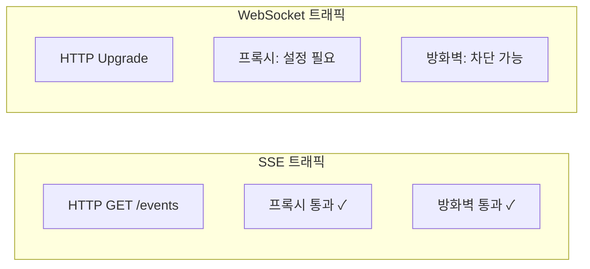
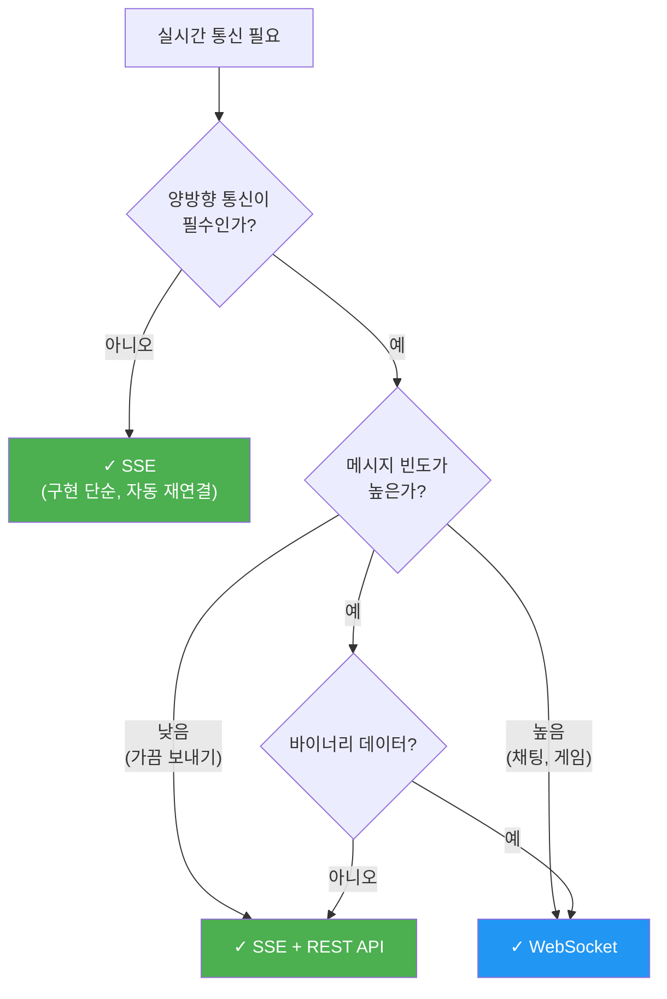

# 07. WebSocket vs SSE - 학습 (LEARN)

## 학습 목표
SSE와 WebSocket의 근본적인 차이를 이해하고, 상황별로 어떤 기술을 선택해야 하는지 기술적 근거를 들어 설명할 수 있다.

---

## 핵심 비교표

| 항목 | SSE | WebSocket |
|------|-----|-----------|
| **통신 방향** | 단방향 (서버→클라이언트) | 양방향 (Full-Duplex) |
| **프로토콜** | HTTP/HTTPS | ws:// / wss:// |
| **데이터 형식** | UTF-8 텍스트만 | 텍스트 + 바이너리 |
| **재연결** | 자동 (브라우저 내장) | 수동 구현 필요 |
| **브라우저 연결 제한** | 도메인당 6개 (HTTP/1.1) | 제한 거의 없음 |
| **방화벽 통과** | 쉬움 (표준 HTTP) | 어려울 수 있음 |
| **프록시 지원** | 완벽 | 설정 필요 |
| **구현 복잡도** | 낮음 | 높음 |

---

## 왜 이런 차이가 발생하는가?

### SSE: HTTP 위에서 동작

SSE는 표준 HTTP 연결을 사용합니다. 브라우저가 GET 요청을 보내면 서버가 `Content-Type: text/event-stream`으로 응답하고, 그 연결을 통해 계속 데이터를 보내는 방식입니다.

**장점**: 기존 HTTP 인프라(프록시, 방화벽, CDN)를 그대로 사용할 수 있습니다.

**단점**: HTTP는 요청-응답 모델이므로, 클라이언트→서버 통신은 별도 HTTP 요청을 해야 합니다.

### WebSocket: 전용 프로토콜

WebSocket은 HTTP로 시작하지만 `Upgrade` 헤더를 통해 프로토콜을 전환합니다. 전환 후에는 HTTP가 아닌 WebSocket 프로토콜로 양방향 통신을 합니다.

**장점**: 하나의 연결에서 양방향 메시지를 자유롭게 주고받을 수 있습니다.

**단점**: HTTP가 아니므로 프록시나 방화벽이 차단할 수 있고, 재연결 로직을 직접 구현해야 합니다.

---

## Go 서버 구현 비교

### SSE 서버

```go
package main

import (
    "fmt"
    "net/http"
    "time"
)

func sseHandler(w http.ResponseWriter, r *http.Request) {
    // SSE 헤더 설정
    w.Header().Set("Content-Type", "text/event-stream")
    w.Header().Set("Cache-Control", "no-cache")
    w.Header().Set("Connection", "keep-alive")

    flusher, ok := w.(http.Flusher)
    if !ok {
        http.Error(w, "SSE not supported", http.StatusInternalServerError)
        return
    }

    // 클라이언트 연결 해제 감지
    ctx := r.Context()

    ticker := time.NewTicker(time.Second)
    defer ticker.Stop()

    for {
        select {
        case <-ctx.Done():
            // 클라이언트가 연결을 끊음
            return
        case t := <-ticker.C:
            // 서버→클라이언트 데이터 전송
            fmt.Fprintf(w, "data: %s\n\n", t.Format(time.RFC3339))
            flusher.Flush()
        }
    }
}

func main() {
    http.HandleFunc("/events", sseHandler)
    http.ListenAndServe(":8080", nil)
}
```

**특징**: 표준 `net/http`만으로 구현 가능합니다. 특별한 라이브러리가 필요 없습니다.

### WebSocket 서버

```go
package main

import (
    "log"
    "net/http"
    "time"

    "github.com/gorilla/websocket"
)

// 외부 라이브러리 필요
var upgrader = websocket.Upgrader{
    CheckOrigin: func(r *http.Request) bool {
        return true // 프로덕션에서는 origin 검증 필요
    },
}

func wsHandler(w http.ResponseWriter, r *http.Request) {
    // HTTP → WebSocket 프로토콜 전환
    conn, err := upgrader.Upgrade(w, r, nil)
    if err != nil {
        log.Println("Upgrade failed:", err)
        return
    }
    defer conn.Close()

    // 연결 상태 관리 필요
    conn.SetPongHandler(func(string) error {
        conn.SetReadDeadline(time.Now().Add(60 * time.Second))
        return nil
    })

    // 양방향 통신: 읽기 고루틴
    go func() {
        for {
            _, message, err := conn.ReadMessage()
            if err != nil {
                log.Println("Read error:", err)
                return
            }
            log.Printf("Received: %s", message)
        }
    }()

    // 양방향 통신: 쓰기 루프
    ticker := time.NewTicker(time.Second)
    defer ticker.Stop()

    for t := range ticker.C {
        err := conn.WriteMessage(websocket.TextMessage, []byte(t.Format(time.RFC3339)))
        if err != nil {
            log.Println("Write error:", err)
            return
        }
    }
}

func main() {
    http.HandleFunc("/ws", wsHandler)
    http.ListenAndServe(":8080", nil)
}
```

**특징**:
- 외부 라이브러리(`gorilla/websocket`)가 필요합니다.
- Ping/Pong 핸들러로 연결 상태를 관리해야 합니다.
- 읽기와 쓰기를 별도 고루틴에서 처리해야 합니다.

---

## React-TypeScript 클라이언트 비교

### SSE 클라이언트 (useEventSource)

```typescript
import { useState, useEffect, useCallback } from 'react';

interface UseEventSourceOptions {
  onMessage?: (data: string) => void;
  onError?: (error: Event) => void;
}

function useEventSource(url: string, options: UseEventSourceOptions = {}) {
  const [isConnected, setIsConnected] = useState(false);
  const [lastMessage, setLastMessage] = useState<string | null>(null);

  useEffect(() => {
    const eventSource = new EventSource(url);

    eventSource.onopen = () => {
      setIsConnected(true);
    };

    eventSource.onmessage = (event) => {
      setLastMessage(event.data);
      options.onMessage?.(event.data);
    };

    eventSource.onerror = (error) => {
      // 브라우저가 자동으로 재연결을 시도함
      setIsConnected(eventSource.readyState === EventSource.OPEN);
      options.onError?.(error);
    };

    return () => {
      eventSource.close();
    };
  }, [url]);

  return { isConnected, lastMessage };
}
```

**특징**:
- 재연결 로직이 필요 없습니다. 브라우저가 알아서 처리합니다.
- 단방향이므로 `send` 함수가 없습니다. 서버로 데이터를 보내려면 별도 HTTP 요청을 해야 합니다.

### WebSocket 클라이언트 (useWebSocket)

```typescript
import { useState, useEffect, useCallback, useRef } from 'react';

interface UseWebSocketOptions {
  onMessage?: (data: string) => void;
  onError?: (error: Event) => void;
  reconnectInterval?: number;
  maxReconnectAttempts?: number;
}

function useWebSocket(url: string, options: UseWebSocketOptions = {}) {
  const [isConnected, setIsConnected] = useState(false);
  const [lastMessage, setLastMessage] = useState<string | null>(null);
  const wsRef = useRef<WebSocket | null>(null);
  const reconnectCountRef = useRef(0);
  const maxAttempts = options.maxReconnectAttempts ?? 10;
  const baseInterval = options.reconnectInterval ?? 1000;

  const connect = useCallback(() => {
    const ws = new WebSocket(url);
    wsRef.current = ws;

    ws.onopen = () => {
      setIsConnected(true);
      reconnectCountRef.current = 0; // 재연결 카운터 리셋
    };

    ws.onmessage = (event) => {
      setLastMessage(event.data);
      options.onMessage?.(event.data);
    };

    ws.onerror = (error) => {
      options.onError?.(error);
    };

    ws.onclose = () => {
      setIsConnected(false);

      // 수동 재연결 로직 (SSE에서는 불필요)
      if (reconnectCountRef.current < maxAttempts) {
        const delay = baseInterval * Math.pow(2, reconnectCountRef.current);
        const jitter = Math.random() * 1000;

        setTimeout(() => {
          reconnectCountRef.current++;
          connect();
        }, delay + jitter);
      }
    };
  }, [url, maxAttempts, baseInterval]);

  useEffect(() => {
    connect();

    return () => {
      wsRef.current?.close();
    };
  }, [connect]);

  // 양방향: 클라이언트→서버 메시지 전송
  const send = useCallback((data: string) => {
    if (wsRef.current?.readyState === WebSocket.OPEN) {
      wsRef.current.send(data);
    }
  }, []);

  return { isConnected, lastMessage, send };
}
```

**특징**:
- 재연결 로직을 직접 구현해야 합니다. 지수 백오프와 Jitter를 추가했습니다.
- `send` 함수로 서버에 메시지를 보낼 수 있습니다. 양방향 통신의 핵심입니다.

---

## 브라우저 연결 제한: HTTP/1.1의 6개 제한

브라우저는 동일 도메인에 대해 HTTP/1.1 연결을 최대 **6개**까지만 허용합니다. SSE는 HTTP 연결을 유지하므로 이 제한의 영향을 받습니다.

```typescript
// 문제: 7번째 SSE 연결부터 대기 상태
for (let i = 0; i < 10; i++) {
  new EventSource(`/events?id=${i}`);  // 6개 이후 차단
}
```

**왜 6개 제한인가?**

HTTP/1.1에서는 하나의 연결이 하나의 요청-응답만 처리할 수 있습니다. 브라우저가 무한정 연결을 열면 서버에 부담이 되므로, 도메인당 연결 수를 제한합니다.

**해결 방법:**

| 방법 | 설명 |
|------|------|
| **HTTP/2 사용** | 하나의 연결에서 여러 스트림을 멀티플렉싱합니다. 6개 제한이 사실상 없어집니다. |
| **서브도메인 분산** | `events1.example.com`, `events2.example.com`으로 연결을 분산합니다. |
| **연결 공유** | 하나의 SSE 연결에서 여러 타입의 이벤트를 전송합니다. |

### 연결 공유 패턴

```typescript
// 클라이언트: 하나의 연결로 여러 이벤트 구독
const eventSource = new EventSource('/events?subscribe=stock,alert,news');

eventSource.addEventListener('stock', (e) => {
  const data = JSON.parse(e.data);
  updateStockPrice(data);
});

eventSource.addEventListener('alert', (e) => {
  const data = JSON.parse(e.data);
  showNotification(data);
});

eventSource.addEventListener('news', (e) => {
  const data = JSON.parse(e.data);
  appendNewsItem(data);
});
```

```go
// 서버: 클라이언트가 구독한 이벤트만 전송
func sseHandler(w http.ResponseWriter, r *http.Request) {
    subscriptions := strings.Split(r.URL.Query().Get("subscribe"), ",")

    // ... SSE 설정 ...

    for event := range eventChannel {
        if contains(subscriptions, event.Type) {
            fmt.Fprintf(w, "event: %s\ndata: %s\n\n", event.Type, event.Data)
            flusher.Flush()
        }
    }
}
```

---

## 방화벽과 프록시: SSE의 숨은 강점

### 왜 WebSocket이 차단될까?

```
"WebSocket은 방화벽에서 자주 차단됩니다. Fortune 500 계약을 잃은 적도 있습니다."
— Reddit r/webdev
```

WebSocket은 HTTP 업그레이드 후 독자적인 프로토콜로 동작합니다. 기업 환경의 프록시나 방화벽은 HTTP만 허용하도록 설정된 경우가 많아, WebSocket 연결이 차단됩니다.

### SSE가 통과하는 이유

SSE는 순수 HTTP입니다. 프록시가 볼 때 긴 응답을 보내는 HTTP 연결일 뿐입니다. 특별한 설정 없이도 기존 인프라를 통과합니다.



---

## 실무 아키텍처 패턴

### 패턴 1: SSE + REST API (권장)

대부분의 실시간 요구사항은 "서버→클라이언트 푸시 + 클라이언트 액션시 REST 호출"로 해결됩니다.

```typescript
// React 컴포넌트 예시
function NotificationPanel() {
  const { lastMessage } = useEventSource('/events/notifications');

  // 서버 → 클라이언트: SSE로 실시간 알림 수신
  useEffect(() => {
    if (lastMessage) {
      const notification = JSON.parse(lastMessage);
      showToast(notification.message);
    }
  }, [lastMessage]);

  // 클라이언트 → 서버: REST API로 알림 읽음 처리
  const markAsRead = async (notificationId: string) => {
    await fetch(`/api/notifications/${notificationId}/read`, {
      method: 'POST',
    });
    // SSE로 업데이트된 상태가 다시 푸시됨
  };

  return (
    // ... UI
  );
}
```

**왜 이 패턴인가?**

80%의 실시간 기능은 "서버가 클라이언트에 알려주는" 단방향입니다. 나머지 20%의 클라이언트 액션은 기존 REST API로 충분합니다. WebSocket의 양방향 복잡성이 필요 없습니다.

### 패턴 2: WebSocket (양방향 필수)

채팅, 게임, 협업 편집처럼 양방향 메시지가 빈번할 때 WebSocket을 사용합니다.

```typescript
function ChatRoom({ roomId }: { roomId: string }) {
  const { isConnected, lastMessage, send } = useWebSocket(`/ws/chat/${roomId}`);
  const [messages, setMessages] = useState<Message[]>([]);

  // 서버 → 클라이언트
  useEffect(() => {
    if (lastMessage) {
      const message = JSON.parse(lastMessage);
      setMessages(prev => [...prev, message]);
    }
  }, [lastMessage]);

  // 클라이언트 → 서버 (빈번한 양방향 통신)
  const sendMessage = (text: string) => {
    send(JSON.stringify({ type: 'message', text }));
  };

  return (
    // ... UI
  );
}
```

---

## 실제 서비스의 기술 선택

| 서비스 | 기술 | 이유 |
|--------|------|------|
| **ChatGPT** | SSE | 응답 스트리밍이 단방향. 사용자 입력은 REST API로 전송. |
| **Claude** | SSE | ChatGPT와 동일한 이유. |
| **Slack** | WebSocket | 양방향 채팅. 타이핑 인디케이터 등 빈번한 양방향 이벤트. |
| **Discord** | WebSocket | 실시간 음성/채팅. 바이너리 데이터(음성) 전송 필요. |
| **GitHub Actions** | SSE | 로그 스트리밍이 단방향. |
| **Figma** | WebSocket | 협업 편집. 양방향 동기화 필수. |
| **Google Docs** | WebSocket | 동시 편집. 양방향 동기화 필수. |
| **Stripe Dashboard** | SSE | 결제 이벤트 알림이 단방향. |

**패턴 인식**: AI 응답, 로그 스트리밍, 알림처럼 "서버가 보내고 클라이언트가 받는" 기능은 SSE. 채팅, 협업 편집처럼 "양쪽이 자유롭게 메시지를 주고받는" 기능은 WebSocket.

---

## 선택 가이드



### 빠른 판단 기준

| 질문 | SSE | WebSocket |
|------|:---:|:---------:|
| 서버→클라이언트 푸시만 필요하다 | ✓ | |
| 자동 재연결이 중요하다 | ✓ | |
| 기업 환경 방화벽 걱정이 있다 | ✓ | |
| 빠르게 구현해야 한다 | ✓ | |
| 클라이언트가 자주 메시지를 보낸다 | | ✓ |
| 바이너리 데이터를 주고받는다 | | ✓ |
| 채팅/게임처럼 즉각 응답이 필요하다 | | ✓ |

---

## 면접 대비 요약

### Q: "SSE와 WebSocket의 차이를 설명해주세요"

**핵심 답변**:
> SSE는 HTTP 위에서 동작하는 단방향 스트리밍이고, WebSocket은 HTTP 업그레이드 후 전용 프로토콜로 전환되는 양방향 통신입니다.
>
> SSE의 장점은 표준 HTTP라서 프록시/방화벽 통과가 쉽고, 브라우저가 자동 재연결을 해준다는 점입니다. 단점은 단방향이라 클라이언트→서버 통신은 별도 HTTP 요청이 필요합니다.
>
> WebSocket의 장점은 하나의 연결에서 양방향 통신이 가능하고, 바이너리 데이터도 전송할 수 있다는 점입니다. 단점은 재연결 로직을 직접 구현해야 하고, 방화벽에서 차단될 수 있습니다.

### Q: "언제 SSE를 선택하고, 언제 WebSocket을 선택하나요?"

**핵심 답변**:
> 실시간 요구사항의 80%는 "서버가 클라이언트에 푸시하는" 단방향입니다. ChatGPT 응답 스트리밍, 알림, 주가 업데이트 같은 기능입니다. 이 경우 SSE가 적합합니다. 클라이언트 액션이 필요하면 기존 REST API를 함께 사용하면 됩니다.
>
> WebSocket은 채팅, 게임, 협업 편집처럼 양쪽이 빈번하게 메시지를 주고받을 때 선택합니다. 특히 타이핑 인디케이터처럼 작은 이벤트가 자주 발생하는 경우 HTTP 오버헤드를 피할 수 있습니다.

### Q: "HTTP/1.1의 6개 연결 제한은 어떻게 해결하나요?"

**핵심 답변**:
> 세 가지 방법이 있습니다.
> 1. HTTP/2를 사용하면 하나의 연결에서 여러 스트림을 멀티플렉싱하므로 제한이 사라집니다.
> 2. 서브도메인을 분산하여 도메인별 제한을 우회할 수 있습니다.
> 3. 가장 좋은 방법은 하나의 SSE 연결에서 여러 이벤트 타입을 전송하는 "연결 공유" 패턴입니다. 클라이언트가 구독할 이벤트를 지정하고, 서버가 해당 이벤트만 전송합니다.

---

실습으로 넘어가기 → [practice/](./practice/)
