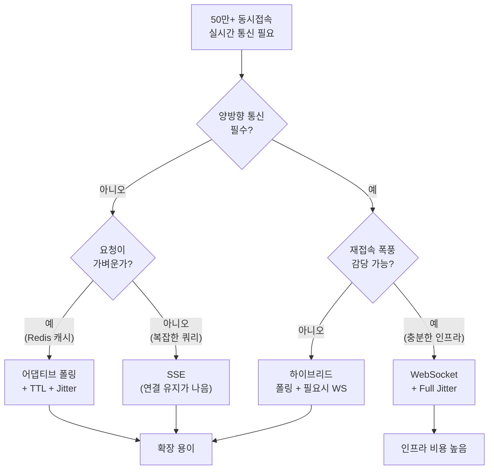

# 08. 대규모 트래픽 아키텍처 - 학습 (LEARN)

## 학습 목표
대규모 트래픽 환경(50만+ 동시접속)에서의 실시간 통신 기술 선택 기준을 이해하고, "연결 비용 vs 요청 비용" 트레이드오프를 면접에서 설명할 수 있다.

---

## 핵심 공식

> **연결 유지 비용 > 자주 묻는 비용 → 폴링이 유리한 구간**

대규모 환경에서 WebSocket의 "연결 유지" 비용이 폴링의 "반복 요청" 비용보다 클 수 있습니다. 이 트레이드오프를 이해하는 것이 이 섹션의 핵심입니다.

---

## 왜 대규모 환경에서 폴링을 선택하는가?

### WebSocket/SSE의 비용 (Stateful)

WebSocket과 SSE는 연결을 유지해야 합니다. 50만 명 접속 시 50만 개의 소켓 객체가 서버 메모리에 상주합니다. 사용자가 화면만 보고 있어도, 아무 데이터도 주고받지 않아도, 서버는 이 연결들을 계속 관리해야 합니다.

**리소스 비용 분석:**

| 리소스 | 50만 연결 시 비용 | 문제점 |
|--------|-----------------|--------|
| **메모리** | 5~10 GB | 서버 인스턴스 스펙 상향 필요 |
| **파일 디스크립터** | 50만 개 | OS 기본 한계(1024) 초과 |
| **로드밸런서** | Max Connection 한계 | AWS ALB: 3만/인스턴스 |
| **TCP 버퍼** | 송신/수신 각각 할당 | 커널 메모리 압박 |
| **Heartbeat** | 50만 × ping/pong | CPU 사용률 증가 |

### WebSocket vs SSE 연결 비용 차이

위 테이블에서 WebSocket과 SSE를 함께 묶었지만, 실제로는 차이가 있습니다.

| 항목 | WebSocket | SSE |
|------|-----------|-----|
| **핸드셰이크** | HTTP Upgrade → 프로토콜 전환 | 일반 HTTP 요청 (프로토콜 전환 없음) |
| **연결당 버퍼** | 양방향 송/수신 버퍼 2개 | 송신 버퍼만 (서버→클라이언트 단방향) |
| **Heartbeat** | 양방향 ping/pong | 서버→클라이언트 단방향 |
| **로드밸런서** | WebSocket 지원 필수 (L7) | 일반 HTTP 스트리밍으로 처리 가능 |
| **프록시/방화벽** | Upgrade 차단 가능성 | HTTP이므로 대부분 통과 |

SSE가 WebSocket보다 연결당 비용이 낮습니다. 하지만 50만+ 규모에서는 둘 다 "연결을 유지해야 한다"는 근본적인 부담은 동일합니다. 연결 수 자체가 문제의 핵심이기 때문입니다.

### 폴링의 장점 (Stateless)

폴링은 요청-응답 후 연결을 즉시 종료합니다. 서버 입장에서 "상태"가 없습니다. 어떤 서버로 요청이 가도 동일하게 처리할 수 있고, 서버 한 대가 죽어도 다른 서버가 바로 처리합니다.

| 장점 | 설명 |
|------|------|
| **연결 유지 불필요** | 요청-응답 후 연결 종료, 메모리 즉시 해제 |
| **스케일 아웃 용이** | API 서버만 추가하면 됨 |
| **로드밸런싱 단순** | 어느 서버로 가도 무관 (Stateless) |
| **장애 격리** | 한 서버 죽어도 다른 서버로 자동 라우팅 |

---

## 재접속 폭풍 (Reconnection Storm)

### 시나리오: 네트워크가 1초 깜빡이면?

50만 명이 WebSocket이나 SSE로 연결되어 있는데, 네트워크 장비 교체나 순간 장애로 1초간 연결이 끊겼다고 가정합니다. SSE와 WebSocket 모두 재연결 로직이 있으므로, **50만 클라이언트가 동시에 재연결을 시도**합니다.

**단계별 상황:**

| 단계 | 상황 | 영향 |
|:----:|------|------|
| 1 | 네트워크 1초 장애 | 50만 연결 끊김 |
| 2 | 자동 재연결 로직 발동 | 50만 동시 요청 |
| 3 | 핸드셰이크 + TLS + 인증 | 서버당 5만 요청 (10대 기준) |
| 4 | 서버 과부하 | 응답 지연, 타임아웃 |
| 5 | 재시도 로직 발동 | 요청 2배 증가 |
| 6 | 시스템 붕괴 | 복구 불가능 |

이것은 사실상 **사용자들이 발생시키는 DDoS 공격**과 같습니다.

### 왜 폴링에서는 발생하지 않는가?

폴링은 각 요청이 독립적입니다. 한 번 요청이 실패해도 다음 폴링 주기까지 대기합니다. 50만 명이 5초 주기로 폴링하면, 초당 10만 요청으로 균등하게 분산됩니다. "한꺼번에 몰리는" 상황이 구조적으로 발생하지 않습니다.

---

## 재접속 폭풍 대응: Full Jitter

### 기본 지수 백오프의 한계

```typescript
// 기본 방식 (문제 있음)
function basicBackoff(attempt: number): number {
  const baseDelay = Math.min(1000 * Math.pow(2, attempt), 30000);
  const jitter = Math.random() * 1000; // 0~1000ms Jitter
  return baseDelay + jitter;
}

// 1차: 1000 + (0~1000) = 1000~2000ms
// 문제: 1초 범위의 Jitter로는 50만 요청을 분산시키지 못함
```

기본 지수 백오프에 Jitter를 추가해도, Jitter 범위가 좁으면 요청이 여전히 밀집됩니다. 50만 요청을 1초 범위에 분산하면 초당 50만 요청이 됩니다.

### Full Jitter (AWS 권장)

```typescript
// Full Jitter: 0부터 계산된 값 사이에서 완전 랜덤
function fullJitter(attempt: number): number {
  const ceiling = Math.min(30000, 1000 * Math.pow(2, attempt));
  return Math.random() * ceiling;  // 0 ~ ceiling 사이 균등 분포
}

// 1차: random(0, 1000)  → 0~1초 어디든
// 2차: random(0, 2000)  → 0~2초 어디든
// 3차: random(0, 4000)  → 0~4초 어디든
// → 시간 축에 균등하게 분산됨
```

Full Jitter는 "baseDelay + jitter"가 아니라 "0 ~ ceiling 사이 랜덤"입니다. 이렇게 하면 재연결 시도가 시간 축에 균등하게 퍼집니다.

### Initial Delay 추가

```typescript
// 연결 끊김 시 즉시가 아닌, 랜덤 지연 후 재연결
function onDisconnect() {
  const initialDelay = Math.random() * 5000; // 0~5초 랜덤
  setTimeout(() => reconnectWithFullJitter(), initialDelay);
}
```

첫 번째 재연결 시도부터 분산시키면 효과가 더 커집니다.

---

## 요청 비용 분석: "요청 한 건의 무게"

### 모든 요청이 같은 무게는 아니다

```
상품 검색 API:
- RDB 복잡 쿼리 (다중 JOIN, 인덱스 스캔)
- 처리 시간: 100ms~
- 서버 리소스: DB 연결, CPU 높음

대기열 조회 API:
- Redis GET 한 번
- 숫자 하나 반환
- 처리 시간: 1~5ms
- 서버 리소스: 거의 없음
```

**100배 차이**입니다. 요청이 가벼우면 폴링의 "반복 비용"이 WebSocket의 "연결 유지 비용"보다 낮을 수 있습니다.

### 핵심 공식 적용

```
50만 × 1ms (폴링)  vs  50만 × 연결 유지 (WebSocket)
       ↓                        ↓
   500초/초 처리             5GB 메모리 상주
   (서버 1~2대 가능)         (재접속 폭풍 위험)
```

SRT/KTX 대기열 시스템이 폴링을 선택한 이유입니다. 대기열 조회는 Redis에서 숫자 하나만 읽는 초경량 요청이므로, 50만 명이 5초마다 폴링해도 서버 부담이 크지 않습니다.

---

## Go 서버: 어댑티브 폴링 구현

어댑티브 폴링은 서버가 다음 폴링 주기(TTL)를 응답에 포함시키는 전략입니다. 대기 순번에 따라 폴링 빈도를 조절하여 서버 부하를 최적화합니다.

```go
package main

import (
    "encoding/json"
    "net/http"
    "strconv"
    "time"

    "github.com/redis/go-redis/v9"
)

var redisClient *redis.Client

type QueueResponse struct {
    Position int    `json:"position"` // 내 앞 대기 인원
    Total    int    `json:"total"`    // 전체 대기 인원
    TTL      int    `json:"ttl"`      // 다음 폴링 주기 (ms)
    Redirect string `json:"redirect,omitempty"`
}

func queueHandler(w http.ResponseWriter, r *http.Request) {
    ctx := r.Context()
    token := r.URL.Query().Get("token")

    // Redis에서 위치 조회 (1ms 이하)
    positionStr, _ := redisClient.Get(ctx, "queue:"+token+":position").Result()
    totalStr, _ := redisClient.Get(ctx, "queue:total").Result()

    position, _ := strconv.Atoi(positionStr)
    total, _ := strconv.Atoi(totalStr)

    // 입장 가능하면 리다이렉트
    if position == 0 {
        json.NewEncoder(w).Encode(QueueResponse{
            Position: 0,
            Redirect: "/booking",
        })
        return
    }

    // 대기 위치에 따라 TTL 동적 조절
    // 앞에 있을수록 자주 확인, 뒤에 있을수록 드물게
    ttl := calculateTTL(position)

    response := QueueResponse{
        Position: position,
        Total:    total,
        TTL:      ttl,
    }

    w.Header().Set("Content-Type", "application/json")
    json.NewEncoder(w).Encode(response)
}

func calculateTTL(position int) int {
    switch {
    case position <= 10:
        return 500   // 0.5초 (곧 입장)
    case position <= 100:
        return 2000  // 2초
    case position <= 1000:
        return 5000  // 5초
    case position <= 10000:
        return 10000 // 10초
    default:
        return 30000 // 30초 (한참 뒤)
    }
}

func main() {
    redisClient = redis.NewClient(&redis.Options{
        Addr: "localhost:6379",
    })

    http.HandleFunc("/api/queue", queueHandler)
    http.ListenAndServe(":8080", nil)
}
```

**설계 의도:**
- 대기 순번이 낮을수록(곧 입장) 자주 확인하여 UX를 높입니다.
- 대기 순번이 높을수록(한참 뒤) 드물게 확인하여 서버 부하를 줄입니다.
- Redis GET은 1ms 이하이므로, 초당 수만 요청도 서버 1~2대로 처리 가능합니다.

---

## React-TypeScript: 어댑티브 폴링 클라이언트

```typescript
import { useState, useEffect, useCallback, useRef } from 'react';

interface QueueStatus {
  position: number;
  total: number;
  ttl: number;
  redirect?: string;
}

interface UseAdaptivePollingOptions {
  onRedirect?: (url: string) => void;
  onError?: (error: Error) => void;
  maxRetries?: number;
}

function useAdaptivePolling(
  token: string,
  options: UseAdaptivePollingOptions = {}
) {
  const [status, setStatus] = useState<QueueStatus | null>(null);
  const [isPolling, setIsPolling] = useState(true);
  const [error, setError] = useState<Error | null>(null);
  const retryCountRef = useRef(0);
  const timeoutRef = useRef<NodeJS.Timeout>();
  const maxRetries = options.maxRetries ?? 5;

  const poll = useCallback(async () => {
    if (!isPolling) return;

    try {
      const response = await fetch(`/api/queue?token=${token}`);

      if (!response.ok) {
        throw new Error(`HTTP ${response.status}`);
      }

      const data: QueueStatus = await response.json();
      setStatus(data);
      retryCountRef.current = 0; // 성공 시 재시도 카운터 리셋

      // 입장 가능하면 리다이렉트
      if (data.redirect) {
        setIsPolling(false);
        options.onRedirect?.(data.redirect);
        return;
      }

      // 서버가 제공한 TTL에 Jitter 추가
      const jitter = data.ttl * 0.2 * (Math.random() * 2 - 1);
      const nextPollTime = Math.max(500, data.ttl + jitter);

      timeoutRef.current = setTimeout(poll, nextPollTime);
    } catch (err) {
      const error = err instanceof Error ? err : new Error(String(err));
      setError(error);
      options.onError?.(error);

      // 재시도 로직 (지수 백오프)
      if (retryCountRef.current < maxRetries) {
        const backoff = Math.min(30000, 1000 * Math.pow(2, retryCountRef.current));
        const jitter = Math.random() * backoff; // Full Jitter
        retryCountRef.current++;
        timeoutRef.current = setTimeout(poll, jitter);
      } else {
        setIsPolling(false);
      }
    }
  }, [token, isPolling, maxRetries, options]);

  useEffect(() => {
    poll();

    return () => {
      if (timeoutRef.current) {
        clearTimeout(timeoutRef.current);
      }
    };
  }, [poll]);

  const stop = useCallback(() => {
    setIsPolling(false);
    if (timeoutRef.current) {
      clearTimeout(timeoutRef.current);
    }
  }, []);

  const resume = useCallback(() => {
    setIsPolling(true);
    poll();
  }, [poll]);

  return {
    status,
    error,
    isPolling,
    stop,
    resume,
  };
}
```

### React 컴포넌트에서 사용

```typescript
function QueuePage() {
  const token = useQueueToken(); // 발급받은 대기열 토큰
  const navigate = useNavigate();

  const { status, error, isPolling } = useAdaptivePolling(token, {
    onRedirect: (url) => {
      navigate(url);
    },
    onError: (error) => {
      console.error('Queue polling error:', error);
    },
  });

  if (error && !isPolling) {
    return <ErrorFallback error={error} onRetry={() => window.location.reload()} />;
  }

  if (!status) {
    return <LoadingSpinner />;
  }

  const estimatedMinutes = Math.ceil(status.position / 50); // TPS 50 가정

  return (
    <div className="queue-status">
      <h2>대기 중입니다</h2>
      <div className="position">
        <span className="number">{status.position.toLocaleString()}</span>
        <span className="label">명 앞에 대기 중</span>
      </div>
      <div className="estimate">
        예상 대기 시간: 약 {estimatedMinutes}분
      </div>
      <ProgressBar current={status.total - status.position} total={status.total} />
    </div>
  );
}
```

---

## Jitter 기법: 요청 분산

### 왜 Jitter가 필요한가?

모든 클라이언트가 정확히 같은 시간에 폴링하면 서버에 스파이크가 발생합니다. TTL이 5초라면, 5초마다 50만 요청이 한꺼번에 들어옵니다.

```
Jitter 없음:
t=0: 50만 요청 → 스파이크!
t=5s: 50만 요청 → 스파이크!
t=10s: 50만 요청 → 스파이크!

Jitter 적용 (±20%):
t=0~1s: 분산 요청 → 평탄화
t=5~6s: 분산 요청 → 평탄화
t=10~11s: 분산 요청 → 평탄화
```

Jitter를 추가하면 요청이 시간에 따라 분산되어 서버 부하가 평탄해집니다.

### Jitter 구현

```typescript
function getNextPollTime(baseTtl: number): number {
  // 기본 TTL의 ±20% 랜덤 변화
  const jitter = baseTtl * 0.2 * (Math.random() * 2 - 1);
  return Math.max(500, baseTtl + jitter);
}

// baseTtl = 5000ms
// 실제 대기: 4000~6000ms 사이 랜덤
```

---

## 실무 사례: SRT/KTX 예매 대기열

### 아키텍처 분석

SRT/KTX 예매 시스템은 HTTP GET 폴링 방식을 사용합니다. 50만+ 동시 접속을 처리하기 위해 상용 솔루션인 네퍼널(Netfunnel)을 활용합니다.

**응답 데이터 구조:**

```json
{
  "nwait": 15234,       // 내 앞 대기 인원
  "nnext": 8721,        // 내 뒤 대기 인원
  "tps": 50,            // 초당 입장 처리율
  "ttl": 5000,          // 다음 폴링 주기 (ms)
  "key": "eyJhbGci...", // 서명된 클라이언트 식별 토큰
  "ip": "203.x.x.x"     // 클라이언트 IP (검증용)
}
```

| 필드 | 설명 | 용도 |
|------|------|------|
| `nwait` | 내 앞 대기 인원 | 예상 대기 시간 = nwait / tps |
| `ttl` | 다음 폴링 주기 | **서버가 클라이언트를 제어** |
| `key` | 서명된 토큰 | 재사용/변조 방지 |

핵심은 **TTL을 서버가 제어**한다는 점입니다. 트래픽이 몰리면 TTL을 늘려서 폴링 빈도를 낮추고, 트래픽이 줄면 TTL을 줄여서 반응성을 높입니다.

### JSONP를 사용하는 이유

네퍼널은 JSONP(JSON with Padding)를 사용합니다. JSONP는 `<script>` 태그를 이용한 크로스 도메인 데이터 요청 기법입니다.

```html
<!-- JSONP 요청 -->
<script src="https://netfunnel.co.kr/queue?callback=handleQueue&token=abc"></script>

<!-- 서버 응답 -->
<script>
handleQueue({"nwait": 15234, "ttl": 5000});
</script>
```

2010년대 초 시스템 설계 당시 CORS가 표준화되지 않았고, `<script>` 태그는 동일 출처 정책이 적용되지 않았기 때문에 JSONP를 사용했습니다. 현대적인 시스템이라면 CORS를 사용하겠지만, 레거시 호환성을 위해 유지합니다.

### Sticky Session이 필요한 이유

대기열은 "상태"가 있습니다. 내 대기 순번, 입장 권한 등이 특정 서버에 캐시되어 있습니다. 요청마다 다른 서버로 라우팅되면 상태가 불일치합니다.

**구현 방식:**
- 쿠키 기반: `SERVERID=server1`
- IP 해시: 클라이언트 IP로 서버 결정
- 토큰 기반: 응답의 `key`에 서버 ID 포함

### 재연결 시 같은 서버로 가야 하는가?

Sticky Session은 대기열에만 해당하는 것이 아닙니다. WebSocket과 SSE에서도 같은 질문이 발생합니다. 핵심은 **상태가 어디에 저장되는지**입니다.

| 상태 저장 위치 | 같은 서버 필요? | 예시 |
|---------------|:--------------:|------|
| **서버 로컬 메모리** | 필요 (Sticky Session) | 서버가 클라이언트별 구독 목록, 세션 데이터를 메모리에 보관 |
| **공유 저장소 (Redis, DB)** | 불필요 | 어느 서버든 Redis에서 상태를 읽어 처리 |

**SSE의 유리한 점**: SSE는 `Last-Event-ID` 메커니즘이 있습니다. 재연결 시 이 ID를 헤더로 보내므로, 이벤트 스토어가 공유 저장소에 있으면 어느 서버로 재연결해도 놓친 이벤트를 복구할 수 있습니다. Ch04에서 구현한 패턴이 이것입니다.

**WebSocket의 제약**: WebSocket은 프로토콜 수준에서 Last-Event-ID 같은 복구 메커니즘이 없습니다. 재연결 후 상태 동기화를 애플리케이션 레벨에서 직접 구현해야 합니다 (예: SNAPSHOT 메시지 요청).

```
SSE 재연결:
Client → Server B: "Last-Event-ID: 42" (헤더)
Server B → Redis: "42번 이후 이벤트 조회"
Server B → Client: 43, 44, 45... (자동 복구)

WebSocket 재연결:
Client → Server B: 새 연결 수립
Client → Server B: { type: "SYNC", lastSeq: 42 }  (앱 레벨 구현)
Server B → Client: { type: "SNAPSHOT", data: [...] }
```

---

## 기술 선택 가이드 (대규모 환경)



### 상황별 권장 기술

| 상황 | 권장 기술 | 이유 |
|------|----------|------|
| 50만+ 동시접속, 단방향 상태 확인 | **어댑티브 폴링** | 연결 비용 > 요청 비용 |
| 대기열/순번 시스템 | **폴링 + TTL** | 가벼운 요청, Stateless |
| 실시간 알림 (중규모) | **SSE** | 단방향 충분, HTTP 호환 |
| 채팅/게임 (양방향 필수) | **WebSocket** | Full-Duplex 필요 |
| 하이브리드 요구사항 | **SSE + REST** | 상황별 최적화 |

### 비용 비교

| 항목 | 폴링 (50만) | WebSocket/SSE (50만) |
|------|:-----------:|:--------------------:|
| 서버 메모리 | 낮음 (Stateless) | 5~10GB (연결 유지) |
| 로드밸런서 | 표준 HTTP LB | Max Connection 주의 |
| 스케일 아웃 | 서버 추가만 | 연결 마이그레이션 필요 |
| 장애 복구 | 즉시 다른 서버로 | 재접속 폭풍 위험 |
| 인프라 비용 | 낮음 | 높음 |

---

## 면접 대비 요약

### Q: "50만 동시접속 시스템에서 WebSocket vs Polling 중 어떤 것을 선택하겠습니까?"

**핵심 답변:**
> 요구사항에 따라 다릅니다.
>
> **폴링 선택 (대기열/상태 조회):**
> - 단방향 상태 확인만 필요하고, 요청이 가벼우면(Redis 캐시) 폴링이 유리합니다.
> - SRT/KTX 대기열이 이 방식을 사용합니다. Redis에서 숫자 하나 읽는 1ms 요청이므로, 50만 명 폴링도 서버 1~2대로 처리 가능합니다.
> - 어댑티브 폴링 + Jitter로 부하를 분산하고, Stateless라 스케일 아웃이 쉽습니다.
> - 재접속 폭풍 위험이 없습니다.
>
> **WebSocket/SSE 선택:**
> - 데이터가 자주 변하고 즉각 반영이 필요하면 연결 유지가 나을 수 있습니다.
> - 단, Full Jitter 재연결 로직 필수이고, 로드밸런서 Max Connection, 서버 메모리를 고려해야 합니다.
>
> **핵심 공식:** 연결 유지 비용 > 자주 묻는 비용 → 폴링 선택

### Q: "재접속 폭풍(Reconnection Storm)이란 무엇이고, 어떻게 대응하나요?"

**핵심 답변:**
> 재접속 폭풍은 네트워크 장애 후 수만~수십만 클라이언트가 동시에 재연결을 시도하여 서버가 과부하되는 현상입니다. 사용자들이 발생시키는 DDoS와 같습니다.
>
> 대응 방법:
> 1. **Full Jitter**: 재연결 시도를 0~ceiling 사이 균등 분포로 분산합니다. 기존 "base + jitter"보다 훨씬 넓게 퍼집니다.
> 2. **Initial Delay**: 연결 끊김 감지 시 즉시 재연결하지 않고, 랜덤 지연 후 시작합니다.
> 3. **Circuit Breaker**: 서버 과부하 감지 시 일시적으로 연결 거부하여 시스템을 보호합니다.
>
> 폴링은 구조적으로 이 문제가 발생하지 않습니다. 각 요청이 독립적이고, 실패해도 다음 폴링 주기까지 대기하기 때문입니다.

### Q: "어댑티브 폴링(Adaptive Polling)이란 무엇인가요?"

**핵심 답변:**
> 어댑티브 폴링은 서버가 클라이언트의 폴링 주기를 동적으로 제어하는 전략입니다.
>
> 서버가 응답에 TTL(Time To Live)을 포함시키고, 클라이언트는 그 시간만큼 대기 후 다음 요청을 보냅니다. 대기열 시스템에서는 순번이 낮을수록(곧 입장) TTL을 짧게 하여 반응성을 높이고, 순번이 높을수록(한참 뒤) TTL을 길게 하여 서버 부하를 줄입니다.
>
> 추가로 Jitter(±20% 랜덤 변화)를 적용하여 요청이 특정 시점에 몰리는 스파이크를 방지합니다.

---

## 참고 자료

- 우아한테크 - "대규모 트래픽에서 폴링 vs 소켓" (YouTube)
- Netfunnel 공식 문서
- AWS - "Exponential Backoff and Jitter" 블로그
- AWS - "WebSocket at Scale" 백서

---

이전 섹션: [07. WebSocket 비교](../07-websocket-comparison/)
