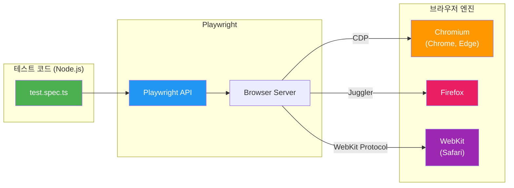
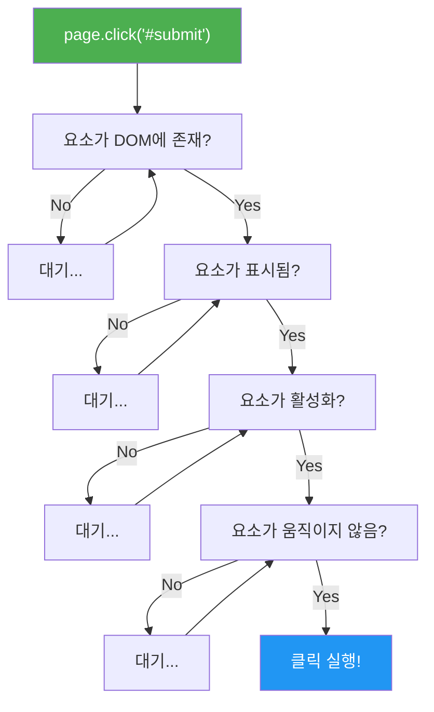
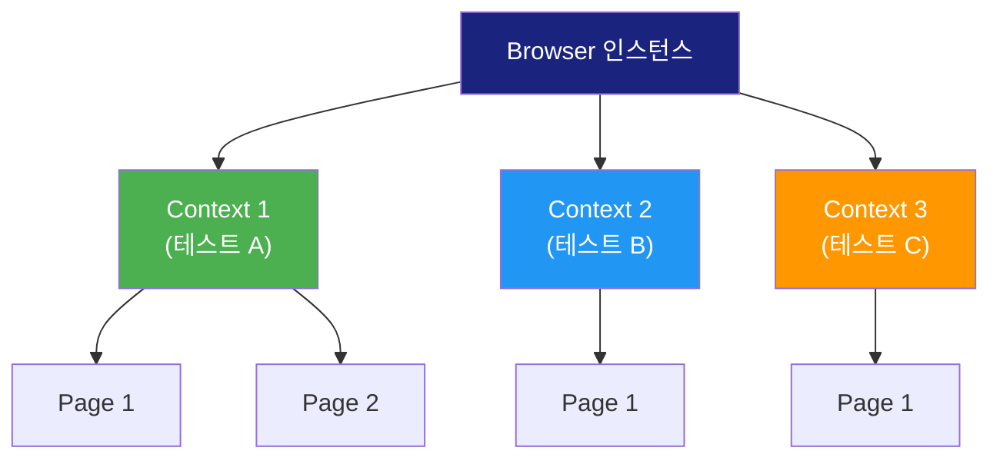
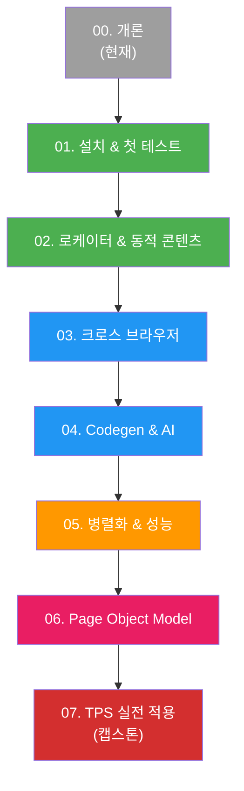

# 00. Playwright 개론 - 학습 (LEARN)

## 학습 목표

이 문서를 학습하면 다음 질문에 답할 수 있습니다:
- Playwright는 무엇이고, 왜 E2E 테스트 도구로 선택하는가?
- Playwright의 아키텍처는 어떻게 구성되어 있는가?
- Auto-wait과 Test Isolation이 왜 중요한가?

---

## Playwright란?

> **한 문장 정의**: Playwright는 **Microsoft가 개발한 크로스 브라우저 E2E 테스트 프레임워크**로, 단일 API로 Chromium, Firefox, WebKit 세 브라우저를 자동화하며, 기본 내장된 auto-wait과 테스트 격리를 통해 안정적인 테스트를 보장합니다.

### 왜 Playwright를 선택하는가?

기존 E2E 도구들의 한계를 극복하기 위해 설계되었습니다. Selenium은 WebDriver 프로토콜의 지연과 flaky 테스트 문제가 있었고, Cypress는 단일 브라우저 탭 제약과 크로스 브라우저 지원 부족이 있었습니다. Playwright는 이 두 가지 문제를 모두 해결합니다.

| 문제 | 기존 도구 | Playwright 해결책 |
|------|----------|------------------|
| Flaky 테스트 | 명시적 wait 필요 | Auto-wait 내장 |
| 크로스 브라우저 | 도구마다 다른 API | 단일 API, 3 엔진 |
| 테스트 격리 | 전역 상태 공유 | Browser Context |
| 병렬 실행 | 별도 설정 필요 | 기본 지원 |
| 네트워크 제어 | 제한적 | Route API로 가로채기 |

---

## 아키텍처

Playwright는 브라우저와 **직접 통신**하는 방식을 사용합니다. Selenium처럼 중간에 WebDriver 서버를 거치지 않기 때문에 빠르고 안정적입니다.



### 핵심 포인트
- **Chromium**: CDP(Chrome DevTools Protocol)을 통해 통신합니다.
- **Firefox**: Mozilla가 Playwright를 위해 만든 Juggler 프로토콜을 사용합니다.
- **WebKit**: Apple의 WebKit 디버깅 프로토콜을 사용합니다.
- 모든 브라우저가 **동일한 Playwright API**로 제어됩니다.

---

## Playwright Test vs Playwright Library

### 왜 두 가지가 존재하는가?

Playwright Library(`playwright`)는 **브라우저 자동화 API만** 제공합니다. 스크래핑, 자동화 스크립트, 기존 Jest 통합에 적합합니다.

Playwright Test(`@playwright/test`)는 Library 위에 **테스트 프레임워크**를 얹은 것입니다. 테스트 러너, 리포터, 병렬 실행, fixture 등이 내장되어 있어 E2E 테스트에 최적화되어 있습니다.

```
┌─────────────────────────────────────────┐
│         @playwright/test                │
│  ┌────────┬──────────┬───────────────┐  │
│  │ Runner │ Reporter │ Fixtures/Hook │  │
│  └────────┴──────────┴───────────────┘  │
│  ┌─────────────────────────────────────┐│
│  │         playwright (Library)        ││
│  │   Browser, Page, Locator API        ││
│  └─────────────────────────────────────┘│
└─────────────────────────────────────────┘
```

| 기능 | playwright (Library) | @playwright/test |
|------|---------------------|-----------------|
| 브라우저 제어 | ✅ | ✅ |
| 테스트 러너 | ❌ (Jest 등 필요) | ✅ 내장 |
| 병렬 실행 | ❌ 직접 구현 | ✅ 기본 지원 |
| Fixtures | ❌ | ✅ `page`, `context` 등 |
| HTML 리포트 | ❌ | ✅ 내장 |
| Trace Viewer | ✅ (수동 설정) | ✅ 통합 |

> **이 PoC에서는 `@playwright/test`를 사용합니다.** E2E 테스트 학습이 목적이기 때문입니다. Python 보조 스크립트에서만 Library 방식을 사용합니다.

---

## Auto-Wait 메커니즘

Playwright의 가장 강력한 기능 중 하나입니다. `click()`, `fill()`, `check()` 같은 액션을 실행할 때, **요소가 준비될 때까지 자동으로 기다립니다.**

### 무엇을 기다리는가?



| 체크 항목 | 설명 |
|----------|------|
| Attached | DOM에 존재하는가 |
| Visible | `display: none`이 아닌가 |
| Stable | 애니메이션이 끝났는가 |
| Enabled | `disabled` 속성이 없는가 |
| Receives Events | 다른 요소에 가려지지 않았는가 |

### 기존 도구와의 비교

```typescript
// ❌ Selenium 방식: 명시적 wait 필요
await driver.wait(until.elementLocated(By.css('#btn')), 5000);
await driver.findElement(By.css('#btn')).click();

// ❌ Cypress 방식: 체이닝 + 자동 재시도
cy.get('#btn').should('be.visible').click();

// ✅ Playwright: auto-wait 내장
await page.locator('#btn').click();
// → 자동으로 존재, 표시, 안정, 활성 체크 후 클릭
```

---

## Test Isolation과 Browser Context

### Browser Context란?

Browser Context는 **독립된 브라우저 세션**입니다. 시크릿 모드(Incognito)와 유사하게 동작하며, 각 Context는 독립된 쿠키, localStorage, sessionStorage를 가집니다.



### 테스트 격리가 중요한 이유

테스트 간 상태가 공유되면 **테스트 실행 순서에 따라 결과가 달라지는** 문제가 발생합니다. 이를 "flaky test"라고 합니다.

| 시나리오 | 격리 없음 | Playwright |
|---------|----------|------------|
| 테스트 A가 로그인 | 쿠키가 남음 | Context A 전용 |
| 테스트 B 실행 | A의 쿠키 영향 | Context B (깨끗) |
| 테스트 순서 변경 | 결과 달라짐 | 항상 동일 |

### storageState 활용

로그인을 매 테스트마다 반복하면 느려집니다. Playwright는 `storageState`로 인증 상태를 파일에 저장하고 재사용할 수 있습니다.

```typescript
// 1단계: 로그인 후 상태 저장
const context = await browser.newContext();
const page = await context.newPage();
await page.goto('/login');
await page.fill('#username', 'admin');
await page.fill('#password', 'admin123');
await page.click('button[type="submit"]');
await context.storageState({ path: '.auth/user.json' });

// 2단계: 저장된 상태로 테스트 실행
const authContext = await browser.newContext({
  storageState: '.auth/user.json'
});
// → 이미 로그인된 상태!
```

---

## E2E 도구 비교 정리

| 항목 | Selenium | Cypress | Playwright |
|------|----------|---------|------------|
| 출시년도 | 2004 | 2017 | 2020 |
| 개발사 | 커뮤니티 | Cypress.io | Microsoft |
| 아키텍처 | WebDriver → 브라우저 | 브라우저 내부 실행 | CDP/Juggler 직접 통신 |
| 지원 브라우저 | 거의 모든 브라우저 | Chromium, Firefox, WebKit | Chromium, Firefox, WebKit |
| 언어 지원 | Java, Python, C#, JS 등 | JavaScript/TypeScript | JS/TS, Python, Java, C# |
| 병렬 실행 | Selenium Grid | 유료(Dashboard) | 기본 내장 (무료) |
| Auto-wait | ❌ | ✅ (재시도 기반) | ✅ (선언적) |
| 네트워크 가로채기 | ❌ | ✅ | ✅ |
| 멀티탭/멀티윈도우 | ✅ | ❌ | ✅ |
| iframe 지원 | ✅ (번거로움) | ✅ (제한적) | ✅ (자연스러움) |
| Shadow DOM | ❌ | ✅ | ✅ |

---

## 이 PoC의 학습 구조



| 색상 | 난이도 | 섹션 |
|------|--------|------|
| 녹색 | 기초 | 01-02: 설치, 로케이터 |
| 파랑 | 중급 | 03-04: 크로스 브라우저, Codegen |
| 주황 | 고급 | 05: 병렬화, 성능 |
| 빨강 | 실전 | 06-07: POM, TPS 적용 |

---

## 다음 단계

[01-setup-first-test](../01-setup-first-test/INVESTIGATE.md)로 이동하여 실제 환경을 설정하고 첫 테스트를 작성하세요.
