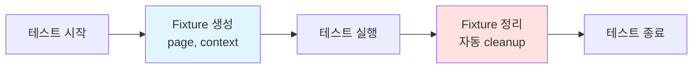
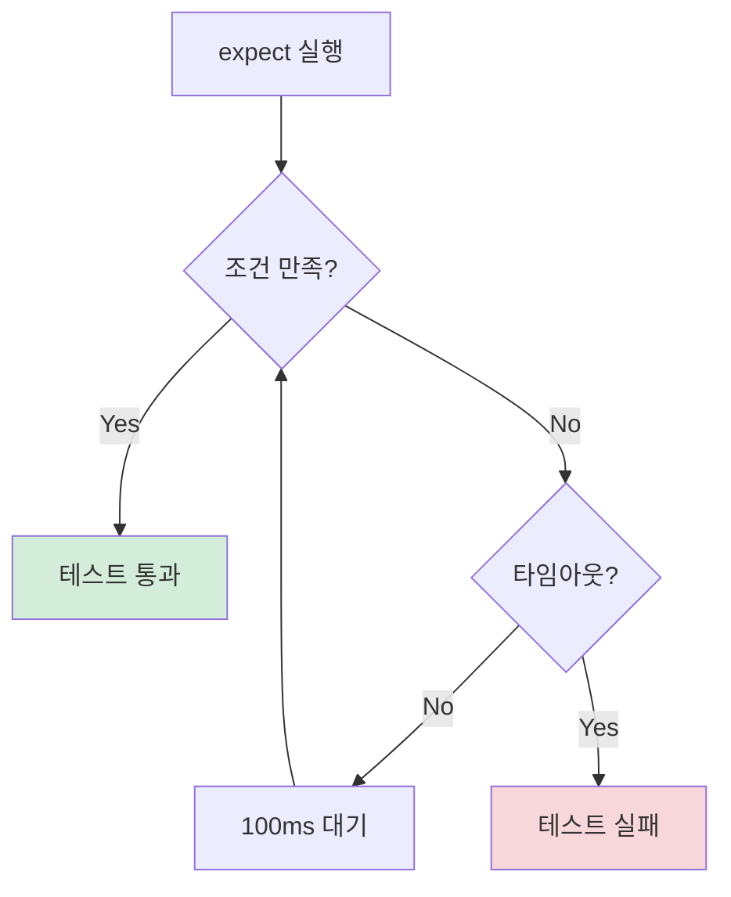
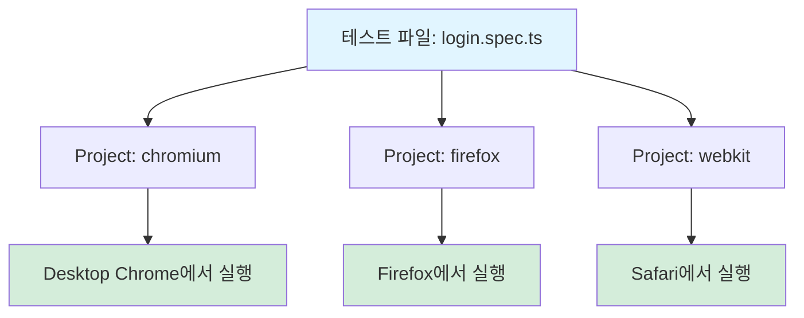
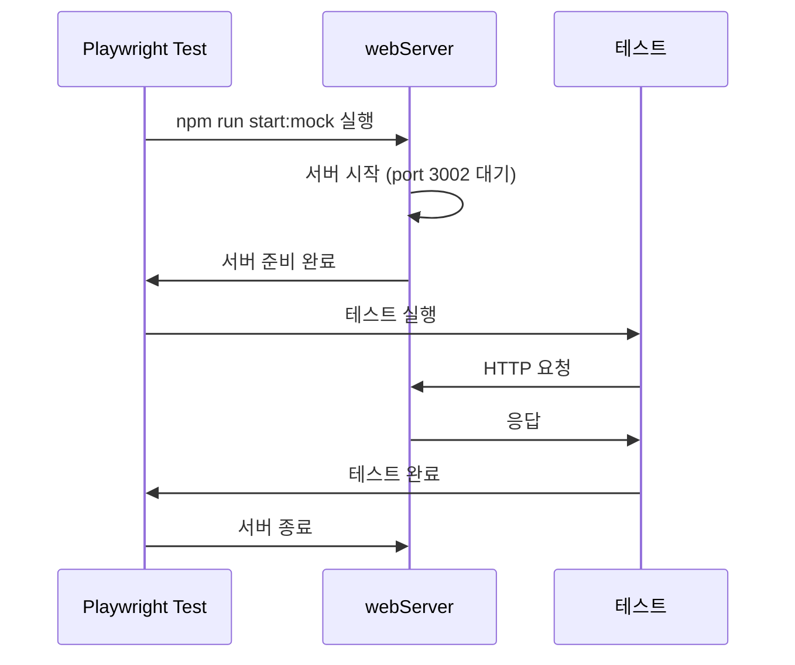
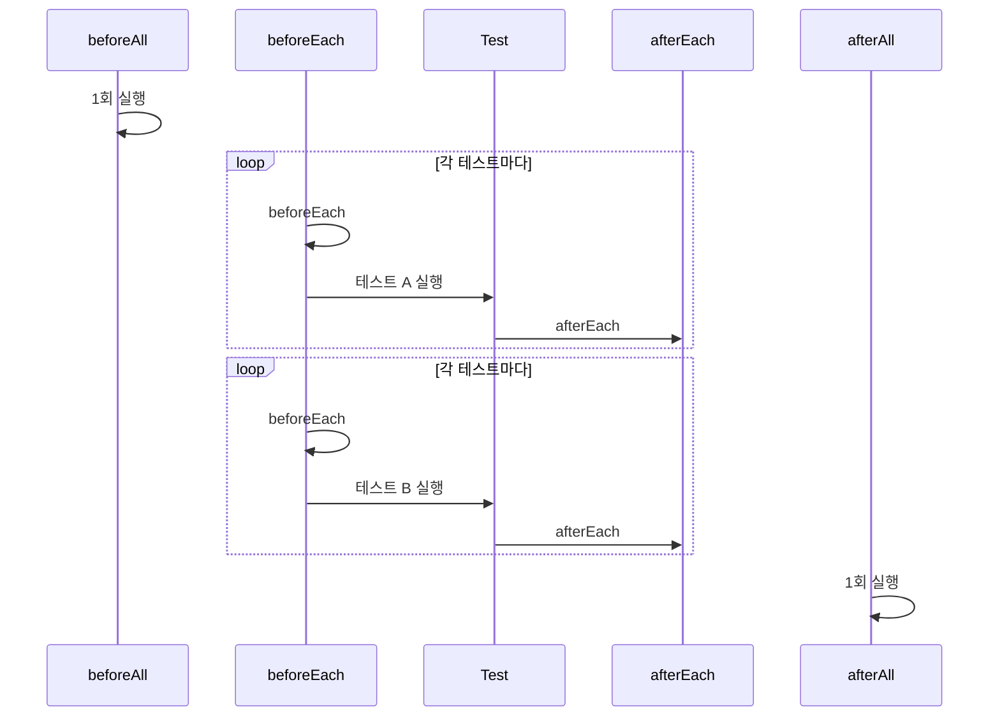
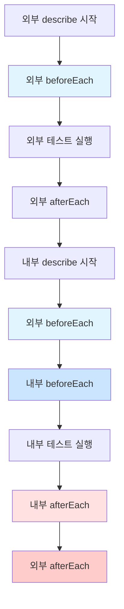
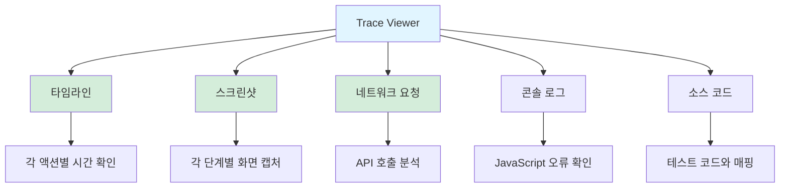
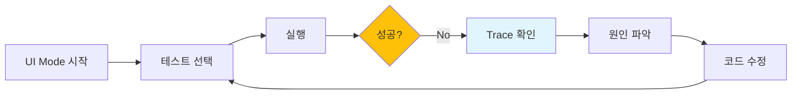
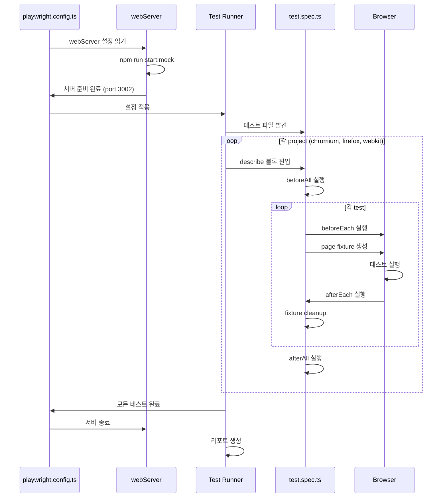

# 01. 설치와 첫 테스트 - 학습 (LEARN)

INVESTIGATE.md에서 탐구한 질문들에 대한 공식 설명과 패턴을 학습합니다.

---

## 학습 목표

이 문서를 학습한 후 다음을 할 수 있어야 합니다:

- Playwright Test의 기본 구조(test, expect, fixture)를 이해하고 설명할 수 있다
- playwright.config.ts의 주요 설정을 목적에 맞게 구성할 수 있다
- Hook(beforeEach, afterEach 등)을 활용해 테스트 코드를 효율적으로 작성할 수 있다

---

## 1. Playwright Test 구조 이해

### 1.1 test() 함수의 역할

Playwright Test는 **fixture 기반 테스트 러너**입니다. 각 테스트는 필요한 리소스(page, context, browser 등)를 fixture로 받습니다.

```typescript
import { test, expect } from '@playwright/test';

test('기본 구조', async ({ page }) => {
  // page: Playwright가 제공하는 fixture
  await page.goto('http://localhost:3002');
  await expect(page.locator('h1')).toHaveText('Welcome');
});
```

**핵심 개념**:
- `page`: 브라우저 탭을 나타내는 객체
- `context`: 여러 page를 포함하는 브라우저 컨텍스트
- `browser`: 브라우저 인스턴스

### 1.2 fixture란 무엇인가?

Fixture는 **테스트에 필요한 리소스를 자동으로 생성/정리**하는 메커니즘입니다.



**장점**:
1. **자동 정리**: 테스트 종료 시 브라우저 자동 종료
2. **격리**: 각 테스트는 독립적인 브라우저 컨텍스트 사용
3. **재사용**: 공통 설정을 fixture로 추출 가능

**예시: 기본 fixture**
```typescript
test('page fixture', async ({ page }) => {
  // page는 Playwright가 자동으로 생성
  console.log(typeof page); // 'object'
  // 테스트 종료 시 자동으로 정리됨
});
```

**예시: 커스텀 fixture**
```typescript
import { test as base } from '@playwright/test';

// 로그인된 사용자 fixture
const test = base.extend({
  authenticatedPage: async ({ page }, use) => {
    // Setup: 로그인 수행
    await page.goto('http://localhost:3002/login');
    await page.fill('#username', 'testuser');
    await page.fill('#password', 'password');
    await page.click('button[type="submit"]');

    // 테스트에 page 전달
    await use(page);

    // Teardown: 필요시 로그아웃
    // await page.click('#logout');
  },
});

// 사용
test('대시보드 접근', async ({ authenticatedPage }) => {
  await authenticatedPage.goto('http://localhost:3002/dashboard');
  await expect(authenticatedPage.locator('h1')).toHaveText('Dashboard');
});
```

### 1.3 expect()와 자동 재시도

Playwright의 `expect()`는 **비동기 assertion**을 지원하며, 조건이 만족될 때까지 자동으로 재시도합니다.

```typescript
// ❌ 일반 assertion (재시도 없음)
const text = await page.locator('h1').textContent();
expect(text).toBe('Hello'); // 즉시 검증

// ✅ Playwright assertion (자동 재시도)
await expect(page.locator('h1')).toHaveText('Hello');
// 기본 5초간 재시도하며 요소를 기다림
```

**내부 동작**:


**타임아웃 설정**:
```typescript
// 전역 설정 (playwright.config.ts)
export default defineConfig({
  expect: {
    timeout: 10000, // 10초
  },
});

// 개별 설정
await expect(page.locator('.slow-element')).toBeVisible({ timeout: 15000 });
```

**주요 assertion**:
```typescript
// 가시성
await expect(page.locator('#button')).toBeVisible();
await expect(page.locator('#hidden')).toBeHidden();

// 텍스트
await expect(page.locator('h1')).toHaveText('Hello');
await expect(page.locator('h1')).toContainText('Hel');

// 속성
await expect(page.locator('input')).toHaveValue('test');
await expect(page.locator('button')).toBeDisabled();

// 개수
await expect(page.locator('.item')).toHaveCount(5);
```

---

## 2. playwright.config.ts 해부

### 2.1 파일 구조 개요

```typescript
import { defineConfig, devices } from '@playwright/test';

export default defineConfig({
  // 1. 테스트 파일 위치
  testDir: './tests',
  testMatch: '**/*.spec.ts',

  // 2. 실행 설정
  fullyParallel: true,
  workers: process.env.CI ? 1 : undefined,
  retries: process.env.CI ? 2 : 0,

  // 3. 리포팅
  reporter: [['html'], ['list']],

  // 4. 공통 설정
  use: {
    baseURL: 'http://localhost:3002',
    trace: 'on-first-retry',
  },

  // 5. 브라우저별 설정
  projects: [
    { name: 'chromium', use: { ...devices['Desktop Chrome'] } },
  ],

  // 6. 개발 서버
  webServer: {
    command: 'npm run start:mock',
    port: 3002,
  },
});
```

### 2.2 projects: 멀티 브라우저 테스트

```typescript
projects: [
  // 데스크톱 브라우저
  {
    name: 'chromium',
    use: { ...devices['Desktop Chrome'] },
  },
  {
    name: 'firefox',
    use: { ...devices['Desktop Firefox'] },
  },
  {
    name: 'webkit',
    use: { ...devices['Desktop Safari'] },
  },

  // 모바일 브라우저
  {
    name: 'Mobile Chrome',
    use: { ...devices['Pixel 5'] },
  },
  {
    name: 'Mobile Safari',
    use: { ...devices['iPhone 13'] },
  },
],
```

**동작 방식**:


**선택적 실행**:
```bash
# 특정 프로젝트만
npx playwright test --project=chromium

# 여러 프로젝트
npx playwright test --project=chromium --project=firefox
```

### 2.3 use: 공통 옵션

```typescript
use: {
  // 기본 URL (상대 경로 사용 가능)
  baseURL: 'http://localhost:3002',

  // Trace 기록 (디버깅용)
  trace: 'on-first-retry', // 'on' | 'off' | 'retain-on-failure'

  // 스크린샷
  screenshot: 'only-on-failure', // 'on' | 'off'

  // 비디오 녹화
  video: 'retain-on-failure', // 'on' | 'off'

  // 뷰포트 크기
  viewport: { width: 1280, height: 720 },

  // 사용자 에이전트
  userAgent: 'My Custom User Agent',

  // 로케일 및 타임존
  locale: 'ko-KR',
  timezoneId: 'Asia/Seoul',
}
```

**baseURL 사용 예시**:
```typescript
// playwright.config.ts
use: { baseURL: 'http://localhost:3002' }

// 테스트 코드
test('relative path', async ({ page }) => {
  await page.goto('/dashboard'); // http://localhost:3002/dashboard
  await page.goto('/users/123'); // http://localhost:3002/users/123
});
```

**trace 옵션 비교**:
| 옵션 | 설명 | 사용 시기 |
|------|------|----------|
| `on` | 항상 기록 | 디버깅 중 |
| `off` | 기록 안 함 | 운영 환경 |
| `on-first-retry` | 재시도 시만 기록 | **권장** (CI) |
| `retain-on-failure` | 실패 시만 유지 | 로컬 개발 |

### 2.4 webServer: 자동 서버 시작

```typescript
webServer: {
  command: 'npm run start:mock',
  port: 3002,
  timeout: 120 * 1000, // 2분
  reuseExistingServer: !process.env.CI,
}
```

**동작 흐름**:


**reuseExistingServer 옵션**:
```typescript
// 로컬 개발: 이미 실행 중인 서버 재사용
reuseExistingServer: !process.env.CI

// CI 환경: 항상 새 서버 시작
// (process.env.CI가 true이므로 reuseExistingServer는 false)
```

### 2.5 reporter: 테스트 결과 리포팅

```typescript
reporter: [
  ['html', { outputFolder: 'playwright-report' }],
  ['list'],
  ['json', { outputFile: 'test-results.json' }],
  ['junit', { outputFile: 'junit.xml' }],
]
```

**리포터 종류**:
| 리포터 | 출력 형식 | 사용 시기 |
|--------|----------|----------|
| `html` | HTML 대시보드 | 로컬 개발, 시각적 확인 |
| `list` | 콘솔 출력 (실시간) | 로컬 개발, CI 로그 |
| `json` | JSON 파일 | CI/CD, 자동화 파싱 |
| `junit` | JUnit XML | Jenkins, GitLab CI |
| `dot` | 간단한 점 표시 | 빠른 확인 |

**HTML 리포트 열기**:
```bash
npx playwright test
npx playwright show-report
```

---

## 3. 첫 테스트 작성

### 3.1 기본 Navigation 테스트

```typescript
import { test, expect } from '@playwright/test';

test.describe('홈페이지 테스트', () => {
  test('페이지 로드 및 제목 확인', async ({ page }) => {
    // Given: 홈페이지로 이동
    await page.goto('http://localhost:3002');

    // When: 페이지가 로드됨

    // Then: 제목 확인
    await expect(page).toHaveTitle(/Playwright PoC/);
    await expect(page.locator('h1')).toHaveText('Welcome to Playwright');
  });

  test('링크 클릭 및 네비게이션', async ({ page }) => {
    await page.goto('http://localhost:3002');

    // 링크 클릭
    await page.click('a:has-text("About")');

    // URL 변경 확인
    await expect(page).toHaveURL('http://localhost:3002/about');

    // 새 페이지 내용 확인
    await expect(page.locator('h1')).toHaveText('About Us');
  });
});
```

### 3.2 Assertion 패턴

```typescript
test('다양한 assertion', async ({ page }) => {
  await page.goto('http://localhost:3002/form');

  // 요소 존재 확인
  await expect(page.locator('#username')).toBeVisible();

  // 입력 값 확인
  await page.fill('#username', 'testuser');
  await expect(page.locator('#username')).toHaveValue('testuser');

  // CSS 클래스 확인
  await expect(page.locator('.submit-button')).toHaveClass(/active/);

  // 개수 확인
  await expect(page.locator('.list-item')).toHaveCount(5);

  // 배열 확인 (여러 요소의 텍스트)
  const items = page.locator('.list-item');
  await expect(items).toHaveText(['Item 1', 'Item 2', 'Item 3']);
});
```

### 3.3 baseURL 활용

```typescript
// playwright.config.ts
use: { baseURL: 'http://localhost:3002' }

// 테스트 코드
test('baseURL 사용', async ({ page }) => {
  await page.goto('/'); // http://localhost:3002/
  await page.goto('/about'); // http://localhost:3002/about
  await page.goto('/users/123'); // http://localhost:3002/users/123
});
```

---

## 4. Hook과 Fixture

### 4.1 Hook 실행 순서

```typescript
test.describe('사용자 관리', () => {
  test.beforeAll(async ({ browser }) => {
    console.log('1. beforeAll - 한 번만 실행');
    // 데이터베이스 초기화 등
  });

  test.beforeEach(async ({ page }) => {
    console.log('2. beforeEach - 각 테스트 전 실행');
    await page.goto('/users');
  });

  test('테스트 A', async ({ page }) => {
    console.log('3. 테스트 A 실행');
  });

  test('테스트 B', async ({ page }) => {
    console.log('4. 테스트 B 실행');
  });

  test.afterEach(async ({ page }) => {
    console.log('5. afterEach - 각 테스트 후 실행');
  });

  test.afterAll(async () => {
    console.log('6. afterAll - 마지막에 한 번 실행');
  });
});
```

**실행 순서**:


**출력 예시**:
```
1. beforeAll - 한 번만 실행
2. beforeEach - 각 테스트 전 실행
3. 테스트 A 실행
5. afterEach - 각 테스트 후 실행
2. beforeEach - 각 테스트 전 실행
4. 테스트 B 실행
5. afterEach - 각 테스트 후 실행
6. afterAll - 마지막에 한 번 실행
```

### 4.2 중첩된 describe의 Hook 순서

```typescript
test.describe('외부 describe', () => {
  test.beforeEach(async () => {
    console.log('외부 beforeEach');
  });

  test('외부 테스트', async () => {
    console.log('외부 테스트');
  });

  test.describe('내부 describe', () => {
    test.beforeEach(async () => {
      console.log('내부 beforeEach');
    });

    test('내부 테스트', async () => {
      console.log('내부 테스트');
    });

    test.afterEach(async () => {
      console.log('내부 afterEach');
    });
  });

  test.afterEach(async () => {
    console.log('외부 afterEach');
  });
});
```

**실행 순서 다이어그램**:


**출력 예시**:
```
외부 beforeEach
외부 테스트
외부 afterEach

외부 beforeEach
내부 beforeEach
내부 테스트
내부 afterEach
외부 afterEach
```

**규칙**:
- beforeEach: **부모 → 자식** 순서
- afterEach: **자식 → 부모** 순서 (역순)

### 4.3 Hook 활용 패턴

**패턴 1: 공통 설정**
```typescript
test.describe('대시보드 테스트', () => {
  test.beforeEach(async ({ page }) => {
    // 모든 테스트에서 로그인 필요
    await page.goto('/login');
    await page.fill('#username', 'testuser');
    await page.fill('#password', 'password');
    await page.click('button[type="submit"]');

    // 대시보드로 이동
    await page.goto('/dashboard');
  });

  test('위젯 표시', async ({ page }) => {
    // 이미 로그인되어 있음
    await expect(page.locator('.widget')).toBeVisible();
  });

  test('사용자 정보', async ({ page }) => {
    // 이미 로그인되어 있음
    await expect(page.locator('.user-info')).toContainText('testuser');
  });
});
```

**패턴 2: 데이터 정리**
```typescript
test.describe('게시글 관리', () => {
  let createdPostId: string;

  test('게시글 생성', async ({ page }) => {
    await page.goto('/posts/new');
    await page.fill('#title', 'Test Post');
    await page.click('button:has-text("Submit")');

    // ID 저장
    const url = page.url();
    createdPostId = url.split('/').pop()!;
  });

  test.afterEach(async ({ request }) => {
    // 생성된 게시글 삭제
    if (createdPostId) {
      await request.delete(`/api/posts/${createdPostId}`);
    }
  });
});
```

**패턴 3: 테스트 격리**
```typescript
test.describe('장바구니 테스트', () => {
  test.beforeEach(async ({ page, context }) => {
    // 각 테스트마다 쿠키 초기화
    await context.clearCookies();

    // 로컬 스토리지 초기화
    await page.goto('/');
    await page.evaluate(() => localStorage.clear());
  });

  test('빈 장바구니', async ({ page }) => {
    await page.goto('/cart');
    await expect(page.locator('.cart-item')).toHaveCount(0);
  });

  test('상품 추가', async ({ page }) => {
    await page.goto('/products/1');
    await page.click('button:has-text("Add to Cart")');
    await page.goto('/cart');
    await expect(page.locator('.cart-item')).toHaveCount(1);
  });
});
```

### 4.4 커스텀 Fixture

**기본 구조**:
```typescript
import { test as base } from '@playwright/test';

type MyFixtures = {
  authenticatedPage: Page;
  adminPage: Page;
};

const test = base.extend<MyFixtures>({
  authenticatedPage: async ({ page }, use) => {
    // Setup
    await page.goto('/login');
    await page.fill('#username', 'user');
    await page.fill('#password', 'pass');
    await page.click('button[type="submit"]');

    // 테스트에 전달
    await use(page);

    // Teardown (필요시)
    await page.click('#logout');
  },

  adminPage: async ({ page }, use) => {
    // 관리자 로그인
    await page.goto('/login');
    await page.fill('#username', 'admin');
    await page.fill('#password', 'admin123');
    await page.click('button[type="submit"]');

    await use(page);
  },
});

export { test, expect };
```

**사용 예시**:
```typescript
import { test, expect } from './fixtures';

test('일반 사용자 테스트', async ({ authenticatedPage }) => {
  await authenticatedPage.goto('/dashboard');
  await expect(authenticatedPage.locator('h1')).toHaveText('User Dashboard');
});

test('관리자 테스트', async ({ adminPage }) => {
  await adminPage.goto('/admin');
  await expect(adminPage.locator('h1')).toHaveText('Admin Panel');
});
```

**복잡한 Fixture 예시**:
```typescript
const test = base.extend({
  // API 토큰 fixture
  apiToken: async ({}, use) => {
    const token = await getAuthToken();
    await use(token);
    await revokeToken(token);
  },

  // 테스트 데이터 fixture
  testUser: async ({ request }, use) => {
    const user = await request.post('/api/users', {
      data: { name: 'Test User', email: 'test@example.com' },
    });
    const userData = await user.json();

    await use(userData);

    // 테스트 후 정리
    await request.delete(`/api/users/${userData.id}`);
  },
});
```

---

## 5. 디버깅 도구

### 5.1 Headed Mode (브라우저 UI 보기)

```bash
# 기본 (headless)
npx playwright test

# headed mode (브라우저 보이게)
npx playwright test --headed

# 특정 브라우저
npx playwright test --headed --project=chromium
```

### 5.2 Debug Mode (단계별 실행)

```bash
# 디버그 모드 시작
npx playwright test --debug

# 특정 테스트만 디버그
npx playwright test login.spec.ts --debug
```

**사용 방법**:
1. Playwright Inspector 창이 열림
2. Step over (다음 단계)
3. Resume (계속 실행)
4. Pause (일시 정지)

**코드에서 디버깅 포인트 설정**:
```typescript
test('디버깅', async ({ page }) => {
  await page.goto('/');

  // 이 시점에서 일시 정지
  await page.pause();

  await page.click('button');
});
```

### 5.3 Trace Viewer (타임라인 분석)

**Trace 기록 설정**:
```typescript
// playwright.config.ts
use: {
  trace: 'on-first-retry', // 재시도 시 기록
}
```

**Trace 열기**:
```bash
# 최신 trace 열기
npx playwright show-trace

# 특정 trace 파일 열기
npx playwright show-trace test-results/login-chromium/trace.zip
```

**Trace Viewer 기능**:


**활용 예시**:
1. **느린 테스트 분석**: 어느 단계에서 시간이 오래 걸리는지 확인
2. **네트워크 오류**: API 호출 실패 원인 파악
3. **타이밍 이슈**: 요소가 나타나기 전에 클릭하는 문제 발견

### 5.4 UI Mode (대화형 테스트 실행)

```bash
npx playwright test --ui
```

**기능**:
- 테스트 목록 보기
- 개별 테스트 실행/중지
- 실시간 브라우저 확인
- Trace Viewer 통합
- 타임 트래블 (특정 시점으로 이동)

**사용 시나리오**:


### 5.5 스크린샷 및 비디오

**자동 캡처 설정**:
```typescript
// playwright.config.ts
use: {
  screenshot: 'only-on-failure',
  video: 'retain-on-failure',
}
```

**수동 스크린샷**:
```typescript
test('스크린샷 예시', async ({ page }) => {
  await page.goto('/');

  // 전체 페이지
  await page.screenshot({ path: 'screenshot.png' });

  // 특정 요소만
  await page.locator('.header').screenshot({ path: 'header.png' });

  // 전체 스크롤 포함
  await page.screenshot({ path: 'full-page.png', fullPage: true });
});
```

**비디오 위치**:
```
test-results/
  login-chromium/
    video.webm
    trace.zip
```

---

## 실습 예제

### 예제 1: Mock 서버 테스트

```typescript
import { test, expect } from '@playwright/test';

test.describe('Mock 서버 테스트', () => {
  test.beforeEach(async ({ page }) => {
    await page.goto('http://localhost:3002');
  });

  test('홈페이지 제목 확인', async ({ page }) => {
    await expect(page.locator('h1')).toHaveText('Playwright PoC');
  });

  test('사용자 목록 조회', async ({ page }) => {
    await page.goto('http://localhost:3002/users');

    // 로딩 후 사용자 카드 확인
    await expect(page.locator('.user-card')).toHaveCount(3);

    // 첫 번째 사용자 정보
    const firstUser = page.locator('.user-card').first();
    await expect(firstUser.locator('.name')).toContainText('John');
  });

  test('검색 기능', async ({ page }) => {
    await page.goto('http://localhost:3002/search');

    await page.fill('#search-input', 'playwright');
    await page.click('button:has-text("Search")');

    // 결과 확인
    await expect(page.locator('.search-result')).toBeVisible();
  });
});
```

### 예제 2: 폼 제출

```typescript
test.describe('폼 테스트', () => {
  test('로그인 성공', async ({ page }) => {
    await page.goto('http://localhost:3002/login');

    // 폼 입력
    await page.fill('#username', 'testuser');
    await page.fill('#password', 'password123');

    // 제출
    await page.click('button[type="submit"]');

    // 리다이렉트 확인
    await expect(page).toHaveURL(/.*dashboard/);

    // 환영 메시지 확인
    await expect(page.locator('.welcome-message'))
      .toHaveText('Welcome, testuser!');
  });

  test('로그인 실패 - 빈 필드', async ({ page }) => {
    await page.goto('http://localhost:3002/login');

    // 빈 상태로 제출
    await page.click('button[type="submit"]');

    // 에러 메시지 확인
    await expect(page.locator('.error-message'))
      .toHaveText('Username is required');
  });
});
```

### 예제 3: 네비게이션

```typescript
test.describe('네비게이션 테스트', () => {
  test('페이지 이동', async ({ page }) => {
    await page.goto('http://localhost:3002');

    // About 페이지로 이동
    await page.click('a:has-text("About")');
    await expect(page).toHaveURL(/.*about/);
    await expect(page.locator('h1')).toHaveText('About Us');

    // 뒤로 가기
    await page.goBack();
    await expect(page).toHaveURL('http://localhost:3002/');

    // 앞으로 가기
    await page.goForward();
    await expect(page).toHaveURL(/.*about/);
  });
});
```

---

## 테스트 라이프사이클 전체 흐름



---

## 다음 단계

1. **practice/ 폴더**에서 실습 코드 작성
2. **02-locators-dynamic-content**로 이동하여 Locator 학습
3. Mock 서버를 활용한 다양한 시나리오 테스트 작성

**핵심 체크리스트**:
- [ ] test()와 expect()의 기본 구조 이해
- [ ] playwright.config.ts 주요 설정 파악
- [ ] Hook 실행 순서 숙지
- [ ] 커스텀 fixture 작성 가능
- [ ] 디버깅 도구(Trace Viewer, UI Mode) 사용법 파악

---

## 참고 자료

- [Playwright 공식 문서](https://playwright.dev)
- [Playwright Test API](https://playwright.dev/docs/api/class-test)
- [Playwright Config](https://playwright.dev/docs/test-configuration)
- Mock 서버: `http://localhost:3002`
