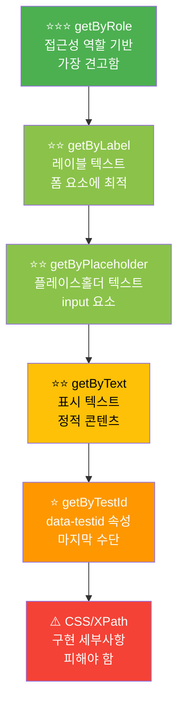
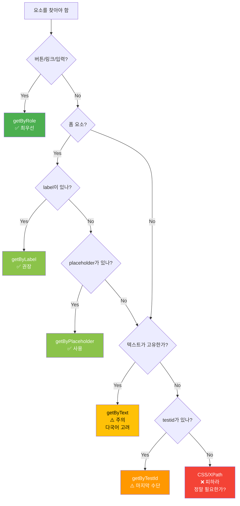

# 02. 로케이터와 동적 콘텐츠 - 학습 (LEARN)

**작성일**: 2026-02-05
**학습 목표**: Playwright의 견고한 로케이터 전략과 동적 콘텐츠 처리 방법 습득
**예상 학습 시간**: 90분

---

## 학습 목표

이 섹션을 완료하면 다음을 할 수 있습니다:

1. **로케이터 우선순위 피라미드**를 이해하고 상황별로 최적의 로케이터 선택
2. **getBy*** 메서드 7종을 상황에 맞게 사용
3. **필터링과 체이닝**으로 복잡한 요소 정확히 타겟팅
4. **다이얼로그(alert/confirm/prompt)** 자동화
5. **iframe과 Shadow DOM** 요소 접근
6. **동적 콘텐츠 대기 패턴** 적용

---

## 1. 로케이터 전략 피라미드

Playwright는 사용자 관점에서 요소를 찾는 것을 권장합니다. 구현 세부사항(CSS 클래스, DOM 구조)에 의존하지 않습니다.



### 우선순위 원칙

| 우선순위 | 로케이터 | 사용 이유 | 언제 사용? |
|---------|---------|----------|-----------|
| **1순위** | `getByRole` | 접근성 기반, 가장 견고 | 버튼, 링크, 입력 등 역할이 명확한 요소 |
| **2순위** | `getByLabel` | 사용자가 보는 레이블 | 폼 input과 연결된 label |
| **2순위** | `getByPlaceholder` | 사용자가 보는 힌트 | 레이블이 없는 input |
| **2순위** | `getByText` | 사용자가 보는 텍스트 | 링크, 단락, div 텍스트 |
| **3순위** | `getByTestId` | 개발자가 지정한 ID | 위 방법으로 찾을 수 없을 때 |
| **최후** | CSS/XPath | 구현 세부사항 의존 | 정말 다른 방법이 없을 때만 |

---

## 2. getBy* 메서드 상세

### 2.1 getByRole (최우선 권장)

접근성 역할(ARIA role)을 기반으로 요소를 찾습니다. 스크린 리더가 인식하는 방식과 동일합니다.

```typescript
// TPS 티켓 등록 버튼
await page.getByRole('button', { name: '등록(CI/CD)' }).click();

// 주 내비게이션 링크
await page.getByRole('link', { name: '티켓 목록' }).click();

// 검색 입력 (textbox 역할)
await page.getByRole('textbox', { name: '검색어' }).fill('CI/CD');

// 체크박스
await page.getByRole('checkbox', { name: '완료된 항목 포함' }).check();

// 선택 박스
await page.getByRole('combobox', { name: '상태' }).selectOption('진행 중');

// 테이블 셀
const cell = page.getByRole('cell', { name: 'TPS-1234' });
```

**주요 역할(role) 종류**:
- `button` - 버튼
- `link` - 링크
- `textbox` - 입력 필드
- `checkbox` - 체크박스
- `radio` - 라디오 버튼
- `combobox` - 셀렉트 박스
- `heading` - 제목 (level 옵션으로 h1-h6 구분)
- `row`, `cell` - 테이블 행/셀
- `dialog` - 모달 다이얼로그

**TPS 실전 예시**:
```typescript
// TPS 티켓 상세 페이지
await page.goto('http://localhost:3002/ticket/123');

// heading level 1 (h1 태그)
await expect(page.getByRole('heading', { level: 1 })).toHaveText('[TPS-123] CI/CD 파이프라인 구축');

// 작업 시간 입력
await page.getByRole('textbox', { name: '작업 시간(h)' }).fill('2');

// 저장 버튼
await page.getByRole('button', { name: '저장' }).click();
```

**장점**:
- 접근성 표준을 따르므로 가장 견고합니다.
- DOM 구조가 변경되어도 역할과 이름만 유지되면 작동합니다.
- 스크린 리더 사용자에게도 잘 작동하는 UI를 보장합니다.

---

### 2.2 getByLabel (폼 요소에 최적)

`<label>` 태그와 연결된 폼 요소를 찾습니다.

```typescript
// HTML: <label for="title">제목</label><input id="title" />
await page.getByLabel('제목').fill('CI/CD 구축 작업');

// HTML: <label>담당자 <input /></label>
await page.getByLabel('담당자').fill('홍길동');

// TPS 티켓 필터 폼
await page.getByLabel('상태').selectOption('진행 중');
await page.getByLabel('담당자').fill('홍길동');
await page.getByLabel('시작일').fill('2026-02-01');
```

**장점**:
- 사용자가 폼을 채울 때와 동일한 방식으로 요소를 찾습니다.
- label 텍스트만 유지되면 input의 id/name이 변경되어도 작동합니다.

---

### 2.3 getByPlaceholder (레이블 없는 input)

placeholder 속성으로 입력 필드를 찾습니다.

```typescript
// HTML: <input placeholder="검색어를 입력하세요" />
await page.getByPlaceholder('검색어를 입력하세요').fill('CI/CD');

// TPS 티켓 검색
await page.getByPlaceholder('티켓 번호 또는 제목').fill('TPS-123');
```

**사용 시점**:
- label이 없는 검색창
- 간단한 인라인 입력 필드

---

### 2.4 getByText (표시 텍스트로 찾기)

화면에 표시된 텍스트로 요소를 찾습니다.

```typescript
// 정확한 텍스트 매칭
await page.getByText('완료').click();

// 부분 매칭 (정규식)
await page.getByText(/CI\/CD/).click();

// TPS 티켓 상태 배지 찾기
const badge = page.getByText('진행 중');
await expect(badge).toBeVisible();

// 여러 개 중 특정 요소
await page.getByText('삭제').nth(0).click(); // 첫 번째 "삭제" 버튼
```

**주의사항**:
- 텍스트가 변경되면 테스트가 깨집니다. (다국어 지원 시 문제)
- 동일한 텍스트가 여러 개 있을 때 모호할 수 있습니다.

---

### 2.5 getByTestId (마지막 수단)

`data-testid` 속성으로 요소를 찾습니다.

```typescript
// HTML: <button data-testid="submit-ticket-btn">등록</button>
await page.getByTestId('submit-ticket-btn').click();

// TPS 티켓 테이블
const table = page.getByTestId('ticket-table');
await expect(table).toBeVisible();
```

**언제 사용?**:
- 위 방법으로 찾을 수 없는 요소
- 동적으로 생성되는 복잡한 UI
- 역할이나 텍스트가 자주 변경되는 요소

**단점**:
- 프로덕션 코드에 테스트 전용 속성 추가
- 개발자가 의도적으로 관리해야 함

---

### 2.6 getByAltText (이미지)

`alt` 속성으로 이미지를 찾습니다.

```typescript
// HTML: 
await page.getByAltText('프로필 사진').click();
```

---

### 2.7 getByTitle (툴팁)

`title` 속성으로 요소를 찾습니다.

```typescript
// HTML: <button title="티켓 삭제">🗑️</button>
await page.getByTitle('티켓 삭제').click();
```

---

## 3. 필터링과 체이닝

복잡한 UI에서 정확한 요소를 타겟팅하는 방법입니다.

### 3.1 filter() - 조건으로 필터링

```typescript
// TPS 티켓 목록: "진행 중" 상태의 행만 필터링
const rows = page.getByRole('row');
const inProgressRows = rows.filter({ hasText: '진행 중' });

// 첫 번째 진행 중 티켓 클릭
await inProgressRows.first().getByRole('link').click();

// 특정 요소를 포함하는 행 필터링
const cicdTickets = rows.filter({
  has: page.getByText('CI/CD')
});

// 여러 조건 결합
const urgentInProgress = rows
  .filter({ hasText: '진행 중' })
  .filter({ hasText: '긴급' });
```

**TPS 실전 예시**:
```typescript
// 시나리오: "홍길동"이 담당하는 "진행 중" 티켓 찾기
const myTickets = page
  .getByRole('row')
  .filter({ hasText: '홍길동' })
  .filter({ hasText: '진행 중' });

// 개수 확인
await expect(myTickets).toHaveCount(3);

// 첫 번째 티켓의 제목 확인
const firstTitle = myTickets.first().getByRole('cell').nth(1);
await expect(firstTitle).toHaveText(/TPS-\d+/);
```

---

### 3.2 nth(), first(), last() - 순서로 선택

```typescript
// TPS 티켓 목록
const tickets = page.getByRole('row');

// 첫 번째 티켓 (헤더 제외)
await tickets.nth(1).click(); // nth(0)은 헤더

// 또는
await tickets.first().click();

// 마지막 티켓
await tickets.last().click();

// 3번째 티켓
await tickets.nth(2).click();

// 실전: 두 번째 완료 티켓의 작업 시간 확인
const completedTickets = tickets.filter({ hasText: '완료' });
const workTime = completedTickets.nth(1).getByRole('cell').nth(5);
await expect(workTime).toHaveText('3h');
```

---

### 3.3 locator().locator() - 중첩 탐색

```typescript
// TPS 티켓 상세: 코멘트 섹션에서 첫 번째 답글의 삭제 버튼
const commentSection = page.locator('.comment-section');
const firstComment = commentSection.locator('.comment-item').first();
const deleteBtn = firstComment.getByRole('button', { name: '삭제' });

await deleteBtn.click();

// 또는 체이닝
await page
  .locator('.comment-section')
  .locator('.comment-item')
  .first()
  .getByRole('button', { name: '삭제' })
  .click();
```

---

## 4. 다이얼로그 처리

JavaScript의 `alert()`, `confirm()`, `prompt()`를 자동화합니다.

### 4.1 기본 패턴

```typescript
test('티켓 삭제 확인 다이얼로그', async ({ page }) => {
  await page.goto('http://localhost:3002/ticket/123');

  // 다이얼로그 이벤트 핸들러 등록 (클릭 전에!)
  page.on('dialog', async (dialog) => {
    console.log('타입:', dialog.type()); // 'alert', 'confirm', 'prompt'
    console.log('메시지:', dialog.message());

    // 다이얼로그 승인
    await dialog.accept();
  });

  // 삭제 버튼 클릭 → confirm 다이얼로그 발생
  await page.getByRole('button', { name: '삭제' }).click();

  // 검증: 목록 페이지로 이동
  await expect(page).toHaveURL('http://localhost:3002/ticket-list');
});
```

### 4.2 다이얼로그 타입별 처리

```typescript
// alert - 확인만 가능
page.on('dialog', async (dialog) => {
  expect(dialog.type()).toBe('alert');
  expect(dialog.message()).toBe('저장되었습니다.');
  await dialog.accept();
});

// confirm - 확인/취소
page.on('dialog', async (dialog) => {
  expect(dialog.type()).toBe('confirm');
  expect(dialog.message()).toBe('정말 삭제하시겠습니까?');

  // 확인 클릭
  await dialog.accept();

  // 또는 취소 클릭
  // await dialog.dismiss();
});

// prompt - 사용자 입력
page.on('dialog', async (dialog) => {
  expect(dialog.type()).toBe('prompt');
  expect(dialog.message()).toBe('작업 시간을 입력하세요:');

  // 입력값 전달
  await dialog.accept('2.5');
});
```

### 4.3 TPS 실전 예시

```typescript
test('TPS 티켓 작업 시간 입력 (prompt)', async ({ page }) => {
  await page.goto('http://localhost:3002/ticket/123');

  // prompt 핸들러
  page.on('dialog', async (dialog) => {
    if (dialog.type() === 'prompt') {
      // 메시지 검증
      expect(dialog.message()).toContain('작업 시간');

      // 2시간 입력
      await dialog.accept('2');
    }
  });

  // "작업 시간 기록" 버튼 클릭
  await page.getByRole('button', { name: '작업 시간 기록' }).click();

  // 검증: 시간이 기록되었는지 확인
  await expect(page.getByText('총 작업 시간: 2h')).toBeVisible();
});
```

---

## 5. iframe과 Shadow DOM

### 5.1 iframe 접근

iframe은 별도의 문서 컨텍스트를 가지므로 `frameLocator()`를 사용합니다.

```typescript
// HTML: <iframe id="embedded-form" src="..."></iframe>
const frame = page.frameLocator('#embedded-form');

// iframe 내부 요소 접근
await frame.getByLabel('이름').fill('홍길동');
await frame.getByRole('button', { name: 'Submit' }).click();

// TPS 실전: 외부 서비스 임베디드 폼
test('외부 작업 시간 입력 폼 (iframe)', async ({ page }) => {
  await page.goto('http://localhost:3002/ticket/123');

  // iframe 안의 작업 시간 폼
  const timeTrackingFrame = page.frameLocator('#time-tracking-iframe');

  await timeTrackingFrame.getByLabel('시작 시간').fill('09:00');
  await timeTrackingFrame.getByLabel('종료 시간').fill('11:00');
  await timeTrackingFrame.getByRole('button', { name: '제출' }).click();

  // 부모 페이지로 돌아와서 검증
  await expect(page.getByText('2시간 기록됨')).toBeVisible();
});
```

**중첩된 iframe**:
```typescript
const outerFrame = page.frameLocator('#outer-iframe');
const innerFrame = outerFrame.frameLocator('#inner-iframe');
await innerFrame.getByText('Click me').click();
```

---

### 5.2 Shadow DOM 접근

Playwright는 Shadow DOM을 자동으로 관통합니다. 특별한 처리가 필요 없습니다!

```typescript
// HTML: <my-custom-element> #shadow-root <button>Click</button> </my-custom-element>

// ✅ 자동으로 Shadow DOM 내부 접근
await page.getByRole('button', { name: 'Click' }).click();

// 수동 접근이 필요한 경우 (레거시)
const shadowHost = page.locator('my-custom-element');
const shadowButton = shadowHost.locator('button');
await shadowButton.click();
```

**TPS 예시** (Web Components 사용 시):
```typescript
// 커스텀 티켓 카드 컴포넌트: <tps-ticket-card>
// Shadow DOM 내부에 버튼이 있어도 자동 접근
await page.getByRole('button', { name: '상세 보기' }).click();
```

---

## 6. 동적 콘텐츠 대기 패턴

Playwright는 자동으로 요소가 나타날 때까지 기다립니다. (Auto-wait)

### 6.1 자동 대기 (기본 동작)

```typescript
// 자동으로 버튼이 나타날 때까지 대기 (최대 30초)
await page.getByRole('button', { name: '등록' }).click();

// 요소가 보일 때까지 자동 대기
await expect(page.getByText('저장되었습니다')).toBeVisible();
```

### 6.2 명시적 대기 (필요한 경우)

```typescript
// 특정 시간 제한
await expect(page.getByText('로딩 중...')).toBeVisible({ timeout: 5000 });

// API 응답 대기
await page.waitForResponse(resp =>
  resp.url().includes('/api/tickets') && resp.status() === 200
);

// 네트워크 유휴 상태 대기
await page.waitForLoadState('networkidle');
```

### 6.3 TPS 실전: AJAX 로딩 대기

```typescript
test('TPS 티켓 목록 필터링 (AJAX)', async ({ page }) => {
  await page.goto('http://localhost:3002/ticket-list');

  // 상태 필터 변경
  await page.getByLabel('상태').selectOption('완료');

  // API 응답 대기
  await page.waitForResponse(resp =>
    resp.url().includes('/api/tickets?status=completed')
  );

  // 결과 검증
  const rows = page.getByRole('row').filter({ hasText: '완료' });
  await expect(rows).toHaveCount(5);

  // 또는 로딩 인디케이터 사라질 때까지 대기
  await expect(page.getByTestId('loading-spinner')).toBeHidden();
});
```

### 6.4 대기 패턴 비교

| 패턴 | 사용 시점 | 예시 |
|------|----------|------|
| **자동 대기** (기본) | 대부분의 경우 | `await page.click(...)` |
| **toBeVisible** | 요소 표시 확인 | `expect(locator).toBeVisible()` |
| **waitForResponse** | API 호출 대기 | `page.waitForResponse(/api/)` |
| **waitForLoadState** | 페이지 로딩 대기 | `page.waitForLoadState('load')` |

---

## 7. 종합 실전 예시: TPS 티켓 생성 플로우

```typescript
import { test, expect } from '@playwright/test';

test('TPS 신규 티켓 생성 전체 플로우', async ({ page }) => {
  // 1. 티켓 목록 페이지 이동
  await page.goto('http://localhost:3002/ticket-list');

  // 2. "새 티켓" 버튼 클릭
  await page.getByRole('button', { name: '새 티켓' }).click();

  // 3. 폼 작성 (getByLabel 사용)
  await page.getByLabel('제목').fill('[CI/CD] Jenkins 파이프라인 구축');
  await page.getByLabel('설명').fill('개발/스테이징 환경 자동 배포 설정');
  await page.getByLabel('담당자').selectOption('홍길동');
  await page.getByLabel('우선순위').selectOption('높음');

  // 4. 파일 첨부 (iframe 내부)
  const attachmentFrame = page.frameLocator('#attachment-uploader');
  await attachmentFrame.locator('input[type="file"]').setInputFiles('diagram.png');

  // 5. 등록 확인 다이얼로그 처리
  page.on('dialog', async (dialog) => {
    expect(dialog.message()).toBe('티켓을 등록하시겠습니까?');
    await dialog.accept();
  });

  // 6. 등록 버튼 클릭
  await page.getByRole('button', { name: '등록(CI/CD)' }).click();

  // 7. API 응답 대기
  await page.waitForResponse(resp =>
    resp.url().includes('/api/tickets') &&
    resp.request().method() === 'POST'
  );

  // 8. 성공 메시지 확인
  await expect(page.getByText('티켓이 생성되었습니다')).toBeVisible({ timeout: 3000 });

  // 9. 상세 페이지로 이동했는지 확인
  await expect(page).toHaveURL(/\/ticket\/\d+/);

  // 10. 제목이 올바르게 표시되는지 확인 (getByRole heading)
  await expect(
    page.getByRole('heading', { level: 1 })
  ).toContainText('[CI/CD] Jenkins 파이프라인 구축');

  // 11. 목록으로 돌아가기
  await page.getByRole('link', { name: '목록으로' }).click();

  // 12. 새 티켓이 목록 첫 번째에 있는지 확인
  const firstTicket = page.getByRole('row').nth(1); // 헤더 제외
  await expect(firstTicket).toContainText('[CI/CD] Jenkins 파이프라인 구축');
  await expect(firstTicket).toContainText('홍길동');
  await expect(firstTicket).toContainText('높음');
});
```

---

## 8. 로케이터 선택 의사결정 트리



---

## 핵심 요약

### ✅ 해야 할 것

1. **getByRole을 최우선**으로 사용 - 접근성과 견고함
2. **사용자 관점**으로 요소 찾기 - 레이블, 텍스트, 역할
3. **filter()로 정확히 타겟팅** - 복잡한 리스트에서 특정 요소
4. **다이얼로그는 클릭 전에 핸들러 등록**
5. **iframe은 frameLocator()** - 별도 컨텍스트
6. **자동 대기 활용** - 명시적 sleep() 피하기

### ❌ 피해야 할 것

1. **CSS/XPath 남용** - 구현 세부사항에 결합
2. **고정 sleep() 사용** - `await page.waitForTimeout(3000)` ❌
3. **텍스트 기반 로케이터만 사용** - 다국어 지원 문제
4. **다이얼로그 핸들러 없이 클릭** - 테스트 중단됨
5. **iframe 내부를 일반 locator로 접근** - 작동하지 않음

---

## 다음 학습

### 실습 과제
→ `practice/` 폴더에서 실제 코드 작성
- TPS 티켓 필터링 테스트
- 다이얼로그 처리 테스트
- iframe 내부 폼 작성 테스트

### 다음 섹션
→ `03-cross-browser-testing/` - Chromium, Firefox, WebKit 크로스 브라우저 테스트

---

## 참고 자료

- [Playwright Locators 공식 문서](https://playwright.dev/docs/locators)
- [Best Practices](https://playwright.dev/docs/best-practices)
- [Accessibility Testing](https://playwright.dev/docs/accessibility-testing)
- [ARIA Roles](https://developer.mozilla.org/en-US/docs/Web/Accessibility/ARIA/Roles)
