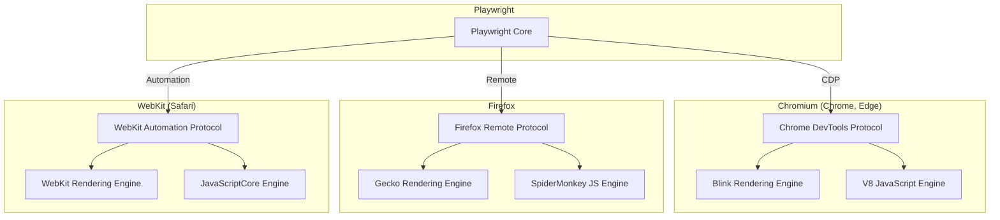
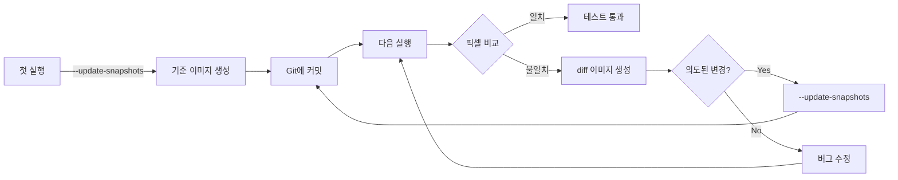

# 03. 크로스 브라우저 테스트 - 학습 (LEARN)

**작성일**: 2026-02-05
**선행 학습**: INVESTIGATE.md
**목표**: Playwright 크로스 브라우저 테스트 실전 구현

---

## 1. 브라우저 엔진 이해

### 브라우저 엔진 아키텍처



### 브라우저 설치 확인

```bash
# Playwright 설치 시 브라우저 자동 다운로드
npx playwright install

# 특정 브라우저만 설치
npx playwright install chromium
npx playwright install firefox
npx playwright install webkit

# 시스템 의존성 설치 (Linux)
npx playwright install-deps
```

### 브라우저 실행 확인

```typescript
// tests/browser-check.spec.ts
import { test, expect } from '@playwright/test';

test.describe('브라우저 엔진 확인', () => {
  test('브라우저 정보 출력', async ({ page, browserName }) => {
    await page.goto('http://localhost:3002');

    const userAgent = await page.evaluate(() => navigator.userAgent);
    console.log(`Browser: ${browserName}`);
    console.log(`User Agent: ${userAgent}`);

    // 브라우저별 특정 기능 확인
    const features = await page.evaluate(() => ({
      webgl: !!document.createElement('canvas').getContext('webgl'),
      serviceWorker: 'serviceWorker' in navigator,
      webAssembly: typeof WebAssembly !== 'undefined',
    }));

    console.log('Features:', features);
  });
});
```

**실행 결과**:
```
Browser: chromium
User Agent: Mozilla/5.0 (Macintosh; Intel Mac OS X 10_15_7)...
Features: { webgl: true, serviceWorker: true, webAssembly: true }

Browser: firefox
User Agent: Mozilla/5.0 (Macintosh; Intel Mac OS X 10.15; rv:109.0)...
Features: { webgl: true, serviceWorker: true, webAssembly: true }

Browser: webkit
User Agent: Mozilla/5.0 (Macintosh; Intel Mac OS X 10_15_7)...
Features: { webgl: true, serviceWorker: true, webAssembly: true }
```

### 핵심 이해
각 브라우저는 독립적인 엔진을 사용하므로, Playwright는 각 브라우저의 네이티브 프로토콜로 통신합니다. 이는 WebDriver보다 빠르고 안정적인 자동화를 가능하게 합니다.

---

## 2. projects 설정으로 멀티 브라우저

### 기본 설정

```typescript
// playwright.config.ts
import { defineConfig, devices } from '@playwright/test';

export default defineConfig({
  // 테스트 디렉토리
  testDir: './tests',

  // 전역 타임아웃
  timeout: 30 * 1000,

  // 실패 시 재시도
  retries: process.env.CI ? 2 : 0,

  // 병렬 실행 워커 수
  workers: process.env.CI ? 1 : undefined,

  // 리포터
  reporter: 'html',

  // 공통 설정
  use: {
    baseURL: 'http://localhost:3002',
    trace: 'on-first-retry',
    screenshot: 'only-on-failure',
  },

  // 브라우저별 프로젝트
  projects: [
    {
      name: 'chromium',
      use: { ...devices['Desktop Chrome'] },
    },
    {
      name: 'firefox',
      use: { ...devices['Desktop Firefox'] },
    },
    {
      name: 'webkit',
      use: { ...devices['Desktop Safari'] },
    },
  ],

  // 개발 서버 (선택)
  webServer: {
    command: 'npm run start:mock',
    url: 'http://localhost:3002',
    reuseExistingServer: !process.env.CI,
  },
});
```

### 프로젝트별 다른 설정

```typescript
projects: [
  {
    name: 'chromium-desktop',
    use: {
      ...devices['Desktop Chrome'],
      viewport: { width: 1920, height: 1080 },
      deviceScaleFactor: 1,
      // Chromium 전용 플래그
      launchOptions: {
        args: ['--disable-web-security'], // CORS 테스트용
      },
    },
  },
  {
    name: 'webkit-desktop',
    use: {
      ...devices['Desktop Safari'],
      viewport: { width: 1920, height: 1080 },
    },
    // Safari는 중요 테스트만
    testMatch: /.*\.(critical|smoke)\.spec\.ts/,
    // 재시도 횟수 증가
    retries: 3,
  },
  {
    name: 'firefox-headless',
    use: {
      ...devices['Desktop Firefox'],
      headless: true, // Firefox는 항상 headless
    },
  },
];
```

### 선택적 실행

```bash
# 모든 프로젝트 실행 (기본값)
npx playwright test

# 특정 프로젝트만
npx playwright test --project=chromium

# 여러 프로젝트
npx playwright test --project=chromium --project=webkit

# 프로젝트 목록 확인
npx playwright show-config
```

### 테스트에서 프로젝트 정보 사용

```typescript
import { test, expect } from '@playwright/test';

test('프로젝트별 다른 동작', async ({ page }, testInfo) => {
  console.log('Project:', testInfo.project.name);

  await page.goto('/');

  if (testInfo.project.name === 'webkit') {
    // Safari 전용 로직
    await page.waitForTimeout(1000); // Safari는 느릴 수 있음
  }

  const title = await page.title();
  expect(title).toBeTruthy();
});
```

### 핵심 이해
`projects` 배열은 테스트 실행 환경의 매트릭스를 정의합니다. 각 프로젝트는 독립적으로 실행되며, 같은 테스트를 다른 브라우저에서 검증합니다. 프로젝트별로 다른 설정을 적용할 수 있어 유연합니다.

---

## 3. 디바이스 에뮬레이션

### 사전 정의된 디바이스 사용

```typescript
// playwright.config.ts
import { defineConfig, devices } from '@playwright/test';

export default defineConfig({
  projects: [
    // 데스크톱
    {
      name: 'Desktop Chrome',
      use: { ...devices['Desktop Chrome'] },
    },
    {
      name: 'Desktop Firefox',
      use: { ...devices['Desktop Firefox'] },
    },
    {
      name: 'Desktop Safari',
      use: { ...devices['Desktop Safari'] },
    },

    // 모바일
    {
      name: 'Mobile Chrome',
      use: { ...devices['Pixel 7'] },
    },
    {
      name: 'Mobile Safari',
      use: { ...devices['iPhone 14'] },
    },

    // 태블릿
    {
      name: 'iPad',
      use: { ...devices['iPad Pro'] },
    },
  ],
});
```

### 사용 가능한 디바이스 목록

```typescript
import { devices } from '@playwright/test';

// 콘솔에 출력
console.log(Object.keys(devices));

// 일부 예시:
// - Desktop Chrome, Desktop Firefox, Desktop Safari
// - Pixel 5, Pixel 7, Galaxy S9+
// - iPhone 12, iPhone 13, iPhone 14, iPhone 14 Pro Max
// - iPad (gen 7), iPad Mini, iPad Pro
// - Desktop Chrome HiDPI, Desktop Edge, Desktop Safari
```

### 커스텀 디바이스 정의

```typescript
projects: [
  {
    name: 'Custom Mobile',
    use: {
      browserName: 'chromium',
      userAgent: 'MyApp/1.0 (Custom Mobile Device)',
      viewport: { width: 375, height: 812 }, // iPhone X 크기
      deviceScaleFactor: 3, // Retina 3x
      isMobile: true,
      hasTouch: true,
      geolocation: { longitude: 127.0276, latitude: 37.4979 }, // 강남역
      permissions: ['geolocation'],
      locale: 'ko-KR',
      timezoneId: 'Asia/Seoul',
    },
  },
];
```

### 반응형 디자인 테스트

```typescript
// tests/responsive.spec.ts
import { test, expect } from '@playwright/test';

test.describe('반응형 디자인', () => {
  test('네비게이션: 데스크톱 vs 모바일', async ({ page }) => {
    await page.goto('http://localhost:3002');

    // 데스크톱: 메뉴바 표시
    await page.setViewportSize({ width: 1920, height: 1080 });
    const desktopNav = page.locator('[data-testid="desktop-nav"]');
    await expect(desktopNav).toBeVisible();

    const burgerMenu = page.locator('[data-testid="burger-menu"]');
    await expect(burgerMenu).toBeHidden();

    // 모바일: 햄버거 메뉴 표시
    await page.setViewportSize({ width: 375, height: 667 });
    await expect(desktopNav).toBeHidden();
    await expect(burgerMenu).toBeVisible();

    // 햄버거 메뉴 클릭
    await burgerMenu.click();
    const mobileMenu = page.locator('[data-testid="mobile-menu"]');
    await expect(mobileMenu).toBeVisible();
  });

  test('터치 이벤트', async ({ page, isMobile }) => {
    test.skip(!isMobile, '모바일 전용 테스트');

    await page.goto('http://localhost:3002/swipe');

    // 스와이프 제스처
    const slider = page.locator('[data-testid="slider"]');
    const box = await slider.boundingBox();

    await page.touchscreen.tap(box.x + box.width / 2, box.y + box.height / 2);

    // 터치 이동
    await page.mouse.move(box.x + 10, box.y + box.height / 2);
    await page.mouse.down();
    await page.mouse.move(box.x + box.width - 10, box.y + box.height / 2);
    await page.mouse.up();

    const currentSlide = page.locator('[data-testid="current-slide"]');
    await expect(currentSlide).toHaveText('2');
  });
});
```

### Orientation (방향) 테스트

```typescript
test('가로/세로 방향 전환', async ({ page, isMobile }) => {
  test.skip(!isMobile, '모바일 전용');

  await page.goto('http://localhost:3002');

  // 세로 모드 (Portrait)
  await page.setViewportSize({ width: 375, height: 667 });
  const portrait = page.locator('[data-testid="orientation-indicator"]');
  await expect(portrait).toHaveText('Portrait');

  // 가로 모드 (Landscape)
  await page.setViewportSize({ width: 667, height: 375 });
  await expect(portrait).toHaveText('Landscape');
});
```

### 핵심 이해
디바이스 에뮬레이션은 실제 기기 없이 모바일 환경을 시뮬레이션합니다. User Agent, Viewport, Touch Events 등을 조합하여 기기의 특성을 재현합니다. 반응형 디자인 테스트에 필수적입니다.

---

## 4. 브라우저별 조건부 테스트

### browserName으로 분기

```typescript
import { test, expect } from '@playwright/test';

test('브라우저별 동작 검증', async ({ page, browserName }) => {
  await page.goto('http://localhost:3002/features');

  // Safari 전용 기능 테스트
  if (browserName === 'webkit') {
    const applePay = page.locator('[data-testid="apple-pay-button"]');
    await expect(applePay).toBeVisible();
  } else {
    // Chrome, Firefox는 Google Pay
    const googlePay = page.locator('[data-testid="google-pay-button"]');
    await expect(googlePay).toBeVisible();
  }
});
```

### test.skip으로 조건부 스킵

```typescript
test('Chrome 전용 기능', async ({ page, browserName }) => {
  test.skip(browserName !== 'chromium', 'Chrome 전용 테스트');

  await page.goto('http://localhost:3002/chrome-feature');

  // Chrome DevTools Protocol 사용
  const client = await page.context().newCDPSession(page);
  await client.send('Network.enable');

  // Chrome 전용 API 테스트
  const isChrome = await page.evaluate(() => {
    return 'chrome' in window;
  });
  expect(isChrome).toBe(true);
});
```

### 브라우저별 describe 블록

```typescript
test.describe('결제 기능', () => {
  test.describe('Safari 전용', () => {
    test.beforeEach(async ({ browserName }) => {
      test.skip(browserName !== 'webkit', 'Safari만 실행');
    });

    test('Apple Pay 결제', async ({ page }) => {
      await page.goto('http://localhost:3002/payment');
      // Apple Pay 로직
    });
  });

  test.describe('Chrome/Firefox 전용', () => {
    test.beforeEach(async ({ browserName }) => {
      test.skip(browserName === 'webkit', 'Safari 제외');
    });

    test('Google Pay 결제', async ({ page }) => {
      await page.goto('http://localhost:3002/payment');
      // Google Pay 로직
    });
  });
});
```

### 브라우저 호환성 감지

```typescript
test('CSS Grid 지원 확인', async ({ page, browserName }) => {
  await page.goto('http://localhost:3002/grid-layout');

  const supportsGrid = await page.evaluate(() => {
    return CSS.supports('display', 'grid');
  });

  if (browserName === 'webkit') {
    // Safari는 일부 Grid 기능 미지원 가능
    console.log('Safari Grid support:', supportsGrid);
  }

  expect(supportsGrid).toBe(true);

  // Grid 레이아웃 정상 렌더링 확인
  const gridContainer = page.locator('[data-testid="grid-container"]');
  await expect(gridContainer).toHaveCSS('display', 'grid');
});
```

### 브라우저별 타임아웃 조정

```typescript
test('느린 브라우저 대응', async ({ page, browserName }) => {
  // Safari는 느릴 수 있으므로 타임아웃 증가
  if (browserName === 'webkit') {
    test.setTimeout(60000); // 60초
  }

  await page.goto('http://localhost:3002/heavy-page');
  await page.waitForLoadState('networkidle');

  const content = page.locator('[data-testid="content"]');
  await expect(content).toBeVisible();
});
```

### 핵심 이해
모든 브라우저에서 모든 테스트를 실행할 필요는 없습니다. `browserName`, `test.skip`, 조건부 로직으로 브라우저별로 적절한 테스트를 실행하면 효율적입니다.

---

## 5. 시각적 차이 감지 (Screenshot Comparison)

### 기본 스크린샷 비교

```typescript
import { test, expect } from '@playwright/test';

test('홈페이지 시각적 회귀 테스트', async ({ page }) => {
  await page.goto('http://localhost:3002');

  // 브라우저별로 별도의 기준 이미지 생성
  await expect(page).toHaveScreenshot('homepage.png');
});
```

**실행**:
```bash
# 기준 이미지 생성
npx playwright test --update-snapshots

# 비교 테스트 실행
npx playwright test
```

**생성되는 파일**:
```
tests/
└── visual.spec.ts-snapshots/
    ├── homepage-chromium-darwin.png
    ├── homepage-firefox-darwin.png
    └── homepage-webkit-darwin.png
```

### 특정 요소만 비교

```typescript
test('버튼 스타일 비교', async ({ page }) => {
  await page.goto('http://localhost:3002/buttons');

  const button = page.locator('[data-testid="primary-button"]');

  // 요소만 스크린샷
  await expect(button).toHaveScreenshot('primary-button.png');
});
```

### 픽셀 차이 허용

```typescript
test('약간의 차이 허용', async ({ page }) => {
  await page.goto('http://localhost:3002');

  await expect(page).toHaveScreenshot('homepage.png', {
    maxDiffPixels: 100, // 100픽셀까지 차이 허용
    // 또는
    maxDiffPixelRatio: 0.01, // 1%까지 차이 허용
  });
});
```

### 동적 콘텐츠 마스킹

```typescript
test('동적 콘텐츠 제외하고 비교', async ({ page }) => {
  await page.goto('http://localhost:3002/dashboard');

  await expect(page).toHaveScreenshot('dashboard.png', {
    // 특정 요소 마스킹 (항상 변하는 시간, 랜덤 데이터 등)
    mask: [
      page.locator('[data-testid="current-time"]'),
      page.locator('[data-testid="random-banner"]'),
    ],
    // 마스킹 색상
    maskColor: '#00FF00',
  });
});
```

### 풀페이지 스크린샷

```typescript
test('전체 페이지 스크린샷', async ({ page }) => {
  await page.goto('http://localhost:3002/long-page');

  // Viewport보다 긴 페이지도 전체 캡처
  await expect(page).toHaveScreenshot('full-page.png', {
    fullPage: true,
  });
});
```

### 브라우저별 시각적 차이 감지

```typescript
test.describe('크로스 브라우저 시각적 테스트', () => {
  test('버튼 렌더링', async ({ page, browserName }) => {
    await page.goto('http://localhost:3002/buttons');

    const button = page.locator('[data-testid="gradient-button"]');
    await expect(button).toHaveScreenshot(`gradient-button-${browserName}.png`);

    // 브라우저 간 차이 확인 (수동)
    // chromium, firefox, webkit 각각 다른 기준 이미지 생성됨
  });
});
```

### 시각적 회귀 테스트 워크플로우



### 실패 시 diff 이미지 확인

```bash
# 테스트 실패 시 생성되는 파일:
tests/
└── visual.spec.ts-snapshots/
    ├── homepage-chromium-darwin.png              # 기준
    ├── homepage-chromium-darwin-actual.png       # 실제
    └── homepage-chromium-darwin-diff.png         # 차이
```

### 핵심 이해
스크린샷 비교는 시각적 회귀를 자동으로 감지합니다. 브라우저마다 렌더링이 미묘하게 다르므로, 각 브라우저별로 별도의 기준 이미지를 관리해야 합니다. 동적 콘텐츠는 마스킹으로 제외합니다.

---

## 실전 예제: Mock 서버 크로스 브라우저 테스트

```typescript
// tests/cross-browser-integration.spec.ts
import { test, expect } from '@playwright/test';

test.describe('크로스 브라우저 통합 테스트', () => {
  test.beforeEach(async ({ page }) => {
    // Mock 서버: http://localhost:3002
    await page.goto('http://localhost:3002');
  });

  test('로그인 폼 (모든 브라우저)', async ({ page }) => {
    // 폼 입력
    await page.fill('[name="email"]', 'test@example.com');
    await page.fill('[name="password"]', 'password123');

    // 제출
    await page.click('[type="submit"]');

    // 성공 메시지
    await expect(page.locator('[data-testid="success-message"]')).toBeVisible();
  });

  test('Date Picker (브라우저별 구현 다름)', async ({ page, browserName }) => {
    await page.click('[data-testid="date-input"]');

    if (browserName === 'webkit') {
      // Safari는 네이티브 date picker 사용
      await page.evaluate(() => {
        const input = document.querySelector('[data-testid="date-input"]') as HTMLInputElement;
        input.value = '2024-01-15';
        input.dispatchEvent(new Event('change', { bubbles: true }));
      });
    } else {
      // Chrome/Firefox는 커스텀 date picker
      const calendar = page.locator('[data-testid="calendar"]');
      await expect(calendar).toBeVisible();
      await page.click('[data-date="2024-01-15"]');
    }

    const selectedDate = page.locator('[data-testid="selected-date"]');
    await expect(selectedDate).toHaveText('2024-01-15');
  });

  test('애니메이션 (시각적 비교)', async ({ page }) => {
    const button = page.locator('[data-testid="animated-button"]');

    // Hover 전
    await expect(button).toHaveScreenshot('button-before.png');

    // Hover
    await button.hover();
    await page.waitForTimeout(300); // 애니메이션 완료 대기

    // Hover 후
    await expect(button).toHaveScreenshot('button-after.png');
  });

  test('반응형 레이아웃', async ({ page, isMobile }) => {
    const sidebar = page.locator('[data-testid="sidebar"]');
    const hamburger = page.locator('[data-testid="hamburger-menu"]');

    if (isMobile) {
      // 모바일: 사이드바 숨김, 햄버거 메뉴 표시
      await expect(sidebar).toBeHidden();
      await expect(hamburger).toBeVisible();

      // 햄버거 클릭하면 사이드바 표시
      await hamburger.click();
      await expect(sidebar).toBeVisible();
    } else {
      // 데스크톱: 사이드바 항상 표시
      await expect(sidebar).toBeVisible();
      await expect(hamburger).toBeHidden();
    }
  });
});
```

---

## 핵심 체크리스트

크로스 브라우저 테스트 구현 시 확인사항:

- [ ] `playwright.config.ts`에 projects 배열 정의
- [ ] Chromium, Firefox, WebKit 모두 설정
- [ ] 모바일 디바이스 에뮬레이션 추가 (필요 시)
- [ ] 브라우저별 조건부 로직 (`browserName`, `test.skip`)
- [ ] 시각적 회귀 테스트 (`toHaveScreenshot`)
- [ ] 동적 콘텐츠 마스킹 (`mask` 옵션)
- [ ] CI/CD에서 선택적 실행 전략 수립
- [ ] 스크린샷 기준 이미지 Git 커밋

---

## 다음 단계

Section 04에서는 Codegen을 활용한 테스트 자동 생성 방법을 학습합니다. 수동으로 작성한 크로스 브라우저 테스트를 Codegen으로 빠르게 생성하는 방법을 배울 것입니다.
