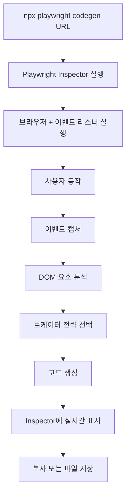
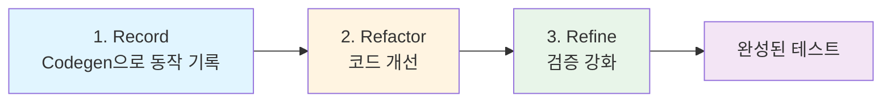

# 04. Codegen과 AI 테스트 생성 - 조사 (INVESTIGATE)

**작성일**: 2026-02-05
**목표**: Playwright Codegen과 AI 보조 테스트 생성 이해
**학습 패턴**: 소크라테스식 질문 → 탐구 → 이해

---

## 질문 1: npx playwright codegen은 어떻게 동작하는가? 내부 원리

### 왜 이 질문이 중요한가?
테스트 코드를 수동으로 작성하는 것은 시간이 많이 걸립니다. Codegen이 어떻게 사용자 동작을 코드로 변환하는지 이해하면, 효율적인 테스트 작성이 가능합니다.

### Codegen의 동작 원리

#### 1. 브라우저 이벤트 캡처
Codegen은 Playwright Inspector와 함께 브라우저를 실행하고, 사용자의 모든 인터랙션을 **이벤트 리스너**로 캡처합니다.

**캡처하는 이벤트**:
- `click`: 클릭
- `fill`: 입력 필드 채우기
- `select`: 드롭다운 선택
- `check/uncheck`: 체크박스
- `navigate`: URL 변경
- `hover`: 마우스 오버
- `press`: 키보드 입력

#### 2. Locator 전략 자동 선택
Codegen은 클릭한 요소에 대해 **우선순위 기반 로케이터**를 생성합니다.

**로케이터 우선순위**:
1. `getByRole()` - ARIA 역할 (가장 안정적)
2. `getByLabel()` - 레이블 텍스트
3. `getByPlaceholder()` - placeholder 속성
4. `getByText()` - 텍스트 내용
5. `getByTestId()` - data-testid 속성
6. CSS/XPath - 마지막 수단

#### 3. 코드 생성 알고리즘
```
사용자 동작 → 이벤트 캡처 → 로케이터 분석 → 코드 생성 → 버퍼에 저장
```

**예시**:
사용자가 "Login" 버튼 클릭 →
- DOM 요소: `<button>Login</button>`
- 분석: role=button, text="Login"
- 생성: `await page.getByRole('button', { name: 'Login' }).click();`

#### 4. 내부 구조 (간략화)
```typescript
class CodeGenerator {
  private actions: Action[] = [];

  async captureClick(element: Element) {
    const locator = this.generateLocator(element);
    this.actions.push({ type: 'click', locator });
    this.emitCode(`await page.${locator}.click();`);
  }

  private generateLocator(element: Element): string {
    // 우선순위 기반 로케이터 선택
    if (element.role) return `getByRole('${element.role}', { name: '${element.name}' })`;
    if (element.label) return `getByLabel('${element.label}')`;
    if (element.testId) return `getByTestId('${element.testId}')`;
    return `locator('${this.getCssSelector(element)}')`;
  }
}
```

### 실행 흐름



### 실제 사용

```bash
# 기본 사용
npx playwright codegen http://localhost:3002

# 브라우저 지정
npx playwright codegen --browser=webkit http://localhost:3002

# 출력 파일 지정
npx playwright codegen --output=tests/generated.spec.ts http://localhost:3002

# 모바일 에뮬레이션
npx playwright codegen --device="iPhone 14" http://localhost:3002

# 이미 실행 중인 페이지에서 시작
npx playwright codegen --load-storage=auth.json http://localhost:3002/dashboard
```

### 핵심 이해
Codegen은 브라우저 이벤트를 실시간으로 캡처하여, 각 요소에 대해 가장 안정적인 로케이터를 선택하고 Playwright API 코드로 변환합니다. 이는 수동 작성보다 빠르지만, 생성된 코드는 종종 개선이 필요합니다.

---

## 질문 2: Codegen이 생성한 코드의 품질은? 수정이 필요한 부분은?

### 왜 이 질문이 중요한가?
Codegen은 빠르지만 완벽하지 않습니다. 생성된 코드의 한계를 알아야 효과적으로 리팩토링할 수 있습니다.

### 생성된 코드의 강점

#### 1. 빠른 프로토타이핑
```typescript
// Codegen 출력 (30초 만에 생성)
import { test, expect } from '@playwright/test';

test('test', async ({ page }) => {
  await page.goto('http://localhost:3002/');
  await page.getByRole('link', { name: 'Login' }).click();
  await page.getByLabel('Email').fill('test@example.com');
  await page.getByLabel('Password').fill('password123');
  await page.getByRole('button', { name: 'Submit' }).click();
  await expect(page.getByText('Welcome back!')).toBeVisible();
});
```

**장점**:
- 로케이터가 대부분 `getByRole`, `getByLabel` 사용 (접근성 좋음)
- 기본 흐름 빠르게 캡처
- 초보자도 Playwright API 배울 수 있음

### 생성된 코드의 약점

#### 1. 불필요한 액션
```typescript
// ❌ Codegen이 생성한 코드
await page.goto('http://localhost:3002/');
await page.getByRole('link', { name: 'Products' }).click(); // 클릭
await page.getByRole('link', { name: 'About' }).click();    // 또 클릭
await page.getByRole('link', { name: 'Contact' }).click();  // 또 클릭
await page.getByLabel('Name').fill('John');

// ✅ 리팩토링 후
await page.goto('http://localhost:3002/contact'); // 직접 이동
await page.getByLabel('Name').fill('John');
```

**문제**: 불필요한 네비게이션을 모두 기록합니다.

#### 2. 중복된 대기
```typescript
// ❌ Codegen
await page.getByRole('button', { name: 'Submit' }).click();
await page.waitForTimeout(1000); // 하드코딩된 대기
await expect(page.getByText('Success')).toBeVisible();

// ✅ 리팩토링
await page.getByRole('button', { name: 'Submit' }).click();
await expect(page.getByText('Success')).toBeVisible(); // 자동 대기
```

**문제**: 불필요한 `waitForTimeout` 사용.

#### 3. Assertion 부족
```typescript
// ❌ Codegen (단순 클릭만 기록)
await page.getByRole('button', { name: 'Add to Cart' }).click();
await page.getByRole('link', { name: 'Cart' }).click();

// ✅ 리팩토링 (검증 추가)
await page.getByRole('button', { name: 'Add to Cart' }).click();
await expect(page.getByTestId('cart-count')).toHaveText('1'); // 추가
await page.getByRole('link', { name: 'Cart' }).click();
await expect(page.getByRole('row')).toHaveCount(1); // 추가
```

**문제**: 동작만 기록하고 검증(assertion)이 부족합니다.

#### 4. 재사용성 부족
```typescript
// ❌ Codegen (모든 단계 나열)
test('test 1', async ({ page }) => {
  await page.goto('http://localhost:3002/');
  await page.getByLabel('Email').fill('user1@example.com');
  await page.getByLabel('Password').fill('password');
  await page.getByRole('button', { name: 'Login' }).click();
  // ... 실제 테스트 로직
});

test('test 2', async ({ page }) => {
  await page.goto('http://localhost:3002/');
  await page.getByLabel('Email').fill('user2@example.com'); // 중복
  await page.getByLabel('Password').fill('password'); // 중복
  await page.getByRole('button', { name: 'Login' }).click(); // 중복
  // ... 실제 테스트 로직
});

// ✅ 리팩토링 (헬퍼 함수)
async function login(page, email) {
  await page.goto('http://localhost:3002/');
  await page.getByLabel('Email').fill(email);
  await page.getByLabel('Password').fill('password');
  await page.getByRole('button', { name: 'Login' }).click();
}

test('test 1', async ({ page }) => {
  await login(page, 'user1@example.com');
  // ... 실제 테스트 로직
});
```

**문제**: 공통 로직이 중복됩니다.

#### 5. 테스트명이 무의미
```typescript
// ❌ Codegen
test('test', async ({ page }) => {
  // ...
});

// ✅ 리팩토링
test('로그인 성공 시 대시보드로 이동', async ({ page }) => {
  // ...
});
```

### 수정이 필요한 부분 체크리스트

- [ ] 불필요한 네비게이션 제거 (직접 URL 이동)
- [ ] `waitForTimeout` 제거 (자동 대기 활용)
- [ ] Assertion 추가 (기대 결과 검증)
- [ ] 공통 로직 함수로 추출
- [ ] 테스트명을 의미 있게 수정
- [ ] Page Object Model 적용 (대규모 프로젝트)

### 핵심 이해
Codegen은 "빠른 초안 작성 도구"입니다. 생성된 코드는 동작하지만, 유지보수 가능한 테스트를 만들려면 반드시 리팩토링이 필요합니다. Codegen은 시작점이지, 완성품이 아닙니다.

---

## 질문 3: AI 기반 테스트 생성 도구(Copilot 등)와 Codegen의 차이

### 왜 이 질문이 중요한가?
AI 도구가 보편화되면서, Codegen과 AI의 역할이 헷갈릴 수 있습니다. 각 도구의 강점을 이해하면 적재적소에 활용할 수 있습니다.

### Codegen의 특징

**작동 방식**:
- 실제 브라우저에서 **동작 기록**
- 이벤트 기반 캡처
- 결정론적 (같은 동작 → 같은 코드)

**강점**:
- 정확한 로케이터 (실제 DOM 기반)
- 복잡한 인터랙션도 정확히 캡처
- Playwright API와 완벽한 호환

**약점**:
- 수동 동작 필요 (자동화 불가)
- 창의적인 테스트 케이스 생성 불가
- 엣지 케이스 고려 안 함

### AI (GitHub Copilot, ChatGPT 등)의 특징

**작동 방식**:
- 프롬프트 기반 코드 생성
- 패턴 학습 모델 활용
- 확률적 (같은 프롬프트 → 다른 코드 가능)

**강점**:
- 테스트 케이스 아이디어 제안
- 엣지 케이스 고려
- 반복 패턴 빠르게 생성
- 주석과 문서 자동 생성

**약점**:
- 로케이터가 부정확할 수 있음 (실제 DOM 모름)
- Playwright API 잘못 사용 가능
- 환각(hallucination) 위험

### 비교표

| 항목 | Codegen | AI (Copilot) |
|------|---------|--------------|
| **입력** | 브라우저 동작 | 텍스트 프롬프트 |
| **출력 정확도** | 높음 (실제 DOM 기반) | 중간 (추측 기반) |
| **창의성** | 없음 (기록만) | 높음 (패턴 제안) |
| **엣지 케이스** | 수동 추가 필요 | 자동 제안 가능 |
| **학습 곡선** | 낮음 (GUI) | 중간 (프롬프트 작성) |
| **사용 시점** | 초기 프로토타입 | 리팩토링, 확장 |

### 실무 활용 예시

#### Codegen으로 시작
```bash
npx playwright codegen http://localhost:3002/checkout
```

**생성된 코드**:
```typescript
test('test', async ({ page }) => {
  await page.goto('http://localhost:3002/checkout');
  await page.getByLabel('Card Number').fill('4111111111111111');
  await page.getByLabel('Expiry').fill('12/25');
  await page.getByLabel('CVV').fill('123');
  await page.getByRole('button', { name: 'Pay' }).click();
});
```

#### AI로 확장
**프롬프트**: "위 테스트에 엣지 케이스 추가해줘 (만료된 카드, 잘못된 CVV 등)"

**AI 생성 코드**:
```typescript
test.describe('결제 테스트', () => {
  test('정상 카드로 결제', async ({ page }) => {
    await page.goto('http://localhost:3002/checkout');
    await page.getByLabel('Card Number').fill('4111111111111111');
    await page.getByLabel('Expiry').fill('12/25');
    await page.getByLabel('CVV').fill('123');
    await page.getByRole('button', { name: 'Pay' }).click();
    await expect(page.getByText('Payment Successful')).toBeVisible();
  });

  test('만료된 카드 에러', async ({ page }) => {
    await page.goto('http://localhost:3002/checkout');
    await page.getByLabel('Card Number').fill('4111111111111111');
    await page.getByLabel('Expiry').fill('01/20'); // 과거 날짜
    await page.getByLabel('CVV').fill('123');
    await page.getByRole('button', { name: 'Pay' }).click();
    await expect(page.getByText('Card expired')).toBeVisible();
  });

  test('잘못된 CVV 에러', async ({ page }) => {
    await page.goto('http://localhost:3002/checkout');
    await page.getByLabel('Card Number').fill('4111111111111111');
    await page.getByLabel('Expiry').fill('12/25');
    await page.getByLabel('CVV').fill('99'); // 너무 짧음
    await page.getByRole('button', { name: 'Pay' }).click();
    await expect(page.getByText('Invalid CVV')).toBeVisible();
  });
});
```

### 핵심 이해
**Codegen은 "기록계"**, **AI는 "확장계"**입니다. Codegen으로 기본 흐름을 빠르게 캡처하고, AI로 엣지 케이스와 리팩토링을 진행하는 조합이 가장 효율적입니다.

---

## 질문 4: Codegen으로 생성된 로케이터가 불안정한 경우 어떻게 개선하는가?

### 왜 이 질문이 중요한가?
로케이터가 불안정하면 DOM 구조가 조금만 변경되어도 테스트가 깨집니다. 안정적인 로케이터를 선택하는 것이 테스트 유지보수의 핵심입니다.

### 불안정한 로케이터 예시

#### 1. CSS 클래스 의존
```typescript
// ❌ 불안정 (CSS 클래스는 자주 변경됨)
await page.locator('.btn-primary.rounded-lg.shadow').click();

// ✅ 안정적 (역할 기반)
await page.getByRole('button', { name: 'Submit' }).click();
```

#### 2. nth-child 의존
```typescript
// ❌ 불안정 (순서 변경 시 깨짐)
await page.locator('ul > li:nth-child(3)').click();

// ✅ 안정적 (텍스트 기반)
await page.getByRole('listitem').filter({ hasText: 'Settings' }).click();
```

#### 3. 긴 XPath
```typescript
// ❌ 불안정 (DOM 구조 변경 시 깨짐)
await page.locator('/html/body/div[2]/div[1]/form/div[3]/button').click();

// ✅ 안정적 (data-testid)
await page.getByTestId('submit-button').click();
```

### 로케이터 안정성 피라미드

```
              ▲
             / \        getByRole, getByLabel
            /   \       (가장 안정적, 접근성 좋음)
           /─────\
          /       \     getByTestId
         /         \    (개발자가 명시적으로 지정)
        /───────────\
       /             \  getByText
      /               \ (텍스트 변경 시 깨질 수 있음)
     /─────────────────\
    /                   \ CSS Selector, XPath
   /                     \ (가장 불안정, 마지막 수단)
  ───────────────────────
```

### Codegen 개선 전략

#### 전략 1: data-testid 추가
```html
<!-- Before -->
<button class="btn btn-primary">Submit</button>

<!-- After -->
<button data-testid="submit-button" class="btn btn-primary">Submit</button>
```

```typescript
// Codegen 생성 (개선 전)
await page.locator('.btn.btn-primary').click();

// 개선 후
await page.getByTestId('submit-button').click();
```

#### 전략 2: ARIA 속성 추가
```html
<!-- Before -->
<input type="text" placeholder="Enter email" />

<!-- After -->
<input type="text" aria-label="Email" placeholder="Enter email" />
```

```typescript
// Codegen 생성 (개선 전)
await page.locator('input[placeholder="Enter email"]').fill('test@example.com');

// 개선 후
await page.getByLabel('Email').fill('test@example.com');
```

#### 전략 3: 계층적 로케이터
```typescript
// ❌ 불안정 (전역 검색)
await page.getByText('Delete').click(); // 여러 개 있을 수 있음

// ✅ 안정적 (범위 제한)
const userRow = page.getByRole('row').filter({ hasText: 'John Doe' });
await userRow.getByRole('button', { name: 'Delete' }).click();
```

#### 전략 4: Playwright 로케이터 체이닝
```typescript
// 복잡한 구조
await page
  .getByTestId('user-list')
  .getByRole('listitem')
  .filter({ hasText: 'Active' })
  .first()
  .getByRole('button', { name: 'Edit' })
  .click();
```

### 로케이터 우선순위 가이드

**1순위: getByRole**
```typescript
await page.getByRole('button', { name: 'Submit' });
await page.getByRole('textbox', { name: 'Email' });
await page.getByRole('checkbox', { name: 'Remember me' });
```

**2순위: getByLabel**
```typescript
await page.getByLabel('Email address');
await page.getByLabel('Password');
```

**3순위: getByTestId**
```typescript
await page.getByTestId('user-profile-menu');
await page.getByTestId('cart-item-123');
```

**4순위: getByText (정확한 텍스트)**
```typescript
await page.getByText('Exact text');
await page.getByText(/regex pattern/);
```

**최후: CSS/XPath (피하기)**
```typescript
await page.locator('button.submit'); // 불가피한 경우만
```

### 실제 리팩토링 예시

```typescript
// ❌ Codegen 생성 (불안정)
test('불안정한 로케이터', async ({ page }) => {
  await page.goto('http://localhost:3002/users');
  await page.locator('div.user-card:nth-child(2) > div > button.edit').click();
  await page.locator('#name').fill('Jane Doe');
  await page.locator('form > div:last-child > button[type="submit"]').click();
});

// ✅ 리팩토링 (안정적)
test('안정적인 로케이터', async ({ page }) => {
  await page.goto('http://localhost:3002/users');

  // 특정 사용자 카드 찾기
  const userCard = page
    .getByTestId('user-card')
    .filter({ hasText: 'John Doe' });

  // Edit 버튼 클릭
  await userCard.getByRole('button', { name: 'Edit' }).click();

  // 이름 수정
  await page.getByLabel('Name').fill('Jane Doe');

  // 제출
  await page.getByRole('button', { name: 'Save' }).click();
});
```

### 핵심 이해
로케이터의 안정성은 테스트 수명을 결정합니다. Codegen이 생성한 로케이터를 무조건 사용하지 말고, `getByRole`, `getByLabel`, `getByTestId` 순서로 개선해야 합니다. 필요하다면 HTML에 `data-testid`나 ARIA 속성을 추가하는 것이 좋습니다.

---

## 질문 5: Record → Refactor → Refine 워크플로우란?

### 왜 이 질문이 중요한가?
Codegen은 도구일 뿐, 워크플로우가 없으면 비효율적입니다. 체계적인 프로세스가 있어야 품질 높은 테스트를 빠르게 만들 수 있습니다.

### 3단계 워크플로우



---

### 1단계: Record (기록)

**목표**: Codegen으로 빠르게 사용자 시나리오 캡처

**실행**:
```bash
npx playwright codegen http://localhost:3002/checkout
```

**사용자 동작**:
1. 상품 페이지 이동
2. "Add to Cart" 클릭
3. 장바구니 페이지 이동
4. "Checkout" 클릭
5. 배송 정보 입력
6. "Place Order" 클릭

**생성된 코드**:
```typescript
import { test, expect } from '@playwright/test';

test('test', async ({ page }) => {
  await page.goto('http://localhost:3002/');
  await page.getByRole('link', { name: 'Products' }).click();
  await page.getByRole('link', { name: 'Laptop' }).click();
  await page.getByRole('button', { name: 'Add to Cart' }).click();
  await page.getByRole('link', { name: 'Cart' }).click();
  await page.getByRole('button', { name: 'Checkout' }).click();
  await page.getByLabel('Full Name').fill('John Doe');
  await page.getByLabel('Address').fill('123 Main St');
  await page.getByLabel('City').fill('Seoul');
  await page.getByRole('button', { name: 'Place Order' }).click();
});
```

**특징**:
- 빠름 (5분 만에 완료)
- 동작은 정확히 캡처
- 하지만 개선 필요

---

### 2단계: Refactor (리팩토링)

**목표**: 코드를 유지보수 가능하게 개선

#### 개선 1: 불필요한 네비게이션 제거
```typescript
// ❌ Before
await page.goto('http://localhost:3002/');
await page.getByRole('link', { name: 'Products' }).click();
await page.getByRole('link', { name: 'Laptop' }).click();

// ✅ After
await page.goto('http://localhost:3002/products/laptop');
```

#### 개선 2: 공통 로직 헬퍼 함수화
```typescript
async function fillCheckoutForm(page, { name, address, city }) {
  await page.getByLabel('Full Name').fill(name);
  await page.getByLabel('Address').fill(address);
  await page.getByLabel('City').fill(city);
}

test('주문하기', async ({ page }) => {
  await page.goto('http://localhost:3002/products/laptop');
  await page.getByRole('button', { name: 'Add to Cart' }).click();
  await page.getByRole('link', { name: 'Cart' }).click();
  await page.getByRole('button', { name: 'Checkout' }).click();

  await fillCheckoutForm(page, {
    name: 'John Doe',
    address: '123 Main St',
    city: 'Seoul',
  });

  await page.getByRole('button', { name: 'Place Order' }).click();
});
```

#### 개선 3: 테스트 데이터 분리
```typescript
const testUser = {
  name: 'John Doe',
  address: '123 Main St',
  city: 'Seoul',
  email: 'john@example.com',
};

test('주문하기', async ({ page }) => {
  // ...
  await fillCheckoutForm(page, testUser);
  // ...
});
```

#### 개선 4: 의미 있는 테스트명
```typescript
// ❌ Before
test('test', async ({ page }) => { /* ... */ });

// ✅ After
test('상품을 장바구니에 추가하고 주문을 완료할 수 있다', async ({ page }) => {
  /* ... */
});
```

---

### 3단계: Refine (검증 강화)

**목표**: Assertion 추가로 테스트 신뢰성 확보

#### 개선 1: 중간 상태 검증
```typescript
test('주문 프로세스', async ({ page }) => {
  await page.goto('http://localhost:3002/products/laptop');

  // 상품 페이지 검증
  await expect(page.getByRole('heading', { name: 'Laptop' })).toBeVisible();
  await expect(page.getByTestId('price')).toHaveText('$999');

  await page.getByRole('button', { name: 'Add to Cart' }).click();

  // 장바구니 개수 증가 검증
  await expect(page.getByTestId('cart-count')).toHaveText('1');

  await page.getByRole('link', { name: 'Cart' }).click();

  // 장바구니 페이지 검증
  await expect(page.getByRole('row')).toHaveCount(1);
  await expect(page.getByText('Laptop')).toBeVisible();

  await page.getByRole('button', { name: 'Checkout' }).click();

  await fillCheckoutForm(page, testUser);
  await page.getByRole('button', { name: 'Place Order' }).click();

  // 주문 완료 검증
  await expect(page.getByText('Order Confirmed')).toBeVisible();
  await expect(page.getByTestId('order-number')).toBeVisible();
});
```

#### 개선 2: 에러 케이스 추가
```typescript
test('필수 필드 누락 시 에러 메시지 표시', async ({ page }) => {
  await page.goto('http://localhost:3002/checkout');

  // 이름 입력 안 함
  await page.getByLabel('Address').fill('123 Main St');
  await page.getByRole('button', { name: 'Place Order' }).click();

  // 에러 메시지 검증
  await expect(page.getByText('Name is required')).toBeVisible();
});
```

#### 개선 3: 브라우저 상태 검증
```typescript
test('주문 후 URL 변경 확인', async ({ page }) => {
  // ...
  await page.getByRole('button', { name: 'Place Order' }).click();

  // URL 검증
  await expect(page).toHaveURL(/\/order\/\d+/);

  // 로컬 스토리지 검증
  const cartItems = await page.evaluate(() => localStorage.getItem('cart'));
  expect(cartItems).toBe('[]'); // 주문 후 장바구니 비움
});
```

---

### 완성된 테스트 예시

```typescript
// tests/checkout.spec.ts
import { test, expect } from '@playwright/test';

// 테스트 데이터
const testUser = {
  name: 'John Doe',
  address: '123 Main St',
  city: 'Seoul',
};

// 헬퍼 함수
async function addToCart(page, productName) {
  await page.goto(`http://localhost:3002/products/${productName}`);
  await expect(page.getByRole('heading', { name: productName })).toBeVisible();
  await page.getByRole('button', { name: 'Add to Cart' }).click();
  await expect(page.getByTestId('cart-count')).toHaveText('1');
}

async function fillCheckoutForm(page, { name, address, city }) {
  await page.getByLabel('Full Name').fill(name);
  await page.getByLabel('Address').fill(address);
  await page.getByLabel('City').fill(city);
}

test.describe('체크아웃 프로세스', () => {
  test.beforeEach(async ({ page }) => {
    // 초기화: 장바구니 비우기
    await page.goto('http://localhost:3002');
    await page.evaluate(() => localStorage.setItem('cart', '[]'));
  });

  test('정상 주문 프로세스', async ({ page }) => {
    // 1. 상품 추가
    await addToCart(page, 'laptop');

    // 2. 장바구니 확인
    await page.getByRole('link', { name: 'Cart' }).click();
    await expect(page.getByRole('row')).toHaveCount(1);

    // 3. 체크아웃
    await page.getByRole('button', { name: 'Checkout' }).click();
    await fillCheckoutForm(page, testUser);
    await page.getByRole('button', { name: 'Place Order' }).click();

    // 4. 주문 완료 검증
    await expect(page).toHaveURL(/\/order\/\d+/);
    await expect(page.getByText('Order Confirmed')).toBeVisible();
  });

  test('필수 필드 누락 시 에러', async ({ page }) => {
    await page.goto('http://localhost:3002/checkout');
    await page.getByRole('button', { name: 'Place Order' }).click();
    await expect(page.getByText('Name is required')).toBeVisible();
  });
});
```

### 핵심 이해
**Record → Refactor → Refine**은 Codegen을 효율적으로 활용하는 워크플로우입니다. Codegen으로 빠르게 시작하고, 리팩토링으로 품질을 높이고, 검증을 강화하여 신뢰성을 확보합니다. 이 프로세스를 따르면 10분 만에 프로덕션급 테스트를 만들 수 있습니다.

---

## 다음 단계

이 조사를 바탕으로 `LEARN.md`에서 실제 Codegen 활용 패턴을 학습합니다:

1. Codegen 기본 사용법
2. 생성된 코드 분석 및 개선
3. Locator fallback 전략
4. AI 보조 테스트 생성
5. 유지보수성 향상을 위한 리팩토링

**학습 포인트**: Codegen은 "초안 작성 도구"입니다. 생성된 코드를 그대로 사용하지 말고, 반드시 개선 과정을 거쳐야 유지보수 가능한 테스트가 됩니다.
