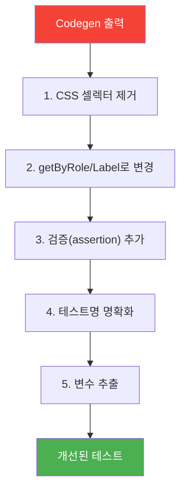
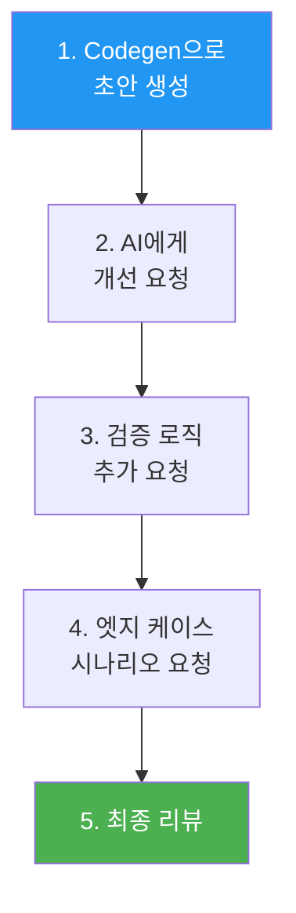

# 04. Codegen과 AI 보조 테스트 생성 - 학습 (LEARN)

**작성일**: 2026-02-05
**학습 목표**: Playwright Codegen 도구를 활용한 빠른 테스트 생성과 AI 보조 테스트 작성 패턴 습득
**예상 학습 시간**: 60분

---

## 학습 목표

이 섹션을 완료하면 다음을 할 수 있습니다:

1. **Playwright Codegen**으로 사용자 동작을 기록하여 테스트 코드 자동 생성
2. **Codegen 출력 분석**하고 개선점 파악
3. **CSS 셀렉터를 getByRole/getByTestId로 리팩토링**하여 견고한 테스트 작성
4. **AI(LLM)를 활용한 테스트 생성 패턴** 적용
5. **Fallback 로케이터 전략**으로 복잡한 UI 대응
6. **Inspector와 Trace Viewer**로 디버깅

---

## 1. Playwright Codegen 소개

### 1.1 Codegen이란?

Playwright Codegen은 **브라우저에서 수행한 사용자 동작을 자동으로 기록**하여 테스트 코드를 생성하는 도구입니다.


**장점**:
- 빠른 프로토타이핑 (5분 안에 첫 테스트 작성)
- 로케이터 자동 추천 (Playwright가 최적의 셀렉터 선택)
- 초보자도 쉽게 시작 가능

**단점**:
- 생성된 코드는 **개선이 필요**함 (CSS 셀렉터 많이 사용)
- 비즈니스 로직이나 검증(assertion)은 수동 추가
- 복잡한 플로우는 여러 번 나눠서 기록해야 함

---

## 2. Codegen 사용법

### 2.1 기본 실행

```bash
# 기본 실행 (빈 브라우저 시작)
npx playwright codegen

# 특정 URL에서 시작
npx playwright codegen http://localhost:3002/ticket-list

# 특정 브라우저 지정
npx playwright codegen --browser=webkit http://localhost:3002

# 모바일 에뮬레이션
npx playwright codegen --device="iPhone 14" http://localhost:3002

# 파일로 저장
npx playwright codegen -o tests/generated/ticket-create.spec.ts http://localhost:3002
```

### 2.2 Codegen UI 구성

```
┌─────────────────────────────────────┐
│  Playwright Inspector               │
├─────────────────────────────────────┤
│  🔴 Record  |  ⏸️ Pause  |  📋 Copy   │
├─────────────────────────────────────┤
│  import { test, expect } from ...   │
│  test('test', async ({ page }) => { │
│    await page.goto('...');          │
│    await page.click('.btn');        │
│  });                                │
└─────────────────────────────────────┘

┌─────────────────────────────────────┐
│  브라우저 (사용자 조작)              │
│  [클릭, 입력, 선택 등]               │
└─────────────────────────────────────┘
```

---

## 3. Codegen 출력 분석

### 3.1 Codegen이 생성한 코드 예시

**시나리오**: TPS 티켓 목록에서 검색 → 첫 번째 티켓 클릭

```typescript
// Codegen 원본 출력
import { test, expect } from '@playwright/test';

test('test', async ({ page }) => {
  await page.goto('http://localhost:3002/ticket-list');

  // ❌ CSS 셀렉터 (DOM 구조 의존)
  await page.locator('div.search-bar > input').click();
  await page.locator('div.search-bar > input').fill('CI/CD');
  await page.locator('div.search-bar > button.btn-search').click();

  // ❌ nth-child 사용 (취약)
  await page.locator('table > tbody > tr:nth-child(1) > td:nth-child(2) > a').click();

  // ⚠️ URL 확인만 있음 (검증 부족)
  await page.waitForURL('http://localhost:3002/ticket/123');
});
```

### 3.2 문제점 분석

| 문제 | 설명 | 영향 |
|------|------|------|
| **CSS 셀렉터 남용** | `div.search-bar > input` | DOM 구조 변경 시 깨짐 |
| **nth-child** | `tr:nth-child(1)` | 데이터 순서 변경 시 실패 |
| **모호한 테스트명** | `test('test', ...)` | 의도 파악 어려움 |
| **검증 부족** | `waitForURL`만 확인 | 실제 콘텐츠 검증 없음 |
| **재사용 불가** | 하드코딩된 선택자 | 다른 테스트에서 재사용 어려움 |

---

## 4. Codegen 출력 개선하기

### 4.1 개선 전략



### 4.2 개선된 코드

```typescript
// ✅ 개선 버전
import { test, expect } from '@playwright/test';

test('TPS 티켓 검색 후 첫 번째 티켓 상세 조회', async ({ page }) => {
  // 1. 티켓 목록 페이지 이동
  await page.goto('http://localhost:3002/ticket-list');

  // 2. 검색어 입력 (CSS → getByRole/getByPlaceholder)
  const searchInput = page.getByPlaceholder('티켓 번호 또는 제목');
  await searchInput.fill('CI/CD');

  // 3. 검색 버튼 클릭 (CSS → getByRole)
  await page.getByRole('button', { name: '검색' }).click();

  // 4. API 응답 대기 (검증 추가)
  await page.waitForResponse(resp =>
    resp.url().includes('/api/tickets?q=CI/CD') && resp.status() === 200
  );

  // 5. 검색 결과 확인 (검증 추가)
  const resultRows = page.getByRole('row').filter({ hasText: 'CI/CD' });
  await expect(resultRows).toHaveCount(3);

  // 6. 첫 번째 티켓의 제목 링크 클릭 (nth-child → first() + getByRole)
  const firstTicket = resultRows.first();
  await firstTicket.getByRole('link').click();

  // 7. 상세 페이지 검증 (URL + 콘텐츠)
  await expect(page).toHaveURL(/\/ticket\/\d+/);
  await expect(page.getByRole('heading', { level: 1 })).toContainText('CI/CD');
  await expect(page.getByText('상태:')).toBeVisible();
});
```

### 4.3 개선 포인트 비교

| 개선 항목 | 개선 전 | 개선 후 |
|-----------|---------|---------|
| **로케이터** | `div.search-bar > input` | `getByPlaceholder('...')` |
| **버튼** | `button.btn-search` | `getByRole('button', { name: '검색' })` |
| **행 선택** | `tr:nth-child(1)` | `getByRole('row').filter().first()` |
| **검증** | URL만 확인 | URL + 콘텐츠 + API 응답 |
| **테스트명** | `'test'` | 명확한 시나리오 설명 |

---

## 5. Codegen의 로케이터 선택 로직

### 5.1 Codegen이 셀렉터를 선택하는 우선순위

Playwright Codegen은 다음 순서로 로케이터를 선택합니다:

```
1. data-testid 속성 (있으면 최우선)
2. aria-label, role 등 접근성 속성
3. placeholder, label 연결
4. 텍스트 콘텐츠
5. CSS 셀렉터 (최후)
```

**예시**:
```html
<!-- HTML 구조 -->
<button class="btn-primary" data-testid="submit-btn">등록</button>
```

```typescript
// Codegen 출력 (data-testid 발견)
await page.getByTestId('submit-btn').click();

// data-testid 없으면
await page.getByRole('button', { name: '등록' }).click();

// 역할도 모호하면
await page.locator('button.btn-primary').click();
```

### 5.2 Codegen 출력 최적화 팁

**HTML에 힌트 제공하기**:
```html
<!-- ❌ Codegen이 CSS 셀렉터 사용 -->
<button class="btn">Submit</button>

<!-- ✅ Codegen이 getByRole 사용 -->
<button type="button">Submit</button>

<!-- ✅ Codegen이 getByTestId 사용 -->
<button data-testid="submit-btn">Submit</button>

<!-- ✅ Codegen이 getByLabel 사용 -->
<label for="email">이메일</label>
<input id="email" />
```

---

## 6. Fallback 로케이터 전략

Codegen이 생성한 로케이터가 작동하지 않을 때 사용하는 대안 전략입니다.

### 6.1 Fallback 패턴

```typescript
// 전략 1: 다중 로케이터 시도
async function findSubmitButton(page: Page) {
  // 우선순위: getByRole → getByTestId → CSS
  try {
    const btn = page.getByRole('button', { name: /등록|제출/ });
    if (await btn.isVisible({ timeout: 1000 })) return btn;
  } catch {}

  try {
    const btn = page.getByTestId('submit-btn');
    if (await btn.isVisible({ timeout: 1000 })) return btn;
  } catch {}

  // 최후의 수단
  return page.locator('button[type="submit"]');
}

// 사용
const submitBtn = await findSubmitButton(page);
await submitBtn.click();
```

### 6.2 동적 콘텐츠 대응

```typescript
// TPS 티켓 목록: 상태별로 다른 아이콘
test('티켓 상태 아이콘 확인', async ({ page }) => {
  await page.goto('http://localhost:3002/ticket-list');

  // 상태가 "진행 중"인 티켓 찾기
  const inProgressTickets = page.getByRole('row').filter({ hasText: '진행 중' });

  // Fallback: 텍스트 → 아이콘 → TestId
  const statusCell = inProgressTickets.first().getByRole('cell').nth(3);

  // 방법 1: 텍스트로 검증
  await expect(statusCell).toHaveText('진행 중');

  // 방법 2: 아이콘 class로 검증 (Fallback)
  const icon = statusCell.locator('.icon-in-progress, .status-icon[data-status="in-progress"]');
  await expect(icon).toBeVisible();
});
```

### 6.3 XPath Fallback (정말 최후의 수단)

```typescript
// Codegen이 복잡한 구조에서 XPath 사용할 때
// Playwright는 내부적으로 최적화하므로 성능 문제 적음
await page.locator('xpath=//button[contains(text(), "등록")]/parent::div/parent::form').click();

// 개선: getBy* 메서드로 변환 시도
await page.locator('form').getByRole('button', { name: '등록' }).click();
```

---

## 7. AI 보조 테스트 생성 패턴

### 7.1 LLM에게 효과적으로 요청하기

**프롬프트 패턴**:
```
다음 시나리오의 Playwright 테스트를 작성해줘:

**페이지**: http://localhost:3002/ticket-create
**시나리오**:
1. 제목 입력: "[CI/CD] Jenkins 파이프라인"
2. 담당자 선택: "홍길동"
3. 우선순위: "높음"
4. 저장 버튼 클릭
5. 성공 메시지 확인
6. 목록 페이지로 이동 확인

**요구사항**:
- getByRole, getByLabel 우선 사용
- CSS 셀렉터 피하기
- 각 단계마다 검증 추가
- data-testid는 최후의 수단
```

**LLM 출력 예시**:
```typescript
test('TPS 신규 티켓 생성', async ({ page }) => {
  await page.goto('http://localhost:3002/ticket-create');

  // 1. 폼 입력
  await page.getByLabel('제목').fill('[CI/CD] Jenkins 파이프라인');
  await page.getByLabel('담당자').selectOption('홍길동');
  await page.getByLabel('우선순위').selectOption('높음');

  // 2. 저장
  await page.getByRole('button', { name: '저장' }).click();

  // 3. 검증
  await expect(page.getByText('티켓이 생성되었습니다')).toBeVisible();
  await expect(page).toHaveURL('http://localhost:3002/ticket-list');
});
```

### 7.2 AI로 Codegen 출력 개선하기

**프롬프트**:
```
다음 Codegen 출력을 개선해줘:

[Codegen 코드 붙여넣기]

개선 요구사항:
1. CSS 셀렉터를 getByRole/getByLabel로 변경
2. nth-child를 filter().first()로 변경
3. 검증(expect) 추가
4. 주석으로 각 단계 설명
5. 변수명 명확하게
```

### 7.3 AI 활용 전략



**AI에게 엣지 케이스 요청**:
```
위 테스트에 다음 케이스를 추가해줘:
1. 제목이 비어있을 때 에러 메시지 확인
2. 네트워크 오류 시 재시도
3. 중복 제출 방지 확인
```

---

## 8. Inspector와 디버깅

### 8.1 Inspector 활용

```bash
# Inspector 모드로 테스트 실행 (일시정지)
npx playwright test --debug

# 특정 테스트만 디버깅
npx playwright test ticket-create.spec.ts --debug
```

**Inspector UI**:
```
┌─────────────────────────────────────┐
│  🐛 Playwright Inspector            │
├─────────────────────────────────────┤
│  ▶️ Resume  |  ⏭️ Step  |  🔍 Pick    │
├─────────────────────────────────────┤
│  await page.click('.btn')           │ ← 현재 줄
│  await page.fill('input', 'text')   │
├─────────────────────────────────────┤
│  Console:                           │
│  > page.locator('.btn')             │
│  Locator: .btn                      │
└─────────────────────────────────────┘
```

**Pick Locator 기능**:
1. 🔍 Pick 버튼 클릭
2. 브라우저에서 요소 클릭
3. Inspector에 로케이터 표시
4. 코드에 복사

### 8.2 Trace Viewer로 실패 분석

```bash
# Trace 기록하며 테스트 실행
npx playwright test --trace on

# Trace 파일 열기
npx playwright show-trace trace.zip
```

**Trace Viewer 정보**:
- 각 단계별 스크린샷
- 네트워크 요청/응답
- 콘솔 로그
- 로케이터 하이라이트
- 타임라인

```typescript
// 실패 시에만 Trace 저장
// playwright.config.ts
export default defineConfig({
  use: {
    trace: 'on-first-retry', // 재시도할 때만 기록
  },
});
```

---

## 9. 실전 워크플로우

### 9.1 Codegen → 개선 → AI 보조 프로세스

```
Phase 1: Codegen으로 빠른 프로토타입
├─ npx playwright codegen http://localhost:3002
├─ 사용자 동작 기록
└─ 코드 저장 (tests/generated/)

Phase 2: 수동 개선
├─ CSS 셀렉터 → getByRole 변경
├─ 검증(expect) 추가
└─ 테스트명 명확화

Phase 3: AI 보조 확장
├─ LLM에게 엣지 케이스 요청
├─ 재사용 가능한 헬퍼 함수 생성
└─ 주석 및 문서화

Phase 4: 리뷰 및 정리
├─ Inspector로 로케이터 검증
├─ 테스트 실행 (--debug)
└─ 최종 커밋
```

### 9.2 실전 예시: TPS 티켓 생성 테스트

**Step 1: Codegen 실행**
```bash
npx playwright codegen -o tests/generated/ticket-create.spec.ts http://localhost:3002/ticket-create
```

**Step 2: 동작 기록** (브라우저에서 수행)
1. 제목 입력
2. 담당자 선택
3. 저장 버튼 클릭

**Step 3: Codegen 출력 (원본)**
```typescript
test('test', async ({ page }) => {
  await page.goto('http://localhost:3002/ticket-create');
  await page.locator('#title').fill('Test');
  await page.locator('select[name="assignee"]').selectOption('홍길동');
  await page.locator('button.btn-submit').click();
});
```

**Step 4: 수동 개선**
```typescript
test('TPS 티켓 생성 - 기본 플로우', async ({ page }) => {
  await page.goto('http://localhost:3002/ticket-create');

  // getByLabel로 개선
  await page.getByLabel('제목').fill('[CI/CD] Jenkins 구축');
  await page.getByLabel('담당자').selectOption('홍길동');

  // getByRole로 개선
  await page.getByRole('button', { name: '저장' }).click();

  // 검증 추가
  await expect(page.getByText('저장되었습니다')).toBeVisible();
});
```

**Step 5: AI에게 확장 요청**
```
위 테스트에 다음 케이스를 추가해줘:
1. 제목 누락 시 에러 표시
2. API 오류 시 재시도
3. 중복 제출 방지
```

**Step 6: AI 출력 (확장)**
```typescript
test.describe('TPS 티켓 생성', () => {
  test('정상 플로우', async ({ page }) => {
    // ... (위 코드)
  });

  test('제목 누락 시 에러 표시', async ({ page }) => {
    await page.goto('http://localhost:3002/ticket-create');
    await page.getByRole('button', { name: '저장' }).click();

    await expect(page.getByText('제목을 입력하세요')).toBeVisible();
  });

  test('API 오류 시 재시도 버튼 표시', async ({ page }) => {
    // Mock API 오류
    await page.route('/api/tickets', route => route.abort());

    await page.goto('http://localhost:3002/ticket-create');
    await page.getByLabel('제목').fill('Test');
    await page.getByRole('button', { name: '저장' }).click();

    await expect(page.getByText('오류가 발생했습니다')).toBeVisible();
    await expect(page.getByRole('button', { name: '재시도' })).toBeVisible();
  });
});
```

---

## 10. Codegen 활용 시나리오

### 10.1 프로토타입 단계

**상황**: 새로운 기능 개발 중, 빠르게 E2E 테스트 작성
**도구**: Codegen + 약간의 수동 개선

```bash
# 개발 서버 실행
npm run dev

# Codegen으로 기록
npx playwright codegen http://localhost:3002/new-feature

# 생성된 코드를 tests/prototype/로 저장
# 나중에 개선 예정
```

### 10.2 리팩토링 단계

**상황**: 기존 테스트가 깨짐, 새로운 로케이터 찾기
**도구**: Inspector Pick Locator

```bash
# 실패한 테스트 디버깅
npx playwright test failing-test.spec.ts --debug

# Inspector에서 🔍 Pick 사용
# 새로운 로케이터 확인 후 코드 수정
```

### 10.3 회귀 테스트 추가

**상황**: 버그 수정 후 재발 방지 테스트 추가
**도구**: Codegen + AI

1. Codegen으로 버그 재현 단계 기록
2. AI에게 "이 버그가 다시 발생하지 않도록 검증 추가" 요청
3. 테스트 스위트에 추가

---

## 11. 종합 실전 예시

```typescript
import { test, expect, Page } from '@playwright/test';

/**
 * TPS 티켓 생성 E2E 테스트
 *
 * 생성 과정:
 * 1. Codegen으로 초안 생성
 * 2. CSS 셀렉터 → getBy* 변경
 * 3. AI에게 검증 로직 추가 요청
 * 4. Inspector로 로케이터 검증
 */
test.describe('TPS 티켓 생성 플로우', () => {
  test.beforeEach(async ({ page }) => {
    await page.goto('http://localhost:3002/ticket-create');
  });

  test('기본 플로우 - 모든 필드 입력', async ({ page }) => {
    // 1. 제목 입력
    await page.getByLabel('제목').fill('[CI/CD] Jenkins 파이프라인 구축');

    // 2. 설명 입력
    await page.getByLabel('설명').fill('개발/스테이징 환경 자동 배포');

    // 3. 담당자 선택
    await page.getByLabel('담당자').selectOption('홍길동');

    // 4. 우선순위 선택
    await page.getByLabel('우선순위').selectOption('높음');

    // 5. 저장 버튼 클릭
    await page.getByRole('button', { name: '저장' }).click();

    // 6. API 응답 대기
    const response = await page.waitForResponse(resp =>
      resp.url().includes('/api/tickets') &&
      resp.request().method() === 'POST'
    );
    expect(response.status()).toBe(201);

    // 7. 성공 메시지 확인
    await expect(page.getByText('티켓이 생성되었습니다')).toBeVisible({ timeout: 3000 });

    // 8. 상세 페이지로 이동 확인
    await expect(page).toHaveURL(/\/ticket\/\d+/);

    // 9. 제목 표시 확인
    await expect(
      page.getByRole('heading', { level: 1 })
    ).toContainText('[CI/CD] Jenkins 파이프라인 구축');
  });

  test('필수 필드 누락 - 제목', async ({ page }) => {
    // 제목 없이 저장 시도
    await page.getByLabel('담당자').selectOption('홍길동');
    await page.getByRole('button', { name: '저장' }).click();

    // 에러 메시지 확인
    await expect(page.getByText('제목을 입력하세요')).toBeVisible();

    // URL 변경 없음 확인
    await expect(page).toHaveURL('http://localhost:3002/ticket-create');
  });

  test('중복 제출 방지', async ({ page }) => {
    await page.getByLabel('제목').fill('Test Ticket');

    // 저장 버튼 2번 클릭
    const submitBtn = page.getByRole('button', { name: '저장' });
    await submitBtn.click();
    await submitBtn.click(); // 무시되어야 함

    // API 호출 1번만 발생했는지 확인
    let postCount = 0;
    page.on('response', resp => {
      if (resp.url().includes('/api/tickets') && resp.request().method() === 'POST') {
        postCount++;
      }
    });

    await page.waitForTimeout(1000);
    expect(postCount).toBe(1);
  });
});
```

---

## 핵심 요약

### ✅ Codegen 활용 전략

1. **빠른 프로토타입**에 사용 - 5분 안에 첫 테스트
2. **CSS 셀렉터는 반드시 개선** - getByRole/Label로 변경
3. **Inspector의 Pick Locator** - 로케이터 찾기 도구
4. **Trace Viewer** - 실패 원인 분석

### ✅ AI 보조 패턴

1. **명확한 시나리오 제공** - LLM이 이해하기 쉽게
2. **요구사항 명시** - "getByRole 사용", "CSS 피하기"
3. **엣지 케이스 요청** - AI에게 추가 시나리오 생성 요청
4. **코드 리뷰는 사람이** - AI 출력을 맹신하지 말기

### ❌ 피해야 할 것

1. **Codegen 출력 그대로 사용** - 항상 개선 필요
2. **CSS 셀렉터 방치** - DOM 변경 시 깨짐
3. **검증 없는 테스트** - Codegen은 assertion 생성 안 함
4. **Inspector 없이 추측** - Pick Locator로 확인

---

## 다음 학습

### 실습 과제
→ `practice/` 폴더에서 실습
- Codegen으로 테스트 생성 후 개선
- AI에게 엣지 케이스 추가 요청
- Inspector로 로케이터 검증

### 다음 섹션
→ `05-parallel-performance/` - 병렬 실행과 성능 측정

---

## 참고 자료

- [Playwright Codegen 공식 문서](https://playwright.dev/docs/codegen)
- [Inspector 가이드](https://playwright.dev/docs/inspector)
- [Trace Viewer](https://playwright.dev/docs/trace-viewer)
- [Best Practices - Locators](https://playwright.dev/docs/best-practices#use-locators)
