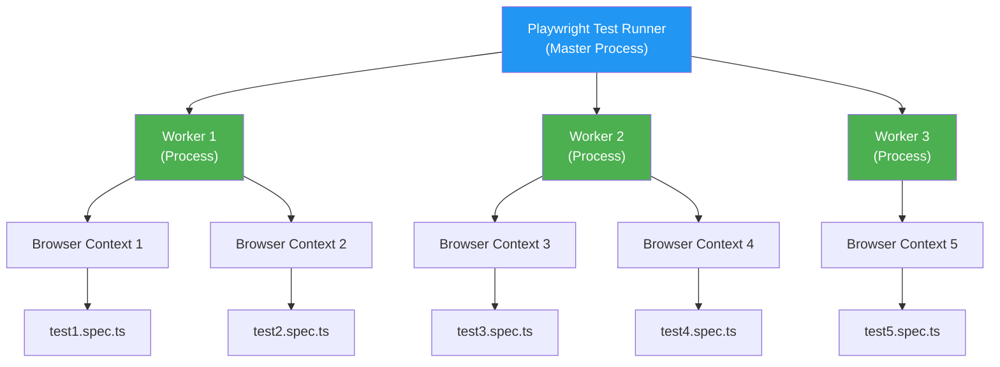
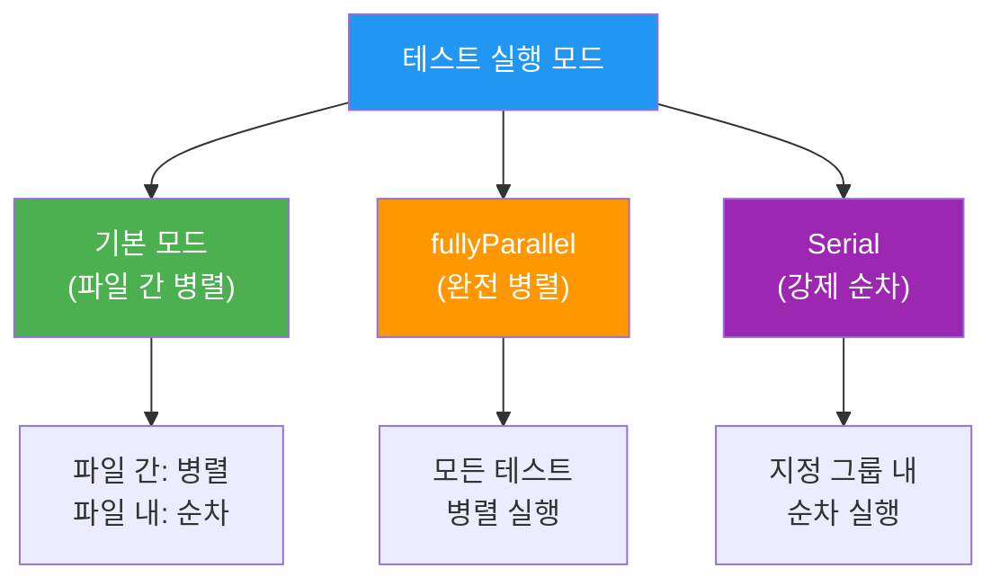
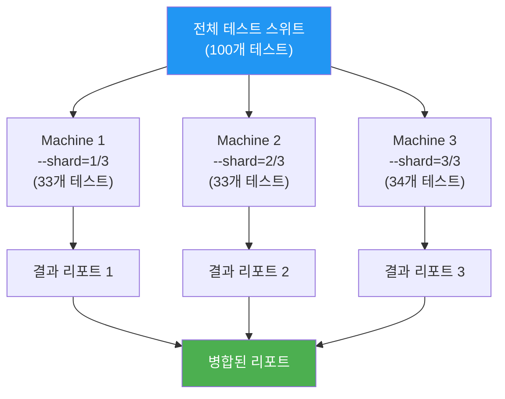
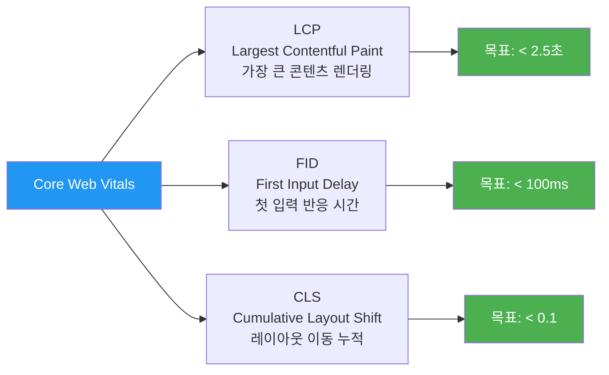

# 05. 병렬 실행과 성능 측정 - 학습 (LEARN)

**작성일**: 2026-02-05
**학습 목표**: Playwright의 병렬 실행 메커니즘과 웹 페이지 성능 측정 방법 습득
**예상 학습 시간**: 90분

---

## 학습 목표

이 섹션을 완료하면 다음을 할 수 있습니다:

1. **Worker 모델 아키텍처**를 이해하고 병렬 실행 최적화
2. **fullyParallel과 serial 모드**를 상황에 맞게 선택
3. **Test Sharding**으로 CI/CD 파이프라인에서 테스트 분산
4. **Performance API**로 페이지 로딩 성능 측정
5. **Core Web Vitals**(LCP, FID, CLS) 측정 및 검증
6. **Trace Viewer**로 병렬 실행 문제 디버깅

---

## 1. Worker 모델 아키텍처

### 1.1 Worker란?

Playwright는 **테스트를 병렬로 실행하기 위해 Worker 프로세스**를 생성합니다. 각 Worker는 독립적인 OS 프로세스로, 완전히 격리된 환경에서 테스트를 실행합니다.



**핵심 개념**:
- **Master Process**: 테스트 파일을 Worker에 분배하고 결과 수집
- **Worker Process**: 실제 테스트 실행 (각 Worker는 독립적인 OS 프로세스)
- **Browser Context**: 테스트 격리 단위 (쿠키, 스토리지 격리)

---

### 1.2 Worker 개수 설정

```typescript
// playwright.config.ts
import { defineConfig } from '@playwright/test';

export default defineConfig({
  // 방법 1: 고정 개수
  workers: 4,

  // 방법 2: CPU 코어 비율
  workers: '50%', // CPU 코어의 50%

  // 방법 3: 환경별 설정
  workers: process.env.CI ? 2 : undefined, // CI에서는 2개, 로컬은 자동

  // 방법 4: 동적 계산
  workers: Math.max(1, Math.floor(require('os').cpus().length / 2)),
});
```

**CLI에서 설정** (Config보다 우선):
```bash
# 1개 Worker (순차 실행)
npx playwright test --workers=1

# 4개 Worker
npx playwright test --workers=4

# CPU 코어 수만큼
npx playwright test --workers=100%
```

**권장 설정**:

| 환경 | Worker 개수 | 이유 |
|------|------------|------|
| **로컬 개발** | CPU의 50% | 다른 작업에 리소스 남김 |
| **CI (GitHub Actions)** | 2개 | 안정성 우선, 리소스 제한 |
| **강력한 CI 서버** | 4-8개 | 빠른 피드백 |
| **디버깅 시** | 1개 | 로그 순서 명확 |

---

### 1.3 Worker와 테스트 격리

각 테스트는 **새로운 BrowserContext**에서 실행되어 완전히 격리됩니다.

```typescript
// Worker 1
test('Test A', async ({ page }) => {
  // 새로운 BrowserContext 생성
  await page.goto('http://localhost:3002');
  await page.evaluate(() => localStorage.setItem('key', 'value-A'));
});

test('Test B', async ({ page }) => {
  // 다른 BrowserContext 생성 (Test A의 localStorage 접근 불가)
  await page.goto('http://localhost:3002');
  const value = await page.evaluate(() => localStorage.getItem('key'));
  expect(value).toBeNull(); // 격리되어 있음
});
```

**격리 범위**:
- ✅ **쿠키, 로컬 스토리지, 세션 스토리지** - 테스트마다 격리
- ✅ **캐시** - 테스트마다 초기화
- ✅ **네트워크 상태** - 독립적
- ❌ **Worker 메모리 (전역 변수)** - 같은 Worker 내 공유

```typescript
// 같은 Worker에서 실행되는 테스트는 메모리 공유 가능
let sharedCounter = 0;

test('Test 1', async ({ page }) => {
  sharedCounter++; // 1
  console.log('Counter:', sharedCounter);
});

test('Test 2', async ({ page }) => {
  sharedCounter++; // 2 (같은 Worker라면)
  console.log('Counter:', sharedCounter);
});

// 주의: Worker 분배 순서는 보장되지 않으므로 의존하지 말 것!
```

---

## 2. 병렬 실행 모드

### 2.1 기본 모드 (파일 간 병렬, 파일 내 순차)

Playwright의 기본 동작은 **파일 단위로 병렬 실행, 파일 내부는 순차 실행**입니다.

```typescript
// test1.spec.ts
test('Test 1-1', async ({ page }) => {
  console.log('Test 1-1 시작:', new Date().toISOString());
  await page.waitForTimeout(2000);
});

test('Test 1-2', async ({ page }) => {
  console.log('Test 1-2 시작:', new Date().toISOString());
  // Test 1-1이 끝난 후 시작 (순차)
});

// test2.spec.ts (다른 Worker에서 병렬 실행)
test('Test 2-1', async ({ page }) => {
  console.log('Test 2-1 시작:', new Date().toISOString());
  // test1.spec.ts와 동시에 실행 (병렬)
});
```

**실행 타임라인**:
```
Worker 1: [Test 1-1 ──────] [Test 1-2 ──────]
Worker 2: [Test 2-1 ──────] [Test 2-2 ──────]
          └─ 동시 시작 ─┘
```

---

### 2.2 fullyParallel 모드 (파일 내 병렬)

파일 내부 테스트도 병렬로 실행하려면 `fullyParallel` 설정을 사용합니다.

```typescript
// playwright.config.ts - 전역 설정
export default defineConfig({
  fullyParallel: true, // 모든 테스트 파일에 적용
});
```

```typescript
// 파일별 설정
test.describe.configure({ mode: 'parallel' });

test('Test A', async ({ page }) => {
  await page.waitForTimeout(2000);
});

test('Test B', async ({ page }) => {
  await page.waitForTimeout(2000);
});

// Test A와 B가 동시에 시작 (다른 Worker 또는 같은 Worker의 다른 Context)
```

**실행 타임라인**:
```
Worker 1: [Test A ──────]
Worker 2: [Test B ──────]
          └─ 동시 시작 ─┘
총 시간: 2초 (순차였다면 4초)
```

---

### 2.3 Serial 모드 (강제 순차)

테스트 간 의존성이 있거나 순서가 중요할 때 사용합니다.

```typescript
test.describe.serial('TPS 티켓 생성 플로우', () => {
  let ticketId: string;

  test('Step 1: 티켓 생성', async ({ page }) => {
    await page.goto('http://localhost:3002/ticket-create');
    await page.getByLabel('제목').fill('Test Ticket');
    await page.getByRole('button', { name: '저장' }).click();

    // URL에서 티켓 ID 추출
    await page.waitForURL(/\/ticket\/(\d+)/);
    ticketId = page.url().match(/\/ticket\/(\d+)/)?.[1] || '';
  });

  test('Step 2: 티켓 수정', async ({ page }) => {
    // Step 1에서 생성한 티켓 사용
    await page.goto(`http://localhost:3002/ticket/${ticketId}`);
    await page.getByRole('button', { name: '수정' }).click();
    await page.getByLabel('제목').fill('Updated Ticket');
    await page.getByRole('button', { name: '저장' }).click();
  });

  test('Step 3: 티켓 삭제', async ({ page }) => {
    await page.goto(`http://localhost:3002/ticket/${ticketId}`);
    await page.getByRole('button', { name: '삭제' }).click();
  });
});
```

**주의사항**:
- Serial 테스트 중 하나라도 실패하면 **이후 테스트는 건너뜀**(skip)
- 같은 Worker에서 실행되므로 메모리 공유 가능
- 과도한 serial 사용은 병렬 실행 이점 감소

---

### 2.4 모드 비교



| 모드 | 설정 | 사용 시점 | 실행 시간 |
|------|------|----------|----------|
| **기본** | 없음 | 대부분의 경우 | 보통 |
| **fullyParallel** | `fullyParallel: true` | 독립적인 테스트 많을 때 | 빠름 |
| **Serial** | `test.describe.serial()` | 테스트 간 의존성 있을 때 | 느림 |

---

## 3. Test Sharding (CI 분산)

### 3.1 Sharding이란?

Sharding은 **전체 테스트 스위트를 여러 머신에 분산**하여 실행 시간을 단축하는 기법입니다.



---

### 3.2 Sharding 사용법

```bash
# 전체를 3개 샤드로 분할

# Machine 1 (첫 번째 1/3)
npx playwright test --shard=1/3

# Machine 2 (두 번째 1/3)
npx playwright test --shard=2/3

# Machine 3 (마지막 1/3)
npx playwright test --shard=3/3
```

**Sharding 알고리즘**:
- 테스트 파일 경로를 **해시**하여 균등 분배
- 각 샤드는 **파일 단위**로 분배됨 (파일을 쪼개지 않음)
- 실행 시간이 긴 파일도 고려하여 분배 (휴리스틱)

---

### 3.3 CI에서 Sharding 설정 (GitHub Actions)

```yaml
# .github/workflows/playwright.yml
name: Playwright Tests

on: [push, pull_request]

jobs:
  test:
    timeout-minutes: 60
    runs-on: ubuntu-latest
    strategy:
      fail-fast: false # 한 샤드 실패해도 다른 샤드 계속 실행
      matrix:
        shard: [1, 2, 3, 4] # 4개 머신으로 분산
    steps:
      - uses: actions/checkout@v3

      - uses: actions/setup-node@v3
        with:
          node-version: 18

      - name: Install dependencies
        run: npm ci

      - name: Install Playwright Browsers
        run: npx playwright install --with-deps

      - name: Run Playwright tests (Shard ${{ matrix.shard }}/4)
        run: npx playwright test --shard=${{ matrix.shard }}/4

      - name: Upload test results
        uses: actions/upload-artifact@v3
        if: always()
        with:
          name: playwright-report-${{ matrix.shard }}
          path: playwright-report/
          retention-days: 30

  merge-reports:
    # 모든 샤드 완료 후 리포트 병합
    if: always()
    needs: test
    runs-on: ubuntu-latest
    steps:
      - uses: actions/checkout@v3

      - uses: actions/setup-node@v3
        with:
          node-version: 18

      - name: Download all reports
        uses: actions/download-artifact@v3
        with:
          path: all-reports

      - name: Merge reports
        run: npx playwright merge-reports --reporter html ./all-reports

      - name: Upload merged report
        uses: actions/upload-artifact@v3
        with:
          name: playwright-report-merged
          path: playwright-report/
```

**효과**:
- 테스트 100개, 실행 시간 20분
- 4개 샤드 → 약 5분 (4배 빠름)

---

### 3.4 Sharding vs Workers 비교

| 항목 | Workers | Sharding |
|------|---------|----------|
| **범위** | 한 머신 내 병렬 | 여러 머신 분산 |
| **설정** | `--workers=N` | `--shard=X/Y` |
| **목적** | 멀티코어 활용 | CI 시간 단축 |
| **비용** | 무료 (로컬 CPU) | CI 머신 비용 증가 |
| **조합** | 각 샤드에서 Workers 사용 가능 | ✅ |

**조합 예시**:
```bash
# Machine 1: Shard 1/3, 4 Workers
npx playwright test --shard=1/3 --workers=4

# Machine 2: Shard 2/3, 4 Workers
npx playwright test --shard=2/3 --workers=4

# 효과: 3 머신 × 4 Workers = 12배 병렬 실행
```

---

## 4. 성능 측정 (Performance API)

### 4.1 Navigation Timing API

페이지 로딩 단계별 시간을 측정합니다.

```typescript
test('TPS 티켓 목록 로딩 성능', async ({ page }) => {
  await page.goto('http://localhost:3002/ticket-list');

  const metrics = await page.evaluate(() => {
    const nav = performance.getEntriesByType('navigation')[0] as PerformanceNavigationTiming;

    return {
      // DNS 조회 시간
      dns: nav.domainLookupEnd - nav.domainLookupStart,

      // TCP 연결 시간
      tcp: nav.connectEnd - nav.connectStart,

      // TLS 핸드셰이크 (HTTPS)
      tls: nav.secureConnectionStart > 0
        ? nav.connectEnd - nav.secureConnectionStart
        : 0,

      // 요청 → 응답 (TTFB: Time to First Byte)
      ttfb: nav.responseStart - nav.requestStart,

      // 응답 다운로드
      download: nav.responseEnd - nav.responseStart,

      // DOM 파싱
      domParse: nav.domInteractive - nav.responseEnd,

      // DOMContentLoaded
      domContentLoaded: nav.domContentLoadedEventEnd - nav.domContentLoadedEventStart,

      // 전체 로딩 (Load 이벤트)
      load: nav.loadEventEnd - nav.fetchStart,
    };
  });

  console.log('성능 지표:', metrics);

  // 검증
  expect(metrics.ttfb).toBeLessThan(500); // 500ms 이내
  expect(metrics.load).toBeLessThan(3000); // 3초 이내
});
```

**Navigation Timing 단계**:
```
fetchStart ─┐
            ├─ DNS Lookup ──┐
domainLookupEnd             │
                            ├─ TCP Connect ──┐
connectEnd                                   │
                                             ├─ Request ──┐
requestStart                                             │
                                                         ├─ TTFB ──┐
responseStart                                                     │
                                                                  ├─ Download ──┐
responseEnd                                                                    │
                                                                               ├─ DOM Parse ──┐
domInteractive                                                                                │
                                                                                              ├─ Load
loadEventEnd
```

---

### 4.2 Resource Timing API

개별 리소스(CSS, JS, 이미지) 로딩 시간을 측정합니다.

```typescript
test('정적 리소스 로딩 분석', async ({ page }) => {
  await page.goto('http://localhost:3002/ticket-list');

  const resources = await page.evaluate(() => {
    return performance.getEntriesByType('resource').map((entry: PerformanceResourceTiming) => ({
      name: entry.name,
      type: entry.initiatorType, // 'script', 'css', 'img', 'fetch'
      duration: entry.duration, // 총 로딩 시간
      size: entry.transferSize, // 전송 크기 (바이트)
      cached: entry.transferSize === 0, // 캐시 여부
    }));
  });

  // CSS 파일 분석
  const cssFiles = resources.filter(r => r.type === 'css');
  console.log('CSS 파일 수:', cssFiles.length);
  console.log('CSS 평균 로딩:', cssFiles.reduce((a, b) => a + b.duration, 0) / cssFiles.length, 'ms');

  // JS 파일 분석
  const jsFiles = resources.filter(r => r.type === 'script');
  console.log('JS 파일 수:', jsFiles.length);
  console.log('JS 평균 로딩:', jsFiles.reduce((a, b) => a + b.duration, 0) / jsFiles.length, 'ms');

  // 가장 느린 리소스
  const slowest = resources.sort((a, b) => b.duration - a.duration)[0];
  console.log('가장 느린 리소스:', slowest.name, slowest.duration, 'ms');

  // 검증: 큰 파일 경고
  resources.forEach(r => {
    if (r.size > 500 * 1024) { // 500KB 초과
      console.warn('큰 파일 발견:', r.name, (r.size / 1024).toFixed(2), 'KB');
    }
  });
});
```

---

### 4.3 Core Web Vitals

Google이 정의한 핵심 사용자 경험 지표를 측정합니다.



#### LCP (Largest Contentful Paint)

가장 큰 콘텐츠가 화면에 렌더링되는 시간입니다.

```typescript
test('LCP 측정 - TPS 티켓 목록', async ({ page }) => {
  await page.goto('http://localhost:3002/ticket-list');

  const lcp = await page.evaluate(() => {
    return new Promise<number>((resolve) => {
      new PerformanceObserver((list) => {
        const entries = list.getEntries();
        const lastEntry = entries[entries.length - 1] as any;
        resolve(lastEntry.renderTime || lastEntry.loadTime);
      }).observe({ type: 'largest-contentful-paint', buffered: true });

      // 타임아웃: 5초 후 측정 종료
      setTimeout(() => resolve(0), 5000);
    });
  });

  console.log('LCP:', lcp, 'ms');
  expect(lcp).toBeLessThan(2500); // 2.5초 목표
});
```

#### CLS (Cumulative Layout Shift)

레이아웃 이동 누적 점수입니다. (0에 가까울수록 좋음)

```typescript
test('CLS 측정 - 레이아웃 안정성', async ({ page }) => {
  await page.goto('http://localhost:3002/ticket-list');

  // 페이지 상호작용 (스크롤, 클릭)
  await page.mouse.wheel(0, 500);
  await page.waitForTimeout(1000);

  const cls = await page.evaluate(() => {
    return new Promise<number>((resolve) => {
      let clsValue = 0;

      new PerformanceObserver((list) => {
        for (const entry of list.getEntries() as any[]) {
          if (!entry.hadRecentInput) {
            clsValue += entry.value;
          }
        }
      }).observe({ type: 'layout-shift', buffered: true });

      setTimeout(() => resolve(clsValue), 3000);
    });
  });

  console.log('CLS:', cls);
  expect(cls).toBeLessThan(0.1); // 0.1 목표
});
```

---

### 4.4 실전 성능 테스트 패턴

```typescript
import { test, expect } from '@playwright/test';

test.describe('TPS 성능 테스트', () => {
  // 병렬 실행 (각 테스트 독립적)
  test.describe.configure({ mode: 'parallel' });

  test('초기 로딩 성능 (Cold Start)', async ({ page }) => {
    // 캐시 비활성화
    await page.route('**/*', route => route.continue());

    const startTime = Date.now();
    await page.goto('http://localhost:3002/ticket-list');

    const metrics = await page.evaluate(() => {
      const nav = performance.getEntriesByType('navigation')[0] as PerformanceNavigationTiming;
      return {
        ttfb: nav.responseStart - nav.requestStart,
        domInteractive: nav.domInteractive - nav.fetchStart,
        load: nav.loadEventEnd - nav.fetchStart,
      };
    });

    console.log('Cold Start 지표:', metrics);
    expect(metrics.load).toBeLessThan(5000); // 5초 (첫 로딩)
  });

  test('캐시 후 로딩 성능 (Warm Start)', async ({ page }) => {
    // 첫 로딩 (캐시 생성)
    await page.goto('http://localhost:3002/ticket-list');

    // 두 번째 로딩 (캐시 사용)
    await page.goto('http://localhost:3002/ticket-list');

    const metrics = await page.evaluate(() => {
      const nav = performance.getEntriesByType('navigation')[0] as PerformanceNavigationTiming;
      return {
        load: nav.loadEventEnd - nav.fetchStart,
      };
    });

    console.log('Warm Start 지표:', metrics);
    expect(metrics.load).toBeLessThan(1000); // 1초 (캐시 사용)
  });

  test('AJAX 요청 성능 (필터 적용)', async ({ page }) => {
    await page.goto('http://localhost:3002/ticket-list');

    const startTime = Date.now();

    // 상태 필터 변경
    await page.getByLabel('상태').selectOption('완료');

    // API 응답 대기
    await page.waitForResponse(resp =>
      resp.url().includes('/api/tickets?status=completed')
    );

    // UI 업데이트 대기
    await page.getByRole('row').filter({ hasText: '완료' }).first().waitFor();

    const elapsedTime = Date.now() - startTime;
    console.log('AJAX 필터 시간:', elapsedTime, 'ms');
    expect(elapsedTime).toBeLessThan(1000); // 1초 이내
  });

  test('대량 데이터 렌더링 (1000개 티켓)', async ({ page }) => {
    await page.goto('http://localhost:3002/ticket-list?count=1000');

    // 모든 행이 렌더링될 때까지 대기
    await page.getByRole('row').nth(999).waitFor({ timeout: 10000 });

    const metrics = await page.evaluate(() => {
      const nav = performance.getEntriesByType('navigation')[0] as PerformanceNavigationTiming;
      return {
        domInteractive: nav.domInteractive - nav.fetchStart,
      };
    });

    console.log('1000개 렌더링 시간:', metrics.domInteractive, 'ms');
    expect(metrics.domInteractive).toBeLessThan(3000); // 3초 이내
  });
});
```

---

## 5. Tracing과 디버깅

### 5.1 Trace 기록 설정

```typescript
// playwright.config.ts
export default defineConfig({
  use: {
    // 옵션 1: 모든 테스트에서 Trace 기록
    trace: 'on',

    // 옵션 2: 첫 재시도할 때만 (권장)
    trace: 'on-first-retry',

    // 옵션 3: 실패 시에만 보관
    trace: 'retain-on-failure',

    // 옵션 4: 조건부 설정
    trace: process.env.CI ? 'on-first-retry' : 'off',
  },
});
```

**CLI에서 설정**:
```bash
# Trace 활성화
npx playwright test --trace on

# 특정 테스트만 Trace
npx playwright test ticket-create.spec.ts --trace on
```

---

### 5.2 Trace Viewer 사용

```bash
# Trace 파일 열기
npx playwright show-trace trace.zip

# 또는 자동 생성된 경로
npx playwright show-trace test-results/ticket-create-chromium/trace.zip
```

**Trace Viewer UI**:
```
┌─────────────────────────────────────────────┐
│  Trace Viewer                               │
├─────────────────────────────────────────────┤
│  Timeline: ▶️ Play | ⏸️ Pause | ⏭️ Step      │
│  [━━━━━━━━━━━━▶───────────] 2.5s / 5s      │
├─────────────────────────────────────────────┤
│  Actions:                                   │
│  00:00.123  page.goto(...)                  │
│  00:01.456  page.click('.btn')              │
│  00:02.789  expect(locator).toBeVisible()   │
├─────────────────────────────────────────────┤
│  Network: (15 requests)                     │
│  GET /api/tickets → 200 (345ms)            │
│  GET /static/app.js → 200 (89ms)           │
├─────────────────────────────────────────────┤
│  Console:                                   │
│  [log] Test started at 10:23:45             │
│  [warn] Slow resource: app.js (2.3s)        │
├─────────────────────────────────────────────┤
│  Screenshots: 🖼️ Before | 🖼️ After          │
│  Metadata: Worker 2, Retry 0                │
└─────────────────────────────────────────────┘
```

---

### 5.3 병렬 실행 문제 디버깅 예시

**문제**: 병렬 실행 시 간헐적으로 실패하는 테스트

```typescript
test('간헐적 실패 테스트', async ({ page }) => {
  await page.goto('http://localhost:3002/ticket-create');
  await page.getByLabel('제목').fill('Test');
  await page.getByRole('button', { name: '저장' }).click();

  // 가끔 실패: "저장되었습니다" 메시지가 안 보임
  await expect(page.getByText('저장되었습니다')).toBeVisible();
});
```

**Trace Viewer 분석 단계**:

1. **Timeline 확인**
   - 각 단계 실행 시간 확인
   - API 응답 대기 시간 분석

2. **Network 탭 확인**
   - POST /api/tickets 상태 코드 확인
   - 응답 시간이 평소보다 긴지 확인

3. **Screenshots 확인**
   - 메시지가 화면에 나타났다가 사라졌는지
   - 로딩 인디케이터가 남아있는지

4. **Console 로그 확인**
   - JavaScript 에러 발생했는지
   - Worker Index 확인 (특정 Worker에서만 실패?)

**해결 방법**:
```typescript
test('개선된 테스트', async ({ page }) => {
  await page.goto('http://localhost:3002/ticket-create');
  await page.getByLabel('제목').fill('Test');

  // API 응답 대기 추가
  const responsePromise = page.waitForResponse(resp =>
    resp.url().includes('/api/tickets') && resp.request().method() === 'POST'
  );

  await page.getByRole('button', { name: '저장' }).click();

  // 응답 먼저 확인
  const response = await responsePromise;
  expect(response.status()).toBe(201);

  // 그 다음 메시지 확인 (timeout 증가)
  await expect(page.getByText('저장되었습니다')).toBeVisible({ timeout: 5000 });
});
```

---

## 6. 종합 실전 예시

```typescript
import { test, expect } from '@playwright/test';

test.describe('TPS 티켓 관리 E2E (병렬 최적화)', () => {
  // 독립적인 테스트는 병렬로
  test.describe.configure({ mode: 'parallel' });

  test('티켓 생성 성능 + 기능 검증', async ({ page }) => {
    const startTime = Date.now();

    // 1. 생성 페이지 이동
    await page.goto('http://localhost:3002/ticket-create');

    // 2. 폼 입력
    await page.getByLabel('제목').fill('[CI/CD] Jenkins 구축');
    await page.getByLabel('담당자').selectOption('홍길동');

    // 3. 저장 (성능 측정 시작)
    const saveStartTime = Date.now();
    await page.getByRole('button', { name: '저장' }).click();

    // 4. API 응답 대기
    const response = await page.waitForResponse(resp =>
      resp.url().includes('/api/tickets') && resp.request().method() === 'POST'
    );
    const apiTime = Date.now() - saveStartTime;

    // 5. 성공 메시지 확인
    await expect(page.getByText('티켓이 생성되었습니다')).toBeVisible();

    // 6. 상세 페이지로 이동 확인
    await expect(page).toHaveURL(/\/ticket\/\d+/);

    // 7. 전체 플로우 시간 측정
    const totalTime = Date.now() - startTime;

    // 성능 검증
    console.log('API 응답 시간:', apiTime, 'ms');
    console.log('전체 플로우 시간:', totalTime, 'ms');
    expect(apiTime).toBeLessThan(1000); // 1초 이내
    expect(totalTime).toBeLessThan(5000); // 5초 이내
  });

  test('티켓 목록 필터링 성능', async ({ page }) => {
    await page.goto('http://localhost:3002/ticket-list');

    // 초기 렌더링 성능
    const initialMetrics = await page.evaluate(() => {
      const nav = performance.getEntriesByType('navigation')[0] as PerformanceNavigationTiming;
      return {
        load: nav.loadEventEnd - nav.fetchStart,
      };
    });

    expect(initialMetrics.load).toBeLessThan(3000);

    // 필터 성능
    const filterStartTime = Date.now();
    await page.getByLabel('상태').selectOption('완료');
    await page.waitForResponse(resp => resp.url().includes('status=completed'));
    await page.getByRole('row').filter({ hasText: '완료' }).first().waitFor();
    const filterTime = Date.now() - filterStartTime;

    expect(filterTime).toBeLessThan(1000);
  });
});

// Serial이 필요한 플로우 (생성 → 수정 → 삭제)
test.describe.serial('티켓 생명주기 (순차 실행)', () => {
  let ticketId: string;

  test('1. 티켓 생성', async ({ page }) => {
    await page.goto('http://localhost:3002/ticket-create');
    await page.getByLabel('제목').fill('Lifecycle Test');
    await page.getByRole('button', { name: '저장' }).click();

    await page.waitForURL(/\/ticket\/(\d+)/);
    ticketId = page.url().match(/\/ticket\/(\d+)/)?.[1] || '';
    expect(ticketId).toBeTruthy();
  });

  test('2. 티켓 수정', async ({ page }) => {
    await page.goto(`http://localhost:3002/ticket/${ticketId}`);
    await page.getByRole('button', { name: '수정' }).click();
    await page.getByLabel('제목').fill('Updated Lifecycle Test');
    await page.getByRole('button', { name: '저장' }).click();

    await expect(page.getByRole('heading', { level: 1 })).toContainText('Updated');
  });

  test('3. 티켓 삭제', async ({ page }) => {
    await page.goto(`http://localhost:3002/ticket/${ticketId}`);

    page.on('dialog', dialog => dialog.accept());
    await page.getByRole('button', { name: '삭제' }).click();

    await expect(page).toHaveURL('http://localhost:3002/ticket-list');
  });
});
```

---

## 핵심 요약

### ✅ 병렬 실행 최적화

1. **Worker 개수**: 로컬 CPU 50%, CI는 2-4개
2. **fullyParallel**: 독립적인 테스트는 병렬로
3. **Serial**: 의존성 있는 플로우는 순차로
4. **Sharding**: CI에서 여러 머신으로 분산
5. **테스트 격리**: BrowserContext로 완전 격리

### ✅ 성능 측정

1. **Navigation Timing**: 페이지 로딩 단계별 시간
2. **Resource Timing**: 개별 리소스 로딩 시간
3. **Core Web Vitals**: LCP < 2.5s, CLS < 0.1
4. **AJAX 성능**: 필터/검색 반응 시간 < 1s
5. **대량 데이터**: 렌더링 시간 측정

### ❌ 피해야 할 것

1. **과도한 Serial 사용** - 병렬 이점 감소
2. **Trace 항상 활성화** - 성능 저하, 디스크 사용
3. **Worker 과다 설정** - 오버헤드 증가
4. **성능 테스트를 모든 PR에** - CI 시간 증가
5. **Sharding 없이 대규모 스위트** - 느린 CI

---

## 다음 학습

### 실습 과제
→ `practice/` 폴더에서 병렬 실행 최적화 및 성능 테스트 작성
- fullyParallel vs serial 비교
- Sharding 설정 및 실행
- Performance API 활용 측정

### 다음 섹션
→ `06-page-object-model/` - Page Object Model 패턴으로 테스트 재사용성 향상

---

## 참고 자료

- [Playwright Parallelism 공식 문서](https://playwright.dev/docs/test-parallel)
- [Test Sharding](https://playwright.dev/docs/test-sharding)
- [Performance API - MDN](https://developer.mozilla.org/en-US/docs/Web/API/Performance_API)
- [Core Web Vitals](https://web.dev/vitals/)
- [Trace Viewer](https://playwright.dev/docs/trace-viewer)
