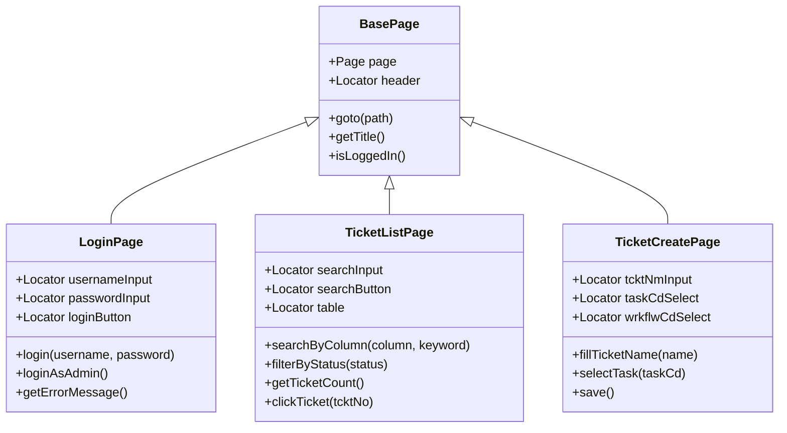

# 06. Page Object Model (POM) 패턴

## 학습 목표

- Page Object Model (POM) 패턴의 개념과 필요성을 이해합니다
- Playwright에서 POM을 구현하는 방법을 학습합니다
- BasePage 상속 구조와 페이지별 특화 클래스를 설계합니다
- TPS 티켓 시스템에 POM 패턴을 적용합니다
- POM 패턴의 안티패턴과 모범 사례를 파악합니다

---

## 1. Page Object Model이란?

**Page Object Model (POM)**은 UI 테스트에서 페이지의 구조와 동작을 클래스로 캡슐화하는 디자인 패턴입니다.

### 문제 상황

POM 없이 작성한 테스트 코드:

```typescript
// ❌ 로케이터와 로직이 테스트 코드에 직접 노출
test('로그인 후 티켓 검색', async ({ page }) => {
  // 로그인
  await page.goto('http://localhost:3002/login');
  await page.locator('#username').fill('admin');
  await page.locator('#password').fill('admin123');
  await page.locator('button[type="submit"]').click();

  // 티켓 검색
  await page.goto('http://localhost:3002/tickets');
  await page.locator('#searchColumn').selectOption('tcktNm');
  await page.locator('#searchInput').fill('CI/CD 개선');
  await page.locator('#searchBtn').click();

  await expect(page.locator('.ticket-row')).toHaveCount(1);
});
```

**문제점**:
1. 로그인 ID 선택자가 `#username`에서 `[data-testid="username"]`로 변경되면 → **모든 테스트 수정 필요**
2. 로그인 로직이 10개 테스트에 중복되면 → **유지보수 지옥**
3. 페이지 구조를 모르면 테스트 코드 이해 어려움 → **가독성 저하**

### POM 적용 후

```typescript
// ✅ 로케이터와 로직을 Page Object에 캡슐화
test('로그인 후 티켓 검색', async ({ page }) => {
  const loginPage = new LoginPage(page);
  await loginPage.goto();
  await loginPage.login('admin', 'admin123');

  const ticketListPage = new TicketListPage(page);
  await ticketListPage.searchByColumn('tcktNm', 'CI/CD 개선');

  await expect(ticketListPage.getTicketRows()).toHaveCount(1);
});
```

**장점**:
1. **유지보수성**: 로케이터 변경 시 Page Object만 수정 → 테스트는 그대로
2. **재사용성**: 로그인 로직을 여러 테스트에서 `loginPage.login()` 호출로 재사용
3. **가독성**: 테스트 코드가 비즈니스 시나리오처럼 읽힘

---

## 2. POM 구조



### BasePage (부모 클래스)

모든 페이지에 공통으로 필요한 기능을 정의합니다:
- `page` 인스턴스 관리
- 페이지 이동 (`goto()`)
- 타이틀 조회 (`getTitle()`)
- 로그인 상태 확인 (`isLoggedIn()`)

### 각 Page Object (자식 클래스)

페이지별 특화된 로케이터와 동작을 정의합니다:
- **LoginPage**: 로그인 폼 처리
- **TicketListPage**: 티켓 목록 검색/필터/페이징
- **TicketCreatePage**: 티켓 생성 폼 처리

---

## 3. Playwright에서 POM 구현 패턴

### 3.1 Page Fixture 활용

Playwright의 `Page` 인스턴스를 생성자로 받습니다:

```typescript
import { Page, Locator } from '@playwright/test';

export class LoginPage {
  readonly page: Page;
  readonly usernameInput: Locator;
  readonly passwordInput: Locator;

  constructor(page: Page) {
    this.page = page;
    this.usernameInput = page.locator('#username');
    this.passwordInput = page.locator('#password');
  }

  async login(username: string, password: string) {
    await this.usernameInput.fill(username);
    await this.passwordInput.fill(password);
    await this.loginButton.click();
  }
}
```

### 3.2 Locator는 readonly로 선언

로케이터는 생성 시 한 번 정의되고 변경되지 않습니다:

```typescript
// ✅ readonly로 선언
readonly searchInput: Locator;

// ❌ 변경 가능하면 실수로 덮어쓸 위험
searchInput: Locator;
```

### 3.3 메서드는 비즈니스 의미 담기

```typescript
// ✅ 비즈니스 의미가 명확
async loginAsAdmin() {
  await this.login('admin', 'admin123');
}

// ❌ 너무 저수준
async fillUsernameField(value: string) {
  await this.usernameInput.fill(value);
}
```

---

## 4. TPS 프로젝트 POM 예시

### 4.1 LoginPage

```typescript
export class LoginPage extends BasePage {
  readonly usernameInput: Locator;
  readonly passwordInput: Locator;
  readonly loginButton: Locator;
  readonly errorMessage: Locator;

  constructor(page: Page) {
    super(page);
    this.usernameInput = page.locator('#username');
    this.passwordInput = page.locator('#password');
    this.loginButton = page.locator('button[type="submit"]');
    this.errorMessage = page.locator('.error-message');
  }

  async goto() {
    await super.goto('/login');
  }

  async login(username: string, password: string) {
    await this.usernameInput.fill(username);
    await this.passwordInput.fill(password);
    await this.loginButton.click();
  }

  async loginAsAdmin() {
    await this.login('admin', 'admin123');
  }

  async getErrorMessage() {
    return this.errorMessage.textContent();
  }
}
```

### 4.2 TicketListPage

```typescript
export class TicketListPage extends BasePage {
  readonly searchInput: Locator;
  readonly searchButton: Locator;
  readonly columnSelect: Locator;
  readonly table: Locator;

  constructor(page: Page) {
    super(page);
    this.searchInput = page.locator('#searchInput');
    this.searchButton = page.locator('#searchBtn');
    this.columnSelect = page.locator('#searchColumn');
    this.table = page.locator('#ticketTable');
  }

  async goto() {
    await super.goto('/tickets');
  }

  async searchByColumn(column: string, keyword: string) {
    await this.columnSelect.selectOption(column);
    await this.searchInput.fill(keyword);
    await this.searchButton.click();
    await this.page.waitForLoadState('networkidle');
  }

  async filterByStatus(status: string) {
    await this.page.locator(`[data-status="${status}"]`).click();
    await this.page.waitForLoadState('networkidle');
  }

  async getTicketCount() {
    return this.page.locator('.ticket-row').count();
  }

  async clickTicket(tcktNo: string) {
    await this.page.locator(`[data-tckt-no="${tcktNo}"]`).click();
  }
}
```

---

## 5. POM의 장점

### 5.1 유지보수성

UI 변경 시 Page Object만 수정하면 모든 테스트가 자동으로 업데이트됩니다.

**예시**: 로그인 버튼 선택자 변경

```typescript
// 변경 전: button[type="submit"]
// 변경 후: [data-testid="login-button"]

// ✅ LoginPage.ts 한 곳만 수정
this.loginButton = page.locator('[data-testid="login-button"]');

// 테스트 코드는 수정 불필요!
await loginPage.login('admin', 'admin123'); // 그대로 동작
```

### 5.2 재사용성

동일한 동작을 여러 테스트에서 메서드 호출로 재사용합니다.

```typescript
// 10개 테스트에서 loginAsAdmin() 재사용
test('티켓 생성 테스트', async ({ page }) => {
  const loginPage = new LoginPage(page);
  await loginPage.goto();
  await loginPage.loginAsAdmin(); // ← 재사용

  // 티켓 생성 로직...
});

test('티켓 검색 테스트', async ({ page }) => {
  const loginPage = new LoginPage(page);
  await loginPage.goto();
  await loginPage.loginAsAdmin(); // ← 재사용

  // 티켓 검색 로직...
});
```

### 5.3 가독성

테스트 코드가 비즈니스 시나리오처럼 읽힙니다.

```typescript
// ✅ 시나리오가 명확하게 읽힘
test('CICD 티켓 생성 후 검색 확인', async ({ page }) => {
  // Given: 관리자로 로그인
  await loginPage.goto();
  await loginPage.loginAsAdmin();

  // When: CICD 티켓 생성
  await createPage.goto();
  await createPage.fillTicketName('Jenkins 파이프라인 구축');
  await createPage.selectTask('BUILD');
  await createPage.save();

  // Then: 티켓 목록에서 검색 가능
  await listPage.goto();
  await listPage.searchByColumn('tcktNm', 'Jenkins');
  await expect(listPage.getTicketRows()).toHaveCount(1);
});
```

---

## 6. POM 설계 원칙

### 6.1 Page Object는 액션만, Assertion은 테스트에서

**안티패턴**: Page Object에 `expect()` 포함

```typescript
// ❌ Page Object에 assertion 포함
class LoginPage {
  async login(username: string, password: string) {
    await this.usernameInput.fill(username);
    await this.passwordInput.fill(password);
    await this.loginButton.click();
    await expect(this.page).toHaveURL(/.*tickets/); // ← 여기서 검증
  }
}
```

**문제점**: 로그인 실패 케이스를 테스트하려면 별도 메서드 필요 → 유연성 저하

**모범 사례**: 액션과 검증 분리

```typescript
// ✅ Page Object는 액션만
class LoginPage {
  async login(username: string, password: string) {
    await this.usernameInput.fill(username);
    await this.passwordInput.fill(password);
    await this.loginButton.click();
  }

  async getErrorMessage() {
    return this.errorMessage.textContent(); // 값만 반환
  }
}

// 테스트에서 검증
test('로그인 성공', async ({ page }) => {
  await loginPage.login('admin', 'admin123');
  await expect(page).toHaveURL(/.*tickets/); // ← 여기서 검증
});

test('로그인 실패', async ({ page }) => {
  await loginPage.login('wrong', 'wrong');
  const error = await loginPage.getErrorMessage();
  expect(error).toBe('Invalid credentials'); // ← 여기서 검증
});
```

### 6.2 BasePage는 공통 기능만

**적절한 BasePage**:

```typescript
// ✅ 모든 페이지에 필요한 기능만
class BasePage {
  readonly page: Page;
  readonly header: Locator;

  constructor(page: Page) {
    this.page = page;
    this.header = page.getByTestId('page-header');
  }

  async goto(path: string) {
    await this.page.goto(`http://localhost:3002${path}`);
  }

  async getTitle() {
    return this.page.title();
  }

  async isLoggedIn() {
    const token = await this.page.evaluate(() => localStorage.getItem('token'));
    return !!token;
  }
}
```

**안티패턴**: BasePage에 특정 페이지 로직 포함

```typescript
// ❌ BasePage가 비대해짐
class BasePage {
  async searchByColumn(column: string, keyword: string) { /* ... */ }
  async filterByStatus(status: string) { /* ... */ }
  async fillTicketForm(data: any) { /* ... */ }
  // ... 100+ 메서드
}
```

### 6.3 메서드 추상화 수준 적절하게

**과도한 세분화 (안티패턴)**:

```typescript
// ❌ 너무 저수준
class LoginPage {
  async fillUsername(username: string) { /* ... */ }
  async fillPassword(password: string) { /* ... */ }
  async clickLoginButton() { /* ... */ }
}

// 테스트에서 3번 호출
await loginPage.fillUsername('admin');
await loginPage.fillPassword('admin123');
await loginPage.clickLoginButton();
```

**적절한 추상화**:

```typescript
// ✅ 비즈니스 의미 단위로 묶기
class LoginPage {
  async login(username: string, password: string) {
    await this.usernameInput.fill(username);
    await this.passwordInput.fill(password);
    await this.loginButton.click();
  }
}

// 테스트에서 1번 호출
await loginPage.login('admin', 'admin123');
```

---

## 7. 안티패턴 (피해야 할 것들)

### 안티패턴 1: God Object

BasePage에 모든 기능을 넣어 비대해지는 것.

```typescript
// ❌ God Object
class BasePage {
  async login() { /* ... */ }
  async search() { /* ... */ }
  async filter() { /* ... */ }
  async createTicket() { /* ... */ }
  async updateTicket() { /* ... */ }
  // ... 100+ 메서드
}
```

**해결**: 페이지별로 분리.

### 안티패턴 2: 과도한 Page Object 생성

모달/다이얼로그마다 별도 Page Object 생성.

```typescript
// ❌ 작은 UI마다 클래스 생성
- LoginModalPage.ts
- ConfirmDialogPage.ts
- ErrorDialogPage.ts
```

**해결**: Component Object로 통합.

```typescript
// ✅ 재사용 가능한 컴포넌트로
class ModalComponent {
  async confirm() { /* ... */ }
  async cancel() { /* ... */ }
}
```

### 안티패턴 3: 테스트 로직 포함

Page Object에 테스트 시나리오 로직 포함.

```typescript
// ❌ 테스트 시나리오가 Page Object에
class TicketListPage {
  async createAndSearchTicket(name: string) {
    await this.clickCreateButton();
    await this.fillForm(name);
    await this.save();
    await this.goto();
    await this.searchByColumn('tcktNm', name);
  }
}
```

**해결**: Page Object는 원자적 동작만, 시나리오는 테스트에서.

```typescript
// ✅ 시나리오는 테스트에서
test('티켓 생성 후 검색', async ({ page }) => {
  await createPage.clickCreateButton();
  await createPage.fillForm('Jenkins');
  await createPage.save();

  await listPage.goto();
  await listPage.searchByColumn('tcktNm', 'Jenkins');
});
```

---

## 8. 실습 가이드

### 실습 1: BasePage 구현

`practice/pages/BasePage.ts`를 구현하세요:
- [ ] `page`, `header` 로케이터 정의
- [ ] `goto(path)` 메서드 구현
- [ ] `getTitle()`, `isLoggedIn()` 구현

### 실습 2: LoginPage 구현

`practice/pages/LoginPage.ts`를 구현하세요:
- [ ] `usernameInput`, `passwordInput`, `loginButton` 로케이터 정의
- [ ] `login(username, password)` 메서드 구현
- [ ] `loginAsAdmin()` 편의 메서드 추가
- [ ] `getErrorMessage()` 메서드 구현

### 실습 3: TicketListPage 구현

`practice/pages/TicketListPage.ts`를 구현하세요:
- [ ] 검색/필터/페이징 로케이터 정의
- [ ] `searchByColumn(column, keyword)` 구현
- [ ] `filterByStatus(status)` 구현
- [ ] `getTicketCount()` 구현

### 실습 4: 테스트 작성

`practice/pom-ticket.spec.ts`에서 Page Object를 활용한 테스트 작성:
- [ ] 로그인 테스트
- [ ] 티켓 검색 테스트
- [ ] 티켓 생성 테스트
- [ ] End-to-end 시나리오 테스트

---

## 9. TPS 프로젝트 적용 시나리오

### 시나리오: 티켓 생성 후 진행 상태 확인

```typescript
test('CICD 티켓 생성 후 진행 상태 확인', async ({ page }) => {
  // Given: 관리자 로그인
  const loginPage = new LoginPage(page);
  await loginPage.goto();
  await loginPage.loginAsAdmin();

  // When: CICD 티켓 생성
  const createPage = new TicketCreatePage(page);
  await createPage.goto('/tickets/create/cicd');
  await createPage.fillTicketName('Jenkins CI/CD 파이프라인');
  await createPage.selectTask('BUILD');
  await createPage.selectWorkflow('CICD_WORKFLOW_01');
  await createPage.addRepository('https://git.okestro.com/tps/tps-api', 'main');
  await createPage.save();

  // Then: 티켓 목록에서 확인
  const listPage = new TicketListPage(page);
  await listPage.goto();
  await listPage.searchByColumn('tcktNm', 'Jenkins');
  const count = await listPage.getTicketCount();
  expect(count).toBeGreaterThan(0);

  // And: 티켓 상세 페이지 진행 상태 확인
  const firstTicket = await listPage.getRowData(0);
  await listPage.clickTicket(firstTicket.tcktNo);
  await expect(page).toHaveURL(/.*progress/);
});
```

---

## 10. 핵심 정리

| 항목 | 설명 |
|------|------|
| **POM이란?** | 페이지 구조와 동작을 클래스로 캡슐화하는 패턴 |
| **주요 장점** | 유지보수성, 재사용성, 가독성 향상 |
| **구조** | BasePage (공통) → 각 Page (특화) |
| **책임 분리** | Page Object = 액션, Test = Assertion |
| **안티패턴** | God Object, 과도한 세분화, 테스트 로직 포함 |
| **Playwright 패턴** | Page 인스턴스 생성자로 전달, Locator readonly |

---

## 다음 단계

POM 패턴을 TPS 실무 시나리오에 적용하는 방법을 학습하세요:
→ `07-tps-real-world/LEARN.md`

---

## 참고 자료

- [Playwright 공식 문서 - Page Object Model](https://playwright.dev/docs/pom)
- [Best Practices for Page Object Model](https://martinfowler.com/bliki/PageObject.html)
- TPS 티켓 API 문서: `mock-server/server.js`
