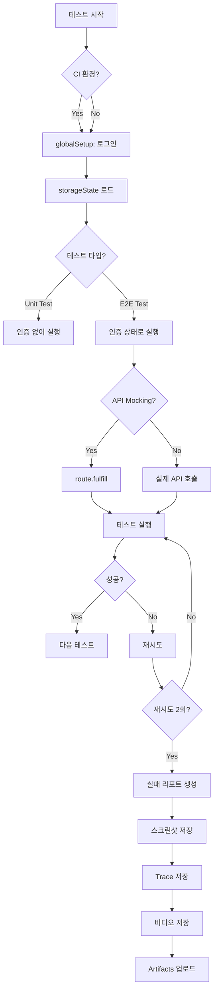
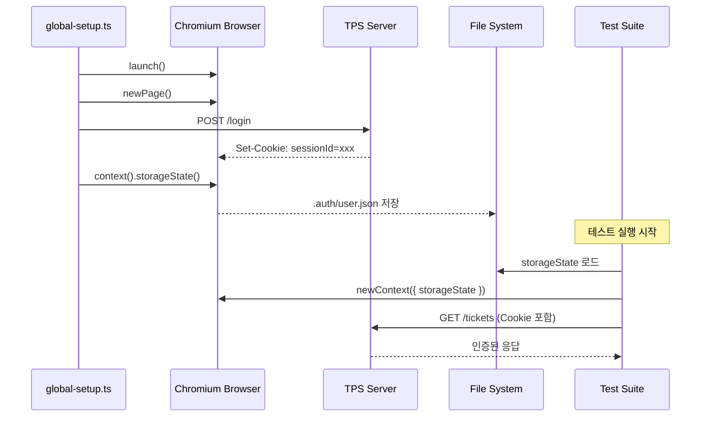

# 07. TPS 실전 통합 - 학습 (LEARN)

실제 TPS 시스템에 Playwright E2E 테스트를 적용하는 실전 패턴을 학습합니다.

---

## 학습 목표

1. **인증 관리**: storageState와 global-setup을 사용한 효율적인 로그인 관리
2. **동적 데이터 검증**: 정규식과 유연한 assertion 패턴
3. **네트워크 제어**: route interception으로 API 모킹 및 지연 시뮬레이션
4. **워크플로우 테스트**: 복잡한 다단계 시나리오 테스트 전략
5. **CI/CD 통합**: GitHub Actions와 테스트 자동화
6. **권한 테스트**: 역할 기반 접근 제어(RBAC) 검증

---

## 1. 인증 관리: storageState 패턴

### 1.1 문제: 매 테스트마다 로그인하면 느립니다

```typescript
// ❌ 나쁜 예: 매 테스트마다 로그인
test('티켓 목록 테스트', async ({ page }) => {
  await page.goto('/login');
  await page.fill('#username', 'admin');
  await page.fill('#password', 'password');
  await page.click('button[type="submit"]');
  await page.waitForURL('/dashboard');

  // 실제 테스트 시작
  await page.goto('/tickets');
  // ...
});

// 100개 테스트 = 100번 로그인 🐢
```

### 1.2 해결책: storageState로 인증 상태 재사용

```typescript
// ✅ 좋은 예: 한 번만 로그인, 상태 재사용

// global-setup.ts
import { chromium, FullConfig } from '@playwright/test';
import path from 'path';

async function globalSetup(config: FullConfig) {
  const browser = await chromium.launch();
  const page = await browser.newPage();

  // 1. 로그인 수행
  await page.goto('http://localhost:3002/login');
  await page.fill('#username', 'admin');
  await page.fill('#password', 'admin123');
  await page.click('button[type="submit"]');

  // 2. 로그인 성공 대기
  await page.waitForURL('**/dashboard');

  // 3. 인증 상태 저장
  await page.context().storageState({
    path: path.join(__dirname, '.auth', 'user.json')
  });

  await browser.close();
}

export default globalSetup;
```

```typescript
// playwright.config.ts
export default defineConfig({
  globalSetup: require.resolve('./global-setup'),

  use: {
    // 모든 테스트에서 저장된 인증 상태 사용
    storageState: '.auth/user.json',
  },

  projects: [
    {
      name: 'chromium',
      use: {
        ...devices['Desktop Chrome'],
        storageState: '.auth/user.json', // 프로젝트별 설정도 가능
      },
    },
  ],
});
```

```json
// .auth/user.json (생성된 파일 예시)
{
  "cookies": [
    {
      "name": "sessionId",
      "value": "abc123xyz",
      "domain": "localhost",
      "path": "/",
      "expires": 1707123456,
      "httpOnly": true,
      "secure": false
    }
  ],
  "origins": [
    {
      "origin": "http://localhost:3002",
      "localStorage": [
        {
          "name": "user",
          "value": "{\"id\":1,\"username\":\"admin\"}"
        }
      ]
    }
  ]
}
```

### 1.3 여러 사용자 역할 관리

```typescript
// global-setup.ts - 여러 역할 동시 설정
async function globalSetup(config: FullConfig) {
  const browser = await chromium.launch();

  // Admin 계정 로그인
  const adminPage = await browser.newPage();
  await adminPage.goto('http://localhost:3002/login');
  await adminPage.fill('#username', 'admin');
  await adminPage.fill('#password', 'admin123');
  await adminPage.click('button[type="submit"]');
  await adminPage.waitForURL('**/dashboard');
  await adminPage.context().storageState({ path: '.auth/admin.json' });
  await adminPage.close();

  // 일반 User 계정 로그인
  const userPage = await browser.newPage();
  await userPage.goto('http://localhost:3002/login');
  await userPage.fill('#username', 'user');
  await userPage.fill('#password', 'user123');
  await userPage.click('button[type="submit"]');
  await userPage.waitForURL('**/dashboard');
  await userPage.context().storageState({ path: '.auth/user.json' });
  await userPage.close();

  await browser.close();
}
```

```typescript
// playwright.config.ts - 역할별 프로젝트 분리
projects: [
  {
    name: 'admin-tests',
    use: { storageState: '.auth/admin.json' },
    testDir: './07-tps-real-world/practice',
    testMatch: '**/tps-permission.spec.ts',
  },
  {
    name: 'user-tests',
    use: { storageState: '.auth/user.json' },
    testDir: './07-tps-real-world/practice',
    testMatch: '**/tps-ticket-list.spec.ts',
  },
]
```

### 1.4 로그인 테스트는 어떻게?

```typescript
// tps-login.spec.ts - storageState 없이 테스트
import { test, expect } from '@playwright/test';

// 이 테스트들은 storageState를 사용하지 않음
test.use({ storageState: undefined });

test.describe('로그인 기능', () => {
  test('성공: 올바른 자격증명', async ({ page }) => {
    await page.goto('/login');
    await page.fill('#username', 'admin');
    await page.fill('#password', 'admin123');
    await page.click('button[type="submit"]');

    await expect(page).toHaveURL(/.*dashboard/);
    await expect(page.locator('.user-name')).toContainText('admin');
  });

  test('실패: 잘못된 비밀번호', async ({ page }) => {
    await page.goto('/login');
    await page.fill('#username', 'admin');
    await page.fill('#password', 'wrongpassword');
    await page.click('button[type="submit"]');

    await expect(page.locator('.error-message')).toContainText('로그인 실패');
    await expect(page).toHaveURL(/.*login/);
  });
});
```

---

## 2. 동적 데이터 검증 전략

### 2.1 문제: 실제 환경은 데이터가 계속 변합니다

```typescript
// ❌ 취약한 테스트 (Mock 서버 전용)
test('티켓 목록 확인', async ({ page }) => {
  await page.goto('/tickets');

  // 정확한 값 매칭 - 실제 환경에서 깨짐
  await expect(page.locator('tbody tr')).toHaveCount(10);
  await expect(page.locator('.ticket-id').first()).toHaveText('TICKET-001');
  await expect(page.locator('.created-at').first()).toHaveText('2024-02-05 14:30:00');
});
```

### 2.2 해결책: 정규식과 유연한 assertion

```typescript
// ✅ 유연한 테스트 (실제 환경 대응)
test('티켓 목록 확인', async ({ page }) => {
  await page.goto('/tickets');

  // 1. 존재 여부만 확인 (개수는 유동적)
  const ticketCount = await page.locator('tbody tr').count();
  expect(ticketCount).toBeGreaterThan(0);
  expect(ticketCount).toBeLessThanOrEqual(100); // 페이지당 최대 개수

  // 2. 정규식으로 패턴 매칭
  await expect(page.locator('.ticket-id').first()).toHaveText(/^(CICD|PMS|ITSM)-\d+$/);

  // 3. 날짜 형식 검증
  await expect(page.locator('.created-at').first()).toHaveText(/^\d{4}-\d{2}-\d{2} \d{2}:\d{2}:\d{2}$/);

  // 4. 빈 값이 아님만 확인
  await expect(page.locator('.ticket-title').first()).not.toBeEmpty();
});
```

### 2.3 조건부 검증

```typescript
test('티켓 상태별 표시', async ({ page }) => {
  await page.goto('/tickets');

  // 티켓이 있는지 먼저 확인
  const hasTickets = await page.locator('tbody tr').count() > 0;

  if (hasTickets) {
    // 티켓이 있으면 상태 배지 확인
    const firstStatus = page.locator('.status-badge').first();
    await expect(firstStatus).toBeVisible();
    await expect(firstStatus).toHaveText(/^(접수|진행중|완료|보류)$/);
  } else {
    // 빈 상태 메시지 확인
    await expect(page.locator('.empty-state')).toContainText('티켓이 없습니다');
  }
});
```

### 2.4 동적 데이터와 스크린샷 비교

```typescript
test('티켓 목록 레이아웃 검증', async ({ page }) => {
  await page.goto('/tickets');

  // 동적 요소 마스킹
  await expect(page).toHaveScreenshot('ticket-list.png', {
    mask: [
      page.locator('.created-at'),     // 타임스탬프
      page.locator('.updated-at'),     // 수정일
      page.locator('.ticket-id'),      // ID (매번 달라짐)
    ],
  });
});
```

---

## 3. 네트워크 인터셉션 패턴

### 3.1 API 응답 모킹

```typescript
test('빈 티켓 목록 UI 테스트', async ({ page }) => {
  // API 응답을 모킹
  await page.route('**/api/tickets*', async (route) => {
    await route.fulfill({
      status: 200,
      contentType: 'application/json',
      body: JSON.stringify({
        tickets: [],
        total: 0,
        page: 1,
        pageSize: 20,
      }),
    });
  });

  await page.goto('/tickets');

  // 빈 상태 UI 검증
  await expect(page.locator('.empty-state')).toBeVisible();
  await expect(page.locator('.empty-state')).toContainText('티켓이 없습니다');
});
```

### 3.2 API 실패 시뮬레이션

```typescript
test('API 실패 시 에러 처리', async ({ page }) => {
  // 500 에러 응답
  await page.route('**/api/tickets*', async (route) => {
    await route.fulfill({
      status: 500,
      contentType: 'application/json',
      body: JSON.stringify({
        error: 'Internal Server Error',
      }),
    });
  });

  await page.goto('/tickets');

  // 에러 메시지 표시 확인
  await expect(page.locator('.error-message')).toBeVisible();
  await expect(page.locator('.error-message')).toContainText('데이터를 불러오는 중 오류가 발생했습니다');

  // 재시도 버튼 확인
  await expect(page.locator('button:has-text("다시 시도")')).toBeVisible();
});
```

### 3.3 느린 API 응답 시뮬레이션

```typescript
test('로딩 인디케이터 표시', async ({ page }) => {
  await page.route('**/api/tickets*', async (route) => {
    // 3초 지연
    await new Promise(resolve => setTimeout(resolve, 3000));
    await route.continue();
  });

  await page.goto('/tickets');

  // 로딩 스피너 확인
  await expect(page.locator('.loading-spinner')).toBeVisible();

  // 3초 후 데이터 로드
  await expect(page.locator('tbody tr').first()).toBeVisible({ timeout: 5000 });

  // 스피너 사라짐
  await expect(page.locator('.loading-spinner')).not.toBeVisible();
});
```

### 3.4 실제 API와 Mock 조합

```typescript
test('티켓 생성 (읽기는 실제, 쓰기는 모킹)', async ({ page }) => {
  // 생성 API만 모킹 (데이터베이스 오염 방지)
  await page.route('**/api/tickets', async (route) => {
    if (route.request().method() === 'POST') {
      await route.fulfill({
        status: 201,
        contentType: 'application/json',
        body: JSON.stringify({
          id: 'MOCK-001',
          title: 'Mock Ticket',
          status: '접수',
        }),
      });
    } else {
      // GET 요청은 실제 API 호출
      await route.continue();
    }
  });

  await page.goto('/tickets/new');
  await page.fill('#title', 'Test Ticket');
  await page.click('button[type="submit"]');

  // 성공 메시지 확인
  await expect(page.locator('.success-message')).toContainText('티켓이 생성되었습니다');
});
```

---

## 4. 복잡한 워크플로우 테스트

### 4.1 전체 워크플로우 시나리오

```typescript
// tps-workflow.spec.ts
test.describe('티켓 관리 전체 워크플로우', () => {
  test('로그인 → 생성 → 조회 → 수정 → 검증', async ({ page }) => {
    // 이미 storageState로 로그인된 상태

    // Step 1: 티켓 생성
    await page.goto('/tickets/new');
    await page.selectOption('#type', 'CICD');
    await page.fill('#title', 'E2E 테스트 티켓');
    await page.fill('#description', '자동화 테스트입니다');
    await page.click('button[type="submit"]');

    // 생성 성공 확인
    await expect(page.locator('.success-message')).toContainText('생성되었습니다');

    // Step 2: 목록에서 찾기
    await page.goto('/tickets');
    await page.fill('input[placeholder="검색"]', 'E2E 테스트');
    await page.click('button:has-text("검색")');

    // 검색 결과 확인
    const firstTicket = page.locator('tbody tr').first();
    await expect(firstTicket.locator('.ticket-title')).toContainText('E2E 테스트 티켓');

    // Step 3: 상세 페이지로 이동
    await firstTicket.click();
    await expect(page).toHaveURL(/.*\/tickets\/[A-Z]+-\d+/);
    await expect(page.locator('.ticket-detail h1')).toContainText('E2E 테스트 티켓');

    // Step 4: 수정
    await page.click('button:has-text("수정")');
    await page.fill('#status', '진행중');
    await page.fill('#assignee', 'tester');
    await page.click('button[type="submit"]');

    // 수정 성공 확인
    await expect(page.locator('.status-badge')).toContainText('진행중');
    await expect(page.locator('.assignee')).toContainText('tester');
  });
});
```

### 4.2 POM 적용한 워크플로우

```typescript
// pages/TicketListPage.ts
export class TicketListPage {
  constructor(private page: Page) {}

  async goto() {
    await this.page.goto('/tickets');
  }

  async searchTicket(query: string) {
    await this.page.fill('input[placeholder="검색"]', query);
    await this.page.click('button:has-text("검색")');
  }

  async clickFirstTicket() {
    await this.page.locator('tbody tr').first().click();
  }

  async getTicketCount() {
    return await this.page.locator('tbody tr').count();
  }
}

// pages/TicketDetailPage.ts
export class TicketDetailPage {
  constructor(private page: Page) {}

  async verifyTitle(title: string) {
    await expect(this.page.locator('.ticket-detail h1')).toContainText(title);
  }

  async updateStatus(status: string) {
    await this.page.click('button:has-text("수정")');
    await this.page.selectOption('#status', status);
    await this.page.click('button[type="submit"]');
  }

  async verifyStatus(status: string) {
    await expect(this.page.locator('.status-badge')).toContainText(status);
  }
}

// tps-workflow.spec.ts (POM 적용)
test('워크플로우 with POM', async ({ page }) => {
  const ticketListPage = new TicketListPage(page);
  const ticketDetailPage = new TicketDetailPage(page);

  await ticketListPage.goto();
  await ticketListPage.searchTicket('E2E 테스트');
  await ticketListPage.clickFirstTicket();

  await ticketDetailPage.verifyTitle('E2E 테스트 티켓');
  await ticketDetailPage.updateStatus('완료');
  await ticketDetailPage.verifyStatus('완료');
});
```

---

## 5. 테스트 데이터 관리

### 5.1 API를 통한 Setup/Teardown

```typescript
test.describe('티켓 상세 페이지', () => {
  let ticketId: string;

  // 테스트 전: 데이터 생성
  test.beforeEach(async ({ request }) => {
    const response = await request.post('/api/tickets', {
      data: {
        type: 'CICD',
        title: 'Test Ticket for E2E',
        description: 'This will be deleted after test',
      },
    });

    const ticket = await response.json();
    ticketId = ticket.id;
  });

  // 테스트 후: 데이터 삭제
  test.afterEach(async ({ request }) => {
    if (ticketId) {
      await request.delete(`/api/tickets/${ticketId}`);
    }
  });

  test('상세 정보 표시', async ({ page }) => {
    await page.goto(`/tickets/${ticketId}`);
    await expect(page.locator('.ticket-title')).toContainText('Test Ticket for E2E');
  });
});
```

### 5.2 테스트 데이터 식별 전략

```typescript
// 테스트 데이터에 prefix 추가
test('티켓 생성', async ({ page }) => {
  await page.goto('/tickets/new');
  await page.fill('#title', '[E2E] 테스트 티켓');  // prefix로 식별
  await page.click('button[type="submit"]');
});

// 정리 스크립트에서 prefix로 찾아서 삭제
test.afterAll(async ({ request }) => {
  const response = await request.get('/api/tickets?title=[E2E]');
  const tickets = await response.json();

  for (const ticket of tickets.data) {
    await request.delete(`/api/tickets/${ticket.id}`);
  }
});
```

---

## 6. CI/CD 통합

### 6.1 GitHub Actions 워크플로우

```yaml
# .github/workflows/e2e-tests.yml
name: E2E Tests

on:
  push:
    branches: [main, develop]
  pull_request:
    branches: [main]

jobs:
  test:
    runs-on: ubuntu-latest
    steps:
      - uses: actions/checkout@v3

      - name: Setup Node.js
        uses: actions/setup-node@v3
        with:
          node-version: '18'
          cache: 'npm'

      - name: Install dependencies
        run: npm ci

      - name: Install Playwright browsers
        run: npx playwright install --with-deps

      - name: Run E2E tests
        run: npx playwright test
        env:
          CI: true

      - name: Upload test results
        if: always()
        uses: actions/upload-artifact@v3
        with:
          name: playwright-report
          path: playwright-report/
          retention-days: 30

      - name: Upload test videos
        if: failure()
        uses: actions/upload-artifact@v3
        with:
          name: test-videos
          path: test-results/
          retention-days: 7
```

### 6.2 CI 환경 전용 설정

```typescript
// playwright.config.ts
export default defineConfig({
  // CI에서는 재시도 2번
  retries: process.env.CI ? 2 : 0,

  // CI에서는 순차 실행 (안정성 우선)
  workers: process.env.CI ? 1 : undefined,

  use: {
    // CI에서는 타임아웃 증가
    actionTimeout: process.env.CI ? 30000 : 10000,

    // CI에서는 항상 headless
    headless: process.env.CI ? true : false,

    // 실패 시 스크린샷
    screenshot: 'only-on-failure',

    // 실패 시 비디오
    video: 'retain-on-failure',

    // 재시도 시 trace
    trace: 'on-first-retry',
  },
});
```

---

## 7. 권한 기반 테스트

### 7.1 Admin vs User 테스트

```typescript
// tps-permission.spec.ts
test.describe('권한 검증', () => {
  test.describe('관리자 권한', () => {
    test.use({ storageState: '.auth/admin.json' });

    test('삭제 버튼 표시', async ({ page }) => {
      await page.goto('/tickets/CICD-001');
      await expect(page.locator('button:has-text("삭제")')).toBeVisible();
    });

    test('모든 티켓 접근 가능', async ({ page }) => {
      await page.goto('/tickets');
      const count = await page.locator('tbody tr').count();
      expect(count).toBeGreaterThan(0);
    });
  });

  test.describe('일반 사용자 권한', () => {
    test.use({ storageState: '.auth/user.json' });

    test('삭제 버튼 미표시', async ({ page }) => {
      await page.goto('/tickets/CICD-001');
      await expect(page.locator('button:has-text("삭제")')).not.toBeVisible();
    });

    test('자신의 티켓만 수정 가능', async ({ page }) => {
      // 다른 사용자 티켓
      await page.goto('/tickets/CICD-002');
      await expect(page.locator('button:has-text("수정")')).toBeDisabled();

      // 자신의 티켓
      await page.goto('/tickets/CICD-001');
      await expect(page.locator('button:has-text("수정")')).toBeEnabled();
    });
  });
});
```

---

## 8. Python 자동화 스크립트

### 8.1 Playwright Sync API 사용

```python
# python/tps_ticket_screenshot.py
from playwright.sync_api import sync_playwright
import os
from datetime import datetime

def take_ticket_screenshots():
    """TPS 티켓 목록 페이지 스크린샷 자동 캡처"""

    with sync_playwright() as p:
        # 브라우저 시작
        browser = p.chromium.launch(headless=True)
        page = browser.new_page()

        try:
            # 1. 로그인
            print("로그인 중...")
            page.goto("http://localhost:3002/login")
            page.fill("#username", "admin")
            page.fill("#password", "admin123")
            page.click('button[type="submit"]')
            page.wait_for_url("**/dashboard")
            print("✓ 로그인 성공")

            # 2. 티켓 목록 페이지로 이동
            print("티켓 목록 페이지 이동...")
            page.goto("http://localhost:3002/tickets")
            page.wait_for_selector("tbody tr")
            print("✓ 페이지 로드 완료")

            # 3. 스크린샷 디렉토리 생성
            screenshot_dir = "screenshots"
            os.makedirs(screenshot_dir, exist_ok=True)

            # 4. 전체 페이지 스크린샷
            timestamp = datetime.now().strftime("%Y%m%d_%H%M%S")
            screenshot_path = f"{screenshot_dir}/ticket_list_{timestamp}.png"
            page.screenshot(path=screenshot_path, full_page=True)
            print(f"✓ 스크린샷 저장: {screenshot_path}")

            # 5. 각 티켓별 스크린샷 (옵션)
            ticket_ids = page.locator(".ticket-id").all_text_contents()
            for i, ticket_id in enumerate(ticket_ids[:5]):  # 상위 5개만
                ticket_path = f"{screenshot_dir}/ticket_{ticket_id}_{timestamp}.png"
                page.locator(f'tbody tr:nth-child({i+1})').screenshot(path=ticket_path)
                print(f"  ✓ 티켓 스크린샷: {ticket_path}")

        except Exception as e:
            print(f"❌ 오류 발생: {str(e)}")
            page.screenshot(path=f"{screenshot_dir}/error_{timestamp}.png")
            raise

        finally:
            browser.close()

if __name__ == "__main__":
    take_ticket_screenshots()
```

---

## 9. 실전 아키텍처

### 9.1 테스트 구조 설계

```
07-tps-real-world/
├── practice/
│   ├── pages/                 # Page Object Models
│   │   ├── LoginPage.ts
│   │   ├── TicketListPage.ts
│   │   ├── TicketDetailPage.ts
│   │   └── TicketCreatePage.ts
│   ├── fixtures/              # 테스트 데이터
│   │   ├── tickets.json
│   │   └── users.json
│   ├── utils/                 # 헬퍼 함수
│   │   ├── testData.ts
│   │   └── cleanup.ts
│   ├── tps-login.spec.ts
│   ├── tps-ticket-list.spec.ts
│   ├── tps-ticket-create.spec.ts
│   ├── tps-workflow.spec.ts
│   └── tps-permission.spec.ts
├── python/
│   └── tps_ticket_screenshot.py
├── INVESTIGATE.md
└── LEARN.md
```

### 9.2 테스트 실행 전략 다이어그램



### 9.3 인증 플로우 다이어그램



---

## 10. Best Practices 체크리스트

### 10.1 인증 관리
- [ ] global-setup으로 한 번만 로그인
- [ ] storageState를 .gitignore에 추가
- [ ] 토큰 만료 대응 전략 수립
- [ ] 역할별 storageState 분리

### 10.2 데이터 검증
- [ ] 동적 데이터는 정규식 사용
- [ ] 존재 여부 중심 assertion
- [ ] 스크린샷은 동적 요소 마스킹
- [ ] 빈 상태(empty state) 테스트 포함

### 10.3 네트워크 관리
- [ ] 불안정한 API는 route interception
- [ ] 로딩 상태 검증
- [ ] 에러 처리 시나리오 테스트
- [ ] 타임아웃 적절히 설정

### 10.4 워크플로우
- [ ] 핵심 사용자 여정 우선 테스트
- [ ] POM으로 재사용성 높이기
- [ ] 테스트 독립성 유지
- [ ] 실패 시 명확한 에러 메시지

### 10.5 CI/CD
- [ ] GitHub Actions 워크플로우 설정
- [ ] 실패 시 artifacts 업로드
- [ ] CI 환경 전용 타임아웃/재시도
- [ ] 선택적 테스트 실행 전략

---

## 다음 단계

1. **practice/ 폴더 실습**
   - `tps-login.spec.ts`: 인증 테스트 작성
   - `tps-ticket-list.spec.ts`: 목록 및 검색
   - `tps-ticket-create.spec.ts`: 생성 플로우
   - `tps-workflow.spec.ts`: 전체 워크플로우
   - `tps-permission.spec.ts`: 권한 테스트

2. **Python 스크립트 실행**
   ```bash
   cd python
   pip install playwright
   playwright install chromium
   python tps_ticket_screenshot.py
   ```

3. **실제 TPS 환경 적용**
   - `.env`에 TPS_BASE_URL 설정
   - global-setup 실제 자격증명으로 수정
   - 테스트 실행 및 결과 분석

**핵심**: Mock 서버로 빠른 피드백 루프, 실제 환경으로 주기적 검증!
