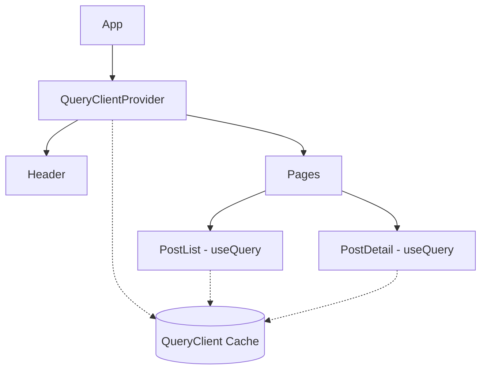
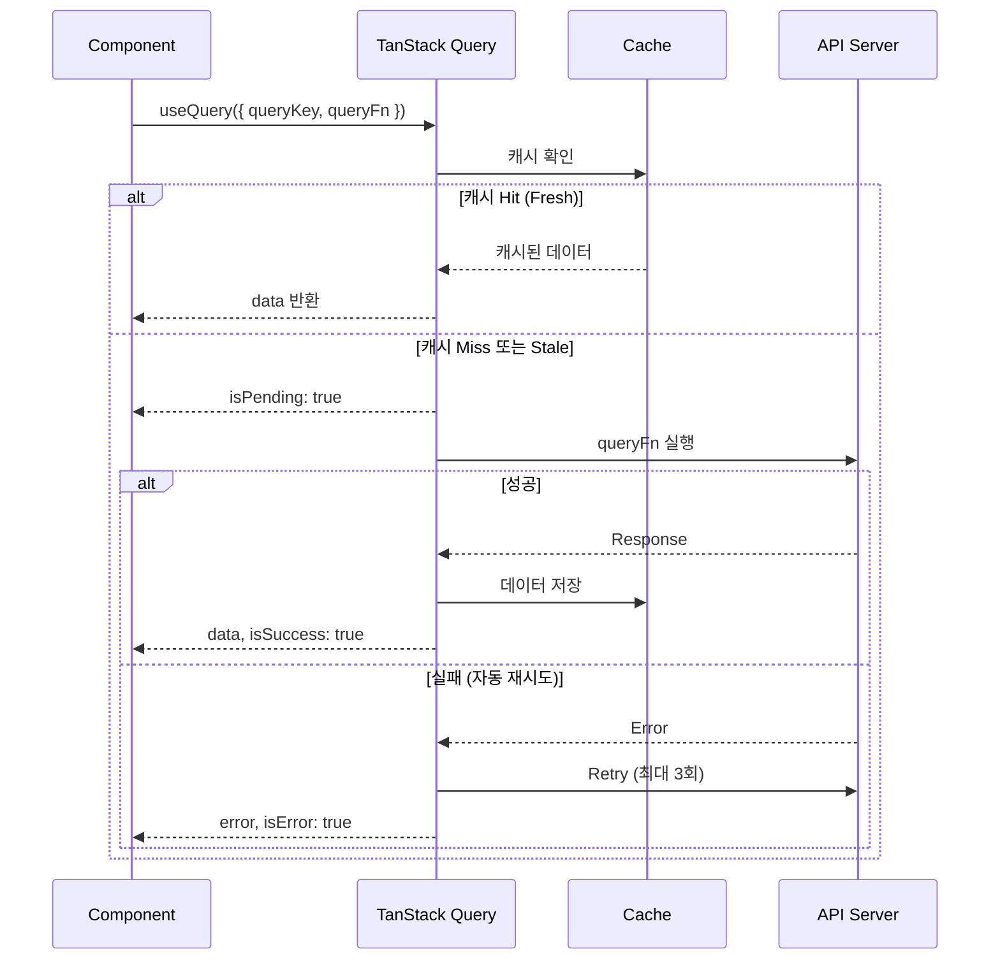
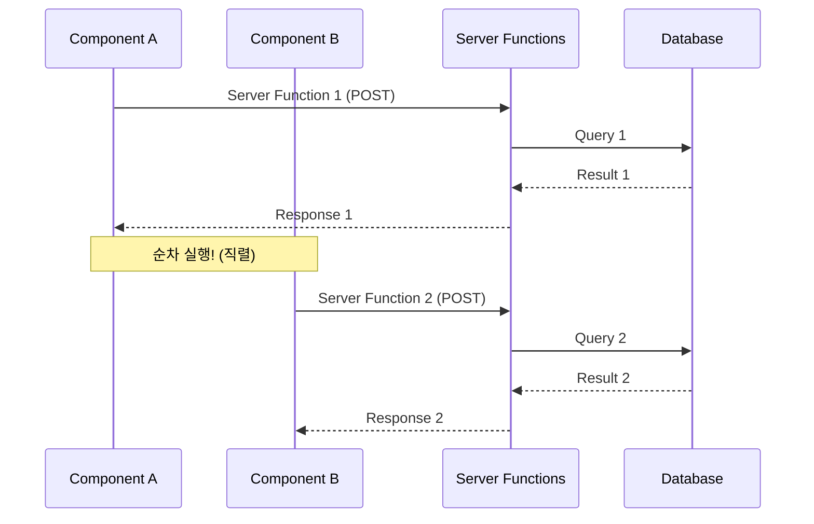
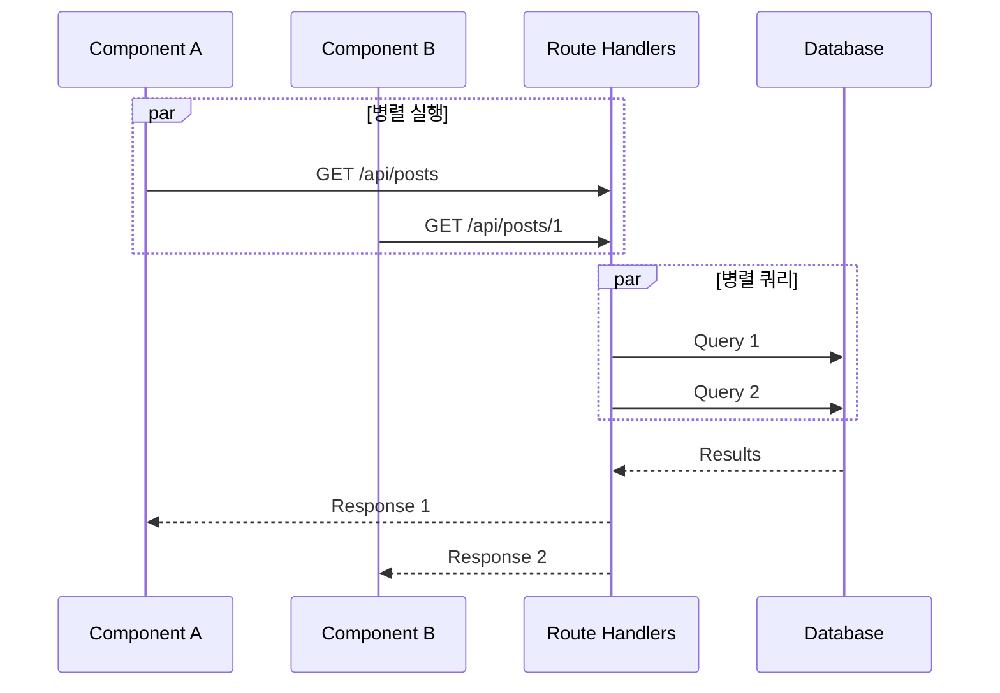
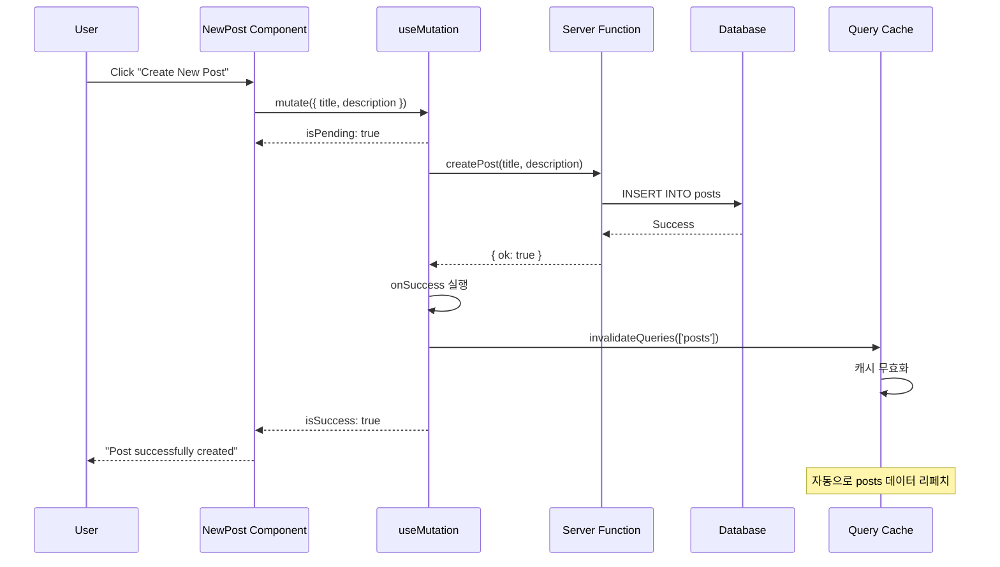

# Chapter 8. TanStack Query를 이용한 Client Component 데이터 페칭과 뮤테이션

---

## 📌 핵심 요약
> 이 장에서는 클라이언트 사이드 데이터 페칭의 복잡성과 **TanStack Query**가 이를 어떻게 해결하는지 다룬다. 핵심은 `useQuery`로 데이터 페칭 상태(로딩, 에러, 성공)를 자동 관리하고, `useMutation`으로 뮤테이션과 캐시 무효화를 처리하는 것이다. Server Function 대신 **Route Handler**를 사용해야 하는 이유와 **Zod**로 API 응답 타입 안전성을 확보하는 방법도 함께 배운다.

---

## 🎯 학습 목표
이 내용을 읽고 나면:
- [ ] useEffect로 데이터 페칭할 때의 문제점을 설명할 수 있다
- [ ] TanStack Query의 useQuery Hook을 사용해 데이터를 페칭할 수 있다
- [ ] QueryClientProvider를 설정하고 캐시를 관리할 수 있다
- [ ] Route Handler와 Server Function의 차이를 비교할 수 있다
- [ ] useMutation으로 뮤테이션을 구현하고 캐시를 무효화할 수 있다
- [ ] Zod로 API 응답의 타입 안전성을 확보할 수 있다

---

## 📖 본문 정리

### 1. useEffect 데이터 페칭의 문제점

#### 기본적인 useEffect 데이터 페칭

```typescript
const [name, setName] = useState<string | undefined>();
const [loading, setLoading] = useState(true);
const [error, setError] = useState<Error | undefined>();

useEffect(() => {
  getPerson(personId)
    .then((person) => {
      setLoading(false);
      setName(person.name);
    })
    .catch((e) => {
      setError(e);
      setLoading(false);
    });
}, [personId]);
```

#### 문제점 목록

| 문제 | 설명 |
|------|------|
| **상태 관리 복잡** | data, loading, error 상태를 모두 직접 관리해야 함 |
| **Race Condition** | personId가 바뀌는 동안 이전 요청이 완료되면 잘못된 데이터 표시 |
| **Unmount 에러** | 컴포넌트가 언마운트된 후 setState 호출 시 에러 |
| **캐싱 없음** | 같은 데이터를 매번 새로 요청 |
| **재시도 없음** | 네트워크 에러 시 자동 재시도 없음 |

> 💬 **비유**: useEffect로 데이터 페칭하는 것은 수동 변속기 자동차를 운전하는 것과 같다. 기어, 클러치, 가속 페달을 모두 직접 조작해야 한다. TanStack Query는 자동 변속기처럼 복잡한 상태 전환을 자동으로 처리해준다.

---

### 2. TanStack Query 기초

#### useQuery 기본 사용법

```typescript
import { useQuery } from '@tanstack/react-query';

function Product({ id }: { id: number }) {
  const { data, error, isPending } = useQuery({
    // 캐시 키: 데이터 식별자
    queryKey: ['products', id],
    // 실제 데이터 페칭 함수
    queryFn: () =>
      fetch(`https://api.example.com/products/${id}`)
        .then((res) => res.json()),
  });

  if (isPending) return 'Loading...';
  if (error) return 'Error: ' + error.message;

  return (
    <div>
      <h2>{data.name}</h2>
      <p>{data.description}</p>
    </div>
  );
}
```

#### useQuery 반환값

| 속성 | 타입 | 설명 |
|------|------|------|
| `data` | T \| undefined | 페칭된 데이터 |
| `isPending` | boolean | 데이터 로딩 중 여부 |
| `isSuccess` | boolean | 데이터 페칭 성공 여부 |
| `isError` | boolean | 에러 발생 여부 |
| `error` | Error \| null | 에러 객체 |

#### QueryClientProvider 설정



```typescript
// src/components/Providers.tsx
'use client';

import { QueryClient, QueryClientProvider } from '@tanstack/react-query';
import { ReactNode, useState } from 'react';

export function Providers({ children }: { children: ReactNode }) {
  // useState로 QueryClient 인스턴스 유지 (리렌더링 시 재사용)
  const [queryClient] = useState(() => new QueryClient());

  return (
    <QueryClientProvider client={queryClient}>
      {children}
    </QueryClientProvider>
  );
}
```

```typescript
// src/app/layout.tsx
import { Providers } from '@/components/Providers';

export default function RootLayout({ children }: { children: ReactNode }) {
  return (
    <html lang="ko">
      <body>
        <Providers>
          <Header />
          {children}
        </Providers>
      </body>
    </html>
  );
}
```

---

### 3. TanStack Query 기본 기능



#### 자동 기능들

| 기능 | 설명 | 기본값 |
|------|------|--------|
| **자동 재시도** | 에러 시 자동으로 재시도 | 3회 |
| **Window Focus Refetch** | 브라우저 탭 복귀 시 데이터 갱신 | 활성화 |
| **Stale Time** | 데이터가 "신선"하다고 간주하는 시간 | 0ms |
| **Cache Time** | 비활성 데이터 캐시 유지 시간 | 5분 |

---

### 4. Route Handler vs Server Function

#### Server Function의 문제점



#### Route Handler의 장점



#### 비교표

| 특성 | Server Function | Route Handler |
|------|-----------------|---------------|
| **HTTP 메서드** | POST 고정 | GET, POST, PUT 등 자유 |
| **실행 방식** | 순차 (직렬) | 병렬 |
| **타입 안전성** | ✅ 자동 | ❌ 수동 (Zod 권장) |
| **캐싱** | ❌ 브라우저 캐시 불가 | ✅ GET 캐싱 가능 |
| **용도** | 뮤테이션 권장 | 데이터 페칭 권장 |

#### Route Handler 구현

```typescript
// src/app/api/posts/route.ts
import { type NextRequest } from 'next/server';
import { getAllPosts, getFilteredPosts } from '@/data/queries';

export async function GET(request: NextRequest) {
  const criteria = request.nextUrl.searchParams.get('criteria');

  if (typeof criteria === 'string') {
    return Response.json(await getFilteredPosts(criteria));
  }
  return Response.json(await getAllPosts());
}
```

```typescript
// src/app/api/posts/[id]/route.ts
import { getPost } from '@/data/queries';

export async function GET(
  _: Request,
  { params }: { params: Promise<{ id: string }> }
) {
  const id = Number((await params).id);

  if (!Number.isInteger(id)) {
    return Response.json({ message: 'Post not found' }, { status: 404 });
  }

  const data = await getPost(id);
  if (!data) {
    return Response.json({ message: 'Post not found' }, { status: 404 });
  }

  return Response.json(data);
}
```

---

### 5. Zod로 API 응답 타입 안전성 확보

> 💬 **비유**: Route Handler를 사용하면 타입 안전성을 잃는다. 이는 마치 외부 택배를 받을 때 내용물을 확인하지 않는 것과 같다. Zod는 "검수 담당자"로서 받은 데이터가 기대한 형식인지 확인해준다.

```typescript
// src/components/PostList.tsx
'use client';

import { useQuery } from '@tanstack/react-query';
import { postsSchema } from '@/data/schema';

export function PostList({ criteria }: { criteria: string | undefined }) {
  const { data: resolvedPosts, isPending, error } = useQuery({
    queryKey: ['posts', criteria],
    queryFn: async () => {
      const path =
        typeof criteria === 'string'
          ? `/api/posts/?criteria=${encodeURIComponent(criteria)}`
          : '/api/posts/';

      const response = await fetch(path);
      if (!response.ok) {
        throw new Error('Problem fetching data');
      }

      // Zod로 런타임 타입 검증 + 타입 추론
      return postsSchema.parse(await response.json());
    },
  });

  if (isPending) return <Loading />;
  if (error) return <ErrorAlert error={error} />;

  // resolvedPosts는 이제 Post[] 타입으로 정확히 추론됨
  return (
    <ul>
      {resolvedPosts.map((post) => (
        <li key={post.id}>{post.title}</li>
      ))}
    </ul>
  );
}
```

---

### 6. useMutation으로 뮤테이션 처리



#### useMutation 사용법

```typescript
// src/components/NewPost.tsx
'use client';

import { useMutation, useQueryClient } from '@tanstack/react-query';
import { createPost } from '@/data/createPost';

export function NewPost() {
  const queryClient = useQueryClient();

  const { mutate, isPending, isError, isSuccess } = useMutation({
    // 뮤테이션 함수 (Server Function 호출)
    mutationFn: ({ title, description }: { title: string; description: string }) =>
      createPost(title, description),

    // 성공 시 캐시 무효화
    onSuccess: async () => {
      await queryClient.invalidateQueries({
        queryKey: ['posts'],
      });
    },
  });

  function handleClick() {
    mutate({
      title: 'New Post',
      description: 'New Post Description',
    });
  }

  return (
    <div className="actions">
      <button type="button" onClick={handleClick}>
        {isPending ? 'Creating...' : 'Create New Post'}
      </button>

      {isError && <span role="alert">An unexpected error occurred</span>}
      {isSuccess && <span className="success">Post successfully created</span>}
    </div>
  );
}
```

#### useMutation 옵션과 반환값

| 옵션 | 설명 |
|------|------|
| `mutationFn` | 실제 뮤테이션을 수행하는 함수 |
| `onSuccess` | 뮤테이션 성공 시 실행할 콜백 |
| `onError` | 뮤테이션 실패 시 실행할 콜백 |
| `onSettled` | 성공/실패 관계없이 완료 시 실행 |

| 반환값 | 설명 |
|--------|------|
| `mutate` | 뮤테이션 시작 함수 |
| `isPending` | 뮤테이션 진행 중 여부 |
| `isSuccess` | 뮤테이션 성공 여부 |
| `isError` | 뮤테이션 실패 여부 |
| `error` | 에러 객체 |

---

## 🔍 심화 학습

### 추가 조사 내용

#### staleTime vs cacheTime (gcTime)

```typescript
const { data } = useQuery({
  queryKey: ['posts'],
  queryFn: fetchPosts,
  staleTime: 1000 * 60 * 5,  // 5분 동안 "신선" (refetch 안 함)
  gcTime: 1000 * 60 * 10,    // 10분 후 캐시에서 제거 (v5에서 cacheTime → gcTime)
});
```

| 옵션 | 설명 | 기본값 |
|------|------|--------|
| `staleTime` | 데이터가 stale 상태가 되기까지의 시간 | 0 |
| `gcTime` (v5) | 비활성 캐시 데이터 유지 시간 | 5분 |

#### Optimistic Updates (낙관적 업데이트)

```typescript
const { mutate } = useMutation({
  mutationFn: updatePost,
  onMutate: async (newPost) => {
    // 진행 중인 쿼리 취소
    await queryClient.cancelQueries({ queryKey: ['posts'] });

    // 이전 데이터 스냅샷
    const previousPosts = queryClient.getQueryData(['posts']);

    // 낙관적 업데이트
    queryClient.setQueryData(['posts'], (old) => [...old, newPost]);

    return { previousPosts };
  },
  onError: (err, newPost, context) => {
    // 에러 시 롤백
    queryClient.setQueryData(['posts'], context.previousPosts);
  },
});
```

### 출처
- [TanStack Query 공식 문서](https://tanstack.com/query/latest)
- [Why You Want React Query - TkDodo's Blog](https://tkdodo.eu/blog/why-you-want-react-query)
- [Next.js Route Handlers](https://nextjs.org/docs/app/building-your-application/routing/route-handlers)

---

## 💡 실무 적용 포인트

### 이런 상황에서 사용하세요
- **데이터 실시간 갱신**: 대시보드, 알림 목록 등 주기적 갱신 필요
- **무한 스크롤**: useInfiniteQuery로 페이지네이션 구현
- **오프라인 지원**: persistQueryClient로 캐시 영속화
- **복잡한 캐시 관리**: 여러 컴포넌트에서 같은 데이터 공유

### 주의할 점 / 흔한 실수
- ⚠️ **queryKey 일관성**: 같은 데이터는 같은 키 사용. `['posts']`와 `['post']` 혼동 주의
- ⚠️ **staleTime 0 주의**: 기본값 0은 매 마운트마다 refetch. 불필요한 요청 발생 가능
- ⚠️ **Server Function 남용**: 데이터 페칭에는 Route Handler 권장
- ⚠️ **캐시 무효화 누락**: 뮤테이션 후 `invalidateQueries` 필수

### 면접에서 나올 수 있는 질문
- Q: TanStack Query가 useEffect + useState 조합보다 나은 점은?
- Q: staleTime과 gcTime(cacheTime)의 차이는?
- Q: 뮤테이션 후 캐시를 업데이트하는 방법 두 가지는? (invalidate vs setQueryData)
- Q: Route Handler와 Server Function 중 데이터 페칭에 더 적합한 것은? 이유는?

---

## ✅ 핵심 개념 체크리스트
- [ ] useEffect로 데이터 페칭 시 race condition 문제를 설명할 수 있는가?
- [ ] useQuery의 queryKey와 queryFn 역할을 알고 있는가?
- [ ] QueryClientProvider를 왜 최상위에 배치하는지 설명할 수 있는가?
- [ ] Server Function이 데이터 페칭에 권장되지 않는 이유를 알고 있는가?
- [ ] Route Handler로 GET 엔드포인트를 만들 수 있는가?
- [ ] Zod로 API 응답을 검증하는 이유와 방법을 아는가?
- [ ] useMutation의 onSuccess에서 캐시를 무효화하는 방법을 아는가?
- [ ] isPending, isError, isSuccess 상태를 UI에 반영할 수 있는가?

---

## 🔗 참고 자료
- 📄 공식 문서: [TanStack Query Documentation](https://tanstack.com/query/latest)
- 📄 공식 문서: [Next.js Route Handlers](https://nextjs.org/docs/app/building-your-application/routing/route-handlers)
- 🎬 추천 영상: [React Query Tutorial - Codevolution](https://www.youtube.com/watch?v=VtWkSCZX0Ec)
- 📚 추천 블로그: [TkDodo's Blog - Practical React Query](https://tkdodo.eu/blog/practical-react-query)
- 📚 연관 서적: *Learn React with TypeScript - Third Edition* (Carl Rippon)
