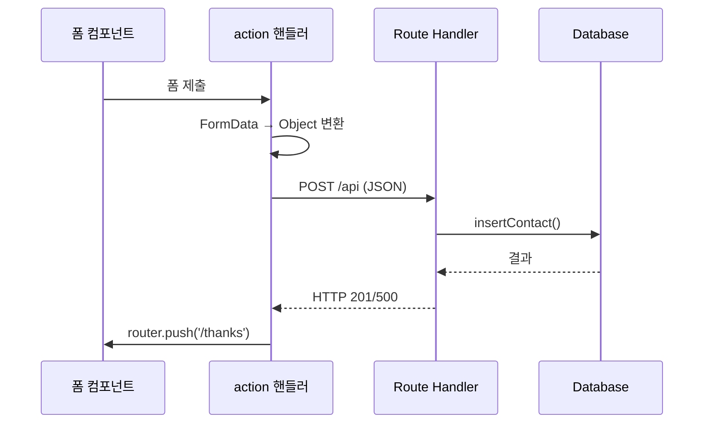
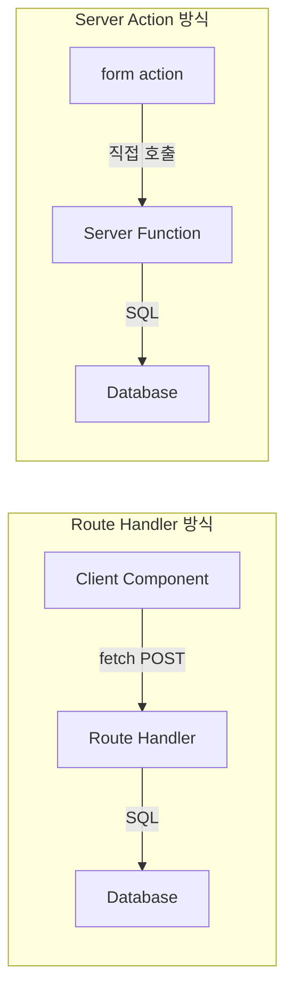
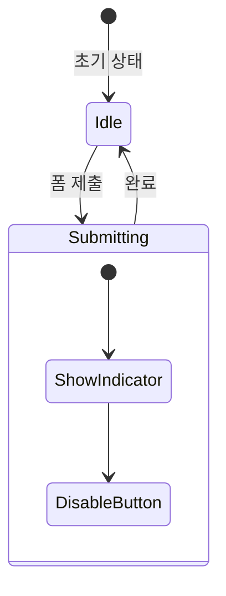
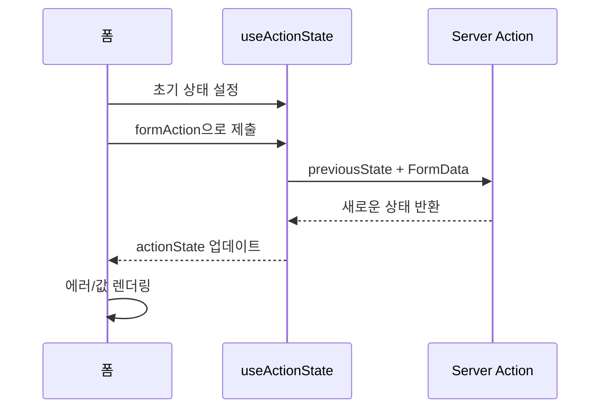
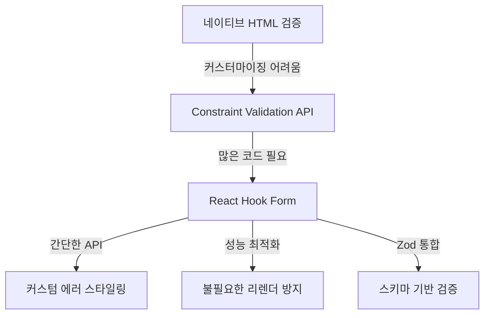
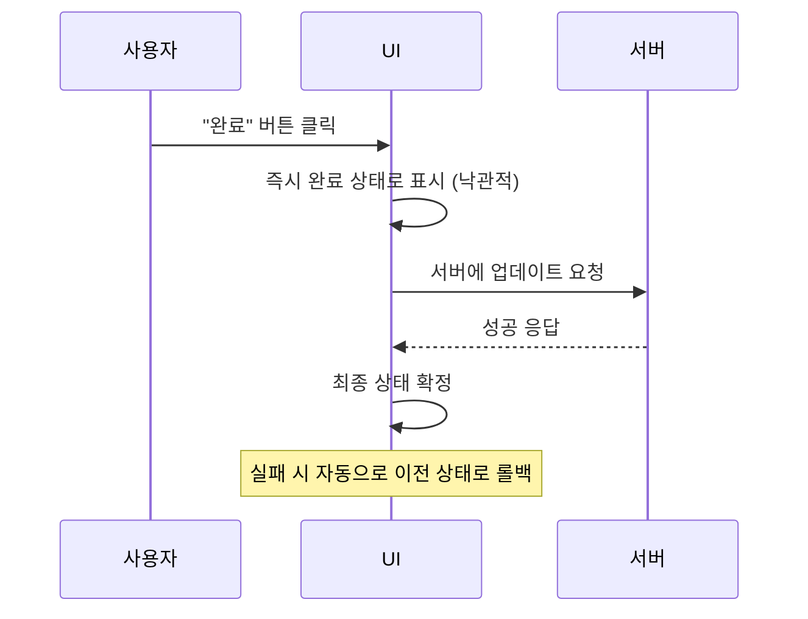

# Chapter 9. 폼 다루기 (Working with Forms)

---

## 📌 핵심 요약
> React에서 폼을 구현하는 다양한 방법을 다룬다. 기본 HTML 폼부터 시작해 **Route Handler**, **Server Action**으로 제출 방식을 발전시키고, **useFormStatus**와 **useActionState**로 UX를 개선한다. **React Hook Form**으로 클라이언트 검증을 추가하고, **useOptimistic**으로 낙관적 업데이트를 구현하여 반응성 높은 폼을 만든다.

---

## 🎯 학습 목표
이 내용을 읽고 나면:
- [ ] 기본 HTML 폼과 Next.js Form 컴포넌트의 차이를 설명할 수 있다
- [ ] Route Handler vs Server Action 제출 방식의 장단점을 비교할 수 있다
- [ ] useFormStatus와 useActionState 훅의 용도와 차이를 설명할 수 있다
- [ ] React Hook Form으로 클라이언트 검증을 구현할 수 있다
- [ ] useOptimistic으로 낙관적 UI 업데이트를 구현할 수 있다

---

## 📖 본문 정리

### 1. 기본 폼 구현 (Basic Forms)

#### 네이티브 HTML 폼 구조

```typescript
// src/components/ContactForm.tsx
export function ContactForm() {
  return (
    <form action="thanks">  {/* 제출 후 이동할 경로 */}
      <div className="field">
        <label htmlFor="name">Your name</label>
        <input type="text" id="name" name="name" />
      </div>
      <div className="field">
        <label htmlFor="email">Your email address</label>
        <input type="email" id="email" name="email" />
      </div>
      <div className="field">
        <label htmlFor="reason">Reason</label>
        <select id="reason" name="reason">
          <option value="">Select...</option>
          <option value="Support">Support</option>
          <option value="Feedback">Feedback</option>
        </select>
      </div>
      <button type="submit">Submit</button>
    </form>
  );
}
```

**핵심 속성**:
- `htmlFor`: label과 input 연결 (접근성)
- `name`: 폼 제출 시 필드 값 추출에 사용
- `action`: 제출 후 이동할 경로

> 💬 **비유**: 기본 HTML 폼은 우편으로 편지를 보내는 것과 같다. 봉투에 주소(action)를 쓰고 내용물(field values)을 넣어 보내면, 전체 페이지가 새로고침되며 목적지로 이동한다.

#### Next.js Form 컴포넌트

```typescript
import Form from 'next/form';

export function ContactForm() {
  return (
    <Form action="thanks">
      {/* 전체 페이지 리로드 없이 네비게이션 */}
      ...
    </Form>
  );
}
```

| 방식 | 페이지 리로드 | JavaScript 필요 |
|------|---------------|-----------------|
| `<form>` | O (전체 리로드) | X |
| `<Form>` (Next.js) | X (클라이언트 네비게이션) | O (없으면 fallback) |

---

### 2. Route Handler로 제출하기

#### 제출 흐름



#### 클라이언트 제출 핸들러

```typescript
'use client';

import { useRouter } from 'next/navigation';
import { Contact } from '@/data/schema';

export function ContactForm() {
  const { push } = useRouter();

  async function handleAction(formData: FormData) {
    // FormData → 객체 변환
    const contact = Object.fromEntries(formData) as Contact;

    // API 호출
    const response = await fetch('api', {
      method: 'POST',
      body: JSON.stringify(contact),
    });

    if (!response.ok) {
      console.error('Something went wrong');
      return;
    }

    // 성공 시 이동
    push('/thanks/?name=' + encodeURIComponent(contact.name));
  }

  return (
    <form action={handleAction}>
      ...
    </form>
  );
}
```

#### Route Handler 구현

```typescript
// src/app/api/route.ts
import { type NextRequest } from 'next/server';
import { insertContact } from '@/data/insertContact';

export async function POST(request: NextRequest) {
  const data = await request.json();
  const result = await insertContact(data);

  if (result.ok) {
    return Response.json({}, { status: 201 });
  }
  return Response.json({}, { status: 500 });
}
```

---

### 3. Server Action으로 제출하기

#### Server Action vs Route Handler



| 특성 | Route Handler | Server Action |
|------|---------------|---------------|
| JavaScript 필요 | O | X (없어도 동작) |
| 구현 복잡도 | 높음 (API + 핸들러) | 낮음 (함수 하나) |
| 파일 구조 | api/route.ts 별도 필요 | 기존 파일에 추가 가능 |
| 네비게이션 | useRouter 사용 | redirect() 사용 |

> 💬 **비유**: Route Handler는 우체국을 거쳐 편지를 보내는 것이고, Server Action은 직접 상대방에게 전달하는 것과 같다. 중간 단계가 없어 더 빠르고 간단하다.

#### Server Action 구현

```typescript
// src/data/insertContact.ts
'use server';

import { redirect } from 'next/navigation';

export async function insertContact(formData: FormData) {
  const { name, email, reason, notes } =
    Object.fromEntries(formData) as Contact;

  // DB 저장 로직...

  if (ok) {
    redirect(`/thanks/?name=${encodeURIComponent(name)}`);
  }
}
```

```typescript
// src/components/ContactForm.tsx
import { insertContact } from '@/data/insertContact';

export function ContactForm() {
  return (
    <form action={insertContact}>
      ...
    </form>
  );
}
```

#### Zod 서버 검증 추가

```typescript
// src/data/schema.ts
import { z } from 'zod';

export const contactSchema = z.object({
  name: z.string()
    .min(1, { message: 'You must enter your name' })
    .max(50, { message: 'Name must be less than 50 characters' }),
  email: z.string().email({ message: 'Invalid email address' }),
  reason: z.string().min(1, { message: 'You must select a reason' }),
  notes: z.string().optional(),
});
```

```typescript
// insertContact.ts
export async function insertContact(formData: FormData) {
  const parsedResult = contactSchema.safeParse(
    Object.fromEntries(formData)
  );

  if (!parsedResult.success) {
    return; // 검증 실패
  }

  const { name, email, reason, notes } = parsedResult.data;
  // DB 저장...
}
```

---

### 4. useFormStatus 훅

#### 제출 상태 표시



#### 사용법

```typescript
'use client';

import { useFormStatus } from 'react-dom';

// ⚠️ 반드시 form의 자식 컴포넌트에서 호출해야 함!
function SubmitButton() {
  const { pending } = useFormStatus();

  return (
    <>
      {pending && <p role="alert">Saving...</p>}
      <button type="submit" disabled={pending}>
        Submit
      </button>
    </>
  );
}

export function ContactForm() {
  return (
    <form action={insertContact}>
      ...
      <SubmitButton />  {/* 자식 컴포넌트로 분리 */}
    </form>
  );
}
```

**useFormStatus 반환 값**:

| 속성 | 타입 | 설명 |
|------|------|------|
| `pending` | boolean | 제출 진행 중 여부 |
| `data` | FormData \| null | 제출 중인 폼 데이터 |

**제약사항**: `useFormStatus`는 반드시 **form 요소의 자식 컴포넌트**에서 호출해야 한다.

---

### 5. useActionState 훅

#### Action State 흐름



#### 사용법

```typescript
'use client';

import { useActionState } from 'react';
import { insertContact } from '@/data/insertContact';

export function ContactForm() {
  const [
    { ok, error, errors, formData },  // 액션 상태
    formAction,                        // 폼에 바인딩할 액션
    isPending,                         // 제출 중 여부
  ] = useActionState(insertContact, {
    ok: false,
    error: '',
    errors: { name: null, email: null, reason: null },
    formData: new FormData(),
  });

  return (
    <form action={formAction}>
      <input
        name="name"
        defaultValue={(formData.get('name') ?? '') as string}
        aria-invalid={errors.name ? 'true' : 'false'}
        aria-describedby="name-error"
      />
      <FieldError serverError={errors.name} errorId="name-error" />

      ...

      {!ok && <p role="alert" className="error">{error}</p>}
      {isPending && <p role="alert">Saving...</p>}
      <button type="submit" disabled={isPending}>Submit</button>
    </form>
  );
}
```

#### Server Action 수정 (상태 반환)

```typescript
'use server';

type ActionState = {
  ok: boolean;
  error: string;
  errors: FieldErrors;
  formData: FormData;
};

export async function insertContact(
  previousState: ActionState,  // 이전 상태 (필수 파라미터)
  formData: FormData,
): Promise<ActionState> {
  const parsedResult = contactSchema.safeParse(
    Object.fromEntries(formData)
  );

  if (!parsedResult.success) {
    return {
      ok: false,
      error: 'Invalid field values',
      errors: formatZodErrors(parsedResult.error),
      formData,  // 입력값 유지
    };
  }

  // DB 저장...

  if (ok) {
    redirect('/thanks');
  }

  return { ok, error, errors: { name: null, ... }, formData };
}
```

#### useFormStatus vs useActionState 비교

| 특성 | useFormStatus | useActionState |
|------|---------------|----------------|
| 위치 제약 | form 자식 컴포넌트만 | form과 같은 컴포넌트 |
| pending 상태 | O | O |
| 에러 상태 접근 | X | O |
| 필드 값 유지 | X | O |
| Server Action 수정 | 불필요 | 상태 반환 필요 |

---

### 6. React Hook Form

#### 왜 React Hook Form인가?



> 💬 **비유**: 네이티브 HTML 검증은 기본 제공 가구와 같다. 쓸 수는 있지만 커스터마이징이 어렵다. React Hook Form은 모듈식 가구 시스템으로, 원하는 대로 조합하고 스타일링할 수 있다.

#### 기본 사용법

```typescript
import { useForm } from 'react-hook-form';
import { zodResolver } from '@hookform/resolvers/zod';
import { contactSchema } from '@/data/schema';

export function ContactForm() {
  const {
    register,      // 필드 등록 함수
    handleSubmit,  // 제출 핸들러 래퍼
    formState: { errors, isSubmitting, isSubmitSuccessful },
  } = useForm({
    resolver: zodResolver(contactSchema),  // Zod 스키마 연결
    defaultValues: {
      name: '',
      email: '',
      reason: '',
      notes: '',
    },
  });

  return (
    <form onSubmit={handleSubmit(onSubmit)} noValidate>
      <input {...register('name')} />
      {errors.name && <div>{errors.name.message}</div>}

      <button type="submit" disabled={isSubmitting}>
        Submit
      </button>
    </form>
  );
}
```

#### register 함수가 반환하는 것

```typescript
// register('name') 호출 결과
{
  ref: someRef,           // 필드 참조
  name: 'name',           // 필드 이름
  onChange: handleChange, // 값 변경 핸들러
  onBlur: handleBlur,     // 포커스 해제 핸들러
}
```

#### Server Action과 통합

```typescript
'use client';

import { useRef, startTransition, useActionState } from 'react';
import { useForm } from 'react-hook-form';

export function ContactForm() {
  const [{ errors: serverErrors, formData }, formAction, isPending] =
    useActionState(insertContact, initialState);

  const {
    register,
    handleSubmit,
    formState: { errors: clientErrors },
  } = useForm({
    resolver: zodResolver(contactSchema),
    defaultValues: {
      name: '',
      email: '',
      ...(Object.fromEntries(formData) ?? {}),
    },
  });

  const formRef = useRef<HTMLFormElement>(null);

  function onSubmit() {
    startTransition(() => {  // React Transition으로 감싸기
      if (!formRef.current) return;
      formAction(new FormData(formRef.current));
    });
  }

  return (
    <form
      ref={formRef}
      action={formAction}           // JavaScript 비활성화 시 fallback
      onSubmit={handleSubmit(onSubmit)}  // 클라이언트 검증 후 제출
      noValidate                    // 네이티브 검증 비활성화
    >
      <input
        {...register('name')}
        aria-invalid={
          (clientErrors.name ?? serverErrors.name) ? 'true' : 'false'
        }
      />
      <FieldError
        clientError={clientErrors.name}
        serverError={serverErrors.name}
      />
      ...
    </form>
  );
}
```

---

### 7. 낙관적 업데이트 (Optimistic Updates)

#### 낙관적 업데이트란?



> 💬 **비유**: 낙관적 업데이트는 카페에서 주문하자마자 자리에 앉는 것과 같다. 커피가 나올 것이라 "낙관적으로" 예상하고 행동한다. 만약 주문이 취소되면(에러) 다시 일어나면 된다(롤백).

#### useOptimistic 훅

```typescript
'use client';

import { useOptimistic, useActionState } from 'react';

export function ContactItem({ id, name, email, reason, done }: Contact) {
  const [_, formAction] = useActionState(completeContact, initialState);

  // done 상태의 낙관적 버전
  const [optimisticDone, setOptimisticDone] = useOptimistic(done);

  return (
    <div>
      <p
        style={{
          textDecoration: optimisticDone ? 'line-through' : 'none',
          opacity: !done && optimisticDone ? 0.5 : 1,  // 진행 중 반투명
        }}
      >
        <b>{name}</b>, {email}, {reason}
      </p>

      {!optimisticDone && (
        <form
          action={(formData) => {
            setOptimisticDone(true);  // 즉시 UI 업데이트
            return formAction(formData);
          }}
        >
          <input type="hidden" name="id" value={id} />
          <button type="submit">Done</button>
        </form>
      )}
    </div>
  );
}
```

#### useOptimistic의 장점

| 일반 상태 | useOptimistic |
|----------|---------------|
| 에러 시 수동 롤백 필요 | 자동 롤백 |
| 빠른 연속 액션 시 경쟁 조건 발생 | 경쟁 조건 자동 처리 |
| 직접 상태 동기화 필요 | 서버 값과 자동 동기화 |

---

## 🔍 심화 학습

### 추가 조사 내용

#### Progressive Enhancement (점진적 향상)

Server Action의 가장 큰 장점은 **JavaScript 없이도 동작**한다는 것이다. 이는 다음 상황에서 유용하다:

- 느린 네트워크 환경 (hydration 전 폼 사용 가능)
- JavaScript가 비활성화된 환경
- SEO 크롤러 호환성

```typescript
// JavaScript 유무와 관계없이 동작
<form action={serverAction}>
  ...
</form>

// JavaScript 필수 (hydration 후에만 동작)
<form onSubmit={handleSubmit}>
  ...
</form>
```

#### 접근성 (Accessibility) 패턴

```typescript
// 필수 필드 표시
<input
  aria-required="true"
  aria-invalid={error ? 'true' : 'false'}
  aria-describedby="field-error"
/>

// 에러 메시지 알림
<div id="field-error" role="alert">
  {error.message}
</div>
```

### 출처
- [React Hook Form 공식 문서](https://react-hook-form.com/)
- [MDN FormData API](https://developer.mozilla.org/en-US/docs/Web/API/FormData)
- [MDN HTML Form Validation](https://developer.mozilla.org/en-US/docs/Learn/Forms/Form_validation)
- [Next.js Server Actions](https://nextjs.org/docs/app/building-your-application/data-fetching/server-actions-and-mutations)

---

## 💡 실무 적용 포인트

### 이런 상황에서 사용하세요

| 상황 | 권장 방식 |
|------|-----------|
| 단순 폼, JavaScript 필수 아님 | Server Action + useActionState |
| 복잡한 클라이언트 검증 필요 | React Hook Form + Server Action |
| 즉각적인 UI 피드백 필요 | useOptimistic |
| 기존 REST API 활용 | Route Handler |
| 제출 상태 표시 (분리된 컴포넌트) | useFormStatus |

### 주의할 점 / 흔한 실수

- ⚠️ **useFormStatus 위치 오류**: form 요소와 같은 컴포넌트에서 호출하면 동작하지 않음
- ⚠️ **Server Action 반환값 누락**: useActionState 사용 시 반드시 상태를 반환해야 함
- ⚠️ **startTransition 누락**: React Hook Form과 Server Action 통합 시 경고 발생
- ⚠️ **name 속성 누락**: FormData에서 값을 추출하려면 input에 name 필수
- ⚠️ **defaultValue vs value**: 제어되지 않는 폼에서는 defaultValue 사용

### 면접에서 나올 수 있는 질문

- **Q: Server Action과 Route Handler의 차이점은?**
  - Server Action은 직접 서버 함수를 호출하고 JavaScript 없이도 동작. Route Handler는 REST API 엔드포인트로 별도 파일 필요.

- **Q: useFormStatus와 useActionState의 차이점은?**
  - useFormStatus는 자식 컴포넌트에서만 사용 가능하고 pending 상태만 제공. useActionState는 같은 컴포넌트에서 사용하며 에러 상태와 필드 값 유지 가능.

- **Q: 낙관적 업데이트의 장단점은?**
  - 장점: 즉각적인 UI 반응으로 UX 향상, 자동 롤백. 단점: 실패 시 사용자 혼란 가능, 복잡한 상태 동기화.

- **Q: React Hook Form을 사용하는 이유는?**
  - 네이티브 HTML 검증 커스터마이징 어려움 해결, 불필요한 리렌더 방지, Zod 통합으로 타입 안전한 검증.

---

## ✅ 핵심 개념 체크리스트

- [ ] form의 action 속성에 Server Action을 전달하는 방법을 안다
- [ ] FormData 객체에서 필드 값을 추출하는 방법을 안다 (`formData.get('name')`)
- [ ] Zod의 safeParse로 폼 데이터를 검증하는 패턴을 안다
- [ ] useFormStatus가 자식 컴포넌트에서만 동작하는 이유를 안다
- [ ] useActionState의 Server Action이 previousState 파라미터를 가져야 하는 이유를 안다
- [ ] React Hook Form의 register 함수가 반환하는 속성들을 안다
- [ ] Server Action과 React Hook Form을 통합할 때 startTransition이 필요한 이유를 안다
- [ ] useOptimistic이 일반 상태보다 나은 점 (자동 롤백, 경쟁 조건 처리)을 안다
- [ ] aria-invalid, aria-describedby 등 폼 접근성 속성을 활용할 수 있다
- [ ] JavaScript 없이도 동작하는 폼을 만드는 방법 (Server Action + action 속성)을 안다

---

## 🔗 참고 자료

- 📄 공식 문서: [React Hook Form](https://react-hook-form.com/)
- 📄 공식 문서: [Next.js Server Actions](https://nextjs.org/docs/app/building-your-application/data-fetching/server-actions-and-mutations)
- 📄 React 문서: [useActionState](https://react.dev/reference/react/useActionState)
- 📄 React 문서: [useOptimistic](https://react.dev/reference/react/useOptimistic)
- 📄 React DOM 문서: [useFormStatus](https://react.dev/reference/react-dom/hooks/useFormStatus)
- 📚 참고 서적: *Learn React with TypeScript - Third Edition* (Carl Rippon)
