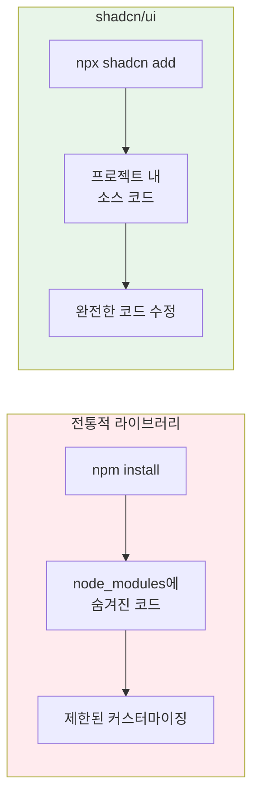
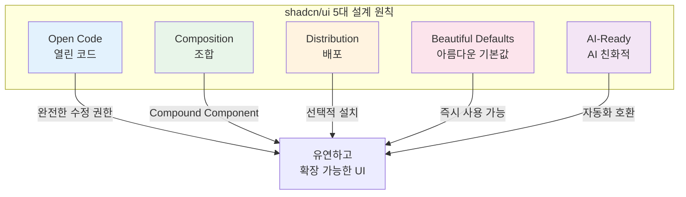
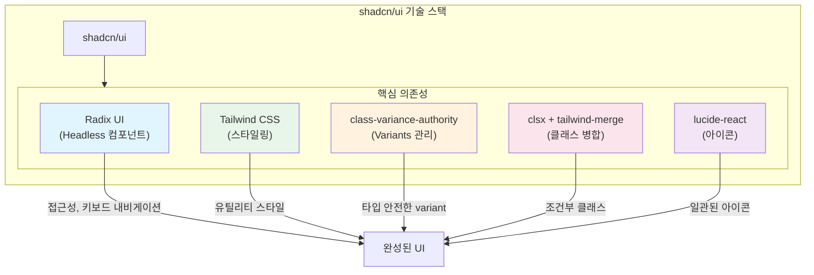
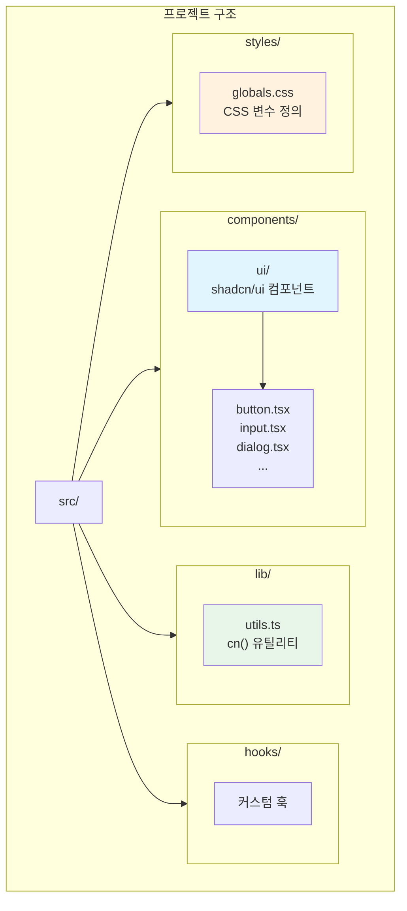
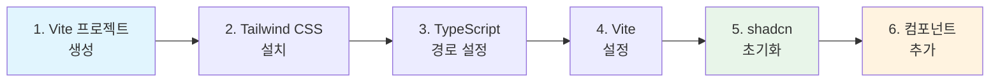
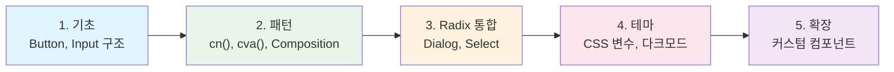

# shadcn/ui 개요 및 설계 철학

## shadcn/ui란?

**shadcn/ui**는 전통적인 npm 패키지 방식의 컴포넌트 라이브러리가 아닌 **"코드 배포 플랫폼"**입니다. 일반적인 UI 라이브러리는 node_modules 안에 코드가 숨겨져 있어 수정이 어렵지만, shadcn/ui는 실제 컴포넌트 소스 코드를 프로젝트에 직접 복사하여 완전한 커스터마이징을 가능하게 합니다. 이 방식은 "코드가 곧 문서"라는 철학을 따르며, 개발자가 컴포넌트의 내부 동작을 완전히 이해하고 제어할 수 있게 해줍니다.



### 핵심 차별점

| 전통적 라이브러리 | shadcn/ui |
|-----------------|-----------|
| `npm install component-lib` | `npx shadcn add button` |
| node_modules에 숨겨진 코드 | 프로젝트 내 소스 코드 |
| 제한된 커스터마이징 | 완전한 코드 수정 가능 |
| 버전 업데이트 강제 | 선택적 업데이트 |

---

## 5가지 설계 원칙

shadcn/ui는 다섯 가지 핵심 설계 원칙을 따릅니다. 이 원칙들은 개발자 경험과 코드 품질을 모두 고려한 것입니다.



### 1. Open Code (열린 코드)

**Open Code** 원칙은 모든 컴포넌트 소스 코드가 프로젝트에 직접 추가된다는 것을 의미합니다. 개발자는 완전한 수정 권한을 가지며, 필요에 따라 어떤 부분이든 자유롭게 변경할 수 있습니다. "코드가 곧 문서"라는 철학에 따라, 별도의 API 문서 없이도 코드를 직접 읽고 이해할 수 있습니다.

### 2. Composition (조합)

**Composition** 원칙은 모든 컴포넌트가 일관된 조합 가능한 인터페이스를 제공한다는 것입니다. shadcn/ui는 **Compound Component 패턴**을 적극적으로 활용하여, 작은 단위의 컴포넌트를 조합해 복잡한 UI를 구성할 수 있게 합니다. 이 방식은 컴포넌트의 유연성을 극대화하고 재사용성을 높입니다.

```tsx
// Composition 예시 - 작은 컴포넌트들을 조합하여 Dialog 구성
<Dialog>
  <DialogTrigger>Open</DialogTrigger>
  <DialogContent>
    <DialogHeader>
      <DialogTitle>제목</DialogTitle>
    </DialogHeader>
  </DialogContent>
</Dialog>
```

### 3. Distribution (배포)

**Distribution** 원칙은 평면 파일 구조와 CLI 기반 배포를 통해 필요한 컴포넌트만 선택적으로 추가할 수 있다는 것입니다. 불필요한 컴포넌트를 포함하지 않아 프로젝트 크기를 최적화할 수 있으며, 각 컴포넌트는 독립적으로 관리됩니다.

### 4. Beautiful Defaults (아름다운 기본값)

**Beautiful Defaults** 원칙은 세심하게 선택된 기본 스타일을 제공하여 별도의 커스터마이징 없이도 즉시 사용할 수 있다는 것입니다. 일관된 디자인 시스템을 기반으로 하여 전문적인 UI를 빠르게 구축할 수 있습니다.

### 5. AI-Ready (AI 친화적)

**AI-Ready** 원칙은 LLM(Large Language Model)이 읽고 수정할 수 있는 명확한 코드 구조를 갖추고 있다는 것입니다. 일관된 코드 패턴과 자동화 도구와의 호환성을 통해 AI 기반 개발 워크플로우를 지원합니다.

---

## 기술 스택

shadcn/ui는 여러 검증된 오픈소스 라이브러리들을 조합하여 구축되었습니다. 각 라이브러리는 특정 역할을 담당하며, 함께 사용될 때 강력한 시너지를 발휘합니다.



### 1. Radix UI

**Radix UI**는 Headless UI 프리미티브를 제공하는 라이브러리입니다. "Headless"란 스타일이 없고 동작 로직만 제공한다는 의미입니다. 접근성(a11y), 키보드 내비게이션, 복잡한 상태 관리가 모두 내장되어 있어 개발자는 스타일링에만 집중할 수 있습니다.

**주요 패키지 예시**:
- `@radix-ui/react-dialog` - 모달 다이얼로그
- `@radix-ui/react-select` - 드롭다운 선택
- `@radix-ui/react-tabs` - 탭 인터페이스

### 2. Tailwind CSS

**Tailwind CSS**는 유틸리티 기반 스타일링 프레임워크입니다. CSS 변수 기반 테마 시스템을 지원하여 다크 모드와 커스텀 테마를 쉽게 구현할 수 있습니다. shadcn/ui의 모든 컴포넌트 스타일링은 Tailwind CSS를 기반으로 합니다.

### 3. class-variance-authority (cva)

**cva**는 컴포넌트 변형(variants)을 타입 안전하게 관리하는 라이브러리입니다. 버튼의 크기(sm, md, lg)나 스타일(primary, secondary, destructive) 같은 변형을 선언적으로 정의하고, TypeScript의 타입 추론을 활용하여 오타나 잘못된 값을 컴파일 시점에 방지합니다.

```tsx
import { cva } from "class-variance-authority"

const buttonVariants = cva(
  // 기본 클래스 (모든 variant에 공통 적용)
  "inline-flex items-center justify-center rounded-md text-sm font-medium",
  {
    variants: {
      variant: {
        default: "bg-primary text-primary-foreground",
        destructive: "bg-destructive text-destructive-foreground",
        outline: "border border-input bg-background",
      },
      size: {
        default: "h-10 px-4 py-2",
        sm: "h-9 rounded-md px-3",
        lg: "h-11 rounded-md px-8",
      },
    },
    defaultVariants: {
      variant: "default",
      size: "default",
    },
  }
)
```

### 4. cn() 유틸리티

**cn()** 함수는 조건부 클래스 병합을 위한 유틸리티입니다. `clsx`로 조건부 클래스를 처리하고, `tailwind-merge`로 Tailwind 클래스 충돌을 해결합니다. 예를 들어 `p-2`와 `p-4`가 동시에 적용되면 후자만 유지됩니다.

```tsx
// lib/utils.ts
import { clsx, type ClassValue } from "clsx"
import { twMerge } from "tailwind-merge"

export function cn(...inputs: ClassValue[]) {
  return twMerge(clsx(inputs))
}

// 사용 예시 - 조건부로 클래스 적용하고 외부 클래스와 병합
<div className={cn(
  "base-styles",
  isActive && "active-styles",
  className // 외부에서 전달받은 클래스
)} />
```

---

## 프로젝트 구조

shadcn/ui를 사용하는 프로젝트는 다음과 같은 구조를 따릅니다. 모든 UI 컴포넌트는 `components/ui` 디렉토리에 위치하며, 유틸리티 함수는 `lib` 디렉토리에, 커스텀 훅은 `hooks` 디렉토리에 배치됩니다.



```
src/
├── components/
│   └── ui/                 # shadcn/ui 컴포넌트
│       ├── button.tsx
│       ├── input.tsx
│       ├── dialog.tsx
│       └── ...
├── lib/
│   └── utils.ts            # cn() 유틸리티
├── hooks/                  # 커스텀 훅
└── styles/
    └── globals.css         # CSS 변수 정의
```

### components.json

`components.json`은 shadcn/ui CLI가 사용하는 프로젝트 설정 파일입니다. 스타일 프리셋, 경로 별칭, 테마 설정 등을 정의합니다.

```json
{
  "style": "new-york",
  "rsc": false,
  "tailwind": {
    "config": "tailwind.config.js",
    "css": "src/index.css",
    "baseColor": "neutral",
    "cssVariables": true
  },
  "aliases": {
    "components": "@/components",
    "utils": "@/lib/utils",
    "ui": "@/components/ui",
    "lib": "@/lib",
    "hooks": "@/hooks"
  },
  "iconLibrary": "lucide"
}
```

---

## 설치 방법 (Vite + React)

Vite와 React 환경에서 shadcn/ui를 설정하는 과정을 단계별로 설명합니다.



### 1단계: Vite 프로젝트 생성
```bash
npm create vite@latest my-app -- --template react-ts
cd my-app
```

### 2단계: Tailwind CSS 설치
```bash
npm install tailwindcss @tailwindcss/vite
```

`src/index.css`:
```css
@import "tailwindcss";
```

### 3단계: TypeScript 경로 설정

**tsconfig.json**에서 `@/` 경로 별칭을 설정합니다. 이를 통해 상대 경로 대신 절대 경로를 사용할 수 있습니다.

```json
{
  "compilerOptions": {
    "baseUrl": ".",
    "paths": {
      "@/*": ["./src/*"]
    }
  }
}
```

### 4단계: Vite 설정

`@types/node`를 설치하고 `vite.config.ts`에서 경로 별칭을 설정합니다.

```bash
npm install -D @types/node
```

**vite.config.ts**:
```typescript
import path from "path"
import tailwindcss from "@tailwindcss/vite"
import react from "@vitejs/plugin-react"
import { defineConfig } from "vite"

export default defineConfig({
  plugins: [react(), tailwindcss()],
  resolve: {
    alias: {
      "@": path.resolve(__dirname, "./src"),
    },
  },
})
```

### 5단계: shadcn 초기화

CLI를 통해 프로젝트를 초기화합니다. 이 과정에서 `components.json` 파일과 기본 설정이 생성됩니다.

```bash
npx shadcn@latest init
```

### 6단계: 컴포넌트 추가

필요한 컴포넌트를 선택적으로 추가합니다. 추가된 컴포넌트는 `components/ui` 디렉토리에 소스 코드로 복사됩니다.

```bash
npx shadcn@latest add button
```

---

## CSS 변수 기반 테마

shadcn/ui는 **CSS 변수**를 사용하여 테마를 관리합니다. 이 방식은 다크 모드 전환을 간단하게 만들고, 런타임에 테마를 동적으로 변경할 수 있게 합니다. 색상 값은 HSL 형식으로 정의되어 명도와 채도 조절이 용이합니다.

```mermaid
flowchart TB
    subgraph Theme["CSS 변수 기반 테마 시스템"]
        subgraph Light[":root (라이트 모드)"]
            L1["--background: 0 0% 100%"]
            L2["--foreground: 222.2 84% 4.9%"]
            L3["--primary: 222.2 47.4% 11.2%"]
        end

        subgraph Dark[".dark (다크 모드)"]
            D1["--background: 222.2 84% 4.9%"]
            D2["--foreground: 210 40% 98%"]
            D3["--primary: 210 40% 98%"]
        end
    end

    Light --> |"class='dark' 추가"| Dark

    style Light fill:#fff9c4
    style Dark fill:#37474f
```



```css
/* globals.css */
:root {
  --background: 0 0% 100%;
  --foreground: 222.2 84% 4.9%;
  --primary: 222.2 47.4% 11.2%;
  --primary-foreground: 210 40% 98%;
  /* ... */
}

.dark {
  --background: 222.2 84% 4.9%;
  --foreground: 210 40% 98%;
  --primary: 210 40% 98%;
  --primary-foreground: 222.2 47.4% 11.2%;
  /* ... */
}
```

Tailwind에서 CSS 변수를 사용하여 스타일을 적용합니다:

```tsx
<div className="bg-background text-foreground">
  <button className="bg-primary text-primary-foreground">
    Click me
  </button>
</div>
```

---

## 학습 로드맵

shadcn/ui를 효과적으로 학습하기 위한 단계별 로드맵입니다.



1. **기초**: Button, Input 컴포넌트의 내부 구조를 분석하여 기본 패턴을 이해합니다.
2. **패턴**: cn() 유틸리티, cva() variant 시스템, Composition 패턴을 학습합니다.
3. **Radix 통합**: Dialog, Select 등 Radix UI를 기반으로 한 복잡한 컴포넌트를 이해합니다.
4. **테마**: CSS 변수 시스템과 다크 모드 구현 방법을 학습합니다.
5. **확장**: 기존 패턴을 활용하여 프로젝트에 맞는 커스텀 컴포넌트를 제작합니다.

---

## 참고 자료

- 공식 문서: https://ui.shadcn.com/docs
- GitHub: https://github.com/shadcn-ui/ui
- Radix UI: https://www.radix-ui.com/
- Tailwind CSS: https://tailwindcss.com/
