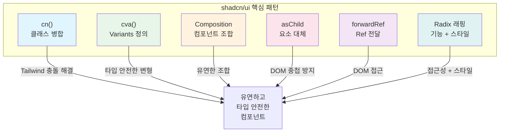
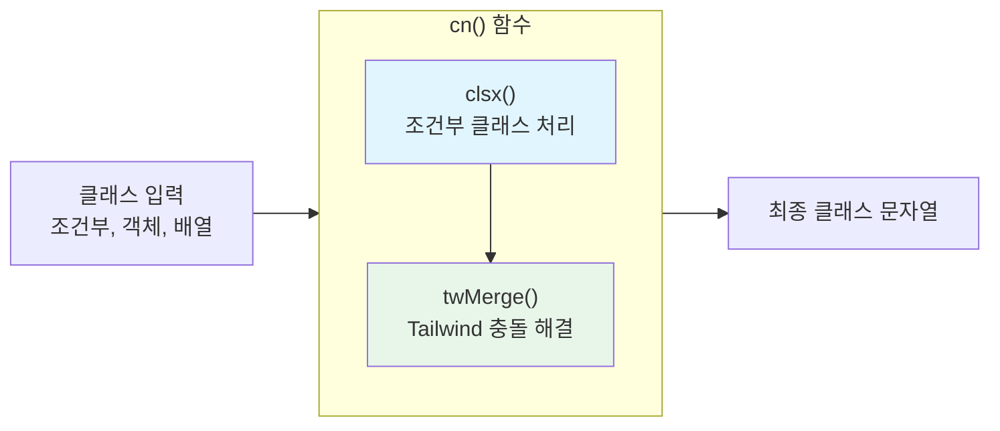
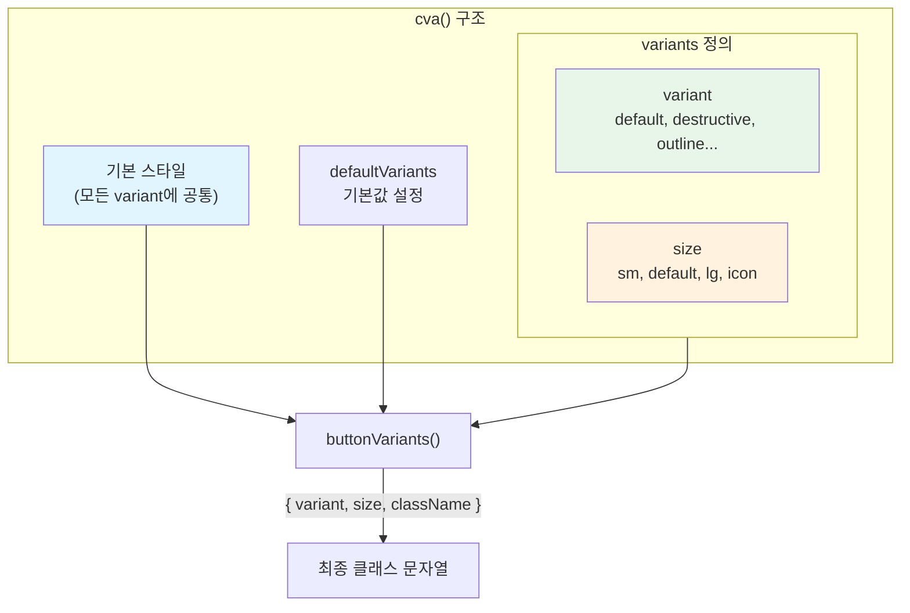
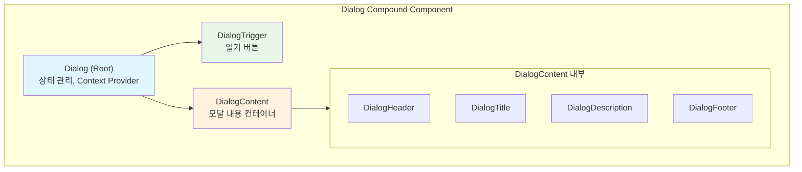
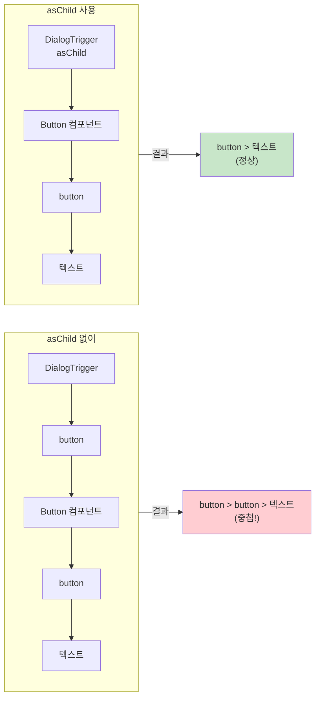
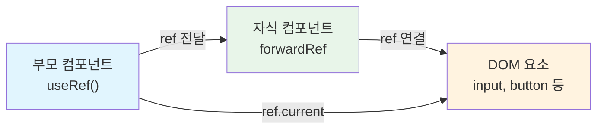
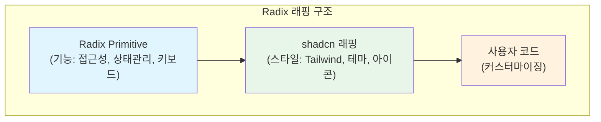

# shadcn/ui 핵심 패턴

## 개요

shadcn/ui는 몇 가지 핵심 패턴을 일관되게 사용합니다. 이 패턴들은 컴포넌트의 유연성, 타입 안전성, 그리고 재사용성을 극대화하기 위해 설계되었습니다. 이 패턴들을 한 번 이해하면 모든 shadcn/ui 컴포넌트의 구조를 쉽게 파악할 수 있으며, 자신만의 커스텀 컴포넌트를 만들 때도 동일한 패턴을 적용할 수 있습니다.



---

## 1. cn() 유틸리티 함수

### 정의

**cn()** 함수는 조건부 클래스 병합을 위한 유틸리티 함수입니다. Tailwind CSS를 사용할 때 발생하는 클래스 충돌 문제를 해결하고, 조건부로 클래스를 적용할 수 있게 해줍니다. shadcn/ui의 모든 컴포넌트에서 사용되는 가장 기본적인 유틸리티입니다.

```typescript
// lib/utils.ts
import { clsx, type ClassValue } from "clsx"
import { twMerge } from "tailwind-merge"

export function cn(...inputs: ClassValue[]) {
  return twMerge(clsx(inputs))
}
```

### 구성 요소

cn() 함수는 두 개의 라이브러리를 조합하여 동작합니다.



| 라이브러리 | 역할 |
|-----------|------|
| `clsx` | 조건부 클래스 문자열 생성 (false, null, undefined 값 제외) |
| `tailwind-merge` | Tailwind 클래스 충돌 해결 (px-4와 px-6이 함께 있으면 px-6만 유지) |

### 사용 예시

```tsx
// 기본 사용 - 여러 클래스 문자열 병합
cn("px-4 py-2", "bg-blue-500")
// → "px-4 py-2 bg-blue-500"

// 조건부 클래스 - isActive가 false면 해당 클래스 제외
cn("base-class", isActive && "active-class")
// isActive가 true면 → "base-class active-class"
// isActive가 false면 → "base-class"

// 객체 문법 - key가 클래스명, value가 조건
cn("base", {
  "text-red-500": hasError,
  "text-green-500": isSuccess,
})

// Tailwind 충돌 해결 - 동일한 속성의 클래스가 있으면 마지막 값 유지
cn("px-4", "px-6")
// → "px-6" (나중 값이 우선)

// 실제 컴포넌트에서 활용 - 기본 스타일 + 조건부 스타일 + 외부 클래스
<div className={cn(
  "rounded-lg border p-4",      // 기본 스타일
  variant === "error" && "border-red-500",
  className                      // 외부 전달 클래스
)} />
```

### 왜 cn()이 필요한가?

cn() 함수가 없다면 Tailwind 클래스 충돌로 인해 예측 불가능한 스타일이 적용될 수 있습니다. 아래 예시에서 그 차이를 명확히 볼 수 있습니다.

```tsx
// 문제 상황: Button 컴포넌트 내부에 px-4가 정의되어 있을 때
<Button className="px-8" />

// cn() 없이: "px-4 px-8" (CSS 우선순위에 따라 어떤 게 적용될지 예측 불가)
// cn() 사용: "px-8" (나중에 전달된 값이 확실히 적용됨)
```

---

## 2. cva() - Class Variance Authority

### 정의

**cva()** 함수는 컴포넌트 변형(variants)을 타입 안전하게 정의하는 함수입니다. 버튼의 크기(sm, md, lg)나 스타일(primary, secondary, destructive) 같은 변형을 선언적으로 정의하고, TypeScript의 타입 추론을 통해 잘못된 값을 컴파일 시점에 방지합니다.



### 기본 구조

```typescript
import { cva, type VariantProps } from "class-variance-authority"

const buttonVariants = cva(
  // 1. 기본 스타일 (모든 variant에 공통 적용)
  "inline-flex items-center justify-center rounded-md text-sm font-medium transition-colors focus-visible:outline-none disabled:pointer-events-none disabled:opacity-50",

  // 2. variants 정의
  {
    variants: {
      variant: {
        default: "bg-primary text-primary-foreground hover:bg-primary/90",
        destructive: "bg-destructive text-destructive-foreground hover:bg-destructive/90",
        outline: "border border-input bg-background hover:bg-accent hover:text-accent-foreground",
        secondary: "bg-secondary text-secondary-foreground hover:bg-secondary/80",
        ghost: "hover:bg-accent hover:text-accent-foreground",
        link: "text-primary underline-offset-4 hover:underline",
      },
      size: {
        default: "h-10 px-4 py-2",
        sm: "h-9 rounded-md px-3",
        lg: "h-11 rounded-md px-8",
        icon: "h-10 w-10",
      },
    },
    // 3. 기본값 - prop을 전달하지 않았을 때 적용되는 값
    defaultVariants: {
      variant: "default",
      size: "default",
    },
  }
)
```

### 컴포넌트에서 사용

cva로 정의한 variants를 컴포넌트에서 사용할 때는 **VariantProps** 타입을 활용하여 타입 안전성을 확보합니다.

```tsx
import { cva, type VariantProps } from "class-variance-authority"
import { cn } from "@/lib/utils"

const buttonVariants = cva(/* ... */)

// VariantProps로 variant와 size의 타입을 자동 추출
type ButtonProps = React.ButtonHTMLAttributes<HTMLButtonElement> &
  VariantProps<typeof buttonVariants>

function Button({ className, variant, size, ...props }: ButtonProps) {
  return (
    <button
      className={cn(buttonVariants({ variant, size, className }))}
      {...props}
    />
  )
}
```

### 사용 예시

```tsx
// 기본 (default/default) - variant와 size를 지정하지 않으면 defaultVariants 적용
<Button>Click me</Button>

// variant 지정 - 버튼의 시각적 스타일 변경
<Button variant="destructive">Delete</Button>
<Button variant="outline">Cancel</Button>
<Button variant="ghost">Menu</Button>

// size 지정 - 버튼의 크기 변경
<Button size="sm">Small</Button>
<Button size="lg">Large</Button>
<Button size="icon"><IconComponent /></Button>

// variant와 size 조합
<Button variant="outline" size="lg">Large Outline</Button>

// 커스텀 클래스 추가 - cn()을 통해 기존 스타일과 병합
<Button className="w-full">Full Width</Button>
```

### cva의 장점

| 장점 | 설명 |
|-----|------|
| **타입 안전성** | TypeScript 자동완성으로 오타 방지, 잘못된 variant 값을 컴파일 시점에 감지 |
| **일관성** | variant 조합이 명확하게 정의되어 디자인 시스템 유지가 용이 |
| **유지보수** | 스타일 변경 시 cva 정의 한 곳만 수정하면 모든 사용처에 반영 |
| **가독성** | 컴포넌트 사용 코드가 `variant="destructive"`처럼 선언적이고 깔끔 |

---

## 3. Composition 패턴 (Compound Component)

### 정의

**Composition 패턴(Compound Component)**은 하나의 복잡한 컴포넌트를 여러 개의 작은 컴포넌트로 분리하여 조합하는 패턴입니다. 부모 컴포넌트가 상태를 관리하고, 자식 컴포넌트들이 그 상태를 공유하면서 각자의 역할을 수행합니다. HTML의 `<select>`와 `<option>` 관계와 비슷합니다.



### 예시: Dialog 컴포넌트

Dialog 컴포넌트는 Compound Component 패턴의 대표적인 예시입니다. 각 부분이 명확한 역할을 가지며, 사용자가 필요한 부분만 선택적으로 사용할 수 있습니다.

```tsx
// 사용 예시 - JSX 구조가 실제 UI 구조를 그대로 반영
<Dialog>
  <DialogTrigger asChild>
    <Button>Open Dialog</Button>
  </DialogTrigger>
  <DialogContent>
    <DialogHeader>
      <DialogTitle>제목</DialogTitle>
      <DialogDescription>설명 텍스트</DialogDescription>
    </DialogHeader>
    <div>본문 내용</div>
    <DialogFooter>
      <Button variant="outline">취소</Button>
      <Button>확인</Button>
    </DialogFooter>
  </DialogContent>
</Dialog>
```

### Compound Component의 구조

내부적으로 Radix UI의 프리미티브를 래핑하여 구현됩니다. 각 컴포넌트는 특정 역할을 담당합니다.

```tsx
// 내부 구현 (간략화)
import * as DialogPrimitive from "@radix-ui/react-dialog"

// Root - 상태 관리 (Context Provider 역할)
const Dialog = DialogPrimitive.Root

// Trigger - 열기 버튼 역할
const DialogTrigger = DialogPrimitive.Trigger

// Content - 모달 내용을 담는 컨테이너
const DialogContent = React.forwardRef<...>(({ className, ...props }, ref) => (
  <DialogPrimitive.Portal>
    <DialogPrimitive.Overlay className="fixed inset-0 bg-black/50" />
    <DialogPrimitive.Content
      ref={ref}
      className={cn("fixed ... rounded-lg bg-background p-6", className)}
      {...props}
    />
  </DialogPrimitive.Portal>
))

// Header, Title, Description, Footer 등 추가 컴포넌트들...
```

### 장점

1. **유연성**: 원하는 부분만 선택적으로 사용할 수 있습니다. 예를 들어 Description 없이 Title만 사용할 수 있습니다.
2. **가독성**: JSX 구조가 실제 UI 구조를 그대로 반영하여 코드를 읽기만 해도 UI가 어떻게 구성되는지 파악할 수 있습니다.
3. **재사용성**: 각 부분을 독립적으로 커스터마이징할 수 있어 다양한 변형을 쉽게 만들 수 있습니다.
4. **접근성**: 각 역할(Trigger, Title, Description 등)이 명확히 분리되어 ARIA 속성이 자동으로 적용됩니다.

---

## 4. asChild 패턴 (Slot)

### 정의

**asChild** prop은 컴포넌트가 자신의 DOM 요소 대신 자식 요소를 렌더링하게 합니다. 이를 통해 컴포넌트의 동작은 유지하면서 렌더링되는 요소를 변경할 수 있습니다. Radix UI의 Slot 컴포넌트를 기반으로 구현됩니다.



### 기본 동작

```tsx
// asChild 없이 (기본) - DOM 요소가 중첩됨
<DialogTrigger>
  <Button>Open</Button>
</DialogTrigger>
// 결과: <button><button>Open</button></button> (중첩!)

// asChild 사용 - 자식 요소가 그대로 렌더링됨
<DialogTrigger asChild>
  <Button>Open</Button>
</DialogTrigger>
// 결과: <button>Open</button> (단일 버튼)
```

### 내부 구현 (Radix Slot)

asChild 패턴은 Radix UI의 Slot 컴포넌트를 사용하여 구현됩니다. asChild가 true이면 Slot을 렌더링하고, false이면 지정된 요소를 렌더링합니다.

```tsx
import { Slot } from "@radix-ui/react-slot"

interface ButtonProps extends React.ButtonHTMLAttributes<HTMLButtonElement> {
  asChild?: boolean
}

function Button({ asChild = false, ...props }: ButtonProps) {
  const Comp = asChild ? Slot : "button"
  return <Comp {...props} />
}
```

### 활용 사례

asChild 패턴은 컴포넌트의 동작은 유지하면서 렌더링 요소를 변경해야 할 때 유용합니다.

```tsx
// 1. Link와 Button 조합 - 버튼 스타일이지만 링크로 동작
<Button asChild>
  <Link href="/dashboard">Dashboard</Link>
</Button>

// 2. 커스텀 요소 사용 - div를 클릭 가능한 트리거로 사용
<DialogTrigger asChild>
  <div className="cursor-pointer">Click me</div>
</DialogTrigger>

// 3. 아이콘 버튼을 링크로 - 버튼 스타일의 아이콘 링크
<Button asChild size="icon">
  <a href="/settings" aria-label="Settings">
    <SettingsIcon />
  </a>
</Button>
```

---

## 5. forwardRef 패턴

### 정의

**forwardRef** 패턴은 부모 컴포넌트에서 자식 컴포넌트의 DOM 요소에 직접 접근할 수 있게 ref를 전달합니다. React에서 함수 컴포넌트는 기본적으로 ref를 받을 수 없기 때문에, forwardRef를 사용하여 ref를 명시적으로 전달해야 합니다.



### 구현

shadcn/ui의 모든 컴포넌트는 forwardRef를 사용하여 ref를 전달할 수 있게 구현되어 있습니다.

```tsx
import * as React from "react"

interface InputProps extends React.InputHTMLAttributes<HTMLInputElement> {}

const Input = React.forwardRef<HTMLInputElement, InputProps>(
  ({ className, type, ...props }, ref) => {
    return (
      <input
        type={type}
        className={cn(
          "flex h-10 w-full rounded-md border border-input bg-background px-3 py-2",
          className
        )}
        ref={ref}  // 전달받은 ref를 실제 DOM 요소에 연결
        {...props}
      />
    )
  }
)
Input.displayName = "Input"  // React DevTools에서 컴포넌트 이름 표시

export { Input }
```

### 사용

forwardRef로 구현된 컴포넌트는 useRef를 통해 DOM 요소에 직접 접근할 수 있습니다.

```tsx
function Form() {
  const inputRef = React.useRef<HTMLInputElement>(null)

  const focusInput = () => {
    inputRef.current?.focus()  // DOM 메서드 직접 호출
  }

  return (
    <>
      <Input ref={inputRef} placeholder="Enter text" />
      <Button onClick={focusInput}>Focus Input</Button>
    </>
  )
}
```

### React 19+ 변경사항

React 19부터는 forwardRef 없이 props로 직접 ref를 받을 수 있게 됩니다. 이는 코드를 더 간결하게 만들어줍니다.

```tsx
// React 19+ 방식 - forwardRef 없이 직접 ref를 props로 받음
function Input({ className, ref, ...props }: InputProps & { ref?: React.Ref<HTMLInputElement> }) {
  return (
    <input
      data-slot="input"
      ref={ref}
      className={cn("...", className)}
      {...props}
    />
  )
}
```

---

## 6. Radix UI 래핑 패턴

### 구조

shadcn/ui는 Radix UI의 headless 컴포넌트를 래핑하여 스타일과 테마를 추가합니다. Radix가 접근성과 동작을 담당하고, shadcn이 시각적 스타일을 담당하는 구조입니다.



### 예시: Select 컴포넌트

Select 컴포넌트가 어떻게 Radix를 래핑하는지 살펴봅니다.

```tsx
import * as SelectPrimitive from "@radix-ui/react-select"
import { cn } from "@/lib/utils"

// Root는 기능만 필요하므로 그대로 내보내기
const Select = SelectPrimitive.Root

// Trigger는 스타일을 추가하여 래핑
const SelectTrigger = React.forwardRef<
  React.ElementRef<typeof SelectPrimitive.Trigger>,
  React.ComponentPropsWithoutRef<typeof SelectPrimitive.Trigger>
>(({ className, children, ...props }, ref) => (
  <SelectPrimitive.Trigger
    ref={ref}
    className={cn(
      // shadcn이 추가하는 Tailwind 스타일
      "flex h-10 w-full items-center justify-between rounded-md border",
      "border-input bg-background px-3 py-2 text-sm",
      "focus:outline-none focus:ring-2 focus:ring-ring",
      className  // 사용자 커스터마이징 허용
    )}
    {...props}
  >
    {children}
    {/* 아이콘도 shadcn이 추가 */}
    <SelectPrimitive.Icon asChild>
      <ChevronDown className="h-4 w-4 opacity-50" />
    </SelectPrimitive.Icon>
  </SelectPrimitive.Trigger>
))
```

### Radix가 제공하는 것

| 기능 | 설명 |
|-----|------|
| **접근성** | ARIA 속성 자동 적용, 스크린 리더 지원 |
| **키보드 내비게이션** | 화살표 키, Enter, Escape 등 키보드로 조작 가능 |
| **상태 관리** | open/close, selected 상태 등 내부적으로 관리 |
| **포지셔닝** | Portal을 통한 레이어 관리, Floating UI로 자동 위치 조정 |
| **애니메이션** | data-state 속성을 통한 CSS 애니메이션 트리거 |

### shadcn이 추가하는 것

| 기능 | 설명 |
|-----|------|
| **스타일** | Tailwind CSS 유틸리티 클래스로 시각적 스타일 적용 |
| **테마** | CSS 변수 기반 색상 시스템(bg-background, text-foreground 등) |
| **아이콘** | lucide-react 아이콘 통합(ChevronDown, X 등) |
| **커스터마이징** | className prop을 통해 사용자가 스타일 확장 가능 |

---

## 패턴 요약

| 패턴 | 목적 | 핵심 |
|-----|------|------|
| `cn()` | 클래스 병합 | Tailwind 충돌 해결, 조건부 클래스 |
| `cva()` | Variants 정의 | 타입 안전한 스타일 변형 |
| Composition | 컴포넌트 분리 | 유연한 조합, 역할 분리 |
| asChild | 요소 대체 | DOM 중첩 방지, 요소 교체 |
| forwardRef | Ref 전달 | DOM 접근 허용 |
| Radix 래핑 | 기능 + 스타일 | 접근성 + 커스터마이징 |

---

## 다음 단계

이 패턴들을 이해했다면, 다음 문서에서 실제 컴포넌트(Button, Input)를 분석하며 패턴이 어떻게 적용되는지 살펴봅니다.
